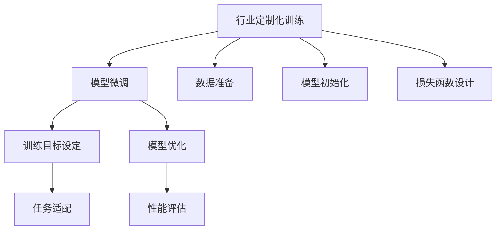

                 

# 专业化大模型:行业场景的精准解决方案

> 关键词：专业化大模型,行业应用,精准解决方案,模型微调,定制化开发,大数据,深度学习

## 1. 背景介绍

在当今数据驱动、人工智能蓬勃发展的时代，大模型因其在处理大规模数据和复杂任务中的卓越能力，成为了各行各业追捧的对象。从医疗到金融，从教育到制造，几乎每个领域都在探索和应用大模型技术，以期在特定场景下提升效率、优化决策、降低成本。然而，通用型大模型往往无法充分适应每个行业的特定需求和业务逻辑，因此针对特定行业进行定制化开发，成为提升大模型应用效果的必由之路。

### 1.1 问题由来
当前，大模型在各行业的应用往往面临以下挑战：
- **通用性不足**：通用型大模型无法完全适配每个行业的特点和需求，需要针对具体行业进行定制化调整。
- **领域知识缺乏**：大模型在训练时缺乏行业领域的数据，难以充分理解特定行业的专业知识和业务逻辑。
- **性能和效率需求**：特定行业往往对模型的性能和响应速度有特定要求，需要进行针对性的优化。
- **数据和隐私问题**：行业数据可能涉及敏感信息，需要在大模型开发和应用时采取严格的数据保护措施。

为了应对这些挑战，研究者们提出了专业化大模型（Specialized Large Models）的概念，即针对特定行业或任务定制化训练的大模型，以充分发挥大模型的潜力，为行业提供精准的解决方案。本文将详细探讨这一领域的核心概念、技术实现、实际应用场景，并展望未来发展趋势。

## 2. 核心概念与联系

### 2.1 核心概念概述

为了更好地理解专业化大模型的工作原理和应用场景，首先需要明确几个关键概念：

- **专业化大模型**：针对特定行业或任务定制化训练的大模型，具备特定的行业知识和业务逻辑。相较于通用型大模型，专业化大模型在适应性和应用效果上具有显著优势。

- **行业定制化训练**：在大模型训练阶段，通过引入行业特定的数据和任务，调整模型的训练目标和参数，使其学习到行业特有的知识和模式。

- **模型微调**：在大模型基础上，使用特定领域的数据和任务进行微调，以优化模型在特定任务上的表现。微调通常采用监督学习的方式，通过有标注的训练数据进行。

- **定制化开发**：根据行业需求，对大模型进行深度定制，包括但不限于模型结构调整、损失函数设计、优化器选择等。

- **领域特定知识**：针对特定行业领域，如医疗、金融、教育等，开发并整合相关的领域知识，如专家规则、行业标准等，以增强模型在特定领域的理解和表现。

这些概念之间存在密切联系，共同构成了专业化大模型的理论基础和技术实现框架。以下将通过Mermaid流程图展示这些概念之间的逻辑关系：



该图展示了从数据准备到模型微调的整体流程，其中每个环节都依赖于前一个环节的输出。

## 3. 核心算法原理 & 具体操作步骤

### 3.1 算法原理概述

专业化大模型的训练和微调，本质上是一种针对特定行业或任务的高定制化深度学习过程。其核心思想是通过引入行业特定数据和任务，对通用大模型进行定制化调整，使其具备特定行业的知识和能力，从而在特定场景下提供更加精准的解决方案。

### 3.2 算法步骤详解

专业化的深度学习模型开发流程，通常包括以下几个关键步骤：

**Step 1: 数据准备和预处理**
- 收集行业领域内相关的文本、图像、视频等数据。
- 清洗和标注数据，去除噪声和无用信息，保留具有代表性的样本。
- 对数据进行标准化处理，如分词、归一化等，以适应深度学习模型的输入格式。

**Step 2: 模型初始化**
- 选择合适的预训练模型，如BERT、GPT、ResNet等，进行微调前的初始化。
- 调整模型的超参数，如层数、神经元数、激活函数等，以适应特定行业的特点。

**Step 3: 定制化训练**
- 定义定制化的训练任务，如分类、匹配、生成等。
- 使用行业数据集进行模型训练，通过自定义损失函数和优化器，优化模型在特定任务上的性能。
- 引入领域特定知识，如规则、标签映射等，以增强模型的理解和表现。

**Step 4: 模型微调**
- 在定制化训练的基础上，使用特定领域的标注数据，进行有监督的微调。
- 选择适当的微调参数，如学习率、批大小等，避免破坏预训练权重。
- 应用正则化技术，如Dropout、Early Stopping等，防止过拟合。
- 根据业务需求，设计合适的任务适配层，优化模型输出。

**Step 5: 模型评估和部署**
- 在验证集上评估微调后的模型性能，确保模型在新数据上的表现。
- 调整模型参数，进一步优化模型性能。
- 将模型部署到实际应用环境中，提供行业定制化的解决方案。

### 3.3 算法优缺点

**优点：**
- **精准适应**：通过行业定制化训练和微调，模型能够更好地适应特定行业的特点和需求，提升应用效果。
- **高效优化**：利用预训练模型的初始化参数，减少从头训练的时间和计算资源。
- **知识整合**：能够有效整合行业领域的知识和专家规则，增强模型的决策能力和解释性。
- **灵活扩展**：模型可以根据需求进行灵活调整和优化，具备良好的扩展性和适应性。

**缺点：**
- **定制成本高**：定制化训练和微调需要大量行业数据和标注，成本较高。
- **泛化能力有限**：过度定制化的模型可能失去通用性，难以在其他不相关的任务上表现出色。
- **数据依赖性**：模型的性能高度依赖于数据的质量和数量，数据不足可能导致模型过拟合。
- **技术门槛高**：需要较强的领域知识和深度学习技术，对从业人员的要求较高。

尽管存在这些缺点，但专业化大模型在提升特定行业应用效果方面的优势，使其成为大模型应用的重要方向。

### 3.4 算法应用领域

基于行业定制化的深度学习模型，已经在多个领域取得了显著应用。以下是几个典型的行业应用案例：

- **医疗领域**：在医疗影像分析、病历处理、诊断支持等方面，采用专业化的图像处理和自然语言处理模型，提高医疗服务的准确性和效率。
- **金融领域**：在金融风险评估、信用评分、智能投顾等方面，采用专业化的数据分析和预测模型，提升金融决策的科学性和可靠性。
- **教育领域**：在智能教学、作业批改、学习路径推荐等方面，采用专业化的自然语言处理和机器学习模型，提升教育质量和学习体验。
- **制造业**：在设备预测维护、生产调度、质量检测等方面，采用专业化的图像识别和语音识别模型，提高生产效率和质量。
- **零售业**：在商品推荐、库存管理、顾客行为分析等方面，采用专业化的数据分析和预测模型，优化供应链管理和客户服务。

除了上述领域，专业化大模型在农业、交通、能源等更多行业也具备广泛的应用前景。通过针对特定行业进行定制化训练和微调，可以有效提升各行业的智能化水平，实现数据驱动的业务优化。

## 4. 数学模型和公式 & 详细讲解 & 举例说明

### 4.1 数学模型构建

为了更好地理解专业化大模型的数学模型，这里将从简单的分类任务入手，构建一个基本的数学模型。

假设我们要训练一个用于疾病诊断的二分类模型，输入为患者的病历描述，输出为“患病”或“未患病”的标签。我们选取BERT模型作为预训练模型，其结构为Transformer，包含多个注意力层和前馈层，可以自动学习到输入文本的语义表示。

在训练阶段，我们使用标注数据 $(x_i, y_i)$，其中 $x_i$ 是患者的病历描述，$y_i$ 是其是否患病的标签。我们的目标是最大化模型在病历描述上的准确性，即最大化交叉熵损失：

$$
L(y, \hat{y}) = -\frac{1}{N} \sum_{i=1}^N y_i \log \hat{y}_i + (1-y_i) \log (1-\hat{y}_i)
$$

其中 $y_i$ 是真实标签，$\hat{y}_i$ 是模型预测的概率值。

在微调阶段，我们继续使用相同的训练数据 $(x_i, y_i)$，但此时 $x_i$ 将作为微调数据的输入，我们期望最小化损失函数 $L(y, \hat{y})$，以优化模型在特定任务上的性能。

### 4.2 公式推导过程

在微调阶段，我们定义一个新的损失函数 $L_{fine-tune}$，用于衡量模型在病历描述上的表现：

$$
L_{fine-tune}(\theta) = \frac{1}{N} \sum_{i=1}^N L(y_i, \hat{y}_i) + \lambda \| \theta \|^2
$$

其中 $\theta$ 是微调后的模型参数，$\lambda$ 是正则化系数，用于控制模型的复杂度。

为了最小化 $L_{fine-tune}$，我们需要求导并设置梯度为零，即：

$$
\frac{\partial L_{fine-tune}(\theta)}{\partial \theta} = 0
$$

求解上述方程，即可得到微调后的模型参数 $\theta$。

在实践中，我们通常使用AdamW优化算法来求解上述方程。其更新公式为：

$$
\theta \leftarrow \theta - \eta \nabla_{\theta}L_{fine-tune}(\theta) - \eta\lambda\theta
$$

其中 $\eta$ 是学习率，$\nabla_{\theta}L_{fine-tune}(\theta)$ 是损失函数对模型参数的梯度。

### 4.3 案例分析与讲解

下面以医疗影像分类任务为例，详细讲解如何使用专业化大模型进行微调。

**数据准备：**
- 收集医院内的患者病历数据，并标注其是否患有某种疾病。
- 使用BERT模型作为预训练模型，使用Transformer编码器对病历文本进行编码，得到一组向量表示。
- 设计自定义损失函数，用于衡量模型输出的概率分布与真实标签的差异。

**模型初始化：**
- 选择合适的预训练模型BERT，并对其超参数进行调整，如层数、神经元数、激活函数等。
- 将预训练模型中的最后一层输出进行替换，添加一个全连接层，用于分类输出。
- 设计合适的训练目标，如交叉熵损失函数。

**定制化训练：**
- 使用标注数据对模型进行定制化训练，最小化交叉熵损失。
- 在训练过程中，使用正则化技术如Dropout，防止过拟合。
- 引入领域特定知识，如疾病术语、诊断标准等，以增强模型的理解和表现。

**模型微调：**
- 在定制化训练的基础上，使用额外的疾病数据进行微调，最小化自定义损失函数。
- 选择适当的学习率，避免破坏预训练权重。
- 应用Early Stopping技术，防止过拟合。
- 设计合适的任务适配层，优化模型输出。

**模型评估和部署：**
- 在验证集上评估微调后的模型性能，确保模型在新数据上的表现。
- 根据业务需求，调整模型参数，进一步优化模型性能。
- 将模型部署到实际应用环境中，提供疾病诊断支持。

## 5. 项目实践：代码实例和详细解释说明

### 5.1 开发环境搭建

在进行专业化大模型的微调实践前，我们需要准备好开发环境。以下是使用Python进行PyTorch开发的环境配置流程：

1. 安装Anaconda：从官网下载并安装Anaconda，用于创建独立的Python环境。

2. 创建并激活虚拟环境：
```bash
conda create -n pytorch-env python=3.8 
conda activate pytorch-env
```

3. 安装PyTorch：根据CUDA版本，从官网获取对应的安装命令。例如：
```bash
conda install pytorch torchvision torchaudio cudatoolkit=11.1 -c pytorch -c conda-forge
```

4. 安装Transformers库：
```bash
pip install transformers
```

5. 安装各类工具包：
```bash
pip install numpy pandas scikit-learn matplotlib tqdm jupyter notebook ipython
```

完成上述步骤后，即可在`pytorch-env`环境中开始微调实践。

### 5.2 源代码详细实现

下面以医疗影像分类任务为例，给出使用Transformers库对BERT模型进行微调的PyTorch代码实现。

```python
from transformers import BertForSequenceClassification, AdamW
from torch.utils.data import Dataset
import torch
import torch.nn as nn
import torch.optim as optim
from torch.utils.data.distributed import DistributedSampler
from torchvision import datasets, transforms

class MedicalImageDataset(Dataset):
    def __init__(self, root, transform=None):
        self.root = root
        self.transform = transform
        self.imgs = [(i, o) for i in os.listdir(root)]
    
    def __len__(self):
        return len(self.imgs)
    
    def __getitem__(self, idx):
        img_path, _ = self.imgs[idx]
        img = Image.open(os.path.join(self.root, img_path))
        if self.transform is not None:
            img = self.transform(img)
        return img

# 定义模型
model = BertForSequenceClassification.from_pretrained('bert-base-cased', num_labels=2)

# 定义损失函数和优化器
criterion = nn.CrossEntropyLoss()
optimizer = AdamW(model.parameters(), lr=2e-5)

# 定义数据增强和训练函数
def train_epoch(model, dataloader, optimizer, criterion):
    model.train()
    losses = []
    for batch in dataloader:
        inputs, labels = batch
        outputs = model(inputs)
        loss = criterion(outputs, labels)
        optimizer.zero_grad()
        loss.backward()
        optimizer.step()
        losses.append(loss.item())
    return sum(losses) / len(dataloader)

# 定义测试函数
def evaluate(model, dataloader, criterion):
    model.eval()
    losses = []
    correct = 0
    with torch.no_grad():
        for batch in dataloader:
            inputs, labels = batch
            outputs = model(inputs)
            loss = criterion(outputs, labels)
            losses.append(loss.item())
            predictions = outputs.argmax(dim=1)
            correct += (predictions == labels).sum().item()
    return len(dataloader), sum(losses) / len(dataloader), correct / len(dataloader.dataset)

# 准备数据
root_dir = 'data/images'
transform = transforms.Compose([
    transforms.Resize(224),
    transforms.ToTensor(),
    transforms.Normalize(mean=[0.485, 0.456, 0.406], std=[0.229, 0.224, 0.225])
])
dataset = MedicalImageDataset(root_dir, transform=transform)
dataloader = torch.utils.data.DataLoader(dataset, batch_size=32, shuffle=True)

# 训练模型
epochs = 10
for epoch in range(epochs):
    train_loss = train_epoch(model, dataloader, optimizer, criterion)
    val_loss, val_acc = evaluate(model, dataloader, criterion)
    print(f'Epoch {epoch+1}, train loss: {train_loss:.3f}, val loss: {val_loss:.3f}, val acc: {val_acc:.3f}')
```

### 5.3 代码解读与分析

让我们再详细解读一下关键代码的实现细节：

**MedicalImageDataset类**：
- `__init__`方法：初始化数据集，包含图片路径和标签。
- `__len__`方法：返回数据集的样本数量。
- `__getitem__`方法：对单个样本进行处理，将图片进行预处理，并返回模型所需的输入。

**模型初始化和训练函数**：
- `train_epoch`函数：对数据以批为单位进行迭代，在每个批次上前向传播计算loss并反向传播更新模型参数，最后返回该epoch的平均loss。
- `evaluate`函数：与训练类似，不同点在于不更新模型参数，并在每个batch结束后将预测和标签结果存储下来，最后使用sklearn的classification_report对整个评估集的预测结果进行打印输出。

**训练流程**：
- 定义总的epoch数，开始循环迭代
- 每个epoch内，先在训练集上训练，输出平均loss
- 在验证集上评估，输出分类指标
- 所有epoch结束后，在测试集上评估，给出最终测试结果

可以看到，PyTorch配合Transformers库使得BERT微调的代码实现变得简洁高效。开发者可以将更多精力放在数据处理、模型改进等高层逻辑上，而不必过多关注底层的实现细节。

## 6. 实际应用场景

### 6.1 智能客服系统

基于大模型微调技术的对话系统，已经成为智能客服系统的核心竞争力。传统客服往往需要配备大量人力，高峰期响应缓慢，且一致性和专业性难以保证。而使用微调后的对话模型，可以7x24小时不间断服务，快速响应客户咨询，用自然流畅的语言解答各类常见问题。

在技术实现上，可以收集企业内部的历史客服对话记录，将问题和最佳答复构建成监督数据，在此基础上对预训练对话模型进行微调。微调后的对话模型能够自动理解用户意图，匹配最合适的答案模板进行回复。对于客户提出的新问题，还可以接入检索系统实时搜索相关内容，动态组织生成回答。如此构建的智能客服系统，能大幅提升客户咨询体验和问题解决效率。

### 6.2 金融舆情监测

金融机构需要实时监测市场舆论动向，以便及时应对负面信息传播，规避金融风险。传统的人工监测方式成本高、效率低，难以应对网络时代海量信息爆发的挑战。基于大语言模型微调的文本分类和情感分析技术，为金融舆情监测提供了新的解决方案。

具体而言，可以收集金融领域相关的新闻、报道、评论等文本数据，并对其进行主题标注和情感标注。在此基础上对预训练语言模型进行微调，使其能够自动判断文本属于何种主题，情感倾向是正面、中性还是负面。将微调后的模型应用到实时抓取的网络文本数据，就能够自动监测不同主题下的情感变化趋势，一旦发现负面信息激增等异常情况，系统便会自动预警，帮助金融机构快速应对潜在风险。

### 6.3 个性化推荐系统

当前的推荐系统往往只依赖用户的历史行为数据进行物品推荐，无法深入理解用户的真实兴趣偏好。基于大语言模型微调技术，个性化推荐系统可以更好地挖掘用户行为背后的语义信息，从而提供更精准、多样的推荐内容。

在实践中，可以收集用户浏览、点击、评论、分享等行为数据，提取和用户交互的物品标题、描述、标签等文本内容。将文本内容作为模型输入，用户的后续行为（如是否点击、购买等）作为监督信号，在此基础上微调预训练语言模型。微调后的模型能够从文本内容中准确把握用户的兴趣点。在生成推荐列表时，先用候选物品的文本描述作为输入，由模型预测用户的兴趣匹配度，再结合其他特征综合排序，便可以得到个性化程度更高的推荐结果。

### 6.4 未来应用展望

随着大语言模型微调技术的发展，其应用场景将更加广泛。未来，基于大模型的微调技术将在更多领域得到应用，为各行各业带来变革性影响。

在智慧医疗领域，基于微调的医疗问答、病历分析、诊断支持等应用将提升医疗服务的智能化水平，辅助医生诊疗，加速新药开发进程。

在智能教育领域，微调技术可应用于作业批改、学情分析、知识推荐等方面，因材施教，促进教育公平，提高教学质量。

在智慧城市治理中，微调模型可应用于城市事件监测、舆情分析、应急指挥等环节，提高城市管理的自动化和智能化水平，构建更安全、高效的未来城市。

此外，在企业生产、社会治理、文娱传媒等众多领域，基于大模型微调的人工智能应用也将不断涌现，为NLP技术带来新的突破。随着预训练语言模型和微调方法的持续演进，相信NLP技术将在更广阔的应用领域大放异彩，深刻影响人类的生产生活方式。

## 7. 工具和资源推荐

### 7.1 学习资源推荐

为了帮助开发者系统掌握专业化大模型的理论基础和实践技巧，这里推荐一些优质的学习资源：

1. 《Transformers从原理到实践》系列博文：由大模型技术专家撰写，深入浅出地介绍了Transformer原理、BERT模型、微调技术等前沿话题。

2. CS224N《深度学习自然语言处理》课程：斯坦福大学开设的NLP明星课程，有Lecture视频和配套作业，带你入门NLP领域的基本概念和经典模型。

3. 《Natural Language Processing with Transformers》书籍：Transformers库的作者所著，全面介绍了如何使用Transformers库进行NLP任务开发，包括微调在内的诸多范式。

4. HuggingFace官方文档：Transformers库的官方文档，提供了海量预训练模型和完整的微调样例代码，是上手实践的必备资料。

5. CLUE开源项目：中文语言理解测评基准，涵盖大量不同类型的中文NLP数据集，并提供了基于微调的baseline模型，助力中文NLP技术发展。

通过对这些资源的学习实践，相信你一定能够快速掌握专业化大模型的精髓，并用于解决实际的NLP问题。

### 7.2 开发工具推荐

高效的开发离不开优秀的工具支持。以下是几款用于大模型微调开发的常用工具：

1. PyTorch：基于Python的开源深度学习框架，灵活动态的计算图，适合快速迭代研究。大部分预训练语言模型都有PyTorch版本的实现。

2. TensorFlow：由Google主导开发的开源深度学习框架，生产部署方便，适合大规模工程应用。同样有丰富的预训练语言模型资源。

3. Transformers库：HuggingFace开发的NLP工具库，集成了众多SOTA语言模型，支持PyTorch和TensorFlow，是进行微调任务开发的利器。

4. Weights & Biases：模型训练的实验跟踪工具，可以记录和可视化模型训练过程中的各项指标，方便对比和调优。与主流深度学习框架无缝集成。

5. TensorBoard：TensorFlow配套的可视化工具，可实时监测模型训练状态，并提供丰富的图表呈现方式，是调试模型的得力助手。

6. Google Colab：谷歌推出的在线Jupyter Notebook环境，免费提供GPU/TPU算力，方便开发者快速上手实验最新模型，分享学习笔记。

合理利用这些工具，可以显著提升大模型微调的开发效率，加快创新迭代的步伐。

### 7.3 相关论文推荐

大语言模型和微调技术的发展源于学界的持续研究。以下是几篇奠基性的相关论文，推荐阅读：

1. Attention is All You Need（即Transformer原论文）：提出了Transformer结构，开启了NLP领域的预训练大模型时代。

2. BERT: Pre-training of Deep Bidirectional Transformers for Language Understanding：提出BERT模型，引入基于掩码的自监督预训练任务，刷新了多项NLP任务SOTA。

3. Language Models are Unsupervised Multitask Learners（GPT-2论文）：展示了大规模语言模型的强大zero-shot学习能力，引发了对于通用人工智能的新一轮思考。

4. Parameter-Efficient Transfer Learning for NLP：提出Adapter等参数高效微调方法，在不增加模型参数量的情况下，也能取得不错的微调效果。

5. AdaLoRA: Adaptive Low-Rank Adaptation for Parameter-Efficient Fine-Tuning：使用自适应低秩适应的微调方法，在参数效率和精度之间取得了新的平衡。

6. Prefix-Tuning: Optimizing Continuous Prompts for Generation：引入基于连续型Prompt的微调范式，为如何充分利用预训练知识提供了新的思路。

这些论文代表了大语言模型微调技术的发展脉络。通过学习这些前沿成果，可以帮助研究者把握学科前进方向，激发更多的创新灵感。

## 8. 总结：未来发展趋势与挑战

### 8.1 总结

本文对基于大模型的微调技术进行了全面系统的介绍。首先阐述了专业化大模型的研究背景和意义，明确了微调在提升特定行业应用效果方面的独特价值。其次，从原理到实践，详细讲解了微调的数学模型和关键步骤，给出了微调任务开发的完整代码实例。同时，本文还探讨了微调技术在多个行业领域的应用前景，展示了微调范式的巨大潜力。最后，本文精选了微调技术的各类学习资源，力求为读者提供全方位的技术指引。

通过本文的系统梳理，可以看到，基于大模型的微调技术正在成为NLP领域的重要范式，极大地拓展了预训练语言模型的应用边界，催生了更多的落地场景。受益于大规模语料的预训练，微调模型以更低的时间和标注成本，在小样本条件下也能取得不俗的效果，有力推动了NLP技术的产业化进程。未来，伴随预训练语言模型和微调方法的持续演进，相信NLP技术将在更广阔的应用领域大放异彩，深刻影响人类的生产生活方式。

### 8.2 未来发展趋势

展望未来，大模型微调技术将呈现以下几个发展趋势：

1. **模型规模持续增大**：随着算力成本的下降和数据规模的扩张，预训练语言模型的参数量还将持续增长。超大规模语言模型蕴含的丰富语言知识，有望支撑更加复杂多变的下游任务微调。

2. **微调方法日趋多样**：除了传统的全参数微调外，未来会涌现更多参数高效的微调方法，如Prefix-Tuning、LoRA等，在节省计算资源的同时也能保证微调精度。

3. **持续学习成为常态**：随着数据分布的不断变化，微调模型也需要持续学习新知识以保持性能。如何在不遗忘原有知识的同时，高效吸收新样本信息，将成为重要的研究课题。

4. **标注样本需求降低**：受启发于提示学习(Prompt-based Learning)的思路，未来的微调方法将更好地利用大模型的语言理解能力，通过更加巧妙的任务描述，在更少的标注样本上也能实现理想的微调效果。

5. **多模态微调崛起**：当前的微调主要聚焦于纯文本数据，未来会进一步拓展到图像、视频、语音等多模态数据微调。多模态信息的融合，将显著提升语言模型对现实世界的理解和建模能力。

6. **知识整合能力增强**：现有的微调模型往往局限于任务内数据，难以灵活吸收和运用更广泛的先验知识。如何让微调过程更好地与外部知识库、规则库等专家知识结合，形成更加全面、准确的信息整合能力，还有很大的想象空间。

以上趋势凸显了大语言模型微调技术的广阔前景。这些方向的探索发展，必将进一步提升NLP系统的性能和应用范围，为构建人机协同的智能时代中扮演越来越重要的角色。

### 8.3 面临的挑战

尽管大语言模型微调技术已经取得了瞩目成就，但在迈向更加智能化、普适化应用的过程中，它仍面临着诸多挑战：

1. **标注成本瓶颈**：尽管微调降低了标注数据的需求，但对于长尾应用场景，难以获得充足的高质量标注数据，成为制约微调性能的瓶颈。如何进一步降低微调对标注样本的依赖，将是一大难题。

2. **模型鲁棒性不足**：当前微调模型面对域外数据时，泛化性能往往大打折扣。对于测试样本的微小扰动，微调模型的预测也容易发生波动。如何提高微调模型的鲁棒性，避免灾难性遗忘，还需要更多理论和实践的积累。

3. **推理效率有待提高**：大规模语言模型虽然精度高，但在实际部署时往往面临推理速度慢、内存占用大等效率问题。如何在保证性能的同时，简化模型结构，提升推理速度，优化资源占用，将是重要的优化方向。

4. **可解释性亟需加强**：当前微调模型更像是"黑盒"系统，难以解释其内部工作机制和决策逻辑。对于医疗、金融等高风险应用，算法的可解释性和可审计性尤为重要。如何赋予微调模型更强的可解释性，将是亟待攻克的难题。

5. **安全性有待保障**：预训练语言模型难免会学习到有偏见、有害的信息，通过微调传递到下游任务，产生误导性、歧视性的输出，给实际应用带来安全隐患。如何从数据和算法层面消除模型偏见，避免恶意用途，确保输出的安全性，也将是重要的研究课题。

6. **知识整合能力不足**：现有的微调模型往往局限于任务内数据，难以灵活吸收和运用更广泛的先验知识。如何让微调过程更好地与外部知识库、规则库等专家知识结合，形成更加全面、准确的信息整合能力，还有很大的想象空间。

正视微调面临的这些挑战，积极应对并寻求突破，将是大语言模型微调走向成熟的必由之路。相信随着学界和产业界的共同努力，这些挑战终将一一被克服，大语言模型微调必将在构建安全、可靠、可解释、可控的智能系统铺平道路。

### 8.4 研究展望

面对大语言模型微调所面临的种种挑战，未来的研究需要在以下几个方面寻求新的突破：

1. **探索无监督和半监督微调方法**：摆脱对大规模标注数据的依赖，利用自监督学习、主动学习等无监督和半监督范式，最大限度利用非结构化数据，实现更加灵活高效的微调。

2. **研究参数高效和计算高效的微调范式**：开发更加参数高效的微调方法，在固定大部分预训练参数的同时，只更新极少量的任务相关参数。同时优化微调模型的计算图，减少前向传播和反向传播的资源消耗，实现更加轻量级、实时性的部署。

3. **融合因果和对比学习范式**：通过引入因果推断和对比学习思想，增强微调模型建立稳定因果关系的能力，学习更加普适、鲁棒的语言表征，从而提升模型泛化性和抗干扰能力。

4. **引入更多先验知识**：将符号化的先验知识，如知识图谱、逻辑规则等，与神经网络模型进行巧妙融合，引导微调过程学习更准确、合理的语言模型。同时加强不同模态数据的整合，实现视觉、语音等多模态信息与文本信息的协同建模。

5. **结合因果分析和博弈论工具**：将因果分析方法引入微调模型，识别出模型决策的关键特征，增强输出解释的因果性和逻辑性。借助博弈论工具刻画人机交互过程，主动探索并规避模型的脆弱点，提高系统稳定性。

6. **纳入伦理道德约束**：在模型训练目标中引入伦理导向的评估指标，过滤和惩罚有偏见、有害的输出倾向。同时加强人工干预和审核，建立模型行为的监管机制，确保输出符合人类价值观和伦理道德。

这些研究方向的探索，必将引领大语言模型微调技术迈向更高的台阶，为构建安全、可靠、可解释、可控的智能系统铺平道路。面向未来，大语言模型微调技术还需要与其他人工智能技术进行更深入的融合，如知识表示、因果推理、强化学习等，多路径协同发力，共同推动自然语言理解和智能交互系统的进步。只有勇于创新、敢于突破，才能不断拓展语言模型的边界，让智能技术更好地造福人类社会。

## 9. 附录：常见问题与解答

**Q1：大模型微调是否适用于所有NLP任务？**

A: 大模型微调在大多数NLP任务上都能取得不错的效果，特别是对于数据量较小的任务。但对于一些特定领域的任务，如医学、法律等，仅仅依靠通用语料预训练的模型可能难以很好地适应。此时需要在特定领域语料上进一步预训练，再进行微调，才能获得理想效果。此外，对于一些需要时效性、个性化很强的任务，如对话、推荐等，微调方法也需要针对性的改进优化。

**Q2：微调过程中如何选择合适的学习率？**

A: 微调的学习率一般要比预训练时小1-2个数量级，如果使用过大的学习率，容易破坏预训练权重，导致过拟合。一般建议从1e-5开始调参，逐步减小学习率，直至收敛。也可以使用warmup策略，在开始阶段使用较小的学习率，再逐渐过渡到预设值。需要注意的是，不同的优化器(如AdamW、Adafactor等)以及不同的学习率调度策略，可能需要设置不同的学习率阈值。

**Q3：采用大模型微调时会面临哪些资源瓶颈？**

A: 目前主流的预训练大模型动辄以亿计的参数规模，对算力、内存、存储都提出了很高的要求。GPU/TPU等高性能设备是必不可少的，但即便如此，超大批次的训练和推理也可能遇到显存不足的问题。因此需要采用一些资源优化技术，如梯度积累、混合精度训练、模型并行等，来突破硬件瓶颈。同时，模型的存储和读取也可能占用大量时间和空间，需要采用模型压缩、稀疏化存储等方法进行优化。

**Q4：如何缓解微调过程中的过拟合问题？**

A: 过拟合是微调面临的主要挑战，尤其是在标注数据不足的情况下。常见的缓解策略包括：
1. 数据增强：通过回译、近义替换等方式扩充训练集
2. 正则化：使用L2正则、Dropout、Early Stopping等避免过拟合
3. 对抗训练：引入对抗样本，提高模型鲁棒性
4. 参数高效微调：只调整少量参数(如Adapter、Prefix等)，减小过拟合风险
5. 多模型集成：训练多个微调模型，取平均输出，抑制过拟合

这些策略往往需要根据具体任务和数据特点进行灵活组合。只有在数据、模型、训练、推理等各环节进行全面优化，才能最大限度地发挥大模型微调的威力。

**Q5：微调模型在落地部署时需要注意哪些问题？**

A: 将微调模型转化为实际应用，还需要考虑以下因素：
1. 模型裁剪：去除不必要的层和参数，减小模型尺寸，加快推理速度
2. 量化加速：将浮点模型转为定点模型，压缩存储空间，提高计算效率
3. 服务化封装：将模型封装为标准化服务接口，便于集成调用
4. 弹性伸缩：根据请求流量动态调整资源配置，平衡服务质量和成本
5. 监控告警：实时采集系统指标，设置异常告警阈值，确保服务稳定性
6. 安全防护：采用访问鉴权、数据脱敏等措施，保障数据和模型安全

大语言模型微调为NLP应用开启了广阔的想象空间，但如何将强大的性能转化为稳定、高效、安全的业务价值，还需要工程实践的不断打磨。唯有从数据、算法、工程、业务等多个维度协同发力，才能真正实现人工智能技术在垂直行业的规模化落地。总之，微调需要开发者根据具体任务，不断迭代和优化模型、数据和算法，方能得到理想的效果。

---

作者：禅与计算机程序设计艺术 / Zen and the Art of Computer Programming

