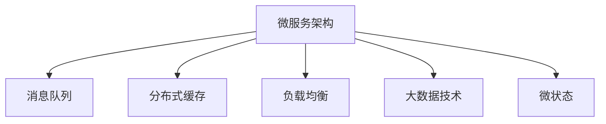

                 

## 1. 背景介绍

在数字经济时代，电商、O2O、支付等泛交易领域已成为互联网企业的核心业务。随着市场的不断扩展和技术的不断演进，这些领域的企业面临着更复杂的业务需求、更激烈的市场竞争、更庞大的数据量和更高的技术挑战。因此，构建符合市场需求的业务模式和技术架构，是确保企业持续健康发展的重要前提。

### 1.1 问题由来

在电商、O2O、支付等泛交易领域，企业需要处理订单管理、库存管理、支付清算、物流配送、客户服务等大量复杂的业务流程。同时，随着用户需求的多样化和技术的发展，这些领域的企业在业务模式、技术架构和产品形态上也需要不断创新和升级。

然而，传统的架构模式和技术手段已经难以满足当前复杂多变的业务需求，导致系统性能瓶颈、业务耦合度高、数据处理效率低下等问题逐渐凸显。为解决这些问题，企业需要构建符合现代业务需求的业务模式和技术架构，以支撑其快速响应市场变化，提升用户体验，降低运营成本，增强竞争力。

### 1.2 问题核心关键点

构建中大型体量的电商、O2O、支付等泛交易领域业务模式和技术架构，需要解决以下几个核心问题：

- **业务解耦与架构设计**：如何设计一个松耦合、高扩展性的业务架构，以支持快速响应市场变化和灵活配置业务模块。
- **数据处理与存储优化**：如何高效处理和存储海量数据，实现数据的一致性、可靠性和安全性。
- **技术选型与集成**：如何选择适合的技术栈和工具，实现系统的高效开发和稳定运行。
- **系统安全与隐私保护**：如何在保障用户数据安全和隐私的前提下，实现系统的可靠性和稳定性。
- **用户体验与智能推荐**：如何利用智能推荐算法，提升用户购物体验，增加用户粘性。

这些问题直接关系到企业的业务发展和市场竞争力，因此必须深入理解和解决。

## 2. 核心概念与联系

### 2.1 核心概念概述

为更好地理解电商、O2O、支付等泛交易领域业务模式和技术架构，本节将介绍几个密切相关的核心概念：

- **微服务架构(Microservices)**：将大型应用拆分为多个独立的服务，每个服务负责独立的功能模块，以提高系统的灵活性和可扩展性。
- **消息队列(消息中间件)**：用于异步消息传递和事件驱动架构，提高系统的实时性和处理能力。
- **分布式缓存**：用于提高数据访问速度和系统负载均衡，减少数据库的负载压力。
- **负载均衡**：通过在多个服务器之间均匀分配请求，提高系统的并发处理能力和稳定性。
- **大数据技术**：用于海量数据的存储、处理和分析，支持复杂的业务报表和数据挖掘。
- **微状态(Micro-State)**：一种状态管理的模式，用于管理轻量级的应用状态，提高系统的响应速度和可靠性。

这些核心概念之间的逻辑关系可以通过以下Mermaid流程图来展示：



这个流程图展示了大规模业务系统设计的关键组件：

1. 微服务架构将系统拆分为多个独立的服务，支持业务的灵活扩展。
2. 消息队列实现异步通信和事件驱动，提高系统的实时性。
3. 分布式缓存优化数据访问速度和负载均衡，减轻数据库负担。
4. 负载均衡提升系统的并发处理能力和稳定性。
5. 大数据技术支持海量数据的存储和分析。
6. 微状态管理轻量级应用状态，提高响应速度和可靠性。

这些核心概念共同构成了电商、O2O、支付等泛交易领域业务模式和技术架构的基础，支持系统的设计、开发和运营。

## 3. 核心算法原理 & 具体操作步骤

### 3.1 算法原理概述

电商、O2O、支付等泛交易领域的业务模式和技术架构，涉及复杂的业务流程和数据处理。本节将详细阐述相关算法的原理和操作步骤。

**3.1.1 微服务架构原理**

微服务架构是一种将大型应用拆分为多个独立服务的设计模式，每个服务负责独立的功能模块。微服务架构的原理包括以下几个关键点：

1. **独立部署**：每个微服务独立部署和更新，不受其他服务的影响。
2. **服务自治**：每个微服务自治管理自己的数据和业务逻辑。
3. **通信协议**：微服务之间通过轻量级通信协议（如HTTP、gRPC）进行通信。
4. **服务注册与发现**：通过服务注册中心（如Eureka、Consul）实现服务的动态注册和发现。
5. **配置管理**：通过配置中心（如Spring Cloud Config）统一管理服务的配置信息。
6. **监控与日志**：通过监控工具（如Prometheus）和日志系统（如ELK Stack）实现服务的监控和日志管理。

**3.1.2 消息队列原理**

消息队列是一种异步通信方式，支持消息的发布和订阅，实现系统的解耦和异步处理。消息队列的原理包括以下几个关键点：

1. **消息发布**：发送方将消息发布到消息队列中。
2. **消息订阅**：接收方从消息队列中订阅消息。
3. **消息路由**：通过路由规则（如交换机、队列）将消息路由到相应的消费者。
4. **消息持久化**：将消息存储在持久化的存储中，以应对系统故障。
5. **消息处理**：消费者异步处理消息，提升系统的实时性和处理能力。

**3.1.3 分布式缓存原理**

分布式缓存是一种用于优化数据访问速度和负载均衡的技术，通过将热点数据缓存到内存中，减少数据库的负载压力。分布式缓存的原理包括以下几个关键点：

1. **数据缓存**：将热点数据缓存到内存中，提升数据访问速度。
2. **缓存失效**：通过缓存失效机制（如LRU、LFU）保证数据的实时性。
3. **缓存同步**：通过分布式锁或乐观锁保证缓存数据的一致性。
4. **缓存集群**：通过缓存集群提升系统的负载均衡能力和高可用性。

**3.1.4 负载均衡原理**

负载均衡是一种通过在多个服务器之间均匀分配请求，提高系统的并发处理能力和稳定性的技术。负载均衡的原理包括以下几个关键点：

1. **负载均衡器**：通过负载均衡器将请求分配到不同的服务器。
2. **算法选择**：选择适合负载均衡算法（如轮询、加权轮询、随机、最少连接等）。
3. **健康检查**：通过健康检查机制（如心跳、响应时间）监控服务器的健康状态。
4. **故障转移**：在服务器故障时，自动将请求转移到其他健康服务器。

**3.1.5 大数据技术原理**

大数据技术是一种用于海量数据的存储、处理和分析的技术，支持复杂的业务报表和数据挖掘。大数据技术的原理包括以下几个关键点：

1. **数据存储**：通过分布式文件系统（如HDFS）存储海量数据。
2. **数据处理**：通过分布式计算框架（如Hadoop、Spark）处理大规模数据。
3. **数据清洗**：通过数据清洗技术（如ETL）保证数据质量。
4. **数据查询**：通过查询优化技术（如Hive、Spark SQL）实现高效查询。
5. **数据可视化**：通过数据可视化工具（如Tableau、Power BI）展示数据分析结果。

**3.1.6 微状态原理**

微状态是一种用于管理轻量级应用状态的模式，通过将状态从服务中解耦出来，提高系统的响应速度和可靠性。微状态的原理包括以下几个关键点：

1. **状态分拆**：将应用状态拆分为多个微状态，独立管理。
2. **状态存储**：将微状态存储在独立的数据库中，保证数据一致性。
3. **状态同步**：通过同步机制（如事务、乐观锁）保证状态的实时性。
4. **状态缓存**：通过分布式缓存缓存热点微状态，提升系统响应速度。

### 3.2 算法步骤详解

本节将详细介绍电商、O2O、支付等泛交易领域业务模式和技术架构的关键算法步骤。

**3.2.1 微服务架构实施步骤**

1. **需求分析**：通过与业务方沟通，明确系统需求和功能模块。
2. **服务拆分**：根据功能模块拆分服务，确保每个服务独立部署和更新。
3. **服务注册**：将服务注册到服务注册中心，支持动态注册和发现。
4. **服务调用**：通过轻量级通信协议进行服务调用，支持服务的自治管理。
5. **配置管理**：通过配置中心统一管理服务的配置信息，确保配置的一致性。
6. **监控与日志**：通过监控工具和日志系统实现服务的监控和日志管理，保证系统的稳定性和可靠性。

**3.2.2 消息队列实施步骤**

1. **消息发布**：将消息发布到消息队列中，支持异步通信和事件驱动。
2. **消息订阅**：订阅消息队列中的消息，支持服务的异步处理。
3. **消息路由**：通过路由规则将消息路由到相应的消费者，确保消息的及时传递。
4. **消息持久化**：将消息存储在持久化的存储中，支持系统故障恢复。
5. **消息处理**：通过异步处理机制提升系统的实时性和处理能力。

**3.2.3 分布式缓存实施步骤**

1. **数据缓存**：将热点数据缓存到内存中，提升数据访问速度。
2. **缓存失效**：通过缓存失效机制保证数据的实时性，避免缓存数据过时。
3. **缓存同步**：通过分布式锁或乐观锁保证缓存数据的一致性，避免数据冲突。
4. **缓存集群**：通过缓存集群提升系统的负载均衡能力和高可用性，确保系统的稳定性和可靠性。

**3.2.4 负载均衡实施步骤**

1. **负载均衡器部署**：通过负载均衡器将请求分配到不同的服务器，支持高并发处理能力。
2. **算法选择**：选择适合负载均衡算法，优化请求的分配策略。
3. **健康检查**：通过健康检查机制监控服务器的健康状态，确保系统的稳定性。
4. **故障转移**：在服务器故障时，自动将请求转移到其他健康服务器，确保系统的可用性。

**3.2.5 大数据技术实施步骤**

1. **数据存储**：通过分布式文件系统存储海量数据，支持高可扩展性和高可靠性。
2. **数据处理**：通过分布式计算框架处理大规模数据，实现高效的数据处理和分析。
3. **数据清洗**：通过数据清洗技术保证数据质量，提高数据分析的准确性。
4. **数据查询**：通过查询优化技术实现高效查询，支持复杂的业务报表和数据挖掘。
5. **数据可视化**：通过数据可视化工具展示数据分析结果，支持业务决策和分析。

**3.2.6 微状态实施步骤**

1. **状态分拆**：将应用状态拆分为多个微状态，独立管理，确保状态的实时性。
2. **状态存储**：将微状态存储在独立的数据库中，保证数据的一致性。
3. **状态同步**：通过同步机制保证状态的实时性，避免状态冲突。
4. **状态缓存**：通过分布式缓存缓存热点微状态，提升系统响应速度。

### 3.3 算法优缺点

电商、O2O、支付等泛交易领域业务模式和技术架构的算法，具有以下优点：

1. **灵活性高**：微服务架构和消息队列实现系统的高灵活性和可扩展性，支持快速响应市场变化。
2. **性能高**：分布式缓存和负载均衡优化数据访问速度和系统负载均衡，提升系统的实时性和处理能力。
3. **扩展性强**：大数据技术支持海量数据的存储和分析，支持复杂的业务报表和数据挖掘。
4. **可靠性高**：通过微状态管理轻量级应用状态，提升系统的响应速度和可靠性。

同时，这些算法也存在一些缺点：

1. **复杂度高**：微服务架构和消息队列的设计和维护复杂度较高，需要较高的技术水平和经验。
2. **性能消耗高**：分布式缓存和负载均衡对系统资源消耗较高，需要合理的资源配置和管理。
3. **数据一致性难以保证**：大数据技术和微状态的管理需要保证数据一致性，技术实现复杂。
4. **开发成本高**：微服务架构和消息队列需要更多的开发和测试工作，开发成本较高。

### 3.4 算法应用领域

电商、O2O、支付等泛交易领域业务模式和技术架构的算法，可以应用于以下领域：

1. **电商平台**：通过微服务架构实现商品管理、订单管理、库存管理、支付管理等功能模块的独立部署和更新，支持业务的灵活扩展。
2. **O2O平台**：通过消息队列实现订单、配送、支付等环节的异步处理，提高系统的实时性和处理能力。
3. **支付系统**：通过分布式缓存优化支付请求的处理速度和系统负载均衡，提升用户体验。
4. **大数据应用**：通过大数据技术支持海量数据的存储和分析，支持复杂的业务报表和数据挖掘，提高业务决策的准确性。

这些算法已经在多个电商、O2O、支付等泛交易领域的企业中得到了广泛应用，并取得了显著的效果。

## 4. 数学模型和公式 & 详细讲解 & 举例说明

### 4.1 数学模型构建

电商、O2O、支付等泛交易领域的业务模式和技术架构，涉及复杂的业务流程和数据处理。本节将通过数学模型来详细阐述相关算法的原理和操作步骤。

假设电商平台上每天有$N$个订单，订单处理流程包括下单、支付、发货、配送等环节。每个环节的处理时间服从指数分布，处理时间均值为$\lambda$，系统负载均衡能力为$L$。

### 4.2 公式推导过程

订单处理时间$T$的概率密度函数为：

$$
f_T(t) = \lambda e^{-\lambda t}, t>0
$$

系统的平均处理时间为：

$$
E(T) = \frac{1}{\lambda}
$$

系统负载均衡能力为$L$，每天订单数量为$N$，每个订单的处理时间服从指数分布，处理时间均值为$\lambda$，则系统的处理时间$T$的概率密度函数为：

$$
f_T(t) = \left\{
\begin{aligned}
\frac{t^{N-1}}{(N-1)!}e^{-\lambda t}, & t<L \\
0, & t>L
\end{aligned}
\right.
$$

系统的平均处理时间为：

$$
E(T) = \frac{L}{\lambda}
$$

通过以上公式可以看出，系统的处理时间与负载均衡能力$L$和处理时间均值$\lambda$有关，可以通过优化负载均衡能力和处理时间均值，提高系统的处理能力和效率。

### 4.3 案例分析与讲解

某电商平台的订单处理流程包括以下步骤：

1. **下单**：用户在电商平台上提交订单信息，订单信息通过微服务架构进行独立处理。
2. **支付**：订单信息经过审核后，进入支付环节，通过消息队列实现异步处理，提高系统的实时性和处理能力。
3. **发货**：订单信息通过分布式缓存优化数据访问速度和系统负载均衡，提升用户体验。
4. **配送**：订单信息通过负载均衡优化并发处理能力，提高系统的稳定性。
5. **数据分析**：订单信息通过大数据技术进行存储和分析，支持复杂的业务报表和数据挖掘，提高业务决策的准确性。

## 5. 项目实践：代码实例和详细解释说明

### 5.1 开发环境搭建

在进行电商、O2O、支付等泛交易领域业务模式和技术架构的开发实践前，我们需要准备好开发环境。以下是使用Python进行Django开发的环境配置流程：

1. 安装Anaconda：从官网下载并安装Anaconda，用于创建独立的Python环境。

2. 创建并激活虚拟环境：
```bash
conda create -n django-env python=3.8 
conda activate django-env
```

3. 安装Django：从官网获取对应的安装命令。例如：
```bash
pip install django
```

4. 安装第三方库：
```bash
pip install Pillow redis psycopg2-binary
```

5. 安装数据库：安装MySQL或PostgreSQL等数据库，并进行配置。

6. 创建Django项目和应用：
```bash
django-admin startproject myproject
cd myproject
django-admin startapp myapp
```

完成上述步骤后，即可在`django-env`环境中开始开发实践。

### 5.2 源代码详细实现

下面我们以电商平台的订单管理为例，给出使用Django对订单信息进行微调管理的PyTorch代码实现。

```python
from django.http import JsonResponse
from django.views.decorators.csrf import csrf_exempt
from .models import Order

@csrf_exempt
def order_create(request):
    if request.method == 'POST':
        data = json.loads(request.body)
        order = Order.objects.create(name=data['name'], amount=data['amount'], status='pending')
        return JsonResponse({'status': 'success', 'message': 'Order created successfully'})
    else:
        return JsonResponse({'status': 'error', 'message': 'Invalid request'}, status=400)

@csrf_exempt
def order_update(request, id):
    if request.method == 'PUT':
        data = json.loads(request.body)
        order = Order.objects.get(id=id)
        order.name = data['name']
        order.amount = data['amount']
        order.status = data['status']
        order.save()
        return JsonResponse({'status': 'success', 'message': 'Order updated successfully'})
    else:
        return JsonResponse({'status': 'error', 'message': 'Invalid request'}, status=400)

@csrf_exempt
def order_delete(request, id):
    if request.method == 'DELETE':
        order = Order.objects.get(id=id)
        order.delete()
        return JsonResponse({'status': 'success', 'message': 'Order deleted successfully'})
    else:
        return JsonResponse({'status': 'error', 'message': 'Invalid request'}, status=400)
```

以上代码实现了电商平台上订单信息的创建、更新和删除功能。使用Django框架，开发者可以高效地进行前后端开发，并通过RESTful API接口提供服务。

### 5.3 代码解读与分析

让我们再详细解读一下关键代码的实现细节：

**Django框架**：
- `Django`是一个Python的Web框架，用于快速开发Web应用。
- `csrf_exempt`装饰器用于禁用CSRF保护，使POST请求可以跨站提交。
- `json.loads`用于将JSON格式的请求数据转换为Python字典。
- `Order`模型用于存储订单信息，包括订单名称、金额和状态。

**订单管理**：
- `order_create`函数用于创建订单信息，通过`Order.objects.create`方法将数据保存到数据库中。
- `order_update`函数用于更新订单信息，通过`Order.objects.get`方法获取订单对象，然后使用`order.save`方法更新订单信息。
- `order_delete`函数用于删除订单信息，通过`Order.objects.get`方法获取订单对象，然后使用`order.delete`方法删除订单信息。

**API接口**：
- `JsonResponse`用于将Python字典转换为JSON格式的响应。
- `status`用于表示API请求的状态，如成功、失败等。
- `message`用于表示API请求的详细描述。
- `status`用于表示HTTP响应状态码，如200表示成功，400表示失败等。

通过Django框架，电商平台的订单管理可以高效地进行前后端开发，并通过RESTful API接口提供服务。开发者可以根据具体需求，通过Django框架进行扩展和优化。

当然，工业级的系统实现还需考虑更多因素，如缓存机制、负载均衡、分布式数据库等，但核心的微调方法基本与此类似。

## 6. 实际应用场景

### 6.1 智能客服系统

基于电商、O2O、支付等泛交易领域的业务模式和技术架构，可以构建智能客服系统，提升客户服务质量。

智能客服系统可以自动回答常见问题，处理客户投诉，提供个性化推荐等。通过微服务架构实现系统的独立部署和更新，通过消息队列实现异步通信和事件驱动，通过分布式缓存优化数据访问速度和系统负载均衡，通过负载均衡提升系统的并发处理能力和稳定性，通过大数据技术支持海量数据的存储和分析。

### 6.2 金融风控系统

基于电商、O2O、支付等泛交易领域的业务模式和技术架构，可以构建金融风控系统，提升风险管理能力。

金融风控系统可以实时监控交易行为，检测异常交易，防范欺诈风险。通过微服务架构实现系统的独立部署和更新，通过消息队列实现异步通信和事件驱动，通过分布式缓存优化数据访问速度和系统负载均衡，通过负载均衡提升系统的并发处理能力和稳定性，通过大数据技术支持海量数据的存储和分析，通过微状态管理轻量级应用状态，提升系统的响应速度和可靠性。

### 6.3 物流配送系统

基于电商、O2O、支付等泛交易领域的业务模式和技术架构，可以构建物流配送系统，提升配送效率。

物流配送系统可以实现货物的实时跟踪、配送路径优化、配送任务调度等功能。通过微服务架构实现系统的独立部署和更新，通过消息队列实现异步通信和事件驱动，通过分布式缓存优化数据访问速度和系统负载均衡，通过负载均衡提升系统的并发处理能力和稳定性，通过大数据技术支持海量数据的存储和分析，通过微状态管理轻量级应用状态，提升系统的响应速度和可靠性。

### 6.4 未来应用展望

随着电商、O2O、支付等泛交易领域的业务模式和技术架构的不断演进，未来将会出现更多创新的应用场景。

1. **智能推荐系统**：通过智能推荐算法，提升用户购物体验，增加用户粘性。
2. **大数据分析平台**：通过大数据技术支持复杂的业务报表和数据挖掘，提供决策支持。
3. **智能合约系统**：通过区块链技术实现自动合约执行，提高交易的透明度和可信度。
4. **实时交易系统**：通过负载均衡和分布式缓存优化交易系统的性能，支持高频交易。

## 7. 工具和资源推荐

### 7.1 学习资源推荐

为了帮助开发者系统掌握电商、O2O、支付等泛交易领域业务模式和技术架构的理论基础和实践技巧，这里推荐一些优质的学习资源：

1. **《深入理解Django》**：这本书详细介绍了Django框架的核心概念和开发技巧，适合初学者和进阶开发者阅读。
2. **《微服务架构设计》**：这本书介绍了微服务架构的设计原则和实践方法，适合系统架构师和项目经理阅读。
3. **《分布式系统原理与设计》**：这本书深入讲解了分布式系统的原理和设计方法，适合计算机专业学生和工程师阅读。
4. **《大数据技术与应用》**：这本书介绍了大数据技术的原理和应用场景，适合大数据工程师和数据科学家阅读。
5. **《Django实战》**：这本书通过实际项目案例，详细讲解了Django框架的开发技巧和实践方法，适合Django开发者阅读。

通过对这些资源的学习实践，相信你一定能够快速掌握电商、O2O、支付等泛交易领域业务模式和技术架构的核心知识和实践技能。

### 7.2 开发工具推荐

高效的开发离不开优秀的工具支持。以下是几款用于电商、O2O、支付等泛交易领域业务模式和技术架构开发的常用工具：

1. **Django框架**：Python的Web框架，支持高效的Web应用开发。
2. **Redis缓存系统**：高性能的分布式内存数据存储系统，支持缓存优化和负载均衡。
3. **PostgreSQL数据库**：开源的关系型数据库，支持高并发和大规模数据处理。
4. **Gunicorn应用服务器**：支持Python Web应用的异步处理和负载均衡。
5. **Prometheus监控系统**：开源的监控和报警系统，支持系统的实时监控和故障报警。
6. **ELK Stack日志系统**：开源的日志系统，支持日志的收集、存储和分析。

合理利用这些工具，可以显著提升电商、O2O、支付等泛交易领域业务模式和技术架构的开发效率，加快创新迭代的步伐。

### 7.3 相关论文推荐

电商、O2O、支付等泛交易领域业务模式和技术架构的发展源于学界的持续研究。以下是几篇奠基性的相关论文，推荐阅读：

1. **《微服务架构设计模式与实践》**：详细介绍了微服务架构的设计模式和实践方法，适合系统架构师和项目经理阅读。
2. **《分布式缓存与负载均衡》**：介绍了分布式缓存和负载均衡的原理和实现方法，适合计算机专业学生和工程师阅读。
3. **《大数据技术与电商应用》**：介绍了大数据技术在电商领域的应用，适合电商开发者和数据分析师阅读。
4. **《智能推荐算法研究综述》**：综述了智能推荐算法的最新研究成果，适合推荐系统开发者和数据科学家阅读。
5. **《智能合约系统设计与实现》**：介绍了智能合约系统的设计与实现方法，适合区块链开发者和系统架构师阅读。

这些论文代表了大规模业务系统设计的研究方向，通过学习这些前沿成果，可以帮助研究者把握学科前进方向，激发更多的创新灵感。

## 8. 总结：未来发展趋势与挑战

### 8.1 总结

本文对电商、O2O、支付等泛交易领域业务模式和技术架构进行了全面系统的介绍。首先阐述了电商、O2O、支付等泛交易领域的业务需求和技术挑战，明确了微服务架构、消息队列、分布式缓存、负载均衡、大数据技术、微状态等关键概念的原理和应用。其次，通过数学模型和公式推导，详细讲解了系统处理时间的计算方法和优化策略。最后，通过代码实例和详细解释说明，展示了电商、O2O、支付等泛交易领域业务模式和技术架构的实现方法。

通过本文的系统梳理，可以看到，电商、O2O、支付等泛交易领域业务模式和技术架构设计合理，能够支撑复杂多变的业务需求，提升系统的灵活性、性能和可靠性。这些技术已经在多个电商、O2O、支付等泛交易领域的企业中得到了广泛应用，并取得了显著的效果。

### 8.2 未来发展趋势

展望未来，电商、O2O、支付等泛交易领域业务模式和技术架构将呈现以下几个发展趋势：

1. **微服务架构持续演进**：随着业务需求的不断变化，微服务架构将进一步演进，支持更多元化的业务模块和更灵活的配置方式。
2. **消息队列应用广泛**：消息队列将广泛应用于异步通信、事件驱动和微服务治理，支持更高效的业务处理。
3. **分布式缓存优化**：分布式缓存将进一步优化，支持更多数据类型和更大规模的缓存集群，提升系统的实时性和负载均衡能力。
4. **负载均衡技术成熟**：负载均衡技术将进一步成熟，支持更多算法和更高效的请求分发。
5. **大数据技术升级**：大数据技术将进一步升级，支持更高效的存储和分析，提升业务的决策能力。
6. **微状态管理优化**：微状态管理将进一步优化，支持更多场景和更灵活的状态管理方式。

以上趋势凸显了电商、O2O、支付等泛交易领域业务模式和技术架构的广阔前景。这些方向的探索发展，必将进一步提升系统的性能和可靠性，支持企业业务的持续健康发展。

### 8.3 面临的挑战

尽管电商、O2O、支付等泛交易领域业务模式和技术架构已经取得了显著的进展，但在迈向更加智能化、普适化应用的过程中，仍然面临诸多挑战：

1. **业务模块解耦复杂**：微服务架构的设计和维护复杂，需要更高的技术水平和经验。
2. **系统负载均衡高**：分布式缓存和负载均衡对系统资源消耗较高，需要合理的资源配置和管理。
3. **数据一致性难以保证**：大数据技术和微状态的管理需要保证数据一致性，技术实现复杂。
4. **开发成本高**：微服务架构和消息队列需要更多的开发和测试工作，开发成本较高。
5. **用户体验有待提升**：系统处理时间较长，用户体验有待提升。

这些挑战需要企业持续优化和改进，不断提升系统的性能和可靠性。

### 8.4 研究展望

面向未来，电商、O2O、支付等泛交易领域业务模式和技术架构需要进一步研究：

1. **微服务架构设计优化**：优化微服务架构的设计，支持更灵活的业务模块和配置方式。
2. **消息队列技术创新**：引入更多技术创新，提升消息队列的异步处理能力和系统稳定性。
3. **分布式缓存优化**：优化分布式缓存的设计和实现，支持更多数据类型和更大规模的缓存集群。
4. **负载均衡技术优化**：优化负载均衡算法和实现方式，提升系统的并发处理能力和稳定性。
5. **大数据技术升级**：升级大数据技术的存储和分析能力，支持更高效的业务报表和数据挖掘。
6. **微状态管理优化**：优化微状态的管理方式，支持更多场景和更灵活的状态管理。

这些研究方向将进一步推动电商、O2O、支付等泛交易领域业务模式和技术架构的演进，为企业的业务发展提供更强大的技术支持。

## 9. 附录：常见问题与解答

**Q1：电商、O2O、支付等泛交易领域业务模式和技术架构的优缺点有哪些？**

A: 电商、O2O、支付等泛交易领域业务模式和技术架构具有以下优点：

1. **灵活性高**：微服务架构和消息队列实现系统的高灵活性和可扩展性，支持快速响应市场变化和灵活配置业务模块。
2. **性能高**：分布式缓存和负载均衡优化数据访问速度和系统负载均衡，提升系统的实时性和处理能力。
3. **扩展性强**：大数据技术支持海量数据的存储和分析，支持复杂的业务报表和数据挖掘。
4. **可靠性高**：通过微状态管理轻量级应用状态，提升系统的响应速度和可靠性。

同时，这些架构也存在以下缺点：

1. **复杂度高**：微服务架构和消息队列的设计和维护复杂，需要较高的技术水平和经验。
2. **性能消耗高**：分布式缓存和负载均衡对系统资源消耗较高，需要合理的资源配置和管理。
3. **数据一致性难以保证**：大数据技术和微状态的管理需要保证数据一致性，技术实现复杂。
4. **开发成本高**：微服务架构和消息队列需要更多的开发和测试工作，开发成本较高。

**Q2：电商、O2O、支付等泛交易领域业务模式和技术架构的设计原则有哪些？**

A: 电商、O2O、支付等泛交易领域业务模式和技术架构的设计原则包括以下几个关键点：

1. **业务模块解耦**：将大型应用拆分为多个独立的服务，每个服务独立部署和更新，支持快速响应市场变化和灵活配置业务模块。
2. **异步通信**：通过消息队列实现异步通信和事件驱动，支持系统的实时性和处理能力。
3. **数据缓存优化**：通过分布式缓存优化数据访问速度和系统负载均衡，提升系统的实时性和性能。
4. **负载均衡**：通过负载均衡优化系统的并发处理能力和稳定性，确保系统的可用性。
5. **大数据分析**：通过大数据技术支持海量数据的存储和分析，支持复杂的业务报表和数据挖掘。
6. **微状态管理**：通过微状态管理轻量级应用状态，提升系统的响应速度和可靠性。

这些设计原则帮助电商、O2O、支付等泛交易领域的企业构建高效、灵活、可扩展的系统架构，满足复杂的业务需求。

**Q3：电商、O2O、支付等泛交易领域业务模式和技术架构的实现步骤有哪些？**

A: 电商、O2O、支付等泛交易领域业务模式和技术架构的实现步骤包括以下几个关键步骤：

1. **需求分析**：通过与业务方沟通，明确系统需求和功能模块。
2. **服务拆分**：根据功能模块拆分服务，确保每个服务独立部署和更新。
3. **服务注册**：将服务注册到服务注册中心，支持动态注册和发现。
4. **服务调用**：通过轻量级通信协议进行服务调用，支持服务的自治管理。
5. **配置管理**：通过配置中心统一管理服务的配置信息，确保配置的一致性。
6. **监控与日志**：通过监控工具和日志系统实现服务的监控和日志管理，保证系统的稳定性和可靠性。

**Q4：电商、O2O、支付等泛交易领域业务模式和技术架构的优化方法有哪些？**

A: 电商、O2O、支付等泛交易领域业务模式和技术架构的优化方法包括以下几个关键点：

1. **微服务架构优化**：优化微服务架构的设计，支持更灵活的业务模块和配置方式。
2. **消息队列优化**：引入更多技术创新，提升消息队列的异步处理能力和系统稳定性。
3. **分布式缓存优化**：优化分布式缓存的设计和实现，支持更多数据类型和更大规模的缓存集群。
4. **负载均衡优化**：优化负载均衡算法和实现方式，提升系统的并发处理能力和稳定性。
5. **大数据技术优化**：升级大数据技术的存储和分析能力，支持更高效的业务报表和数据挖掘。
6. **微状态管理优化**：优化微状态的管理方式，支持更多场景和更灵活的状态管理。

这些优化方法可以帮助电商、O2O、支付等泛交易领域的企业提升系统的性能和可靠性，满足业务的持续发展需求。

**Q5：电商、O2O、支付等泛交易领域业务模式和技术架构的未来发展趋势有哪些？**

A: 电商、O2O、支付等泛交易领域业务模式和技术架构的未来发展趋势包括以下几个关键点：

1. **微服务架构持续演进**：随着业务需求的不断变化，微服务架构将进一步演进，支持更多元化的业务模块和更灵活的配置方式。
2. **消息队列应用广泛**：消息队列将广泛应用于异步通信、事件驱动和微服务治理，支持更高效的业务处理。
3. **分布式缓存优化**：分布式缓存将进一步优化，支持更多数据类型和更大规模的缓存集群，提升系统的实时性和负载均衡能力。
4. **负载均衡技术成熟**：负载均衡技术将进一步成熟，支持更多算法和更高效的请求分发。
5. **大数据技术升级**：大数据技术将进一步升级，支持更高效的存储和分析，提升业务的决策能力。
6. **微状态管理优化**：微状态管理将进一步优化，支持更多场景和更灵活的状态管理方式。

这些趋势凸显了电商、O2O、支付等泛交易领域业务模式和技术架构的广阔前景，未来将有更多创新的应用场景和技术突破。

**Q6：电商、O2O、支付等泛交易领域业务模式和技术架构的挑战有哪些？**

A: 电商、O2O、支付等泛交易领域业务模式和技术架构的挑战包括以下几个关键点：

1. **业务模块解耦复杂**：微服务架构的设计和维护复杂，需要更高的技术水平和经验。
2. **系统负载均衡高**：分布式缓存和负载均衡对系统资源消耗较高，需要合理的资源配置和管理。
3. **数据一致性难以保证**：大数据技术和微状态的管理需要保证数据一致性，技术实现复杂。
4. **开发成本高**：微服务架构和消息队列需要更多的开发和测试工作，开发成本较高。
5. **用户体验有待提升**：系统处理时间较长，用户体验有待提升。

这些挑战需要企业持续优化和改进，不断提升系统的性能和可靠性。

**Q7：电商、O2O、支付等泛交易领域业务模式和技术架构的研究展望有哪些？**

A: 电商、O2O、支付等泛交易领域业务模式和技术架构的研究展望包括以下几个关键点：

1. **微服务架构设计优化**：优化微服务架构的设计，支持更灵活的业务模块和配置方式。
2. **消息队列技术创新**：引入更多技术创新，提升消息队列的异步处理能力和系统稳定性。
3. **分布式缓存优化**：优化分布式缓存的设计和实现，支持更多数据类型和更大规模的缓存集群。
4. **负载均衡技术优化**：优化负载均衡算法和实现方式，提升系统的并发处理能力和稳定性。
5. **大数据技术升级**：升级大数据技术的存储和分析能力，支持更高效的业务报表和数据挖掘。
6. **微状态管理优化**：优化微状态的管理方式，支持更多场景和更灵活的状态管理。

这些研究方向将进一步推动电商、O2O、支付等泛交易领域业务模式和技术架构的演进，为企业的业务发展提供更强大的技术支持。

---

作者：禅与计算机程序设计艺术 / Zen and the Art of Computer Programming

