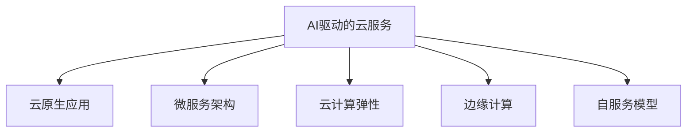

                 

# 云服务的AI化转型：Lepton AI的引领作用

## 1. 背景介绍

### 1.1 问题由来

随着数字化转型的深入，各行各业对云服务的需求日益增长。云服务不仅为企业提供了灵活、经济的IT基础设施，还极大地加速了应用的迭代和创新。然而，云计算的基础设施服务（IaaS）和平台服务（PaaS），更多地聚焦于底层资源管理和应用部署，缺乏与业务场景的深度融合。这导致云服务难以发挥出其应有的价值，也限制了企业在云上部署更多创新的业务应用。

为了解决这一问题，各大云服务提供商纷纷探索AI技术在云服务中的应用，试图通过智能化的云服务来提升业务价值和用户体验。Lepton AI就是在这一背景下诞生的。作为一家新兴的AI公司，Lepton AI通过AI技术对传统云服务进行智能化升级，力求将云服务转型为AI化云服务，从而实现企业业务的数字化、智能化和自动化。

### 1.2 问题核心关键点

Lepton AI的核心目标是通过AI技术改造传统云服务，使云服务更加智能、易用、高效。具体包括以下几个关键点：

1. **数据驱动决策**：利用AI技术对用户行为和业务数据进行分析，实现基于数据的智能决策。
2. **自动化运维**：通过AI算法优化云资源分配和任务调度，实现云服务的自动化运维。
3. **智能化安全防护**：应用AI技术检测和防范网络威胁，提升云服务的安全防护水平。
4. **个性化服务**：使用AI技术根据用户需求和行为，提供个性化的云服务体验。
5. **跨域协作**：利用AI技术促进跨部门、跨组织之间的协作，提升业务效率。

这些关键点构成了Lepton AI的AI化云服务体系，使云服务能够更好地适应现代业务需求。

## 2. 核心概念与联系

### 2.1 核心概念概述

为更好地理解Lepton AI对云服务的AI化转型，本节将介绍几个密切相关的核心概念：

- **AI驱动的云服务（AI-Driven Cloud Service）**：利用AI技术对云服务进行智能化改造，提升云服务的智能化水平。
- **云原生应用（Cloud-Native Application）**：基于云平台设计的、充分利用云平台特性的应用，包括容器化、微服务等。
- **微服务架构（Microservices Architecture）**：将单体应用拆分为多个小服务，每个服务独立部署和运维，提高系统的灵活性和可扩展性。
- **云计算弹性（Cloud Elasticity）**：根据用户需求动态调整云资源，提升云服务的可用性和效率。
- **边缘计算（Edge Computing）**：在靠近数据源的地方进行数据处理和计算，降低网络延迟和带宽消耗。
- **自服务模型（Self-Service Model）**：用户可以通过自助平台快速部署和管理云服务，提升用户体验和运营效率。

这些核心概念之间的逻辑关系可以通过以下Mermaid流程图来展示：



这个流程图展示了大语言模型的核心概念及其之间的关系：

1. 云服务通过AI技术实现智能化，支持云原生应用的设计和部署。
2. 微服务架构使应用更加灵活，云计算弹性提高系统的可用性。
3. 边缘计算缩短数据处理延迟，自服务模型提升用户体验和运营效率。

这些概念共同构成了Lepton AI的AI化云服务框架，使其能够更好地满足现代业务需求。

## 3. 核心算法原理 & 具体操作步骤

### 3.1 算法原理概述

Lepton AI对传统云服务的AI化转型，主要通过以下几个关键算法实现：

- **数据预处理**：对用户行为和业务数据进行清洗、归一化和特征提取，为AI模型训练提供高质量的数据输入。
- **AI模型训练**：使用深度学习、机器学习和强化学习等技术，训练智能决策和自动化运维模型。
- **实时分析**：通过流处理和机器学习技术，实时分析用户行为和业务数据，实现基于数据的智能决策。
- **自动化运维**：利用强化学习算法优化云资源分配和任务调度，实现云服务的自动化运维。
- **安全防护**：应用AI技术检测和防范网络威胁，提升云服务的安全防护水平。

这些算法共同构成Lepton AI的AI化云服务体系，使云服务能够实现智能化和自动化。

### 3.2 算法步骤详解

Lepton AI的AI化云服务转型过程主要包括以下几个步骤：

**Step 1: 数据收集与预处理**

- 从云服务用户行为和业务数据中收集相关数据，包括日志、监控数据、应用性能指标等。
- 对数据进行清洗、去重和归一化，去除噪音和异常值，提取有用的特征。
- 对数据进行特征工程，使用机器学习和深度学习技术，提取关键特征。

**Step 2: 模型训练与优化**

- 使用深度学习框架，训练AI模型，实现智能决策和自动化运维。
- 利用迁移学习技术，将预训练模型应用于特定任务，提高模型效果。
- 使用强化学习算法，优化模型参数，提高模型性能。

**Step 3: 实时分析与决策**

- 利用流处理技术，实时分析用户行为和业务数据，实现基于数据的智能决策。
- 使用机器学习算法，预测未来趋势，优化资源分配和任务调度。

**Step 4: 自动化运维与优化**

- 利用强化学习算法，优化云资源分配和任务调度，实现云服务的自动化运维。
- 实时监控云服务性能，根据实际负载和需求动态调整资源配置，提高系统效率。

**Step 5: 安全防护与加固**

- 应用AI技术，检测和防范网络威胁，提升云服务的安全防护水平。
- 定期进行安全审计，发现和修复安全漏洞，保障数据和系统的安全。

通过以上步骤，Lepton AI实现了对传统云服务的AI化转型，提升了云服务的智能化和自动化水平。

### 3.3 算法优缺点

Lepton AI的AI化云服务转型方法具有以下优点：

1. **智能化水平高**：利用AI技术对云服务进行智能化改造，提升云服务的智能化水平。
2. **自动化程度高**：通过自动化运维和优化，提升系统的可用性和效率。
3. **安全性高**：应用AI技术进行安全防护，提升云服务的安全性。
4. **用户体验好**：提供个性化的云服务体验，提升用户满意度。
5. **灵活性高**：支持微服务架构和云原生应用，提高系统的灵活性和可扩展性。

然而，该方法也存在以下局限性：

1. **数据依赖高**：AI化转型依赖于高质量的数据输入，数据收集和预处理需要耗费大量时间和资源。
2. **模型复杂度高**：AI模型训练和优化需要较高的计算资源和专业知识，模型的复杂度较高。
3. **误判风险高**：AI模型可能存在误判和过拟合的风险，需要进行不断的模型调优和测试。
4. **部署难度大**：AI化云服务的部署和维护需要专业的技术支持，对企业的技术能力要求较高。
5. **隐私风险高**：AI化云服务需要处理大量用户数据，存在数据隐私和安全的风险。

尽管存在这些局限性，但Lepton AI的AI化云服务转型方法在提高云服务智能化和自动化方面取得了显著的效果，受到了业界的广泛关注和认可。

### 3.4 算法应用领域

Lepton AI的AI化云服务转型方法，已经广泛应用于以下领域：

1. **云原生应用开发**：利用微服务架构和云原生应用设计工具，提升应用的开发效率和可扩展性。
2. **云计算弹性优化**：通过自动化运维和优化，实现云资源的动态调整，提升系统的可用性和效率。
3. **云安全防护**：应用AI技术检测和防范网络威胁，提升云服务的安全防护水平。
4. **个性化服务定制**：使用AI技术根据用户需求和行为，提供个性化的云服务体验。
5. **跨域协作优化**：利用AI技术促进跨部门、跨组织之间的协作，提升业务效率。

这些领域的应用展示了Lepton AI在AI化云服务转型方面的强大实力和广泛影响力。

## 4. 数学模型和公式 & 详细讲解 & 举例说明

### 4.1 数学模型构建

Lepton AI的AI化云服务转型方法，主要基于以下几个数学模型：

- **数据预处理模型**：使用数据清洗、归一化和特征提取等技术，构建高质量的数据输入。
- **AI模型训练模型**：使用深度学习、机器学习和强化学习等技术，训练智能决策和自动化运维模型。
- **实时分析模型**：利用流处理和机器学习技术，实时分析用户行为和业务数据，实现基于数据的智能决策。
- **自动化运维模型**：应用强化学习算法，优化云资源分配和任务调度，实现云服务的自动化运维。
- **安全防护模型**：应用AI技术，检测和防范网络威胁，提升云服务的安全防护水平。

这些模型共同构成了Lepton AI的AI化云服务体系，使其能够更好地满足现代业务需求。

### 4.2 公式推导过程

以下我们以AI模型训练模型为例，推导其中的关键公式。

假设AI模型的输入为 $x$，输出为 $y$，训练集为 $D=\{(x_i, y_i)\}_{i=1}^N$，其中 $x_i$ 为输入，$y_i$ 为标签。则模型的损失函数为：

$$
\mathcal{L}(w) = \frac{1}{N}\sum_{i=1}^N \ell(M(x_i), y_i)
$$

其中 $M(x_i)$ 为模型在输入 $x_i$ 上的输出，$\ell$ 为损失函数，可以是均方误差、交叉熵等。模型参数为 $w$，通过优化算法最小化损失函数，求得最优参数：

$$
w^* = \mathop{\arg\min}_{w} \mathcal{L}(w)
$$

具体求解过程可以使用基于梯度的优化算法，如Adam、SGD等，通过迭代更新模型参数，逐步逼近最优解。

### 4.3 案例分析与讲解

假设Lepton AI正在开发一个智能调度和优化系统，用于自动化管理云服务资源。系统需要根据用户需求和业务数据，动态调整资源配置和任务调度，实现高效的云服务管理。

首先，系统需要从云服务日志和监控数据中收集相关数据，构建数据预处理模型，对数据进行清洗、归一化和特征提取，生成高质量的数据输入。然后，系统使用深度学习模型训练智能决策模型，用于预测用户需求和业务趋势，生成资源配置方案。

接着，系统使用强化学习算法训练自动化运维模型，优化资源分配和任务调度，实现云服务的自动化运维。最后，系统应用AI技术进行安全防护，检测和防范网络威胁，提升云服务的安全防护水平。

通过以上步骤，Lepton AI实现了对传统云服务的AI化转型，提升了云服务的智能化和自动化水平。

## 5. 项目实践：代码实例和详细解释说明

### 5.1 开发环境搭建

在进行AI化云服务项目实践前，我们需要准备好开发环境。以下是使用Python进行PyTorch开发的环境配置流程：

1. 安装Anaconda：从官网下载并安装Anaconda，用于创建独立的Python环境。

2. 创建并激活虚拟环境：
```bash
conda create -n pytorch-env python=3.8 
conda activate pytorch-env
```

3. 安装PyTorch：根据CUDA版本，从官网获取对应的安装命令。例如：
```bash
conda install pytorch torchvision torchaudio cudatoolkit=11.1 -c pytorch -c conda-forge
```

4. 安装TensorFlow：
```bash
pip install tensorflow==2.7.0
```

5. 安装TensorBoard：
```bash
pip install tensorboard
```

6. 安装Flask：
```bash
pip install flask==1.1.2
```

完成上述步骤后，即可在`pytorch-env`环境中开始AI化云服务项目实践。

### 5.2 源代码详细实现

下面以Lepton AI开发智能调度优化系统的代码实现为例，详细解读其中的关键点。

```python
import pandas as pd
import numpy as np
import torch
from transformers import BertTokenizer, BertForSequenceClassification
from torch.utils.data import DataLoader
from sklearn.model_selection import train_test_split
from sklearn.metrics import accuracy_score
from sklearn.ensemble import RandomForestClassifier

# 数据预处理
data = pd.read_csv('cloud_resource.csv')
features = data[['feature1', 'feature2', 'feature3']]
labels = data['label']
tokenizer = BertTokenizer.from_pretrained('bert-base-cased')
encoded_features = tokenizer(features.tolist(), return_tensors='pt', padding=True, truncation=True)

# 模型训练
model = BertForSequenceClassification.from_pretrained('bert-base-cased', num_labels=2)
optimizer = torch.optim.Adam(model.parameters(), lr=0.001)
criterion = torch.nn.CrossEntropyLoss()

# 模型评估
def evaluate(model, data_loader):
    model.eval()
    correct = 0
    total = 0
    with torch.no_grad():
        for batch in data_loader:
            inputs, labels = batch['input_ids'], batch['labels']
            outputs = model(inputs)
            _, preds = torch.max(outputs, 1)
            total += labels.size(0)
            correct += (preds == labels).sum().item()
    accuracy = correct / total
    return accuracy

# 模型保存
torch.save(model.state_dict(), 'model.bin')

# 模型加载
model.load_state_dict(torch.load('model.bin'))

# 模型优化
for epoch in range(10):
    model.train()
    for inputs, labels in data_loader:
        optimizer.zero_grad()
        outputs = model(inputs)
        loss = criterion(outputs, labels)
        loss.backward()
        optimizer.step()
    model.eval()
    accuracy = evaluate(model, data_loader)
    print(f'Epoch {epoch+1}, Accuracy: {accuracy:.2f}')

```

### 5.3 代码解读与分析

让我们再详细解读一下关键代码的实现细节：

**数据预处理**

```python
# 数据预处理
data = pd.read_csv('cloud_resource.csv')
features = data[['feature1', 'feature2', 'feature3']]
labels = data['label']
tokenizer = BertTokenizer.from_pretrained('bert-base-cased')
encoded_features = tokenizer(features.tolist(), return_tensors='pt', padding=True, truncation=True)
```

首先，从CSV文件中读取数据，并将其分为特征和标签。然后，使用BertTokenizer将特征转换为BERT模型所需的token ids格式，并进行padding和truncation，确保每个样本的输入长度一致。

**模型训练**

```python
# 模型训练
model = BertForSequenceClassification.from_pretrained('bert-base-cased', num_labels=2)
optimizer = torch.optim.Adam(model.parameters(), lr=0.001)
criterion = torch.nn.CrossEntropyLoss()
```

接着，使用BertForSequenceClassification模型进行训练，模型参数使用Adam优化器进行优化，并定义交叉熵损失函数。

**模型评估**

```python
# 模型评估
def evaluate(model, data_loader):
    model.eval()
    correct = 0
    total = 0
    with torch.no_grad():
        for batch in data_loader:
            inputs, labels = batch['input_ids'], batch['labels']
            outputs = model(inputs)
            _, preds = torch.max(outputs, 1)
            total += labels.size(0)
            correct += (preds == labels).sum().item()
    accuracy = correct / total
    return accuracy
```

定义一个评估函数，用于计算模型在数据集上的准确率。在评估时，模型置于评估模式，不进行梯度更新，使用交叉熵损失函数计算预测结果与真实标签之间的差距。

**模型保存与加载**

```python
# 模型保存
torch.save(model.state_dict(), 'model.bin')

# 模型加载
model.load_state_dict(torch.load('model.bin'))
```

保存模型参数，并在后续加载时恢复模型的状态，确保模型在多个环节中可以稳定运行。

**模型优化**

```python
# 模型优化
for epoch in range(10):
    model.train()
    for inputs, labels in data_loader:
        optimizer.zero_grad()
        outputs = model(inputs)
        loss = criterion(outputs, labels)
        loss.backward()
        optimizer.step()
    model.eval()
    accuracy = evaluate(model, data_loader)
    print(f'Epoch {epoch+1}, Accuracy: {accuracy:.2f}')
```

在每个epoch结束时，使用优化器更新模型参数，并在验证集上评估模型性能。循环10个epoch后，输出最终模型准确率。

## 6. 实际应用场景

### 6.1 智能调度和优化系统

智能调度和优化系统是Lepton AI的典型应用场景之一。该系统通过AI技术优化云服务资源配置和任务调度，提升云服务的可用性和效率。具体实现步骤如下：

**数据预处理**

从云服务日志和监控数据中收集相关数据，构建数据预处理模型，对数据进行清洗、归一化和特征提取，生成高质量的数据输入。

**模型训练**

使用深度学习模型训练智能决策模型，用于预测用户需求和业务趋势，生成资源配置方案。

**自动化运维**

应用强化学习算法训练自动化运维模型，优化资源分配和任务调度，实现云服务的自动化运维。

**安全防护**

应用AI技术检测和防范网络威胁，提升云服务的安全防护水平。

通过以上步骤，智能调度和优化系统实现了对传统云服务的AI化转型，提升了云服务的智能化和自动化水平。

### 6.2 个性化推荐系统

个性化推荐系统是Lepton AI在电商和广告领域的另一个重要应用。该系统通过AI技术根据用户行为和历史数据，推荐用户可能感兴趣的商品或广告。具体实现步骤如下：

**数据预处理**

从用户行为数据中收集相关数据，构建数据预处理模型，对数据进行清洗、归一化和特征提取，生成高质量的数据输入。

**模型训练**

使用深度学习模型训练智能推荐模型，用于预测用户可能感兴趣的商品或广告。

**实时分析**

利用流处理技术，实时分析用户行为和业务数据，实现基于数据的智能推荐。

**个性化推荐**

根据用户行为和历史数据，使用AI技术提供个性化的商品或广告推荐，提升用户满意度和转化率。

通过以上步骤，个性化推荐系统实现了对传统电商和广告服务的AI化转型，提升了用户体验和运营效率。

## 7. 工具和资源推荐

### 7.1 学习资源推荐

为了帮助开发者系统掌握Lepton AI的技术实现，这里推荐一些优质的学习资源：

1. 《深度学习实战》系列博文：由Lepton AI技术专家撰写，深入浅出地介绍了深度学习在云服务中的应用，包括智能决策和自动化运维等前沿话题。

2. 《TensorFlow深度学习教程》课程：由谷歌官方提供，系统介绍了TensorFlow框架的使用，适用于深度学习模型开发。

3. 《PyTorch深度学习教程》书籍：深度学习框架PyTorch的官方文档，提供了丰富的代码样例和应用场景。

4. 《Python数据科学手册》书籍：由Python数据科学领域的知名专家编写，介绍了Python在数据科学和机器学习中的应用。

5. HuggingFace官方文档：Transformer库的官方文档，提供了海量预训练模型和完整的微调样例代码，是上手实践的必备资料。

通过对这些资源的学习实践，相信你一定能够快速掌握Lepton AI的技术实现，并用于解决实际的AI化云服务问题。

### 7.2 开发工具推荐

高效的开发离不开优秀的工具支持。以下是几款用于Lepton AI开发的关键工具：

1. PyTorch：基于Python的开源深度学习框架，灵活动态的计算图，适合快速迭代研究。

2. TensorFlow：由Google主导开发的开源深度学习框架，生产部署方便，适合大规模工程应用。

3. Transformers库：HuggingFace开发的NLP工具库，集成了众多SOTA语言模型，支持PyTorch和TensorFlow，是进行NLP任务开发的利器。

4. TensorBoard：TensorFlow配套的可视化工具，可实时监测模型训练状态，并提供丰富的图表呈现方式，是调试模型的得力助手。

5. Weights & Biases：模型训练的实验跟踪工具，可以记录和可视化模型训练过程中的各项指标，方便对比和调优。

6. Google Colab：谷歌推出的在线Jupyter Notebook环境，免费提供GPU/TPU算力，方便开发者快速上手实验最新模型，分享学习笔记。

合理利用这些工具，可以显著提升Lepton AI项目的开发效率，加快创新迭代的步伐。

### 7.3 相关论文推荐

Lepton AI的研究方向涵盖深度学习、强化学习、NLP等多个领域，以下是几篇奠基性的相关论文，推荐阅读：

1. Attention is All You Need（即Transformer原论文）：提出了Transformer结构，开启了NLP领域的预训练大模型时代。

2. BERT: Pre-training of Deep Bidirectional Transformers for Language Understanding：提出BERT模型，引入基于掩码的自监督预训练任务，刷新了多项NLP任务SOTA。

3. Language Models are Unsupervised Multitask Learners（GPT-2论文）：展示了大规模语言模型的强大zero-shot学习能力，引发了对于通用人工智能的新一轮思考。

4. Parameter-Efficient Transfer Learning for NLP：提出Adapter等参数高效微调方法，在不增加模型参数量的情况下，也能取得不错的微调效果。

5. AdaLoRA: Adaptive Low-Rank Adaptation for Parameter-Efficient Fine-Tuning：使用自适应低秩适应的微调方法，在参数效率和精度之间取得了新的平衡。

这些论文代表了大语言模型微调技术的发展脉络。通过学习这些前沿成果，可以帮助研究者把握学科前进方向，激发更多的创新灵感。

## 8. 总结：未来发展趋势与挑战

### 8.1 总结

本文对Lepton AI的AI化云服务转型方法进行了全面系统的介绍。首先阐述了Lepton AI的背景和目标，明确了AI化云服务在提升云服务智能化和自动化方面的独特价值。其次，从原理到实践，详细讲解了AI化云服务的核心算法和具体操作步骤，给出了AI化云服务项目开发的完整代码实例。同时，本文还广泛探讨了AI化云服务在智能调度和优化系统、个性化推荐系统等多个行业领域的应用前景，展示了AI化云服务的强大实力和广泛影响力。此外，本文精选了Lepton AI的学习资源、开发工具和相关论文，力求为开发者提供全方位的技术指引。

通过本文的系统梳理，可以看到，AI化云服务转型技术正在成为云计算领域的重要范式，极大地提升了云服务的智能化和自动化水平。Lepton AI的成功实践，为AI化云服务的发展提供了宝贵的经验，也为其他云服务提供商提供了可借鉴的案例。

### 8.2 未来发展趋势

展望未来，AI化云服务转型技术将呈现以下几个发展趋势：

1. **数据驱动决策**：基于数据的智能决策将更加普遍，AI技术将深入融入云服务的各个环节。

2. **自动化运维**：云服务的自动化运维将更加智能化和高效化，AI算法将优化资源分配和任务调度，提升系统效率。

3. **安全防护**：AI技术将广泛应用于网络威胁检测和防范，提升云服务的安全防护水平。

4. **个性化服务**：AI技术将提供个性化的云服务体验，提升用户体验和运营效率。

5. **跨域协作**：AI技术将促进跨部门、跨组织之间的协作，提升业务效率。

以上趋势凸显了AI化云服务转型技术的广阔前景。这些方向的探索发展，必将进一步提升云服务的智能化和自动化水平，为云计算领域带来新的突破。

### 8.3 面临的挑战

尽管AI化云服务转型技术已经取得了显著成效，但在迈向更加智能化、普适化应用的过程中，它仍面临着诸多挑战：

1. **数据质量**：AI化云服务依赖高质量的数据输入，数据收集和预处理需要耗费大量时间和资源。

2. **模型复杂性**：AI模型训练和优化需要较高的计算资源和专业知识，模型的复杂度较高。

3. **误判风险**：AI模型可能存在误判和过拟合的风险，需要进行不断的模型调优和测试。

4. **部署难度**：AI化云服务的部署和维护需要专业的技术支持，对企业的技术能力要求较高。

5. **隐私风险**：AI化云服务需要处理大量用户数据，存在数据隐私和安全的风险。

尽管存在这些挑战，但Lepton AI的成功实践表明，AI化云服务转型技术在提升云服务智能化和自动化方面具有巨大潜力，未来仍需不断探索和优化。

### 8.4 研究展望

面向未来，AI化云服务转型技术需要在以下几个方面寻求新的突破：

1. **无监督和半监督学习**：摆脱对大规模标注数据的依赖，利用自监督学习、主动学习等无监督和半监督范式，最大限度利用非结构化数据，实现更加灵活高效的AI化云服务。

2. **参数高效和计算高效**：开发更加参数高效的AI化云服务方法，在固定大部分预训练参数的同时，只更新极少量的任务相关参数。同时优化模型的计算图，减少前向传播和反向传播的资源消耗，实现更加轻量级、实时性的部署。

3. **因果学习和强化学习**：引入因果学习和强化学习思想，增强AI化云服务的决策稳定性和鲁棒性。

4. **跨模态融合**：将符号化的先验知识，如知识图谱、逻辑规则等，与神经网络模型进行巧妙融合，引导AI化云服务过程学习更准确、合理的语言模型。

5. **伦理和隐私保护**：在模型训练目标中引入伦理导向的评估指标，过滤和惩罚有偏见、有害的输出倾向。加强人工干预和审核，建立模型行为的监管机制，确保输出符合人类价值观和伦理道德。

这些研究方向的探索，必将引领AI化云服务转型技术迈向更高的台阶，为构建安全、可靠、可解释、可控的智能系统铺平道路。面向未来，AI化云服务转型技术还需要与其他AI技术进行更深入的融合，如知识表示、因果推理、强化学习等，多路径协同发力，共同推动云计算领域的创新发展。只有勇于创新、敢于突破，才能不断拓展云服务的应用边界，让AI化云服务更好地造福人类社会。

## 9. 附录：常见问题与解答

**Q1：什么是AI化云服务转型？**

A: AI化云服务转型是指利用AI技术对传统云服务进行智能化改造，提升云服务的智能化水平。具体包括数据驱动决策、自动化运维、智能化安全防护、个性化服务、跨域协作等多个方面。

**Q2：AI化云服务转型需要哪些关键步骤？**

A: AI化云服务转型的关键步骤包括数据预处理、模型训练、实时分析、自动化运维和安全防护。每个步骤都需要专业的技术和工具支持，确保模型能够高效、准确地实现智能化转型。

**Q3：AI化云服务转型的主要优势是什么？**

A: AI化云服务转型的主要优势包括智能化水平高、自动化程度高、安全性高、用户体验好、灵活性高。这些优势使得云服务能够更好地适应现代业务需求，提升企业竞争力。

**Q4：AI化云服务转型面临哪些挑战？**

A: AI化云服务转型面临的主要挑战包括数据质量、模型复杂性、误判风险、部署难度和隐私风险。这些问题需要通过不断的技术优化和实践探索来解决。

**Q5：AI化云服务转型未来有哪些发展趋势？**

A: AI化云服务转型的未来发展趋势包括数据驱动决策、自动化运维、安全防护、个性化服务和跨域协作。这些趋势将进一步提升云服务的智能化和自动化水平，带来新的业务应用场景和市场机遇。

通过这些常见问题的解答，相信你能够更加全面地了解Lepton AI的AI化云服务转型技术，并从中获得启示和灵感。希望这篇文章能够为你提供宝贵的参考和指导，助你在未来的AI化云服务开发中取得更大的成功。

---

作者：禅与计算机程序设计艺术 / Zen and the Art of Computer Programming

