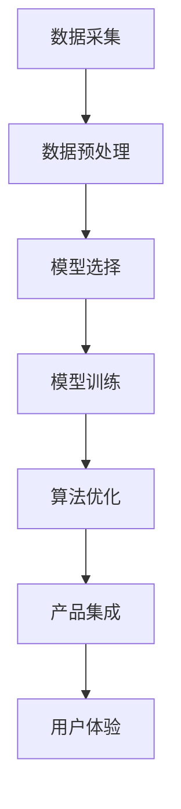

                 

# 产品开发的AI创新应用

## 1. 背景介绍

### 1.1 问题由来
随着人工智能(AI)技术的快速发展，AI在产品开发中的应用已变得越来越广泛。无论是电商、社交、金融还是游戏行业，AI技术的应用都大大提升了用户体验和产品竞争力。AI产品开发涉及到数据获取、模型训练、算法优化、产品集成等多个环节，需要多学科交叉协作。本文将系统介绍AI在产品开发中的应用，包括常见的技术、开发流程和案例分析。

### 1.2 问题核心关键点
AI在产品开发中的应用主要包括以下几个关键点：
- 数据采集和处理：高效、准确地采集和处理产品相关数据，是AI产品开发的基础。
- 模型选择和训练：选择合适的AI模型并对其进行训练，是提升产品性能的关键。
- 算法优化：通过优化算法提高模型效果，避免过度拟合和泛化不足。
- 产品集成：将AI模型集成到产品中，并保证其稳定性和可扩展性。
- 用户体验：AI技术的应用应以用户为中心，提升用户体验和满意度。

## 2. 核心概念与联系

### 2.1 核心概念概述

为更好地理解AI在产品开发中的应用，本节将介绍几个密切相关的核心概念：

- AI产品开发：基于人工智能技术，通过数据获取、模型训练、算法优化和产品集成等环节，构建具备AI功能的产品过程。
- 数据采集：从不同渠道获取产品相关的原始数据，包括用户行为、商品信息、环境数据等。
- 数据预处理：对原始数据进行清洗、归一化、特征工程等处理，提升数据质量和可用性。
- 模型选择：选择合适的AI模型，如神经网络、决策树、集成学习等，用于解决特定问题。
- 模型训练：通过数据训练模型，使其具备解决实际问题的能力。
- 算法优化：通过优化算法提升模型性能，避免过拟合和泛化不足。
- 产品集成：将训练好的AI模型集成到产品中，并进行持续优化和更新。
- 用户体验：AI技术的应用应以提升用户体验为核心目标，保证交互的自然流畅和直观易用。

这些核心概念之间的逻辑关系可以通过以下Mermaid流程图来展示：



这个流程图展示AI在产品开发过程中的主要环节：

1. 通过数据采集获得原始数据。
2. 对原始数据进行预处理，提升数据质量。
3. 根据问题需求选择合适的模型。
4. 利用训练数据对模型进行训练，提升模型能力。
5. 对训练好的模型进行算法优化，提升模型性能。
6. 将优化后的模型集成到产品中，并进行持续优化。
7. 关注用户体验，确保AI技术的应用提升用户体验。

## 3. 核心算法原理 & 具体操作步骤

### 3.1 算法原理概述

AI在产品开发中的应用，本质上是一个从数据获取到模型训练再到产品集成的过程。其核心思想是通过数据驱动，利用算法优化和模型训练，提升产品的智能化水平，增强用户体验。

形式化地，假设原始数据集为 $D=\{(x_i,y_i)\}_{i=1}^N, x_i \in X, y_i \in Y$，其中 $X$ 为输入空间，$Y$ 为输出空间。我们的目标是利用数据 $D$ 构建一个函数 $f(x) \rightarrow y$，使得模型 $f$ 能够高效地对新输入 $x$ 进行预测。

训练模型的目标是最小化损失函数 $\mathcal{L}(f)$，即：

$$
\mathcal{L}(f) = \frac{1}{N} \sum_{i=1}^N \ell(f(x_i),y_i)
$$

其中 $\ell$ 为损失函数，用于衡量模型输出 $f(x_i)$ 与真实标签 $y_i$ 之间的差异。常见的损失函数包括均方误差、交叉熵等。

通过梯度下降等优化算法，不断调整模型参数，使得损失函数 $\mathcal{L}(f)$ 最小化，最终得到最优模型 $f^*$。

### 3.2 算法步骤详解

AI在产品开发中的应用，通常包括以下几个关键步骤：

**Step 1: 数据采集和预处理**
- 收集产品相关的原始数据，包括用户行为、商品信息、环境数据等。
- 对原始数据进行清洗、去重、归一化、特征工程等预处理操作，提升数据质量和可用性。

**Step 2: 模型选择和训练**
- 根据问题需求选择合适的AI模型，如神经网络、决策树、集成学习等。
- 将预处理后的数据划分为训练集和验证集，利用训练集对模型进行训练，调整模型参数。
- 在验证集上评估模型性能，根据性能指标调整模型结构和参数。

**Step 3: 算法优化**
- 通过正则化、dropout、L2正则等技术避免过拟合，提高模型泛化能力。
- 采用随机梯度下降、Adam、Adagrad等优化算法更新模型参数。
- 应用交叉验证、网格搜索等方法寻找最优模型参数组合。

**Step 4: 产品集成和优化**
- 将训练好的模型集成到产品中，并进行持续优化和更新。
- 根据用户反馈和业务需求调整模型参数，提升模型性能。
- 采用A/B测试、用户实验等方法评估模型效果，持续迭代改进。

**Step 5: 用户体验提升**
- 关注用户体验，确保AI技术的应用提升用户体验和满意度。
- 结合用户界面设计，优化交互流程和展示方式，提升产品的可用性和易用性。
- 考虑数据隐私和安全问题，确保用户数据安全，增强用户信任。

以上是AI在产品开发中的应用的一般流程。在实际应用中，还需要根据具体产品特点，对各个环节进行优化设计，如改进数据采集和处理流程、选择更合适的模型结构、优化算法参数等，以进一步提升产品性能。

### 3.3 算法优缺点

AI在产品开发中的应用，具有以下优点：
- 提升产品智能化水平。通过AI技术，可以自动化处理大量数据，提升产品的智能化和自动化水平。
- 优化用户体验。AI技术可以分析用户行为和偏好，提供个性化的服务和建议，提升用户满意度和忠诚度。
- 提高决策效率。通过AI模型，可以快速分析复杂问题，提供数据驱动的决策支持，提高决策效率和质量。

同时，该方法也存在一定的局限性：
- 数据依赖性强。AI的应用依赖于高质量的数据，数据获取和预处理成本高。
- 模型复杂度高。复杂的AI模型需要大量计算资源，训练和推理时间较长。
- 可解释性差。AI模型通常是"黑盒"系统，难以解释其内部工作机制和决策逻辑。
- 隐私和安全风险。AI技术需要大量数据，存在数据泄露和隐私侵犯的风险。

尽管存在这些局限性，但就目前而言，AI在产品开发中的应用已成为主流趋势，不断推动产品智能化升级和用户体验改善。未来相关研究的方向包括如何降低数据依赖、提高模型效率、增强模型可解释性、保护数据隐私等。

### 3.4 算法应用领域

AI在产品开发中的应用已经渗透到各个行业，包括但不限于：

- 电商：利用AI进行商品推荐、广告投放、库存管理等，提升销售转化率和服务效率。
- 金融：利用AI进行风险评估、欺诈检测、客户服务、投资策略等，提升金融服务的智能化和精准度。
- 医疗：利用AI进行疾病诊断、药物研发、患者管理等，提升医疗服务的诊断精度和效率。
- 娱乐：利用AI进行内容推荐、智能客服、游戏AI等，提升用户体验和互动性。
- 制造：利用AI进行设备预测性维护、质量控制、生产调度等，提升生产效率和产品质量。
- 交通：利用AI进行交通流量预测、智能导航、自动驾驶等，提升交通安全和效率。

除了这些传统领域，AI技术还在新兴领域中不断突破，如智慧城市、智能家居、无人驾驶等，为各行各业带来全新的变革。随着AI技术的不断演进，AI在产品开发中的应用将更加广泛和深入。

## 4. 数学模型和公式 & 详细讲解

### 4.1 数学模型构建

本节将使用数学语言对AI在产品开发中的应用进行更加严格的刻画。

假设原始数据集为 $D=\{(x_i,y_i)\}_{i=1}^N, x_i \in X, y_i \in Y$。我们的目标是利用数据 $D$ 构建一个函数 $f(x) \rightarrow y$，使得模型 $f$ 能够高效地对新输入 $x$ 进行预测。

训练模型的目标是最小化损失函数 $\mathcal{L}(f)$，即：

$$
\mathcal{L}(f) = \frac{1}{N} \sum_{i=1}^N \ell(f(x_i),y_i)
$$

其中 $\ell$ 为损失函数，用于衡量模型输出 $f(x_i)$ 与真实标签 $y_i$ 之间的差异。常见的损失函数包括均方误差、交叉熵等。

在实践中，我们通常使用基于梯度的优化算法（如SGD、Adam等）来近似求解上述最优化问题。设 $\eta$ 为学习率，$\lambda$ 为正则化系数，则参数的更新公式为：

$$
\theta \leftarrow \theta - \eta \nabla_{\theta}\mathcal{L}(\theta) - \eta\lambda\theta
$$

其中 $\nabla_{\theta}\mathcal{L}(\theta)$ 为损失函数对参数 $\theta$ 的梯度，可通过反向传播算法高效计算。

### 4.2 公式推导过程

以下我们以回归任务为例，推导均方误差损失函数及其梯度的计算公式。

假设模型 $f_{\theta}(x)$ 在输入 $x$ 上的输出为 $\hat{y}$，表示样本预测值。真实标签 $y$。则均方误差损失函数定义为：

$$
\ell(f_{\theta}(x),y) = \frac{1}{2}(\hat{y} - y)^2
$$

将其代入经验风险公式，得：

$$
\mathcal{L}(\theta) = \frac{1}{N} \sum_{i=1}^N (\hat{y_i} - y_i)^2
$$

根据链式法则，损失函数对参数 $\theta_k$ 的梯度为：

$$
\frac{\partial \mathcal{L}(\theta)}{\partial \theta_k} = \frac{\partial \sum_{i=1}^N (\hat{y_i} - y_i)^2}{\partial \theta_k} = \frac{1}{N} \sum_{i=1}^N -2(\hat{y_i} - y_i) \frac{\partial \hat{y_i}}{\partial \theta_k}
$$

其中 $\frac{\partial \hat{y_i}}{\partial \theta_k}$ 可进一步递归展开，利用自动微分技术完成计算。

在得到损失函数的梯度后，即可带入参数更新公式，完成模型的迭代优化。重复上述过程直至收敛，最终得到适应下游任务的最优模型参数 $\theta^*$。

## 5. 项目实践：代码实例和详细解释说明

### 5.1 开发环境搭建

在进行AI在产品开发中的应用实践前，我们需要准备好开发环境。以下是使用Python进行PyTorch开发的环境配置流程：

1. 安装Anaconda：从官网下载并安装Anaconda，用于创建独立的Python环境。

2. 创建并激活虚拟环境：
```bash
conda create -n pytorch-env python=3.8 
conda activate pytorch-env
```

3. 安装PyTorch：根据CUDA版本，从官网获取对应的安装命令。例如：
```bash
conda install pytorch torchvision torchaudio cudatoolkit=11.1 -c pytorch -c conda-forge
```

4. 安装TensorFlow：
```bash
conda install tensorflow tensorflow-gpu
```

5. 安装TensorBoard：
```bash
pip install tensorboard
```

6. 安装MXNet：
```bash
conda install mxnet
```

7. 安装Flax：
```bash
pip install flax
```

完成上述步骤后，即可在`pytorch-env`环境中开始AI在产品开发中的应用实践。

### 5.2 源代码详细实现

这里以一个简单的电商商品推荐系统为例，给出使用TensorFlow进行AI在产品开发中的应用的PyTorch代码实现。

首先，定义商品推荐模型的输入输出：

```python
import tensorflow as tf

input_shape = (1, 20)
output_shape = (1, 5)

# 定义模型
class RecommendationModel(tf.keras.Model):
    def __init__(self):
        super(RecommendationModel, self).__init__()
        self.dense1 = tf.keras.layers.Dense(256, activation='relu')
        self.dense2 = tf.keras.layers.Dense(128, activation='relu')
        self.dense3 = tf.keras.layers.Dense(5, activation='softmax')

    def call(self, inputs):
        x = self.dense1(inputs)
        x = self.dense2(x)
        x = self.dense3(x)
        return x

# 创建模型
model = RecommendationModel()
```

然后，定义数据集：

```python
# 定义数据集
class RecommendationDataset(tf.keras.utils.Sequence):
    def __init__(self, data):
        self.data = data
        self.dim_x = input_shape[1]
        self.dim_y = output_shape[1]

    def __len__(self):
        return len(self.data)

    def __getitem__(self, idx):
        x = tf.expand_dims(self.data[idx][0], axis=0)
        y = tf.expand_dims(self.data[idx][1], axis=0)
        return x, y

# 加载数据集
train_dataset = RecommendationDataset(train_data)
test_dataset = RecommendationDataset(test_data)
```

接着，定义损失函数和优化器：

```python
# 定义损失函数
def compute_loss(labels, logits):
    return tf.keras.losses.sparse_categorical_crossentropy(labels, logits)

# 定义优化器
optimizer = tf.keras.optimizers.Adam(learning_rate=0.001)
```

最后，执行模型训练和评估：

```python
# 训练模型
model.compile(optimizer=optimizer, loss=compute_loss)
model.fit(train_dataset, epochs=10, validation_data=test_dataset)

# 评估模型
model.evaluate(test_dataset)
```

以上就是使用TensorFlow对商品推荐系统进行AI在产品开发中的应用实践的完整代码实现。可以看到，得益于TensorFlow的强大封装，我们可以用相对简洁的代码完成商品推荐系统的开发。

### 5.3 代码解读与分析

让我们再详细解读一下关键代码的实现细节：

**RecommendationModel类**：
- `__init__`方法：初始化模型结构，包括三个全连接层。
- `call`方法：前向传播计算，将输入数据依次通过三个全连接层，输出预测结果。

**RecommendationDataset类**：
- `__init__`方法：初始化数据集，将数据拆分为输入和输出。
- `__len__`方法：返回数据集长度。
- `__getitem__`方法：对单个样本进行处理，将输入数据和输出标签转换为模型所需格式。

**compute_loss函数**：
- 计算交叉熵损失函数，用于评估模型预测结果与真实标签之间的差异。

**训练流程**：
- 定义损失函数和优化器，并进行模型编译。
- 在训练集上进行模型训练，并在验证集上评估模型性能。
- 在测试集上对训练好的模型进行评估，给出最终测试结果。

可以看出，TensorFlow提供了完整的模型构建、数据处理、损失定义和优化器选择，极大地降低了AI在产品开发中的应用门槛，使得开发者可以更加专注于算法的实现和模型的优化。

当然，实际的应用系统还需要考虑更多因素，如模型的保存和部署、超参数的自动搜索、更灵活的任务适配层等。但核心的AI在产品开发中的应用流程基本与此类似。

## 6. 实际应用场景

### 6.1 智能客服系统

AI在智能客服系统中的应用，可以显著提升客户服务质量和效率。传统的客服系统需要配备大量人工，高峰期响应缓慢，且服务质量难以保证。通过AI技术，可以实现24/7无间断服务，快速响应客户咨询，用自然流畅的语言解答各类常见问题。

在技术实现上，可以收集企业内部的历史客服对话记录，将问题和最佳答复构建成监督数据，在此基础上对预训练对话模型进行微调。微调后的对话模型能够自动理解用户意图，匹配最合适的答案模板进行回复。对于客户提出的新问题，还可以接入检索系统实时搜索相关内容，动态组织生成回答。如此构建的智能客服系统，能大幅提升客户咨询体验和问题解决效率。

### 6.2 金融舆情监测

金融机构需要实时监测市场舆论动向，以便及时应对负面信息传播，规避金融风险。传统的人工监测方式成本高、效率低，难以应对网络时代海量信息爆发的挑战。通过AI技术，可以实现金融舆情监测自动化，及时识别和分析市场舆情变化，预警潜在风险。

具体而言，可以收集金融领域相关的新闻、报道、评论等文本数据，并对其进行情感标注和主题标注。在此基础上对预训练语言模型进行微调，使其能够自动判断文本属于何种主题，情感倾向是正面、中性还是负面。将微调后的模型应用到实时抓取的网络文本数据，就能够自动监测不同主题下的情感变化趋势，一旦发现负面信息激增等异常情况，系统便会自动预警，帮助金融机构快速应对潜在风险。

### 6.3 个性化推荐系统

当前的推荐系统往往只依赖用户的历史行为数据进行物品推荐，无法深入理解用户的真实兴趣偏好。通过AI技术，个性化推荐系统可以更好地挖掘用户行为背后的语义信息，从而提供更精准、多样的推荐内容。

在实践中，可以收集用户浏览、点击、评论、分享等行为数据，提取和用户交互的物品标题、描述、标签等文本内容。将文本内容作为模型输入，用户的后续行为（如是否点击、购买等）作为监督信号，在此基础上微调预训练语言模型。微调后的模型能够从文本内容中准确把握用户的兴趣点。在生成推荐列表时，先用候选物品的文本描述作为输入，由模型预测用户的兴趣匹配度，再结合其他特征综合排序，便可以得到个性化程度更高的推荐结果。

### 6.4 未来应用展望

随着AI技术的不断演进，AI在产品开发中的应用前景广阔，未来将会有更多的创新应用。

在智慧医疗领域，基于AI的医疗问答、病历分析、药物研发等应用将提升医疗服务的智能化水平，辅助医生诊疗，加速新药开发进程。

在智能教育领域，AI技术可应用于作业批改、学情分析、知识推荐等方面，因材施教，促进教育公平，提高教学质量。

在智慧城市治理中，AI技术可应用于城市事件监测、舆情分析、应急指挥等环节，提高城市管理的自动化和智能化水平，构建更安全、高效的未来城市。

此外，在企业生产、社会治理、文娱传媒等众多领域，AI在产品开发中的应用也将不断涌现，为各行各业带来全新的变革。相信随着技术的日益成熟，AI在产品开发中的应用将更加广泛和深入。

## 7. 工具和资源推荐

### 7.1 学习资源推荐

为了帮助开发者系统掌握AI在产品开发中的应用理论基础和实践技巧，这里推荐一些优质的学习资源：

1. Coursera《机器学习》课程：斯坦福大学开设的机器学习课程，系统介绍了机器学习的基本概念和算法原理，适合初学者入门。

2. DeepLearning.AI《深度学习专项课程》：由Andrew Ng教授主讲的深度学习课程，介绍了深度学习的基础知识和实践技巧，适合有一定基础的开发者学习。

3. TensorFlow官方文档：提供了丰富的TensorFlow使用示例和文档，是AI在产品开发中的重要参考。

4. PyTorch官方文档：提供了全面的PyTorch使用指南和文档，适合TensorFlow开发者学习。

5. PyTorch中文社区：提供丰富的PyTorch学习资源和社区支持，适合开发者交流学习和问题解决。

6. Kaggle数据集和竞赛：提供了大量开源数据集和AI竞赛，适合开发者实践和验证学习成果。

通过对这些资源的学习实践，相信你一定能够快速掌握AI在产品开发中的应用精髓，并用于解决实际的NLP问题。

### 7.2 开发工具推荐

高效的开发离不开优秀的工具支持。以下是几款用于AI在产品开发中的应用开发的常用工具：

1. TensorFlow：由Google主导开发的开源深度学习框架，生产部署方便，适合大规模工程应用。

2. PyTorch：基于Python的开源深度学习框架，灵活动态的计算图，适合快速迭代研究。

3. MXNet：由Amazon主导开发的深度学习框架，支持多种编程语言，具有高效率和高可扩展性。

4. JAX：由Google开发的自动微分和向量运算库，可以替代TensorFlow和PyTorch，适合高性能计算。

5. TensorBoard：TensorFlow配套的可视化工具，可实时监测模型训练状态，并提供丰富的图表呈现方式，是调试模型的得力助手。

6. PyTorch Lightning：基于PyTorch的轻量级框架，简化模型构建和训练流程，适合快速原型开发和模型调优。

合理利用这些工具，可以显著提升AI在产品开发中的应用开发效率，加快创新迭代的步伐。

### 7.3 相关论文推荐

AI在产品开发中的应用技术的发展源于学界的持续研究。以下是几篇奠基性的相关论文，推荐阅读：

1. DeepMind《Generative Adversarial Nets》：提出了生成对抗网络（GAN），为图像生成和深度学习提供了新的思路。

2. Yann LeCun《Backpropagation Applied to Handwritten Zip Code Recognition》：介绍了反向传播算法，为深度学习提供了重要的计算基础。

3. Ian Goodfellow《Universal Approximation Theorems》：证明了深度神经网络具备逼近任意复杂函数的能力，为深度学习提供了理论基础。

4. Andrew Ng《Learning from Data》：介绍了机器学习的各种算法和应用，适合初学者系统学习。

5. Yoshua Bengio《Deep Learning for NLP》：介绍了深度学习在自然语言处理中的应用，适合NLP领域的研究者学习。

6. Fei-Fei Li《CS231n: Convolutional Neural Networks for Visual Recognition》：介绍了卷积神经网络在图像识别中的应用，适合图像领域的研究者学习。

这些论文代表了大模型微调技术的演进历程。通过学习这些前沿成果，可以帮助研究者把握学科前进方向，激发更多的创新灵感。

## 8. 总结：未来发展趋势与挑战

### 8.1 总结

本文对AI在产品开发中的应用进行了全面系统的介绍。首先阐述了AI在产品开发中的应用背景和意义，明确了AI在产品开发中的关键环节和优化方向。其次，从原理到实践，详细讲解了AI在产品开发中的应用数学模型和关键步骤，给出了AI在产品开发中的应用完整代码实例。同时，本文还广泛探讨了AI在智能客服、金融舆情、个性化推荐等多个行业领域的应用前景，展示了AI在产品开发中的巨大潜力。

通过本文的系统梳理，可以看到，AI在产品开发中的应用正在成为AI技术落地的重要方向，极大地提升了产品智能化水平和用户体验。未来，随着AI技术的不断演进，AI在产品开发中的应用将更加广泛和深入，为各行各业带来颠覆性的变革。

### 8.2 未来发展趋势

展望未来，AI在产品开发中的应用将呈现以下几个发展趋势：

1. AI与多模态数据的融合。未来的AI系统将不再局限于文本和图像数据，能够整合多模态数据，提升系统的智能化水平。

2. AI与物联网的深度结合。AI在产品开发中的应用将与物联网技术相结合，构建更加智能化的物理世界。

3. AI与区块链的协同发展。未来的AI系统将与区块链技术相结合，提升系统的安全性、透明性和可信度。

4. AI与量子计算的协同演进。随着量子计算技术的不断发展，AI在产品开发中的应用将更加高效和智能。

5. AI与边缘计算的协同部署。未来的AI系统将在边缘计算平台上运行，实现低延迟和高效率的数据处理和分析。

6. AI与联邦学习的协同优化。未来的AI系统将通过联邦学习技术，在保护用户隐私的同时，实现数据的协同优化和模型训练。

以上趋势凸显了AI在产品开发中的广阔前景。这些方向的探索发展，必将进一步推动AI在产品开发中的应用，为构建智能产品生态提供新的思路和技术手段。

### 8.3 面临的挑战

尽管AI在产品开发中的应用已经取得了显著成效，但在迈向更加智能化、普适化应用的过程中，它仍面临着诸多挑战：

1. 数据隐私和安全问题。AI系统需要大量数据，存在数据泄露和隐私侵犯的风险。如何在数据利用和隐私保护之间找到平衡，将是未来的一大挑战。

2. 模型复杂度和效率问题。AI系统通常需要复杂模型和大量计算资源，如何在保证性能的同时，提高模型效率，优化计算资源，将是未来的一大挑战。

3. 可解释性和可控性问题。AI系统通常是"黑盒"系统，难以解释其内部工作机制和决策逻辑。如何增强AI系统的可解释性和可控性，将是未来的一大挑战。

4. 伦理和法律问题。AI系统的应用需要遵守伦理和法律规范，如何确保AI系统的公平、透明和公正，将是未来的一大挑战。

5. 用户接受度和适应性问题。AI系统需要与用户无缝融合，提升用户体验。如何在短时间内获得用户信任和适应性，将是未来的一大挑战。

6. 跨学科协同问题。AI系统需要多学科协同工作，如何优化跨学科协作流程，提升整体研发效率，将是未来的一大挑战。

正视AI在产品开发中所面临的这些挑战，积极应对并寻求突破，将是大模型微调技术走向成熟的必由之路。相信随着学界和产业界的共同努力，这些挑战终将一一被克服，AI在产品开发中的应用必将在构建人机协同的智能时代中扮演越来越重要的角色。

### 8.4 研究展望

面对AI在产品开发中所面临的挑战，未来的研究需要在以下几个方面寻求新的突破：

1. 探索无监督和半监督学习算法。摆脱对大规模标注数据的依赖，利用自监督学习、主动学习等无监督和半监督范式，最大限度利用非结构化数据，实现更加灵活高效的AI在产品开发中的应用。

2. 开发更加高效和可解释的AI模型。通过模型压缩、知识蒸馏等技术，提高AI模型的效率和可解释性，使其具备更好的可控性和可解释性。

3. 加强跨学科知识融合。通过跨学科协作，将符号化的先验知识与神经网络模型进行巧妙融合，引导AI系统学习更准确、合理的知识表示。

4. 结合因果分析和博弈论工具。将因果分析方法引入AI系统，识别出系统决策的关键特征，增强输出解释的因果性和逻辑性。借助博弈论工具刻画人机交互过程，主动探索并规避系统的脆弱点，提高系统稳定性。

5. 纳入伦理道德约束。在AI系统训练目标中引入伦理导向的评估指标，过滤和惩罚有害的输出倾向。加强人工干预和审核，建立模型行为的监管机制，确保输出符合人类价值观和伦理道德。

这些研究方向的探索，必将引领AI在产品开发中的应用技术迈向更高的台阶，为构建安全、可靠、可解释、可控的智能产品生态提供新的思路和技术手段。面向未来，AI在产品开发中的应用还需要与其他AI技术进行更深入的融合，如知识表示、因果推理、强化学习等，多路径协同发力，共同推动人工智能技术在垂直行业的规模化落地。只有勇于创新、敢于突破，才能不断拓展AI在产品开发中的应用边界，让AI技术更好地造福人类社会。

## 9. 附录：常见问题与解答

**Q1: 如何选择合适的AI模型？**

A: 选择合适的AI模型需要综合考虑以下几个因素：
1. 任务类型：不同任务类型适合不同模型，如文本分类适合卷积神经网络，图像识别适合卷积神经网络，语音识别适合RNN等。
2. 数据量：数据量大的任务适合复杂模型，数据量小的任务适合轻量级模型。
3. 计算资源：计算资源丰富的环境适合复杂模型，计算资源受限的环境适合轻量级模型。
4. 可解释性：需要模型解释性的任务适合可解释性强的模型，如决策树、线性回归等。

**Q2: 如何提高AI在产品开发中的效率？**

A: 提高AI在产品开发中的效率，可以从以下几个方面入手：
1. 数据预处理：对原始数据进行清洗、归一化、特征工程等预处理操作，提升数据质量和可用性。
2. 模型优化：通过正则化、dropout、L2正则等技术避免过拟合，提高模型泛化能力。
3. 自动化调参：使用自动调参工具，如hyperopt、sklearn-optuna等，快速寻找最优模型参数组合。
4. 分布式训练：使用分布式训练框架，如TensorFlow、PyTorch等，提升模型训练速度和效率。
5. 代码优化：优化代码实现，减少计算时间和内存占用，提高模型效率。

**Q3: 如何保证AI在产品开发中的稳定性？**

A: 保证AI在产品开发中的稳定性，可以从以下几个方面入手：
1. 数据质量：确保数据质量，避免数据噪声和异常影响模型性能。
2. 模型验证：在模型训练过程中进行交叉验证，确保模型泛化能力。
3. 模型调优：通过A/B测试、用户实验等方法评估模型效果，持续迭代改进。
4. 硬件优化：优化硬件配置，如使用GPU/TPU等高性能设备，提升模型推理速度和效率。
5. 系统监控：实时监测系统指标，设置异常告警阈值，确保系统稳定性和可靠性。

**Q4: 如何提高AI在产品开发中的可解释性？**

A: 提高AI在产品开发中的可解释性，可以从以下几个方面入手：
1. 模型结构透明：使用可解释性强的模型结构，如决策树、线性回归等，降低模型的"黑盒"程度。
2. 特征重要性分析：使用特征重要性分析工具，如SHAP、LIME等，帮助用户理解模型决策过程。
3. 可视化工具：使用可视化工具，如TensorBoard、PyTorch Lightning等，展示模型训练和推理过程。
4. 专家知识结合：将符号化的先验知识与神经网络模型进行巧妙融合，引导模型学习更准确、合理的知识表示。

**Q5: 如何处理AI在产品开发中的隐私和安全问题？**

A: 处理AI在产品开发中的隐私和安全问题，可以从以下几个方面入手：
1. 数据脱敏：对数据进行匿名化、模糊化等处理，保护用户隐私。
2. 数据加密：对数据进行加密存储和传输，确保数据安全。
3. 访问控制：设置严格的访问控制策略，确保数据仅被授权用户访问。
4. 模型保护：对模型进行加密保护，防止模型被恶意篡改和窃取。
5. 法律合规：遵守相关法律法规，确保数据和模型的使用符合法律要求。

通过这些方法，可以有效保护用户隐私和数据安全，增强AI在产品开发中的应用可信度。

---

作者：禅与计算机程序设计艺术 / Zen and the Art of Computer Programming

