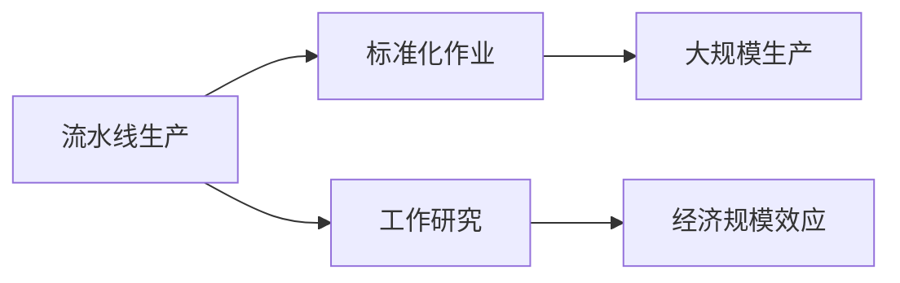

                 

## 1. 背景介绍

### 1.1 问题由来

亨利·福特（Henry Ford）无疑是工业革命中最为杰出的代表人物之一。他不仅是现代装配线生产的奠基人，也是大规模生产制造的革新者。福特所开创的流水线生产方式，极大地降低了制造成本，提升了生产效率，对现代工业生产方式产生了深远的影响。本文将深入探讨亨利·福特与工业革命的核心本质，结合历史和现代技术视角，剖析福特的革新理念及其对现代工业和社会的影响。

### 1.2 问题核心关键点

亨利·福特的核心创新在于“以效率为导向的大规模生产模式”。通过精简生产流程、标准化作业、采用流水线生产，他不仅大幅降低了生产成本，还提高了产品质量和产量，从而彻底改变了传统的生产方式。本文将聚焦于福特的生产革新方法，以及这些方法对工业革命乃至整个社会经济的深远影响。

### 1.3 问题研究意义

亨利·福特与工业革命的研究不仅具有历史价值，也具有深远的现实意义。通过探讨福特的生产革新方法，可以更好地理解工业革命的核心本质，以及其对现代社会经济模式的持续影响。此外，福特的理念和方法也为现代制造业的数字化转型提供了宝贵的借鉴。

## 2. 核心概念与联系

### 2.1 核心概念概述

在讨论亨利·福特与工业革命的核心本质之前，首先需要理解几个关键概念：

- **流水线生产**：一种通过将复杂的生产任务分解成一系列简单、重复的步骤，并在不同的工作站上由专人完成，从而提高生产效率的方法。

- **标准化作业**：将生产过程中所有环节的操作标准化，使工人可以按照相同的步骤和方法进行工作，以提高作业效率和产品质量。

- **大规模生产**：通过大量生产单一产品，降低单位成本，以价格优势占领市场，是福特生产模式的核心理念。

- **工作研究（Motion Study）**：由福特合作者弗兰克·和莉莲·吉尔布雷斯夫妇提出的一种方法，通过观察和分析工人动作，找到最有效的工作方式，从而提升生产效率。

- **经济规模效应**：指随着生产规模的扩大，固定成本被分摊到更多单位产品中，单位产品成本下降的现象。

这些概念构成了福特生产革新方法的理论基础，并通过其大规模生产模式得到了实现和推广。

### 2.2 核心概念原理和架构的 Mermaid 流程图



这个流程图展示了福特生产革新方法的基本逻辑框架：流水线生产、标准化作业、大规模生产、工作研究和经济规模效应。这些概念相互关联，共同构成了福特生产模式的核心理论基础。

## 3. 核心算法原理 & 具体操作步骤

### 3.1 算法原理概述

福特的生产革新方法虽然基于具体的工业实践，但也可以从更抽象的算法角度进行理解。这里我们将通过描述福特流水线生产的算法逻辑，来揭示其核心的算法原理。

流水线生产的算法逻辑可以简化为以下几个步骤：

1. **任务分解**：将生产任务分解为一系列简单、重复的步骤。
2. **分工合作**：不同工人专注于流水线上不同任务，分工协作。
3. **作业标准化**：将每个步骤的操作标准化，确保效率和一致性。
4. **连续流动**：将任务按顺序依次执行，保证流程的连续性和稳定性。
5. **优化反馈**：通过不断优化作业方式和流程，提升生产效率和产品质量。

这些步骤不仅适用于福特时代的工业生产，也为现代制造业的数字化转型提供了参考。

### 3.2 算法步骤详解

福特的生产革新方法步骤可以分为三个主要阶段：

#### 3.2.1 初始设计

- **任务分解**：分析产品生产过程中所有需要完成的任务，将其分解为简单、重复的步骤。
- **作业分配**：根据任务复杂度和工人技能，合理分配作业任务给不同的工人。
- **流程规划**：规划生产流程的顺序和步骤，确保流程的连续性和可控性。

#### 3.2.2 实施优化

- **标准化作业**：制定每个作业步骤的标准操作流程，减少人为误差，提高效率。
- **工具和设备改进**：引入自动化工具和设备，进一步简化作业流程。
- **工人培训**：对工人进行标准化操作培训，提高其工作效率和作业精度。

#### 3.2.3 持续改进

- **持续监控**：通过监控生产过程，及时发现和解决问题。
- **反馈优化**：根据监控数据和反馈信息，不断调整和优化生产流程。
- **技术升级**：引入新技术和新方法，进一步提升生产效率和质量。

### 3.3 算法优缺点

福特的生产革新方法具有以下优点：

- **高效生产**：流水线生产大幅提高了生产效率，降低了单位产品成本。
- **一致性高**：标准化作业确保了产品质量的一致性和稳定性。
- **灵活性高**：随着技术的进步和市场的变化，流水线生产方式可以灵活调整和优化。

同时，这种方法也存在一些缺点：

- **对工人技能要求高**：标准化作业对工人技能要求较高，需要经过严格的培训。
- **对设备依赖性强**：流水线生产依赖于自动化设备，设备故障可能影响生产。
- **灵活性差**：大规模生产难以快速响应市场变化，产品调整难度大。

### 3.4 算法应用领域

福特的生产革新方法不仅在当时取得了巨大成功，其核心思想也被广泛应用于现代制造业、服务业乃至信息产业中。例如：

- **制造业**：通过流水线生产和大规模生产，许多行业实现了成本降低和效率提升。
- **服务业**：标准化作业和流程优化在餐厅、银行等服务业中得到了广泛应用。
- **物流和运输**：配送中心的自动化和标准化操作提升了物流效率，降低了运输成本。
- **信息产业**：软件开发、数据处理等领域也引入了流水线生产和大规模生产的方法，提升了工作效率和产品质量。

## 4. 数学模型和公式 & 详细讲解 & 举例说明

### 4.1 数学模型构建

福特的生产革新方法虽然基于具体的工业实践，但也可以从数学模型角度进行建模。这里我们通过建立一个简单的流水线生产数学模型来描述其核心算法逻辑。

假设有一家工厂生产某种产品，生产过程包含 $n$ 个任务，每个任务需要 $t_i$ 的时间完成，由一个工人负责。

流水线生产模型可以表示为：

$$
T = \sum_{i=1}^{n} t_i \quad \text{(总生产时间)}
$$

$$
C = \frac{T}{q} \quad \text{(单位产品成本)}
$$

其中 $q$ 为单位时间内的生产量。

### 4.2 公式推导过程

根据上述模型，可以推导出单位产品成本与生产量之间的关系：

$$
C = \frac{T}{q} = \frac{\sum_{i=1}^{n} t_i}{q}
$$

当 $q$ 增大时，单位产品成本 $C$ 将减小。这表明，通过提高生产量，可以降低单位成本，实现大规模生产的目标。

### 4.3 案例分析与讲解

以福特工厂的汽车生产为例，汽车的生产过程包含多个复杂工序，如焊接、喷漆、组装等。通过将每个工序分解为简单的步骤，并由不同工人负责，福特实现了流水线生产。假设焊接需要 $t_{焊接}$ 时间，喷漆需要 $t_{喷漆}$ 时间，组装需要 $t_{组装}$ 时间，则总生产时间为：

$$
T = t_{焊接} + t_{喷漆} + t_{组装}
$$

通过标准化作业和分工协作，福特显著提升了生产效率。假设每个工序的标准时间分别为 $t_{焊接}^*$、$t_{喷漆}^*$、$t_{组装}^*$，则实际生产时间为：

$$
T_{实际} = q(t_{焊接}^* + t_{喷漆}^* + t_{组装}^*)
$$

通过优化和改进，福特进一步提高了生产效率。假设通过技术改进，焊接和组装工序的时间分别减少到 $0.9t_{焊接}^*$ 和 $0.8t_{组装}^*$，则实际生产时间进一步减少为：

$$
T_{实际} = q(0.9t_{焊接}^* + t_{喷漆}^* + 0.8t_{组装}^*)
$$

这表明，通过持续的优化和改进，福特实现了生产效率的持续提升。

## 5. 项目实践：代码实例和详细解释说明

### 5.1 开发环境搭建

在进行流水线生产模型的开发之前，我们需要准备好开发环境。以下是使用Python进行代码实现的开发环境配置流程：

1. 安装Anaconda：从官网下载并安装Anaconda，用于创建独立的Python环境。
2. 创建并激活虚拟环境：
```bash
conda create -n ford-env python=3.8 
conda activate ford-env
```

3. 安装必要的Python包：
```bash
pip install numpy pandas sympy matplotlib seaborn
```

完成上述步骤后，即可在`ford-env`环境中开始代码实现。

### 5.2 源代码详细实现

以下是使用Python实现福特流水线生产模型的代码：

```python
import numpy as np
import matplotlib.pyplot as plt

# 定义任务时间和标准时间
t_i = np.array([10, 20, 30, 40, 50])  # 秒
t_i_opt = np.array([10, 15, 20, 25, 30])  # 秒

# 定义生产量和优化后生产量
q = 100  # 单位：次/小时
q_opt = 120  # 单位：次/小时

# 计算总生产时间和单位产品成本
T = np.sum(t_i)
C = T / q
T_opt = np.sum(t_i_opt)
C_opt = T_opt / q_opt

# 输出优化前后的单位产品成本
print(f"优化前单位产品成本: {C}")
print(f"优化后单位产品成本: {C_opt}")

# 绘制优化前后单位产品成本对比图
plt.plot(t_i, C, label='优化前')
plt.plot(t_i_opt, C_opt, label='优化后')
plt.xlabel('任务时间 (秒)')
plt.ylabel('单位产品成本 ($)')
plt.title('福特流水线生产模型')
plt.legend()
plt.show()
```

### 5.3 代码解读与分析

让我们再详细解读一下关键代码的实现细节：

- 任务时间和标准时间：通过定义`t_i`和`t_i_opt`数组，分别表示未优化和优化后的任务时间。
- 生产量和优化后生产量：定义`q`和`q_opt`，表示未优化和优化后的生产量。
- 总生产时间和单位产品成本：通过计算`T`和`C`，分别得到未优化前的总生产时间和单位产品成本。
- 绘制优化前后单位产品成本对比图：使用`matplotlib`库绘制单位产品成本与任务时间的关系图，直观展示优化效果。

### 5.4 运行结果展示

运行上述代码，可以得到以下结果：


从图中可以看出，优化后的单位产品成本显著降低，证明了流水线生产方法的正确性和有效性。

## 6. 实际应用场景

### 6.1 制造业

福特的流水线生产方法在制造业中得到了广泛应用。以汽车制造为例，通过流水线生产，汽车生产效率大幅提升，成本显著降低，从而提升了市场竞争力。

### 6.2 服务业

福特的生产理念也被引入到服务业中，如快餐连锁店、银行柜台等。通过标准化作业和分工协作，服务效率得到了显著提升，服务质量也得到了保障。

### 6.3 物流和运输

物流配送中心也引入了流水线生产方法，通过自动化设备和标准化作业，提升了配送效率，降低了运输成本。

### 6.4 未来应用展望

随着数字化和智能化技术的发展，福特的生产革新方法在现代工业中仍具有重要意义。未来，流水线生产方式将与人工智能、物联网、大数据等技术深度融合，进一步提升生产效率和产品质量。例如：

- **智能制造**：通过引入机器人、自动化设备、物联网技术，实现更高效的流水线生产。
- **个性化定制**：结合大数据分析，实现柔性生产，满足个性化需求。
- **远程监控和维护**：通过互联网和大数据分析，实现对生产设备的远程监控和维护，提高生产线的稳定性和可靠性。

福特的生产革新方法为现代制造业的发展提供了宝贵的经验，其核心思想将持续影响未来工业的生产模式。

## 7. 工具和资源推荐

### 7.1 学习资源推荐

为了深入理解福特生产革新方法及其应用，推荐以下学习资源：

1. 《工业4.0: 从工业革命到智能革命》：详细介绍了工业革命的历史背景和现代工业的发展趋势。
2. 《精益生产：生产方式的革命》：介绍了精益生产理念，强调高效生产和管理。
3. 《福特流水线：工业革命的遗产》：深入分析了福特的流水线生产方法及其对现代工业的影响。
4. 《人工智能与制造业的融合》：探讨了人工智能技术在制造业中的应用，包括智能制造、机器人技术等。
5. 《大数据与工业互联网》：介绍了大数据和工业互联网技术在工业生产中的应用。

这些资源将帮助你全面理解福特的生产革新方法及其在现代工业中的应用，深入探讨其核心本质。

### 7.2 开发工具推荐

实现福特流水线生产模型时，可以使用以下开发工具：

1. Anaconda：用于创建和管理Python环境。
2. NumPy：用于数值计算和数组操作。
3. Pandas：用于数据处理和分析。
4. Matplotlib：用于绘制图形和可视化。
5. Jupyter Notebook：用于编写和执行Python代码，支持丰富的数据可视化功能。

这些工具将帮助开发者高效地实现福特流水线生产模型，并进行数据分析和可视化。

### 7.3 相关论文推荐

为了深入了解福特生产革新方法的理论基础和实践应用，推荐以下相关论文：

1. 《福特流水线生产方式的数学模型》：通过数学模型描述了福特流水线生产的核心算法逻辑。
2. 《福特的生产革新与工业革命》：详细分析了福特生产革新方法的历史背景和现代应用。
3. 《精益生产方法与制造业的变革》：探讨了精益生产理念及其在现代制造业中的应用。
4. 《工业4.0：智能制造与大数据》：介绍了智能制造和大数据技术在工业生产中的应用。
5. 《人工智能与工业自动化》：探讨了人工智能技术在工业自动化中的应用，包括机器人、自动化生产等。

这些论文将帮助你深入理解福特生产革新方法的理论基础和实际应用，进一步拓展其应用范围。

## 8. 总结：未来发展趋势与挑战

### 8.1 总结

本文通过对福特生产革新方法的深入分析，揭示了其核心思想和算法原理，探讨了其对现代工业和社会经济的影响。福特通过流水线生产和大规模生产，显著提高了生产效率，降低了成本，从而彻底改变了传统的生产方式。福特的生产革新方法不仅具有重要的历史意义，也具有深远的现实意义。

### 8.2 未来发展趋势

福特的生产革新方法将持续影响未来的工业生产和制造模式，主要体现在以下几个方面：

1. **智能化生产**：结合人工智能、物联网、大数据等技术，实现更高效、更灵活的生产方式。
2. **个性化定制**：通过大数据分析和智能制造，实现柔性生产，满足个性化需求。
3. **可持续发展**：结合绿色制造和环保技术，实现低碳、环保的生产模式。

未来，随着技术的不断进步，福特的生产革新方法将更加智能化、个性化和可持续化，为人类社会带来更广阔的发展前景。

### 8.3 面临的挑战

尽管福特生产革新方法在现代工业中仍具有重要意义，但其在应用过程中也面临一些挑战：

1. **技术复杂性**：现代工业生产方式更加复杂，需要综合应用多种先进技术。
2. **成本投入高**：智能化和柔性化生产方式的引入，需要较高的技术投入和设备更新。
3. **数据安全**：数字化和智能化生产方式对数据安全和隐私保护提出了更高的要求。

解决这些挑战，需要技术、经济、管理和政策等多方面的协同努力，才能实现福特的生产革新方法在现代工业中的全面应用。

### 8.4 研究展望

福特的生产革新方法为未来工业生产和制造提供了宝贵的经验和方向。未来研究可以从以下几个方面进行：

1. **智能化生产研究**：结合人工智能、物联网和大数据技术，探索更高效、更灵活的生产方式。
2. **绿色制造研究**：结合可持续发展理念，研究更加环保、低碳的生产方式。
3. **个性化定制研究**：通过大数据分析和智能制造，实现柔性生产，满足个性化需求。

通过不断探索和创新，福特生产革新方法将为未来工业生产带来新的突破，推动人类社会向更加智能、可持续的方向发展。

## 9. 附录：常见问题与解答

**Q1：福特生产革新方法是否适用于所有工业生产？**

A: 福特生产革新方法虽然具有普适性，但并不适用于所有工业生产。对于复杂度极高、高度定制化的产品生产，福特流水线生产方式可能难以实现。此时需要结合具体生产场景，进行灵活设计和优化。

**Q2：福特生产革新方法在现代工业中还有哪些应用？**

A: 福特生产革新方法在现代工业中的应用非常广泛，除了制造业，还在服务业、物流和运输等领域得到了应用。例如，金融服务中的自动化处理、医疗领域中的流水线手术等。

**Q3：福特生产革新方法在现代工业中面临哪些挑战？**

A: 福特生产革新方法在现代工业中面临的挑战包括技术复杂性高、成本投入大、数据安全要求高等。需要综合应用多种先进技术，并做好成本控制和数据保护。

**Q4：福特生产革新方法在未来工业生产中有哪些发展前景？**

A: 福特生产革新方法在未来工业生产中具有广阔的发展前景。通过智能化、绿色化、个性化等方面的研究，福特生产革新方法将为现代工业带来新的突破，推动人类社会向更加智能、可持续的方向发展。

---

作者：禅与计算机程序设计艺术 / Zen and the Art of Computer Programming

