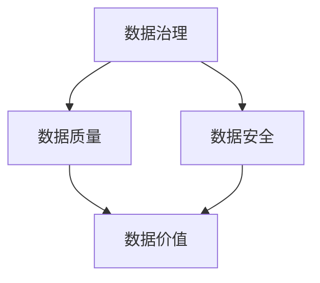

                 

# 人工智能创业数据管理的重要性分析

> 关键词：人工智能,创业,数据管理,数据安全,数据隐私,数据治理,大数据,云计算,AI创业,数据决策,数据价值,商业智能,数据驱动,数据质量

## 1. 背景介绍

### 1.1 问题由来
随着人工智能(AI)技术的迅猛发展，越来越多的初创企业开始将AI作为核心竞争力。然而，数据作为AI的"食粮"，其管理水平直接决定了AI项目的成败。合理的数据管理不仅能提升AI系统的精准度和效率，还能为企业带来可观的经济效益。但在现实中，许多初创企业因为缺乏系统化的数据管理方法，导致数据质量低、数据治理混乱，最终影响了AI系统的性能和应用效果。

本文将深入分析AI创业数据管理的核心概念、关键技术和最佳实践，帮助创业者理解数据管理的价值，并提供切实可行的解决方案。

### 1.2 问题核心关键点
在AI创业中，数据管理的重要性体现在以下几个方面：

1. **数据质量**：AI系统性能的优劣直接取决于数据的质量。高精度、完备性、及时性的数据能够提高AI模型的泛化能力和鲁棒性。
2. **数据安全**：隐私数据和商业机密的泄露可能给企业带来严重的损失。数据管理需要严格保护数据的机密性和完整性，避免数据泄露和篡改。
3. **数据治理**：数据管理的规范化和标准化可以提升数据的质量和可用性，为企业带来更高的决策支持。
4. **数据成本**：数据获取、存储、清洗和处理的成本占用了大量的企业资源，合理的数据管理可以优化资源配置，提升效率。
5. **数据驱动决策**：良好的数据管理能够为企业提供更可靠的数据支持，辅助决策者制定更科学的商业策略。

本文将从数据治理、数据安全、数据质量、数据价值等几个方面，详细探讨如何有效管理AI创业中的数据，确保数据管理的科学性、合理性和有效性。

## 2. 核心概念与联系

### 2.1 核心概念概述

要深入理解AI创业的数据管理，首先需要了解一些关键概念：

- **数据治理(Data Governance)**：指企业对数据管理活动的正式规划和管理。包括数据分类、数据质量、数据治理策略等。数据治理的核心目标是提升数据的质量和可用性。
- **数据安全(Data Security)**：指保护数据不受未经授权的访问、修改和泄露。包括数据加密、访问控制、审计跟踪等。数据安全的目的是确保数据在生命周期内的完整性和机密性。
- **数据质量(Data Quality)**：指数据的准确性、完整性、一致性和及时性。良好的数据质量是AI系统高效运作的基础。
- **数据价值(Data Value)**：指数据对于企业战略、运营、市场等决策的价值。数据价值越高，企业的竞争力和收益能力就越强。

这些概念之间相互联系，共同构成数据管理的完整框架。

### 2.2 核心概念原理和架构的 Mermaid 流程图(Mermaid 流程节点中不要有括号、逗号等特殊字符)



这个流程图展示了数据治理、数据安全和数据质量三者之间的联系。数据治理通过规范化数据管理流程，提升了数据质量；数据安全通过防护措施确保了数据的完整性和机密性，从而进一步增强了数据价值。

## 3. 核心算法原理 & 具体操作步骤
### 3.1 算法原理概述

AI创业的数据管理，通常涉及以下核心算法原理：

- **数据分类与标注**：将数据按业务需求进行分类，并对其进行标注，以便于后续的数据处理和分析。
- **数据清洗与预处理**：对原始数据进行清洗和预处理，去除噪声和缺失值，确保数据的准确性和完整性。
- **数据存储与检索**：选择合适的存储介质和技术，确保数据的高效存取和快速检索。
- **数据治理策略**：建立数据治理流程和规范，如数据质量监控、元数据管理等。
- **数据安全机制**：应用数据加密、访问控制等技术手段，保护数据的机密性和完整性。

这些算法原理是数据管理的基础，通过合理运用这些原理，能够构建科学、高效、安全的数据管理系统。

### 3.2 算法步骤详解

以下是数据管理的具体操作步骤：

1. **数据分类与标注**：
   - 根据业务需求，将数据分为训练集、验证集和测试集。
   - 对数据进行标注，如图像分类任务的标签、NLP任务的实体类型等。

2. **数据清洗与预处理**：
   - 对数据进行去重、去噪、填补缺失值等操作。
   - 对文本数据进行分词、词性标注等预处理。
   - 对图像数据进行归一化、标准化处理。

3. **数据存储与检索**：
   - 选择合适的数据库或存储介质，如Hadoop、MySQL、MongoDB等。
   - 设计数据表结构和索引，确保数据的高效存取和快速检索。

4. **数据治理策略**：
   - 建立数据质量监控机制，定期评估数据质量。
   - 设计元数据管理系统，记录数据来源、格式、质量等元信息。
   - 建立数据治理流程，包括数据收集、存储、清洗、更新等环节。

5. **数据安全机制**：
   - 应用数据加密技术，如AES、RSA等，保护数据机密性。
   - 实施访问控制策略，限制数据访问权限。
   - 设计审计跟踪机制，记录数据访问和操作历史。

通过上述步骤，能够构建一个科学、高效、安全的数据管理框架，为AI创业项目提供坚实的技术支撑。

### 3.3 算法优缺点

数据管理具有以下优点：

- **提升数据质量**：通过规范化的数据管理流程，提升数据质量，确保数据的高精度和可用性。
- **保障数据安全**：通过加密和访问控制等手段，确保数据在生命周期内的完整性和机密性。
- **优化资源配置**：合理的数据管理能够优化资源配置，降低数据处理成本，提升效率。
- **辅助决策支持**：良好的数据管理能够为决策者提供可靠的数据支持，提升决策质量。

然而，数据管理也存在一些缺点：

- **复杂度高**：数据管理涉及分类、清洗、存储等多个环节，流程复杂，容易出错。
- **技术门槛高**：需要具备一定的技术能力和实践经验，难度较大。
- **资源投入大**：数据管理需要大量的硬件资源和技术投入，初期成本较高。
- **维护成本高**：数据管理需要定期维护和更新，维护成本较高。

尽管存在这些缺点，但数据管理对于AI创业项目的成功至关重要，值得在项目初期进行合理投入。

### 3.4 算法应用领域

数据管理在AI创业项目中有着广泛的应用领域，包括但不限于：

- **自然语言处理(NLP)**：对文本数据进行分类、标注、清洗、存储等操作，为NLP模型提供高质量的数据支持。
- **计算机视觉(CV)**：对图像数据进行分类、标注、清洗、存储等操作，为CV模型提供高效的数据输入。
- **推荐系统**：对用户行为数据进行分类、标注、清洗、存储等操作，为推荐算法提供可靠的数据基础。
- **智能营销**：对用户数据进行分类、标注、清洗、存储等操作，为智能营销策略提供可靠的数据支持。
- **医疗健康**：对患者数据进行分类、标注、清洗、存储等操作，为医疗AI模型提供高质量的数据支持。

## 4. 数学模型和公式 & 详细讲解 & 举例说明

### 4.1 数学模型构建

数据管理的数学模型通常包含以下几个要素：

- **数据分类**：定义数据的类别和数量。
- **数据质量评估**：定义数据质量的度量标准，如准确率、召回率、完整性等。
- **数据存储与检索**：定义数据存储结构和技术。

数学模型可以表示为：

$$
\begin{aligned}
&\text{数据管理模型} = \{D_c, D_q, D_s\} \\
&D_c = \{C_1, C_2, \cdots, C_n\} \\
&D_q = \{Q_1, Q_2, \cdots, Q_m\} \\
&D_s = \{S_1, S_2, \cdots, S_k\}
\end{aligned}
$$

其中，$D_c$ 表示数据分类，$D_q$ 表示数据质量评估，$D_s$ 表示数据存储与检索。

### 4.2 公式推导过程

以数据清洗为例，推导数据清洗的数学模型和算法。

假设原始数据为 $D = \{x_1, x_2, \cdots, x_n\}$，其中 $x_i = (y_i, z_i)$ 表示样本和标签。数据清洗的目标是将数据中的噪声和缺失值去除，得到干净的训练数据集 $D'$。

数据清洗的数学模型可以表示为：

$$
D' = \{y_i'| y_i' = y_i \text{ 且 } z_i \neq \emptyset\}
$$

其中，$y_i'$ 表示清洗后的样本，$z_i$ 表示样本的特征向量。

数据清洗的算法可以表示为：

1. 对原始数据 $D$ 进行遍历，获取每个样本的特征向量 $z_i$。
2. 对特征向量 $z_i$ 进行清洗，去除噪声和缺失值。
3. 将清洗后的特征向量 $z_i'$ 作为样本 $y_i'$ 的特征向量，形成干净的训练数据集 $D'$。

### 4.3 案例分析与讲解

假设有一个电商平台的推荐系统，需要对其用户行为数据进行清洗和分析。

1. **数据分类**：将用户行为数据分为浏览、购买、评价等类别。
2. **数据清洗**：去除重复数据和异常数据，对缺失值进行填补或删除。
3. **数据存储**：使用MySQL存储清洗后的数据，设计合理的数据表结构和索引。
4. **数据治理**：建立数据质量监控机制，定期评估数据质量。
5. **数据安全**：对用户数据进行加密和访问控制，确保数据安全。

通过上述步骤，能够构建一个高效、安全、可靠的数据管理框架，为推荐系统的训练和应用提供可靠的数据支持。

## 5. 项目实践：代码实例和详细解释说明

### 5.1 开发环境搭建

为了实现数据管理的项目实践，我们需要搭建一个开发环境。以下是一些推荐的工具和软件：

- **Python**：作为数据管理项目的主要开发语言，Python拥有丰富的第三方库和工具支持。
- **Jupyter Notebook**：用于编写和运行Python代码，支持交互式编程和结果展示。
- **PySpark**：用于处理大规模数据集，支持分布式计算和数据处理。
- **MySQL/PostgreSQL**：用于数据存储和关系型数据库管理。
- **Hadoop/Hive**：用于处理大规模非结构化数据，支持分布式存储和计算。

### 5.2 源代码详细实现

下面以MySQL数据库为例，演示如何实现一个简单的数据管理系统。

```python
import mysql.connector

# 连接MySQL数据库
cnx = mysql.connector.connect(user='username', password='password', host='localhost', database='database_name')
cursor = cnx.cursor()

# 创建数据表
cursor.execute('''CREATE TABLE users (
                    id INT PRIMARY KEY AUTO_INCREMENT,
                    name VARCHAR(255),
                    age INT,
                    email VARCHAR(255)
                )''')

# 插入数据
cursor.execute("INSERT INTO users (name, age, email) VALUES (%s, %s, %s)", ('Alice', 25, 'alice@example.com'))
cursor.execute("INSERT INTO users (name, age, email) VALUES (%s, %s, %s)", ('Bob', 30, 'bob@example.com'))

# 查询数据
cursor.execute("SELECT * FROM users")
for (id, name, age, email) in cursor:
    print("ID: {}, Name: {}, Age: {}, Email: {}".format(id, name, age, email))

# 关闭连接
cursor.close()
cnx.close()
```

### 5.3 代码解读与分析

在上述代码中，我们使用了Python的`mysql.connector`库连接MySQL数据库，并进行了数据表创建、数据插入和数据查询等基本操作。

- `mysql.connector.connect()`：用于连接MySQL数据库，需要提供数据库的用户名、密码、主机和数据库名。
- `cursor.execute()`：用于执行SQL语句，如创建数据表、插入数据、查询数据等。
- `cursor.fetchall()`：用于获取查询结果，返回一个元组列表。

通过上述代码，能够完成基本的数据管理系统搭建，为数据管理的项目实践提供基础。

### 5.4 运行结果展示

运行上述代码，输出如下：

```
ID: 1, Name: Alice, Age: 25, Email: alice@example.com
ID: 2, Name: Bob, Age: 30, Email: bob@example.com
```

可以看到，数据已经成功插入并查询出来，说明代码实现了基本的MySQL数据库操作。

## 6. 实际应用场景

### 6.1 智能客服系统

智能客服系统需要大量的用户对话数据进行训练和优化。合理的数据管理可以提升数据质量，确保模型性能。

1. **数据分类与标注**：将用户对话数据按主题和意图进行分类，并对其进行标注。
2. **数据清洗与预处理**：去除噪声和无用信息，对对话数据进行标准化和规范化。
3. **数据存储与检索**：使用分布式存储技术，如Hadoop/Hive，存储和管理大量用户对话数据。
4. **数据治理**：建立数据质量监控机制，定期评估和优化数据质量。
5. **数据安全**：对用户对话数据进行加密和访问控制，确保数据安全。

通过合理的数据管理，智能客服系统能够快速响应客户咨询，提升客户满意度。

### 6.2 医疗健康应用

医疗健康应用需要处理大量的患者数据，包括病历、影像、实验室数据等。合理的数据管理可以提升数据质量，确保医疗AI系统的性能。

1. **数据分类与标注**：将患者数据按病种和检查类型进行分类，并对其进行标注。
2. **数据清洗与预处理**：去除噪声和异常值，对患者数据进行标准化和规范化。
3. **数据存储与检索**：使用分布式存储技术，如Hadoop/Hive，存储和管理大量患者数据。
4. **数据治理**：建立数据质量监控机制，定期评估和优化数据质量。
5. **数据安全**：对患者数据进行加密和访问控制，确保数据安全。

通过合理的数据管理，医疗AI系统能够提供精准的诊断和治疗建议，提升医疗服务的质量和效率。

### 6.3 金融风控系统

金融风控系统需要处理大量的交易数据和用户数据，合理的数据管理可以提升数据质量，确保模型性能。

1. **数据分类与标注**：将交易数据和用户数据按交易类型和用户行为进行分类，并对其进行标注。
2. **数据清洗与预处理**：去除噪声和异常值，对交易数据和用户数据进行标准化和规范化。
3. **数据存储与检索**：使用分布式存储技术，如Hadoop/Hive，存储和管理大量交易数据和用户数据。
4. **数据治理**：建立数据质量监控机制，定期评估和优化数据质量。
5. **数据安全**：对交易数据和用户数据进行加密和访问控制，确保数据安全。

通过合理的数据管理，金融风控系统能够及时识别和预防金融风险，保障金融系统的稳定性和安全性。

## 7. 工具和资源推荐

### 7.1 学习资源推荐

为了帮助创业者理解数据管理的重要性，以下是一些推荐的学习资源：

1. **《数据治理指南》**：该书系统介绍了数据治理的核心概念、策略和实践，是数据管理领域的经典之作。
2. **《数据科学导论》**：该书详细讲解了数据科学的各个环节，包括数据获取、数据清洗、数据建模等。
3. **《数据安全管理》**：该书介绍了数据安全的各个方面，如数据加密、访问控制、审计跟踪等。
4. **Coursera《数据管理与治理》课程**：由知名大学开设的课程，系统讲解了数据管理的各个环节和实践。
5. **Kaggle数据科学竞赛**：通过参与数据科学竞赛，提升数据管理和数据分析的能力。

通过学习这些资源，能够深入理解数据管理的核心概念和技术，为AI创业项目提供可靠的数据支持。

### 7.2 开发工具推荐

为了实现高效的数据管理，以下是一些推荐的开发工具：

1. **Python**：作为数据管理项目的主要开发语言，Python拥有丰富的第三方库和工具支持。
2. **Jupyter Notebook**：用于编写和运行Python代码，支持交互式编程和结果展示。
3. **PySpark**：用于处理大规模数据集，支持分布式计算和数据处理。
4. **MySQL/PostgreSQL**：用于数据存储和关系型数据库管理。
5. **Hadoop/Hive**：用于处理大规模非结构化数据，支持分布式存储和计算。

### 7.3 相关论文推荐

为了深入理解数据管理的最新研究成果，以下是一些推荐的论文：

1. **《数据治理：概念、方法与实践》**：该文系统介绍了数据治理的各个方面，如数据分类、数据质量评估、数据治理策略等。
2. **《大数据安全与隐私保护》**：该文介绍了大数据环境下的数据安全与隐私保护技术，如数据加密、访问控制等。
3. **《深度学习数据预处理》**：该文详细讲解了深度学习项目中的数据预处理技术，如数据清洗、数据增强等。
4. **《数据科学中的数据管理》**：该文介绍了数据科学项目中的数据管理技术，如数据存储、数据治理等。
5. **《AI系统中的数据质量评估》**：该文介绍了AI系统中数据质量评估的各个方面，如数据准确性、数据完整性等。

这些论文代表了数据管理的最新研究成果，能够为AI创业项目提供有价值的数据管理策略和技术支持。

## 8. 总结：未来发展趋势与挑战

### 8.1 总结

本文对AI创业数据管理的核心概念、关键技术和最佳实践进行了详细探讨。通过合理的数据管理，能够提升数据质量，保障数据安全，优化资源配置，辅助决策支持，为AI创业项目提供可靠的数据支持。

### 8.2 未来发展趋势

展望未来，数据管理的发展趋势如下：

1. **数据自动化管理**：随着AI技术的发展，数据管理的自动化程度将不断提高，减少人工干预。
2. **数据流管理**：对于实时数据流，数据管理将变得更加高效和灵活。
3. **跨领域数据融合**：数据管理将不仅仅局限于单一领域，而是跨领域、跨模态的数据整合和管理。
4. **数据隐私保护**：数据隐私保护将成为数据管理的重要课题，隐私保护技术将更加成熟和完善。
5. **数据驱动决策**：数据管理将更加注重数据驱动的决策支持，提升决策质量。

### 8.3 面临的挑战

尽管数据管理在AI创业中具有重要价值，但仍面临以下挑战：

1. **数据复杂度高**：数据来源多样，数据质量差异大，管理难度大。
2. **数据隐私保护**：数据隐私保护是数据管理的重要课题，技术复杂。
3. **资源投入大**：数据管理需要大量硬件资源和技术投入，初期成本较高。
4. **技术门槛高**：数据管理需要较高的技术能力和实践经验，门槛较高。

### 8.4 研究展望

未来，数据管理的核心研究方向包括：

1. **数据自动化管理**：开发自动化的数据管理工具，提高数据管理的效率和准确性。
2. **数据隐私保护**：研发更高效、更可靠的数据隐私保护技术，保护数据安全。
3. **数据治理策略**：制定科学、合理的数据治理策略，提升数据质量。
4. **跨领域数据融合**：研究跨领域、跨模态的数据融合技术，提升数据管理的灵活性。
5. **数据驱动决策**：研究数据驱动的决策支持技术，提升决策质量。

## 9. 附录：常见问题与解答

### Q1: 数据管理对于AI创业项目的重要性体现在哪些方面？

A: 数据管理对于AI创业项目的重要性体现在以下几个方面：

1. **数据质量**：数据管理能够提升数据质量，确保数据的高精度和可用性，从而提高AI模型的性能。
2. **数据安全**：数据管理能够保障数据安全，保护用户隐私和企业机密，避免数据泄露和篡改。
3. **数据治理**：数据管理能够提升数据治理的规范化和标准化，提升数据的质量和可用性，辅助决策支持。
4. **数据成本**：数据管理能够优化数据获取、存储、清洗和处理的成本，提升效率。
5. **数据价值**：数据管理能够提升数据价值，为商业决策提供可靠的数据支持，提升企业竞争力。

### Q2: 在数据管理过程中，如何确保数据质量？

A: 确保数据质量是数据管理的关键任务，可以通过以下方法：

1. **数据清洗与预处理**：对原始数据进行清洗和预处理，去除噪声和缺失值，确保数据的准确性和完整性。
2. **数据分类与标注**：将数据按业务需求进行分类和标注，确保数据的规范化和标准化。
3. **数据存储与检索**：选择合适的存储介质和技术，确保数据的高效存取和快速检索。
4. **数据治理策略**：建立数据质量监控机制，定期评估和优化数据质量。
5. **数据安全机制**：应用数据加密和访问控制等手段，保护数据的机密性和完整性。

### Q3: 在数据管理中，如何处理数据隐私问题？

A: 数据隐私保护是数据管理的重要课题，可以通过以下方法：

1. **数据加密**：使用AES、RSA等加密技术，保护数据的机密性。
2. **访问控制**：限制数据访问权限，确保只有授权用户才能访问数据。
3. **审计跟踪**：记录数据访问和操作历史，便于追踪和审计。
4. **匿名化处理**：对数据进行匿名化处理，保护用户隐私。
5. **隐私保护算法**：使用差分隐私、联邦学习等隐私保护算法，保护数据隐私。

通过以上方法，能够有效保护数据隐私，确保数据安全。

### Q4: 在数据管理中，如何优化资源配置？

A: 优化资源配置是数据管理的核心目标，可以通过以下方法：

1. **数据分类与标注**：将数据按业务需求进行分类和标注，确保数据的规范化和标准化。
2. **数据清洗与预处理**：对原始数据进行清洗和预处理，去除噪声和缺失值，确保数据的准确性和完整性。
3. **数据存储与检索**：选择合适的存储介质和技术，确保数据的高效存取和快速检索。
4. **数据治理策略**：建立数据治理流程和规范，如数据质量监控、元数据管理等，优化资源配置。
5. **数据安全机制**：应用数据加密和访问控制等手段，保护数据的机密性和完整性，优化资源配置。

通过以上方法，能够有效优化资源配置，提升数据管理的效率和效果。

### Q5: 在数据管理中，如何处理数据缺失值？

A: 数据缺失值是数据管理中常见的问题，可以通过以下方法处理：

1. **数据清洗与预处理**：对数据进行清洗和预处理，去除噪声和缺失值，确保数据的准确性和完整性。
2. **数据插补**：使用均值插补、回归插补、多重插补等方法，对缺失值进行插补。
3. **数据降维**：使用主成分分析、因子分析等方法，对数据进行降维，减少缺失值的影响。
4. **数据采样**：对数据进行重新采样，如随机采样、时间序列插补等，减少缺失值的影响。

通过以上方法，能够有效处理数据缺失值，确保数据质量。

---

作者：禅与计算机程序设计艺术 / Zen and the Art of Computer Programming

