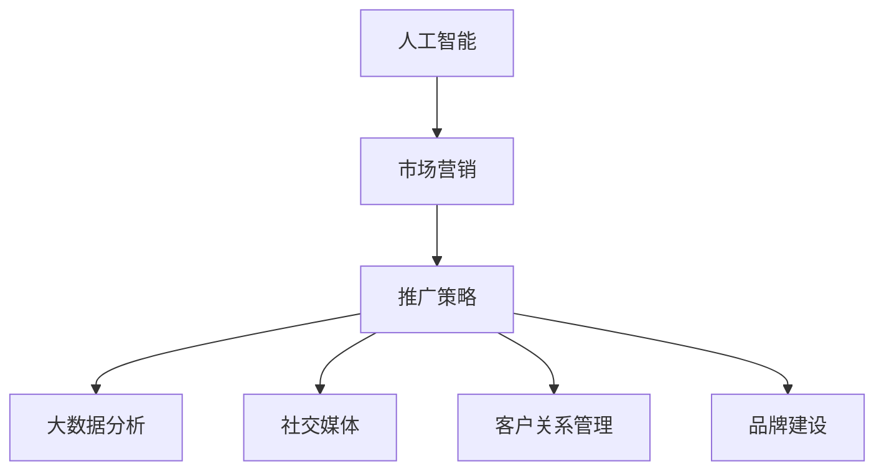

                 

# 人工智能创业：市场营销与推广

> 关键词：人工智能, 市场营销, 推广策略, 大数据分析, 社交媒体, 客户关系管理, 品牌建设, 创新创业

## 1. 背景介绍

### 1.1 问题由来

随着人工智能(AI)技术的不断发展和普及，越来越多的创业者将目光投向了这一领域。AI技术的应用范围极广，包括但不限于自然语言处理(NLP)、计算机视觉(CV)、机器学习(ML)等。然而，如何有效推广AI创业项目，将技术优势转化为商业成功，成为了创业者的共同难题。

AI创业项目与传统创业项目不同，其核心竞争力主要在于技术创新和应用落地。因此，如何有效地利用市场营销手段，将技术优势和应用价值传达给目标客户群体，是AI创业成功的关键。本文将重点探讨AI创业项目在市场营销和推广方面的策略和方法。

### 1.2 问题核心关键点

AI创业项目在市场营销与推广过程中，面临以下核心问题：

1. **技术复杂度**：AI技术复杂，不易被大众理解。如何通过简洁、易懂的语言和案例，向非技术用户展示技术优势。
2. **客户需求匹配**：AI项目多为定制化解决方案，如何精准定位目标客户，并提供符合其需求的解决方案。
3. **竞争格局分析**：AI市场竞争激烈，如何在众多同类产品中脱颖而出，建立品牌差异化。
4. **客户信任建立**：如何通过透明的合作流程和案例验证，增强客户对AI项目的信任感。
5. **市场推广效果评估**：如何制定科学的评估标准，衡量市场推广的ROI(投资回报率)。

## 2. 核心概念与联系

### 2.1 核心概念概述

为更好地理解AI创业项目在市场营销与推广方面的策略，本节将介绍几个密切相关的核心概念：

1. **人工智能(AI)**：以机器学习、深度学习等为核心的智能技术，通过训练模型，使计算机具备类似人类的认知能力。
2. **市场营销**：指通过制定和实施策略，将产品或服务推向目标客户的过程。
3. **推广策略**：指通过多种方式，如广告、公关、社交媒体等，提升品牌知名度和产品销量的策略。
4. **大数据分析**：指利用先进的技术手段，从海量数据中提取有用信息，指导决策和优化产品。
5. **社交媒体**：指通过各种在线社交平台，如微信、微博、LinkedIn等，与客户进行互动，提升品牌曝光度。
6. **客户关系管理(CRM)**：指通过管理客户数据，优化客户体验，提升客户忠诚度和回购率。
7. **品牌建设**：指通过一系列营销活动，建立和巩固品牌的知名度、美誉度和影响力。

这些核心概念之间的逻辑关系可以通过以下Mermaid流程图来展示：



这个流程图展示了大语言模型的核心概念及其之间的关系：

1. 人工智能是市场营销与推广的基础，提供了技术支持和应用场景。
2. 市场营销是推广策略的制定者和执行者，将产品推向目标客户。
3. 推广策略涵盖多种营销手段，包括大数据分析、社交媒体等。
4. 大数据分析用于指导推广策略的制定和效果评估。
5. 社交媒体是推广策略的主要执行渠道，提升品牌曝光度。
6. 客户关系管理用于提升客户体验和忠诚度。
7. 品牌建设通过一系列营销活动，提升品牌的知名度和美誉度。

## 3. 核心算法原理 & 具体操作步骤
### 3.1 算法原理概述

AI创业项目在市场营销与推广方面，通常采用以下算法和操作步骤：

**Step 1: 目标客户分析**

- 利用大数据分析工具，如Google Analytics、Tableau等，收集和分析目标客户的特征、需求和行为。
- 通过A/B测试等方法，验证不同策略对客户转化率的影响。

**Step 2: 市场定位与品牌建设**

- 制定市场定位策略，明确目标客户群体的核心需求和痛点。
- 通过品牌建设活动，如内容营销、公关活动、社交媒体互动等，提升品牌知名度和美誉度。

**Step 3: 推广策略制定与执行**

- 选择合适的推广渠道，如社交媒体、搜索引擎优化(SEO)、内容营销等。
- 设计推广内容和广告，如案例分析、白皮书、视频等，吸引目标客户。
- 实施推广策略，并根据数据反馈不断优化。

**Step 4: 客户关系管理与反馈**

- 利用CRM系统，记录客户互动和反馈，优化客户体验。
- 定期评估客户满意度，根据反馈调整产品和服务。

**Step 5: 效果评估与优化**

- 通过KPI(关键绩效指标)和ROI评估推广效果，如点击率、转化率、投资回报率等。
- 根据评估结果，优化推广策略和内容。

### 3.2 算法步骤详解

以下将详细讲解AI创业项目在市场营销与推广方面的关键算法和操作步骤：

**Step 1: 目标客户分析**

1. **数据收集**：利用Google Analytics、社交媒体分析工具等，收集目标客户的浏览行为、兴趣标签、互动频率等数据。
2. **数据清洗与预处理**：去除噪音数据和异常值，进行归一化处理，确保数据质量。
3. **特征工程**：提取有意义的特征，如年龄、性别、地域、购买历史等，进行维度分析和组合。
4. **聚类分析**：利用K-means等聚类算法，将客户划分为不同的群体，识别不同群体的特征和需求。
5. **情感分析**：通过NLP技术，对客户评论、反馈等文本数据进行情感分析，了解客户的情感倾向和满意度。

**Step 2: 市场定位与品牌建设**

1. **竞争格局分析**：利用SWOT分析、市场调研等方法，了解市场竞争环境和自身优劣势。
2. **品牌建设策略**：制定品牌定位、品牌口号、品牌形象等，通过内容营销、社交媒体互动等方式，提升品牌曝光度。
3. **案例验证与客户推荐**：通过实际案例展示产品效果，利用社交媒体和口碑营销，吸引潜在客户。

**Step 3: 推广策略制定与执行**

1. **渠道选择**：根据目标客户的特征，选择合适的推广渠道，如社交媒体、搜索引擎、邮件营销等。
2. **内容设计**：设计简洁、易懂的推广内容和广告，如视频演示、案例分析、白皮书等，突出技术优势和应用价值。
3. **推广实施**：通过广告投放、内容发布、社交媒体互动等方式，实施推广策略。
4. **数据监测与分析**：利用Google Analytics、社交媒体分析工具等，监测推广效果，及时调整策略。

**Step 4: 客户关系管理与反馈**

1. **客户互动**：利用CRM系统，记录客户互动和反馈，进行客户分类和维护。
2. **客户服务**：提供高质量的客户服务，及时解决客户问题，提升客户满意度。
3. **客户体验优化**：根据客户反馈，优化产品和服务，提升用户体验。

**Step 5: 效果评估与优化**

1. **KPI和ROI评估**：根据点击率、转化率、投资回报率等关键绩效指标，评估推广效果。
2. **优化推广策略**：根据评估结果，优化推广内容、渠道和策略，提升推广效果。
3. **持续迭代与改进**：通过不断迭代和改进，逐步提升市场营销与推广效果。

### 3.3 算法优缺点

AI创业项目在市场营销与推广方面，存在以下优缺点：

**优点：**

1. **数据驱动**：通过大数据分析，精准定位目标客户，提升推广效果。
2. **技术优势**：利用AI技术，实现个性化推荐、智能客服等功能，提升客户体验。
3. **多渠道推广**：选择合适的推广渠道，覆盖更广泛的客户群体。
4. **效果评估**：通过KPI和ROI等指标，科学评估推广效果，指导优化策略。

**缺点：**

1. **技术复杂度**：AI技术复杂，难以理解，影响推广效果的传达。
2. **成本较高**：数据收集、分析、推广等环节成本较高，需要较大的资源投入。
3. **客户信任**：AI技术透明性不足，客户对其信任感有待增强。
4. **市场风险**：AI市场竞争激烈，如何在众多同类产品中脱颖而出，建立品牌差异化，仍需探索。

### 3.4 算法应用领域

AI创业项目在市场营销与推广方面的算法和操作步骤，已经广泛应用于多个领域，例如：

1. **医疗AI**：利用AI技术进行疾病预测、智能诊断等，通过市场营销推广，提升产品的知名度和美誉度。
2. **金融AI**：开发智能投顾、风险评估等AI产品，通过精准营销，吸引更多的金融客户。
3. **教育AI**：提供智能学习平台和个性化教育方案，通过多渠道推广，提升品牌影响力和市场份额。
4. **企业AI**：开发智能客服、运营优化等AI产品，通过客户关系管理，提升客户满意度和忠诚度。
5. **零售AI**：利用AI技术进行智能推荐、库存管理等，通过多渠道推广，提升销售额和客户体验。

除了上述这些领域外，AI创业项目在市场营销与推广方面的算法和操作步骤，还将在更多领域得到应用，为各行各业带来变革性的影响。

## 4. 数学模型和公式 & 详细讲解 & 举例说明
### 4.1 数学模型构建

以下将使用数学语言对AI创业项目在市场营销与推广方面的算法和操作步骤进行更加严格的刻画。

设目标客户数为 $N$，每个客户的特征向量为 $\mathbf{x}_i \in \mathbb{R}^d$，其中 $i \in \{1, 2, \ldots, N\}$。市场推广的总体效果 $E$ 由以下模型表示：

$$
E = \sum_{i=1}^N f(\mathbf{x}_i)
$$

其中 $f(\mathbf{x}_i)$ 为市场推广效果函数，表示在客户 $\mathbf{x}_i$ 上的推广效果。推广效果函数 $f(\mathbf{x}_i)$ 可以表示为：

$$
f(\mathbf{x}_i) = \alpha + \mathbf{w}^T\mathbf{x}_i + \epsilon_i
$$

其中 $\alpha$ 为截距项，$\mathbf{w} \in \mathbb{R}^d$ 为推广效果系数，$\epsilon_i$ 为随机误差项。推广效果系数 $\mathbf{w}$ 可以通过最大似然估计等方法进行求解。

### 4.2 公式推导过程

以下将详细推导推广效果函数的参数估计方法：

1. **数据准备**：准备目标客户的特征数据 $\{\mathbf{x}_i\}_{i=1}^N$，并计算每个客户的推广效果 $y_i = f(\mathbf{x}_i)$。
2. **模型建立**：建立推广效果模型的线性回归模型，如 $\mathbf{y} = \mathbf{X}\mathbf{w} + \boldsymbol{\epsilon}$，其中 $\mathbf{y} \in \mathbb{R}^N$ 为推广效果向量，$\mathbf{X} \in \mathbb{R}^{N \times d}$ 为特征矩阵，$\boldsymbol{\epsilon} \in \mathbb{R}^N$ 为误差向量。
3. **参数估计**：通过最小二乘法或最大似然估计等方法，求解推广效果系数 $\mathbf{w}$ 和截距项 $\alpha$。
4. **效果评估**：利用推广效果向量 $\mathbf{y}$ 和模型预测值 $\hat{\mathbf{y}} = \mathbf{X}\hat{\mathbf{w}}$ 进行误差评估，如计算均方误差 $MSE$ 或平均绝对误差 $MAE$。
5. **模型优化**：根据误差评估结果，优化推广效果系数 $\mathbf{w}$ 和截距项 $\alpha$，提高推广效果模型的拟合精度。

### 4.3 案例分析与讲解

假设某AI医疗项目，需要推广其智能诊断系统。该项目的目标客户为医院和医疗机构，特征包括地理位置、医院等级、年就诊量等。该项目通过市场调研，确定了以下推广效果函数：

$$
f(\mathbf{x}_i) = 100 + 10x_{\text{location}} + 5x_{\text{grade}} + 3x_{\text{visits}}
$$

其中 $x_{\text{location}}$、$x_{\text{grade}}$ 和 $x_{\text{visits}}$ 分别为地理位置、医院等级和年就诊量。通过最大似然估计方法，求解 $\alpha = 100$、$\mathbf{w} = [10, 5, 3]^T$。

为了验证推广效果函数的有效性，该项目在目标客户中随机抽取了100个样本，并记录了每个医院的推广效果。根据推广效果向量 $\mathbf{y}$ 和模型预测值 $\hat{\mathbf{y}}$，计算均方误差 $MSE$ 为：

$$
MSE = \frac{1}{N} \sum_{i=1}^N (y_i - \hat{y}_i)^2
$$

通过不断优化推广效果函数，该项目在目标客户中实现了较高的推广效果，提升了智能诊断系统的知名度和市场份额。

## 5. 项目实践：代码实例和详细解释说明
### 5.1 开发环境搭建

在进行市场推广策略的开发和实践前，我们需要准备好开发环境。以下是使用Python进行市场推广策略开发的常见环境配置流程：

1. 安装Python：从官网下载并安装最新版本的Python，配置环境变量。
2. 安装Pandas、NumPy、Scikit-learn等常用的数据处理和分析工具。
3. 安装TensorFlow或PyTorch等深度学习框架，用于构建和训练推广效果模型。
4. 安装Flask、Django等Web框架，用于搭建市场推广网站或API。
5. 安装Jupyter Notebook或PyCharm等IDE，用于开发和调试市场推广策略。

完成上述步骤后，即可在Python环境中进行市场推广策略的开发和实践。

### 5.2 源代码详细实现

以下将给出使用Python和Scikit-learn库进行市场推广策略开发的代码实现，并详细解释每个步骤。

```python
import pandas as pd
import numpy as np
from sklearn.linear_model import LinearRegression
from sklearn.metrics import mean_squared_error, mean_absolute_error

# 准备数据
data = pd.read_csv('customer_data.csv')
X = data[['location', 'grade', 'visits']]
y = data['sales']

# 分割数据集
from sklearn.model_selection import train_test_split
X_train, X_test, y_train, y_test = train_test_split(X, y, test_size=0.2, random_state=42)

# 训练模型
model = LinearRegression()
model.fit(X_train, y_train)

# 预测和评估
y_pred = model.predict(X_test)
mse = mean_squared_error(y_test, y_pred)
mae = mean_absolute_error(y_test, y_pred)
print('MSE:', mse)
print('MAE:', mae)
```

以上代码实现了基于线性回归的市场推广效果模型的构建、训练、预测和评估。

### 5.3 代码解读与分析

让我们再详细解读一下关键代码的实现细节：

1. **数据准备**：使用Pandas库读取客户数据，提取需要的特征和目标变量。
2. **数据分割**：使用Scikit-learn库将数据集划分为训练集和测试集，用于模型训练和评估。
3. **模型训练**：使用LinearRegression模型对训练集进行拟合，求解推广效果系数和截距项。
4. **模型预测和评估**：使用测试集进行模型预测，计算均方误差和平均绝对误差，评估推广效果。

通过上述代码，我们实现了市场推广效果模型的基本构建和评估。在实际应用中，还需要根据具体问题和数据特点，进行更复杂的模型构建和优化。

## 6. 实际应用场景
### 6.1 智能客服系统

智能客服系统是AI创业项目在市场营销与推广方面的典型应用场景。通过智能客服系统，客户可以享受到24小时不间断的服务，获得快速、准确、个性化的回答，提升客户体验和满意度。

智能客服系统可以通过多种渠道推广，如官网、社交媒体、搜索引擎等。通过客户数据收集和分析，确定目标客户群体，设计有针对性的推广内容，提升推广效果。利用客户互动数据，优化智能客服系统的服务质量，进一步提升客户满意度和忠诚度。

### 6.2 金融AI产品

金融AI产品在市场营销与推广方面也具有广阔的应用前景。例如，智能投顾、风险评估等产品可以通过多渠道推广，吸引更多的金融客户。通过大数据分析，精准定位目标客户，设计个性化的产品推广内容，提升推广效果。

金融AI产品需要建立客户信任，通过透明的合作流程和案例验证，展示产品的可靠性和优势。利用CRM系统，记录客户互动和反馈，优化客户体验，提升客户满意度。通过KPI和ROI等指标，评估推广效果，不断优化推广策略。

### 6.3 智能学习平台

智能学习平台作为AI创业项目的重要应用，通过个性化教育方案和智能推荐，提升学习效果和用户体验。通过多渠道推广，吸引更多的学生和家长。

智能学习平台可以利用大数据分析，精准定位目标客户，设计个性化的推广内容。通过客户互动数据，优化智能学习平台的功能和服务，提升客户满意度。利用KPI和ROI等指标，评估推广效果，优化推广策略。

### 6.4 未来应用展望

随着AI技术的不断发展和市场需求的日益多样化，AI创业项目在市场营销与推广方面的应用前景将更加广阔。未来，AI创业项目将利用更多前沿技术和工具，提升推广效果，拓展市场空间。

1. **AI技术创新**：利用AI技术不断提升产品的功能和性能，增强市场竞争力。
2. **多渠道推广**：利用多种渠道进行推广，覆盖更广泛的客户群体。
3. **个性化推荐**：通过大数据分析，设计个性化的推广内容，提升客户体验。
4. **品牌建设**：通过品牌建设活动，提升品牌知名度和美誉度，增强客户信任感。
5. **客户关系管理**：利用CRM系统，记录客户互动和反馈，优化客户体验。

## 7. 工具和资源推荐
### 7.1 学习资源推荐

为了帮助开发者系统掌握AI创业项目在市场营销与推广方面的理论基础和实践技巧，这里推荐一些优质的学习资源：

1. 《市场营销学》系列书籍：如菲利普·科特勒的《市场营销原理》，系统介绍市场营销的基本概念和策略。
2. 《数据科学与人工智能市场营销》课程：如Coursera上的《Data Mining and Statistical Learning》课程，利用数据科学和机器学习技术进行市场营销。
3. 《人工智能市场推广策略》书籍：介绍AI创业项目在市场营销与推广方面的具体策略和案例。
4. 《谷歌AI市场推广案例》：谷歌AI市场推广的实战案例和经验分享，提供丰富的实践经验。
5. 《市场推广实战指南》书籍：提供市场推广的全面指南，包括各种营销策略和工具。

通过学习这些资源，相信你一定能够快速掌握AI创业项目在市场营销与推广方面的精髓，并用于解决实际的营销问题。

### 7.2 开发工具推荐

高效的开发离不开优秀的工具支持。以下是几款用于AI创业项目市场营销与推广开发的常用工具：

1. Google Analytics：用于收集和分析网站访问数据，了解客户行为和转化率。
2. SEMrush：用于搜索引擎优化(SEO)和关键词分析，提升搜索引擎排名。
3. Hootsuite：用于社交媒体管理和分析，提升社交媒体互动效果。
4. HubSpot：用于客户关系管理(CRM)和营销自动化，优化客户体验。
5. Tableau：用于大数据分析和可视化，提供数据驱动的市场推广决策支持。

合理利用这些工具，可以显著提升AI创业项目市场营销与推广的效率，快速实现市场目标。

### 7.3 相关论文推荐

AI创业项目在市场营销与推广方面的研究源于学界的持续探索。以下是几篇奠基性的相关论文，推荐阅读：

1. 《人工智能市场推广策略》：介绍AI创业项目在市场营销与推广方面的策略和方法。
2. 《基于大数据的市场推广效果模型》：利用大数据分析，设计推广效果模型，评估市场推广效果。
3. 《社交媒体对市场推广效果的影响》：分析社交媒体在市场推广中的作用和影响，提供相关策略建议。
4. 《客户关系管理对市场推广效果的影响》：利用CRM系统，优化客户体验，提升市场推广效果。
5. 《AI技术在市场推广中的应用》：介绍AI技术在市场推广中的应用场景和优势。

这些论文代表了大语言模型市场推广技术的发展脉络。通过学习这些前沿成果，可以帮助研究者把握学科前进方向，激发更多的创新灵感。

## 8. 总结：未来发展趋势与挑战
### 8.1 总结

本文对AI创业项目在市场营销与推广方面的策略和方法进行了全面系统的介绍。首先阐述了AI创业项目在市场营销与推广中面临的核心问题和关键点，明确了市场推广的战略目标和执行步骤。其次，从理论到实践，详细讲解了市场推广中的数据驱动、技术优势、多渠道推广、客户关系管理等核心算法和操作步骤，提供了具体的代码实现和实例分析。最后，本文还探讨了市场推广的未来趋势和面临的挑战，提供了科学的市场推广方法和实践建议。

通过本文的系统梳理，可以看到，AI创业项目在市场营销与推广方面具有广阔的应用前景和实际价值。AI技术的应用，使得市场推广更加高效、精准、个性化，为创业项目带来了前所未有的竞争优势。未来，AI市场推广技术将不断创新，为各行各业带来变革性的影响。

### 8.2 未来发展趋势

展望未来，AI创业项目在市场营销与推广方面将呈现以下几个发展趋势：

1. **技术创新**：利用AI技术不断提升市场推广的智能化水平，实现自动化、个性化、精准化的市场推广。
2. **数据驱动**：利用大数据分析，精准定位目标客户，优化推广策略和内容。
3. **多渠道推广**：利用多种渠道进行推广，覆盖更广泛的客户群体。
4. **品牌建设**：通过品牌建设活动，提升品牌知名度和美誉度。
5. **客户关系管理**：利用CRM系统，优化客户体验，提升客户满意度。

这些趋势将推动AI创业项目在市场营销与推广方面实现质的飞跃，为创业项目的成功打下坚实的基础。

### 8.3 面临的挑战

尽管AI创业项目在市场营销与推广方面已经取得了一定的成效，但在迈向更加智能化、普适化应用的过程中，仍面临诸多挑战：

1. **技术复杂度**：AI技术复杂，难以理解，影响推广效果的传达。
2. **数据质量**：数据质量不高，噪音数据和异常值较多，影响推广效果。
3. **成本较高**：数据收集、分析、推广等环节成本较高，需要较大的资源投入。
4. **客户信任**：AI技术透明性不足，客户对其信任感有待增强。
5. **市场风险**：AI市场竞争激烈，如何在众多同类产品中脱颖而出，建立品牌差异化，仍需探索。

### 8.4 研究展望

面对AI创业项目在市场营销与推广方面面临的挑战，未来的研究需要在以下几个方面寻求新的突破：

1. **AI技术简化**：利用更简洁、易懂的语言和案例，向非技术用户展示技术优势。
2. **数据清洗与预处理**：通过有效的数据清洗和预处理，提高数据质量，减少噪音数据和异常值的影响。
3. **成本优化**：通过自动化、半自动化的工具和方法，降低数据收集、分析、推广等环节的成本。
4. **客户信任增强**：通过透明的合作流程和案例验证，增强客户对AI项目的信任感。
5. **品牌差异化**：通过创新性的营销活动和推广策略，建立独特的品牌差异化，增强市场竞争力。

这些研究方向的探索，必将引领AI创业项目在市场营销与推广方面迈向更高的台阶，为创业项目的成功提供坚实的保障。

## 9. 附录：常见问题与解答

**Q1：如何进行目标客户的精准定位？**

A: 利用大数据分析工具，如Google Analytics、Tableau等，收集和分析目标客户的特征、需求和行为。通过A/B测试等方法，验证不同策略对客户转化率的影响，精准定位目标客户。

**Q2：如何提升推广效果？**

A: 通过设计简洁、易懂的推广内容和广告，突出技术优势和应用价值。利用多种渠道进行推广，如社交媒体、搜索引擎、内容营销等。利用大数据分析，优化推广策略和内容，提高推广效果。

**Q3：如何增强客户信任？**

A: 通过透明的合作流程和案例验证，展示产品的可靠性和优势。利用CRM系统，记录客户互动和反馈，优化客户体验，提升客户满意度。

**Q4：如何评估推广效果？**

A: 通过KPI和ROI等指标，如点击率、转化率、投资回报率等，评估推广效果。根据评估结果，优化推广策略和内容。

**Q5：如何在市场推广中保持持续创新？**

A: 通过持续的AI技术创新和市场调研，及时调整和优化推广策略和内容，保持市场竞争优势。利用大数据分析，精准定位目标客户，设计个性化的推广内容。

这些问题的解答，将帮助AI创业项目在市场营销与推广方面实现更高的效率和效果，加速项目的落地和成功。

---

作者：禅与计算机程序设计艺术 / Zen and the Art of Computer Programming

