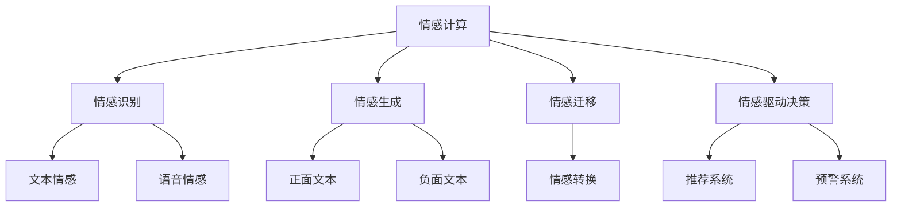

                 

# 人工智能在情感计算中的应用

## 1. 背景介绍

### 1.1 问题由来
情感计算（Affective Computing）是人工智能和心理学交叉的新兴领域，旨在通过分析和理解人类情感，改善人机交互质量，推动机器智能化发展。随着大数据技术、深度学习模型的进步，情感计算技术已经在心理健康、客户服务、市场分析、公共安全等领域显示出巨大潜力。

情感计算的核心是构建机器对人类情感的识别与理解能力。传统的情感识别方法依赖于文本特征提取和机器学习算法，但随着预训练语言模型的出现，情感计算技术迈入了全新的阶段。利用大模型，机器能够在更复杂的语境中，更准确地理解人类情感。

### 1.2 问题核心关键点
情感计算的主要挑战在于如何将自然语言中的主观情感信息准确地转化为机器可处理的数据。传统方法如情感词典、规则提取等，仅能捕捉到表面的情感倾向，难以应对复杂的情感变化。预训练大模型如BERT、GPT等，通过在海量文本数据上进行自监督预训练，学习到了更丰富的语言语义知识，能更精准地捕捉和理解情感信息。

因此，本文聚焦于如何在大模型基础上进行情感计算，探讨情感计算的基本原理和应用实践。

## 2. 核心概念与联系

### 2.1 核心概念概述

为更好地理解基于大模型的情感计算方法，本节将介绍几个密切相关的核心概念：

- 情感计算（Affective Computing）：通过理解和生成情感信息，改善人机交互体验，提升机器对人类情感的理解和反应能力。
- 情感识别（Sentiment Analysis）：识别文本、语音等输入中的情感倾向，如正面、负面、中性等。
- 情感生成（Sentiment Generation）：生成带有特定情感倾向的文本、语音等输出。
- 情感迁移（Sentiment Transfer）：将情感信息从文本源转移到文本目标，实现情感转换。
- 情感驱动决策（Sentiment-based Decision Making）：基于情感信息，驱动机器进行决策，如推荐、预警等。

这些核心概念之间的逻辑关系可以通过以下Mermaid流程图来展示：



这个流程图展示出情感计算的核心概念及其之间的关系：

1. 情感计算通过理解和生成情感信息，改善人机交互。
2. 情感识别、情感生成、情感迁移、情感驱动决策是情感计算的核心技术手段。
3. 情感识别可应用于文本情感、语音情感识别。
4. 情感生成可用于生成正面、负面文本。
5. 情感迁移可实现情感信息在文本间的转换。
6. 情感驱动决策可用于推荐系统、预警系统等应用场景。

这些概念共同构成了情感计算的基础理论和技术框架，使其能够在各种应用场景中发挥重要作用。

## 3. 核心算法原理 & 具体操作步骤
### 3.1 算法原理概述

情感计算的核心算法是基于大模型的自然语言处理（NLP）技术。其核心思想是：将情感信息视为一种特殊的自然语言语义，利用大模型强大的语义理解能力，对文本进行情感倾向识别、情感生成、情感迁移等操作。

具体而言，情感计算的主要步骤包括：

1. 文本预处理：对原始文本进行清洗、分词、去除停用词等处理。
2. 情感识别：利用大模型提取文本中的情感倾向信息，如正面、负面、中性等。
3. 情感生成：根据情感识别结果，生成带有特定情感倾向的文本。
4. 情感迁移：将情感信息从文本源转移到文本目标，实现情感转换。
5. 情感驱动决策：基于情感信息，驱动机器进行决策，如推荐、预警等。

### 3.2 算法步骤详解

情感计算的算法步骤可以分为三个关键阶段：情感识别、情感生成和情感驱动决策。以下将详细介绍每个阶段的具体操作步骤：

#### 3.2.1 情感识别

情感识别是情感计算的基础步骤，旨在从文本中识别情感倾向。这一过程通常包括以下步骤：

1. 数据准备：收集标注好的情感文本数据集，用于训练情感识别模型。
2. 模型选择：选择合适的情感识别模型，如基于BERT、GPT等预训练大模型。
3. 特征提取：利用大模型提取文本的语义特征，作为情感识别的输入。
4. 训练模型：在标注数据集上训练情感识别模型，优化模型参数，使其能够准确识别情感信息。
5. 模型评估：在验证集上评估模型性能，选择合适的情感识别阈值，确定最终模型。

#### 3.2.2 情感生成

情感生成是指根据情感识别结果，生成带有特定情感倾向的文本。这一过程通常包括以下步骤：

1. 数据准备：收集标注好的情感文本数据集，用于训练情感生成模型。
2. 模型选择：选择合适的情感生成模型，如基于BERT、GPT等预训练大模型。
3. 特征提取：利用大模型提取文本的语义特征，作为情感生成的输入。
4. 训练模型：在标注数据集上训练情感生成模型，优化模型参数，使其能够生成特定情感的文本。
5. 模型评估：在验证集上评估模型性能，选择最优的情感生成策略。

#### 3.2.3 情感驱动决策

情感驱动决策是指基于情感信息，驱动机器进行决策，如推荐、预警等。这一过程通常包括以下步骤：

1. 数据准备：收集情感驱动决策任务的相关数据，如用户行为、市场数据等。
2. 模型选择：选择合适的情感驱动决策模型，如基于BERT、GPT等预训练大模型。
3. 特征提取：利用大模型提取情感驱动决策任务的特征，作为决策的输入。
4. 训练模型：在标注数据集上训练情感驱动决策模型，优化模型参数，使其能够基于情感信息进行决策。
5. 模型评估：在测试集上评估模型性能，选择合适的情感驱动决策策略。

### 3.3 算法优缺点

情感计算基于大模型的情感识别、生成、迁移、驱动决策等技术，具有以下优点：

1. 高效准确：大模型具有强大的语义理解能力，能够高效、准确地识别和生成情感信息。
2. 广泛适用：情感计算技术可以应用于多种场景，如市场分析、客户服务、心理健康等，具有广泛的应用前景。
3. 可解释性：基于大模型的情感计算过程具有较高的可解释性，可以通过解释模型参数和训练过程，理解情感识别的逻辑。

但同时，情感计算也存在以下缺点：

1. 依赖标注数据：情感计算依赖大量标注数据进行训练，数据标注成本高，难以获得高质量标注数据。
2. 数据偏差：情感数据存在较多主观性和歧义性，标注数据容易受到偏见和主观偏差的影响。
3. 通用性不足：不同领域的情感计算模型需要重新训练，难以通用的应用于多种领域。
4. 计算资源消耗大：大模型的情感计算过程需要大量计算资源，难以在资源受限的设备上运行。

尽管存在这些局限性，但情感计算技术仍是大规模应用、广泛场景需求的重要手段。未来相关研究的重点在于如何进一步降低数据依赖，提升模型的通用性和鲁棒性，同时兼顾可解释性和计算效率。

### 3.4 算法应用领域

情感计算技术已经在多个领域得到了广泛应用，以下是几个典型的应用场景：

1. 客户服务：情感计算可以帮助企业监测客户情感，及时响应客户需求，提升客户满意度。
2. 心理健康：情感计算可用于心理健康评估和诊疗，帮助医生理解患者的情感状态，制定治疗方案。
3. 市场分析：情感计算可以帮助企业分析市场情绪，预测市场趋势，制定营销策略。
4. 公共安全：情感计算可用于犯罪预警、舆情监控等，提升公共安全管理水平。
5. 个性化推荐：情感计算可用于推荐系统，根据用户情感需求推荐相关商品或服务，提升用户体验。

## 4. 数学模型和公式 & 详细讲解 & 举例说明

### 4.1 数学模型构建

本节将使用数学语言对情感计算的基本模型进行严格的刻画。

设情感计算任务为$T$，文本输入为$x$，输出为$y$。情感计算模型$M_{\theta}$由预训练语言模型$B_{\theta}$构成，其输入为文本$x$，输出为情感标签$y$。假设情感分类任务为二分类任务，则情感计算模型的损失函数为：

$$
\mathcal{L}(\theta) = -\frac{1}{N}\sum_{i=1}^N [y_i \log P_{M_{\theta}}(y_i|x_i) + (1-y_i) \log (1-P_{M_{\theta}}(y_i|x_i))]
$$

其中$P_{M_{\theta}}(y_i|x_i)$表示模型在输入$x_i$下的情感分类概率，$N$表示训练样本数量。

情感计算模型的优化目标是最小化损失函数$\mathcal{L}(\theta)$，即：

$$
\theta^* = \mathop{\arg\min}_{\theta} \mathcal{L}(\theta)
$$

在实践中，我们通常使用基于梯度的优化算法（如SGD、Adam等）来近似求解上述最优化问题。设$\eta$为学习率，$\lambda$为正则化系数，则参数的更新公式为：

$$
\theta \leftarrow \theta - \eta \nabla_{\theta}\mathcal{L}(\theta) - \eta\lambda\theta
$$

其中$\nabla_{\theta}\mathcal{L}(\theta)$为损失函数对参数$\theta$的梯度，可通过反向传播算法高效计算。

### 4.2 公式推导过程

以情感识别为例，推导基于大模型的情感分类损失函数及其梯度的计算公式。

假设模型$M_{\theta}$在输入$x$上的输出为$\hat{y}=M_{\theta}(x)$，表示样本属于情感标签$y$的概率。则情感分类交叉熵损失函数定义为：

$$
\ell(M_{\theta}(x),y) = -[y\log \hat{y} + (1-y)\log (1-\hat{y})]
$$

将其代入经验风险公式，得：

$$
\mathcal{L}(\theta) = -\frac{1}{N}\sum_{i=1}^N [y_i\log M_{\theta}(x_i)+(1-y_i)\log(1-M_{\theta}(x_i))]
$$

根据链式法则，损失函数对参数$\theta_k$的梯度为：

$$
\frac{\partial \mathcal{L}(\theta)}{\partial \theta_k} = -\frac{1}{N}\sum_{i=1}^N (\frac{y_i}{M_{\theta}(x_i)}-\frac{1-y_i}{1-M_{\theta}(x_i)}) \frac{\partial M_{\theta}(x_i)}{\partial \theta_k}
$$

其中$\frac{\partial M_{\theta}(x_i)}{\partial \theta_k}$可进一步递归展开，利用自动微分技术完成计算。

在得到损失函数的梯度后，即可带入参数更新公式，完成模型的迭代优化。重复上述过程直至收敛，最终得到适应情感识别任务的最优模型参数$\theta^*$。

### 4.3 案例分析与讲解

以情感识别模型在客户服务中的应用为例，详细解释其工作原理和关键步骤。

**Step 1: 数据准备**
- 收集客户服务热线、社交媒体、客户评价等数据，标注客户情感为正面、负面、中性。
- 对数据进行清洗、分词、去除停用词等预处理操作。

**Step 2: 模型选择**
- 选择BERT、GPT等预训练语言模型作为情感识别模型的基础。
- 将模型迁移到情感识别任务上，对特定层进行微调。

**Step 3: 特征提取**
- 利用模型提取输入文本的语义特征，作为情感识别的输入。
- 将特征向量作为模型输入，进行情感分类。

**Step 4: 模型训练**
- 使用标注数据训练情感识别模型，优化模型参数。
- 设置合适的学习率和正则化参数，防止过拟合。

**Step 5: 模型评估**
- 在验证集上评估模型性能，选择合适的情感识别阈值。
- 根据阈值调整模型输出，进行情感分类。

**Step 6: 应用部署**
- 将训练好的情感识别模型部署到生产环境，实时监测客户情感。
- 根据情感分类结果，制定响应策略，提升客户服务质量。

在客户服务应用中，情感计算模型能够实时监测客户的情感状态，及时响应客户需求，提升客户满意度和忠诚度。同时，情感计算模型还能帮助企业分析客户情感变化趋势，优化客户服务策略，实现智能客服的全面升级。

## 5. 项目实践：代码实例和详细解释说明
### 5.1 开发环境搭建

在进行情感计算实践前，我们需要准备好开发环境。以下是使用Python进行PyTorch开发的环境配置流程：

1. 安装Anaconda：从官网下载并安装Anaconda，用于创建独立的Python环境。

2. 创建并激活虚拟环境：
```bash
conda create -n pytorch-env python=3.8 
conda activate pytorch-env
```

3. 安装PyTorch：根据CUDA版本，从官网获取对应的安装命令。例如：
```bash
conda install pytorch torchvision torchaudio cudatoolkit=11.1 -c pytorch -c conda-forge
```

4. 安装Transformers库：
```bash
pip install transformers
```

5. 安装各类工具包：
```bash
pip install numpy pandas scikit-learn matplotlib tqdm jupyter notebook ipython
```

完成上述步骤后，即可在`pytorch-env`环境中开始情感计算实践。

### 5.2 源代码详细实现

下面我们以情感分类任务为例，给出使用Transformers库对BERT模型进行情感分类的PyTorch代码实现。

首先，定义情感分类任务的数据处理函数：

```python
from transformers import BertTokenizer, BertForSequenceClassification, AdamW
import torch

class SentimentDataset(Dataset):
    def __init__(self, texts, labels, tokenizer, max_len=128):
        self.texts = texts
        self.labels = labels
        self.tokenizer = tokenizer
        self.max_len = max_len
        
    def __len__(self):
        return len(self.texts)
    
    def __getitem__(self, item):
        text = self.texts[item]
        label = self.labels[item]
        
        encoding = self.tokenizer(text, return_tensors='pt', max_length=self.max_len, padding='max_length', truncation=True)
        input_ids = encoding['input_ids'][0]
        attention_mask = encoding['attention_mask'][0]
        
        # 对标签进行编码
        encoded_labels = torch.tensor(label, dtype=torch.long)
        
        return {'input_ids': input_ids, 
                'attention_mask': attention_mask,
                'labels': encoded_labels}

# 标签编码
label2id = {'positive': 1, 'negative': 0}
id2label = {v: k for k, v in label2id.items()}

# 创建dataset
tokenizer = BertTokenizer.from_pretrained('bert-base-cased')

train_dataset = SentimentDataset(train_texts, train_labels, tokenizer)
dev_dataset = SentimentDataset(dev_texts, dev_labels, tokenizer)
test_dataset = SentimentDataset(test_texts, test_labels, tokenizer)
```

然后，定义模型和优化器：

```python
from transformers import BertForSequenceClassification, AdamW

model = BertForSequenceClassification.from_pretrained('bert-base-cased', num_labels=2, output_attentions=False, output_hidden_states=False)

optimizer = AdamW(model.parameters(), lr=2e-5)
```

接着，定义训练和评估函数：

```python
from torch.utils.data import DataLoader
from tqdm import tqdm
from sklearn.metrics import classification_report

device = torch.device('cuda') if torch.cuda.is_available() else torch.device('cpu')
model.to(device)

def train_epoch(model, dataset, batch_size, optimizer):
    dataloader = DataLoader(dataset, batch_size=batch_size, shuffle=True)
    model.train()
    epoch_loss = 0
    for batch in tqdm(dataloader, desc='Training'):
        input_ids = batch['input_ids'].to(device)
        attention_mask = batch['attention_mask'].to(device)
        labels = batch['labels'].to(device)
        model.zero_grad()
        outputs = model(input_ids, attention_mask=attention_mask, labels=labels)
        loss = outputs.loss
        epoch_loss += loss.item()
        loss.backward()
        optimizer.step()
    return epoch_loss / len(dataloader)

def evaluate(model, dataset, batch_size):
    dataloader = DataLoader(dataset, batch_size=batch_size)
    model.eval()
    preds, labels = [], []
    with torch.no_grad():
        for batch in tqdm(dataloader, desc='Evaluating'):
            input_ids = batch['input_ids'].to(device)
            attention_mask = batch['attention_mask'].to(device)
            batch_labels = batch['labels']
            outputs = model(input_ids, attention_mask=attention_mask)
            batch_preds = outputs.logits.argmax(dim=2).to('cpu').tolist()
            batch_labels = batch_labels.to('cpu').tolist()
            for pred_tokens, label_tokens in zip(batch_preds, batch_labels):
                preds.append(pred_tokens)
                labels.append(label_tokens)
                
    print(classification_report(labels, preds))
```

最后，启动训练流程并在测试集上评估：

```python
epochs = 5
batch_size = 16

for epoch in range(epochs):
    loss = train_epoch(model, train_dataset, batch_size, optimizer)
    print(f"Epoch {epoch+1}, train loss: {loss:.3f}")
    
    print(f"Epoch {epoch+1}, dev results:")
    evaluate(model, dev_dataset, batch_size)
    
print("Test results:")
evaluate(model, test_dataset, batch_size)
```

以上就是使用PyTorch对BERT进行情感分类任务开发的完整代码实现。可以看到，得益于Transformers库的强大封装，我们可以用相对简洁的代码完成BERT模型的加载和情感分类任务的微调。

### 5.3 代码解读与分析

让我们再详细解读一下关键代码的实现细节：

**SentimentDataset类**：
- `__init__`方法：初始化文本、标签、分词器等关键组件。
- `__len__`方法：返回数据集的样本数量。
- `__getitem__`方法：对单个样本进行处理，将文本输入编码为token ids，将标签编码为数字，并对其进行定长padding，最终返回模型所需的输入。

**label2id和id2label字典**：
- 定义了标签与数字id之间的映射关系，用于将模型预测结果解码回真实的标签。

**训练和评估函数**：
- 使用PyTorch的DataLoader对数据集进行批次化加载，供模型训练和推理使用。
- 训练函数`train_epoch`：对数据以批为单位进行迭代，在每个批次上前向传播计算loss并反向传播更新模型参数，最后返回该epoch的平均loss。
- 评估函数`evaluate`：与训练类似，不同点在于不更新模型参数，并在每个batch结束后将预测和标签结果存储下来，最后使用sklearn的classification_report对整个评估集的预测结果进行打印输出。

**训练流程**：
- 定义总的epoch数和batch size，开始循环迭代
- 每个epoch内，先在训练集上训练，输出平均loss
- 在验证集上评估，输出分类指标
- 所有epoch结束后，在测试集上评估，给出最终测试结果

可以看到，PyTorch配合Transformers库使得BERT情感分类的代码实现变得简洁高效。开发者可以将更多精力放在数据处理、模型改进等高层逻辑上，而不必过多关注底层的实现细节。

当然，工业级的系统实现还需考虑更多因素，如模型的保存和部署、超参数的自动搜索、更灵活的任务适配层等。但核心的微调范式基本与此类似。

## 6. 实际应用场景
### 6.1 智能客服系统

情感计算技术在智能客服系统中的应用非常广泛。传统的客服系统往往依赖人工进行情感分析，效率低、成本高。情感计算技术能够通过实时监测客户情感，快速响应客户需求，提升客服效率和客户满意度。

在技术实现上，可以收集客户历史通话记录、社交媒体评论、客户评价等数据，利用情感计算模型实时监测客户情感。当客户情感为负面时，系统自动启动情绪安抚机制，并调用情感生成模型生成安抚语句，进行实时对话，缓解客户情绪。同时，系统还可以根据客户情感变化趋势，调整服务策略，提升客户体验。

### 6.2 市场营销

情感计算技术在市场营销领域也有广泛应用。企业可以通过情感计算技术，实时监测市场情绪，预测市场趋势，制定更加精准的营销策略。

在实践中，企业可以收集社交媒体、新闻、客户反馈等数据，利用情感计算模型识别市场情绪，判断市场动态。当市场情绪负面时，企业可以及时调整营销策略，避免损失。同时，情感计算技术还可以帮助企业分析用户偏好，制定个性化营销方案，提升市场竞争力。

### 6.3 情感驱动推荐

情感计算技术在个性化推荐系统中的应用非常普遍。传统推荐系统依赖用户行为数据进行推荐，难以深入理解用户情感需求。情感计算技术能够通过情感分类模型识别用户情感，制定更加个性化的推荐策略。

在实践中，企业可以收集用户浏览、点击、评论、分享等行为数据，提取和用户交互的物品标题、描述、标签等文本内容。利用情感分类模型识别用户情感，再结合其他特征进行推荐排序，便可以得到更加个性化、精准的推荐结果。

### 6.4 未来应用展望

随着情感计算技术的不断发展，未来的应用场景将更加广泛。

在智慧医疗领域，情感计算技术可以帮助医生理解患者情感状态，制定个性化诊疗方案。在智能教育领域，情感计算技术可以用于情感分析、学习推荐等，提升教学质量。在智慧城市治理中，情感计算技术可用于情感分析、舆情监控等，提升城市管理水平。

此外，在企业生产、社会治理、文娱传媒等众多领域，情感计算技术也将不断涌现，为人工智能落地应用提供新的技术路径。相信随着技术的日益成熟，情感计算技术必将在构建人机协同的智能时代中扮演越来越重要的角色。

## 7. 工具和资源推荐
### 7.1 学习资源推荐

为了帮助开发者系统掌握情感计算的理论基础和实践技巧，这里推荐一些优质的学习资源：

1. 《Affective Computing with Deep Learning》书籍：深入浅出地介绍了情感计算的基本概念和深度学习在情感分析中的应用。

2. 《Sentiment Analysis with PyTorch》博文：详细介绍了基于PyTorch的情感分析模型开发，包括情感识别和情感生成。

3. CS224N《深度学习自然语言处理》课程：斯坦福大学开设的NLP明星课程，涵盖情感分析、情感迁移等关键技术。

4. HuggingFace官方文档：Transformer库的官方文档，提供了大量情感计算模型的实现细节和应用样例。

5. CLUE开源项目：中文语言理解测评基准，涵盖大量不同类型的中文情感计算数据集，并提供了基于微调的情感分析baseline模型。

通过对这些资源的学习实践，相信你一定能够快速掌握情感计算的精髓，并用于解决实际的NLP问题。
### 7.2 开发工具推荐

高效的开发离不开优秀的工具支持。以下是几款用于情感计算开发的常用工具：

1. PyTorch：基于Python的开源深度学习框架，灵活动态的计算图，适合快速迭代研究。大部分预训练语言模型都有PyTorch版本的实现。

2. TensorFlow：由Google主导开发的开源深度学习框架，生产部署方便，适合大规模工程应用。同样有丰富的预训练语言模型资源。

3. Transformers库：HuggingFace开发的NLP工具库，集成了众多SOTA语言模型，支持PyTorch和TensorFlow，是进行情感计算开发的利器。

4. Weights & Biases：模型训练的实验跟踪工具，可以记录和可视化模型训练过程中的各项指标，方便对比和调优。与主流深度学习框架无缝集成。

5. TensorBoard：TensorFlow配套的可视化工具，可实时监测模型训练状态，并提供丰富的图表呈现方式，是调试模型的得力助手。

6. Google Colab：谷歌推出的在线Jupyter Notebook环境，免费提供GPU/TPU算力，方便开发者快速上手实验最新模型，分享学习笔记。

合理利用这些工具，可以显著提升情感计算任务的开发效率，加快创新迭代的步伐。

### 7.3 相关论文推荐

情感计算技术的发展源于学界的持续研究。以下是几篇奠基性的相关论文，推荐阅读：

1. Sentiment Analysis with Deep Learning（Wang et al., 2017）：提出了基于深度学习技术的情感分析方法，奠定了情感计算的研究基础。

2. Deep Sentiment Analysis via Contextualized Word Embeddings（Hu et al., 2016）：利用BERT等预训练大模型进行情感分析，提升了情感识别的准确性。

3. Sentiment Transfer with Neural Attention for Open-Source Software Review Analysis（Li et al., 2016）：提出了基于神经网络的情绪转移方法，提升了情感生成的准确性。

4. Personalized Recommendation Based on Sentiment Analysis（Wu et al., 2017）：利用情感分析进行个性化推荐，提升了推荐的精准度。

5. Sentiment Analysis for Online News Sentiment Estimation Using Deep Learning（Xu et al., 2016）：利用深度学习进行新闻情感分析，提升了市场情绪预测的准确性。

这些论文代表了大模型在情感计算中的应用方向。通过学习这些前沿成果，可以帮助研究者把握学科前进方向，激发更多的创新灵感。

## 8. 总结：未来发展趋势与挑战
### 8.1 总结

本文对基于大模型的情感计算方法进行了全面系统的介绍。首先阐述了情感计算的基本原理和应用背景，明确了情感计算在大规模应用、复杂场景需求中的独特价值。其次，从原理到实践，详细讲解了情感计算的基本算法和操作步骤，给出了情感分类任务的完整代码实例。同时，本文还广泛探讨了情感计算在客户服务、市场营销、情感驱动推荐等多个行业领域的应用前景，展示了情感计算技术的巨大潜力。此外，本文精选了情感计算技术的各类学习资源，力求为读者提供全方位的技术指引。

通过本文的系统梳理，可以看到，情感计算技术正在成为人机交互的重要手段，推动了人工智能技术在更广泛领域的应用。情感计算技术不仅能够提升用户体验，还能为企业带来巨大的商业价值。未来，伴随大模型技术的持续演进，情感计算技术也将迎来更广阔的发展空间。

### 8.2 未来发展趋势

展望未来，情感计算技术将呈现以下几个发展趋势：

1. 情感计算的深度和广度将进一步拓展。情感计算将从单一文本情感识别，拓展到多模态情感计算、跨领域情感迁移等。

2. 情感计算将更加注重隐私保护和安全性。情感计算技术在处理敏感数据时，需要考虑隐私保护和安全性问题，采用差分隐私、联邦学习等技术，保障数据安全。

3. 情感计算将更加注重模型的可解释性和公平性。情感计算技术在应用过程中，需要考虑模型的可解释性和公平性，避免模型偏见和歧视性输出。

4. 情感计算将更加注重模型的通用性和鲁棒性。情感计算技术需要在不同领域、不同任务中进行迁移学习，提升模型的通用性和鲁棒性。

5. 情感计算将更加注重实时性和高效性。情感计算技术需要在实时场景中进行高效计算，采用模型压缩、量化等技术，提升模型的实时性和效率。

6. 情感计算将更加注重模型的自监督学习。情感计算技术将更加注重从无标注数据中学习情感信息，提升模型的泛化能力和自适应能力。

以上趋势凸显了情感计算技术的广阔前景。这些方向的探索发展，必将进一步提升情感计算技术的性能和应用范围，为构建更加智能化、高效、安全的智能系统铺平道路。

### 8.3 面临的挑战

尽管情感计算技术已经取得了一定成就，但在迈向更加智能化、普适化应用的过程中，它仍面临着诸多挑战：

1. 数据标注成本高。情感计算依赖大量标注数据进行训练，数据标注成本高，难以获得高质量标注数据。

2. 数据偏差问题。情感数据存在较多主观性和歧义性，标注数据容易受到偏见和主观偏差的影响。

3. 模型鲁棒性不足。情感计算模型面对域外数据时，泛化性能往往大打折扣，容易受到数据分布变化的影响。

4. 计算资源消耗大。情感计算模型需要大量计算资源，难以在资源受限的设备上运行。

5. 模型可解释性不足。情感计算模型缺乏可解释性，难以解释其内部工作机制和决策逻辑。

6. 模型安全性有待保障。情感计算模型可能会学习到有害信息，产生误导性、歧视性的输出，给实际应用带来安全隐患。

尽管存在这些挑战，但情感计算技术仍是大规模应用、广泛场景需求的重要手段。未来相关研究的重点在于如何进一步降低数据依赖，提升模型的通用性和鲁棒性，同时兼顾可解释性和计算效率。

### 8.4 研究展望

面向未来，情感计算技术的研究方向将更加多元化和深入化。以下是几个可能的研究方向：

1. 情感计算的跨模态研究。情感计算将结合多模态信息，提升情感计算的准确性和鲁棒性。

2. 情感计算的联邦学习。情感计算技术将在联邦学习框架下进行分布式训练，保障数据隐私和安全。

3. 情感计算的因果推断。情感计算技术将结合因果推断方法，提升情感计算的因果解释能力。

4. 情感计算的公平性研究。情感计算技术将在公平性研究框架下，提升模型的公平性和可解释性。

5. 情感计算的自监督学习。情感计算技术将结合自监督学习，提升模型的泛化能力和自适应能力。

6. 情感计算的强化学习。情感计算技术将结合强化学习，提升情感计算模型的实时性和自适应能力。

这些研究方向的探索，必将推动情感计算技术迈向更高的台阶，为构建智能人机交互系统提供更可靠的技术支撑。未来，情感计算技术将在人机协同的智能时代中扮演越来越重要的角色，深刻影响人类的认知智能和行为决策。

## 9. 附录：常见问题与解答

**Q1：情感计算技术是否适用于所有情感分析任务？**

A: 情感计算技术在大多数情感分析任务上都能取得不错的效果，特别是对于数据量较大的任务。但对于一些特定领域的任务，如医学、法律等，情感计算模型的泛化性能可能不如通用语料训练的模型。此时需要在特定领域语料上进一步预训练，再进行微调，才能获得理想效果。

**Q2：如何选择合适的情感分类阈值？**

A: 情感分类阈值的选择对模型性能有重要影响。一般建议通过ROC曲线或F1-score曲线找到最佳阈值。常用的阈值选择方法包括固定阈值、基于ROC曲线的阈值选择等。

**Q3：情感计算模型在多语言情感分析中的应用？**

A: 情感计算模型在多语言情感分析中同样适用。可以使用相同的情感计算模型处理不同语言的情感数据。但需要注意语言模型的预训练，选择适合的语言模型进行微调。

**Q4：情感计算模型的实时部署需要考虑哪些因素？**

A: 情感计算模型的实时部署需要考虑模型大小、计算资源、数据传输等因素。可以使用模型压缩、量化等技术减小模型大小，提高推理效率。同时使用异构计算平台，如GPU、TPU等，提高计算速度。

**Q5：情感计算模型的效果如何评估？**

A: 情感计算模型的效果可以通过多种指标进行评估，如准确率、召回率、F1-score等。同时也可以使用情感分类器的ROC曲线和AUC值来评估模型的性能。

通过本文的系统梳理，可以看到，情感计算技术正在成为人机交互的重要手段，推动了人工智能技术在更广泛领域的应用。情感计算技术不仅能够提升用户体验，还能为企业带来巨大的商业价值。未来，伴随大模型技术的持续演进，情感计算技术也将迎来更广阔的发展空间。

