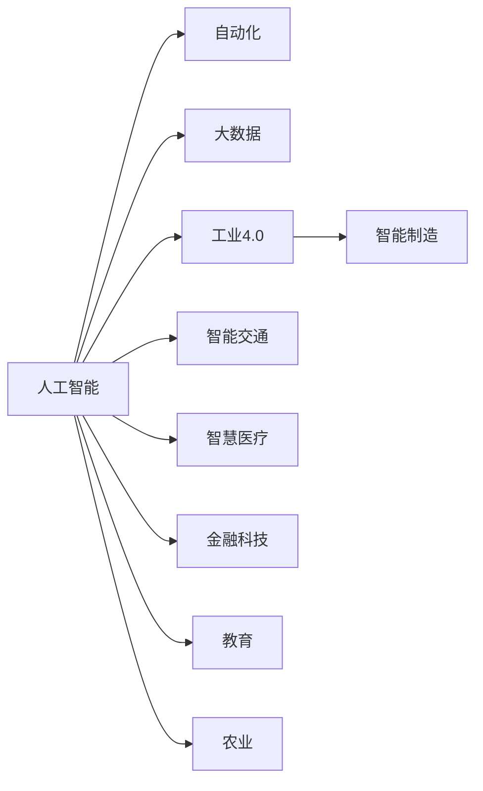

                 

# 人工智能对各行业的影响

> 关键词：人工智能, 自动化, 大数据, 工业4.0, 智能制造, 智能交通, 智慧医疗, 金融科技, 教育, 农业

## 1. 背景介绍

### 1.1 问题由来
人工智能（AI）技术的发展已经深刻影响了各行各业的运作方式和商业模式。从制造业到服务业，从医疗到金融，AI在提升效率、优化资源配置、提供新服务和产品等方面发挥了巨大作用。作为AI的重要分支，深度学习、机器学习、自然语言处理等技术，正在推动人类社会进入全新的智能时代。

### 1.2 问题核心关键点
AI对各行业的影响主要体现在以下几个方面：

- **效率提升**：通过自动化、智能化手段，大幅减少人工操作，提高生产和服务效率。
- **成本优化**：降低运营和维护成本，提升资源利用率，增强竞争力。
- **决策支持**：利用大数据和算法分析，为决策提供科学依据，减少不确定性。
- **新服务和新产品**：创造新的应用场景和消费需求，带来新的市场机会。
- **风险管理**：通过智能监测和预警，降低风险和事故发生概率，保护企业和个人安全。

## 2. 核心概念与联系

### 2.1 核心概念概述

为更好地理解AI对各行业的影响，本节将介绍几个核心概念及其相互关系：

- **人工智能**：指通过计算机算法和硬件实现的人类智能过程，包括机器学习、深度学习、自然语言处理等子领域。
- **自动化**：指使用机器人、软件等工具，代替或辅助人工完成重复性任务。
- **大数据**：指通过先进技术手段收集、存储、分析和应用海量数据的过程，是AI的基础。
- **工业4.0**：指通过信息化、智能化技术实现生产过程的全面数字化，包括智能制造、智慧物流等。
- **智能制造**：指利用AI、物联网、云计算等技术，实现制造过程的智能化、自动化。
- **智能交通**：指通过AI技术优化交通流量管理、自动驾驶等，提升交通效率和安全。
- **智慧医疗**：指利用AI技术进行疾病诊断、治疗方案推荐、患者监护等，提升医疗服务质量。
- **金融科技**：指利用AI、区块链等技术，创新金融服务模式，提升金融效率和安全性。
- **教育**：指通过AI技术进行个性化教学、智能辅导等，提升教育效果和公平性。
- **农业**：指利用AI技术进行农作物种植管理、灾害预警等，提高农业生产效率和可持续性。

这些概念之间的关系可以通过以下Mermaid流程图来展示：



这个流程图展示了AI与其他核心概念之间的逻辑关系：

1. AI通过自动化技术减少了人工操作，提高了效率和精度。
2. AI利用大数据技术进行信息处理和分析，支持科学决策。
3. AI通过工业4.0推动了传统制造业的数字化和智能化转型。
4. AI在智能交通、智慧医疗、金融科技、教育、农业等领域创造了诸多应用场景，提升了行业服务水平和运营效率。

## 3. 核心算法原理 & 具体操作步骤
### 3.1 算法原理概述

AI的核心算法原理主要包括以下几个方面：

- **机器学习**：通过数据训练模型，让机器自动学习数据中的规律，并进行预测和分类。
- **深度学习**：通过多层次神经网络结构，模拟人脑神经元的工作方式，解决复杂模式识别问题。
- **自然语言处理**：通过算法理解和处理人类语言，实现文本分类、情感分析、机器翻译等任务。
- **强化学习**：通过奖励和惩罚机制，让机器在特定环境中学习最优决策策略，适用于游戏、机器人控制等场景。

AI的实际应用操作流程一般包括数据收集、预处理、模型训练、验证、调优和部署等步骤。

### 3.2 算法步骤详解

以自然语言处理（NLP）中的机器翻译为例，其核心算法步骤如下：

1. **数据收集**：收集大量双语对照语料，用于训练翻译模型。
2. **数据预处理**：对文本进行分词、去除停用词、词性标注等预处理，将文本转换为模型可处理的形式。
3. **模型选择与设计**：选择适当的神经网络架构，如RNN、CNN、Transformer等，设计模型的输入输出。
4. **模型训练**：使用训练集对模型进行参数优化，最小化损失函数，提高模型准确率。
5. **模型验证**：使用验证集评估模型性能，调整超参数，防止过拟合。
6. **模型调优**：根据评估结果，进一步调整模型结构、学习率和正则化等参数。
7. **模型部署**：将训练好的模型部署到生产环境中，提供实时翻译服务。

### 3.3 算法优缺点

AI的核心算法具有以下优点：

- **高效处理复杂数据**：深度学习等算法能够处理海量的非结构化数据，如文本、图像、语音等。
- **广泛应用领域**：AI技术可以应用于几乎所有行业，提升效率和智能化水平。
- **持续优化能力**：AI模型可以通过不断训练和优化，逐步提高性能。

同时，AI算法也存在一些缺点：

- **数据依赖性强**：AI模型需要大量高质量数据进行训练，数据不足或质量不高会影响模型效果。
- **计算资源消耗大**：深度学习等算法需要大量计算资源，硬件成本较高。
- **模型黑箱问题**：复杂的模型难以解释，难以理解其内部工作机制。
- **伦理与安全问题**：AI决策可能存在偏见，影响公平性，甚至可能产生负面社会影响。

### 3.4 算法应用领域

AI的核心算法在多个领域得到广泛应用，具体包括：

- **医疗健康**：通过AI进行疾病诊断、治疗方案推荐、患者监护等，提升医疗服务质量。
- **金融服务**：利用AI进行风险评估、欺诈检测、投资分析等，提升金融决策准确性。
- **制造业**：通过AI进行预测维护、质量检测、生产优化等，提高生产效率和产品质量。
- **物流运输**：利用AI进行路线规划、交通管理、智能仓储等，提升物流效率和安全性。
- **教育培训**：通过AI进行个性化教学、智能辅导等，提升教育效果和公平性。
- **零售电商**：利用AI进行商品推荐、库存管理、客户分析等，提升客户体验和销售效率。
- **智能交通**：通过AI进行交通流量管理、自动驾驶、智能停车等，提升交通效率和安全性。
- **安全监控**：利用AI进行视频分析、异常检测、入侵检测等，提升公共安全水平。
- **能源管理**：通过AI进行能源消耗预测、优化调度等，提升能源利用效率和可持续发展能力。

## 4. 数学模型和公式 & 详细讲解 & 举例说明

### 4.1 数学模型构建

以图像分类为例，常见的数学模型包括卷积神经网络（CNN）、支持向量机（SVM）等。

卷积神经网络的数学模型构建如下：

- **输入层**：输入图像像素值，表示为 $x_{i,j}$。
- **卷积层**：通过卷积操作提取特征，表示为 $F_{i,j} = \sum_{k,l} w_{k,l} x_{i-k,j-l} + b$。
- **激活层**：通过非线性函数如ReLU激活神经元，表示为 $a_{i,j} = f(F_{i,j})$。
- **池化层**：通过降采样操作减少特征图尺寸，表示为 $p_{i,j} = \max_{k,l} a_{i+k,j+l}$。
- **全连接层**：将池化后的特征映射到输出标签，表示为 $y = \sum_{k,l} w_k a_{i-k,j-l} + b$。

### 4.2 公式推导过程

以CNN的卷积操作为例，其公式推导过程如下：

假设输入图像大小为 $m \times n$，卷积核大小为 $k \times k$，步长为 $s$，输出特征图大小为 $p \times q$。

卷积操作定义为：

$$
F_{i,j} = \sum_{k,l} w_{k,l} x_{i-k,j-l} + b
$$

其中，$w_{k,l}$ 为卷积核权重，$b$ 为偏置项。

通过计算，可以得到输出特征图的大小为：

$$
p = \lfloor \frac{m}{s} \rfloor
$$
$$
q = \lfloor \frac{n}{s} \rfloor
$$

### 4.3 案例分析与讲解

以图像分类为例，通过CNN模型对MNIST手写数字数据集进行分类。训练集和测试集各包含60,000张28x28像素的手写数字图像，标签从0到9。

使用PyTorch框架实现CNN模型，代码如下：

```python
import torch
import torch.nn as nn
import torchvision.transforms as transforms
import torchvision.datasets as datasets

# 定义CNN模型
class Net(nn.Module):
    def __init__(self):
        super(Net, self).__init__()
        self.conv1 = nn.Conv2d(1, 6, 3)
        self.conv2 = nn.Conv2d(6, 16, 3)
        self.fc1 = nn.Linear(16 * 4 * 4, 120)
        self.fc2 = nn.Linear(120, 84)
        self.fc3 = nn.Linear(84, 10)

    def forward(self, x):
        x = nn.functional.relu(self.conv1(x))
        x = nn.functional.max_pool2d(x, 2)
        x = nn.functional.relu(self.conv2(x))
        x = nn.functional.max_pool2d(x, 2)
        x = x.view(-1, 16 * 4 * 4)
        x = nn.functional.relu(self.fc1(x))
        x = nn.functional.relu(self.fc2(x))
        x = self.fc3(x)
        return x

# 定义数据预处理
transform = transforms.Compose([transforms.ToTensor(), transforms.Normalize((0.1307,), (0.3081,))])

# 加载数据集
train_dataset = datasets.MNIST(root='./data', train=True, transform=transform, download=True)
test_dataset = datasets.MNIST(root='./data', train=False, transform=transform, download=True)

# 定义模型、损失函数和优化器
model = Net()
criterion = nn.CrossEntropyLoss()
optimizer = torch.optim.SGD(model.parameters(), lr=0.001, momentum=0.5)

# 训练模型
for epoch in range(10):
    running_loss = 0.0
    for i, data in enumerate(train_loader, 0):
        inputs, labels = data
        optimizer.zero_grad()
        outputs = model(inputs)
        loss = criterion(outputs, labels)
        loss.backward()
        optimizer.step()
        running_loss += loss.item()
    print(f'Epoch {epoch+1}, loss: {running_loss/len(train_loader):.4f}')

# 测试模型
correct = 0
total = 0
with torch.no_grad():
    for data in test_loader:
        images, labels = data
        outputs = model(images)
        _, predicted = torch.max(outputs.data, 1)
        total += labels.size(0)
        correct += (predicted == labels).sum().item()
print(f'Accuracy of the network on the 10000 test images: {100 * correct / total:.2f}%')
```

## 5. 项目实践：代码实例和详细解释说明

### 5.1 开发环境搭建

在进行AI项目实践前，我们需要准备好开发环境。以下是使用Python进行TensorFlow开发的环境配置流程：

1. 安装Anaconda：从官网下载并安装Anaconda，用于创建独立的Python环境。

2. 创建并激活虚拟环境：
```bash
conda create -n tf-env python=3.8 
conda activate tf-env
```

3. 安装TensorFlow：根据CUDA版本，从官网获取对应的安装命令。例如：
```bash
pip install tensorflow==2.7
```

4. 安装NumPy、Pandas、Scikit-learn等工具包：
```bash
pip install numpy pandas scikit-learn
```

5. 安装Jupyter Notebook：
```bash
pip install jupyter notebook
```

完成上述步骤后，即可在`tf-env`环境中开始AI项目实践。

### 5.2 源代码详细实现

这里我们以图像分类任务为例，使用TensorFlow实现CNN模型。

```python
import tensorflow as tf
from tensorflow.keras import layers

# 定义CNN模型
model = tf.keras.Sequential([
    layers.Conv2D(32, (3, 3), activation='relu', input_shape=(28, 28, 1)),
    layers.MaxPooling2D((2, 2)),
    layers.Conv2D(64, (3, 3), activation='relu'),
    layers.MaxPooling2D((2, 2)),
    layers.Flatten(),
    layers.Dense(64, activation='relu'),
    layers.Dense(10, activation='softmax')
])

# 编译模型
model.compile(optimizer=tf.keras.optimizers.Adam(learning_rate=0.001),
              loss=tf.keras.losses.CategoricalCrossentropy(from_logits=True),
              metrics=[tf.keras.metrics.CategoricalAccuracy()])

# 加载数据集
mnist = tf.keras.datasets.mnist
(x_train, y_train), (x_test, y_test) = mnist.load_data()
x_train, x_test = x_train / 255.0, x_test / 255.0

# 训练模型
model.fit(x_train, y_train, epochs=10, validation_data=(x_test, y_test))

# 测试模型
test_loss, test_acc = model.evaluate(x_test, y_test)
print(f'Test accuracy: {test_acc:.2f}')
```

### 5.3 代码解读与分析

让我们再详细解读一下关键代码的实现细节：

**CNN模型定义**：
- `Sequential` 类：构建一个顺序模型，依次添加卷积层、池化层、全连接层等。
- `Conv2D` 层：定义卷积核数量、大小、激活函数等参数。
- `MaxPooling2D` 层：定义池化大小。
- `Flatten` 层：将特征图展平，转换为全连接层的输入。
- `Dense` 层：定义全连接层节点数、激活函数等参数。
- `softmax` 激活函数：用于多分类任务，输出每个类别的概率。

**数据加载**：
- `mnist.load_data()`：加载MNIST手写数字数据集，包含训练集和测试集。
- `x_train / 255.0`：将像素值归一化到[0, 1]范围内。

**模型编译**：
- `Adam` 优化器：使用自适应学习率优化算法。
- `CategoricalCrossentropy` 损失函数：用于多分类任务。
- `CategoricalAccuracy` 指标：计算分类准确率。

**模型训练和测试**：
- `fit()` 方法：训练模型，指定训练数据、测试数据、训练轮数等。
- `evaluate()` 方法：评估模型性能，输出损失和准确率。

**输出结果**：
- `print(f'Test accuracy: {test_acc:.2f}')`：输出测试集上的准确率。

## 6. 实际应用场景

### 6.1 智能制造

AI在智能制造领域的应用主要体现在以下几个方面：

- **预测性维护**：通过机器学习算法分析设备运行数据，预测设备故障，提前进行维护，减少停机时间，提高生产效率。
- **质量检测**：利用计算机视觉技术对产品进行图像识别和质量检测，自动化检测不合格品，降低人工检测成本。
- **生产优化**：通过数据分析和优化算法，自动调整生产参数，提升生产效率和产品质量。
- **供应链管理**：利用AI进行需求预测、库存管理等，优化供应链运营，降低成本，提升响应速度。

### 6.2 智慧医疗

AI在智慧医疗领域的应用主要体现在以下几个方面：

- **疾病诊断**：通过深度学习算法分析医学影像，进行疾病诊断，提高诊断准确率和效率。
- **治疗方案推荐**：利用数据分析和机器学习，根据患者历史数据，推荐最适合的治疗方案，提升治疗效果。
- **患者监护**：通过智能穿戴设备收集患者健康数据，利用AI进行实时监控和预警，提高患者生活质量。
- **医疗影像分析**：利用计算机视觉技术，自动化分析医学影像，快速发现异常情况，辅助医生诊断。

### 6.3 智能交通

AI在智能交通领域的应用主要体现在以下几个方面：

- **自动驾驶**：利用深度学习和计算机视觉技术，实现自动驾驶，提高行车安全性和交通效率。
- **交通流量管理**：通过数据分析和优化算法，优化交通信号灯控制，减少交通拥堵，提升通行效率。
- **智能停车**：利用计算机视觉技术，实现自动停车和车位识别，提高停车效率。
- **异常检测**：通过数据分析和机器学习，实时监测交通状况，提前发现异常，保障交通安全。

### 6.4 金融科技

AI在金融科技领域的应用主要体现在以下几个方面：

- **风险评估**：通过数据分析和机器学习，预测贷款违约风险，提高风险评估准确性。
- **欺诈检测**：利用深度学习算法，分析交易数据，识别异常行为，防范欺诈风险。
- **投资分析**：利用数据分析和优化算法，预测市场走势，辅助投资决策。
- **智能客服**：通过自然语言处理技术，实现智能客服，提高客户服务效率和质量。

### 6.5 教育

AI在教育领域的应用主要体现在以下几个方面：

- **个性化教学**：通过数据分析和机器学习，个性化推荐学习内容，提升学习效果。
- **智能辅导**：利用自然语言处理技术，实现智能辅导，解答学生疑问，提高学习效率。
- **学生评估**：通过数据分析和机器学习，评估学生学习效果，提供个性化反馈。
- **教育资源优化**：利用数据分析和优化算法，优化教育资源配置，提高教育资源利用效率。

### 6.6 农业

AI在农业领域的应用主要体现在以下几个方面：

- **农作物管理**：通过数据分析和机器学习，优化农作物种植管理，提高产量和质量。
- **病虫害预测**：利用计算机视觉技术，分析农作物图像，预测病虫害发生情况，提前采取措施。
- **气象预测**：利用数据分析和机器学习，预测气象变化，指导农业生产。
- **智能灌溉**：通过数据分析和优化算法，优化灌溉系统，提高水资源利用效率。

## 7. 工具和资源推荐

### 7.1 学习资源推荐

为了帮助开发者系统掌握AI的核心技术和应用，这里推荐一些优质的学习资源：

1. 《深度学习》（Ian Goodfellow）：深度学习领域的经典教材，涵盖深度学习的基础理论和应用实践。
2. 《机器学习实战》（Peter Harrington）：机器学习算法的实战教程，包含大量代码实例和实践经验。
3. 《自然语言处理综论》（Daniel Jurafsky, James H. Martin）：自然语言处理领域的经典教材，涵盖自然语言处理的基础理论和应用实践。
4. 《Python深度学习》（Francois Chollet）：使用Python实现深度学习算法，包含大量代码实例和实践经验。
5. 《AI基础》（Andrew Ng）：AI技术的入门课程，涵盖AI的基础理论和应用实践。
6. 《机器学习》（周志华）：机器学习领域的经典教材，涵盖机器学习的基础理论和应用实践。

通过对这些资源的学习实践，相信你一定能够快速掌握AI的核心技术和应用方法，并用于解决实际的业务问题。

### 7.2 开发工具推荐

高效的开发离不开优秀的工具支持。以下是几款用于AI开发常用的工具：

1. Python：Python作为AI开发的首选语言，具有丰富的库和框架支持。
2. TensorFlow：由Google开发的开源深度学习框架，支持分布式计算，适用于大规模深度学习项目。
3. PyTorch：由Facebook开发的开源深度学习框架，具有灵活性和易用性，适用于研究性项目。
4. Jupyter Notebook：基于Web的交互式编程环境，支持代码编写和数据可视化，方便调试和分享。
5. Visual Studio Code：轻量级、高度可定制的开发工具，支持代码高亮、调试、版本控制等功能。
6. Google Colab：谷歌提供的免费云服务，支持GPU和TPU计算，方便实验最新模型，分享学习笔记。

合理利用这些工具，可以显著提升AI项目开发的效率和质量，加快创新迭代的步伐。

### 7.3 相关论文推荐

AI技术的快速发展离不开学界的持续研究。以下是几篇奠基性的相关论文，推荐阅读：

1. AlexNet: ImageNet Classification with Deep Convolutional Neural Networks：提出AlexNet模型，开创深度学习在图像识别领域的应用。
2. Deep Residual Learning for Image Recognition：提出ResNet模型，解决深度神经网络中的梯度消失问题，提升模型深度和性能。
3. Google's Inception: Scaling Image Recognition with Deep Convolutional Neural Networks：提出Inception模型，通过网络结构优化提升模型性能。
4. Rethinking the Inception Architecture for Computer Vision：提出改进版Inception模型，进一步提升模型性能。
5. AlphaGo Zero: Mastering the Game of Go without Human Knowledge：提出AlphaGo Zero算法，解决无监督学习和自我博弈问题，实现AI在复杂游戏领域的突破。
6. Attention is All You Need：提出Transformer模型，解决大规模语言模型的自注意力机制问题，推动自然语言处理领域的发展。

这些论文代表了大AI技术的发展脉络。通过学习这些前沿成果，可以帮助研究者把握学科前进方向，激发更多的创新灵感。

## 8. 总结：未来发展趋势与挑战

### 8.1 总结

本文对AI对各行业的影响进行了全面系统的介绍。首先阐述了AI技术的背景和重要性，明确了AI在提升效率、优化资源配置、提供新服务和新产品等方面的独特价值。其次，从原理到实践，详细讲解了AI的核心算法和操作步骤，给出了AI项目开发的完整代码实例。同时，本文还广泛探讨了AI技术在智能制造、智慧医疗、智能交通、金融科技、教育、农业等多个行业领域的应用前景，展示了AI技术的广阔前景。此外，本文精选了AI技术的各类学习资源，力求为读者提供全方位的技术指引。

通过本文的系统梳理，可以看到，AI技术已经深入各行各业，成为推动社会进步的重要力量。未来，伴随AI技术的不断演进，各行业将在智能化、自动化、高效化等方面迈出更大步伐，带来更多创新和突破。

### 8.2 未来发展趋势

展望未来，AI技术的发展趋势主要体现在以下几个方面：

1. **技术深度和广度**：深度学习和机器学习将继续深化，同时向自然语言处理、计算机视觉、机器人学等领域拓展，推动AI技术在更多领域的应用。
2. **智能化和自动化**：AI技术将更加智能化和自动化，通过大数据、云计算、物联网等技术，实现智能决策和自动化运营。
3. **个性化和定制化**：AI技术将更加注重个性化和定制化，通过数据分析和优化算法，提供个性化的服务和产品。
4. **多模态融合**：AI技术将进一步融合多种模态数据，如文本、图像、语音等，提升跨模态理解能力和应用场景。
5. **伦理与安全**：AI技术的伦理和安全问题将受到更多关注，研究和应用过程中将更加注重公平性、透明性和安全性。
6. **协作与融合**：AI技术与人类智能将更加紧密协作，形成人机协同的智能系统，提升人类决策能力。

### 8.3 面临的挑战

尽管AI技术已经取得了瞩目成就，但在迈向更加智能化、普适化应用的过程中，仍面临诸多挑战：

1. **数据隐私与安全**：AI技术需要大量数据支持，数据隐私和安全问题将受到更多关注。
2. **模型可解释性**：复杂的AI模型难以解释其决策过程，影响模型信任和应用范围。
3. **计算资源限制**：大规模AI模型需要大量计算资源，硬件成本和能耗问题将制约其发展。
4. **伦理与法律问题**：AI决策可能存在偏见，影响公平性，甚至可能产生负面社会影响。
5. **跨领域融合困难**：AI技术与不同领域的融合需要时间和技术突破，实现深度协同应用。

### 8.4 研究展望

未来，在AI技术的研究和应用过程中，以下几个方向值得关注：

1. **联邦学习**：通过分布式计算技术，实现跨地域、跨机构的数据联合学习，解决数据隐私和安全问题。
2. **可解释AI**：通过引入可解释性技术，提升AI模型的透明性和可信度，增强其应用效果。
3. **量子计算与AI结合**：利用量子计算的强大计算能力，提升AI模型的性能和效率，解决传统计算资源限制问题。
4. **跨领域知识融合**：通过多领域知识融合，提升AI模型的泛化能力和应用范围，解决跨领域融合困难问题。

这些方向将引领AI技术迈向更高的台阶，为构建安全、可靠、可解释、可控的智能系统铺平道路。面向未来，AI技术还需要与其他AI技术进行更深入的融合，如知识表示、因果推理、强化学习等，多路径协同发力，共同推动自然语言理解和智能交互系统的进步。只有勇于创新、敢于突破，才能不断拓展AI技术的边界，让智能技术更好地造福人类社会。

## 9. 附录：常见问题与解答

**Q1：AI技术是否会导致大量工作岗位的消失？**

A: AI技术的进步确实会带来某些岗位的消失，但同时也会创造更多新的岗位和机会。AI技术可以替代重复性和低价值的工作，释放人力资源，让人们专注于更有创造性和高价值的工作。

**Q2：AI技术如何保护数据隐私？**

A: AI技术在数据使用过程中需要严格遵守数据隐私保护法规，如GDPR、CCPA等。同时，可以采用数据脱敏、差分隐私等技术，保护用户隐私。

**Q3：AI模型是否容易受到攻击？**

A: AI模型在对抗样本攻击下容易产生误判，但通过引入对抗训练等技术，可以提高模型的鲁棒性，减少被攻击的风险。

**Q4：AI模型在多语言环境下的表现如何？**

A: AI模型在多语言环境下的表现取决于数据的多样性和质量。通过多语言数据集训练和微调，AI模型可以显著提升在多语言环境下的表现。

**Q5：AI技术是否可以用于开发新药物？**

A: AI技术在药物发现和开发过程中已经展现出巨大潜力，通过数据挖掘和模型预测，可以加速新药物的研发进程，降低研发成本。

总之，AI技术的发展已经深刻影响了各行各业的运作方式和商业模式。通过合理应用AI技术，各行业将在智能化、自动化、高效化等方面迈出更大步伐，带来更多创新和突破。未来，伴随AI技术的不断演进，各行业将在智能化、自动化、高效化等方面迈出更大步伐，带来更多创新和突破。

