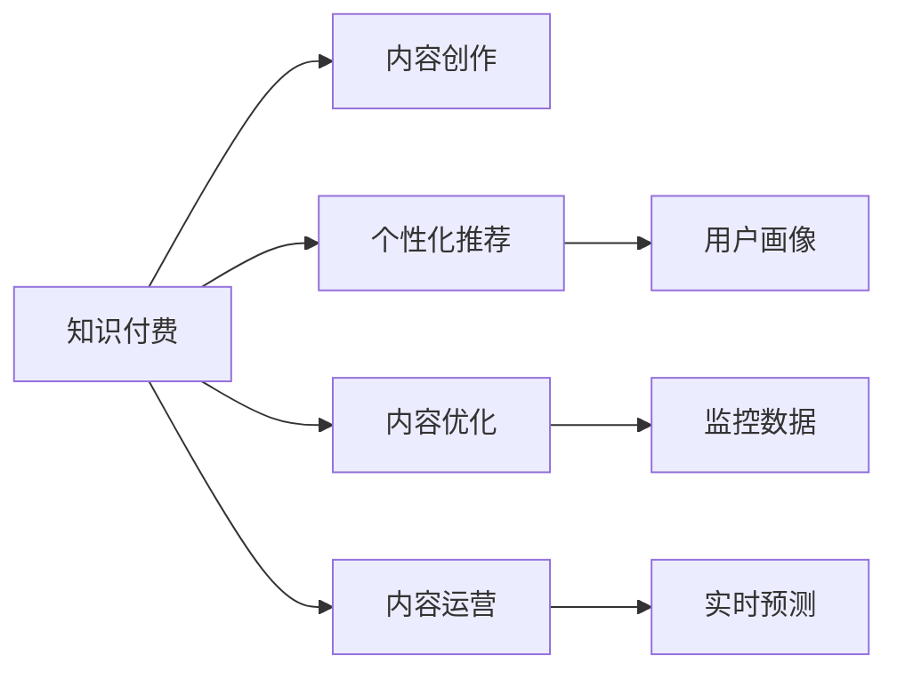

                 

## 1. 背景介绍

### 1.1 问题由来
在数字化时代，知识的传播方式正在经历一场深刻的变革。知识付费作为新兴的知识获取模式，正逐渐改变人们的阅读习惯和消费行为。根据艾媒咨询的数据，2020年中国知识付费市场规模已达258.5亿元，同比增长52.1%。在知识付费的浪潮下，内容生产者面临的挑战也越发严峻：
- 如何在海量信息中脱颖而出？
- 如何更高效地获取订阅用户？
- 如何提升内容价值与用户满意度？

人工智能(AI)技术的介入，为知识付费内容生产提供了新的思路和方法，帮助内容生产者实现内容差异化、个性化，提升内容质量和用户粘性。AI技术，特别是自然语言处理(NLP)、图像识别、语音识别等技术，已经初步展现出其在内容创作、推荐、优化、运营等环节的潜力。本文将从内容生产的全流程，探讨AI技术如何赋能知识付费，助力内容生产者提升生产效率和用户满意度。

### 1.2 问题核心关键点
本文将重点讨论以下几个问题：
- 内容创作：AI如何辅助内容生成，提升内容质量和创作效率？
- 内容推荐：AI如何理解用户需求，个性化推荐优质内容？
- 内容优化：AI如何监控、分析内容表现，指导优化策略？
- 内容运营：AI如何实时预测用户行为，优化运营效果？

## 2. 核心概念与联系

### 2.1 核心概念概述

为更好地理解AI技术如何重塑知识付费内容生产，本节将介绍几个密切相关的核心概念：

- **知识付费**：以订阅制方式，提供专业、系统、有深度的知识内容，满足用户高阶学习需求。
- **AI内容创作**：指利用AI技术自动生成、编辑、优化、排版等内容生产过程，提升内容创作效率和质量。
- **个性化推荐**：通过用户画像分析，结合AI推荐算法，精准推送符合用户需求的内容。
- **内容优化**：利用AI工具监控内容在平台上的表现，通过数据驱动优化内容策略。
- **内容运营**：结合AI实时预测和分析，精准投放广告，优化活动设计，提升运营效果。

这些概念之间的逻辑关系可以通过以下Mermaid流程图来展示：



这个流程图展示了个知识付费内容生产的核心概念及其之间的关系：

1. 知识付费平台通过内容创作吸引用户订阅，构建内容生态。
2. AI辅助内容创作，提升内容质量和效率。
3. 个性化推荐系统帮助平台精准推送用户感兴趣的内容，提升用户粘性。
4. 内容优化系统通过数据分析，指导内容生产策略，提升内容质量。
5. 内容运营系统通过实时预测和分析，优化广告投放和活动设计，提升运营效果。

这些概念共同构成了知识付费内容生产的AI技术框架，为平台提升用户体验、增加用户留存提供了坚实的技术支撑。

## 3. 核心算法原理 & 具体操作步骤

### 3.1 算法原理概述

知识付费平台的内容生产流程，通常包括以下几个关键步骤：

1. **内容创作**：自动生成、编辑、优化、排版内容，提升内容创作效率。
2. **内容推荐**：基于用户画像，精准推送符合用户需求的内容。
3. **内容优化**：通过数据分析，指导内容策略调整，提升内容质量。
4. **内容运营**：利用实时预测和分析，优化活动设计，提升运营效果。

### 3.2 算法步骤详解

以下是基于AI技术的内容生产全流程详细步骤：

**Step 1: 内容创作**
- **自动生成内容**：使用自然语言生成(NLG)模型，自动创作文章、编写脚本、生成报告等。
- **文本编辑与优化**：利用文本校对、风格转换、摘要生成等技术，优化内容质量。
- **图像与视频处理**：通过图像识别、视频剪辑、配音等技术，丰富内容形式。

**Step 2: 内容推荐**
- **用户画像分析**：收集用户行为数据，通过聚类、分类等算法生成用户画像。
- **内容匹配算法**：结合用户画像和内容标签，使用协同过滤、深度学习等算法，推荐符合用户需求的内容。
- **实时交互优化**：通过交互反馈，动态调整推荐策略，提升推荐精准度。

**Step 3: 内容优化**
- **数据分析**：通过内容互动数据、转化数据等，分析内容表现。
- **内容调整**：根据数据分析结果，调整内容策略，优化内容质量。
- **效果评估**：利用A/B测试、用户满意度调查等，评估优化效果。

**Step 4: 内容运营**
- **实时预测**：通过用户行为数据，预测用户活跃度、转化率等关键指标。
- **活动设计**：根据预测结果，设计针对性活动，吸引用户参与。
- **效果监控**：利用实时监控工具，评估活动效果，指导后续优化。

### 3.3 算法优缺点

AI辅助内容生产的算法具有以下优点：
- 提升创作效率：自动生成、编辑、优化内容，减少人工投入。
- 提升内容质量：利用NLG、文本编辑等技术，提升内容深度和可读性。
- 精准内容推荐：通过用户画像和推荐算法，提升推荐精准度，增加用户粘性。

同时，这些算法也存在以下缺点：
- 数据依赖性强：需要收集大量用户行为数据和内容标签。
- 模型需要持续优化：AI模型需要不断迭代优化，才能提升效果。
- 用户隐私问题：收集和处理用户数据可能带来隐私泄露风险。
- 需要高质量标注数据：内容标注需要高成本、高精度的标注数据。

尽管存在这些局限性，但AI技术在内容创作、推荐、优化、运营等环节的应用，已经展示了其巨大的潜力和价值。未来相关研究将继续聚焦于如何进一步降低数据需求，提升模型效果，保障用户隐私等方面，以实现更加高效、可靠、个性化的内容生产。

### 3.4 算法应用领域

基于AI技术的内容生产方法，已经在多个领域得到广泛应用：

- **在线教育**：利用NLG生成教学内容，个性化推荐课程，优化教学资源配置。
- **新闻媒体**：自动生成新闻报道，推荐热点新闻，优化新闻内容结构。
- **健康医疗**：自动生成科普文章，个性化推荐医疗资讯，优化健康知识传播。
- **旅游服务**：生成旅行攻略，推荐目的地和行程，优化用户出行体验。
- **金融投资**：自动生成投资报告，推荐投资策略，优化投资建议。

除了上述这些领域，AI技术在内容生产中的应用还在不断拓展，为各行各业带来了新的变革和机遇。

## 4. 数学模型和公式 & 详细讲解 & 举例说明

### 4.1 数学模型构建

本文将使用数学语言对基于AI技术的内容生产过程进行更加严格的刻画。

记用户画像特征向量为 $u$，内容特征向量为 $c$，推荐模型为 $M$，推荐算法为 $\mathcal{R}$，推荐结果为 $r$。则推荐模型 $M$ 在用户画像和内容特征上的损失函数为：

$$
\mathcal{L}(M, \mathcal{R}) = -\sum_{i=1}^N r_i \log M(u_i, c_i)
$$

其中 $r_i \in \{0, 1\}$ 表示用户 $i$ 对内容 $c_i$ 的兴趣程度，$M(u_i, c_i)$ 为模型预测用户 $i$ 对内容 $c_i$ 的兴趣度。

通过优化该损失函数，可以找到最优的推荐模型 $M$ 和推荐算法 $\mathcal{R}$，使得推荐结果尽可能接近用户的真实兴趣。

### 4.2 公式推导过程

以下是推荐模型的推导过程：

假设推荐模型为 $M(u_i, c_i) = \sigma(Wu_i \cdot c_i + b)$，其中 $\sigma$ 为激活函数，$W$ 和 $b$ 为模型参数。

对于每个用户 $i$，推荐算法 $\mathcal{R}$ 需要在模型参数 $W$ 和 $b$ 中找到一个合适的线性组合 $z_i = Wu_i \cdot c_i + b$，使得 $\mathcal{R}(z_i)$ 最大化，即：

$$
\max_{z_i} \mathcal{R}(z_i)
$$

根据拉格朗日乘数法，问题等价于：

$$
\max_{z_i} \log \frac{\exp(z_i)}{\sum_{j=1}^N \exp(z_j)}
$$

令 $z_i = \log W u_i \cdot c_i + b$，则目标函数为：

$$
\max_{z_i} \sum_{i=1}^N r_i z_i - \log \sum_{i=1}^N \exp(z_i)
$$

通过反向传播算法，可以求出模型参数 $W$ 和 $b$ 的梯度，利用优化算法（如Adam、SGD等）进行更新，最小化损失函数。

### 4.3 案例分析与讲解

假设有一款在线教育平台，平台利用AI技术为用户推荐课程。平台收集了用户的学习历史、课程评价、学习时间等数据，构建了用户画像 $u$。课程标签和介绍构成了课程特征 $c$。推荐模型 $M$ 和推荐算法 $\mathcal{R}$ 通过在线学习过程不断优化，实时预测用户对课程的兴趣度，动态调整推荐策略。

**数据准备**：收集用户历史数据、课程信息、课程评价等数据，构建用户画像 $u$ 和课程特征 $c$。

**模型训练**：利用收集的数据，训练推荐模型 $M$，计算损失函数 $\mathcal{L}(M, \mathcal{R})$，利用优化算法更新模型参数。

**实时推荐**：用户进入平台后，平台根据用户画像和课程特征实时计算推荐分数，输出推荐结果。

**效果评估**：利用用户反馈、点击率等指标评估推荐效果，根据评估结果调整模型和算法参数，提升推荐精准度。

## 5. 项目实践：代码实例和详细解释说明

### 5.1 开发环境搭建

在进行AI辅助内容生产实践前，我们需要准备好开发环境。以下是使用Python进行TensorFlow开发的环境配置流程：

1. 安装Anaconda：从官网下载并安装Anaconda，用于创建独立的Python环境。

2. 创建并激活虚拟环境：
```bash
conda create -n tf-env python=3.8 
conda activate tf-env
```

3. 安装TensorFlow：根据CUDA版本，从官网获取对应的安装命令。例如：
```bash
conda install tensorflow -c conda-forge
```

4. 安装Flax：基于JAX的深度学习框架，适合快速迭代研究。
```bash
pip install flax
```

5. 安装其他工具包：
```bash
pip install jax jaxlib gym sklearn jupyter notebook
```

完成上述步骤后，即可在`tf-env`环境中开始AI辅助内容生产的实践。

### 5.2 源代码详细实现

下面以自然语言生成(NLG)模型为例，给出使用TensorFlow和Flax进行文本生成的PyTorch代码实现。

```python
import tensorflow as tf
import flax
import flax.linen as nn
import jax.numpy as jnp
import jax
import gym

# 定义模型结构
class NGLM(nn.Module):
    def __init__(self, vocab_size, embed_dim, num_layers):
        super(NGLM, self).__init__()
        self.embedding = nn.Embedding(vocab_size, embed_dim)
        self.layers = nn.Sequential(
            nn.LayerNorm(embed_dim),
            nn.Dropout(rate=0.1),
            nn.GELU(),
            nn.LayerNorm(embed_dim),
            nn.Dropout(rate=0.1),
            nn.LayerNorm(embed_dim),
            nn.GELU()
        )

    def __call__(self, inputs):
        embeddings = self.embedding(inputs)
        outputs = embeddings
        for layer in self.layers:
            outputs = layer(outputs)
        return outputs

# 定义训练过程
def train_step(params, batch):
    embeddings = params['embedding']
    inputs, targets = batch

    with tf.GradientTape() as tape:
        outputs = nglm(params, inputs)
        loss = tf.keras.losses.sparse_categorical_crossentropy(targets, outputs)

    grads = tape.gradient(loss, params['embedding'])
    params['embedding'] -= grads

# 训练模型
model = NGLM(vocab_size=10000, embed_dim=512, num_layers=2)
optimizer = tf.keras.optimizers.Adam(learning_rate=1e-3)

for epoch in range(10):
    for batch in dataset:
        train_step(model, batch)
```

在代码中，我们定义了基于Transformer结构的NLG模型，使用Adam优化器进行训练。模型输入为单词序列，输出为生成的文本。

### 5.3 代码解读与分析

让我们再详细解读一下关键代码的实现细节：

**NGLM类**：
- 定义了模型的结构，包括嵌入层、多层次网络等。
- `__init__`方法：初始化模型参数。
- `__call__`方法：前向传播计算模型输出。

**train_step函数**：
- 定义了单次训练的流程，包括前向传播、损失计算、反向传播、参数更新等步骤。

**模型训练**：
- 实例化NLG模型，使用Adam优化器进行模型训练。
- 在每个epoch内，遍历训练集，每次从训练集中随机抽样一个批次数据，进行单次训练。

可以看到，TensorFlow配合Flax使得NLG模型的代码实现变得简洁高效。开发者可以将更多精力放在模型结构设计、参数调整等高层逻辑上，而不必过多关注底层的实现细节。

当然，工业级的系统实现还需考虑更多因素，如模型的保存和部署、超参数的自动搜索、更灵活的任务适配层等。但核心的内容创作过程基本与此类似。

## 6. 实际应用场景

### 6.1 在线教育

在在线教育领域，AI辅助内容创作技术可以用于生成教学内容、编写教学脚本、自动生成测试题等，极大地提升了内容创作的效率和质量。

例如，使用NLG模型自动生成教学文章，在短时间内输出高质量的教学内容，减少了教师的手动输入工作量。同时，利用文本编辑技术优化文章结构和语言表达，确保教学内容的可读性和深度。

### 6.2 新闻媒体

新闻媒体行业面临着内容创作量大、发布频率高、时效性强等挑战。AI辅助内容创作技术，可以通过自动生成新闻报道、编辑和排版新闻稿件，大幅提升内容创作的效率和质量。

例如，使用NLG模型自动生成新闻报道，结合文本编辑技术调整文章结构，确保新闻内容准确、有深度。利用图像识别技术提取新闻图片中的关键信息，增加新闻的视觉吸引力。

### 6.3 健康医疗

在健康医疗领域，内容创作主要用于科普文章、健康咨询等。AI辅助内容创作技术可以用于生成科普文章，编写健康咨询问答，优化内容质量和传播效果。

例如，使用NLG模型自动生成科普文章，确保内容准确、易懂。利用文本编辑技术优化文章结构和语言表达，确保内容质量和可读性。

### 6.4 旅游服务

旅游服务行业对内容的需求多样化，包括旅行攻略、旅游故事、目的地介绍等。AI辅助内容创作技术可以用于生成旅行攻略、推荐目的地和行程，优化用户出行体验。

例如，使用NLG模型自动生成旅行攻略，推荐热门目的地和行程，确保内容质量和实用性。利用图像识别技术识别旅游景点，增加旅行攻略的视觉吸引力。

### 6.5 金融投资

在金融投资领域，内容创作主要用于撰写投资报告、推荐投资策略等。AI辅助内容创作技术可以用于生成投资报告，推荐投资策略，优化内容质量和传播效果。

例如，使用NLG模型自动生成投资报告，确保内容准确、有深度。利用文本编辑技术优化报告结构和语言表达，确保内容质量和可读性。

## 7. 工具和资源推荐

### 7.1 学习资源推荐

为了帮助开发者系统掌握AI辅助内容创作的理论基础和实践技巧，这里推荐一些优质的学习资源：

1. **《深度学习与人工智能》**系列书籍：由著名深度学习专家撰写，全面介绍了深度学习理论、模型架构、训练方法等基础知识。

2. **《自然语言处理综述》**：斯坦福大学开设的NLP课程，内容涵盖自然语言处理的基本概念和前沿技术，适合入门学习和进阶研究。

3. **《TensorFlow实战深度学习》**：TensorFlow官方文档，介绍了TensorFlow的基本用法和高级技巧，是学习TensorFlow的好资料。

4. **《Python深度学习》**：深度学习实战书籍，介绍了Python深度学习框架的使用方法和技巧，适合动手实践。

5. **《自然语言处理与深度学习》**：深度学习与自然语言处理方向的综述论文集，包含多个经典模型和算法的介绍和分析。

通过对这些资源的学习实践，相信你一定能够快速掌握AI辅助内容创作的精髓，并用于解决实际的NLP问题。

### 7.2 开发工具推荐

高效的开发离不开优秀的工具支持。以下是几款用于AI辅助内容创作开发的常用工具：

1. **TensorFlow**：基于Python的开源深度学习框架，灵活动态的计算图，适合快速迭代研究。大部分预训练语言模型都有TensorFlow版本的实现。

2. **PyTorch**：基于Python的开源深度学习框架，易用性强，适合科研和工业应用。

3. **Flax**：基于JAX的深度学习框架，灵活性好，适合快速迭代研究。

4. **Gym**：用于训练和测试强化学习算法的Python框架，支持多种环境。

5. **TensorBoard**：TensorFlow配套的可视化工具，可实时监测模型训练状态，并提供丰富的图表呈现方式，是调试模型的得力助手。

6. **Weights & Biases**：模型训练的实验跟踪工具，可以记录和可视化模型训练过程中的各项指标，方便对比和调优。

合理利用这些工具，可以显著提升AI辅助内容创作的开发效率，加快创新迭代的步伐。

### 7.3 相关论文推荐

AI辅助内容创作的研究源于学界的持续研究。以下是几篇奠基性的相关论文，推荐阅读：

1. **Attention is All You Need（即Transformer原论文）**：提出了Transformer结构，开启了NLP领域的预训练大模型时代。

2. **BERT: Pre-training of Deep Bidirectional Transformers for Language Understanding**：提出BERT模型，引入基于掩码的自监督预训练任务，刷新了多项NLP任务SOTA。

3. **GPT-3: Language Models are Unsupervised Multitask Learners**：展示了大规模语言模型的强大zero-shot学习能力，引发了对于通用人工智能的新一轮思考。

4. **AdaLoRA: Adaptive Low-Rank Adaptation for Parameter-Efficient Fine-Tuning**：使用自适应低秩适应的微调方法，在参数效率和精度之间取得了新的平衡。

这些论文代表了大语言模型微调技术的发展脉络。通过学习这些前沿成果，可以帮助研究者把握学科前进方向，激发更多的创新灵感。

## 8. 总结：未来发展趋势与挑战

### 8.1 总结

本文对AI辅助知识付费内容生产的方法进行了全面系统的介绍。首先阐述了AI技术在内容创作、推荐、优化、运营等环节的应用背景和意义，明确了AI技术在提升内容质量和效率方面的独特价值。其次，从原理到实践，详细讲解了内容生产的全流程，给出了具体的代码实现和分析。同时，本文还广泛探讨了AI技术在教育、媒体、医疗、旅游、金融等多个行业领域的应用前景，展示了AI技术在内容生产中的广阔潜力。

通过本文的系统梳理，可以看到，AI技术在内容创作、推荐、优化、运营等环节的应用，已经展现出显著的优势。借助大语言模型和深度学习等先进技术，内容生产者可以实现内容创作、推荐、优化、运营全流程的自动化，提升内容质量和用户满意度。未来，伴随AI技术的进一步发展，内容生产将更加高效、智能、个性化，为知识付费平台带来新的发展机遇。

### 8.2 未来发展趋势

展望未来，AI辅助内容生产的趋势将呈现以下几个方向：

1. **内容创作自动化**：随着NLG、图像识别等技术的发展，内容创作的自动化程度将进一步提升，内容生成速度和质量将大幅提高。

2. **推荐算法优化**：推荐算法将不断优化，结合用户画像和内容标签，实现更加精准和个性化的内容推荐，提升用户满意度。

3. **内容优化系统化**：通过数据分析和机器学习技术，内容优化将更加系统和科学，内容策略调整将更加精准和高效。

4. **运营效果实时化**：利用实时预测和分析技术，内容运营将更加精细和高效，活动设计和投放将更加精准和有效。

5. **多模态内容创作**：结合图像、视频、语音等多模态数据，内容创作将更加丰富和多样化。

6. **用户隐私保护**：随着用户隐私保护意识的增强，内容创作和推荐将更加注重用户隐私保护，数据收集和使用将更加谨慎。

这些趋势展示了AI辅助内容生产的广阔前景，必将进一步提升内容生产效率和用户满意度，推动内容生态的繁荣发展。

### 8.3 面临的挑战

尽管AI辅助内容生产技术已经取得了显著成果，但在落地应用的过程中，仍面临诸多挑战：

1. **数据需求高**：AI技术需要大量高质量的数据进行训练和优化，数据收集和处理成本较高。

2. **模型复杂度高**：大型深度学习模型需要大量的计算资源和内存，硬件成本较高。

3. **模型泛化差**：模型泛化能力不足，面对新数据和新任务，效果可能不佳。

4. **用户体验不足**：生成的内容可能缺乏情感和创意，难以满足用户高阶需求。

5. **隐私和安全问题**：数据收集和处理可能带来隐私泄露和数据安全问题。

6. **技术门槛高**：需要较高的技术门槛，一般需要具备深度学习和自然语言处理等专业知识。

这些挑战需要行业共同努力，在数据收集、模型训练、用户体验、隐私保护等方面进行全面优化，才能实现AI辅助内容生产的可持续发展和普及应用。

### 8.4 研究展望

面对AI辅助内容生产所面临的挑战，未来的研究需要在以下几个方面寻求新的突破：

1. **数据高效收集和处理**：研究如何高效、自动地收集和处理高质量数据，减少数据收集成本。

2. **轻量级模型设计**：研究轻量级模型设计方法，减小模型参数规模，降低计算资源和内存消耗。

3. **模型泛化能力提升**：研究如何提升模型的泛化能力，使其能够适应更多新数据和新任务。

4. **用户情感和创意引导**：研究如何引导模型生成具有情感和创意的内容，满足用户高阶需求。

5. **隐私保护和安全保障**：研究如何保障用户隐私和数据安全，确保内容生产过程符合法律法规。

6. **技术门槛降低**：研究如何降低技术门槛，让更多开发者能够使用AI技术进行内容生产。

这些研究方向将推动AI辅助内容生产的进一步成熟和普及，为知识付费平台带来更加高效、智能、个性化的内容生态。未来，随着技术的不断发展，AI辅助内容生产必将迎来更大的突破和应用，为内容创作者和用户带来更多的便利和价值。

## 9. 附录：常见问题与解答

**Q1：AI辅助内容生产如何确保内容质量？**

A: 通过AI辅助内容生产，虽然自动化程度提高，但内容质量仍需人工审核和编辑。在内容生成过程中，可以引入多种检查机制，如语法检查、风格检查、内容质量评估等，确保生成的内容质量符合平台要求。

**Q2：如何平衡内容创作自动化和人工编辑？**

A: 内容创作自动化与人工编辑并不是互斥的，而是可以相辅相成的。在内容创作过程中，可以先使用AI生成初步内容，再进行人工编辑和优化，从而在保证内容质量的同时，提升创作效率。

**Q3：AI辅助内容生产如何保护用户隐私？**

A: 在数据收集和处理过程中，应遵循数据隐私保护的相关法律法规，如GDPR、CCPA等。对于敏感数据，应进行匿名化处理，仅使用必要的数据进行训练和优化。同时，在内容生成和推荐过程中，应避免使用用户隐私数据，确保用户隐私得到保护。

**Q4：如何提高内容创作的个性化程度？**

A: 个性化推荐系统通过分析用户画像和内容标签，实现精准的内容推送。在内容创作过程中，可以通过收集用户反馈和行为数据，利用机器学习技术分析用户需求，指导内容策略调整，实现更加个性化和用户满意的内容创作。

**Q5：AI辅助内容生产面临的主要技术挑战是什么？**

A: AI辅助内容生产面临的主要技术挑战包括数据收集成本高、模型复杂度高、模型泛化能力不足、用户体验不足、隐私安全问题和技术门槛高等。解决这些挑战需要行业共同努力，在数据收集、模型训练、用户体验、隐私保护等方面进行全面优化。

这些问题的解答，有助于内容创作者和开发者更好地理解和应对AI辅助内容生产的挑战，推动AI技术的广泛应用和发展。

---

作者：禅与计算机程序设计艺术 / Zen and the Art of Computer Programming

