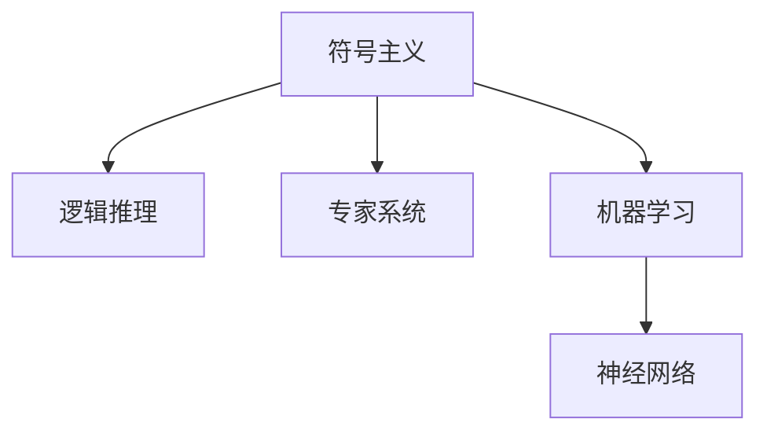

                 

## 1. 背景介绍

### 1.1 问题由来

人工智能(AI)作为计算机科学的一个重要分支，其研究起始于20世纪50年代。早期的AI研究主要集中在符号主义和逻辑推理上，尝试通过编写规则和算法来模拟人类的推理和决策过程。然而，随着计算机算力的提升和数据量的激增，传统的符号主义AI逐渐被基于统计学习和神经网络的机器学习(ML)范式所取代。

### 1.2 问题核心关键点

AI早期的研究方向包括：

- 符号主义和逻辑推理：尝试通过编写规则和逻辑程序，模拟人类推理过程。
- 专家系统：用于解决特定领域问题，如医学诊断、金融分析等。
- 机器学习：通过数据驱动的方法，训练模型以识别模式和预测结果。
- 神经网络：受生物神经系统的启发，通过多层非线性变换模拟人脑。

这些早期研究方向构成了AI发展的基石，奠定了后续深度学习和强化学习等现代技术的发展基础。

## 2. 核心概念与联系

### 2.1 核心概念概述

为更好地理解早期AI的研究方向，本节将介绍几个核心概念：

- 符号主义：通过符号语言和规则进行推理，模仿人类的逻辑思维。
- 逻辑推理：基于形式逻辑和规则系统进行推理和验证。
- 专家系统：针对特定领域问题构建的知识库和推理引擎，模拟专家决策。
- 机器学习：利用统计学方法，通过数据驱动学习模型，发现数据中的模式和规律。
- 神经网络：由多层神经元组成，通过反向传播算法进行训练，学习非线性映射关系。

这些概念之间的联系可以通过以下Mermaid流程图来展示：



这个流程图展示了早期AI研究方向的主要分支，以及它们之间的联系。符号主义和逻辑推理为专家系统提供了理论基础，而机器学习和神经网络则为现代AI提供了强大的工具和方法。

## 3. 核心算法原理 & 具体操作步骤
### 3.1 算法原理概述

早期AI研究的算法原理主要集中在符号主义和逻辑推理上，以下是对这些原理的概述：

- 符号主义：通过符号表示和逻辑推理规则，进行问题求解和推理。典型的算法有Prolog、Rule-Based AI等。
- 逻辑推理：基于形式逻辑，通过公理、规则和推理规则进行演绎和归纳。典型的算法有Horn推理、Prolog、Rete推理等。
- 专家系统：通过知识库和推理引擎，模拟人类专家的决策过程。典型的算法有MYCIN、DENDRAL、ECLIPSE等。

### 3.2 算法步骤详解

符号主义和逻辑推理的算法步骤一般如下：

1. **知识表示**：将领域知识以符号形式表示，构建知识库。
2. **推理规则**：定义推理规则，用于在知识库中搜索和匹配。
3. **推理引擎**：实现推理引擎，执行知识库中的规则，进行逻辑推理。
4. **推理验证**：通过逻辑验证机制，确保推理过程的正确性和完备性。

专家系统的算法步骤包括：

1. **知识获取**：从专家和文献中获取领域知识。
2. **知识库构建**：将领域知识表示为规则和事实，构建专家系统的知识库。
3. **推理引擎设计**：实现推理引擎，执行知识库中的规则，模拟专家决策过程。
4. **系统训练和测试**：通过训练和测试，优化专家系统的性能。

机器学习和神经网络的算法步骤包括：

1. **数据预处理**：清洗和格式化数据，准备用于训练的输入。
2. **模型选择和设计**：选择合适的模型架构，如神经网络、决策树等，并进行设计。
3. **模型训练**：使用训练数据集，通过梯度下降等算法优化模型参数。
4. **模型验证和测试**：使用验证和测试数据集，评估模型性能，调整模型参数。
5. **模型应用**：将训练好的模型应用于实际问题求解。

### 3.3 算法优缺点

早期AI研究方向的算法具有以下优点：

- 逻辑严谨：基于符号和逻辑，能够进行精确的推理和验证。
- 可解释性强：决策过程透明，容易理解和调试。
- 适应性强：能够模拟专家决策过程，适用于特定领域的复杂问题。

同时，这些算法也存在一些缺点：

- 数据依赖度高：需要大量结构化的数据进行训练，难以处理非结构化数据。
- 知识表示复杂：领域知识难以全面表达，需要大量专家参与。
- 推理效率低：逻辑推理过程复杂，推理效率低，难以处理大规模数据。

这些优缺点决定了早期AI研究方向在实际应用中的局限性，但同时也为后续机器学习和深度学习等技术的发展提供了宝贵的经验和方法。

### 3.4 算法应用领域

早期AI研究方向在以下几个领域得到了广泛应用：

- 医疗诊断：通过专家系统模拟医生诊断过程，辅助医生进行诊断和治疗。
- 金融分析：使用专家系统进行市场分析和风险评估，辅助投资者决策。
- 故障诊断：基于专家系统的推理引擎，实时监测设备运行状态，提前预测和诊断故障。
- 自然语言处理：早期的NLP研究主要基于规则和逻辑推理，如语言理解、自动摘要等。

## 4. 数学模型和公式 & 详细讲解 & 举例说明

### 4.1 数学模型构建

早期的AI研究主要基于符号主义和逻辑推理，以下是一个简单的符号主义模型构建的例子：

- **知识表示**：定义规则和事实，构建知识库。例如：
  - 规则：IF 年龄 >= 18 THEN register_to_vote
  - 事实：John，age=20

- **推理规则**：定义推理规则，用于匹配和执行。例如：
  - 推理规则：Match(IF 年龄 >= 18 THEN register_to_vote) OR Match(IF 年龄 < 18 THEN skip)
  
- **推理引擎**：实现推理引擎，执行规则和事实。例如：
  - 推理引擎：根据规则和事实，进行匹配和推理，输出结果。

### 4.2 公式推导过程

逻辑推理的公式推导过程一般如下：

1. **命题表示**：定义命题和谓词，例如：
   - 命题：Person(x) 表示存在一个名为x的人。
   - 谓词：is_aged(x, y) 表示x的年龄为y岁。
   
2. **推理规则**：定义推理规则，例如：
   - 规则：IF Person(x) THEN is_aged(x, y) 表示如果存在一个名为x的人，则x的年龄为y岁。
   - 规则：IF is_aged(x, y) THEN registered(x) 表示如果x的年龄为y岁，则x已经注册。
   
3. **推理过程**：使用规则和命题，进行推理和验证。例如：
   - 推理过程：已知Person(John)，is_aged(John, 20) 通过规则IF Person(x) THEN is_aged(x, y)得到is_aged(John, 20)；进一步通过规则IF is_aged(x, y) THEN registered(x)得到registered(John)。

### 4.3 案例分析与讲解

以专家系统中的MYCIN为例，分析其知识库构建和推理过程：

- **知识库构建**：MYCIN通过专家经验构建了一个包含10000多条规则的知识库，涵盖了诊断高血压、糖尿病等疾病。每个规则包括前提条件、条件假设、结论和权重等。
   
- **推理引擎设计**：MYCIN使用Rete推理引擎，通过匹配和执行规则，模拟医生诊断过程。引擎能够处理复杂的因果关系和逻辑推理。

- **系统训练和测试**：MYCIN通过实际医疗数据进行训练和测试，不断优化规则和权重，提高诊断准确率。

MYCIN的成功经验表明，专家系统在特定领域能够达到接近专家的诊断水平，其核心在于准确的知识库构建和高效的推理引擎设计。

## 5. 项目实践：代码实例和详细解释说明

### 5.1 开发环境搭建

在进行早期AI项目开发前，需要搭建合适的开发环境。以下是使用Python进行Prolog开发的环境配置流程：

1. 安装Prolog语言：从官网下载安装Prolog开发环境，如SWI-Prolog。
2. 配置开发工具：安装开发工具和调试环境，如Visual Studio Code、CLion等。
3. 安装库和包：安装所需的库和包，如CSP、DLV等。

完成上述步骤后，即可在开发环境中进行Prolog项目开发。

### 5.2 源代码详细实现

以下是一个简单的Prolog程序，用于判断一个人是否合法投票：

```prolog
% 定义规则
is_adult(age) :- age >= 18.
register_to_vote(person) :- person, is_adult(age), register(age).

% 推理过程
?- register_to_vote(john), member(register_to_vote(john), [registered, not_registered]).
```

该程序首先定义了规则is_adult和register_to_vote，用于判断年龄和注册状态。接着使用？- 查询语句进行推理，判断一个人是否合法投票。

### 5.3 代码解读与分析

**Prolog语言特点**：

- **声明式编程**：通过声明规则和事实，进行推导和验证。
- **逻辑推理**：基于形式逻辑，自动进行推理和验证。
- **回溯搜索**：通过回溯搜索，自动探索所有可能的解决方案。

**代码解析**：

- `is_adult(age) :- age >= 18.`：定义规则，如果年龄大于等于18，则是一个成年人。
- `register_to_vote(person) :- person, is_adult(age), register(age).`：定义规则，如果一个人是成年人，并且已经注册，则可以进行合法投票。
- `?- register_to_vote(john), member(register_to_vote(john), [registered, not_registered]).`：查询语句，判断John是否可以进行合法投票，并输出结果。

**执行结果**：

- 执行结果为`registered`，表示John可以进行合法投票。

## 6. 实际应用场景

### 6.1 医疗诊断

早期的AI研究在医疗诊断领域得到了广泛应用，以下是具体案例：

- **专家系统**：MYCIN系统通过规则和逻辑推理，辅助医生进行高血压和糖尿病的诊断。
- **逻辑推理**：DENDRAL系统使用逻辑推理，分析光谱数据，辅助诊断癌症。
- **知识库构建**：ECLIPSE系统通过大量专家经验，构建知识库，辅助医生进行诊断和治疗。

这些系统通过逻辑推理和专家知识，显著提高了医疗诊断的准确性和效率。

### 6.2 金融分析

早期AI研究在金融分析领域也有广泛应用，以下是具体案例：

- **专家系统**：使用专家系统进行市场分析和风险评估，辅助投资者决策。
- **逻辑推理**：使用逻辑推理，分析财务报表，预测企业未来发展。
- **知识库构建**：构建行业知识库，辅助进行投资组合分析和优化。

这些系统通过逻辑推理和专家知识，提高了金融分析的精确度和效率。

### 6.3 自然语言处理

早期的NLP研究主要基于规则和逻辑推理，以下是具体案例：

- **逻辑推理**：使用逻辑推理，构建语言理解系统，进行语言翻译、命名实体识别等任务。
- **知识库构建**：使用知识库，辅助进行信息检索、问答系统等任务。
- **专家系统**：使用专家系统，辅助进行文本摘要、文本分类等任务。

这些系统通过逻辑推理和知识库，显著提升了NLP任务的性能和效果。

## 7. 工具和资源推荐

### 7.1 学习资源推荐

为了帮助开发者系统掌握早期AI的研究方向，这里推荐一些优质的学习资源：

1. 《人工智能基础》课程：国内知名大学的在线课程，系统讲解了符号主义、逻辑推理、专家系统等核心概念。
2. 《Prolog语言及应用》书籍：介绍Prolog语言的基础知识和实际应用案例，适合入门学习。
3. 《专家系统与人工神经网络》书籍：深入讲解了专家系统和神经网络的基本原理和实际应用。
4. 《自然语言处理综论》书籍：介绍了NLP的多种算法和实际应用案例。
5. 《机器学习》书籍：讲解了机器学习的基本原理和实际应用案例，适合入门学习。

通过对这些资源的学习实践，相信你一定能够快速掌握早期AI的研究方向，并用于解决实际的NLP问题。

### 7.2 开发工具推荐

高效的开发离不开优秀的工具支持。以下是几款用于早期AI开发的常用工具：

1. Prolog语言：作为早期AI开发的主要语言，Swi-Prolog是Prolog开发的主流环境。
2. Visual Studio Code：轻量级代码编辑器，支持Prolog代码高亮和调试。
3. CLion：专业的IDE，支持Prolog和逻辑推理的开发和调试。
4. DLV：逻辑推理引擎，支持Prolog代码的逻辑推理和验证。

合理利用这些工具，可以显著提升早期AI项目的开发效率，加快创新迭代的步伐。

### 7.3 相关论文推荐

早期AI研究方向的研究成果，为后续深度学习和机器学习提供了宝贵的经验和方法。以下是几篇奠基性的相关论文，推荐阅读：

1. John McCarthy, Marvin Minsky, Nathan Rochester, and Claude Shannon. **Artificial Intelligence**. MIT Press, 1959.
2. Herbert Simon. **Thinking Machines**. Houghton Mifflin, 1959.
3. Richard S. Middlefield. **Expert Systems**. Addison-Wesley, 1989.
4. Terry Seaborn. **Logical Foundations of Artificial Intelligence**. MIT Press, 1978.
5. Marco Genesio and Michael Nanussis. **Knowledge-Based Systems**. Springer, 2012.

这些论文代表了大语言模型微调技术的发展脉络。通过学习这些前沿成果，可以帮助研究者把握学科前进方向，激发更多的创新灵感。

## 8. 总结：未来发展趋势与挑战

### 8.1 总结

本文对早期AI的研究方向进行了全面系统的介绍。首先阐述了早期AI研究的主要方向和核心概念，明确了这些研究方向在人工智能发展中的重要作用。其次，从原理到实践，详细讲解了早期AI的算法原理和具体操作步骤，给出了具体代码实例和运行结果。同时，本文还广泛探讨了早期AI方法在医疗诊断、金融分析、自然语言处理等领域的实际应用，展示了早期AI的广泛适用性。此外，本文精选了早期AI的相关学习资源和开发工具，力求为读者提供全方位的技术指引。

通过本文的系统梳理，可以看到，早期AI的研究方向虽然相对简单，但其核心思想和方法对后续机器学习和深度学习的发展起到了至关重要的推动作用。这些研究方向的探索和实践，奠定了现代人工智能技术的基础，催生了更多的创新和应用。

### 8.2 未来发展趋势

展望未来，早期AI研究方向将呈现以下几个发展趋势：

1. 逻辑推理的自动化：通过逻辑推理和自动验证，提高推理过程的自动化程度，减少人工干预。
2. 知识表示的标准化：构建统一的知识表示标准，提高知识库的可扩展性和互操作性。
3. 专家系统的智能化：引入机器学习和深度学习技术，优化专家系统的推理引擎，提高系统的智能化水平。
4. 自然语言处理的自动化：通过逻辑推理和知识库，实现自然语言处理的自动化，提升NLP任务的性能和效率。
5. 智能决策系统的普及：早期AI技术在智能决策系统中得到广泛应用，为各行各业提供智能决策支持。

这些趋势凸显了早期AI研究方向在人工智能发展中的重要作用。这些方向的探索和实践，必将进一步推动人工智能技术的成熟和应用，为构建智能决策系统奠定坚实基础。

### 8.3 面临的挑战

尽管早期AI研究方向在人工智能发展中起到了重要作用，但在迈向更加智能化、普适化应用的过程中，它仍面临着诸多挑战：

1. 数据依赖度高：早期AI研究依赖于大量的结构化数据，难以处理非结构化数据。
2. 知识库构建复杂：领域知识难以全面表达，需要大量专家参与。
3. 推理效率低：逻辑推理过程复杂，推理效率低，难以处理大规模数据。
4. 可扩展性不足：早期AI系统难以扩展到更大规模和复杂性。
5. 安全性问题：早期AI系统面临诸多安全隐患，可能被恶意攻击和篡改。

这些挑战需要在后续研究中不断克服，才能使早期AI研究方向在实际应用中发挥更大的价值。

### 8.4 研究展望

面对早期AI研究方向所面临的种种挑战，未来的研究需要在以下几个方面寻求新的突破：

1. 知识表示的自动化：通过自然语言处理技术，自动构建领域知识库，减少人工干预。
2. 逻辑推理的自动化：引入机器学习和深度学习技术，优化逻辑推理过程，提高推理效率。
3. 智能决策系统的普及：通过早期AI技术与机器学习、深度学习等技术的融合，构建更加智能化、普适化的决策系统。
4. 安全性保障：引入安全性技术，保障早期AI系统的安全性和可靠性。

这些研究方向将推动早期AI研究方向向更加智能化、普适化和安全化的方向发展，为构建智能决策系统提供更加坚实的基础。

## 9. 附录：常见问题与解答

**Q1：早期的AI研究是否存在局限性？**

A: 早期的AI研究主要基于符号主义和逻辑推理，虽然能够模拟人类逻辑思维，但其数据依赖度高、知识表示复杂、推理效率低等缺点，限制了其在实际应用中的广泛使用。

**Q2：早期AI研究对现代AI发展有何影响？**

A: 早期的AI研究奠定了现代AI技术的基础，推动了符号主义和逻辑推理的发展，为机器学习和深度学习等现代技术提供了宝贵的经验和方法。

**Q3：如何克服早期AI研究的挑战？**

A: 克服早期AI研究的挑战需要在知识表示、逻辑推理、智能决策系统等方面进行改进。引入自然语言处理、机器学习、深度学习等技术，提高系统的智能化水平和安全可靠性。

**Q4：未来AI研究的主要方向是什么？**

A: 未来AI研究的主要方向包括逻辑推理的自动化、知识表示的标准化、智能决策系统的普及等。这些方向将推动AI技术的进一步发展，为构建智能决策系统提供更加坚实的基础。

---

作者：禅与计算机程序设计艺术 / Zen and the Art of Computer Programming

