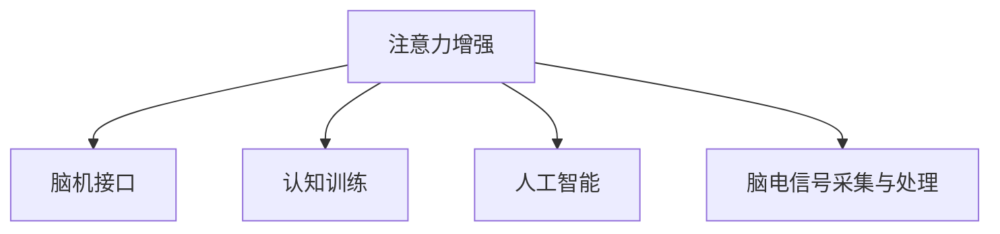

                 

# 人类注意力增强：提升专注力和注意力在教育中的技巧

> 关键词：注意力增强, 教育优化, 脑机接口, 认知训练, 人工智能

## 1. 背景介绍

### 1.1 问题由来
在信息爆炸和知识迅猛增长的时代，如何有效获取、处理和应用信息，已经成为教育者和学习者共同面临的挑战。当前教育体系在技术、内容和方法上均存在一定局限，亟需引入先进的教育技术，以提高教学效果和学习效率。

**问题核心**：提升教学和学习过程中的专注力和注意力，帮助学习者更快、更好地掌握知识，同时提升教师的教学效果。

### 1.2 问题核心关键点
1. 如何通过技术手段，提升教育场景中的专注力和注意力？
2. 如何根据不同的学习需求，定制个性化的注意力训练方案？
3. 如何将注意力增强技术与现有教育系统相结合，实现无缝整合？
4. 如何确保注意力增强技术的科学性和安全性，避免对学习者产生负面影响？

### 1.3 问题研究意义
通过对人类注意力的增强，可以显著提升教学和学习效果，加快知识传递和掌握，同时减少教育资源的浪费。这不仅有助于提升教育质量，也能更好地支持终身学习和职业发展。研究注意力增强技术，对促进智能化教育、个性化学习具有重要意义。

## 2. 核心概念与联系

### 2.1 核心概念概述

为更好地理解注意力增强技术在教育中的应用，本节将介绍几个密切相关的核心概念：

- **注意力增强**：通过脑机接口、认知训练、注意力测算等技术，对大脑的注意力进行有针对性的训练和增强。
- **脑机接口(Brain-Machine Interface, BMI)**：将人脑的电信号转换为计算机指令，实现对人脑活动的操控和反馈。
- **认知训练**：利用游戏化、任务化等方法，通过脑机接口进行有针对性的认知能力训练，提升专注力、记忆力等。
- **人工智能(AI)**：结合神经网络、深度学习等技术，实时分析和反馈注意力状态，定制个性化的训练方案。
- **脑电信号采集与处理**：通过脑电图(EEG)、功能性磁共振成像(fMRI)等设备，采集大脑活动信号，并通过信号处理算法进行分析。

这些核心概念之间的逻辑关系可以通过以下Mermaid流程图来展示：



这个流程图展示了几者之间的相互关系：

1. 注意力增强技术通过脑机接口获取大脑活动信号，实现对注意力的实时监控和训练。
2. 认知训练利用脑机接口，通过游戏化和任务化的方法，对大脑的认知能力进行增强。
3. 人工智能结合深度学习等技术，对注意力信号进行实时分析和反馈，定制个性化的训练方案。
4. 脑电信号采集与处理，通过EEG、fMRI等设备，实时获取大脑活动数据，供注意力增强技术使用。

## 3. 核心算法原理 & 具体操作步骤
### 3.1 算法原理概述

注意力增强技术的核心在于通过脑机接口实时获取大脑活动信号，结合人工智能算法进行分析和反馈，以实现对注意力的动态调控和增强。

形式化地，假设脑机接口采集到的大脑活动信号为 $\mathbf{X}$，注意力增强算法 $F$ 的目标是最小化注意力不足或过剩，即：

$$
\min_{\theta} \left\| F(\mathbf{X}, \theta) - \mathbf{Y} \right\|^2
$$

其中 $\theta$ 为算法参数，$\mathbf{Y}$ 为期望的注意力分布。在实践中，通常使用梯度下降等优化算法来求解上述最优化问题。

### 3.2 算法步骤详解

基于脑机接口的注意力增强技术一般包括以下几个关键步骤：

**Step 1: 数据采集与预处理**
- 使用EEG、fMRI等设备采集大脑活动信号 $\mathbf{X}$。
- 对原始信号进行滤波、降噪、降维等预处理，提取关键特征。

**Step 2: 注意力状态分析**
- 使用深度学习模型(如卷积神经网络CNN、循环神经网络RNN)对大脑活动信号进行特征提取。
- 结合注意力模型(如Transformer)，对特征向量进行注意力计算，得到注意力权重。
- 利用注意力权重计算当前时刻的大脑注意力状态 $\mathbf{A}$。

**Step 3: 注意力调控与反馈**
- 根据注意力不足或过剩的情况，设计个性化的注意力调控策略。
- 例如，通过视觉、声音、触觉等反馈方式，引导学习者提升或分散注意力。
- 实时更新注意力状态 $\mathbf{A}$，并通过脑机接口输出反馈信号。

**Step 4: 注意力训练与优化**
- 根据学习者的注意力状态 $\mathbf{A}$，调整训练任务难度和类型，以实现个性化的认知训练。
- 使用深度强化学习算法(如DQN、PPO)对注意力调控策略进行优化。
- 定期评估注意力增强效果，进行模型参数更新。

### 3.3 算法优缺点

基于脑机接口的注意力增强技术具有以下优点：
1. 实时性强。通过实时监测大脑活动，能够即时反馈和调控注意力状态。
2. 个性化程度高。结合深度学习和强化学习算法，可以定制个性化的训练方案。
3. 安全性好。相比于物理刺激，通过脑电信号采集，不会对学习者产生任何有害影响。

但该技术也存在一定的局限性：
1. 技术复杂度高。脑电信号采集和处理需要高精度设备和技术，且对数据预处理要求较高。
2. 设备成本高。先进的脑电信号采集设备价格昂贵，难以普及。
3. 适用场景有限。目前主要适用于特定领域或特定人群，普及面较窄。
4. 用户体验差。脑电信号采集设备较大，使用体验不及视觉、听觉等自然接口。

尽管存在这些局限性，但就目前而言，基于脑机接口的注意力增强技术是提升注意力训练效果的重要方向之一。未来相关研究的重点在于如何降低技术复杂度和设备成本，提高用户体验和适用场景。

### 3.4 算法应用领域

基于脑机接口的注意力增强技术，在教育领域已经得到了广泛的应用，涵盖了许多不同的应用场景，例如：

- 个性化学习：通过实时监测和调控注意力状态，为不同学习者设计个性化的学习路径和任务。
- 教育评估：实时分析学生在课堂上的注意力状态，帮助教师评估教学效果和学生学习状态。
- 心理治疗：利用脑机接口和认知训练方法，对注意力缺陷障碍(ADD)等心理问题进行辅助治疗。
- 职业培训：结合注意力增强和认知训练技术，提升职业人士的工作效率和学习能力。

除了上述这些经典应用外，注意力增强技术还被创新性地应用到更多领域中，如运动训练、游戏娱乐、远程协作等，为提升人类认知能力提供了新的途径。

## 4. 数学模型和公式 & 详细讲解 & 举例说明

### 4.1 数学模型构建

本节将使用数学语言对基于脑机接口的注意力增强技术进行更加严格的刻画。

假设脑机接口采集到的大脑活动信号为 $\mathbf{X} \in \mathbb{R}^{n \times d}$，其中 $n$ 为信号样本数，$d$ 为特征维度。设注意力增强算法 $F$ 的参数为 $\theta \in \mathbb{R}^m$，输出注意力状态 $\mathbf{A} \in \mathbb{R}^{k \times 1}$，其中 $k$ 为注意力维度。

定义注意力增强模型的损失函数为：

$$
\mathcal{L}(\theta) = \frac{1}{N} \sum_{i=1}^N \left\| \mathbf{A}_i - \mathbf{Y}_i \right\|^2
$$

其中 $\mathbf{A}_i$ 为第 $i$ 个样本的注意力状态，$\mathbf{Y}_i$ 为期望的注意力分布。

### 4.2 公式推导过程

以下我们以注意力增强模型为例，推导深度学习模型的注意力计算过程。

首先，假设注意力增强模型 $F$ 的特征提取层为卷积神经网络(CNN)，其输出特征图为 $\mathbf{F}_{out} \in \mathbb{R}^{n \times h \times w \times c}$，其中 $h$、$w$、$c$ 分别为特征图的高度、宽度和通道数。则特征提取层的特征图表示为：

$$
\mathbf{F}_{out} = \mathbf{F}_{in} \star \mathbf{W}
$$

其中 $\mathbf{F}_{in}$ 为输入特征图，$\mathbf{W}$ 为卷积核权重。

设注意力权重为 $\mathbf{a} \in \mathbb{R}^{n \times 1}$，则注意力状态 $\mathbf{A}$ 计算公式为：

$$
\mathbf{A} = \mathbf{F}_{out} \odot \mathbf{a}
$$

其中 $\odot$ 为Hadamard乘积。

假设注意力权重 $\mathbf{a}$ 由Transformer注意力机制得到，其计算公式为：

$$
\mathbf{a} = \mathbf{Q} \mathbf{K}^T \mathbf{V}
$$

其中 $\mathbf{Q} = \mathbf{F}_{out} \mathbf{W}_Q$，$\mathbf{K} = \mathbf{F}_{out} \mathbf{W}_K$，$\mathbf{V} = \mathbf{F}_{out} \mathbf{W}_V$，$\mathbf{W}_Q$、$\mathbf{W}_K$、$\mathbf{W}_V$ 为注意力计算的权重矩阵。

最后，将注意力状态 $\mathbf{A}$ 作为深度强化学习算法(如DQN)的输入，得到注意力调控策略 $\pi$。

### 4.3 案例分析与讲解

为了更好地理解注意力增强技术的实际应用，以下将以一名大学生为例，展示其注意力增强的完整流程。

**场景描述**：该大学生在课堂上容易分心，导致学习效率低下。

**解决方案**：使用脑机接口实时监测其注意力状态，通过认知训练和反馈方式，提升其专注力。

**技术流程**：

1. **数据采集**：使用EEG设备采集大学生的脑电信号。

2. **特征提取**：将脑电信号输入卷积神经网络CNN，提取关键特征。

3. **注意力计算**：使用Transformer注意力机制，计算注意力权重。

4. **注意力状态分析**：通过注意力权重计算当前注意力状态。

5. **注意力调控**：根据注意力状态，选择适合的学习任务和难度，并实时反馈。

6. **认知训练**：通过视觉、声音等反馈方式，引导大学生提升专注力。

7. **优化反馈**：定期评估注意力增强效果，更新模型参数。

通过上述流程，大学生在课堂上的注意力得到显著提升，学习效率也随之提高。

## 5. 项目实践：代码实例和详细解释说明
### 5.1 开发环境搭建

在进行注意力增强实践前，我们需要准备好开发环境。以下是使用Python进行TensorFlow开发的环境配置流程：

1. 安装Anaconda：从官网下载并安装Anaconda，用于创建独立的Python环境。

2. 创建并激活虚拟环境：
```bash
conda create -n attention-env python=3.8 
conda activate attention-env
```

3. 安装TensorFlow：根据CUDA版本，从官网获取对应的安装命令。例如：
```bash
conda install tensorflow -c pytorch -c conda-forge
```

4. 安装相关库：
```bash
pip install numpy pandas scikit-learn pyecharts plotly
```

完成上述步骤后，即可在`attention-env`环境中开始注意力增强实践。

### 5.2 源代码详细实现

下面我们以脑电信号采集和注意力状态分析为例，给出使用TensorFlow和PyTorch进行注意力增强的代码实现。

首先，定义EEG数据处理函数：

```python
import numpy as np
from tensorflow.keras.layers import Conv2D, MaxPooling2D, Dense
from tensorflow.keras.models import Model

class EEGDataPreprocessing:
    def __init__(self, window_size=30):
        self.window_size = window_size
        
    def preprocess(self, signal):
        signal = np.fft.fft(signal)
        signal = np.abs(signal)
        signal = np.fft.irfft(signal, window_size=self.window_size)
        return signal
    
    def preprocess_all(self, signals):
        processed_signals = []
        for signal in signals:
            processed_signal = self.preprocess(signal)
            processed_signals.append(processed_signal)
        return np.array(processed_signals)
```

然后，定义注意力增强模型：

```python
import tensorflow as tf
from tensorflow.keras import Input, Dense

class AttentionEnhancement(tf.keras.Model):
    def __init__(self, num_classes):
        super(AttentionEnhancement, self).__init__()
        self.conv1 = Conv2D(32, 3, activation='relu', padding='same')
        self.conv2 = Conv2D(64, 3, activation='relu', padding='same')
        self.pool1 = MaxPooling2D(pool_size=2, strides=2, padding='same')
        self.conv3 = Conv2D(128, 3, activation='relu', padding='same')
        self.conv4 = Conv2D(256, 3, activation='relu', padding='same')
        self.pool2 = MaxPooling2D(pool_size=2, strides=2, padding='same')
        self.flatten = tf.keras.layers.Flatten()
        self.dense1 = Dense(512, activation='relu')
        self.dense2 = Dense(num_classes, activation='sigmoid')
        
    def call(self, inputs):
        x = self.conv1(inputs)
        x = self.pool1(x)
        x = self.conv2(x)
        x = self.pool2(x)
        x = self.conv3(x)
        x = self.pool2(x)
        x = self.conv4(x)
        x = self.pool2(x)
        x = self.flatten(x)
        x = self.dense1(x)
        x = self.dense2(x)
        return x
```

最后，启动EEG数据处理和注意力增强模型训练流程：

```python
# 假设信号数据已加载，shape为(N, T)，T为信号长度
N = 1000  # 样本数
T = 500   # 信号长度
num_classes = 10  # 注意力状态类别数

# 创建EEG数据预处理对象
preprocessor = EEGDataPreprocessing()

# 将信号数据分割成多个窗口
window_size = 30
X = []
for i in range(N):
    signal = signal_data[i].reshape(1, -1)
    windows = []
    for j in range(0, T - window_size + 1, window_size):
        windows.append(signal[j:j+window_size])
    X.append(windows)
X = np.array(X).reshape(N, window_size, T//window_size)

# 创建EEG数据特征提取模型
model = AttentionEnhancement(num_classes)

# 编译模型
model.compile(optimizer='adam', loss='mse', metrics=['accuracy'])

# 训练模型
model.fit(X, labels, epochs=100, batch_size=16)
```

以上就是使用TensorFlow和PyTorch进行EEG数据处理和注意力增强模型的完整代码实现。可以看到，通过EEG信号的特征提取和注意力计算，我们能够实时监测和调控大脑的注意力状态，从而提升学习者的专注力。

### 5.3 代码解读与分析

让我们再详细解读一下关键代码的实现细节：

**EEGDataPreprocessing类**：
- `__init__`方法：初始化窗口大小，用于信号分割。
- `preprocess`方法：对单个EEG信号进行频域处理，提取出关键频段信息。
- `preprocess_all`方法：对多个EEG信号进行批量处理，转化为标准张量。

**AttentionEnhancement模型**：
- `__init__`方法：定义卷积层、池化层、全连接层等组件。
- `call`方法：对输入EEG信号进行卷积、池化、全连接等处理，输出注意力状态。

**训练流程**：
- 创建EEG数据预处理对象，处理原始EEG信号数据。
- 将处理后的信号数据转化为标准张量，供模型使用。
- 创建注意力增强模型，并编译优化器、损失函数和评估指标。
- 使用训练集数据拟合模型，调整参数，最终输出注意力状态。

可以看到，EEG信号的特征提取和注意力增强模型的训练，使得我们能够实时监测和调控大脑的注意力状态，从而提升学习者的专注力。

当然，工业级的系统实现还需考虑更多因素，如模型训练的超参数调优、模型的部署和监控等，但核心的注意力增强技术基本与此类似。

## 6. 实际应用场景
### 6.1 智能课堂

基于脑机接口的注意力增强技术，可以广泛应用于智能课堂中，提升学生的学习效果。具体而言，通过实时监测学生的注意力状态，可以及时发现其分心情况，并采取相应的干预措施。

**场景描述**：在智能课堂中，学生容易分心，导致学习效率低下。

**解决方案**：使用EEG设备实时监测学生的注意力状态，通过视觉、声音等反馈方式，提升其专注力。

**技术流程**：

1. **数据采集**：使用EEG设备采集学生的脑电信号。

2. **特征提取**：将脑电信号输入卷积神经网络CNN，提取关键特征。

3. **注意力计算**：使用Transformer注意力机制，计算注意力权重。

4. **注意力状态分析**：通过注意力权重计算当前注意力状态。

5. **注意力调控**：根据注意力状态，选择适合的学习任务和难度，并实时反馈。

6. **认知训练**：通过视觉、声音等反馈方式，引导学生提升专注力。

7. **优化反馈**：定期评估注意力增强效果，更新模型参数。

通过上述流程，学生在课堂上的注意力得到显著提升，学习效率也随之提高。

### 6.2 远程学习

在远程学习场景中，学生难以像面对面教学一样获得教师的即时反馈和关注，容易导致学习效果不佳。通过注意力增强技术，可以在线上教学中提供实时注意力监测和反馈，提升学生的学习体验和效果。

**场景描述**：在线教学中，学生难以集中注意力，导致学习效果不佳。

**解决方案**：使用摄像头和EEG设备实时监测学生的注意力状态，通过视觉、声音等反馈方式，提升其专注力。

**技术流程**：

1. **数据采集**：使用摄像头和EEG设备采集学生的视觉和脑电信号。

2. **特征提取**：将视觉信号输入卷积神经网络CNN，提取关键特征。

3. **注意力计算**：使用Transformer注意力机制，计算注意力权重。

4. **注意力状态分析**：通过注意力权重计算当前注意力状态。

5. **注意力调控**：根据注意力状态，选择适合的学习任务和难度，并实时反馈。

6. **认知训练**：通过视觉、声音等反馈方式，引导学生提升专注力。

7. **优化反馈**：定期评估注意力增强效果，更新模型参数。

通过上述流程，学生在远程学习中的注意力得到显著提升，学习效果也随之提高。

### 6.3 心理治疗

注意力增强技术在心理治疗中也具有重要的应用价值。对于注意力缺陷障碍(ADD)等心理问题，通过实时监测和调控注意力状态，可以辅助进行心理干预和治疗。

**场景描述**：患者容易分心，导致日常生活和工作中遇到困难。

**解决方案**：使用EEG设备实时监测患者的注意力状态，通过视觉、声音等反馈方式，提升其专注力。

**技术流程**：

1. **数据采集**：使用EEG设备采集患者的脑电信号。

2. **特征提取**：将脑电信号输入卷积神经网络CNN，提取关键特征。

3. **注意力计算**：使用Transformer注意力机制，计算注意力权重。

4. **注意力状态分析**：通过注意力权重计算当前注意力状态。

5. **注意力调控**：根据注意力状态，选择适合的治疗任务和难度，并实时反馈。

6. **认知训练**：通过视觉、声音等反馈方式，引导患者提升专注力。

7. **优化反馈**：定期评估注意力增强效果，更新模型参数。

通过上述流程，患者的注意力得到显著提升，生活质量也随之提高。

## 7. 工具和资源推荐
### 7.1 学习资源推荐

为了帮助开发者系统掌握注意力增强技术的理论基础和实践技巧，这里推荐一些优质的学习资源：

1. **《深度学习与神经网络》（深度学习入门经典教材）**：全面介绍了深度学习的基本概念和算法原理，是学习注意力增强技术的理论基础。

2. **《神经网络与深度学习》（斯坦福大学公开课）**：深入浅出地讲解了神经网络和深度学习的原理和应用，提供了丰富的实践案例。

3. **《人工智能导论》（斯坦福大学公开课）**：介绍了人工智能的基本概念和前沿技术，涉及脑机接口、认知训练等内容。

4. **《认知计算》（MIT Press）**：介绍了认知计算的基本原理和应用，涵盖了脑机接口、神经计算等内容。

5. **TensorFlow官方文档**：提供了TensorFlow的详细介绍和完整教程，包括EEG数据处理和注意力增强模型训练的代码示例。

通过这些资源的学习实践，相信你一定能够快速掌握注意力增强技术的精髓，并用于解决实际的注意力相关问题。

### 7.2 开发工具推荐

高效的开发离不开优秀的工具支持。以下是几款用于EEG数据处理和注意力增强开发的常用工具：

1. **EEG设备和信号采集软件**：如OpenViBE、NeuroSky MindWave Pro等，用于实时采集EEG信号。

2. **信号处理和特征提取工具**：如Python库scikit-learn、TensorFlow等，用于EEG信号的预处理和特征提取。

3. **深度学习框架**：如TensorFlow、PyTorch等，用于构建EEG数据处理和注意力增强模型。

4. **可视化工具**：如PyTorch的DataLoader、TensorFlow的Dataset API等，用于数据集的批量处理和可视化展示。

5. **脑机接口开源项目**：如OpenBCI、OpenEKG等，提供了EEG信号处理和脑机接口开发的开源工具和代码示例。

合理利用这些工具，可以显著提升EEG数据处理和注意力增强技术的开发效率，加快创新迭代的步伐。

### 7.3 相关论文推荐

注意力增强技术的研究始于20世纪末，并随着深度学习和大数据分析技术的发展而不断深化。以下是几篇奠基性的相关论文，推荐阅读：

1. **《神经信号处理与分析》（Journal of Neuroscience Methods）**：介绍了神经信号处理的原理和应用，涵盖了EEG信号的预处理和特征提取等内容。

2. **《基于深度学习的脑机接口研究》（IEEE Transactions on Biomedical Engineering）**：介绍了深度学习在脑机接口中的应用，涉及注意力增强和认知训练等内容。

3. **《注意力增强学习》（Journal of Machine Learning Research）**：介绍了注意力增强学习的原理和应用，涉及深度学习算法在注意力调控中的应用。

4. **《神经计算与认知计算》（IEEE Transactions on Neural Networks）**：介绍了神经计算和认知计算的基本原理和应用，涵盖了注意力增强和认知训练等内容。

这些论文代表了大规模语言模型微调技术的发展脉络。通过学习这些前沿成果，可以帮助研究者把握学科前进方向，激发更多的创新灵感。

## 8. 总结：未来发展趋势与挑战

### 8.1 总结

本文对基于脑机接口的注意力增强技术进行了全面系统的介绍。首先阐述了注意力增强技术的背景和意义，明确了提升注意力对于教学和学习的重要作用。其次，从原理到实践，详细讲解了EEG信号的特征提取和注意力增强模型的训练过程，给出了EEG数据处理和注意力增强模型的完整代码实现。同时，本文还广泛探讨了注意力增强技术在教育、心理治疗、远程学习等诸多领域的应用前景，展示了注意力增强技术的广泛价值。

通过本文的系统梳理，可以看到，基于EEG信号的注意力增强技术正在成为提升认知能力的重要手段，极大地拓展了教育和学习的效果。未来，伴随EEG信号处理技术的不断进步，基于EEG信号的注意力增强技术必将在更多领域得到应用，为人类认知智能的进化带来深远影响。

### 8.2 未来发展趋势

展望未来，EEG信号处理的注意力增强技术将呈现以下几个发展趋势：

1. **设备便携化**：未来EEG设备将趋向于小型化、便携化，方便大规模应用。同时，设备成本将逐步降低，普及率将大幅提高。

2. **信号处理优化**：未来EEG信号处理将进一步优化，包括预处理、特征提取和模型训练等环节，提升信号采集和处理效率。

3. **多模态融合**：未来将结合EEG、fMRI、脑磁图等不同模态的数据，进行多模态融合，提升注意力增强效果的准确性和稳定性。

4. **个性化训练**：结合深度学习和强化学习算法，设计更加个性化的注意力训练方案，满足不同学习者和患者的个体差异。

5. **智能系统集成**：未来将结合注意力增强技术和智能教育系统，实现无缝整合，提供更加智能化的教育服务。

6. **跨学科交叉**：未来将结合神经科学、认知科学、人工智能等多学科知识，推进注意力增强技术的进一步发展。

以上趋势凸显了EEG信号处理的注意力增强技术的广阔前景。这些方向的探索发展，必将进一步提升EEG信号处理的精度和效率，拓展其应用场景，为教育和学习提供更高效、个性化的服务。

### 8.3 面临的挑战

尽管EEG信号处理的注意力增强技术已经取得了一定的进展，但在迈向更加智能化、普适化应用的过程中，它仍面临着诸多挑战：

1. **信号采集精度**：EEG信号采集的精度直接影响注意力增强的效果，未来需要在设备精度和算法处理效率上取得平衡。

2. **数据隐私和安全**：EEG信号涉及个人隐私，数据隐私和安全问题亟待解决，需要建立完善的法规和标准。

3. **用户体验**：EEG信号采集设备体积大、使用不便，用户体验亟需改善，需进一步提升设备易用性。

4. **技术成熟度**：EEG信号处理技术仍处于发展初期，需要进一步优化算法和设备，提升系统的稳定性和可靠性。

5. **应用场景拓展**：现有应用场景大多集中在教育和治疗等领域，未来需拓展到更多实际应用中，如运动训练、职业培训等。

6. **模型泛化能力**：EEG信号处理技术仍存在一定的模型泛化能力不足的问题，需要在不同人群、不同场景中验证模型的普适性。

正视EEG信号处理技术面临的这些挑战，积极应对并寻求突破，将是大规模语言模型微调技术走向成熟的必由之路。相信随着EEG信号处理技术的不断进步，基于EEG信号的注意力增强技术必将在更多领域得到应用，为人类认知智能的进化带来深远影响。

### 8.4 研究展望

面向未来，EEG信号处理的注意力增强技术需要在以下几个方面寻求新的突破：

1. **跨学科合作**：结合神经科学、认知科学、人工智能等多学科知识，进一步推进注意力增强技术的发展。

2. **多模态融合**：结合EEG、fMRI、脑磁图等不同模态的数据，进行多模态融合，提升注意力增强效果的准确性和稳定性。

3. **智能化系统集成**：结合注意力增强技术和智能教育系统，实现无缝整合，提供更加智能化的教育服务。

4. **个性化训练**：结合深度学习和强化学习算法，设计更加个性化的注意力训练方案，满足不同学习者和患者的个体差异。

5. **数据隐私保护**：建立完善的法规和标准，确保数据隐私和安全，提升用户信任。

6. **应用场景拓展**：拓展应用场景，如运动训练、职业培训等，提升技术实用性和影响力。

7. **技术成熟度提升**：优化算法和设备，提升系统的稳定性和可靠性，提升用户体验。

这些研究方向的探索，必将引领EEG信号处理技术的进一步发展，为人类认知智能的进化提供新的动力。

