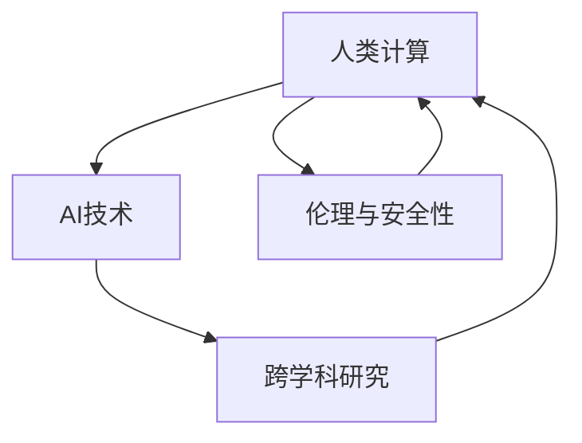

                 

## 1. 背景介绍

### 1.1 问题由来

在AI时代，我们正经历着一场人类认知能力的革命。机器不仅能在传统信息处理、数据分析等领域超越人类，还在逻辑推理、创造性思维等更高级的认知功能上展现出了前所未有的潜力。这种进步不仅改变了科技和产业的面貌，也在深刻地改变着我们的社会结构、文化价值乃至生活方式。

然而，这一进步的背后，隐藏着一个重要但常被忽视的事实：人类计算，即基于人类认知的计算能力，仍是驱动AI发展的主要动力。无论是深度学习模型的训练，还是强化学习策略的优化，甚至是知识图谱的构建，归根结底都需要人类设计算法、标注数据、编写代码等。尽管越来越多的任务可以自动化，但AI的每一次突破，都是基于人类智慧的结晶。

### 1.2 问题核心关键点

1. **人类计算的重要性**：AI的每一次进步，都是基于人类计算能力的突破。未来，人类计算将不仅是AI发展的驱动力，更是AI时代的新引擎。
2. **AI与人类计算的融合**：如何更好地利用人类计算能力和AI技术，构建更加智能、高效、可持续的计算系统，是当前及未来的一个重要研究方向。
3. **跨学科协作**：AI技术的发展需要跨学科的协作，结合心理学、认知科学、神经科学等多领域的知识，才能更好地理解和利用人类计算能力。
4. **伦理和安全性**：随着AI的进步，如何确保其在伦理和安全方面的可控性，防止其被滥用，也是人类计算研究的重要课题。

### 1.3 问题研究意义

深入研究人类计算在AI时代的作用和应用，对于推动AI技术的持续发展，构建安全、可靠、高效的智能系统具有重要意义：

1. **加速AI技术演进**：通过深入理解人类计算能力和AI技术的结合，可以加速AI技术的发展，带来更多创新突破。
2. **提升计算效率**：利用人类计算能力，可以设计出更加高效、可解释的计算模型，降低资源消耗，提升计算速度。
3. **强化系统可靠性**：通过跨学科研究，可以构建更加稳定、安全的AI系统，减少潜在的风险和失误。
4. **促进公平和包容**：确保AI技术在伦理和社会价值上的可控性，避免技术滥用，促进社会公平和包容。
5. **激发新领域应用**：基于人类计算能力的AI技术，可以开拓新的应用场景，推动社会的全面进步。

## 2. 核心概念与联系

### 2.1 核心概念概述

在探讨人类计算在AI时代的作用时，需要理解几个关键概念：

- **人类计算**：指基于人类认知的计算能力，包括逻辑推理、模式识别、情感理解等高级认知功能。
- **AI技术**：指基于机器学习、深度学习等算法构建的智能系统，能够在特定任务上模拟人类智能。
- **跨学科研究**：结合心理学、认知科学、神经科学等多个学科的知识，深入理解人类计算能力，并应用于AI技术。
- **伦理与安全性**：确保AI技术在伦理和安全方面的可控性，避免其被滥用。

这些概念之间存在紧密的联系。AI技术的进步离不开人类计算能力，而人类计算的研究和应用也需要依赖AI技术的辅助。跨学科研究不仅有助于理解人类计算，也为AI技术提供了新的研究方向。伦理和安全性的问题，则是人类计算和AI技术发展的底线和红线。

### 2.2 核心概念原理和架构的 Mermaid 流程图



### 2.3 核心概念的联系

- **A：人类计算与AI技术的联系**：人类计算能力是AI技术进步的重要驱动力，而AI技术的发展也反过来促进了人类计算的研究。
- **B：跨学科研究的重要性**：跨学科研究不仅有助于深入理解人类计算能力，也为AI技术的优化提供了新的视角和方法。
- **C：伦理与安全性的必要性**：确保AI技术的伦理和安全性是使用人类计算能力的前提，也是AI技术发展的底线。

## 3. 核心算法原理 & 具体操作步骤

### 3.1 算法原理概述

人类计算在AI时代的应用，主要体现在以下几个方面：

1. **数据标注和清洗**：AI模型需要大量标注数据进行训练，而高质量的数据标注需要人类智慧。人类计算能力在数据标注和清洗中起着关键作用。
2. **算法设计**：AI模型的设计需要深入理解人类认知和计算规律，跨学科研究可以提供有力的支持。
3. **知识图谱构建**：知识图谱是AI技术的重要基础，构建知识图谱需要大量的人工知识整合。
4. **系统优化和维护**：AI系统的优化和维护需要人类工程师的持续努力，人类计算能力在这一过程中不可或缺。

### 3.2 算法步骤详解

基于人类计算的AI应用，通常包括以下步骤：

1. **需求分析**：明确AI应用的具体目标和需求，理解人类计算在这一过程中的作用。
2. **数据收集和处理**：收集相关数据，并进行清洗、标注等预处理工作。
3. **模型设计**：结合人类计算能力，设计合适的AI模型。
4. **训练和优化**：利用AI技术进行模型训练和优化，提升性能。
5. **测试和部署**：在实际环境中测试模型，优化后部署使用。
6. **持续更新和维护**：根据实际反馈，持续更新和维护AI系统。

### 3.3 算法优缺点

人类计算在AI时代的应用具有以下优点：

1. **灵活性和适应性**：人类计算能力具有高度的灵活性和适应性，能够应对各种复杂任务。
2. **可解释性和可控性**：人类计算具有天然的解释性和可控性，可以更好地理解模型的决策过程。
3. **跨领域融合**：结合跨学科知识，可以构建更加全面、准确的AI模型。

同时，也存在一些缺点：

1. **时间和成本高**：人类计算依赖于人类智慧，需要耗费大量时间和成本。
2. **主观性和偏见**：人类计算受主观因素和偏见的影响，可能导致模型的不公正性。
3. **数据依赖性**：人类计算依赖于高质量的数据，数据不足时难以发挥作用。

### 3.4 算法应用领域

人类计算在AI时代的应用广泛，包括但不限于以下几个领域：

1. **医疗健康**：利用人类计算能力，设计智能诊断系统和个性化治疗方案。
2. **金融科技**：结合人类计算能力，设计风险评估和市场预测模型。
3. **教育科技**：开发智能教育系统和个性化学习推荐系统。
4. **智能交通**：利用人类计算能力，构建智能交通管理系统和安全预警系统。
5. **环境保护**：结合人类计算能力，构建环境监测和资源管理智能系统。

## 4. 数学模型和公式 & 详细讲解 & 举例说明

### 4.1 数学模型构建

在AI系统中，人类计算的应用可以通过数学模型来描述和优化。以下是一个简单的例子：

假设我们有一个分类任务，需要将输入数据 $x$ 分为两个类别 $y \in \{0,1\}$。一个简单的分类模型可以表示为：

$$
f(x) = \sigma(\sum_{i=1}^n w_i x_i + b)
$$

其中，$\sigma$ 为激活函数，$w_i$ 为模型参数，$b$ 为偏置项。

### 4.2 公式推导过程

将上述公式应用于数据集 $D=\{(x_i,y_i)\}_{i=1}^N$，得到经验风险：

$$
\mathcal{L}(f) = \frac{1}{N} \sum_{i=1}^N \ell(f(x_i),y_i)
$$

其中，$\ell$ 为损失函数。在分类任务中，常用的损失函数为交叉熵损失：

$$
\ell(f(x_i),y_i) = -y_i \log f(x_i) - (1-y_i) \log(1-f(x_i))
$$

### 4.3 案例分析与讲解

以医疗健康领域的应用为例，假设我们有一个医学影像分类任务，需要将CT扫描图像分为正常和异常两类。

1. **数据收集和标注**：收集大量CT扫描图像，并进行人工标注。
2. **模型设计**：设计一个卷积神经网络（CNN）模型，用于提取图像特征并进行分类。
3. **训练和优化**：利用标注数据，对模型进行训练和优化，提升分类精度。
4. **测试和部署**：在测试集上评估模型性能，优化后部署到实际医疗系统中。

通过人类计算能力，我们能够设计出合适的模型，并对数据进行有效的标注和清洗，从而实现高质量的AI应用。

## 5. 项目实践：代码实例和详细解释说明

### 5.1 开发环境搭建

为了实现基于人类计算的AI应用，我们需要搭建一个开发环境，包括数据处理、模型训练和部署等环节。以下是一个基本的开发环境搭建步骤：

1. **选择编程语言**：Python是数据科学和AI领域的主流语言，适合处理数据和构建模型。
2. **安装依赖库**：安装必要的依赖库，如NumPy、Pandas、scikit-learn、TensorFlow等。
3. **设置数据存储**：设置数据存储路径，方便数据的管理和访问。
4. **配置计算资源**：根据需要配置计算资源，包括CPU、GPU等。

### 5.2 源代码详细实现

以医疗影像分类为例，以下是一个简单的代码实现：

```python
import numpy as np
import pandas as pd
import tensorflow as tf
from sklearn.model_selection import train_test_split

# 数据读取和处理
data = pd.read_csv('medical_images.csv')
X = data.iloc[:, :-1].values
y = data.iloc[:, -1].values

# 数据分割
X_train, X_test, y_train, y_test = train_test_split(X, y, test_size=0.2, random_state=42)

# 模型构建
model = tf.keras.Sequential([
    tf.keras.layers.Conv2D(32, (3,3), activation='relu', input_shape=(28,28,1)),
    tf.keras.layers.MaxPooling2D((2,2)),
    tf.keras.layers.Flatten(),
    tf.keras.layers.Dense(10, activation='softmax')
])

# 模型训练
model.compile(optimizer='adam', loss='categorical_crossentropy', metrics=['accuracy'])
model.fit(X_train, y_train, epochs=10, batch_size=32)

# 模型评估
loss, accuracy = model.evaluate(X_test, y_test)
print('Test loss:', loss)
print('Test accuracy:', accuracy)
```

### 5.3 代码解读与分析

上述代码实现了一个简单的医疗影像分类模型。具体步骤如下：

1. **数据读取和处理**：读取医疗影像数据，并进行分割和处理。
2. **模型构建**：设计一个卷积神经网络（CNN）模型，用于提取图像特征并进行分类。
3. **模型训练**：使用标注数据对模型进行训练和优化，提升分类精度。
4. **模型评估**：在测试集上评估模型性能。

## 6. 实际应用场景

### 6.1 医疗健康

在医疗健康领域，人类计算能力的应用非常广泛，包括智能诊断、个性化治疗、医学影像分析等。

1. **智能诊断系统**：利用深度学习模型，结合医生经验，实现疾病快速诊断。
2. **个性化治疗方案**：结合患者历史数据和遗传信息，设计个性化治疗方案。
3. **医学影像分析**：利用计算机视觉技术，分析医学影像，提供病情评估和诊断建议。

### 6.2 金融科技

在金融科技领域，人类计算能力的应用可以包括风险评估、市场预测、金融安全等。

1. **风险评估模型**：利用机器学习算法，结合专家知识，进行信用风险评估。
2. **市场预测系统**：结合历史数据和市场趋势，预测股票、债券等金融产品的价格波动。
3. **金融安全预警**：结合异常检测技术，实时监控金融市场，提供安全预警。

### 6.3 教育科技

在教育科技领域，人类计算能力的应用可以包括个性化学习推荐、智能教育系统等。

1. **个性化学习推荐**：利用推荐算法，结合学生历史学习数据，提供个性化学习资源推荐。
2. **智能教育系统**：结合自然语言处理技术，构建智能教学辅助系统，提升教学效果。

## 7. 工具和资源推荐

### 7.1 学习资源推荐

1. **《深度学习》课程**：斯坦福大学Andrew Ng教授开设的深度学习课程，是入门和提升深度学习技能的重要资源。
2. **Kaggle平台**：全球最大的数据科学竞赛平台，提供大量的数据集和竞赛项目，适合实践和提高技能。
3. **Coursera平台**：提供各种数据科学和AI课程，涵盖机器学习、深度学习、自然语言处理等多个领域。
4. **TensorFlow官方文档**：TensorFlow的官方文档，提供详细的API和教程，适合学习使用TensorFlow构建AI模型。
5. **PyTorch官方文档**：PyTorch的官方文档，提供详细的API和教程，适合学习使用PyTorch构建AI模型。

### 7.2 开发工具推荐

1. **Python**：Python是数据科学和AI领域的主流语言，适合处理数据和构建模型。
2. **Jupyter Notebook**：用于编写和运行Python代码，适合开发和分享AI项目。
3. **TensorFlow**：谷歌开发的深度学习框架，适合构建复杂的AI模型。
4. **PyTorch**：Facebook开发的深度学习框架，适合构建灵活的AI模型。
5. **Scikit-learn**：Python的机器学习库，适合构建基本的机器学习模型。

### 7.3 相关论文推荐

1. **《深度学习》**：Ian Goodfellow等著，是深度学习领域的经典教材。
2. **《计算机视觉：模型、学习和推理》**：Richard Szeliski著，是计算机视觉领域的经典教材。
3. **《自然语言处理综论》**：Daniel Jurafsky和James H. Martin著，是自然语言处理领域的经典教材。
4. **《强化学习：算法、理论和应用》**：Richard S. Sutton和Andrew G. Barto著，是强化学习领域的经典教材。

## 8. 总结：未来发展趋势与挑战

### 8.1 研究成果总结

人类计算在AI时代的应用，已经取得了显著的进展，并在多个领域展现出了巨大的潜力。未来，随着技术的不断进步和应用的广泛拓展，人类计算能力将更加深入地融入AI系统的设计和发展中。

### 8.2 未来发展趋势

1. **跨学科研究**：跨学科研究的深入，将进一步推动人类计算在AI领域的应用，提升系统的性能和稳定性。
2. **伦理与安全**：AI技术的伦理和安全性问题将得到更广泛的关注和研究，确保AI系统的健康发展。
3. **数据融合与处理**：随着数据量的增加和数据类型的多样化，人类计算能力将进一步应用于数据融合与处理，提升数据质量。
4. **模型优化与自动化**：利用人类计算能力，优化和自动化AI模型的设计和训练，提高模型的可解释性和可控性。
5. **智能与协作**：AI系统和人类计算能力将更加紧密地结合，构建更加智能和协作的计算系统。

### 8.3 面临的挑战

尽管人类计算在AI时代的应用前景广阔，但也面临着一些挑战：

1. **数据质量与标注**：高质量数据和标注是AI系统性能提升的关键，但在某些领域，数据的获取和标注仍存在困难。
2. **算法复杂性与可解释性**：复杂的算法模型难以解释，影响了系统的可控性和用户信任。
3. **计算资源与成本**：大规模数据和模型训练需要大量的计算资源和成本，制约了AI技术的发展。
4. **伦理与安全问题**：AI技术的伦理与安全问题，如算法偏见、数据隐私等，需要引起足够的重视。
5. **跨学科协作**：不同学科之间的协作仍存在一定障碍，需要建立更为有效的沟通和合作机制。

### 8.4 研究展望

未来，人类计算在AI时代的研究方向将包括：

1. **跨学科方法**：结合心理学、认知科学、神经科学等多领域的知识，提升人类计算能力。
2. **可解释性与透明性**：研究AI系统的可解释性和透明性，增强用户对系统的理解和信任。
3. **数据质量与标注**：开发高效的数据获取和标注方法，提升数据质量。
4. **计算资源优化**：优化计算资源配置，降低AI技术的开发和运行成本。
5. **伦理与安全**：研究AI技术的伦理和安全问题，确保技术健康发展。

## 9. 附录：常见问题与解答

### Q1: AI技术与人类计算能力的关系是什么？

A: AI技术与人类计算能力息息相关。AI技术的进步离不开人类计算能力的支持，而人类计算能力的提升也需要依赖AI技术的辅助。两者相辅相成，共同推动AI技术的发展。

### Q2: 如何确保AI系统的伦理与安全？

A: 确保AI系统的伦理与安全，需要从多个方面入手：
1. **数据隐私保护**：保护用户数据隐私，避免数据滥用。
2. **算法透明性**：提高AI算法的透明性，增强用户对系统的信任。
3. **伦理审查**：建立伦理审查机制，确保AI系统符合伦理标准。
4. **监管机制**：制定法律法规，规范AI系统的发展和使用。

### Q3: 在实际应用中，如何结合人类计算能力与AI技术？

A: 结合人类计算能力与AI技术，可以采用以下策略：
1. **数据标注与清洗**：利用人类计算能力，对数据进行标注和清洗，提升数据质量。
2. **模型设计**：结合人类计算能力，设计适合的AI模型，增强模型的性能和可解释性。
3. **系统优化**：利用人类计算能力，对AI系统进行优化和维护，提升系统效率和稳定性。

### Q4: 当前AI技术面临的主要挑战是什么？

A: 当前AI技术面临的主要挑战包括：
1. **数据获取与标注**：高质量数据和标注的获取困难，制约了AI系统的性能提升。
2. **算法复杂性与可解释性**：复杂的算法模型难以解释，影响了系统的可控性和用户信任。
3. **计算资源与成本**：大规模数据和模型训练需要大量的计算资源和成本，制约了AI技术的发展。
4. **伦理与安全问题**：AI技术的伦理与安全问题，如算法偏见、数据隐私等，需要引起足够的重视。

---

作者：禅与计算机程序设计艺术 / Zen and the Art of Computer Programming

