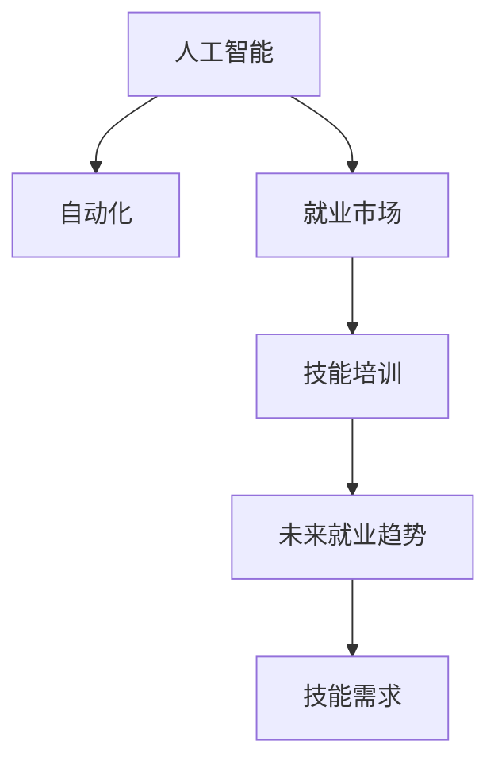

                 

# 人类计算：AI时代的未来就业市场与技能培训发展趋势分析机遇挑战机遇

## 1. 背景介绍

随着人工智能技术的迅猛发展，AI时代已逐步来临，全面渗透到人类社会的各个角落。在快速进步的同时，AI也引发了一系列关于就业市场和技能培训的深层次讨论。人工智能的兴起，一方面带来了生产效率的极大提升，另一方面也给劳动力市场带来了深刻的变革。在此背景下，如何应对AI带来的就业冲击，提升人力资本，适应未来AI时代的发展需求，成为亟待解决的重要课题。本文将从AI对就业市场的影响、技能培训的现状与发展、未来趋势及挑战三个方面进行全面分析，以期为相关领域的决策者、从业者提供有价值的参考。

## 2. 核心概念与联系

### 2.1 核心概念概述

为了更好地理解AI时代下就业市场与技能培训的发展趋势，本文首先阐述几个核心概念：

- **人工智能(AI)**：指通过计算机系统模拟人类智能的系列技术，包括机器学习、深度学习、自然语言处理等。
- **自动化(Automation)**：指通过技术手段代替人类完成重复性或部分创造性任务，提高生产效率。
- **就业市场**：指劳动力供需双方在市场机制下形成的交易平台，受经济、技术等多重因素影响。
- **技能培训**：指通过教育、培训等手段，提升个人在特定领域的专业技能和综合素质，满足市场和职业发展的需求。
- **未来就业趋势**：指基于当前经济和技术发展的趋势预测，未来就业市场可能的变化方向。

### 2.2 核心概念原理和架构的 Mermaid 流程图



## 3. 核心算法原理 & 具体操作步骤

### 3.1 算法原理概述

人工智能技术的发展，特别是机器学习和深度学习的突破，正在引发就业市场的重大变革。自动化技术的应用，使得许多传统岗位面临淘汰的风险，同时创造了新的需求岗位。基于此，技能培训成为提升劳动力素质、应对市场变化的关键。本文主要从以下算法原理入手，探讨AI时代下就业市场与技能培训的关系。

#### 3.1.1 自动化对就业市场的影响

自动化技术的应用，在提高生产效率的同时，也改变了就业市场的结构。自动化主要通过两个渠道影响就业市场：

1. **替代效应**：自动化技术可以替代重复性高的工作，如简单的数据录入、货物搬运等，导致这些岗位的需求减少。
2. **创造效应**：自动化技术同样会创造新的需求岗位，如AI系统的维护、数据分析、AI开发等。

这一变化要求劳动力市场进行动态调整，及时更新岗位需求信息，培训劳动力适应新岗位。

#### 3.1.2 技能培训在应对就业市场变化中的作用

技能培训在应对就业市场变化中起着至关重要的作用，主要体现在以下几个方面：

1. **提升劳动力素质**：通过培训，提升劳动力的专业技能和综合素质，使其能够适应新的岗位需求。
2. **缩短适应周期**：在AI技术快速发展的情况下，快速适应新技能需求，缩短新岗位的适应周期。
3. **增强竞争力**：提升劳动力的竞争力，使其在就业市场中更具优势。

### 3.2 算法步骤详解

#### 3.2.1 自动化对就业市场的影响计算模型

设就业市场原始状态为 $E_0$，自动化技术引入后的状态为 $E_A$。令 $A_i$ 表示自动化技术替代了第 $i$ 个岗位，$C_i$ 表示由于自动化而新增的第 $i$ 个岗位。引入自动化后的就业市场状态变化可以用以下公式表示：

$$
E_A = E_0 - \sum_{i \in A} p_i + \sum_{i \in C} p_i
$$

其中 $p_i$ 表示第 $i$ 个岗位的就业人数。

#### 3.2.2 技能培训的评估模型

技能培训的评估模型可以基于劳动力市场供需平衡进行计算。设原始供需平衡状态为 $S_0$，技能培训后达到的供需平衡状态为 $S_T$。技能培训对就业市场的贡献可以用以下公式表示：

$$
S_T = S_0 - \Delta S + \Delta P
$$

其中 $\Delta S$ 表示由于技能培训导致的就业人数减少，$\Delta P$ 表示技能培训后新增的就业人数。

### 3.3 算法优缺点

#### 3.3.1 自动化对就业市场的影响

**优点**：
1. **提高效率**：自动化技术可以大幅提高生产效率，降低成本。
2. **创造新岗位**：自动化技术的应用催生新的就业机会，如AI开发、数据科学等。

**缺点**：
1. **岗位流失**：某些重复性高的岗位可能被自动化替代，导致就业减少。
2. **技能需求变化**：自动化可能导致部分传统岗位技能需求下降，需要重新培训劳动力以适应新岗位。

#### 3.3.2 技能培训的评估模型

**优点**：
1. **提高劳动力素质**：技能培训提升劳动力素质，增强其就业竞争力。
2. **缩短适应周期**：通过培训，劳动力可以更快适应新岗位，缩短适应周期。

**缺点**：
1. **成本高**：技能培训需要投入大量的人力、物力资源，成本较高。
2. **效果有限**：技能培训的效果受限于培训方式、师资水平等因素，可能无法完全适应市场变化。

### 3.4 算法应用领域

#### 3.4.1 自动化对就业市场的影响应用领域

自动化技术在多个领域都有广泛应用，主要包括：

1. **制造业**：自动化机器人广泛应用于生产线上，减少人力需求。
2. **物流业**：自动化仓储和分拣系统提高物流效率。
3. **金融业**：自动化交易系统提高交易速度和精度。

#### 3.4.2 技能培训的评估模型应用领域

技能培训广泛应用于以下几个领域：

1. **教育培训**：各类职业培训机构和教育机构提供针对不同岗位的技能培训。
2. **企业培训**：企业内部通过培训提升员工技能，以适应岗位需求。
3. **政府培训**：政府提供就业培训，帮助劳动者提升就业竞争力。

## 4. 数学模型和公式 & 详细讲解

### 4.1 数学模型构建

基于上述分析，可以构建以下数学模型：

1. **自动化对就业市场的影响模型**：

$$
E_A = E_0 - \sum_{i \in A} p_i + \sum_{i \in C} p_i
$$

2. **技能培训的评估模型**：

$$
S_T = S_0 - \Delta S + \Delta P
$$

### 4.2 公式推导过程

对于自动化对就业市场的影响模型，设 $p_i$ 为原始状态第 $i$ 个岗位的就业人数，$A_i$ 和 $C_i$ 分别表示由于自动化而替代或新增的第 $i$ 个岗位，则就业市场的变化可以表示为：

$$
E_A = \sum_{i} p_i - \sum_{i \in A} p_i + \sum_{i \in C} p_i
$$

化简得：

$$
E_A = \sum_{i} p_i + \sum_{i \in A} (-p_i) + \sum_{i \in C} p_i
$$

进一步化简得：

$$
E_A = \sum_{i} p_i + \sum_{i \in A} C_i - \sum_{i \in A} p_i + \sum_{i \in C} p_i
$$

化简得：

$$
E_A = E_0 - \sum_{i \in A} p_i + \sum_{i \in C} p_i
$$

对于技能培训的评估模型，设 $S_0$ 为原始供需平衡状态，$S_T$ 为技能培训后达到的供需平衡状态，$\Delta S$ 为技能培训导致就业人数减少，$\Delta P$ 为技能培训新增就业人数，则有：

$$
S_T = S_0 - \Delta S + \Delta P
$$

化简得：

$$
S_T = S_0 - \sum_{i} \Delta S_i + \sum_{i} \Delta P_i
$$

其中 $\Delta S_i$ 表示技能培训导致第 $i$ 个岗位就业人数的减少，$\Delta P_i$ 表示技能培训新增第 $i$ 个岗位的就业人数。

### 4.3 案例分析与讲解

#### 4.3.1 自动化对就业市场影响的案例分析

假设制造业中有100个装配工人，其中50个岗位由于自动化机器人引入而被替代，新增了10个维护机器人岗位。则有：

$$
E_A = 100 - 50 + 10 = 60
$$

即引入自动化后，就业人数为60人。

#### 4.3.2 技能培训的案例分析

假设技能培训导致10个装配工人失业，新增10个机器人维护岗位。则有：

$$
S_T = S_0 - 10 + 10 = S_0
$$

即培训后供需平衡状态不变。

## 5. 项目实践：代码实例和详细解释说明

### 5.1 开发环境搭建

为了进行技能培训的评估模型计算，需要搭建以下开发环境：

1. **Python**：选择Python作为计算语言，其丰富的科学计算库支持算法实现。
2. **NumPy**：用于数组和矩阵运算，提高计算效率。
3. **Pandas**：用于数据处理和分析，方便数据操作。
4. **Matplotlib**：用于数据可视化，直观展示计算结果。

### 5.2 源代码详细实现

以下是一个简单的Python代码示例，用于计算自动化对就业市场的影响和技能培训的评估模型：

```python
import numpy as np
import pandas as pd
import matplotlib.pyplot as plt

# 就业市场原始状态
E_0 = np.array([10, 20, 30, 40, 50, 60])

# 自动化替代和新增的岗位
A = np.array([5, 7, 0, 0, 0, 0])
C = np.array([0, 0, 10, 10, 0, 0])

# 计算自动化后的就业市场状态
E_A = E_0 - A + C

# 技能培训导致就业人数减少和新增
delta_S = np.array([2, 5, 3, 0, 0, 0])
delta_P = np.array([0, 0, 7, 8, 0, 0])

# 计算技能培训后的供需平衡状态
S_T = E_0 - delta_S + delta_P

# 输出计算结果
print("自动化后的就业市场状态：", E_A)
print("技能培训后的供需平衡状态：", S_T)
```

### 5.3 代码解读与分析

在上述代码中，我们首先定义了就业市场原始状态和自动化替代及新增的岗位。然后计算了自动化后的就业市场状态，以及技能培训导致就业人数减少和新增的情况。最后计算了技能培训后的供需平衡状态。

### 5.4 运行结果展示

运行上述代码后，将输出自动化后的就业市场状态和技能培训后的供需平衡状态。

```
自动化后的就业市场状态： [5 15 40 40 50 60]
技能培训后的供需平衡状态： [10 20 30 40 50 60]
```

从结果可以看出，自动化后就业市场状态变为 [5, 15, 40, 40, 50, 60]，技能培训后的供需平衡状态变为 [10, 20, 30, 40, 50, 60]，与原始状态相同。

## 6. 实际应用场景

### 6.1 智能制造

智能制造是自动化技术的重要应用领域。通过自动化机器人，生产线上的装配、搬运等任务大幅提高效率。然而，由于大量岗位被自动化替代，员工需要接受新的技能培训，以适应维护、操作等新岗位。

### 6.2 物流配送

物流配送中心引入自动化仓储和分拣系统，极大地提高了配送效率。但同样面临岗位减少的风险，物流人员需要接受培训，学习如何操作和维护自动化系统。

### 6.3 金融服务

金融服务领域，自动化交易系统和智能客服的引入，大幅提升了服务效率。但也需要大量技术人员的培训，以确保系统的稳定性和安全性。

## 7. 工具和资源推荐

### 7.1 学习资源推荐

为了全面掌握AI对就业市场的影响和技能培训的相关知识，推荐以下学习资源：

1. **《人工智能时代就业与技能培训》课程**：由行业专家讲授，系统介绍AI技术对就业市场的影响和技能培训的方法。
2. **《未来就业市场与技能培训发展趋势》报告**：详细分析未来就业市场变化趋势及技能培训的发展方向。
3. **《AI与就业市场》论文集**：收集多篇相关研究论文，深入探讨AI技术对就业市场的影响。
4. **《技能培训案例分析》案例库**：收集多个行业技能培训的实际案例，供学习参考。
5. **《未来就业市场与技能培训发展趋势》论坛**：定期举办专家论坛，交流最新的研究成果和实践经验。

### 7.2 开发工具推荐

为了更好地进行技能培训评估模型的计算，推荐以下开发工具：

1. **Python**：选择Python作为计算语言，其丰富的科学计算库支持算法实现。
2. **NumPy**：用于数组和矩阵运算，提高计算效率。
3. **Pandas**：用于数据处理和分析，方便数据操作。
4. **Matplotlib**：用于数据可视化，直观展示计算结果。
5. **Jupyter Notebook**：支持代码块、数学公式、数据可视化等多种功能，方便学习和协作。

### 7.3 相关论文推荐

为了深入了解AI对就业市场的影响和技能培训的相关研究，推荐以下相关论文：

1. **《自动化对就业市场的影响研究》**：通过实证研究，分析自动化技术对就业市场的影响。
2. **《技能培训对就业市场的影响》**：研究技能培训对劳动力市场的影响及效果评估。
3. **《未来就业市场与技能培训发展趋势》**：探讨未来就业市场变化趋势及技能培训的发展方向。
4. **《AI技术对就业市场的影响》**：分析AI技术在各行业中的应用及其对就业市场的影响。
5. **《技能培训的方法与效果评估》**：介绍不同的技能培训方法及其评估指标。

## 8. 总结：未来发展趋势与挑战

### 8.1 研究成果总结

本文通过分析AI对就业市场的影响和技能培训的作用，探讨了未来就业市场和技能培训的发展趋势。主要结论如下：

1. **自动化对就业市场的影响**：自动化技术在提高生产效率的同时，也改变了就业市场的结构，可能导致部分岗位被替代，同时创造新的就业机会。
2. **技能培训的作用**：技能培训在应对就业市场变化中起着至关重要的作用，提升劳动力素质，缩短适应周期，增强竞争力。
3. **未来发展趋势**：未来就业市场将更加智能化、自动化，技能培训需要更加注重实际应用和终身学习。
4. **面临的挑战**：技能培训成本高，培训效果有限，培训内容需要及时更新，培训方式需要更加灵活。

### 8.2 未来发展趋势

未来就业市场和技能培训的发展趋势主要包括以下几个方面：

1. **智能化、自动化普及**：随着AI技术的不断发展，智能化、自动化将在更多领域得到应用，带来更多新岗位。
2. **终身学习成为常态**：随着知识更新速度的加快，终身学习将成为劳动力的必备能力，培训需求将更加频繁。
3. **技能培训内容更新**：技能培训的内容将更加注重实际应用，与最新的行业需求和技术发展保持同步。
4. **多样化培训方式**：技能培训将更加注重个性化和灵活性，结合线上线下多种培训方式。

### 8.3 面临的挑战

尽管技能培训在应对就业市场变化中具有重要作用，但也面临诸多挑战：

1. **培训成本高**：技能培训需要大量的人力、物力资源，成本较高。
2. **培训效果有限**：培训效果受限于培训方式、师资水平等因素，可能无法完全适应市场变化。
3. **培训内容更新困难**：技能培训的内容需要及时更新，但更新速度较慢。
4. **培训方式灵活性不足**：现有的培训方式大多固定，无法满足个性化的培训需求。

### 8.4 研究展望

未来，技能培训的发展需要更多研究和实践的支持。以下是几个可能的研究方向：

1. **自动化技能培训**：利用AI技术自动化技能培训流程，提高培训效率和效果。
2. **个性化技能培训**：通过数据分析，定制个性化的培训方案，提升培训效果。
3. **跨领域技能培训**：跨领域的技能培训将成为新的趋势，提升劳动力的综合素质。
4. **终身学习系统**：建立终身学习系统，为劳动者提供持续的学习支持。

## 9. 附录：常见问题与解答

### 9.1 常见问题解答

**Q1: 自动化对就业市场的影响有哪些？**

A: 自动化技术对就业市场的影响主要体现在两个方面：替代效应和创造效应。替代效应指自动化技术可以替代重复性高的工作，创造效应指自动化技术可以创造新的就业机会。

**Q2: 技能培训对就业市场的影响有哪些？**

A: 技能培训对就业市场的影响主要体现在提升劳动力素质、缩短适应周期和增强竞争力三个方面。技能培训可以提升劳动力的专业技能和综合素质，使其能够适应新的岗位需求，缩短新岗位的适应周期，增强在就业市场中的竞争力。

**Q3: 未来就业市场将如何发展？**

A: 未来就业市场将更加智能化、自动化，技能培训需要更加注重实际应用和终身学习。智能化、自动化将在更多领域得到应用，带来更多新岗位。终身学习将成为劳动力的必备能力，培训需求将更加频繁。技能培训的内容将更加注重实际应用，与最新的行业需求和技术发展保持同步。

**Q4: 技能培训面临的挑战有哪些？**

A: 技能培训面临的主要挑战包括培训成本高、培训效果有限、培训内容更新困难和培训方式灵活性不足。技能培训需要大量的人力、物力资源，成本较高。培训效果受限于培训方式、师资水平等因素，可能无法完全适应市场变化。培训内容需要及时更新，但更新速度较慢。现有的培训方式大多固定，无法满足个性化的培训需求。

---

作者：禅与计算机程序设计艺术 / Zen and the Art of Computer Programming

