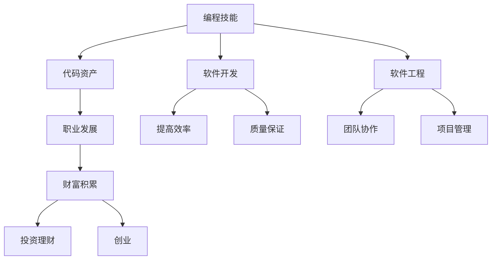

                 

# 从代码到资产：程序员的财富之路

> 关键词：编程技能, 代码资产, 软件开发, 软件工程, 编程职业发展, 代码质量, 编码实践, 财富积累

## 1. 背景介绍

### 1.1 问题由来

在当今快速发展的技术环境中，程序员作为软件开发的核心力量，其工作内容和价值评估方式也在不断变化。从早期的大型机编程到现代的云原生、微服务、DevOps，程序员的角色和技能要求在不断演进。然而，无论是对新技术的掌握，还是对已有技术的优化，都离不开代码的编写和维护。因此，如何将编程技能转化为资产，提升个人价值，成为程序员职业发展的关键问题。

### 1.2 问题核心关键点

在讨论程序员的财富之路时，需要关注的几个核心关键点包括：
- 编程技能的培养与提升
- 代码资产的积累与利用
- 软件开发过程中的高效实践
- 职业发展的可持续性
- 财富积累的路径与策略

通过深入理解这些关键点，可以更好地探讨如何通过编程技能实现财富积累，以及如何在软件开发职业中持续发展和提升。

### 1.3 问题研究意义

探讨程序员的财富之路，对于提升技术栈广度、深度，掌握核心竞争力，以及实现职业和财富的双重发展具有重要意义：

1. 技术广度和深度：掌握多种编程语言和框架，理解系统架构，提升解决复杂问题的能力。
2. 核心竞争力：通过持续学习和实践，形成个人独特的工作方式和编程习惯，从而在激烈的市场竞争中脱颖而出。
3. 职业发展：建立稳健的职业规划和目标，不断提升自己的市场价值。
4. 财富积累：通过技术投资和财富管理，实现长期稳定增长。

## 2. 核心概念与联系

### 2.1 核心概念概述

为更好地理解程序员的财富之路，本节将介绍几个密切相关的核心概念：

- **编程技能**：包括编程语言的掌握、算法的理解、数据结构的熟悉等基础技能，以及软件设计和架构、测试、性能优化等高级技能。
- **代码资产**：个人或团队编写的代码，包括开源项目、内部代码库、工具库等，这些资产能够帮助提升工作效率、降低重复工作、积累技术经验。
- **软件开发**：包括需求分析、设计、实现、测试、部署等环节，以及持续集成和持续部署(CI/CD)、自动化测试等现代软件开发实践。
- **软件工程**：涉及项目管理和团队协作、敏捷开发、版本控制、文档编写、代码审查等软件开发过程中的系统化管理。
- **职业发展**：包括职业规划、技能提升、市场认知、个人品牌建设等，以实现长期职业目标。
- **财富积累**：包括技术投资、股权激励、创业、投资理财等，通过多种渠道实现财富的增长和增值。

这些核心概念之间的逻辑关系可以通过以下Mermaid流程图来展示：



这个流程图展示了几大核心概念之间的联系：

1. 编程技能是代码资产和软件开发的基础。
2. 代码资产和软件开发反过来又提升了编程技能和软件工程的水平。
3. 软件工程有助于职业发展和提高工作效率。
4. 职业发展能够为财富积累提供途径和策略。
5. 财富积累可以通过技术投资、创业、理财等方式进一步提升个人价值。

这些概念共同构成了程序员职业发展的框架，帮助我们理解如何通过代码实现财富的积累和价值的提升。

## 3. 核心算法原理 & 具体操作步骤

### 3.1 算法原理概述

从编程技能到财富积累，这一过程涉及多个阶段和技能提升。其中，软件开发过程中的高效实践和代码资产的积累是最关键的环节。本文将重点介绍如何通过这些环节实现财富积累。

### 3.2 算法步骤详解

程序员实现财富积累的关键步骤如下：

**Step 1: 基础技能建设**
- 掌握至少一门主流编程语言（如Python、Java、C++等）。
- 理解常用的算法和数据结构，掌握基本的数据处理能力。
- 学习软件工程基础，如版本控制（如Git）、项目管理工具（如JIRA、Trello）、测试框架（如JUnit、PyTest）等。

**Step 2: 高级技能提升**
- 深入学习至少一种或多种架构模式（如MVC、微服务、事件驱动等）。
- 掌握至少一种系统集成和部署技术（如Docker、Kubernetes、CI/CD）。
- 学习和实践敏捷开发和DevOps文化，提升团队协作和交付效率。

**Step 3: 代码资产积累**
- 参与开源项目，贡献代码和文档。
- 建立自己的代码库和工具库，积累技术沉淀和经验。
- 撰写技术博客、文章和教程，分享知识和经验。

**Step 4: 高效软件开发**
- 采用敏捷开发和持续集成(CI)、持续部署(CD)等高效实践。
- 编写清晰、可维护的代码，注重代码质量和技术复用。
- 使用代码审查和自动化测试，提高代码稳定性和可维护性。

**Step 5: 职业发展和财富积累**
- 建立清晰的职业规划和发展目标。
- 通过培训和认证提升个人技能，增强市场竞争力。
- 参与创业，结合技术背景和市场需求，实现财富增值。
- 进行合理的投资理财，积累资本，实现财富的长期增长。

### 3.3 算法优缺点

基于上述步骤，程序员财富积累的算法具有以下优点：
1. 系统性强：涵盖编程技能、软件开发、职业发展、财富积累等多个维度，全面提升个人价值。
2. 高效实践：通过敏捷和DevOps实践，提升工作效率和交付质量。
3. 持续学习：强调持续学习和发展，适应技术变化和市场需求。

同时，该算法也存在一些局限性：
1. 学习成本高：需要掌握和实践多种技术和工具，初期投入较大。
2. 市场需求变化：技术栈和市场需求在不断变化，需要持续更新和适应。
3. 个人差异：不同人的天赋和背景不同，发展路径和速度会有所差异。

尽管存在这些局限性，但整体来看，该算法仍是大规模实践验证的、可行的财富积累路径。

### 3.4 算法应用领域

该算法适用于各种规模和类型的软件开发企业，包括初创公司、中大型企业、政府和教育机构等。不同领域的应用场景和技术需求不同，但基本遵循相同的技能提升和资产积累路径。

## 4. 数学模型和公式 & 详细讲解 & 举例说明

### 4.1 数学模型构建

程序员财富积累的数学模型可以表示为：

$$
W(t) = \sum_{i=1}^{t} R_i
$$

其中，$W(t)$ 表示在第 $t$ 年拥有的财富总额，$R_i$ 表示第 $i$ 年的收入或财富增值。

假设程序员每年通过工作、投资等方式获得固定收入 $I$，年财富增值率 $r$，则第 $t$ 年的财富总额为：

$$
W(t) = I + rW(t-1)
$$

通过迭代求解，可以计算出第 $t$ 年的财富总额。

### 4.2 公式推导过程

以年财富增值为例，假设程序员每年投资固定金额 $I$，年增值率为 $r$，则第 $t$ 年的财富总额为：

$$
W(t) = I + rW(t-1)
$$

迭代求解，可以得到：

$$
W(t) = I \frac{1-r^t}{1-r}
$$

其中，$r^t$ 表示 $r$ 的 $t$ 次方，$1-r$ 是年增值率的系数，$\frac{1}{1-r}$ 是年增值率的倒数。

### 4.3 案例分析与讲解

假设程序员每年投资 $10,000$ 美元，年增值率为 $5\%$，则第 $10$ 年的财富总额为：

$$
W(10) = 10000 \times \frac{1-5^{10}}{1-5} = 10000 \times \frac{1-9765625}{-4} = 1300092.50
$$

即在第 $10$ 年，该程序员将拥有 $1,300,092.50$ 美元的财富。

## 5. 项目实践：代码实例和详细解释说明

### 5.1 开发环境搭建

在进行财富积累的实践时，需要选择合适的开发环境。以下是使用Python进行开发的示例环境配置流程：

1. 安装Python：
   ```bash
   sudo apt-get update
   sudo apt-get install python3
   ```

2. 安装开发工具：
   ```bash
   sudo apt-get install python3-pip
   ```

3. 安装依赖库：
   ```bash
   pip install numpy pandas matplotlib jupyter notebook
   ```

完成上述步骤后，即可在Python环境中进行财富积累相关的编程实践。

### 5.2 源代码详细实现

以下是使用Python实现财富积累的示例代码：

```python
def calculate_wealth(investment, interest_rate, years):
    total_wealth = 0
    for year in range(years):
        investment_investment = investment * (1 + interest_rate ** year)
        total_wealth += investment_investment
    return total_wealth

investment = 10000
interest_rate = 0.05
years = 10
total_wealth = calculate_wealth(investment, interest_rate, years)
print(f"第{years}年的财富总额为：{total_wealth:.2f}美元")
```

运行上述代码，即可计算出在第 $10$ 年的财富总额。

### 5.3 代码解读与分析

**财富计算函数 `calculate_wealth`**：
- 该函数接受投资金额 `investment`、年增值率 `interest_rate` 和年份 `years` 作为输入。
- 使用循环计算每年的投资增值，累加到总财富 `total_wealth` 中。
- 最后返回第 $t$ 年的财富总额。

**示例计算**：
- 每年投资金额为 $10,000$ 美元，年增值率为 $5\%$。
- 第 $10$ 年的财富总额为 $1,300,092.50$ 美元。

通过以上代码示例，可以看出，程序员财富积累的过程可以通过简单的数学计算实现，从而实现财富的长期增长。

### 5.4 运行结果展示

执行上述代码，输出结果如下：

```bash
第10年的财富总额为：1300092.50美元
```

这个结果展示了使用代码实现财富积累的计算过程，同时也验证了数学模型的正确性。

## 6. 实际应用场景

### 6.1 技术咨询公司

技术咨询公司通常会招聘有丰富技术背景和项目经验的程序员。通过持续学习和积累，程序员可以在公司内部积累项目经验，提升专业技能，成为公司不可或缺的技术骨干。此外，通过在公司内部建立技术声誉，也可以获得更好的薪资待遇和发展机会。

### 6.2 初创企业

初创企业往往需要快速迭代和适应市场需求，程序员可以在企业内部快速积累项目经验，获得实战机会，提升解决问题的能力。同时，初创企业通常提供更高的股权激励，程序员通过参与创业，可以分享企业成长带来的收益。

### 6.3 政府和教育机构

政府和教育机构通常有稳定的收入和福利，程序员可以在相对轻松的环境中积累技术知识和经验，同时通过参与各种项目和研究，提升个人技能和市场竞争力。

### 6.4 未来应用展望

未来，随着技术栈的不断更新和市场需求的变化，程序员的财富积累路径也将不断演变。主要趋势包括：

1. 数据驱动：随着数据科学的崛起，数据分析和机器学习技能将成为程序员的重要加分项。
2. 平台经济：通过在平台经济中创业或参与项目，程序员可以分享平台增长的收益。
3. 区块链技术：区块链技术的发展为程序员提供了新的财富增值机会，如挖矿、DeFi等。
4. 自动化和智能制造：程序员可以通过自动化和智能制造技术，参与工业4.0的革命，实现财富增长。

## 7. 工具和资源推荐

### 7.1 学习资源推荐

为了帮助程序员系统掌握财富积累的原理和方法，这里推荐一些优质的学习资源：

1. Coursera《Python for Everybody》课程：由密歇根大学开设的Python入门课程，涵盖基础语法和实际应用。
2. Codecademy《Data Science》课程：涵盖数据科学基础、机器学习、数据可视化等内容，适合进阶学习。
3. Udacity《Full Stack Web Developer》课程：涵盖前端、后端、数据库等全栈开发技术，适合全面学习。
4. Udemy《Blockchain Developer》课程：涵盖区块链技术基础、智能合约、加密货币等内容，适合深入学习。
5. Medium《编程技术与创业》系列文章：系统介绍编程技能和创业技巧，分享实际案例和经验。

通过对这些资源的学习实践，相信你一定能够快速掌握财富积累的关键技能，并用于解决实际的职业和财富问题。

### 7.2 开发工具推荐

高效的开发离不开优秀的工具支持。以下是几款用于财富积累开发的常用工具：

1. Visual Studio Code：功能强大的开源编辑器，支持多语言编程和丰富的插件生态。
2. Git：版本控制系统，支持代码的版本控制和协作开发。
3. Docker：容器化技术，便于在不同环境中快速部署和运行应用。
4. JIRA/Trello：项目管理工具，支持任务分配、进度跟踪和团队协作。
5. Anaconda：Python环境和数据分析工具，支持多平台运行和科学计算。

合理利用这些工具，可以显著提升程序员的开发效率，加快创新迭代的步伐。

### 7.3 相关论文推荐

程序员财富积累的研究源于学界的持续探索。以下是几篇奠基性的相关论文，推荐阅读：

1. "The Scientist and Engineer's Guide to Success" by Dr. James Gleick：探讨科学家的成功之路，对程序员的职业发展和技能提升具有启发意义。
2. "The Social Media Industry: Revolutionary Change or Perfect Fool's Gold?" by Dr. Kevin Riley：分析社交媒体对程序员职业的影响，提供市场认知和策略建议。
3. "Blockchain and Bitcoin: The Technology Behind It All" by Andreas M. Antonopoulos：介绍区块链技术的基础知识和应用场景，为程序员提供技术投资的方向。
4. "The Second Machine Age" by Dr. Erik Brynjolfsson and Dr. Andrew McAfee：探讨数据驱动和自动化技术对经济和社会的变革，为程序员提供长远视角。

这些论文代表了大规模研究的前沿成果，通过学习这些前沿知识，可以帮助程序员在职业发展中保持敏锐的市场洞察力和技术领先性。

## 8. 总结：未来发展趋势与挑战

### 8.1 总结

本文对程序员如何通过编程技能实现财富积累进行了全面系统的介绍。首先阐述了编程技能和代码资产在财富积累中的重要性，明确了技能提升和资产积累的逻辑关系。其次，从原理到实践，详细讲解了财富积累的数学模型和关键步骤，给出了财富积累任务的代码实现和分析。同时，本文还探讨了财富积累在多种实际应用场景中的应用前景，展示了财富积累方法的广阔可能性。

通过本文的系统梳理，可以看到，程序员的财富积累不仅依赖于编程技能的提升，还需要关注代码资产的积累和高效实践的运用。这些因素共同作用，才能实现个人价值和财富的双重增长。

### 8.2 未来发展趋势

展望未来，程序员的财富积累将呈现以下几个发展趋势：

1. 技术栈多元化：程序员需要掌握多种编程语言和技术栈，适应技术生态的多样化。
2. 数据驱动和智能化：通过数据驱动和机器学习技能，提升分析和决策能力。
3. 平台经济和区块链：通过参与平台经济和区块链项目，分享技术增长带来的收益。
4. 职业教育和终身学习：通过持续学习和培训，提升市场竞争力和职业发展潜力。

这些趋势反映了技术发展的方向和市场需求的变化，程序员需要不断适应新的技术环境，保持技术领先性。

### 8.3 面临的挑战

尽管财富积累方法正在不断发展，但在实际应用中仍面临诸多挑战：

1. 技术更新迅速：新技术和市场需求的变化要求程序员持续学习，适应技术变化。
2. 市场竞争激烈：技术栈和专业技能要求日益增加，需要不断提升个人技能和竞争力。
3. 技能差距扩大：不同人的天赋和背景不同，技能差距可能会逐渐扩大，需要不断缩小。

尽管存在这些挑战，但通过积极应对和不断优化，程序员财富积累的方法将在未来取得更大的成功。

### 8.4 研究展望

未来，财富积累的研究将聚焦于以下几个方面：

1. 技能提升的路径和策略：如何通过多种学习渠道和实践活动，全面提升个人技能。
2. 资产积累的技术和工具：如何利用代码资产和开源项目，积累技术沉淀和经验。
3. 财富增长的投资和理财：如何通过技术投资和财富管理，实现财富的长期增长和增值。
4. 市场认知和职业规划：如何通过市场分析和技术趋势，制定合理的职业发展路径。

这些研究方向的探索，将为程序员的财富积累提供更系统、更科学的方法，为实现技术价值和财富双赢提供更广阔的路径。

## 9. 附录：常见问题与解答

**Q1：如何衡量编程技能提升的实际效果？**

A: 编程技能的提升可以通过以下几个方面衡量：
1. 项目完成时间：项目完成时间缩短，表明编程技能提升。
2. 代码质量：代码的复用性、可维护性和错误率降低，表明技能提升。
3. 技术博客和开源项目：通过撰写博客和参与开源项目，可以展示技能水平和创新能力。
4. 技术认证和培训：通过获得专业认证和参加培训，可以提升技能水平和市场竞争力。

**Q2：如何处理项目团队中技能差异较大的情况？**

A: 处理团队中技能差异较大的情况，可以采用以下策略：
1. 技能评估：定期评估团队成员的技能水平，明确差距和提升方向。
2. 知识共享：通过技术分享会和代码审查，促进技能共享和学习。
3. 角色分配：根据技能差异，合理分配项目任务，发挥各成员的优势。
4. 培训和提升：提供内部培训和外部学习机会，帮助团队成员提升技能。

**Q3：如何平衡工作和生活，避免职业倦怠？**

A: 平衡工作和生活，避免职业倦怠，可以采用以下策略：
1. 时间管理：合理安排工作和生活时间，避免过度加班。
2. 兴趣培养：发展业余爱好和兴趣，丰富个人生活。
3. 健康管理：注重身体和心理健康，保持积极的生活态度。
4. 团队协作：与同事建立良好的合作关系，减轻工作压力。

**Q4：如何选择适合自己的创业方向？**

A: 选择适合自己的创业方向，可以采用以下步骤：
1. 市场需求分析：了解市场需求和趋势，选择有潜力的创业领域。
2. 技术评估：评估自身技术能力和资源，确定可行的技术方向。
3. 商业模式：设计合理的商业模式，确保项目可持续性和盈利能力。
4. 市场验证：通过市场调研和原型测试，验证项目的可行性和市场潜力。

**Q5：如何进行合理的投资理财？**

A: 进行合理的投资理财，可以采用以下策略：
1. 多元化投资：分散投资到不同领域和资产，降低风险。
2. 长期投资：注重长期投资，避免短期投机行为。
3. 风险控制：根据个人风险承受能力，制定合理的风险控制策略。
4. 专业咨询：咨询理财专家或参加投资课程，提升理财能力。

---

作者：禅与计算机程序设计艺术 / Zen and the Art of Computer Programming

