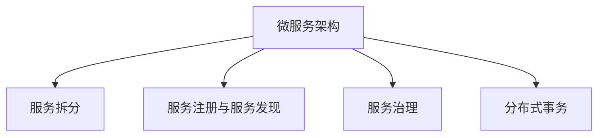
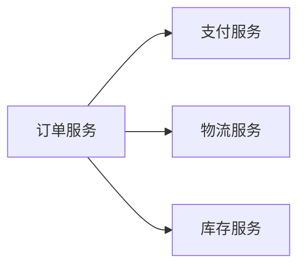
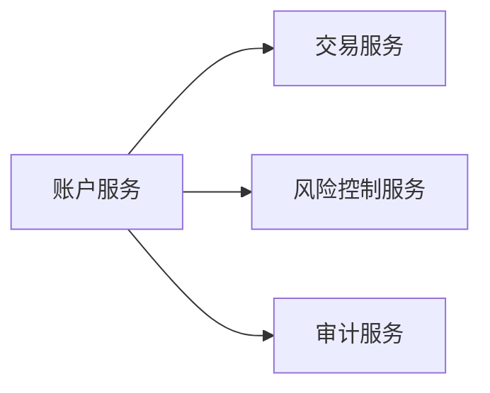
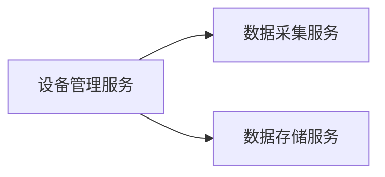

                 

# 从全栈开发到微服务架构师的晋升之路

全栈开发和微服务架构是IT行业中最热门的两个话题之一。但是，从全栈开发到微服务架构师的晋升之路并不容易。本文将从全栈开发的背景、核心概念与联系、核心算法原理与操作步骤、数学模型与公式、项目实践、实际应用场景、工具和资源推荐、总结、未来发展趋势与挑战、附录等方面进行系统介绍，帮助读者更好地理解微服务架构师所需的核心技能和知识。

## 1. 背景介绍

### 1.1 问题由来
随着互联网的迅速发展和企业业务的不断扩展，传统单体应用已经无法满足企业的需求。单体应用体积庞大、复杂性高、扩展性差、维护成本高。为了解决这个问题，企业逐渐开始采用微服务架构。微服务架构通过将单体应用拆分成多个独立部署的微服务，提高了系统的可维护性、可扩展性和可伸缩性。

### 1.2 问题核心关键点
微服务架构的核心在于将一个大型复杂的应用拆分成多个小型独立的应用，每个服务专注于完成特定的业务逻辑，各个服务之间通过轻量级通信机制进行交互。这使得各个服务可以独立部署、独立扩展、独立维护，同时保持了系统的高可用性和灵活性。

## 2. 核心概念与联系

### 2.1 核心概念概述

为了更好地理解微服务架构，我们先介绍几个密切相关的核心概念：

- 微服务架构(Microservice Architecture)：将单体应用拆分成多个小型独立的应用，每个服务专注于完成特定的业务逻辑，各个服务之间通过轻量级通信机制进行交互。
- 服务拆分(Service Splitting)：将单体应用根据业务功能拆分成多个独立的服务。服务拆分是微服务架构的核心。
- 服务注册与服务发现(Service Registry and Discovery)：在微服务架构中，每个服务需要知道其他服务的位置，以便进行通信。服务注册与服务发现机制帮助服务发现和定位。
- 服务治理(Service Governance)：服务治理包括服务注册、配置管理、元数据管理等，保证微服务的可用性、稳定性和安全性。
- 分布式事务(Distributed Transactions)：在微服务架构中，多个服务之间需要进行协调一致的操作，分布式事务机制保证操作的原子性和一致性。

这些核心概念之间的逻辑关系可以通过以下Mermaid流程图来展示：



这个流程图展示了微服务架构的核心概念及其之间的关系：

1. 微服务架构通过服务拆分将单体应用解耦，形成多个独立的服务。
2. 服务注册与服务发现机制帮助服务发现和定位。
3. 服务治理包括服务注册、配置管理、元数据管理等，保证微服务的可用性、稳定性和安全性。
4. 分布式事务保证多个服务之间操作的原子性和一致性。

这些概念共同构成了微服务架构的理论基础，使我们能够更好地理解微服务架构的设计和实现。

## 3. 核心算法原理 & 具体操作步骤

### 3.1 算法原理概述

微服务架构的核心算法原理包括服务拆分、服务注册与服务发现、服务治理、分布式事务等。这里我们将重点介绍服务拆分和分布式事务。

- 服务拆分：通过服务拆分将单体应用解耦成多个小型独立的服务，每个服务专注于完成特定的业务逻辑。服务拆分的目的是提高系统的可维护性、可扩展性和可伸缩性。
- 分布式事务：在微服务架构中，多个服务之间需要进行协调一致的操作，分布式事务保证操作的原子性和一致性。常见的分布式事务解决方案包括TCC、Saga、XID等。

### 3.2 算法步骤详解

以下是微服务架构的设计和实现步骤：

1. 服务拆分：根据业务功能将单体应用拆分成多个小型独立的服务。
2. 服务注册与服务发现：使用服务注册中心对服务进行注册和发现。常用的服务注册中心包括Consul、Zookeeper、Eureka等。
3. 服务治理：使用服务治理框架对服务进行管理，包括服务注册、配置管理、元数据管理等。常用的服务治理框架包括Spring Cloud、Kubernetes、Istio等。
4. 分布式事务：使用分布式事务解决方案对多个服务之间进行协调一致的操作。常见的分布式事务解决方案包括TCC、Saga、XID等。

### 3.3 算法优缺点

微服务架构具有以下优点：

- 系统可维护性高：每个服务专注于完成特定的业务逻辑，各个服务可以独立部署、独立扩展、独立维护。
- 系统可扩展性高：可以根据业务需求动态扩展服务。
- 系统可伸缩性高：可以通过增加或减少服务节点来调整系统负载。
- 系统灵活性高：可以根据业务需求快速迭代和更新服务。

微服务架构也存在以下缺点：

- 系统复杂度高：微服务架构需要管理和维护多个服务，增加了系统复杂度。
- 系统通信开销高：多个服务之间的通信增加了系统开销。
- 系统一致性难保障：分布式事务增加了系统一致性的难度。
- 系统调试困难：多个服务之间的依赖关系增加了系统调试的难度。

### 3.4 算法应用领域

微服务架构广泛应用于企业级的业务系统、云原生应用、物联网、微服务框架等。以下是微服务架构的几个典型应用场景：

- 电商系统：将电商系统的订单、支付、物流、库存等多个服务拆分，通过微服务架构提高系统的可维护性和可扩展性。
- 金融系统：将金融系统的风险控制、账户管理、交易处理等多个服务拆分，通过微服务架构提高系统的稳定性和安全性。
- 物联网：将物联网系统中的设备管理、数据采集、数据存储等多个服务拆分，通过微服务架构提高系统的可伸缩性和可扩展性。
- 微服务框架：使用Spring Cloud、Kubernetes、Istio等微服务框架构建微服务系统。

## 4. 数学模型和公式 & 详细讲解 & 举例说明

### 4.1 数学模型构建

在微服务架构中，我们通常使用以下数学模型来描述服务的交互和协调：

- 服务调用模型：描述服务之间的调用关系。
- 分布式事务模型：描述服务之间的协调一致操作。

### 4.2 公式推导过程

这里以TCC分布式事务模型为例，推导其公式。

假设A、B两个服务需要进行协调一致的操作，A服务调用B服务进行数据操作。TCC分布式事务模型的流程如下：

1. A服务进行试锁操作，获取事务资源。
2. A服务调用B服务进行数据操作。
3. B服务返回操作结果，A服务根据结果进行事务提交或回滚操作。
4. A服务提交或回滚事务，释放事务资源。

TCC分布式事务模型的流程可以用以下伪代码表示：

```python
# A服务调用B服务
A.callB()
# A服务试锁
A.lock()
# A服务提交事务
A.commit()
# B服务提交事务
B.commit()
# B服务返回操作结果
B.result()
# A服务回滚事务
A.rollback()
# B服务回滚事务
B.rollback()
```

根据以上伪代码，我们可以推导出TCC分布式事务模型的数学模型：

1. 试锁操作：
   $$
   \text{lock}(A)
   $$

2. 数据操作：
   $$
   \text{do}(A, B)
   $$

3. 事务提交：
   $$
   \text{commit}(A, B)
   $$

4. 事务回滚：
   $$
   \text{rollback}(A, B)
   $$

其中，A、B分别表示A、B服务。

### 4.3 案例分析与讲解

这里以电商系统的订单支付微服务为例，介绍TCC分布式事务的实现。

假设订单服务(A)和支付服务(B)需要进行协调一致的操作。订单服务需要调用支付服务进行支付操作。TCC分布式事务的流程如下：

1. 订单服务试锁操作，获取支付服务的数据锁。
2. 订单服务调用支付服务进行支付操作。
3. 支付服务返回操作结果，订单服务根据结果进行事务提交或回滚操作。
4. 订单服务提交或回滚事务，释放支付服务的数据锁。

TCC分布式事务的实现示例如下：

```python
# 订单服务调用支付服务
A.callB()
# 订单服务试锁
A.lock()
# 订单服务提交事务
A.commit()
# 支付服务提交事务
B.commit()
# 支付服务返回操作结果
B.result()
# 订单服务回滚事务
A.rollback()
# 支付服务回滚事务
B.rollback()
```

在订单服务中，使用分布式锁来保证支付服务的资源独占性。在支付服务中，使用事务回滚机制保证操作的原子性和一致性。

## 5. 项目实践：代码实例和详细解释说明

### 5.1 开发环境搭建

在进行微服务架构实践前，我们需要准备好开发环境。以下是使用Spring Boot和Docker进行微服务架构开发的流程：

1. 安装JDK：从官网下载并安装Java Development Kit。
2. 安装Spring Boot：使用Maven或Gradle安装Spring Boot框架。
3. 安装Docker：从官网下载并安装Docker容器引擎。
4. 编写微服务代码：编写各个服务的代码，并配置Spring Boot应用程序。
5. 部署微服务：使用Docker容器引擎将微服务部署到云平台或本地环境中。

### 5.2 源代码详细实现

这里以电商系统的订单支付微服务为例，介绍Spring Boot和Docker微服务架构的实现。

首先，定义订单服务接口：

```java
public interface OrderService {
    void createOrder(String orderId, String userId, String productName);
    void payOrder(String orderId, String userId, String productName, String amount);
    void cancelOrder(String orderId, String userId, String productName);
}
```

然后，实现订单服务的业务逻辑：

```java
@Service
public class OrderServiceImpl implements OrderService {
    private final String serviceName = "order";
    private final String operationName = "createOrder";

    @Override
    public void createOrder(String orderId, String userId, String productName) {
        // 调用支付服务创建订单
        OrderService paymentService = new PaymentService();
        paymentService.createOrder(orderId, userId, productName);
    }

    @Override
    public void payOrder(String orderId, String userId, String productName, String amount) {
        // 调用支付服务支付订单
        OrderService paymentService = new PaymentService();
        paymentService.payOrder(orderId, userId, productName, amount);
    }

    @Override
    public void cancelOrder(String orderId, String userId, String productName) {
        // 调用支付服务取消订单
        OrderService paymentService = new PaymentService();
        paymentService.cancelOrder(orderId, userId, productName);
    }
}
```

接着，定义支付服务接口：

```java
public interface PaymentService {
    void createOrder(String orderId, String userId, String productName);
    void payOrder(String orderId, String userId, String productName, String amount);
    void cancelOrder(String orderId, String userId, String productName);
}
```

然后，实现支付服务的业务逻辑：

```java
@Service
public class PaymentServiceImpl implements PaymentService {
    private final String serviceName = "payment";
    private final String operationName = "createOrder";

    @Override
    public void createOrder(String orderId, String userId, String productName) {
        // 创建订单
        Order order = new Order(orderId, userId, productName);
        orderRepository.save(order);
    }

    @Override
    public void payOrder(String orderId, String userId, String productName, String amount) {
        // 支付订单
        Order order = orderRepository.findById(orderId);
        order.setAmount(amount);
        orderRepository.save(order);
    }

    @Override
    public void cancelOrder(String orderId, String userId, String productName) {
        // 取消订单
        Order order = orderRepository.findById(orderId);
        orderRepository.delete(order);
    }
}
```

最后，编写订单服务启动类：

```java
@SpringBootApplication
public class OrderServiceApplication {
    public static void main(String[] args) {
        SpringApplication.run(OrderServiceApplication.class, args);
    }
}
```

### 5.3 代码解读与分析

以下是订单服务代码的解读与分析：

**订单服务接口**：定义了订单服务的三个操作，包括创建订单、支付订单、取消订单。

**订单服务实现类**：实现了订单服务的三个操作，通过调用支付服务的接口进行数据操作。

**支付服务接口**：定义了支付服务的三个操作，包括创建订单、支付订单、取消订单。

**支付服务实现类**：实现了支付服务的三个操作，使用数据库操作进行数据存储。

通过以上代码，我们可以看到微服务架构的实现过程：

1. 定义接口：定义各个服务的接口，描述服务的调用关系。
2. 实现接口：实现各个服务的接口，编写业务逻辑。
3. 启动服务：启动各个服务，通过Spring Boot和Docker部署到云平台或本地环境中。

## 6. 实际应用场景

### 6.1 电商系统

电商系统是一个典型的微服务架构应用场景。电商系统的订单、支付、物流、库存等多个服务可以拆分，通过微服务架构提高系统的可维护性和可扩展性。例如，订单服务(A)和支付服务(B)需要进行协调一致的操作，可以使用TCC分布式事务进行数据操作。

**订单服务**：负责订单的创建、修改、删除等操作。订单服务使用Docker容器引擎进行部署，通过RESTful API与支付服务进行交互。

**支付服务**：负责订单的支付、退款、订单状态变更等操作。支付服务使用Docker容器引擎进行部署，通过RESTful API与订单服务进行交互。

**物流服务**：负责订单的物流跟踪、配送等操作。物流服务使用Docker容器引擎进行部署，通过RESTful API与订单服务进行交互。

**库存服务**：负责订单的库存管理、库存统计等操作。库存服务使用Docker容器引擎进行部署，通过RESTful API与订单服务进行交互。

电商系统的微服务架构如图1所示：



**图1: 电商系统的微服务架构**

通过微服务架构，电商系统的各个服务可以独立部署、独立扩展、独立维护，同时保持了系统的高可用性和灵活性。

### 6.2 金融系统

金融系统的风险控制、账户管理、交易处理等多个服务可以拆分，通过微服务架构提高系统的稳定性和安全性。例如，账户服务(A)和交易服务(B)需要进行协调一致的操作，可以使用TCC分布式事务进行数据操作。

**账户服务**：负责账户的管理、查询、修改等操作。账户服务使用Docker容器引擎进行部署，通过RESTful API与交易服务进行交互。

**交易服务**：负责交易的管理、查询、修改等操作。交易服务使用Docker容器引擎进行部署，通过RESTful API与账户服务进行交互。

**风险控制服务**：负责风险控制的管理、查询、修改等操作。风险控制服务使用Docker容器引擎进行部署，通过RESTful API与交易服务进行交互。

**审计服务**：负责交易的审计、监控、告警等操作。审计服务使用Docker容器引擎进行部署，通过RESTful API与交易服务进行交互。

金融系统的微服务架构如图2所示：



**图2: 金融系统的微服务架构**

通过微服务架构，金融系统的各个服务可以独立部署、独立扩展、独立维护，同时保持了系统的高可用性和安全性。

### 6.3 物联网

物联网系统的设备管理、数据采集、数据存储等多个服务可以拆分，通过微服务架构提高系统的可伸缩性和可扩展性。例如，设备管理服务(A)和数据存储服务(B)需要进行协调一致的操作，可以使用TCC分布式事务进行数据操作。

**设备管理服务**：负责设备的管理、查询、修改等操作。设备管理服务使用Docker容器引擎进行部署，通过RESTful API与数据存储服务进行交互。

**数据采集服务**：负责设备的监测数据采集、存储等操作。数据采集服务使用Docker容器引擎进行部署，通过RESTful API与设备管理服务进行交互。

**数据存储服务**：负责数据的存储、查询、修改等操作。数据存储服务使用Docker容器引擎进行部署，通过RESTful API与设备管理服务进行交互。

物联网系统的微服务架构如图3所示：



**图3: 物联网系统的微服务架构**

通过微服务架构，物联网系统的各个服务可以独立部署、独立扩展、独立维护，同时保持了系统的可伸缩性和可扩展性。

## 7. 工具和资源推荐

### 7.1 学习资源推荐

为了帮助开发者系统掌握微服务架构的理论基础和实践技巧，这里推荐一些优质的学习资源：

1. 《Spring Cloud微服务架构实战》系列博文：由大架构师撰写，深入浅出地介绍了Spring Cloud微服务架构的原理、实践和案例。
2. CS542《分布式系统》课程：麻省理工学院开设的分布式系统经典课程，涵盖分布式系统、微服务架构等内容。
3. 《微服务架构》书籍：O'Reilly出版社出版的经典微服务架构书籍，全面介绍了微服务架构的理论基础和实践技巧。
4. Spring Cloud官方文档：Spring Cloud官方文档，提供了微服务架构的详细指南和样例代码。
5. Kubernetes官方文档：Kubernetes官方文档，提供了容器编排和微服务架构的详细指南和样例代码。

通过对这些资源的学习实践，相信你一定能够快速掌握微服务架构的精髓，并用于解决实际的IT问题。

### 7.2 开发工具推荐

高效的开发离不开优秀的工具支持。以下是几款用于微服务架构开发的常用工具：

1. Spring Boot：基于Spring框架的快速开发框架，支持微服务架构的快速开发和部署。
2. Docker：容器引擎，支持微服务架构的快速部署和扩展。
3. Kubernetes：容器编排工具，支持微服务架构的集群管理和部署。
4. GitLab CI/CD：持续集成和持续部署工具，支持微服务架构的快速迭代和发布。
5. IntelliJ IDEA：集成开发环境，支持Spring Boot和Docker的开发和调试。
6. Visual Studio Code：轻量级代码编辑器，支持Spring Boot和Docker的开发和调试。

合理利用这些工具，可以显著提升微服务架构的开发效率，加快创新迭代的步伐。

### 7.3 相关论文推荐

微服务架构的发展源于学界的持续研究。以下是几篇奠基性的相关论文，推荐阅读：

1. Sam Newman的《Building Microservices》：介绍了微服务架构的基本概念和设计原则。
2. Martin Fowler的《Microservices: A practical guide to building flexible systems and teams》：详细介绍了微服务架构的实现细节和最佳实践。
3. Brendan Burns的《Microservices: the theater of the mind》：讨论了微服务架构的思考方式和设计哲学。
4. Taylor Basolo的《Microservices for Java Developers》：介绍了微服务架构的Java开发实践。
5. Neil Lohmann的《Architecting Microservices》：详细介绍了微服务架构的设计模式和最佳实践。

这些论文代表了大微服务架构的发展脉络。通过学习这些前沿成果，可以帮助研究者把握学科前进方向，激发更多的创新灵感。

## 8. 总结：未来发展趋势与挑战

### 8.1 总结

本文对微服务架构的理论基础和实践技巧进行了全面系统的介绍。首先阐述了微服务架构的背景和核心概念，明确了微服务架构在提高系统可维护性、可扩展性和可伸缩性方面的独特价值。其次，从原理到实践，详细讲解了微服务架构的数学模型和公式，提供了微服务架构的代码实现和案例分析。同时，本文还广泛探讨了微服务架构在电商、金融、物联网等多个领域的应用前景，展示了微服务架构的广泛适用性。

通过本文的系统梳理，可以看到，微服务架构作为一种先进的软件架构范式，正在成为IT行业的重要趋势。微服务架构通过服务拆分、服务注册与服务发现、服务治理、分布式事务等关键技术，实现了系统的可维护性、可扩展性和可伸缩性，带来了更高效、更灵活、更可维护的系统架构。未来，随着微服务架构的持续演进，必将进一步推动IT行业的创新和发展。

### 8.2 未来发展趋势

展望未来，微服务架构将呈现以下几个发展趋势：

1. 服务治理智能化：通过智能运维、智能监控、智能告警等技术，提升微服务架构的自动化和智能化水平。
2. 服务编排自动化：通过编排引擎、编排平台等技术，实现微服务编排的自动化和流程化。
3. 服务交互高效化：通过服务网格、API网关等技术，提高微服务之间交互的效率和可靠性。
4. 服务安全保障化：通过加密、认证、授权等技术，保障微服务架构的安全性和隐私性。
5. 服务生态平台化：通过微服务应用商店、微服务开发社区等平台，构建微服务生态系统，推动微服务应用的创新和共享。
6. 服务运维容器化：通过Docker容器技术，实现微服务架构的快速部署、扩展和运维。

以上趋势凸显了微服务架构的未来发展方向，将进一步推动微服务架构的普及和应用。这些方向的探索发展，必将使微服务架构成为IT行业的核心竞争力，带来更高效、更灵活、更可维护的系统架构。

### 8.3 面临的挑战

尽管微服务架构已经取得了瞩目成就，但在迈向更加智能化、平台化应用的过程中，它仍面临着诸多挑战：

1. 服务拆分复杂性：服务拆分过于细粒度可能导致系统复杂性增加，开发和维护成本上升。
2. 服务通信开销：微服务架构需要大量服务之间的通信，增加了系统开销。
3. 服务一致性问题：微服务架构中的分布式事务、服务同步等一致性问题复杂性高，难于解决。
4. 服务治理复杂性：微服务架构需要复杂的服务治理机制，增加了系统维护的难度。
5. 服务安全和隐私问题：微服务架构中需要解决身份认证、授权、加密等问题，增加了系统复杂性。
6. 服务运维难度：微服务架构需要复杂的运维机制，增加了运维难度。

### 8.4 研究展望

面对微服务架构面临的种种挑战，未来的研究需要在以下几个方面寻求新的突破：

1. 服务拆分优化：优化服务拆分策略，减少系统复杂性，提高系统可维护性。
2. 服务通信优化：优化服务通信机制，减少系统开销，提高系统效率。
3. 服务一致性优化：优化分布式事务机制，解决服务一致性问题，提高系统可靠性。
4. 服务治理优化：优化服务治理机制，简化服务管理，提高系统维护性。
5. 服务安全和隐私优化：优化服务安全机制，提高系统安全性，保障用户隐私。
6. 服务运维优化：优化服务运维机制，简化运维过程，提高系统可维护性。

这些研究方向的探索，必将引领微服务架构技术的进一步发展，为构建高效、灵活、可维护的系统架构铺平道路。面向未来，微服务架构还需要与其他新兴技术进行更深入的融合，如DevOps、云原生、人工智能等，协同发力，共同推动IT行业的创新和发展。总之，微服务架构作为一种先进的系统架构范式，必将在未来的IT行业中发挥越来越重要的作用。

## 9. 附录：常见问题与解答

**Q1：微服务架构和单体架构相比有哪些优势？**

A: 微服务架构相较于单体架构有以下优势：

1. 系统可维护性高：微服务架构通过服务拆分，使得每个服务专注于完成特定的业务逻辑，各个服务可以独立部署、独立扩展、独立维护。
2. 系统可扩展性高：微服务架构可以根据业务需求动态扩展服务，通过增加或减少服务节点来调整系统负载。
3. 系统可伸缩性高：微服务架构可以通过增加或减少服务节点来调整系统负载，实现系统的可伸缩性。
4. 系统灵活性高：微服务架构可以根据业务需求快速迭代和更新服务，提高系统灵活性。

**Q2：微服务架构如何处理跨服务调用？**

A: 微服务架构中，跨服务调用通常采用RESTful API或gRPC等方式进行。RESTful API是一种轻量级的通信协议，支持HTTP协议，易于实现和使用。gRPC是一种高性能的通信协议，支持多种编程语言和平台，支持流式通信和双向通信。

**Q3：微服务架构的性能瓶颈有哪些？**

A: 微服务架构的性能瓶颈主要包括：

1. 服务通信开销：微服务架构需要大量服务之间的通信，增加了系统开销。
2. 服务同步开销：微服务架构中的分布式事务、服务同步等一致性问题复杂性高，增加了系统开销。
3. 服务治理开销：微服务架构需要复杂的服务治理机制，增加了系统开销。
4. 服务运维开销：微服务架构需要复杂的运维机制，增加了运维难度和开销。

**Q4：微服务架构和Docker容器有哪些关系？**

A: 微服务架构和Docker容器有紧密的关系。Docker容器是微服务架构的重要组成部分，通过Docker容器可以方便地进行微服务的打包、部署和扩展。Docker容器支持微服务架构的快速部署、扩展和运维，使得微服务架构更加高效和灵活。

**Q5：微服务架构和云原生有哪些关系？**

A: 微服务架构和云原生有紧密的关系。云原生包括容器化、自动化、微服务架构等核心技术，通过云原生技术可以更好地支持微服务架构的部署、扩展、运维和监控。云原生技术使得微服务架构更加高效、灵活、可维护和可扩展。

综上所述，微服务架构是当前IT行业中最热门的技术之一，具有高度的可维护性、可扩展性和可伸缩性。本文从背景、核心概念、算法原理、项目实践、应用场景、工具和资源、总结、发展趋势、挑战和展望等方面对微服务架构进行了全面系统的介绍。通过本文的学习，相信你一定能够掌握微服务架构的精髓，并将其应用于实际的软件开发和系统构建中。

