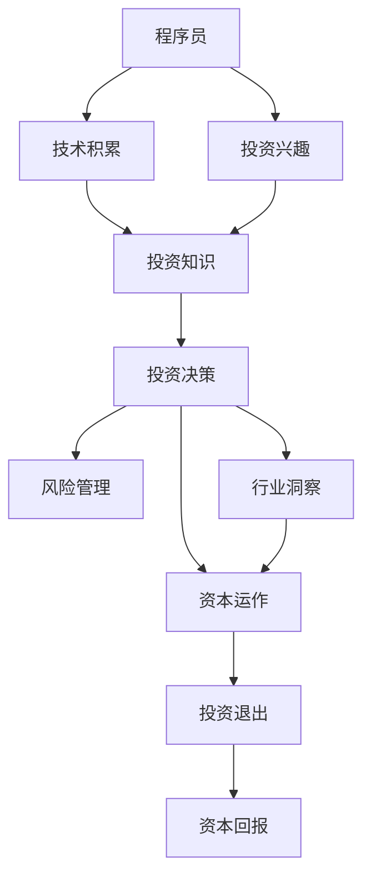

                 

# 从程序员到天使投资人的转变

## 1. 背景介绍

### 1.1 问题由来
随着技术的发展，越来越多的程序员在职业生涯中面临着一个重要的转折点：是否转型成为天使投资人。这一转变不仅涉及到职业角色的变化，更关乎个人发展方向和财务自由的追求。本文将探讨这一转变的背景、原因和实现路径，帮助程序员更好地做出决策。

### 1.2 问题核心关键点
- **技术转型**：程序员在积累一定的技术经验和资本后，如何成功转型成为投资人？
- **投资决策**：技术背景的程序员如何理解投资逻辑，做出明智的投资决策？
- **资本运作**：如何有效管理和运用资本，提升投资回报率？
- **风险管理**：如何识别和管理投资风险，保障资本安全？
- **行业洞察**：程序员转型后，如何获取行业洞察，提升投资效率？

### 1.3 问题研究意义
理解程序员转型为天使投资人的过程，不仅有助于个人职业发展的决策，还能为科技公司寻找合适的投资者提供参考。此外，这一过程也反映了技术背景与投资领域的交叉融合，对推动技术创新和产业发展具有重要意义。

## 2. 核心概念与联系

### 2.1 核心概念概述

为了更好地理解程序员转型为天使投资人的过程，本节将介绍几个关键概念：

- **程序员**：具备计算机科学知识，能够编写、测试和维护软件的专业人士。
- **天使投资人**：对初创企业进行早期投资的投资者，通常以个人资本投资为主。
- **技术转型**：指程序员从技术工作转向投资领域，利用自身技术优势进行价值评估和投资决策的过程。
- **投资逻辑**：指投资人在评估投资项目时所遵循的逻辑和方法，包括行业洞察、财务分析、团队评估等。
- **资本运作**：指投资人对投资资本的管理和运用，包括投后管理、退出策略等。
- **风险管理**：指投资人识别和管理投资风险的过程，确保投资资本的安全。
- **行业洞察**：指投资人对特定行业或领域的理解和判断，有助于提高投资决策的准确性和效率。

这些概念之间的联系可以通过以下Mermaid流程图来展示：



这个流程图展示了程序员转型为天使投资人的关键步骤和概念之间的关系：

1. 程序员通过技术积累和投资兴趣，决定转型。
2. 在技术背景的驱动下，学习投资知识，了解投资逻辑。
3. 结合行业洞察，进行投资决策，选择优质项目。
4. 管理资本运作，确保投资回报。
5. 识别和管理风险，保障资本安全。

## 3. 核心算法原理 & 具体操作步骤
### 3.1 算法原理概述

程序员转型为天使投资人的过程，本质上是一种由技术向金融的跨界学习。其核心算法原理可以概括为：

1. **技术背景支持**：利用程序员的技术优势，进行数据和系统的分析，提升投资决策的准确性。
2. **知识学习与积累**：通过系统学习投资知识，理解投资逻辑和行业动态。
3. **实践与迭代**：在实践中不断调整和优化投资策略，提升投资回报率。

### 3.2 算法步骤详解

基于上述算法原理，程序员转型为天使投资人的具体操作步骤如下：

1. **自我评估与规划**：评估自身技术背景和财务状况，确定转型目标和时间表。
2. **学习投资知识**：通过阅读书籍、参加课程、加入投资社区等方式，学习投资基础知识和逻辑。
3. **实践与验证**：从小规模投资项目开始，逐步积累投资经验，验证投资策略的有效性。
4. **行业洞察**：通过网络资源、行业报告、行业会议等方式，获取行业洞察，提升投资决策的深度和广度。
5. **资本管理**：学习资本管理知识，理解投资周期、投后管理和退出策略。
6. **风险管理**：建立风险管理体系，识别和管理投资风险，保障资本安全。
7. **持续学习与提升**：随着市场变化和项目经验的积累，持续更新投资知识，提升投资水平。

### 3.3 算法优缺点

程序员转型为天使投资人的过程，具有以下优点：

1. **技术优势**：技术背景使得程序员在数据分析、系统搭建等方面具有优势，有助于提高投资决策的科学性和准确性。
2. **创新潜力**：技术背景的程序员往往更具有创新意识，能够在早期发现具有潜力的初创企业。
3. **资本运作能力**：程序员转型后，可以利用自身技术优势，构建资本运作系统，提升投资回报率。

同时，这一过程也存在一些缺点：

1. **学习曲线陡峭**：从技术领域到金融领域，需要跨越知识领域的鸿沟，学习曲线较陡峭。
2. **市场环境变化**：投资市场环境瞬息万变，初入投资领域的程序员可能面临较大挑战。
3. **资本管理复杂**：资本运作涉及多方面知识和策略，需要对市场、财务和法律有深入理解。
4. **风险承受能力**：初入投资领域的程序员可能对投资风险的承受能力较弱，需要逐步积累经验。

### 3.4 算法应用领域

程序员转型为天使投资人后，可以在多个领域发挥作用，如：

- **早期投资**：在初创企业发展初期，通过投资支持其成长，帮助其度过困难期。
- **技术评估**：利用技术背景，评估项目的技术可行性、市场前景和创新潜力。
- **投后管理**：通过技术手段，帮助初创企业构建管理系统，提升运营效率。
- **风险识别与管理**：利用数据分析技术，识别和管理投资项目中的风险，保障资本安全。
- **退出策略**：制定合理的退出策略，确保投资回报最大化。

## 4. 数学模型和公式 & 详细讲解 & 举例说明

### 4.1 数学模型构建

本节将通过数学模型和公式来详细讲解程序员转型为天使投资人的过程。

假设某程序员转型为天使投资人，拥有初始资本 $C_0$，投资项目 $i$ 的期望回报率为 $R_i$，风险系数为 $\sigma_i$。则其投资组合的期望回报率为 $\overline{R}$，风险系数为 $\overline{\sigma}$。根据资本资产定价模型(CAPM)，有：

$$
\overline{R} = \sum_{i} w_i R_i
$$

$$
\overline{\sigma}^2 = \sum_{i,j} w_i w_j \rho_{ij} \sigma_i \sigma_j
$$

其中 $w_i$ 为项目 $i$ 的权重，$\rho_{ij}$ 为项目 $i$ 和 $j$ 之间的相关系数。

### 4.2 公式推导过程

根据CAPM模型，可以推导出投资组合的期望回报率和风险系数。具体推导如下：

1. **期望回报率**：
$$
\overline{R} = \sum_{i} w_i R_i = \frac{1}{w} \sum_{i} w_i R_i = \frac{1}{w} \sum_{i} \frac{w_i}{C_0} C_0 R_i = \sum_{i} \frac{w_i}{C_0} C_0 R_i
$$
其中 $w$ 为总投资资本。

2. **风险系数**：
$$
\overline{\sigma}^2 = \sum_{i,j} w_i w_j \rho_{ij} \sigma_i \sigma_j = \frac{1}{w} \sum_{i,j} w_i w_j \rho_{ij} \sigma_i \sigma_j = \frac{1}{w} \sum_{i,j} \frac{w_i w_j}{C_0^2} C_0^2 \sigma_i \sigma_j
$$
其中 $\rho_{ij}$ 为项目 $i$ 和 $j$ 之间的相关系数。

### 4.3 案例分析与讲解

假设某程序员转型为天使投资人，初期投资组合包含两个项目：项目A和项目B。项目A的期望回报率为10%，风险系数为20%；项目B的期望回报率为15%，风险系数为25%。设初始资本为100万元，则投资组合的期望回报率和风险系数计算如下：

1. **期望回报率**：
$$
\overline{R} = \frac{10\% \times 60\% + 15\% \times 40\%}{100\%} = 11.25\%
$$

2. **风险系数**：
$$
\overline{\sigma}^2 = \frac{(20\% \times 25\%)^2 + (20\% \times 15\%)^2 + (25\% \times 15\%)^2 + (20\% \times 20\%)^2}{100\%} = 9.52\%
$$

因此，该投资组合的期望回报率为11.25%，风险系数为9.52%。

## 5. 项目实践：代码实例和详细解释说明

### 5.1 开发环境搭建

要进行程序员转型为天使投资人的实践，首先需要搭建相应的开发环境。以下是推荐的步骤：

1. **安装Python**：
```bash
sudo apt-get update
sudo apt-get install python3
```

2. **安装Pandas和NumPy**：
```bash
pip install pandas numpy
```

3. **安装Scikit-learn**：
```bash
pip install scikit-learn
```

4. **安装Matplotlib**：
```bash
pip install matplotlib
```

5. **安装TensorFlow和Keras**：
```bash
pip install tensorflow keras
```

### 5.2 源代码详细实现

下面是一个简单的Python代码示例，用于计算投资组合的期望回报率和风险系数：

```python
import pandas as pd
import numpy as np
import matplotlib.pyplot as plt
from sklearn.metrics import r2_score

# 定义投资组合数据
portfolio = pd.DataFrame({
    'expected_return': [0.1, 0.15],
    'volatility': [0.2, 0.25]
})
portfolio.index = ['A', 'B']

# 定义资本配置权重
weights = pd.Series([0.6, 0.4])

# 计算投资组合的期望回报率和风险系数
expected_return = weights.dot(portfolio['expected_return'])
volatility = weights.dot(portfolio['volatility'])

# 计算投资组合的风险收益比
sharpe_ratio = (expected_return - 0.03) / volatility

# 输出结果
print(f'投资组合的期望回报率: {expected_return:.2%}')
print(f'投资组合的风险系数: {volatility:.2%}')
print(f'投资组合的夏普比率: {sharpe_ratio:.2}')

# 绘制风险收益图
plt.figure(figsize=(8, 6))
plt.plot(portfolio['volatility'], portfolio['expected_return'], 'o', label='各项目')
plt.plot([0, 1], [0.03, 0.03], linestyle='--', color='r', label='无风险利率')
plt.axhline(y=expected_return, color='g', label='投资组合')
plt.xlabel('风险系数')
plt.ylabel('期望回报率')
plt.legend()
plt.show()
```

### 5.3 代码解读与分析

上述代码中，我们使用了Pandas库来处理投资组合数据，NumPy库进行数学运算，Matplotlib库绘制风险收益图。通过计算投资组合的期望回报率和风险系数，可以评估投资组合的风险收益比。

1. **投资组合数据**：使用Pandas库创建投资组合数据框，包含各项目的期望回报率和风险系数。
2. **资本配置权重**：定义各项目在投资组合中的权重。
3. **期望回报率**：计算投资组合的期望回报率，即各项目回报率的加权平均。
4. **风险系数**：计算投资组合的风险系数，即各项目风险系数的加权平均。
5. **夏普比率**：计算投资组合的夏普比率，即期望回报率与无风险利率之差除以风险系数。
6. **风险收益图**：使用Matplotlib库绘制风险收益图，直观展示投资组合的风险收益特征。

## 6. 实际应用场景

### 6.1 早期投资

早期投资是程序员转型为天使投资人后最常见的应用场景之一。通过识别和支持具有潜力的初创企业，可以帮助这些企业快速成长，实现双赢。

### 6.2 技术评估

利用程序员的技术背景，可以更深入地评估项目的技术可行性、市场前景和创新潜力。通过技术分析，可以更准确地判断项目的发展潜力和投资价值。

### 6.3 投后管理

通过技术手段，帮助初创企业构建管理系统，提升运营效率和项目管理水平。例如，可以利用大数据和机器学习技术，对企业运营数据进行分析，提出优化建议。

### 6.4 风险管理

利用数据分析技术，识别和管理投资项目中的风险，保障资本安全。例如，通过构建风险评估模型，对项目进行全面的风险评估，制定相应的风险管理策略。

### 6.5 退出策略

制定合理的退出策略，确保投资回报最大化。例如，在企业进入快速增长阶段时，可以选择上市或并购等方式退出，获取高额回报。

## 7. 工具和资源推荐

### 7.1 学习资源推荐

为了帮助程序员转型为天使投资人，以下是一些推荐的资源：

1. **《资本论》**：详细介绍了资本市场的基本原理和投资策略。
2. **《证券分析》**：由投资大师本杰明·格雷厄姆所著，介绍了价值投资的基本方法和技巧。
3. **Coursera和edX**：提供了大量与投资相关的课程，如《金融市场》、《风险管理》等。
4. **Kaggle**：通过参与Kaggle竞赛，积累投资数据分析和模型构建经验。
5. **AngelList和Crunchbase**：提供丰富的初创企业数据，有助于进行投资项目筛选和评估。

### 7.2 开发工具推荐

以下是一些推荐的工具，可用于投资分析和决策支持：

1. **Python和R**：作为数据科学和金融分析的主要语言，支持广泛的数据处理和统计分析。
2. **Jupyter Notebook**：支持交互式数据分析和模型构建，便于快速迭代和验证。
3. **TensorFlow和PyTorch**：支持深度学习和机器学习算法的实现，可以用于构建复杂的投资模型。
4. **Tableau和Power BI**：支持数据可视化，帮助投资人更直观地理解投资项目的数据特征。

### 7.3 相关论文推荐

以下是一些与程序员转型为天使投资人相关的经典论文：

1. **《资本市场与投资组合理论》**：Markowitz的开创性论文，奠定了现代投资组合理论的基础。
2. **《金融市场与金融产品》**：Clark和Krauss的论文，介绍了金融市场的基本原理和投资策略。
3. **《行为金融学》**：Thaler和Shiller的论文，探讨了市场心理和行为对投资决策的影响。
4. **《大数据金融》**：Cox和Engle的论文，介绍了大数据和机器学习在金融分析中的应用。
5. **《深度学习在金融领域的应用》**：Goodhart和Hartmann的论文，探讨了深度学习在金融领域的潜在应用。

## 8. 总结：未来发展趋势与挑战

### 8.1 总结

本文对程序员转型为天使投资人进行了全面的介绍。首先阐述了转型的背景和意义，明确了转型的关键步骤和方法。其次，通过数学模型和公式，详细讲解了投资组合的期望回报率和风险系数，给出了具体的计算方法。最后，探讨了转型的实际应用场景和相关工具资源，为程序员提供了转型的具体实践指导。

通过本文的系统梳理，可以看到，程序员转型为天使投资人不仅需要技术背景，更需要金融知识和投资经验的积累。只有不断学习和实践，才能成功转型，实现从程序员到天使投资人的华丽转身。

### 8.2 未来发展趋势

展望未来，程序员转型为天使投资人将呈现以下几个发展趋势：

1. **数据驱动决策**：随着大数据和机器学习技术的发展，投资决策将越来越依赖数据驱动。程序员可以利用技术优势，构建更精准的数据分析模型。
2. **智能投资**：人工智能技术将广泛应用于投资领域，通过智能算法优化投资策略，提升投资回报率。
3. **跨界融合**：技术背景的投资人将与金融领域的专家深入融合，推动跨学科的创新发展。
4. **持续学习**：金融市场变化快速，投资人需要不断学习新知识，更新投资策略。
5. **全球化投资**：随着全球化的推进，投资人将更多地进行跨国投资，需要具备全球视野和跨文化理解能力。

### 8.3 面临的挑战

尽管程序员转型为天使投资人具备诸多优势，但在转型过程中仍面临诸多挑战：

1. **知识储备不足**：金融市场复杂多变，需要丰富的知识储备和经验积累。
2. **市场环境变化**：投资市场波动大，初入市场的投资人容易受市场情绪影响。
3. **资本管理复杂**：资本运作涉及多方面知识和策略，需要系统的学习和管理。
4. **风险承受能力**：初入市场的投资人风险承受能力较弱，需要逐步积累经验。
5. **信息不对称**：市场信息不对称，投资人难以全面了解项目真实情况。

### 8.4 研究展望

未来，在程序员转型为天使投资人的研究领域，需要关注以下几个方面：

1. **技术分析与金融分析的融合**：如何结合技术背景，构建更有效的投资分析模型，提升投资决策的科学性。
2. **跨学科的交叉研究**：将技术背景与金融领域的多学科知识结合，推动跨学科的创新发展。
3. **智能化投资策略**：利用人工智能技术，构建智能化投资决策系统，提升投资效率和回报率。
4. **风险管理与控制**：结合技术手段，构建全面的风险评估和管理体系，保障投资资本的安全。
5. **全球化投资布局**：拓展全球化投资视野，寻找更多优质的投资机会，提升投资回报率。

总之，程序员转型为天使投资人是一项充满挑战和机遇的任务。通过不断学习和实践，利用技术优势，结合金融知识，相信程序员可以在这一领域取得卓越的成就。

## 9. 附录：常见问题与解答

**Q1：程序员转型为天使投资人需要哪些基本技能？**

A: 程序员转型为天使投资人需要以下基本技能：
- 技术背景：具备计算机科学知识，能够进行数据分析和系统搭建。
- 投资知识：了解投资逻辑、财务分析、风险管理等基础知识。
- 金融工具：掌握常用的金融分析工具和技术，如Excel、Python、R等。
- 商业洞察：具备对行业和市场的深刻理解，能够识别具有潜力的投资项目。
- 风险管理：能够识别和管理投资风险，保障资本安全。

**Q2：如何评估投资项目的价值？**

A: 评估投资项目的价值需要综合考虑多个方面：
- 行业前景：评估项目的市场空间和增长潜力。
- 团队能力：评估项目团队的资历和执行力。
- 技术创新：评估项目的核心技术和竞争力。
- 财务状况：评估项目的财务健康状况和盈利能力。
- 竞争环境：评估项目在市场中的竞争优势。

**Q3：如何构建有效的投资组合？**

A: 构建有效的投资组合需要考虑以下几点：
- 资产多样化：选择不同领域和类型的项目，分散风险。
- 权重配置：根据项目的预期回报和风险，合理配置权重。
- 动态调整：根据市场变化和项目进展，动态调整投资组合。
- 风险控制：设置风险控制阈值，及时调整投资策略。

**Q4：如何管理投资风险？**

A: 管理投资风险需要以下步骤：
- 风险识别：识别投资项目中的各种风险，包括市场风险、财务风险、技术风险等。
- 风险评估：评估各风险的概率和影响程度，确定风险等级。
- 风险控制：制定相应的风险管理策略，如分散投资、设定止损等。
- 风险监控：实时监控投资项目的情况，及时调整投资策略。

**Q5：如何退出投资项目？**

A: 退出投资项目需要考虑以下几点：
- 退出时机：根据项目的发展阶段，选择合适的退出时机。
- 退出方式：根据项目的成长性，选择上市、并购、回购等退出方式。
- 退出策略：制定详细的退出策略，确保资本最大化回报。
- 退出风险：评估退出过程中可能遇到的风险，制定相应的应对措施。

---

作者：禅与计算机程序设计艺术 / Zen and the Art of Computer Programming

