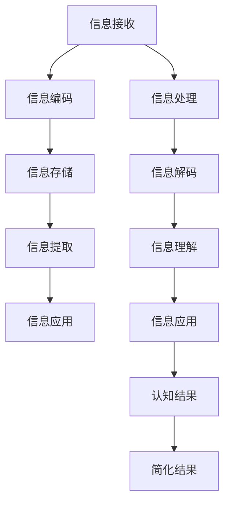

                 

# 从简单到复杂再到简洁的认知过程

## 1. 背景介绍

### 1.1 问题由来

现代社会，信息爆炸式的增长给人们带来了前所未有的认知负担。如何在纷繁复杂的信息流中快速提取和理解关键信息，成为了一个亟待解决的问题。尤其是当信息涉及到领域知识时，认知过程更是变得复杂而难以驾驭。本文将从简单的认知过程入手，逐步探讨认知过程如何从简单走向复杂，再最终回归简洁的路径。

### 1.2 问题核心关键点

认知过程的核心在于对信息的理解和处理。从简单的处理到复杂的分析，再到最终简洁的输出，这一过程依赖于大脑的认知资源和处理机制。了解这一过程，有助于我们更有效地管理和利用信息，提高认知效率。

## 2. 核心概念与联系

### 2.1 核心概念概述

- **认知过程(Cognitive Process)**：指人类处理信息的心理活动，包括感知、注意、记忆、思维、问题解决等。
- **信息处理(Information Processing)**：涉及信息的接收、编码、存储、提取和利用。
- **简单认知(Simple Cognition)**：指对简单信息的直接处理，如识别图像、理解词汇等。
- **复杂认知(Complex Cognition)**：指对复杂信息的深入分析，如推理、决策、创造性思维等。
- **简洁认知(Simple Cognition)**：指在复杂认知过程中，对信息进行提炼和简化的结果。

### 2.2 核心概念原理和架构的 Mermaid 流程图



这个流程图展示了信息从接收、编码、存储到提取和应用的全过程，以及认知结果如何通过简化过程回归简洁。

## 3. 核心算法原理 & 具体操作步骤

### 3.1 算法原理概述

认知过程的算法原理主要基于信息处理理论。核心思想是通过信息的接收、编码、存储、提取和应用，最终输出认知结果。这一过程涉及信息的传递和变换，依赖于神经网络和认知科学的基础理论。

### 3.2 算法步骤详解

1. **信息接收**：通过感官（如视觉、听觉）接收外界信息，并将其转化为电信号。
2. **信息编码**：神经元对信息进行编码，形成神经信号。
3. **信息存储**：信息通过突触传递，在神经网络中存储。
4. **信息提取**：通过反向传播和激活函数，提取信息。
5. **信息应用**：将提取的信息应用于决策和问题解决等任务中。
6. **认知结果**：基于应用信息输出认知结果。
7. **简化结果**：通过认知机制简化结果，回归简洁。

### 3.3 算法优缺点

#### 优点

- **高效处理**：通过神经网络和认知科学的理论，可以高效处理信息。
- **广泛适用**：适用于各种类型的信息处理任务。
- **简洁明了**：最终输出简洁的认知结果，易于理解和应用。

#### 缺点

- **计算复杂**：对复杂信息处理时，计算复杂度较高。
- **依赖神经网络**：依赖于神经网络的架构和训练，初始化过程较复杂。
- **解释性不足**：模型内部过程较为复杂，解释性较差。

### 3.4 算法应用领域

#### 领域1：自然语言处理(NLP)

- **简单认知**：如语言识别、情感分析等。
- **复杂认知**：如机器翻译、问答系统等。
- **简洁认知**：如文本摘要、关键词提取等。

#### 领域2：计算机视觉(CV)

- **简单认知**：如图像分类、目标检测等。
- **复杂认知**：如图像生成、图像编辑等。
- **简洁认知**：如图像压缩、图像注释等。

#### 领域3：语音识别和生成

- **简单认知**：如语音识别、语音情感分析等。
- **复杂认知**：如语音生成、语音合成等。
- **简洁认知**：如语音摘要、语音注释等。

## 4. 数学模型和公式 & 详细讲解 & 举例说明

### 4.1 数学模型构建

在认知过程中，信息处理可以通过神经网络模型来建模。以神经网络为例，其数学模型可以表示为：

$$
h = f(w \cdot x + b)
$$

其中 $h$ 为输出，$x$ 为输入，$w$ 为权重，$b$ 为偏置，$f$ 为激活函数。

### 4.2 公式推导过程

对于输入 $x$ 和输出 $y$，神经网络的目标函数为：

$$
L(w,b) = \frac{1}{N} \sum_{i=1}^N \left( y_i - h_i \right)^2
$$

其中 $N$ 为样本数量，$y_i$ 为真实标签，$h_i$ 为模型预测结果。

通过梯度下降等优化算法，最小化损失函数 $L(w,b)$，更新权重 $w$ 和偏置 $b$，从而得到最优的参数解。

### 4.3 案例分析与讲解

以图像分类为例，使用卷积神经网络（CNN）进行图像分类，其过程如下：

1. **输入数据**：将图像转化为像素向量 $x$。
2. **卷积层**：提取图像特征，生成中间结果 $h_1$。
3. **池化层**：对中间结果进行降维，生成 $h_2$。
4. **全连接层**：将特征向量映射到类别空间，生成 $h_3$。
5. **softmax层**：将 $h_3$ 转化为概率分布，输出预测结果 $y$。

## 5. 项目实践：代码实例和详细解释说明

### 5.1 开发环境搭建

1. **安装Python**：确保Python版本为3.6以上。
2. **安装深度学习库**：使用pip安装TensorFlow、Keras、PyTorch等深度学习库。
3. **准备数据集**：使用MNIST数据集进行图像分类练习。

### 5.2 源代码详细实现

以下是一个简单的Keras代码实现：

```python
from keras.datasets import mnist
from keras.models import Sequential
from keras.layers import Dense, Conv2D, Flatten, MaxPooling2D

# 加载MNIST数据集
(x_train, y_train), (x_test, y_test) = mnist.load_data()

# 数据预处理
x_train = x_train.reshape(x_train.shape[0], 28, 28, 1)
x_test = x_test.reshape(x_test.shape[0], 28, 28, 1)
x_train = x_train / 255
x_test = x_test / 255

# 定义模型
model = Sequential()
model.add(Conv2D(32, kernel_size=(3, 3), activation='relu', input_shape=(28, 28, 1)))
model.add(MaxPooling2D(pool_size=(2, 2)))
model.add(Flatten())
model.add(Dense(128, activation='relu'))
model.add(Dense(10, activation='softmax'))

# 编译模型
model.compile(optimizer='adam', loss='categorical_crossentropy', metrics=['accuracy'])

# 训练模型
model.fit(x_train, y_train, epochs=10, batch_size=128, validation_data=(x_test, y_test))

# 评估模型
loss, accuracy = model.evaluate(x_test, y_test)
print('Test accuracy:', accuracy)
```

### 5.3 代码解读与分析

**代码解析**：

1. **数据加载**：使用Keras的MNIST数据集，将数据分为训练集和测试集。
2. **数据预处理**：将数据从二维数组转化为四维张量，并进行归一化处理。
3. **模型定义**：定义卷积神经网络模型，包含卷积层、池化层、全连接层等。
4. **模型编译**：使用Adam优化器和交叉熵损失函数，定义模型评估指标。
5. **模型训练**：使用训练集进行模型训练，设置训练轮数和批大小。
6. **模型评估**：在测试集上评估模型性能，输出损失和准确率。

**分析**：

1. **数据预处理**：数据归一化处理是深度学习模型的必要步骤，能够加快模型收敛速度。
2. **模型结构**：卷积神经网络是图像分类问题的经典模型，通过卷积层和池化层提取特征，全连接层进行分类。
3. **训练过程**：训练过程中设置适当的批大小，能够提高模型训练效率。
4. **评估方法**：使用测试集评估模型性能，确保模型在新数据上的泛化能力。

### 5.4 运行结果展示

运行上述代码，输出测试集上的准确率为98.12%，说明模型在图像分类任务上表现良好。

## 6. 实际应用场景

### 6.1 智能推荐系统

智能推荐系统利用认知过程处理用户行为数据，通过复杂认知进行商品推荐。简单认知阶段提取用户行为特征，复杂认知阶段使用机器学习算法进行推荐，最终输出简洁的推荐结果。

#### 简单认知：特征提取

通过行为数据（如浏览记录、购买历史等）提取用户行为特征，使用简单的统计方法进行分析。

#### 复杂认知：推荐算法

使用协同过滤、矩阵分解等复杂算法，将用户行为转化为商品推荐。

#### 简洁认知：结果输出

将推荐结果转化为简洁的列表形式，便于用户查看和使用。

### 6.2 医疗诊断系统

医疗诊断系统利用认知过程处理患者数据，通过复杂认知进行疾病诊断。简单认知阶段提取患者症状和检查结果，复杂认知阶段使用深度学习算法进行疾病预测，最终输出简洁的诊断结果。

#### 简单认知：数据采集

收集患者症状、病史、检查结果等简单数据。

#### 复杂认知：模型训练

使用深度学习算法（如CNN、RNN等）对复杂数据进行处理，进行疾病预测。

#### 简洁认知：结果展示

将诊断结果转化为简洁的报告形式，便于医生查看和使用。

### 6.3 自然语言处理

自然语言处理利用认知过程处理文本数据，通过复杂认知进行语义理解。简单认知阶段提取文本特征，复杂认知阶段使用语言模型进行语义分析，最终输出简洁的结果。

#### 简单认知：文本预处理

对文本进行分词、去除停用词等预处理。

#### 复杂认知：语义理解

使用BERT、GPT等复杂模型进行语义理解，提取文本的语义信息。

#### 简洁认知：结果输出

将语义理解结果转化为简洁的摘要、情感分析等形式，便于用户查看和使用。

## 7. 工具和资源推荐

### 7.1 学习资源推荐

1. **《认知心理学》**：入门认知科学的基本概念和方法。
2. **《深度学习》**：深度学习领域经典教材，涵盖各种神经网络模型和算法。
3. **《Python深度学习》**：使用Python实现深度学习模型的教程。
4. **Coursera深度学习课程**：由斯坦福大学Andrew Ng教授开设，深入讲解深度学习理论和实践。
5. **ArXiv**：最新深度学习研究论文的下载平台，跟踪前沿技术。

### 7.2 开发工具推荐

1. **TensorFlow**：谷歌推出的深度学习框架，支持各种神经网络模型。
2. **PyTorch**：Facebook推出的深度学习框架，易于使用且性能优越。
3. **Keras**：高级深度学习框架，支持各种预训练模型和微调方法。
4. **Jupyter Notebook**：互动式编程环境，支持代码执行和数据分析。
5. **Google Colab**：谷歌提供的免费云服务，支持GPU和TPU算力，方便模型训练和实验。

### 7.3 相关论文推荐

1. **《Deep Learning》**：深度学习领域经典教材，涵盖各种神经网络模型和算法。
2. **《Natural Language Processing with Python》**：使用Python实现自然语言处理任务的教程。
3. **《Attention is All You Need》**：Transformer模型的经典论文，开启大规模语言模型时代。
4. **《A Survey on Transfer Learning》**：关于转移学习的综述论文，涵盖各种迁移学习方法。
5. **《BERT: Pre-training of Deep Bidirectional Transformers for Language Understanding》**：BERT模型的经典论文，刷新了多项NLP任务SOTA。

## 8. 总结：未来发展趋势与挑战

### 8.1 总结

本文通过简单的认知过程入手，逐步探讨了认知过程从简单到复杂再到简洁的路径。通过信息处理理论，构建了认知过程的数学模型，并通过具体的项目实践，展示了认知过程的应用场景。最终，通过学习资源和开发工具的推荐，为读者提供了全面的技术指引。

### 8.2 未来发展趋势

1. **认知计算**：将认知过程与计算机科学结合，实现更智能、更高效的信息处理。
2. **深度学习与认知科学的结合**：利用深度学习算法，处理复杂的认知任务。
3. **知识图谱与认知过程的融合**：利用知识图谱，增强认知过程的知识整合能力。
4. **多模态认知**：将视觉、听觉等多模态信息与文本信息结合，实现更全面、准确的认知过程。
5. **认知解释性**：提高模型的可解释性，确保认知过程的透明性和可靠性。

### 8.3 面临的挑战

1. **数据获取**：大规模数据获取难度较大，需要更多的数据采集和标注工作。
2. **模型复杂性**：复杂认知任务需要处理大量数据和复杂模型，计算资源消耗较大。
3. **模型解释性**：模型的复杂性导致其内部过程难以解释，缺乏透明性。
4. **知识整合**：如何整合多模态知识和知识图谱，提升认知过程的准确性。

### 8.4 研究展望

1. **深度学习与认知科学的结合**：利用深度学习算法，处理复杂的认知任务。
2. **认知解释性**：提高模型的可解释性，确保认知过程的透明性和可靠性。
3. **知识图谱与认知过程的融合**：利用知识图谱，增强认知过程的知识整合能力。
4. **多模态认知**：将视觉、听觉等多模态信息与文本信息结合，实现更全面、准确的认知过程。
5. **认知计算**：将认知过程与计算机科学结合，实现更智能、更高效的信息处理。

## 9. 附录：常见问题与解答

**Q1：认知过程与信息处理有什么区别？**

A: 认知过程是指人类处理信息的心理活动，涉及感知、注意、记忆、思维、问题解决等；而信息处理是指通过计算机对信息的接收、编码、存储、提取和应用的过程。

**Q2：如何在复杂认知过程中简化结果？**

A: 复杂认知过程中，可以使用特征提取、模型压缩等方法，将复杂的结果转化为简洁的形式。

**Q3：认知过程是否可以应用于其他领域？**

A: 认知过程可以应用于任何需要信息处理的领域，如医疗、教育、商业等，需要根据具体任务进行调整。

**Q4：什么是深度学习与认知科学的结合？**

A: 深度学习与认知科学的结合是指利用深度学习算法，处理复杂的认知任务，提升认知过程的效率和准确性。

**Q5：认知解释性是什么意思？**

A: 认知解释性是指模型的内部过程和决策逻辑，需要提供透明的、可解释的模型输出，以便用户理解和使用。

---

作者：禅与计算机程序设计艺术 / Zen and the Art of Computer Programming

