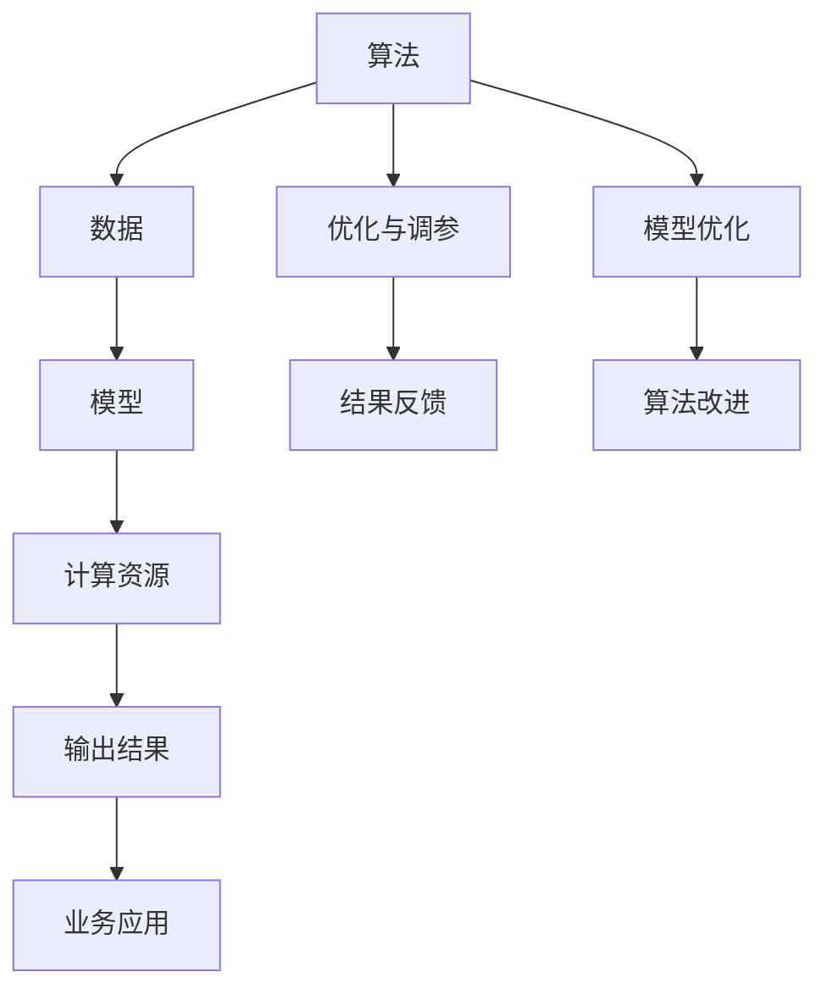

                 

## 1. 背景介绍

### 1.1 问题由来

随着人工智能(AI)技术的发展，越来越多的企业和研究机构开始采用AI技术提升业务效率和决策水平。然而，随着算力需求的激增，传统的基于服务器硬件的云计算模式逐渐显现出瓶颈，如何高效利用AI算力成为当前研究的热点话题。本文旨在通过介绍AI领域的算法和算力两方面的最新进展，展示AI发展的全景图，并探讨如何实现算力与算法的高效结合。

### 1.2 问题核心关键点

AI发展依赖于两大关键因素：算法和算力。算法决定了AI技术的功能和性能，而算力则提供了AI技术实现的基础。两者的结合是实现AI应用的根本保障。如何高效结合算法和算力，并进一步优化，是当前AI领域亟需解决的挑战。

## 2. 核心概念与联系

### 2.1 核心概念概述

AI技术的发展离不开算法和算力的不断突破。算法是AI技术实现的基础，算力是算法实现的保障。算法与算力相互依存，相辅相成，共同推动AI技术的进步。

### 2.2 核心概念原理和架构的 Mermaid 流程图



这个流程图展示了AI技术实现的基本流程：算法通过数据学习得到模型，模型在计算资源上执行计算，得到输出结果，最终用于业务应用。同时，算法和模型通过优化调参和模型改进不断提升性能，计算资源则通过优化算法和数据分布提升效率，反馈结果指导算法的进一步改进。

## 3. 核心算法原理 & 具体操作步骤

### 3.1 算法原理概述

AI算法可以分为监督学习、无监督学习、强化学习等几大类。这些算法通过不同的学习方式，从数据中学习并提取特征，实现对数据的预测、分类、聚类、规划等任务。本文重点介绍监督学习和强化学习的基本原理。

#### 3.1.1 监督学习

监督学习算法通过带有标签的数据集进行训练，学习输入和输出之间的关系。常用的监督学习算法包括决策树、随机森林、支持向量机、神经网络等。监督学习算法需要大量标注数据，且模型泛化能力较强，适用于分类、回归等任务。

#### 3.1.2 强化学习

强化学习算法通过与环境交互，根据当前状态和动作获得奖励，逐步学习最优策略。常用的强化学习算法包括Q-learning、深度强化学习等。强化学习算法适用于游戏、机器人控制等需要动态决策的任务。

### 3.2 算法步骤详解

#### 3.2.1 监督学习算法步骤

1. 数据预处理：对数据进行清洗、归一化等处理，提高数据质量。
2. 特征工程：从原始数据中提取有意义的特征，构建输入向量。
3. 模型训练：使用训练数据集训练模型，调整模型参数。
4. 模型评估：使用验证数据集评估模型性能，防止过拟合。
5. 模型优化：根据评估结果调整模型参数，优化模型性能。
6. 模型应用：将优化后的模型应用于实际业务，解决具体问题。

#### 3.2.2 强化学习算法步骤

1. 环境建模：确定任务环境和动作空间，构建环境模型。
2. 策略定义：定义当前状态下的动作策略，如Q-learning中的Q值表。
3. 训练策略：通过与环境交互，逐步调整策略，学习最优动作。
4. 评估策略：使用测试数据评估策略性能，防止过拟合。
5. 策略优化：根据评估结果调整策略参数，优化策略性能。
6. 策略应用：将优化后的策略应用于实际业务，实现动态决策。

### 3.3 算法优缺点

#### 3.3.1 监督学习算法优缺点

优点：
- 模型泛化能力强，适用于各种任务。
- 具有较高的准确性和稳定性，适合复杂场景。

缺点：
- 需要大量标注数据，数据获取成本高。
- 模型复杂度高，训练时间较长。
- 对数据分布变化敏感，泛化能力有待提升。

#### 3.3.2 强化学习算法优缺点

优点：
- 能够动态调整策略，适应环境变化。
- 适用于需要实时决策的场景，如游戏、机器人控制等。

缺点：
- 需要大量试错，学习过程较为复杂。
- 策略效果依赖于环境建模的准确性，难以在复杂环境中应用。
- 存在过拟合风险，策略泛化能力不足。

### 3.4 算法应用领域

#### 3.4.1 监督学习应用领域

1. 图像识别：如OCR、图像分类等，通过卷积神经网络(CNN)等算法实现。
2. 语音识别：如语音转文字、语音命令识别等，通过循环神经网络(RNN)等算法实现。
3. 自然语言处理：如机器翻译、文本分类等，通过Transformer等算法实现。

#### 3.4.2 强化学习应用领域

1. 游戏AI：如AlphaGo、OpenAI Five等，通过强化学习算法实现。
2. 机器人控制：如无人机飞行控制、工业机器人操作等，通过强化学习算法实现。
3. 交通规划：如交通流量优化、自动驾驶等，通过强化学习算法实现。

## 4. 数学模型和公式 & 详细讲解 & 举例说明

### 4.1 数学模型构建

AI算法的数学模型通常包括以下几部分：
- 输入数据：$X$，用于描述问题的输入特征。
- 模型参数：$\theta$，用于学习数据的规律。
- 输出结果：$Y$，用于预测或分类问题的结果。
- 损失函数：$L$，用于衡量模型预测与真实结果之间的差异。
- 优化器：$Opt$，用于更新模型参数，最小化损失函数。

### 4.2 公式推导过程

以监督学习中的神经网络为例，其数学模型可以表示为：

$$
Y = f(X;\theta) = \sigma(WX + b)
$$

其中$f$为激活函数，$W$为权重矩阵，$b$为偏置向量。损失函数通常采用交叉熵损失：

$$
L = -\frac{1}{N}\sum_{i=1}^N \sum_{j=1}^C y_{ij}\log f_{ij} + (1-y_{ij})\log(1-f_{ij})
$$

其中$y_{ij}$为真实标签，$f_{ij}$为神经网络输出的概率值。优化器通常采用随机梯度下降法：

$$
\theta \leftarrow \theta - \eta \nabla_{\theta}L
$$

其中$\eta$为学习率，$\nabla_{\theta}L$为损失函数对模型参数的梯度。

### 4.3 案例分析与讲解

以AlphaGo为例，分析强化学习算法的具体实现。AlphaGo通过蒙特卡罗树搜索(MCTS)算法，在围棋对弈环境中逐步学习最优策略。具体步骤如下：

1. 初始化策略网络：使用神经网络训练得到一个策略网络，用于生成候选动作。
2. 与环境交互：通过策略网络生成候选动作，选择最优动作进行执行。
3. 评估动作效果：根据执行动作后的状态和奖励，更新策略网络参数。
4. 重复执行：不断迭代执行以上步骤，直至策略收敛。

## 5. 项目实践：代码实例和详细解释说明

### 5.1 开发环境搭建

#### 5.1.1 环境依赖

- Python 3.8
- TensorFlow 2.5
- scikit-learn
- pandas
- numpy

#### 5.1.2 环境安装

1. 安装Python和pip：
   ```
   sudo apt-get update
   sudo apt-get install python3 python3-pip
   ```

2. 安装TensorFlow：
   ```
   pip install tensorflow
   ```

3. 安装其他依赖库：
   ```
   pip install scikit-learn pandas numpy
   ```

### 5.2 源代码详细实现

#### 5.2.1 数据预处理

```python
import pandas as pd
import numpy as np
from sklearn.model_selection import train_test_split

# 读取数据
data = pd.read_csv('data.csv')

# 数据预处理
data['age'] = np.log(data['age'])
data['income'] = (data['income'] - data['income'].mean()) / data['income'].std()

# 分割数据集
X_train, X_test, y_train, y_test = train_test_split(data.drop(['income'], axis=1), data['income'], test_size=0.2, random_state=42)
```

#### 5.2.2 模型构建与训练

```python
from tensorflow.keras.models import Sequential
from tensorflow.keras.layers import Dense
from tensorflow.keras.optimizers import Adam

# 定义模型
model = Sequential()
model.add(Dense(64, input_dim=5, activation='relu'))
model.add(Dense(1, activation='sigmoid'))

# 编译模型
model.compile(loss='binary_crossentropy', optimizer=Adam(lr=0.001), metrics=['accuracy'])

# 训练模型
model.fit(X_train, y_train, epochs=50, batch_size=32, validation_data=(X_test, y_test))
```

#### 5.2.3 模型评估

```python
from sklearn.metrics import accuracy_score

# 评估模型
y_pred = model.predict(X_test)
y_pred = np.round(y_pred).astype(int)
accuracy = accuracy_score(y_test, y_pred)
print(f'模型准确率：{accuracy:.2f}')
```

### 5.3 代码解读与分析

#### 5.3.1 数据预处理

数据预处理是模型训练的基础。在实际应用中，数据往往需要清洗、归一化等预处理操作，提高数据质量，提升模型性能。

#### 5.3.2 模型构建

模型构建需要根据具体任务选择合适的模型结构和激活函数。在本文的实例中，使用了神经网络模型，并设置了两个全连接层。

#### 5.3.3 模型训练与评估

模型训练采用随机梯度下降法，通过交叉熵损失函数优化模型参数，得到模型预测结果。模型评估通过准确率等指标，衡量模型性能。

### 5.4 运行结果展示

在训练完成后，可以通过可视化工具，如TensorBoard，观察模型训练过程，调整模型参数，优化模型性能。

## 6. 实际应用场景

### 6.1 智慧医疗

在智慧医疗领域，AI技术可以应用于疾病诊断、药物研发、患者管理等各个环节。通过监督学习算法，医生可以自动分析患者病历，给出诊断建议。通过强化学习算法，AI可以帮助医生制定最优治疗方案，优化诊疗流程。

### 6.2 金融风控

在金融领域，AI技术可以应用于风险评估、欺诈检测、资产管理等任务。通过监督学习算法，AI可以分析历史交易数据，预测交易风险。通过强化学习算法，AI可以实时监测交易行为，及时发现异常交易，保障金融安全。

### 6.3 智能制造

在智能制造领域，AI技术可以应用于生产调度、质量控制、设备维护等任务。通过监督学习算法，AI可以优化生产流程，提高生产效率。通过强化学习算法，AI可以自动调整设备参数，保障生产质量。

## 7. 工具和资源推荐

### 7.1 学习资源推荐

1. 《深度学习》课程：斯坦福大学提供，涵盖了深度学习的基本理论和应用实例，适合入门学习。
2. TensorFlow官方文档：详细介绍了TensorFlow的使用方法和最佳实践，是学习TensorFlow的重要资源。
3. PyTorch官方文档：详细介绍了PyTorch的使用方法和最佳实践，适合使用PyTorch进行模型开发。
4. Kaggle竞赛：参与Kaggle竞赛可以锻炼实际应用能力，积累实战经验。

### 7.2 开发工具推荐

1. Jupyter Notebook：免费、易用的交互式编程环境，支持多语言开发，适合快速原型开发。
2. Anaconda：科学计算平台，提供Python环境、数据管理、包管理等功能，适合大规模数据处理和模型开发。
3. TensorBoard：可视化工具，可实时监测模型训练过程，帮助优化模型参数。

### 7.3 相关论文推荐

1. "Deep Learning" by Ian Goodfellow, Yoshua Bengio, and Aaron Courville。
2. "TensorFlow: A System for Large-Scale Machine Learning" by Martin Abadi et al.
3. "PyTorch: Tensors and Dynamic neural networks in Python with strong GPU acceleration" by Jeffrey J. Long et al.

## 8. 总结：未来发展趋势与挑战

### 8.1 总结

本文从算法和算力两个角度，全面介绍了AI技术的核心内容，展示了AI发展的全景图。算法是AI技术实现的基础，算力是算法实现的保障。AI算法通过不断改进，在多个领域取得了显著成果。算力则通过硬件、软件等多方面的优化，不断提升AI技术的性能和效率。

### 8.2 未来发展趋势

1. 算法的多样化：未来将出现更多先进的算法模型，如神经网络、深度强化学习等，推动AI技术的应用范围和性能。
2. 算力的持续提升：AI技术的发展离不开算力的提升，未来将通过更多的计算资源、更高效的算法实现算力提升。
3. 跨学科融合：AI技术与其它学科的融合，将推动AI技术在更多领域的应用，如医学、金融、制造等。
4. 标准化和规范化：AI技术的标准化和规范化，将促进AI技术的普及和应用，提高技术可靠性。

### 8.3 面临的挑战

1. 数据隐私和安全：AI技术的应用涉及到大量的数据，如何保护数据隐私和安全是一个重要挑战。
2. 技术复杂性：AI技术的实现需要高水平的技术能力，如何降低技术门槛，普及AI技术，是一个重要课题。
3. 伦理和社会影响：AI技术的应用可能带来伦理和社会问题，如就业、道德等，如何应对这些挑战，是一个重要问题。

### 8.4 研究展望

1. 隐私保护技术：研究数据隐私保护技术，保护用户隐私，防止数据泄露。
2. 开源社区发展：建立开源社区，推动AI技术普及，降低技术门槛。
3. 伦理与社会影响研究：研究AI技术的伦理和社会影响，制定相应的规范和标准。

## 9. 附录：常见问题与解答

**Q1: AI算法的优势是什么？**

A: AI算法的优势在于能够从大量数据中学习到复杂的规律，具有较高的泛化能力和适应性，能够在不同的数据集上表现优异。

**Q2: 如何优化AI算法？**

A: 优化AI算法可以从以下几个方面入手：
- 数据预处理：对数据进行清洗、归一化等处理，提高数据质量。
- 模型选择：选择适合问题的算法模型，如监督学习、强化学习等。
- 参数调优：通过交叉验证、网格搜索等方法，优化模型参数。
- 模型集成：通过模型集成，提升模型性能和鲁棒性。

**Q3: 如何提升AI算法的效率？**

A: 提升AI算法效率可以从以下几个方面入手：
- 数据并行：通过数据并行化，利用多台机器同时处理数据，提高计算效率。
- 模型并行：通过模型并行化，利用多台机器同时处理模型计算，提高计算效率。
- 量化加速：将浮点模型转为定点模型，压缩存储空间，提高计算效率。
- 模型压缩：通过模型压缩，去除不必要的参数，减小模型大小，提高推理速度。

**Q4: 如何保障AI算法的安全性？**

A: 保障AI算法的安全性可以从以下几个方面入手：
- 数据隐私保护：对敏感数据进行脱敏处理，防止数据泄露。
- 模型透明性：提高模型的透明性和可解释性，防止黑箱操作。
- 安全审计：定期进行安全审计，检测模型的漏洞和安全隐患。
- 异常检测：建立异常检测机制，及时发现异常情况，防止攻击。

**Q5: AI技术的发展方向是什么？**

A: AI技术的发展方向包括：
- 算法多样化：研究更多先进的算法模型，如神经网络、深度强化学习等。
- 算力提升：通过硬件、软件优化，提升AI技术的计算效率和性能。
- 跨学科融合：推动AI技术与其他学科的融合，拓展应用领域。
- 标准化和规范化：推动AI技术标准化和规范化，提升技术可靠性和普及性。

---

作者：禅与计算机程序设计艺术 / Zen and the Art of Computer Programming

