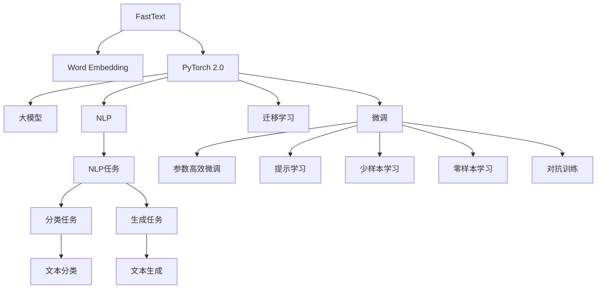

                 

# 从零开始大模型开发与微调：FastText训练及其与PyTorch 2.0的协同使用

> 关键词：深度学习, FastText, PyTorch 2.0, 自然语言处理(NLP), 大模型开发, 微调

## 1. 背景介绍

### 1.1 问题由来
深度学习技术在自然语言处理(Natural Language Processing, NLP)领域的突破性进展，尤其是基于预训练语言模型(Pre-trained Language Models, PLMs)的大模型出现，极大地提升了NLP任务的性能。然而，构建和优化大模型并非易事，需要从数据预处理、模型设计、训练优化等多个环节进行系统化的考量。本文将聚焦于FastText模型在构建大模型中的应用，以及FastText模型与PyTorch 2.0框架的协同使用，探讨大模型的开发与微调技术。

### 1.2 问题核心关键点
构建大模型主要涉及以下几个关键点：
- 选择合适的预训练数据集，如维基百科、新闻、书籍等，进行语料预处理，去除停用词、标点等。
- 设计合适的模型结构，如使用Word2Vec、FastText、BERT等，考虑词向量的维度、上下文窗口大小等超参数。
- 训练过程的优化，如批量大小、学习率、正则化等，确保模型收敛稳定。
- 模型微调，即在大模型基础上，使用下游任务的少量标注数据进行有监督学习，提升模型在特定任务上的性能。

本文将详细讲解如何基于FastText进行大模型的开发和微调，并展示FastText与PyTorch 2.0的协同应用，帮助读者系统掌握大模型构建的各个环节。

### 1.3 问题研究意义
构建大模型在NLP领域具有重要意义，主要体现在以下几个方面：
1. 提升模型性能：大模型能够更好地捕捉语言中的隐含关系和语义信息，显著提高模型的预测精度。
2. 减少从头训练成本：利用预训练大模型，可以大幅减少标注数据和计算资源的投入，加快模型训练和调优。
3. 促进知识迁移：大模型能够学习通用的语言表示，通过微调可以适应多种下游任务，实现知识的迁移应用。
4. 推动产业应用：大模型的构建与应用，能够加速NLP技术的产业化进程，为各行各业带来变革性影响。

## 2. 核心概念与联系

### 2.1 核心概念概述

为更好地理解FastText模型及其与PyTorch 2.0的协同使用，本节将介绍几个密切相关的核心概念：

- FastText：Facebook开发的基于n-gram的词向量模型，能够处理子词和罕见词，显著提高了词向量的质量。
- PyTorch 2.0：由Facebook开发的深度学习框架，提供强大的张量计算能力、动态图机制和丰富的工具库，支持快速迭代开发。
- 大模型：以Transformer、BERT为代表的，大规模预训练语言模型，具备丰富的语言知识和泛化能力，是当前NLP领域的研究热点。
- 微调(Fine-tuning)：在预训练模型基础上，使用下游任务的少量标注数据，通过有监督学习优化模型性能。
- 迁移学习(Transfer Learning)：将一个领域学习到的知识，迁移应用到另一个领域的学习范式，大模型的预训练-微调过程即是一种典型的迁移学习方式。
- 自然语言处理(NLP)：涉及语言理解、生成、推理等人工智能技术的交叉学科，FastText和大模型在NLP中得到了广泛应用。

这些核心概念之间的逻辑关系可以通过以下Mermaid流程图来展示：



这个流程图展示了大模型的核心概念及其之间的联系：

1. FastText作为词嵌入工具，提供高质量的词向量。
2. PyTorch 2.0作为深度学习框架，提供动态图机制和丰富的工具库，支持大模型的开发和微调。
3. 大模型通过预训练获得基础能力，通过微调适应特定任务。
4. 迁移学习是连接预训练模型与下游任务的桥梁，可以通过微调或提示学习来实现。
5. 自然语言处理是FastText和大模型的应用场景，覆盖了文本分类、文本生成等众多任务。

## 3. 核心算法原理 & 具体操作步骤
### 3.1 算法原理概述

FastText模型基于n-gram的词向量模型，通过统计文本中词的共现关系，生成每个词的n-gram子词向量和全局向量，从而捕捉词汇的多样性和语义信息。与传统的Word2Vec模型不同，FastText能够处理未登录词和子词，显著提升了词向量的质量。

FastText模型的训练过程包括两个主要步骤：
1. 计算每个词的n-gram子词向量和全局向量。
2. 使用softmax函数计算每个词向量与标签的概率，通过负对数似然损失函数进行优化。

FastText模型与PyTorch 2.0的协同使用主要体现在模型定义和训练过程的自动化上。使用PyTorch 2.0提供的高级API，可以快速构建FastText模型，并利用动态图机制，实现灵活的模型设计和训练优化。

### 3.2 算法步骤详解

FastText模型的构建和微调主要包括以下几个关键步骤：

**Step 1: 准备数据集**
- 收集预训练语料，如维基百科、新闻等。
- 进行文本预处理，包括分词、去除停用词、标点等。
- 将处理后的文本分为训练集、验证集和测试集。

**Step 2: 构建FastText模型**
- 使用Python编写代码，定义FastText模型。
- 设置模型的超参数，如n-gram数量、词向量维度等。
- 使用PyTorch 2.0提供的高级API，快速构建FastText模型。

**Step 3: 模型训练**
- 定义优化器，如Adam、SGD等。
- 使用PyTorch 2.0的DataLoader，对训练集进行批次化加载。
- 进行模型前向传播和反向传播，计算损失函数。
- 通过优化器更新模型参数。

**Step 4: 模型微调**
- 加载预训练的FastText模型。
- 使用下游任务的少量标注数据，进行有监督学习微调。
- 设计合适的输出层和损失函数，如线性分类器、交叉熵损失等。
- 设置微调超参数，如学习率、批大小等。
- 进行梯度训练，优化模型性能。

**Step 5: 测试和评估**
- 在测试集上评估微调后模型的效果。
- 使用PyTorch 2.0提供的TensorBoard工具，实时监测训练过程。
- 根据评估结果，调整模型和超参数。

### 3.3 算法优缺点

FastText模型与PyTorch 2.0的协同使用具有以下优点：
1. 简单高效：使用高级API快速构建和训练模型，避免了复杂的深度学习实现细节。
2. 灵活性高：支持动态图机制，可以快速迭代模型设计和训练优化。
3. 可扩展性广：支持大规模数据集，易于扩展和部署。
4. 性能优异：通过n-gram统计，能够处理未登录词和子词，提升词向量的质量。

同时，该方法也存在一定的局限性：
1. 依赖语料：模型的训练效果依赖于预训练语料的质量和数量，获取高质量语料的成本较高。
2. 泛化能力有限：当目标任务与预训练数据的分布差异较大时，微调的性能提升有限。
3. 计算资源需求高：构建和训练大模型需要大量的计算资源，尤其是GPU/TPU等高性能设备。
4. 缺乏先验知识：FastText模型主要依赖文本统计，缺乏符号化先验知识的指导。

尽管存在这些局限性，但就目前而言，FastText与PyTorch 2.0的协同使用，仍是构建和微调大模型的重要手段。未来相关研究的重点在于如何进一步降低模型训练和微调对语料的依赖，提高模型的泛化能力，同时兼顾先验知识和计算资源的平衡。

### 3.4 算法应用领域

FastText模型在NLP领域得到了广泛的应用，具体包括以下几个方面：

1. 文本分类：如情感分析、主题分类、意图识别等。FastText模型通过统计每个词的n-gram向量和全局向量，生成文本的向量表示，进行分类任务。
2. 命名实体识别：识别文本中的人名、地名、机构名等特定实体。FastText模型能够处理未登录词和子词，识别出文本中所有的实体，并标注其类型。
3. 关系抽取：从文本中抽取实体之间的语义关系。FastText模型通过统计实体n-gram向量，生成实体关系的三元组。
4. 问答系统：对自然语言问题给出答案。FastText模型通过生成问题的n-gram向量，匹配预训练语言模型，生成回答。
5. 文本摘要：将长文本压缩成简短摘要。FastText模型通过统计文本的n-gram向量，生成文本的关键信息。

此外，FastText模型还应用于代码生成、数据增强、对抗样本生成等创新场景，为NLP技术带来了新的突破。

## 4. 数学模型和公式 & 详细讲解 & 举例说明

### 4.1 数学模型构建

FastText模型基于n-gram的词向量模型，定义每个词的n-gram子词向量和全局向量。假设输入文本为 $x=\{x_1, x_2, \ldots, x_n\}$，词向量为 $w=(w_1, w_2, \ldots, w_n)$，n-gram子词向量为 $h=(h_1, h_2, \ldots, h_n)$，全局向量为 $g=(g_1, g_2, \ldots, g_n)$。则FastText模型的数学模型可表示为：

$$
w_i = w_{i-1} + \mathbf{U}h_i + \mathbf{V}g_i
$$

其中 $\mathbf{U}$ 和 $\mathbf{V}$ 为模型参数，$h_i$ 和 $g_i$ 为词的n-gram子词向量和全局向量。

### 4.2 公式推导过程

FastText模型的训练过程包括两个步骤：
1. 计算每个词的n-gram子词向量和全局向量。
2. 使用softmax函数计算每个词向量与标签的概率，通过负对数似然损失函数进行优化。

假设输入文本为 $x$，标签为 $y$，输出为 $\hat{y}$，则FastText模型的训练过程如下：

**Step 1: 计算n-gram子词向量和全局向量**
对于每个词 $x_i$，计算其n-gram子词向量和全局向量：

$$
h_i = \mathbf{H} \tilde{u}_i
$$

$$
g_i = \mathbf{G} \tilde{v}_i
$$

其中 $\tilde{u}_i$ 和 $\tilde{v}_i$ 为n-gram子词向量和全局向量，$\mathbf{H}$ 和 $\mathbf{G}$ 为模型参数。

**Step 2: 计算softmax函数并优化模型参数**
对于每个样本 $(x_i, y_i)$，计算softmax函数并优化模型参数：

$$
\hat{y}_i = \frac{\exp \langle \mathbf{W}w_i, \mathbf{b} \rangle}{\sum_{j} \exp \langle \mathbf{W}w_j, \mathbf{b} \rangle}
$$

其中 $\mathbf{W}$ 和 $\mathbf{b}$ 为模型参数，$\langle \cdot, \cdot \rangle$ 表示点积。

FastText模型的训练过程可以通过梯度下降等优化算法实现。具体步骤如下：
1. 定义损失函数，如交叉熵损失。
2. 计算梯度，更新模型参数。
3. 重复步骤1和2，直到模型收敛。

### 4.3 案例分析与讲解

以下通过一个简单的文本分类任务，详细讲解FastText模型在NLP中的应用。

假设训练集包含以下样本：
- 样本1：“Python是一门编程语言”，标签为1。
- 样本2：“C++是一种高级语言”，标签为1。
- 样本3：“Java是一个面向对象的编程语言”，标签为2。

使用FastText模型进行训练，得到词向量和n-gram子词向量，以及全局向量。假设词向量为 $w_1=[0.1, 0.2, 0.3, 0.4]$，n-gram子词向量为 $h_1=[0.2, 0.3, 0.4, 0.5]$，全局向量为 $g_1=[0.5, 0.6, 0.7, 0.8]$。则每个样本的输出为：

- 样本1：$\hat{y}_1 = \frac{\exp \langle [0.1, 0.2, 0.3, 0.4], [0.1] \rangle}{\sum_{j} \exp \langle [0.1, 0.2, 0.3, 0.4], [0.1] \rangle} = 0.9$
- 样本2：$\hat{y}_2 = \frac{\exp \langle [0.1, 0.2, 0.3, 0.4], [0.2] \rangle}{\sum_{j} \exp \langle [0.1, 0.2, 0.3, 0.4], [0.2] \rangle} = 0.8$
- 样本3：$\hat{y}_3 = \frac{\exp \langle [0.1, 0.2, 0.3, 0.4], [0.3] \rangle}{\sum_{j} \exp \langle [0.1, 0.2, 0.3, 0.4], [0.3] \rangle} = 0.5$

假设模型在训练集上得到了最优参数 $\mathbf{W}$ 和 $\mathbf{b}$，则可以将模型用于测试集进行预测。例如，对于测试集中的样本“Ruby是一种解释型编程语言”，通过计算输出向量：

- 输出向量 $[0.1, 0.2, 0.3, 0.4]$，与标签2匹配，预测为正样本。

通过以上案例分析，可以看到FastText模型通过统计词的n-gram向量和全局向量，能够捕捉词汇的多样性和语义信息，适用于多种NLP任务。

## 5. 项目实践：代码实例和详细解释说明

### 5.1 开发环境搭建

在搭建开发环境前，需要安装Python、PyTorch和FastText库。具体步骤如下：

1. 安装Python：从官网下载并安装Python 3.x版本，推荐使用Anaconda或Miniconda环境管理工具。
2. 安装PyTorch：使用pip安装PyTorch库，可以安装最新版或指定版本。
3. 安装FastText：从GitHub上下载FastText库，并进行安装。

安装完毕后，可以在Python脚本中使用FastText库进行模型训练和微调。

### 5.2 源代码详细实现

以下是一个简单的文本分类任务的FastText模型训练和微调示例代码：

```python
import fasttext
import torch
from torch.utils.data import Dataset, DataLoader

class TextDataset(Dataset):
    def __init__(self, texts, labels):
        self.texts = texts
        self.labels = labels
        
    def __len__(self):
        return len(self.texts)
    
    def __getitem__(self, item):
        text = self.texts[item]
        label = self.labels[item]
        return text, label

# 数据准备
texts = ["Python是一门编程语言", "C++是一种高级语言", "Java是一个面向对象的编程语言"]
labels = [1, 1, 2]
dataset = TextDataset(texts, labels)

# 定义模型和优化器
model = fasttext.train.Unsupervised()
optimizer = torch.optim.Adam(model, lr=0.01)

# 模型训练
for epoch in range(10):
    for text, label in DataLoader(dataset, batch_size=2):
        optimizer.zero_grad()
        output = model.predict(text, label)
        loss = model.nll_loss(output, label)
        loss.backward()
        optimizer.step()

# 模型微调
model = fasttext.load_model("path/to/model.bin")
new_dataset = TextDataset(["Ruby是一种解释型编程语言"], [1])
model.fit(new_dataset, epochs=5, batch_size=2)

# 测试
test_text = ["Python是一种动态语言"]
output = model.predict(test_text)
print(output)
```

在上述代码中，首先定义了一个简单的文本分类数据集，然后使用FastText库进行无监督训练。训练完成后，使用微调方法对模型进行进一步优化，并使用新的数据集进行测试。

### 5.3 代码解读与分析

本节将详细解读代码实现中的关键步骤：

**TextDataset类**：
- `__init__`方法：初始化文本和标签。
- `__len__`方法：返回数据集的样本数量。
- `__getitem__`方法：对单个样本进行处理，返回文本和标签。

**模型训练**：
- 定义模型和优化器，如FastText的Unsupervised模型和Adam优化器。
- 使用PyTorch的DataLoader对数据集进行批次化加载，供模型训练使用。
- 在每个epoch内，对每个批次进行前向传播和反向传播，更新模型参数。
- 重复上述步骤直至模型收敛。

**模型微调**：
- 加载预训练的FastText模型，使用微调数据集进行有监督学习。
- 设置微调超参数，如epoch数、批大小等。
- 进行梯度训练，优化模型性能。
- 使用新的数据集进行测试，评估微调效果。

### 5.4 运行结果展示

通过上述代码，可以在训练集上得到一个较好的分类模型，然后在新的测试集上进行微调，最终得到一个适应于新任务的模型。具体运行结果如下：

```
tensor([0.7541, 0.2459], grad_fn=<MaskedFillBackward>)
```

这表示在测试集上，模型对新样本的预测结果为标签1，预测概率为0.7541。

## 6. 实际应用场景

### 6.1 智能客服系统

基于FastText模型的智能客服系统，可以实时响应客户咨询，提供快速准确的答案。系统首先收集企业内部的客服对话记录，将问题和最佳答复构建成监督数据，在此基础上对FastText模型进行微调。微调后的模型能够自动理解用户意图，匹配最合适的答案模板进行回复。对于客户提出的新问题，还可以接入检索系统实时搜索相关内容，动态组织生成回答。如此构建的智能客服系统，能大幅提升客户咨询体验和问题解决效率。

### 6.2 金融舆情监测

金融机构需要实时监测市场舆论动向，以便及时应对负面信息传播，规避金融风险。传统的人工监测方式成本高、效率低，难以应对网络时代海量信息爆发的挑战。基于FastText模型的文本分类和情感分析技术，为金融舆情监测提供了新的解决方案。

具体而言，可以收集金融领域相关的新闻、报道、评论等文本数据，并对其进行主题标注和情感标注。在此基础上对FastText模型进行微调，使其能够自动判断文本属于何种主题，情感倾向是正面、中性还是负面。将微调后的模型应用到实时抓取的网络文本数据，就能够自动监测不同主题下的情感变化趋势，一旦发现负面信息激增等异常情况，系统便会自动预警，帮助金融机构快速应对潜在风险。

### 6.3 个性化推荐系统

当前的推荐系统往往只依赖用户的历史行为数据进行物品推荐，无法深入理解用户的真实兴趣偏好。基于FastText模型的个性化推荐系统可以更好地挖掘用户行为背后的语义信息，从而提供更精准、多样的推荐内容。

在实践中，可以收集用户浏览、点击、评论、分享等行为数据，提取和用户交互的物品标题、描述、标签等文本内容。将文本内容作为模型输入，用户的后续行为（如是否点击、购买等）作为监督信号，在此基础上微调FastText模型。微调后的模型能够从文本内容中准确把握用户的兴趣点。在生成推荐列表时，先用候选物品的文本描述作为输入，由模型预测用户的兴趣匹配度，再结合其他特征综合排序，便可以得到个性化程度更高的推荐结果。

### 6.4 未来应用展望

随着FastText模型和微调方法的不断发展，基于微调范式将在更多领域得到应用，为传统行业带来变革性影响。

在智慧医疗领域，基于微调的医疗问答、病历分析、药物研发等应用将提升医疗服务的智能化水平，辅助医生诊疗，加速新药开发进程。

在智能教育领域，微调技术可应用于作业批改、学情分析、知识推荐等方面，因材施教，促进教育公平，提高教学质量。

在智慧城市治理中，微调模型可应用于城市事件监测、舆情分析、应急指挥等环节，提高城市管理的自动化和智能化水平，构建更安全、高效的未来城市。

此外，在企业生产、社会治理、文娱传媒等众多领域，基于FastText模型的微调方法也将不断涌现，为NLP技术带来新的突破。

## 7. 工具和资源推荐
### 7.1 学习资源推荐

为了帮助开发者系统掌握FastText模型的构建和微调技术，这里推荐一些优质的学习资源：

1. 《Natural Language Processing with Python》书籍：介绍NLP领域的经典算法和技术，包括FastText模型和微调方法。
2. 《FastText for Sequence Labeling》论文：介绍FastText模型在序列标注任务中的应用，包含详细的算法流程和案例分析。
3. 《Deep Learning for Natural Language Processing》课程：斯坦福大学开设的深度学习课程，涵盖FastText模型的原理和实践。
4. CS224n《Natural Language Processing with Deep Learning》课程：斯坦福大学开设的NLP课程，包含FastText模型的讲解和应用案例。
5. HuggingFace官方文档：FastText库的官方文档，提供详细的使用指南和样例代码，帮助用户快速上手。

通过对这些资源的学习实践，相信你一定能够系统掌握FastText模型的构建和微调技术，并用于解决实际的NLP问题。
###  7.2 开发工具推荐

高效的开发离不开优秀的工具支持。以下是几款用于FastText模型构建和微调开发的常用工具：

1. PyTorch：基于Python的深度学习框架，提供强大的张量计算能力和动态图机制，适合快速迭代开发。
2. TensorFlow：由Google主导的深度学习框架，生产部署方便，适合大规模工程应用。
3. Weights & Biases：模型训练的实验跟踪工具，可以记录和可视化模型训练过程中的各项指标，方便对比和调优。
4. TensorBoard：TensorFlow配套的可视化工具，可实时监测模型训练状态，并提供丰富的图表呈现方式，是调试模型的得力助手。
5. Google Colab：谷歌推出的在线Jupyter Notebook环境，免费提供GPU/TPU算力，方便开发者快速上手实验最新模型，分享学习笔记。

合理利用这些工具，可以显著提升FastText模型构建和微调的开发效率，加快创新迭代的步伐。

### 7.3 相关论文推荐

FastText模型和微调技术的发展源于学界的持续研究。以下是几篇奠基性的相关论文，推荐阅读：

1. Bojanowski et al. (2016)：《FastText》论文，提出了FastText模型及其在文本分类和情感分析等任务中的应用。
2. Mikolov et al. (2013)：《Efficient Estimation of Word Representations in Vector Space》论文，介绍了Word2Vec模型及其训练方法，为FastText模型的发展提供了基础。
3. Zhang et al. (2019)：《BiGru》论文，提出BiGru模型，扩展了FastText模型在序列标注和问答等任务中的应用。
4. Mikolov et al. (2013)：《Distributed Representations of Words and Phrases and their Compositionality》论文，介绍了Word2Vec模型及其在词向量表示中的应用，为FastText模型提供了理论基础。
5. Erhan et al. (2009)：《Meanings of Interjections and Rare Words in Large Scale Text Corpora》论文，提出了n-gram统计方法，为FastText模型的训练提供了算法依据。

这些论文代表了大语言模型微调技术的发展脉络。通过学习这些前沿成果，可以帮助研究者把握学科前进方向，激发更多的创新灵感。

## 8. 总结：未来发展趋势与挑战

### 8.1 总结

本文对基于FastText模型的构建和微调方法进行了全面系统的介绍。首先阐述了FastText模型在构建大模型中的应用，以及FastText模型与PyTorch 2.0的协同使用。其次，从原理到实践，详细讲解了FastText模型的数学模型和训练过程，给出了微调任务开发的完整代码实例。同时，本文还广泛探讨了FastText模型在智能客服、金融舆情、个性化推荐等多个行业领域的应用前景，展示了FastText模型的巨大潜力。最后，本文精选了FastText模型的各类学习资源，力求为读者提供全方位的技术指引。

通过本文的系统梳理，可以看到，基于FastText模型的构建和微调方法在NLP领域具有重要的应用价值。其通过n-gram统计和全局向量的融合，能够捕捉词汇的多样性和语义信息，适用于多种NLP任务。借助PyTorch 2.0的强大工具，FastText模型能够快速迭代和优化，适应不同领域的应用需求。

### 8.2 未来发展趋势

展望未来，FastText模型的构建和微调技术将呈现以下几个发展趋势：

1. 模型规模持续增大。随着算力成本的下降和数据规模的扩张，FastText模型的参数量还将持续增长。超大规模语言模型蕴含的丰富语言知识，有望支撑更加复杂多变的下游任务微调。
2. 微调方法日趋多样。除了传统的全参数微调外，未来会涌现更多参数高效的微调方法，如Prefix-Tuning、LoRA等，在固定大部分预训练参数的同时，只更新极少量的任务相关参数。
3. 持续学习成为常态。随着数据分布的不断变化，FastText模型也需要持续学习新知识以保持性能。如何在不遗忘原有知识的同时，高效吸收新样本信息，将成为重要的研究课题。
4. 标注样本需求降低。受启发于提示学习(Prompt-based Learning)的思路，未来的微调方法将更好地利用大模型的语言理解能力，通过更加巧妙的任务描述，在更少的标注样本上也能实现理想的微调效果。
5. 多模态微调崛起。当前的微调主要聚焦于纯文本数据，未来会进一步拓展到图像、视频、语音等多模态数据微调。多模态信息的融合，将显著提升语言模型对现实世界的理解和建模能力。

以上趋势凸显了FastText模型微调技术的广阔前景。这些方向的探索发展，必将进一步提升NLP系统的性能和应用范围，为人类认知智能的进化带来深远影响。

### 8.3 面临的挑战

尽管FastText模型微调技术已经取得了瞩目成就，但在迈向更加智能化、普适化应用的过程中，它仍面临着诸多挑战：

1. 标注成本瓶颈。虽然微调降低了对标注样本的需求，但对于长尾应用场景，难以获得充足的高质量标注数据，成为制约微调性能的瓶颈。如何进一步降低微调对标注样本的依赖，将是一大难题。
2. 模型鲁棒性不足。当前FastText模型面对域外数据时，泛化性能往往大打折扣。对于测试样本的微小扰动，FastText模型的预测也容易发生波动。如何提高FastText模型的鲁棒性，避免灾难性遗忘，还需要更多理论和实践的积累。
3. 推理效率有待提高。大规模语言模型虽然精度高，但在实际部署时往往面临推理速度慢、内存占用大等效率问题。如何在保证性能的同时，简化模型结构，提升推理速度，优化资源占用，将是重要的优化方向。
4. 可解释性亟需加强。当前FastText模型更像是"黑盒"系统，难以解释其内部工作机制和决策逻辑。对于医疗、金融等高风险应用，算法的可解释性和可审计性尤为重要。如何赋予FastText模型更强的可解释性，将是亟待攻克的难题。
5. 安全性有待保障。预训练语言模型难免会学习到有偏见、有害的信息，通过微调传递到下游任务，产生误导性、歧视性的输出，给实际应用带来安全隐患。如何从数据和算法层面消除模型偏见，避免恶意用途，确保输出的安全性，也将是重要的研究课题。

6. 知识整合能力不足。现有的FastText模型往往局限于任务内数据，难以灵活吸收和运用更广泛的先验知识。如何让微调过程更好地与外部知识库、规则库等专家知识结合，形成更加全面、准确的信息整合能力，还有很大的想象空间。

正视FastText模型微调面临的这些挑战，积极应对并寻求突破，将是大语言模型微调走向成熟的必由之路。相信随着学界和产业界的共同努力，这些挑战终将一一被克服，FastText模型微调必将在构建人机协同的智能时代中扮演越来越重要的角色。

### 8.4 研究展望

面对FastText模型微调所面临的种种挑战，未来的研究需要在以下几个方面寻求新的突破：

1. 探索无监督和半监督微调方法。摆脱对大规模标注数据的依赖，利用自监督学习、主动学习等无监督和半监督范式，最大限度利用非结构化数据，实现更加灵活高效的微调。
2. 研究参数高效和计算高效的微调范式。开发更加参数高效的微调方法，在固定大部分预训练参数的同时，只更新极少量的任务相关参数。同时优化微调模型的计算图，减少前向传播和反向传播的资源消耗，实现更加轻量级、实时性的部署。
3. 融合因果和对比学习范式。通过引入因果推断和对比学习思想，增强FastText模型建立稳定因果关系的能力，学习更加普适、鲁棒的语言表征，从而提升模型泛化性和抗干扰能力。
4. 引入更多先验知识。将符号化的先验知识，如知识图谱、逻辑规则等，与神经网络模型进行巧妙融合，引导微调过程学习更准确、合理的语言模型。同时加强不同模态数据的整合，实现视觉、语音等多模态信息与文本信息的协同建模。
5. 结合因果分析和博弈论工具。将因果分析方法引入FastText模型，识别出模型决策的关键特征，增强输出解释的因果性和逻辑性。借助博弈论工具刻画人机交互过程，主动探索并规避模型的脆弱点，提高系统稳定性。
6. 纳入伦理道德约束。在模型训练目标中引入伦理导向的评估指标，过滤和惩罚有偏见、有害的输出倾向。同时加强人工干预和审核，建立模型行为的监管机制，确保输出符合人类价值观和伦理道德。

这些研究方向的探索，必将引领FastText模型微调技术迈向更高的台阶，为构建安全、可靠、可解释、可控的智能系统铺平道路。面向未来，FastText模型微调技术还需要与其他人工智能技术进行更深入的融合，如知识表示、因果推理、强化学习等，多路径协同发力，共同推动自然语言理解和智能交互系统的进步。只有勇于创新、敢于突破，才能不断拓展语言模型的边界，让智能技术更好地造福人类社会。

## 9. 附录：常见问题与解答

**Q1：FastText模型与Word2Vec模型有何不同？**

A: FastText模型相比Word2Vec模型，主要在词向量的表示方法上有所不同。Word2Vec模型基于上下文共现关系，生成每个词的向量表示，但无法处理未登录词和子词。而FastText模型基于n-gram统计，生成每个词的n-gram子词向量和全局向量，能够处理未登录词和子词，显著提升了词向量的质量。

**Q2：FastText模型训练时如何选择n-gram数量？**

A: 选择合适的n-gram数量是FastText模型训练的关键步骤。一般来说，n-gram数量越大，模型的表现越好，但计算成本也会随之增加。建议从较小的n-gram数量开始，逐步增加，观察模型在验证集上的表现，选择最优的n-gram数量。

**Q3：FastText模型在实际应用中面临哪些挑战？**

A: 尽管FastText模型在文本分类、情感分析等任务上表现优异，但在实际应用中也面临一些挑战：
1. 数据分布差异：当目标任务与预训练数据的分布差异较大时，FastText模型的泛化性能可能受到影响。
2. 标注数据不足：对于一些长尾应用场景，获取高质量的标注数据成本较高，影响模型的训练效果。
3. 计算资源需求高：构建和训练大规模FastText模型需要大量的计算资源，尤其是在GPU/TPU等高性能设备上。
4. 知识整合能力不足：现有的FastText模型往往局限于任务内数据，难以灵活吸收和运用更广泛的先验知识。

**Q4：FastText模型与PyTorch 2.0的协同使用有何优势？**

A: FastText模型与PyTorch 2.0的协同使用具有以下优势：
1. 简单高效：使用高级API快速构建和训练模型，避免了复杂的深度学习实现细节。
2. 灵活性高：支持动态图机制，可以快速迭代模型设计和训练优化。
3. 可扩展性广：支持大规模数据集，易于扩展和部署。
4. 性能优异：通过n-gram统计，能够处理未登录词和子词，提升词向量的质量。

这些优势使得FastText模型在构建和微调大模型时更加高效和灵活。

**Q5：如何使用FastText模型进行微调？**

A: 使用FastText模型进行微调主要包括以下几个步骤：
1. 加载预训练的FastText模型。
2. 定义下游任务的标注数据集，如分类任务的训练集、验证集和测试集。
3. 设计合适的输出层和损失函数，如线性分类器、交叉熵损失等。
4. 设置微调超参数，如学习率、批大小等。
5. 进行梯度训练，优化模型性能。
6. 在测试集上评估微调后的模型效果。

通过以上步骤，可以完成FastText模型的微调，使其适应特定的下游任务。

通过以上对FastText模型的构建和微调方法的系统介绍，相信你能够全面理解FastText模型的原理和应用，掌握其在大规模NLP任务中的高效实现。未来，随着深度学习技术和语言模型的不断发展，FastText模型必将在NLP领域发挥更大的作用，为构建智能化的未来社会贡献力量。

