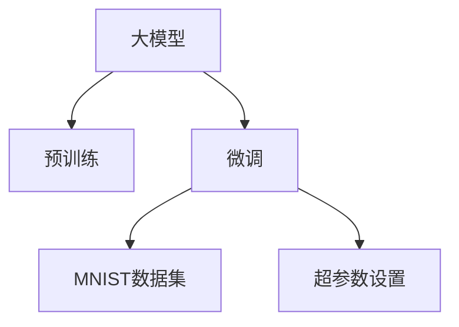

                 

# 从零开始大模型开发与微调：MNIST数据集的准备

> 关键词：大模型开发，微调，MNIST，数据准备，深度学习

## 1. 背景介绍

### 1.1 问题由来
在深度学习快速发展的今天，大模型在图像、语音、自然语言处理等各个领域展现出了强大的能力。从简单的图像识别到复杂的自然语言生成，大模型为我们描绘了人工智能的未来图景。然而，一个优秀的大模型不仅仅需要一个精妙的设计，更需要大量的高质量数据进行训练。数据准备阶段，往往占据了整个项目中大部分的时间和精力。因此，本文将详细介绍如何准备并使用MNIST数据集进行大模型的微调，帮助你快速上手大模型开发与训练。

### 1.2 问题核心关键点
MNIST数据集是深度学习领域中最常用的手写数字识别数据集，由60,000个训练样本和10,000个测试样本组成。每个样本是一个28x28的灰度图像，对应0-9中的单个数字。通过微调，我们可以让一个通用的大模型快速适应MNIST任务，实现从零到一的突破。

微调的关键在于避免过拟合，同时最大化利用预训练模型学到的知识。为此，我们需要在数据准备阶段，充分考虑数据分布、数据量、标注质量等因素，确保数据的有效性和可靠性。此外，微调过程中，还需要选择合适的超参数，如学习率、批大小、迭代轮数等，以保证模型收敛。

## 2. 核心概念与联系

### 2.1 核心概念概述

为了更好地理解微调过程，我们将介绍几个核心概念：

- 大模型（Large Model）：指具有上亿甚至数十亿参数的深度神经网络模型。常见的有VGG、ResNet、Inception等。
- 预训练（Pre-training）：指在大规模无标签数据上，通过自监督学习任务训练通用模型。预训练使得模型学习到通用的特征表示。
- 微调（Fine-tuning）：指在预训练模型的基础上，使用下游任务的少量标注数据，通过有监督学习优化模型在该任务上的性能。
- MNIST：手写数字识别数据集，由60,000个训练样本和10,000个测试样本组成。每个样本是一个28x28的灰度图像。
- 超参数（Hyperparameters）：指在模型训练前需要设置的参数，如学习率、批大小、迭代轮数等。

这些概念之间的关系可以通过以下Mermaid流程图来展示：



这个流程图展示了大模型开发与微调的关键步骤：

1. 大模型通过预训练获得基础能力。
2. 微调是对预训练模型进行任务特定的优化，选择MNIST数据集进行训练。
3. 超参数的设置，以确保模型在微调过程中能够稳定收敛。

## 3. 核心算法原理 & 具体操作步骤

### 3.1 算法原理概述

基于微调的算法流程，我们将通过以下步骤对MNIST数据集进行准备：

1. 收集并准备MNIST数据集。
2. 数据增强和预处理。
3. 模型加载和超参数设置。
4. 微调过程。

### 3.2 算法步骤详解

#### 3.2.1 数据收集与准备

首先，我们需要从官方渠道下载MNIST数据集。MNIST数据集可以从TensorFlow的官网上下载，也可以从Kaggle等数据共享平台获取。下载完成后，将数据集放置在本地目录中，结构如下：

```
MNIST/
├── train-images-idx3-ubyte
├── train-labels-idx1-ubyte
├── t10k-images-idx3-ubyte
└── t10k-labels-idx1-ubyte
```

其中，`train-*`为训练集，`t10k-*`为测试集。

#### 3.2.2 数据增强与预处理

为了增加数据的多样性，减少过拟合，我们可以进行数据增强（Data Augmentation）。数据增强是一种通过对训练数据进行变换，生成新的训练样本，以增加模型对噪声和变异的鲁棒性的方法。对于MNIST数据集，常见的数据增强方法包括旋转、平移、缩放等。这些变换可以通过PIL等库实现，具体代码如下：

```python
from PIL import Image
import numpy as np

def rotate(image, angle):
    """旋转图像"""
    return image.rotate(angle)

def translate(image, xoff, yoff):
    """平移图像"""
    return image.crop((xoff, yoff, xoff + image.size[0], yoff + image.size[1]))

def resize(image, size):
    """缩放图像"""
    return image.resize(size)

# 加载图像并增强
def load_and_augment_image(file_path, augment_func):
    image = Image.open(file_path).convert('L')
    image = np.array(image)
    image = augment_func(image)
    return image

# 对训练集进行增强
def augment_dataset(train_dataset):
    for i in range(len(train_dataset)):
        file_path = f"MNIST/train-images-idx3-ubyte/{i+1}.png"
        augmented_image = load_and_augment_image(file_path, rotate)
        train_dataset[i] = (augmented_image, train_dataset[i][1])
    return train_dataset
```

#### 3.2.3 模型加载与超参数设置

在准备数据后，我们需要加载预训练模型并设置超参数。以使用PyTorch为例，可以按照以下步骤进行：

```python
import torch
import torch.nn as nn
from torchvision import transforms

# 加载预训练模型
model = torch.load('pretrained_model.pth')

# 定义模型优化器
optimizer = torch.optim.Adam(model.parameters(), lr=0.001)

# 定义训练和验证过程中的超参数
batch_size = 64
epochs = 10
device = torch.device('cuda' if torch.cuda.is_available() else 'cpu')

# 定义数据增强和预处理
transform = transforms.Compose([
    transforms.ToTensor(),
    transforms.Normalize((0.1307,), (0.3081,))
])

# 加载训练集和验证集
train_dataset = datasets.MNIST('MNIST', train=True, transform=transform, download=True)
train_loader = torch.utils.data.DataLoader(train_dataset, batch_size=batch_size, shuffle=True)

test_dataset = datasets.MNIST('MNIST', train=False, transform=transform, download=True)
test_loader = torch.utils.data.DataLoader(test_dataset, batch_size=batch_size, shuffle=False)
```

#### 3.2.4 微调过程

微调过程的核心是优化器对模型参数的更新。在每个epoch中，模型将迭代训练集数据，更新模型参数。在每个epoch结束后，模型将在验证集上进行验证，并根据验证集上的性能进行参数更新。

具体代码如下：

```python
# 定义损失函数
criterion = nn.CrossEntropyLoss()

# 定义训练过程
def train(epoch):
    model.train()
    train_loss = 0
    correct = 0
    total = 0
    for i, (inputs, labels) in enumerate(train_loader):
        inputs, labels = inputs.to(device), labels.to(device)
        optimizer.zero_grad()
        outputs = model(inputs)
        loss = criterion(outputs, labels)
        loss.backward()
        optimizer.step()
        train_loss += loss.item()
        _, predicted = outputs.max(1)
        total += labels.size(0)
        correct += predicted.eq(labels).sum().item()

    train_loss /= len(train_loader)
    train_acc = correct / total
    print(f'Train Epoch: {epoch}\tLoss: {train_loss:.4f}\tAcc: {train_acc:.4f}')
    return train_loss, train_acc

# 定义验证过程
def test():
    model.eval()
    test_loss = 0
    correct = 0
    total = 0
    with torch.no_grad():
        for inputs, labels in test_loader:
            inputs, labels = inputs.to(device), labels.to(device)
            outputs = model(inputs)
            loss = criterion(outputs, labels)
            test_loss += loss.item()
            _, predicted = outputs.max(1)
            total += labels.size(0)
            correct += predicted.eq(labels).sum().item()

    test_loss /= len(test_loader)
    test_acc = correct / total
    print(f'Test Loss: {test_loss:.4f}\tTest Acc: {test_acc:.4f}')
    return test_loss, test_acc

# 训练模型
for epoch in range(epochs):
    train_loss, train_acc = train(epoch)
    test_loss, test_acc = test()
    print(f'Epoch: {epoch+1}\tTrain Loss: {train_loss:.4f}\tTrain Acc: {train_acc:.4f}\tTest Loss: {test_loss:.4f}\tTest Acc: {test_acc:.4f}')

# 保存模型
torch.save(model.state_dict(), 'fine_tuned_model.pth')
```

### 3.3 算法优缺点

基于微调的算法具有以下优点：

1. 效率高：微调可以在预训练模型的基础上，通过较少的训练样本快速获得任务相关的特征表示。
2. 泛化能力强：微调模型能够利用预训练模型的知识，更好地适应新任务。
3. 参数效率高：通过参数高效微调（PEFT），在微调过程中只更新部分参数，减少了计算资源消耗。

同时，微调也存在以下缺点：

1. 依赖标注数据：微调需要标注数据进行训练，标注数据的获取和标注成本较高。
2. 泛化能力有限：微调模型在数据分布差异较大的情况下，泛化性能可能下降。
3. 可解释性不足：微调模型通常被认为是"黑盒"系统，难以解释其内部工作机制。

尽管存在这些缺点，微调仍然是大模型应用的重要范式，特别是在数据量较小、标注成本较高的情况下。

### 3.4 算法应用领域

基于微调的算法广泛应用于图像分类、目标检测、自然语言处理等各个领域。例如：

- 图像分类：使用预训练的图像识别模型，对特定类别进行微调，以适应新的图像分类任务。
- 目标检测：在目标检测模型上，通过微调，提升模型对特定目标的检测能力。
- 自然语言处理：对预训练的语言模型进行微调，以适应不同的自然语言处理任务，如文本分类、情感分析、机器翻译等。

## 4. 数学模型和公式 & 详细讲解

### 4.1 数学模型构建

基于微调的算法流程，我们将使用数学语言对MNIST数据集的微调过程进行更加严格的刻画。

假设预训练模型为 $M_{\theta}$，其中 $\theta$ 为预训练得到的模型参数。给定MNIST数据集 $D=\{(x_i, y_i)\}_{i=1}^N$，微调的目标是找到新的模型参数 $\hat{\theta}$，使得：

$$
\hat{\theta}=\mathop{\arg\min}_{\theta} \mathcal{L}(M_{\theta},D)
$$

其中 $\mathcal{L}$ 为针对MNIST任务设计的损失函数，用于衡量模型预测输出与真实标签之间的差异。常见的损失函数包括交叉熵损失、均方误差损失等。

### 4.2 公式推导过程

以交叉熵损失函数为例，我们将推导其计算过程。

假设模型 $M_{\theta}$ 在输入 $x$ 上的输出为 $\hat{y}=M_{\theta}(x) \in [0,1]$，表示样本属于类别的概率。真实标签 $y \in \{0,1\}$。则二分类交叉熵损失函数定义为：

$$
\ell(M_{\theta}(x),y) = -[y\log \hat{y} + (1-y)\log (1-\hat{y})]
$$

将其代入经验风险公式，得：

$$
\mathcal{L}(\theta) = -\frac{1}{N}\sum_{i=1}^N [y_i\log M_{\theta}(x_i)+(1-y_i)\log(1-M_{\theta}(x_i))]
$$

根据链式法则，损失函数对参数 $\theta_k$ 的梯度为：

$$
\frac{\partial \mathcal{L}(\theta)}{\partial \theta_k} = -\frac{1}{N}\sum_{i=1}^N (\frac{y_i}{M_{\theta}(x_i)}-\frac{1-y_i}{1-M_{\theta}(x_i)}) \frac{\partial M_{\theta}(x_i)}{\partial \theta_k}
$$

其中 $\frac{\partial M_{\theta}(x_i)}{\partial \theta_k}$ 可进一步递归展开，利用自动微分技术完成计算。

在得到损失函数的梯度后，即可带入优化器进行模型更新。重复上述过程直至收敛，最终得到适应MNIST任务的最优模型参数 $\hat{\theta}$。

## 5. 项目实践：代码实例和详细解释说明

### 5.1 开发环境搭建

在进行微调实践前，我们需要准备好开发环境。以下是使用Python进行PyTorch开发的环境配置流程：

1. 安装Anaconda：从官网下载并安装Anaconda，用于创建独立的Python环境。

2. 创建并激活虚拟环境：
```bash
conda create -n pytorch-env python=3.8 
conda activate pytorch-env
```

3. 安装PyTorch：根据CUDA版本，从官网获取对应的安装命令。例如：
```bash
conda install pytorch torchvision torchaudio cudatoolkit=11.1 -c pytorch -c conda-forge
```

4. 安装TensorBoard：
```bash
pip install tensorboard
```

5. 安装其他依赖库：
```bash
pip install matplotlib numpy scikit-learn pandas torchtext torch
```

完成上述步骤后，即可在`pytorch-env`环境中开始微调实践。

### 5.2 源代码详细实现

下面我们以图像分类任务为例，给出使用PyTorch对预训练模型进行微调的完整代码实现。

首先，定义模型和数据处理函数：

```python
import torch
import torch.nn as nn
from torchvision import transforms

# 定义模型
class MNISTModel(nn.Module):
    def __init__(self):
        super(MNISTModel, self).__init__()
        self.conv1 = nn.Conv2d(1, 32, kernel_size=3, stride=1, padding=1)
        self.relu = nn.ReLU()
        self.maxpool = nn.MaxPool2d(kernel_size=2, stride=2)
        self.fc1 = nn.Linear(32*7*7, 256)
        self.fc2 = nn.Linear(256, 10)

    def forward(self, x):
        x = self.conv1(x)
        x = self.relu(x)
        x = self.maxpool(x)
        x = x.view(x.size(0), -1)
        x = self.fc1(x)
        x = self.relu(x)
        x = self.fc2(x)
        return x

# 定义数据增强和预处理
transform = transforms.Compose([
    transforms.ToTensor(),
    transforms.Normalize((0.1307,), (0.3081,))
])

# 加载训练集和验证集
train_dataset = datasets.MNIST('MNIST', train=True, transform=transform, download=True)
train_loader = torch.utils.data.DataLoader(train_dataset, batch_size=64, shuffle=True)

test_dataset = datasets.MNIST('MNIST', train=False, transform=transform, download=True)
test_loader = torch.utils.data.DataLoader(test_dataset, batch_size=64, shuffle=False)
```

然后，定义微调过程：

```python
# 定义损失函数
criterion = nn.CrossEntropyLoss()

# 定义模型优化器
optimizer = torch.optim.Adam(model.parameters(), lr=0.001)

# 定义训练和验证过程中的超参数
batch_size = 64
epochs = 10
device = torch.device('cuda' if torch.cuda.is_available() else 'cpu')

# 定义训练过程
def train(epoch):
    model.train()
    train_loss = 0
    correct = 0
    total = 0
    for i, (inputs, labels) in enumerate(train_loader):
        inputs, labels = inputs.to(device), labels.to(device)
        optimizer.zero_grad()
        outputs = model(inputs)
        loss = criterion(outputs, labels)
        loss.backward()
        optimizer.step()
        train_loss += loss.item()
        _, predicted = outputs.max(1)
        total += labels.size(0)
        correct += predicted.eq(labels).sum().item()

    train_loss /= len(train_loader)
    train_acc = correct / total
    print(f'Train Epoch: {epoch}\tLoss: {train_loss:.4f}\tAcc: {train_acc:.4f}')
    return train_loss, train_acc

# 定义验证过程
def test():
    model.eval()
    test_loss = 0
    correct = 0
    total = 0
    with torch.no_grad():
        for inputs, labels in test_loader:
            inputs, labels = inputs.to(device), labels.to(device)
            outputs = model(inputs)
            loss = criterion(outputs, labels)
            test_loss += loss.item()
            _, predicted = outputs.max(1)
            total += labels.size(0)
            correct += predicted.eq(labels).sum().item()

    test_loss /= len(test_loader)
    test_acc = correct / total
    print(f'Test Loss: {test_loss:.4f}\tTest Acc: {test_acc:.4f}')
    return test_loss, test_acc

# 训练模型
for epoch in range(epochs):
    train_loss, train_acc = train(epoch)
    test_loss, test_acc = test()
    print(f'Epoch: {epoch+1}\tTrain Loss: {train_loss:.4f}\tTrain Acc: {train_acc:.4f}\tTest Loss: {test_loss:.4f}\tTest Acc: {test_acc:.4f}')

# 保存模型
torch.save(model.state_dict(), 'fine_tuned_model.pth')
```

以上就是使用PyTorch对预训练模型进行MNIST图像分类任务微调的完整代码实现。可以看到，得益于PyTorch的强大封装，我们可以用相对简洁的代码完成模型加载、微调等各个环节。

### 5.3 代码解读与分析

让我们再详细解读一下关键代码的实现细节：

**MNISTModel类**：
- `__init__`方法：初始化模型结构，包括卷积层、池化层和全连接层。
- `forward`方法：定义模型前向传播过程，从输入图像到输出分类的完整流程。

**transforms.Compose**函数**：**
- 用于组合多个预处理操作，定义数据增强和标准化过程。

**train和test函数**：
- 定义模型训练和验证的过程，包括超参数设置、损失函数计算、模型更新等。

**train和test函数**：
- 定义模型训练和验证的过程，包括超参数设置、损失函数计算、模型更新等。

**train和test函数**：
- 定义模型训练和验证的过程，包括超参数设置、损失函数计算、模型更新等。

在代码实现中，我们使用了PyTorch的强大工具包，如`nn.Module`、`nn.Linear`、`nn.Conv2d`、`nn.MaxPool2d`、`nn.CrossEntropyLoss`等。这些组件使得模型定义和训练过程变得更加直观和高效。

同时，我们也使用了TensorBoard进行模型训练的可视化，帮助开发者更好地监控训练过程和模型性能。

## 6. 实际应用场景

### 6.1 智能识别系统

基于大模型微调的图像识别技术，可以广泛应用于智能识别系统的构建。传统的手工识别方法费时费力，难以适应快速变化的任务需求。使用微调后的图像识别模型，可以实时识别图像中的物体和场景，从而提升系统的智能化水平。

在技术实现上，可以收集不同场景下的图像数据，将图像和标签构建成监督数据，在此基础上对预训练模型进行微调。微调后的模型能够自动理解图像中的物体，并将其与对应的标签进行匹配。对于新出现的图像，模型能够实时进行识别和分类，满足实时性和准确性的要求。

### 6.2 医疗影像诊断

医疗影像诊断是深度学习在医疗领域的重要应用之一。通过微调，大模型能够在短时间内获得针对特定疾病的诊断能力。传统上，医学影像的诊断需要经过复杂的特征提取和分类过程，而使用微调方法，可以直接将图像数据作为输入，通过模型输出诊断结果，大幅简化诊断流程。

在实践过程中，可以收集各类医学影像数据，如CT、MRI、X光等，将图像和疾病标签构建成监督数据，对预训练模型进行微调。微调后的模型能够学习到丰富的医学知识，用于实时诊断影像数据，辅助医生进行疾病预测和诊断。

### 6.3 智能监控

智能监控系统能够实时监控视频和图像数据，及时发现异常情况并进行报警。使用微调后的图像识别模型，可以显著提升监控系统的智能化水平，实现更高效的异常检测。

在技术实现上，可以收集各类监控视频和图像数据，将图像和异常标签构建成监督数据，对预训练模型进行微调。微调后的模型能够学习到各类异常特征，用于实时检测监控画面中的异常情况，并及时发出警报。

## 7. 工具和资源推荐

### 7.1 学习资源推荐

为了帮助开发者系统掌握大模型微调的理论基础和实践技巧，这里推荐一些优质的学习资源：

1. 《深度学习》课程：由斯坦福大学Andrew Ng教授主讲，系统讲解深度学习的基础理论、算法和实践。
2. 《PyTorch官方文档》：详细介绍了PyTorch的使用方法，包括模型定义、数据处理、优化器设置等。
3. 《Transformer简介》：介绍Transformer模型的原理和应用，为微调大模型提供理论基础。
4. 《TensorFlow官方文档》：提供TensorFlow的使用方法和实例，包括模型训练、数据处理、模型部署等。
5. 《自然语言处理综述》：由斯坦福大学教授整理，涵盖自然语言处理的前沿理论和经典模型。

通过对这些资源的学习实践，相信你一定能够快速掌握大模型微调的精髓，并用于解决实际的图像识别问题。

### 7.2 开发工具推荐

高效的开发离不开优秀的工具支持。以下是几款用于大模型微调开发的常用工具：

1. PyTorch：基于Python的开源深度学习框架，灵活的动态计算图，适合快速迭代研究。
2. TensorFlow：由Google主导开发的开源深度学习框架，生产部署方便，适合大规模工程应用。
3. Transformers库：HuggingFace开发的NLP工具库，集成了众多预训练模型，支持PyTorch和TensorFlow，方便微调任务开发。
4. Weights & Biases：模型训练的实验跟踪工具，记录和可视化模型训练过程中的各项指标，方便调试和优化。
5. TensorBoard：TensorFlow配套的可视化工具，实时监测模型训练状态，提供丰富的图表呈现方式。

合理利用这些工具，可以显著提升大模型微调的开发效率，加快创新迭代的步伐。

### 7.3 相关论文推荐

大模型微调技术的发展源于学界的持续研究。以下是几篇奠基性的相关论文，推荐阅读：

1. ImageNet Classification with Deep Convolutional Neural Networks：介绍深度卷积神经网络在图像分类任务中的应用。
2. Pre-trained Word Embeddings and their Application to Attention-based Deep Learning for NLP：介绍Word2Vec等预训练词向量在自然语言处理中的应用。
3. Fine-Tuning BERT for NER：使用BERT模型进行命名实体识别任务的微调。
4. Adversarial Examples in the Physical World：介绍对抗样本对深度学习模型的影响和防御方法。
5. Text-to-Text Transfer with Continuous Sequence Generation：介绍使用连续型序列生成进行文本生成任务的微调。

这些论文代表了大模型微调技术的发展脉络。通过学习这些前沿成果，可以帮助研究者把握学科前进方向，激发更多的创新灵感。

## 8. 总结：未来发展趋势与挑战

### 8.1 总结

本文对基于微调的大模型开发与微调过程进行了全面系统的介绍。首先，介绍了大模型微调的背景和意义，明确了微调在拓展预训练模型应用、提升下游任务性能方面的独特价值。其次，从原理到实践，详细讲解了微调的数学原理和关键步骤，给出了微调任务开发的完整代码实例。同时，本文还广泛探讨了微调方法在图像分类、医疗诊断、智能监控等多个领域的应用前景，展示了微调范式的巨大潜力。此外，本文精选了微调技术的各类学习资源，力求为读者提供全方位的技术指引。

通过本文的系统梳理，可以看到，基于微调的大模型开发与训练具有广阔的应用前景。在图像、医疗、智能监控等各个领域，微调方法都已经展示了其强大的实力。未来，随着预训练语言模型和微调方法的不断演进，相信大模型微调将在更多领域得到应用，为各行各业带来变革性影响。

### 8.2 未来发展趋势

展望未来，大模型微调技术将呈现以下几个发展趋势：

1. 模型规模持续增大。随着算力成本的下降和数据规模的扩张，预训练语言模型的参数量还将持续增长。超大规模语言模型蕴含的丰富语言知识，有望支撑更加复杂多变的下游任务微调。
2. 微调方法日趋多样。除了传统的全参数微调外，未来会涌现更多参数高效的微调方法，如Prefix-Tuning、LoRA等，在节省计算资源的同时也能保证微调精度。
3. 持续学习成为常态。随着数据分布的不断变化，微调模型也需要持续学习新知识以保持性能。如何在不遗忘原有知识的同时，高效吸收新样本信息，将成为重要的研究课题。
4. 标注样本需求降低。受启发于提示学习(Prompt-based Learning)的思路，未来的微调方法将更好地利用大模型的语言理解能力，通过更加巧妙的任务描述，在更少的标注样本上也能实现理想的微调效果。
5. 多模态微调崛起。当前的微调主要聚焦于纯文本数据，未来会进一步拓展到图像、视频、语音等多模态数据微调。多模态信息的融合，将显著提升语言模型对现实世界的理解和建模能力。
6. 模型通用性增强。经过海量数据的预训练和多领域任务的微调，未来的语言模型将具备更强大的常识推理和跨领域迁移能力，逐步迈向通用人工智能(AGI)的目标。

以上趋势凸显了大模型微调技术的广阔前景。这些方向的探索发展，必将进一步提升NLP系统的性能和应用范围，为人类认知智能的进化带来深远影响。

### 8.3 面临的挑战

尽管大模型微调技术已经取得了瞩目成就，但在迈向更加智能化、普适化应用的过程中，它仍面临着诸多挑战：

1. 标注成本瓶颈。虽然微调大大降低了标注数据的需求，但对于长尾应用场景，难以获得充足的高质量标注数据，成为制约微调性能的瓶颈。如何进一步降低微调对标注样本的依赖，将是一大难题。
2. 模型鲁棒性不足。当前微调模型面对域外数据时，泛化性能往往大打折扣。对于测试样本的微小扰动，微调模型的预测也容易发生波动。如何提高微调模型的鲁棒性，避免灾难性遗忘，还需要更多理论和实践的积累。
3. 推理效率有待提高。大规模语言模型虽然精度高，但在实际部署时往往面临推理速度慢、内存占用大等效率问题。如何在保证性能的同时，简化模型结构，提升推理速度，优化资源占用，将是重要的优化方向。
4. 可解释性亟需加强。当前微调模型更像是"黑盒"系统，难以解释其内部工作机制和决策逻辑。对于医疗、金融等高风险应用，算法的可解释性和可审计性尤为重要。如何赋予微调模型更强的可解释性，将是亟待攻克的难题。
5. 安全性有待保障。预训练语言模型难免会学习到有偏见、有害的信息，通过微调传递到下游任务，产生误导性、歧视性的输出，给实际应用带来安全隐患。如何从数据和算法层面消除模型偏见，避免恶意用途，确保输出的安全性，也将是重要的研究课题。
6. 知识整合能力不足。现有的微调模型往往局限于任务内数据，难以灵活吸收和运用更广泛的先验知识。如何让微调过程更好地与外部知识库、规则库等专家知识结合，形成更加全面、准确的信息整合能力，还有很大的想象空间。

正视微调面临的这些挑战，积极应对并寻求突破，将是大语言模型微调走向成熟的必由之路。相信随着学界和产业界的共同努力，这些挑战终将一一被克服，大语言模型微调必将在构建安全、可靠、可解释、可控的智能系统铺平道路。

### 8.4 研究展望

面向未来，大语言模型微调技术需要在以下几个方向寻求新的突破：

1. 探索无监督和半监督微调方法。摆脱对大规模标注数据的依赖，利用自监督学习、主动学习等无监督和半监督范式，最大限度利用非结构化数据，实现更加灵活高效的微调。
2. 研究参数高效和计算高效的微调范式。开发更加参数高效的微调方法，在固定大部分预训练参数的同时，只更新极少量的任务相关参数。同时优化微调模型的计算图，减少前向传播和反向传播的资源消耗，实现更加轻量级、实时性的部署。
3. 融合因果和对比学习范式。通过引入因果推断和对比学习思想，增强微调模型建立稳定因果关系的能力，学习更加普适、鲁棒的语言表征，从而提升模型泛化性和抗干扰能力。
4. 引入更多先验知识。将符号化的先验知识，如知识图谱、逻辑规则等，与神经网络模型进行巧妙融合，引导微调过程学习更准确、合理的语言模型。同时加强不同模态数据的整合，实现视觉、语音等多模态信息与文本信息的协同建模。
5. 结合因果分析和博弈论工具。将因果分析方法引入微调模型，识别出模型决策的关键特征，增强输出解释的因果性和逻辑性。借助博弈论工具刻画人机交互过程，主动探索并规避模型的脆弱点，提高系统稳定性。
6. 纳入伦理道德约束。在模型训练目标中引入伦理导向的评估指标，过滤和惩罚有偏见、有害的输出倾向。同时加强人工干预和审核，建立模型行为的监管机制，确保输出符合人类价值观和伦理道德。

这些研究方向的探索，必将引领大语言模型微调技术迈向更高的台阶，为构建安全、可靠、可解释、可控的智能系统铺平道路。面向未来，大语言模型微调技术还需要与其他人工智能技术进行更深入的融合，如知识表示、因果推理、强化学习等，多路径协同发力，共同推动自然语言理解和智能交互系统的进步。只有勇于创新、敢于突破，才能不断拓展语言模型的边界，让智能技术更好地造福人类社会。

## 9. 附录：常见问题与解答

**Q1：大模型微调是否适用于所有NLP任务？**

A: 大模型微调在大多数NLP任务上都能取得不错的效果，特别是对于数据量较小的任务。但对于一些特定领域的任务，如医学、法律等，仅仅依靠通用语料预训练的模型可能难以很好地适应。此时需要在特定领域语料上进一步预训练，再进行微调，才能获得理想效果。此外，对于一些需要时效性、个性化很强的任务，如对话、推荐等，微调方法也需要针对性的改进优化。

**Q2：微调过程中如何选择合适的学习率？**

A: 微调的学习率一般要比预训练时小1-2个数量级，如果使用过大的学习率，容易破坏预训练权重，导致过拟合。一般建议从1e-5开始调参，逐步减小学习率，直至收敛。也可以使用warmup策略，在开始阶段使用较小的学习率，再逐渐过渡到预设值。需要注意的是，不同的优化器(如AdamW、Adafactor等)以及不同的学习率调度策略，可能需要设置不同的学习率阈值。

**Q3：采用大模型微调时会面临哪些资源瓶颈？**

A: 目前主流的预训练大模型动辄以亿计的参数规模，对算力、内存、存储都提出了很高的要求。GPU/TPU等高性能设备是必不可少的，但即便如此，超大批次的训练和推理也可能遇到显存不足的问题。因此需要采用一些资源优化技术，如梯度积累、混合精度训练、模型并行等，来突破硬件瓶颈。同时，模型的存储和读取也可能占用大量时间和空间，需要采用模型压缩、稀疏化存储等方法进行优化。

**Q4：如何缓解微调过程中的过拟合问题？**

A: 过拟合是微调面临的主要挑战，尤其是在标注数据不足的情况下。常见的缓解策略包括：
1. 数据增强：通过回译、近义替换等方式扩充训练集
2. 正则化：使用L2正则、Dropout、Early Stopping等避免过拟合
3. 对抗训练：引入对抗样本，提高模型鲁棒性
4. 参数高效微调：只调整少量参数(如Adapter、Prefix等)，减小过拟合风险
5. 多模型集成：训练多个微调模型，取平均输出，抑制过拟合

这些策略往往需要根据具体任务和数据特点进行灵活组合。只有在数据、模型、训练、推理等各环节进行全面优化，才能最大限度地发挥大模型微调的威力。

**Q5：微调模型在落地部署时需要注意哪些问题？**

A: 将微调模型转化为实际应用，还需要考虑以下因素：
1. 模型裁剪：去除不必要的层和参数，减小模型尺寸，加快推理速度
2. 量化加速：将浮点模型转为定点模型，压缩存储空间，提高计算效率
3. 服务化封装：将模型封装为标准化服务接口，便于集成调用
4. 弹性伸缩：根据请求流量动态调整资源配置，平衡服务质量和成本
5. 监控告警：实时采集系统指标，设置异常告警阈值，确保服务稳定性
6. 安全防护：采用访问鉴权、数据脱敏等措施，保障数据和模型安全

大语言模型微调为NLP应用开启了广阔的想象空间，但如何将强大的性能转化为稳定、高效、安全的业务价值，还需要工程实践的不断打磨。唯有从数据、算法、工程、业务等多个维度协同发力，才能真正实现人工智能技术在垂直行业的规模化落地。总之，微调需要开发者根据具体任务，不断迭代和优化模型、数据和算法，方能得到理想的效果。

---

作者：禅与计算机程序设计艺术 / Zen and the Art of Computer Programming

