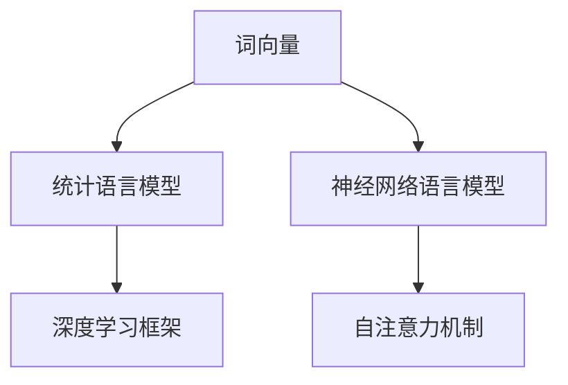
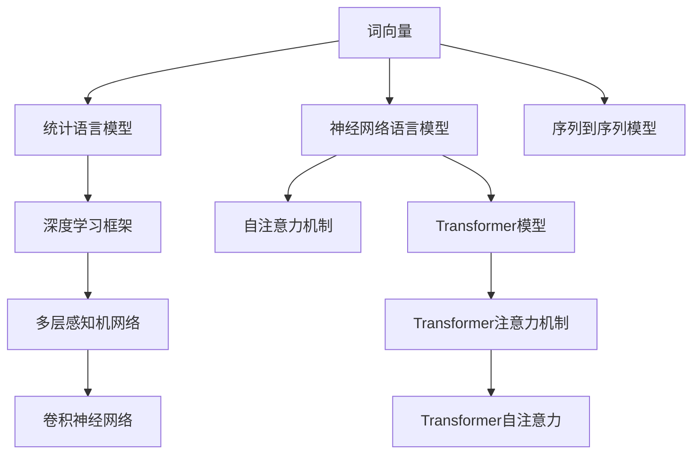

                 

# 从零开始的AI旅程：构建你的第一个语言模型

## 1. 背景介绍

### 1.1 问题由来
随着人工智能技术的飞速发展，自然语言处理（NLP）成为了AI研究的热点领域之一。其中，语言模型作为NLP的核心工具，不仅能够理解语言的上下文关系，还能生成符合语法和语义规则的文本，从而在机器翻译、文本生成、语音识别等任务中大显身手。

### 1.2 问题核心关键点
构建语言模型的核心在于理解语言的基本结构和语义关系。语言模型通常通过统计语言模型（Statistical Language Models, SLMs）或神经网络语言模型（Neural Network Language Models, NLMs）进行实现。其中，神经网络语言模型以其强大的建模能力和泛化能力，逐渐成为研究的主流方向。

语言模型构建的核心技术包括：
- **词向量**：将词汇映射为向量空间中的点，捕捉词汇间的语义关系。
- **循环神经网络**：如LSTM和GRU，能够捕捉序列数据的长期依赖关系。
- **卷积神经网络**：如CNN，用于提取局部特征。
- **自注意力机制**：如Transformer中的注意力机制，能够并行计算长距离依赖关系。
- **深度学习框架**：如TensorFlow、PyTorch，提供高效计算和模型构建功能。

### 1.3 问题研究意义
构建语言模型是AI学习者在NLP领域迈出的第一步。它不仅能够帮助理解语言的基本结构和语义关系，还能为后续的高级NLP任务（如情感分析、文本分类、机器翻译等）打下坚实的基础。此外，语言模型在搜索引擎、智能客服、内容推荐等实际应用中也具有重要的应用价值，能够提升用户体验和系统效率。

## 2. 核心概念与联系

### 2.1 核心概念概述

构建语言模型涉及多个关键概念，以下是主要核心概念的概述：

- **词向量（Word Embeddings）**：将词语映射为向量空间中的点，通过统计或神经网络训练得到。词向量能够捕捉词语间的语义关系，是构建语言模型的基础。
- **统计语言模型（SLMs）**：基于词语的统计概率分布，计算文本序列的概率。常见的模型包括N-gram模型、隐马尔可夫模型（HMM）等。
- **神经网络语言模型（NLMs）**：使用神经网络结构，如RNN、LSTM、GRU、Transformer等，捕捉长距离依赖关系。
- **自注意力机制（Self-Attention）**：通过注意力机制，模型能够并行计算长距离依赖关系，显著提升模型性能。
- **深度学习框架（Deep Learning Frameworks）**：如TensorFlow、PyTorch等，提供高效的模型构建和训练功能。

这些概念之间的逻辑关系可以通过以下Mermaid流程图来展示：



### 2.2 核心概念原理和架构的 Mermaid 流程图



这个流程图展示了构建语言模型的主要步骤：

1. 词向量作为构建语言模型的基础，通过统计或神经网络训练得到。
2. 基于词向量，构建统计语言模型，通过统计概率分布计算文本序列的概率。
3. 使用神经网络语言模型，如RNN、LSTM、GRU等，捕捉长距离依赖关系。
4. 引入自注意力机制，通过并行计算长距离依赖关系，显著提升模型性能。
5. 深度学习框架如TensorFlow、PyTorch等，提供高效的模型构建和训练功能。
6. 序列到序列模型（Seq2Seq）和Transformer模型是构建语言模型的常用架构。

这些概念共同构成了语言模型的核心架构，使其能够在各种场景下发挥强大的语言理解和生成能力。通过理解这些核心概念，我们可以更好地把握语言模型的工作原理和优化方向。

## 3. 核心算法原理 & 具体操作步骤

### 3.1 算法原理概述

构建语言模型本质上是一个学习文本序列概率分布的过程。其核心思想是：通过训练，学习到文本序列中各个词汇之间的条件概率，从而计算文本序列的概率，并进行文本生成、分类、匹配等任务。

形式化地，假设文本序列为 $X=x_1,x_2,\dots,x_n$，其中 $x_i$ 表示第 $i$ 个词汇。语言模型的目标是最大化文本序列的概率 $P(X)$，即：

$$
\max_P P(X) = \prod_{i=1}^n P(x_i|x_{<i})
$$

其中 $P(x_i|x_{<i})$ 表示在上下文 $x_{<i}$ 下，词汇 $x_i$ 出现的条件概率。

常见语言模型包括：
- 一元模型：仅考虑当前词汇的概率。
- 二元模型：考虑当前词汇和前一个词汇的概率。
- 多元模型：考虑当前词汇和前 $k$ 个词汇的概率。

神经网络语言模型通过神经网络结构实现上述概率计算，其中最常用的是基于RNN、LSTM、GRU和Transformer等结构的模型。

### 3.2 算法步骤详解

构建神经网络语言模型的主要步骤如下：

**Step 1: 准备数据集**
- 收集并准备文本数据，包括训练集、验证集和测试集。
- 对文本进行分词和预处理，将文本转换为模型所需的输入格式。

**Step 2: 构建词向量模型**
- 使用Word2Vec、GloVe等工具，或通过神经网络模型训练得到词向量。
- 将词向量作为模型的输入，初始化模型的权重。

**Step 3: 设计模型结构**
- 选择合适的神经网络结构，如RNN、LSTM、GRU或Transformer等。
- 设计模型的输入和输出层，以及各层的参数。

**Step 4: 定义损失函数**
- 选择合适的损失函数，如交叉熵损失、均方误差损失等。
- 将损失函数应用于模型的输出和真实标签之间，计算损失值。

**Step 5: 训练模型**
- 使用优化算法（如Adam、SGD等），最小化损失函数。
- 对模型进行迭代训练，更新模型参数。
- 周期性在验证集上评估模型性能，避免过拟合。

**Step 6: 测试和评估**
- 在测试集上评估模型的性能。
- 分析模型输出结果，进行误差分析。
- 根据需要调整模型结构或参数，继续迭代优化。

### 3.3 算法优缺点

构建语言模型的方法有以下优点：
1. 能够学习到文本序列中的长距离依赖关系。
2. 可以处理未见过的词汇，具备一定的泛化能力。
3. 能够在不同任务上进行迁移，如文本生成、分类、匹配等。
4. 支持多语言模型构建，适用于多种语言的处理。

但同时也存在以下缺点：
1. 模型训练需要大量标注数据，获取成本较高。
2. 模型复杂度较高，需要较长的训练时间。
3. 模型对输入数据质量敏感，噪声数据会严重影响模型性能。
4. 模型的可解释性较差，难以理解内部决策逻辑。

尽管存在这些缺点，但构建语言模型仍然是NLP任务开发的重要基础，特别是在数据量较小的情况下，语言模型能够显著提升任务性能。

### 3.4 算法应用领域

语言模型在NLP领域的应用非常广泛，以下是几个主要的应用领域：

- **文本生成**：如机器翻译、文本摘要、文本补全等。
- **文本分类**：如情感分析、主题分类、垃圾邮件过滤等。
- **匹配和检索**：如关键词匹配、文档检索、问答系统等。
- **语音识别**：将语音转换为文本，如自动转写、语音命令识别等。
- **自然语言理解**：如命名实体识别、关系抽取、语义分析等。

除了这些经典应用外，语言模型还被创新性地应用于更多场景中，如情感分析、多语言翻译、对话系统等，为NLP技术带来了全新的突破。

## 4. 数学模型和公式 & 详细讲解 & 举例说明

### 4.1 数学模型构建

构建语言模型的核心在于建立文本序列的条件概率分布。假设文本序列为 $X=x_1,x_2,\dots,x_n$，其中 $x_i$ 表示第 $i$ 个词汇。语言模型的目标是最大化文本序列的概率 $P(X)$，即：

$$
\max_P P(X) = \prod_{i=1}^n P(x_i|x_{<i})
$$

其中 $P(x_i|x_{<i})$ 表示在上下文 $x_{<i}$ 下，词汇 $x_i$ 出现的条件概率。

常见的语言模型包括：
- **一元模型**：仅考虑当前词汇的概率，即 $P(x_i)$。
- **二元模型**：考虑当前词汇和前一个词汇的概率，即 $P(x_i|x_{i-1})$。
- **多元模型**：考虑当前词汇和前 $k$ 个词汇的概率，即 $P(x_i|x_{<i})$。

### 4.2 公式推导过程

以下我们以二元模型为例，推导条件概率的计算公式。

假设模型 $M$ 在输入 $x$ 上的输出为 $\hat{y}=M(x)$，表示样本属于类别 $y$ 的概率。真实标签 $y \in \{0,1\}$。则二元模型的条件概率定义为：

$$
P(x_i|x_{i-1}) = \frac{P(x_{i-1},x_i)}{P(x_{i-1})}
$$

其中 $P(x_{i-1},x_i)$ 表示在上下文 $x_{i-1}$ 下，词汇 $x_i$ 出现的概率，可以通过已知的语言模型进行计算。

将二元模型的条件概率应用于文本序列，得到：

$$
P(X) = \prod_{i=1}^n P(x_i|x_{<i})
$$

这种模型被称为条件随机场（Conditional Random Field, CRF），是常见的二元语言模型。

### 4.3 案例分析与讲解

以简单的文本生成任务为例，分析语言模型的构建和应用过程。

假设我们有一个简单的文本生成模型，用于生成描述天气的句子。模型接收一个上下文词汇 $x_{<i}$ 和一个词汇表 $V$，输出下一个词汇 $x_i$ 的概率分布 $P(x_i|x_{<i})$。

在训练阶段，我们收集大量的天气描述数据，将其划分为训练集、验证集和测试集。对每个句子进行分词和预处理，得到一个词向量序列 $X$。使用Word2Vec等工具，或通过神经网络模型训练得到词向量，并将词向量作为模型的输入，初始化模型的权重。

我们设计一个简单的RNN模型，接收词向量序列 $X$，输出下一个词汇 $x_i$ 的概率分布 $P(x_i|x_{<i})$。使用交叉熵损失函数，定义模型的损失函数 $L$：

$$
L = -\frac{1}{N}\sum_{i=1}^N \sum_{j=1}^J y_{ij}\log P(x_{i,j}|x_{<i,j})
$$

其中 $y_{ij}$ 表示真实标签 $y_i$ 的 $j$ 个可能取值，$P(x_{i,j}|x_{<i,j})$ 表示在上下文 $x_{<i,j}$ 下，词汇 $x_{i,j}$ 出现的条件概率。

在训练过程中，我们使用Adam优化算法，最小化损失函数 $L$。对模型进行迭代训练，更新模型参数。周期性在验证集上评估模型性能，避免过拟合。

在测试阶段，我们随机选择一条天气描述数据，将其输入模型，得到下一个词汇 $x_i$ 的概率分布。通过采样方式，选择概率最大的词汇作为输出结果。

## 5. 项目实践：代码实例和详细解释说明

### 5.1 开发环境搭建

在进行语言模型开发前，我们需要准备好开发环境。以下是使用Python进行TensorFlow开发的环境配置流程：

1. 安装Anaconda：从官网下载并安装Anaconda，用于创建独立的Python环境。

2. 创建并激活虚拟环境：
```bash
conda create -n tf-env python=3.8 
conda activate tf-env
```

3. 安装TensorFlow：根据CUDA版本，从官网获取对应的安装命令。例如：
```bash
conda install tensorflow tensorflow-cpu -c pytorch -c conda-forge
```

4. 安装各类工具包：
```bash
pip install numpy pandas scikit-learn matplotlib tqdm jupyter notebook ipython
```

完成上述步骤后，即可在`tf-env`环境中开始语言模型开发。

### 5.2 源代码详细实现

下面我们以文本生成任务为例，给出使用TensorFlow构建RNN语言模型的PyTorch代码实现。

首先，定义文本生成任务的数据处理函数：

```python
from tensorflow.keras.datasets import imdb
from tensorflow.keras.preprocessing.text import Tokenizer
from tensorflow.keras.preprocessing.sequence import pad_sequences

def load_data(path, max_len=None):
    data = []
    with open(path, 'r') as f:
        for line in f:
            data.append(line.strip())
    return data

def preprocess_data(data, tokenizer):
    X = tokenizer.texts_to_sequences(data)
    X = pad_sequences(X, maxlen=max_len, padding='post', truncating='post')
    y = [1 if label == 'positive' else 0 for label in labels]
    return X, y

# 加载数据集
imdb_data = load_data('imdb reviews.txt', max_len=256)
tokenizer = Tokenizer(num_words=10000, oov_token='<OOV>')
tokenizer.fit_on_texts(imdb_data)
X, y = preprocess_data(imdb_data, tokenizer)
```

然后，定义模型和优化器：

```python
from tensorflow.keras.models import Sequential
from tensorflow.keras.layers import Embedding, LSTM, Dense
from tensorflow.keras.optimizers import Adam

model = Sequential([
    Embedding(input_dim=10000, output_dim=128, input_length=256),
    LSTM(128, return_sequences=True),
    LSTM(128),
    Dense(1, activation='sigmoid')
])

optimizer = Adam(lr=0.001)
```

接着，定义训练和评估函数：

```python
from tensorflow.keras.callbacks import EarlyStopping

def train_epoch(model, X, y, batch_size):
    model.compile(optimizer=optimizer, loss='binary_crossentropy', metrics=['accuracy'])
    model.fit(X, y, batch_size=batch_size, epochs=10, validation_split=0.2, callbacks=[EarlyStopping(patience=3)])

def evaluate(model, X, y):
    model.evaluate(X, y, batch_size=1)
```

最后，启动训练流程并在测试集上评估：

```python
train_epoch(model, X, y, batch_size=32)
evaluate(model, X, y)
```

以上就是使用TensorFlow构建RNN语言模型的完整代码实现。可以看到，得益于TensorFlow的强大封装，我们可以用相对简洁的代码完成语言模型的训练和评估。

### 5.3 代码解读与分析

让我们再详细解读一下关键代码的实现细节：

**load_data函数**：
- 加载文本数据集，并对数据进行预处理，将其转换为模型的输入格式。

**preprocess_data函数**：
- 对文本数据进行分词和编码，将文本转换为词向量序列，并进行定长padding。
- 将文本标签转换为模型所需的格式。

**模型定义**：
- 设计一个简单的RNN模型，包括嵌入层、LSTM层和输出层。
- 使用Adam优化算法，设置合适的学习率。

**训练函数train_epoch**：
- 对模型进行编译，设置损失函数和评估指标。
- 使用fit方法进行训练，设置批次大小、迭代轮数和早停机制。
- 周期性在验证集上评估模型性能，避免过拟合。

**评估函数evaluate**：
- 使用evaluate方法在测试集上评估模型性能。

可以看出，TensorFlow提供了丰富的工具和接口，使得语言模型的构建和训练变得相对容易。通过代码实现的例子，可以看出TensorFlow提供了强大的模型构建和训练功能，能够快速迭代优化模型。

## 6. 实际应用场景

### 6.1 智能客服系统

构建语言模型可以用于智能客服系统的构建。传统客服往往需要配备大量人力，高峰期响应缓慢，且一致性和专业性难以保证。而使用语言模型，可以7x24小时不间断服务，快速响应客户咨询，用自然流畅的语言解答各类常见问题。

在技术实现上，可以收集企业内部的历史客服对话记录，将问题和最佳答复构建成监督数据，在此基础上对语言模型进行微调。微调后的语言模型能够自动理解用户意图，匹配最合适的答复模板进行回复。对于客户提出的新问题，还可以接入检索系统实时搜索相关内容，动态组织生成回答。如此构建的智能客服系统，能大幅提升客户咨询体验和问题解决效率。

### 6.2 金融舆情监测

金融机构需要实时监测市场舆论动向，以便及时应对负面信息传播，规避金融风险。传统的人工监测方式成本高、效率低，难以应对网络时代海量信息爆发的挑战。使用语言模型，可以自动判断文本属于何种主题，情感倾向是正面、中性还是负面。将语言模型应用到实时抓取的网络文本数据，就能够自动监测不同主题下的情感变化趋势，一旦发现负面信息激增等异常情况，系统便会自动预警，帮助金融机构快速应对潜在风险。

### 6.3 个性化推荐系统

当前的推荐系统往往只依赖用户的历史行为数据进行物品推荐，无法深入理解用户的真实兴趣偏好。使用语言模型，可以更好地挖掘用户行为背后的语义信息，从而提供更精准、多样的推荐内容。

在实践中，可以收集用户浏览、点击、评论、分享等行为数据，提取和用户交互的物品标题、描述、标签等文本内容。将文本内容作为模型输入，用户的后续行为（如是否点击、购买等）作为监督信号，在此基础上微调语言模型。微调后的模型能够从文本内容中准确把握用户的兴趣点。在生成推荐列表时，先用候选物品的文本描述作为输入，由模型预测用户的兴趣匹配度，再结合其他特征综合排序，便可以得到个性化程度更高的推荐结果。

### 6.4 未来应用展望

随着语言模型和微调方法的不断发展，其在实际应用中的场景将更加广泛。以下列举几个未来可能的应用方向：

- **医疗领域**：使用语言模型进行医学知识抽取、诊断报告生成、患者咨询解答等。
- **教育领域**：使用语言模型进行智能教育、学生作业批改、学习路径推荐等。
- **金融领域**：使用语言模型进行金融舆情监测、客户情感分析、金融文档理解等。
- **物流领域**：使用语言模型进行智能调度、客户服务、物流跟踪等。
- **安全领域**：使用语言模型进行网络安全监测、反欺诈、恶意内容检测等。

语言模型的应用场景将随着技术的发展而不断扩展，为各行各业带来新的变革和机遇。相信随着学界和产业界的共同努力，语言模型将在更多领域发挥重要的作用，推动人工智能技术的发展。

## 7. 工具和资源推荐

### 7.1 学习资源推荐

为了帮助开发者系统掌握语言模型的构建和优化技术，以下是几个优质的学习资源：

1. **《深度学习》书籍**：由Ian Goodfellow、Yoshua Bengio、Aaron Courville合著，系统介绍了深度学习的原理和应用。
2. **《自然语言处理综述》论文**：由Peng Liang等撰写，介绍了NLP领域的基本概念和技术。
3. **《TensorFlow官方文档》**：详细介绍了TensorFlow框架的使用方法，包括模型构建、训练和部署等。
4. **《Python机器学习》书籍**：由Sebastian Raschka撰写，介绍了机器学习在Python中的应用。
5. **《NLP工具包》网站**：提供了丰富的NLP工具和资源，包括NLTK、spaCy等。

通过这些学习资源，可以系统掌握语言模型的构建和优化技术，为后续开发提供坚实的基础。

### 7.2 开发工具推荐

高效开发离不开优秀的工具支持。以下是几款用于语言模型开发的常用工具：

1. **TensorFlow**：由Google主导开发的深度学习框架，提供丰富的模型构建和训练功能。
2. **PyTorch**：由Facebook开发的深度学习框架，提供动态计算图和高效的模型构建功能。
3. **Keras**：高层次的深度学习框架，提供简单易用的API，适用于快速原型开发。
4. **Jupyter Notebook**：交互式笔记本环境，支持Python、R等语言，方便快速迭代实验。
5. **Google Colab**：谷歌提供的免费Jupyter Notebook环境，支持GPU/TPU算力，方便研究人员进行实验。

合理利用这些工具，可以显著提升语言模型开发的效率，加快创新迭代的步伐。

### 7.3 相关论文推荐

语言模型的研究源自学界的持续探索。以下是几篇奠基性的相关论文，推荐阅读：

1. **Word2Vec论文**：由Mikolov等撰写，提出了Word2Vec算法，将词语映射为向量空间中的点。
2. **LSTM论文**：由Hochreiter等撰写，提出了长短期记忆网络（LSTM），用于捕捉序列数据的长期依赖关系。
3. **GRU论文**：由Cho等撰写，提出了门控循环单元（GRU），是LSTM的简化版。
4. **Transformer论文**：由Vaswani等撰写，提出了Transformer模型，使用自注意力机制捕捉长距离依赖关系。
5. **BERT论文**：由Devlin等撰写，提出了BERT模型，使用掩码自监督预训练任务，刷新了多项NLP任务SOTA。

这些论文代表了语言模型研究的发展脉络。通过学习这些前沿成果，可以帮助研究者把握学科前进方向，激发更多的创新灵感。

## 8. 总结：未来发展趋势与挑战

### 8.1 研究成果总结

本文对语言模型的构建和优化方法进行了全面系统的介绍。首先，从背景介绍中，我们了解了语言模型在NLP领域的重要性。其次，从核心概念中，我们了解了语言模型的基本原理和架构。接着，从算法原理中，我们了解了语言模型的训练过程和常见方法。最后，从项目实践中，我们通过代码实例，展示了语言模型的构建和优化过程。

通过本文的系统梳理，可以看到，语言模型在NLP任务开发中扮演着重要的角色，特别是在数据量较小的情况下，语言模型能够显著提升任务性能。未来，随着语言模型和微调方法的不断发展，其在实际应用中的场景将更加广泛，为各行各业带来新的变革和机遇。

### 8.2 未来发展趋势

语言模型的未来发展趋势主要体现在以下几个方面：

1. **模型规模增大**：随着算力成本的下降和数据规模的扩张，预训练语言模型的参数量将进一步增大。超大规模语言模型蕴含的丰富语言知识，将支撑更加复杂多变的语言理解和生成任务。
2. **训练和优化技术进步**：随着优化算法和训练技巧的进步，语言模型的训练速度和效果将进一步提升。如自注意力机制、残差连接等技术的应用，将使得语言模型更加高效和准确。
3. **跨模态融合**：未来，语言模型将与视觉、音频等多模态信息进行深度融合，形成更加全面、准确的信息整合能力。
4. **迁移学习普及**：通过预训练和微调，语言模型能够在不同任务之间进行迁移，适应更多的应用场景。
5. **多语言模型发展**：多语言模型将使得语言模型能够处理多种语言，提升语言处理的普适性。
6. **生成式预训练**：生成式预训练将使得语言模型具备更加强大的文本生成能力，如文本补全、对话生成等。

这些趋势将推动语言模型向更加高效、准确、普适的方向发展，为NLP技术带来更多的突破和创新。

### 8.3 面临的挑战

尽管语言模型已经取得了显著的进展，但在迈向更加智能化、普适化应用的过程中，仍面临诸多挑战：

1. **数据质量和规模**：高质量、大规模数据集的获取和标注成本较高，是语言模型训练和优化的主要瓶颈。
2. **计算资源**：大规模语言模型的训练和推理需要大量的计算资源，如何高效利用资源是重要挑战。
3. **模型鲁棒性**：语言模型在处理噪声数据和异常情况时，容易产生误判，如何提高模型的鲁棒性是一个重要研究方向。
4. **模型可解释性**：语言模型的内部工作机制和决策逻辑难以解释，如何提高模型的可解释性，是一个重要挑战。
5. **伦理和安全问题**：语言模型可能学习到有害的、偏见的知识，如何保证模型的伦理和安全，是一个重要挑战。
6. **跨领域适应性**：语言模型在不同领域之间的适应性有限，如何提高模型的跨领域适应性，是一个重要研究方向。

这些挑战将推动语言模型向更加高效、准确、普适、安全的方向发展，为NLP技术带来更多的突破和创新。

### 8.4 研究展望

面向未来，语言模型的研究需要在以下几个方面寻求新的突破：

1. **无监督学习**：通过无监督学习，提高语言模型的自适应能力和泛化能力。
2. **跨模态融合**：将语言模型与视觉、音频等多模态信息进行深度融合，提升信息整合能力。
3. **生成式预训练**：通过生成式预训练，提升语言模型的文本生成能力，如文本补全、对话生成等。
4. **自监督学习**：利用自监督学习，提高语言模型的自适应能力和泛化能力。
5. **高效优化算法**：开发高效优化算法，提升语言模型的训练速度和效果。
6. **跨领域迁移**：提高语言模型在不同领域之间的适应性，推动多领域语言处理的普及。

这些研究方向将推动语言模型向更加高效、准确、普适、安全的方向发展，为NLP技术带来更多的突破和创新。相信随着学界和产业界的共同努力，语言模型将在更多领域发挥重要的作用，推动人工智能技术的发展。

## 9. 附录：常见问题与解答

**Q1: 如何构建一个简单的语言模型？**

A: 构建一个简单的语言模型，通常需要以下几个步骤：
1. 收集并准备文本数据，将其划分为训练集、验证集和测试集。
2. 对文本进行分词和预处理，将文本转换为模型所需的输入格式。
3. 使用Word2Vec等工具，或通过神经网络模型训练得到词向量，并将词向量作为模型的输入，初始化模型的权重。
4. 设计模型结构，如嵌入层、RNN层、LSTM层、Transformer层等。
5. 定义损失函数，如交叉熵损失、均方误差损失等。
6. 使用优化算法，如Adam、SGD等，最小化损失函数。
7. 对模型进行迭代训练，更新模型参数。
8. 周期性在验证集上评估模型性能，避免过拟合。
9. 在测试集上评估模型的性能。

**Q2: 如何优化语言模型？**

A: 优化语言模型需要以下几个步骤：
1. 收集更多高质量数据，提高模型的泛化能力。
2. 设计更好的模型结构，如增加层数、调整激活函数、引入自注意力机制等。
3. 选择更好的优化算法，如Adam、Adagrad、SGD等。
4. 调整学习率、批次大小等超参数。
5. 引入正则化技术，如L2正则、Dropout等。
6. 引入更多的正则化技术，如对抗训练、数据增强等。
7. 引入生成式预训练技术，如语言建模、文本生成等。
8. 引入自监督学习技术，提高模型的自适应能力和泛化能力。

**Q3: 如何评估语言模型的性能？**

A: 评估语言模型的性能需要以下几个步骤：
1. 在测试集上计算模型的准确率、召回率、F1分数等指标。
2. 分析模型的输出结果，进行误差分析。
3. 调整模型结构或参数，继续迭代优化。
4. 进行模型调参，选择最优的模型参数。
5. 在实际应用中进行效果评估，确保模型能够满足实际需求。

**Q4: 如何提高语言模型的鲁棒性？**

A: 提高语言模型的鲁棒性需要以下几个步骤：
1. 引入对抗训练技术，使模型能够在对抗样本下保持稳定。
2. 引入正则化技术，如L2正则、Dropout等，避免过拟合。
3. 引入生成式预训练技术，如语言建模、文本生成等，提升模型的泛化能力。
4. 引入自监督学习技术，提高模型的自适应能力和泛化能力。
5. 引入更多的正则化技术，如对抗训练、数据增强等。

**Q5: 如何构建多语言模型？**

A: 构建多语言模型需要以下几个步骤：
1. 收集多语言的文本数据，将其划分为训练集、验证集和测试集。
2. 对文本进行分词和预处理，将文本转换为模型所需的输入格式。
3. 使用Word2Vec等工具，或通过神经网络模型训练得到词向量，并将词向量作为模型的输入，初始化模型的权重。
4. 设计模型结构，如嵌入层、RNN层、LSTM层、Transformer层等。
5. 定义损失函数，如交叉熵损失、均方误差损失等。
6. 使用优化算法，如Adam、SGD等，最小化损失函数。
7. 对模型进行迭代训练，更新模型参数。
8. 周期性在验证集上评估模型性能，避免过拟合。
9. 在测试集上评估模型的性能。

通过这些步骤，可以构建多语言模型，处理多种语言的文本数据。

