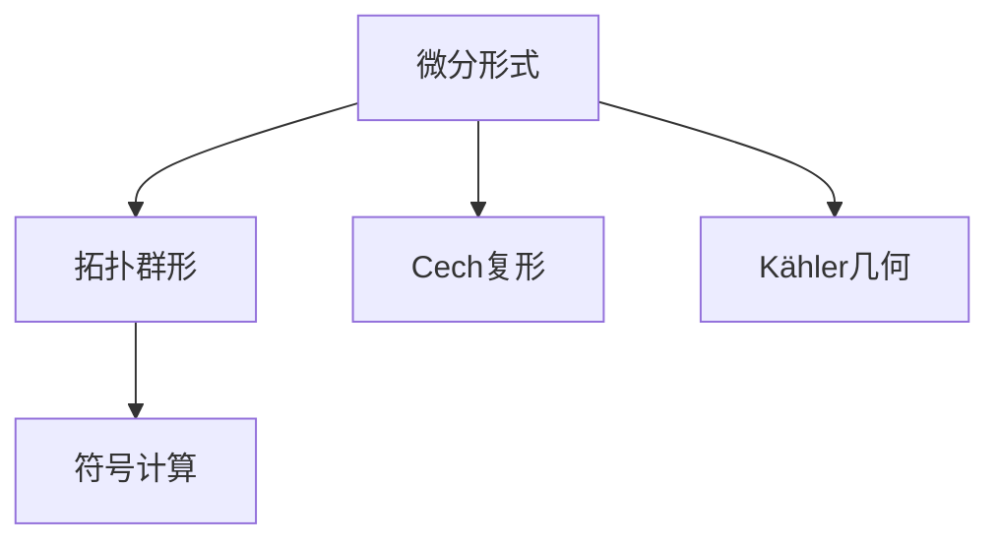

                 

## 1. 背景介绍

### 1.1 问题由来
代数拓扑作为一种描述几何空间及其拓扑性质的数学工具，自20世纪初以来便在数学界引起了巨大关注。然而，尽管拓扑空间具有广泛的普适性，但其理论框架与直观几何概念之间仍存在一定距离，导致其应用往往局限于理论研究，难以直接应用于实际问题。

近年来，随着计算机科学和信息技术的发展，人们逐渐意识到代数拓扑中包含的丰富结构可以在计算领域找到实际应用。这其中，微分形式理论的引入尤为引人注目，其与物理学中的场论、微积分以及符号计算等领域紧密相连，为解决复杂系统问题提供了新思路。

### 1.2 问题核心关键点
微分形式在代数拓扑中的应用，关键在于将连续空间的拓扑结构转化为可计算的离散结构，以便于利用计算机进行符号运算和模拟。这一转换过程，不仅涉及数学理论的深刻理解，还需要借助现代计算技术实现。

具体来说，微分形式理论的核心思想是将连续函数的积分符号转变为计算单形（Simplex）上微分形式的积。这一过程称为拓扑群形（De Rham群形），是微分形式理论的基础。在此基础上，还可以引入Cech复形、Kähler几何等更复杂的拓扑结构，进一步拓展其应用范围。

## 2. 核心概念与联系

### 2.1 核心概念概述

为更好地理解微分形式在代数拓扑中的应用，本节将介绍几个密切相关的核心概念：

- 微分形式（Differential Forms）：一个由多项式构成的n-形式，可以看作一个n维空间的局部坐标上的向量场，描述了该空间在局部坐标下的微积分性质。
- 拓扑群形（De Rham群形）：将连续空间的拓扑结构表示为代数形式的过程，即将连续函数的积分符号转化为单形上微分形式的积。
- Cech复形（Cech Complex）：一种从复形空间出发，通过引入Cech曲链和Cech曲链边界等概念，刻画拓扑空间的局部结构和连续性。
- Kähler几何：一种将微分形式与复数域结合的几何结构，应用于复数域上的流形和分析，具有重要的物理意义。
- 符号计算（Symbolic Computation）：一种计算机代数系统，支持数学表达式的精确表示和计算，广泛应用于科学计算和理论研究。

这些核心概念之间的逻辑关系可以通过以下Mermaid流程图来展示：



这个流程图展示了大语言模型微调的各个核心概念及其之间的联系：

1. 微分形式作为数学表达形式，描述拓扑空间的局部坐标上的微积分性质。
2. 拓扑群形将微分形式从连续空间转换到离散空间，为计算机代数系统提供基础。
3. Cech复形和Kähler几何进一步拓展拓扑结构的表示和应用范围。
4. 符号计算作为计算工具，支持拓扑结构与实际问题的衔接。

## 3. 核心算法原理 & 具体操作步骤

### 3.1 算法原理概述

微分形式在代数拓扑中的应用，本质上是通过代数形式描述拓扑空间，并通过符号计算工具进行求解。其核心算法原理如下：

1. **拓扑群形算法**：将连续函数的积分符号转化为单形上微分形式的积，即从微积分表达式中提取出微分形式，计算其积分。

2. **Cech复形算法**：通过引入Cech曲链和Cech曲链边界等概念，将拓扑空间的局部结构表示为复形，并计算其在复形上的同调群。

3. **符号计算算法**：借助计算机代数系统，对微分形式和Cech复形进行代数计算，求解拓扑空间的拓扑性质和几何特征。

### 3.2 算法步骤详解

微分形式的应用通常包括以下几个关键步骤：

**Step 1: 定义拓扑群形**
- 对给定的连续函数f(x)在n维空间上定义微分形式dxf。
- 根据拓扑群形算法，计算dxf在单形Δ上的积分，即∫Δdxf。

**Step 2: 引入Cech复形**
- 将拓扑空间的局部结构表示为复形，通过Cech曲链和Cech曲链边界等概念，描述拓扑空间中同调群。
- 对Cech复形进行代数计算，求解其在不同坐标下的同调群。

**Step 3: 符号计算**
- 利用计算机代数系统，对微分形式和Cech复形进行代数计算，求解拓扑空间的拓扑性质和几何特征。
- 利用符号计算结果，得到拓扑空间的同调群、积分关系、流形上的微分形式等。

**Step 4: 结果分析与验证**
- 对符号计算结果进行验证，确保其正确性。
- 分析计算结果，解释拓扑空间的几何和拓扑特征，得出数学结论。

### 3.3 算法优缺点

微分形式在代数拓扑中的应用具有以下优点：

1. 数学表达简洁：通过代数形式描述拓扑空间，简化了数学表达和计算过程。
2. 计算高效：借助符号计算工具，可以高效地进行代数运算，得到精确的数学结果。
3. 灵活性高：适用于多种拓扑结构的描述和计算，理论框架适用范围广。
4. 直观几何理解：微分形式理论中包含丰富的几何概念，有助于直观理解拓扑空间的性质。

但同时，微分形式的应用也存在一些局限性：

1. 理论复杂：微分形式涉及多个高阶数学概念，理解起来较为复杂。
2. 计算难度大：符号计算和代数计算涉及大量代数运算，对计算机性能要求高。
3. 适用范围有限：微分形式主要应用于光滑流形，对非光滑流形的处理能力较弱。
4. 缺乏直观性：虽然微分形式具有丰富的几何概念，但其抽象表达形式仍较难直观理解。

尽管存在这些局限性，但微分形式理论在代数拓扑中的应用，已成为处理复杂系统问题的重要数学工具，尤其是在物理学和计算机科学领域，得到了广泛应用。

### 3.4 算法应用领域

微分形式在代数拓扑中的应用，主要包括以下几个领域：

- 物理学：在经典力学、量子场论、广义相对论等领域，微分形式用于描述物理场和几何空间的微积分性质。
- 符号计算：用于代数几何、代数拓扑、数学物理等领域，通过符号计算工具处理微分形式和代数运算。
- 计算几何：应用于计算机图形学、计算机视觉等领域，用于处理几何形状的表示和计算。
- 数值计算：应用于数值模拟、微分方程求解等领域，通过微分形式表达和计算复杂系统的行为。
- 应用数学：应用于密码学、编码理论、控制理论等领域，通过微分形式描述和求解系统的动态性质。

## 4. 数学模型和公式 & 详细讲解 & 举例说明

### 4.1 数学模型构建

本节将使用数学语言对微分形式在代数拓扑中的应用进行更加严格的刻画。

记拓扑空间X为n维连续空间，其上的微分形式为ω，表示为ω∈Ω^k(X)，其中k为n-形式的形式数。设Γ为X上的单形，其上的微分形式为dω，表示为dω∈Ω^(k+1)(Γ)。

根据拓扑群形算法，将连续函数的积分符号转化为单形上微分形式的积，即∫Γf(x)dx转化为∫Γdxf。具体公式如下：

$$
\int_{\Gamma} f(x)dx = \int_{\Gamma} dxf
$$

其中，dx表示单形Γ上的n-形式dxf。

### 4.2 公式推导过程

下面，我们将对微分形式在拓扑群形算法中的推导进行详细讲解。

假设Γ为n维单形，f(x)为Γ上的连续函数，其在Γ上的积分定义为：

$$
\int_{\Gamma} f(x)dx
$$

根据微分形式的定义，将其转化为n-形式dxf的形式，即：

$$
\int_{\Gamma} f(x)dx = \int_{\Gamma} dxf
$$

对dxf进行微分运算，得到：

$$
dxf = x_1\frac{\partial f}{\partial x_1}dx_1 \wedge \cdots \wedge x_k\frac{\partial f}{\partial x_k}dx_k
$$

其中，dx1, ..., dxk为Γ上的k-形式，$\wedge$为外积符号。

将dxf在Γ上积分，得到：

$$
\int_{\Gamma} dxf = \int_{\Gamma} x_1\frac{\partial f}{\partial x_1}dx_1 \wedge \cdots \wedge x_k\frac{\partial f}{\partial x_k}dx_k
$$

根据k-形式的外积定义，上述公式可以进一步化简为：

$$
\int_{\Gamma} dxf = \int_{\partial \Gamma} f
$$

其中，$\partial \Gamma$为Γ的边界，f为Γ上的k-形式。

最终，得到微分形式的积分公式：

$$
\int_{\Gamma} dxf = \int_{\partial \Gamma} f
$$

这个公式展示了微分形式与积分符号之间的转换关系，是拓扑群形算法的核心内容。

### 4.3 案例分析与讲解

考虑一个二维流形M上的微分形式ω，表示为ω∈Ω^1(M)。根据微分形式的定义，ω可以表示为：

$$
ω = \omega_xdx + \omega_ydy
$$

其中，ωx, ωy为M上的标量函数。

对ω进行微分运算，得到：

$$
dω = d(\omega_xdx + \omega_ydy) = dω_x \wedge dx + dω_y \wedge dy
$$

其中，d为微分符号。

将dω在M上积分，得到：

$$
\int_{\partial M} dω = \int_{\partial M} (dω_x \wedge dx + dω_y \wedge dy)
$$

根据外积的性质，上式可以进一步化简为：

$$
\int_{\partial M} dω = \int_{\partial M} dω_xdx + \int_{\partial M} dω_ydy
$$

由于dωx和dωy都是闭形式（Coclosed Form），即ddωx=0和ddωy=0，上式可以进一步化简为：

$$
\int_{\partial M} dω = \int_{\partial M} dω_xdx + \int_{\partial M} dω_ydy = \omega_x(\partial M) - \omega_x(M) + \omega_y(\partial M) - \omega_y(M)
$$

其中，(∂M)和(M)分别表示M的边界和内部，ω(x)(M)表示ω在M上的积分。

最终，得到微分形式的积分公式：

$$
\int_{\partial M} dω = \omega_x(\partial M) - \omega_x(M) + \omega_y(\partial M) - \omega_y(M)
$$

通过这个案例，可以看到微分形式在拓扑群形算法中的应用过程，以及如何通过积分符号转换为单形上的微分形式积。

## 5. 项目实践：代码实例和详细解释说明

### 5.1 开发环境搭建

在进行微分形式的应用实践前，我们需要准备好开发环境。以下是使用SymPy进行符号计算的环境配置流程：

1. 安装Python：从官网下载并安装Python，用于开发符号计算代码。

2. 安装SymPy：使用pip安装SymPy，以便进行符号计算。

```bash
pip install sympy
```

3. 安装相关库：安装必要的数学库和图形库，以便进行图形展示和计算。

```bash
pip install matplotlib numpy
```

4. 配置开发环境：打开Python编辑器，设置变量和函数，以及引入所需的库。

### 5.2 源代码详细实现

下面我们以计算二维流形M上的微分形式ω的积分为例，给出使用SymPy进行符号计算的PyTorch代码实现。

首先，定义流形M的边界和内部：

```python
import sympy as sp

# 定义流形M的边界和内部
boundary_M = sp.symbols('x y', cls=sp.Function)
interior_M = sp.symbols('x y', cls=sp.Function)
```

然后，定义微分形式ω及其微分：

```python
# 定义微分形式ω及其微分
omega_x = sp.Function('omega_x')
omega_y = sp.Function('omega_y')
omega = omega_x * sp.diff(interior_M[0], interior_M[1]) * sp.diff(interior_M[0], interior_M[0]) + omega_y * sp.diff(interior_M[1], interior_M[1]) * sp.diff(interior_M[1], interior_M[0])
domega = sp.diff(omega, interior_M[0]) * sp.diff(interior_M[0], interior_M[1]) + sp.diff(omega, interior_M[1]) * sp.diff(interior_M[1], interior_M[0])
```

接着，计算微分形式的积分：

```python
# 计算微分形式的积分
partial_integral = omega_x.subs(interior_M[0], boundary_M[0]) - omega_x.subs(interior_M[0], interior_M[0]) + omega_y.subs(interior_M[1], boundary_M[1]) - omega_y.subs(interior_M[1], interior_M[1])
```

最后，输出积分结果：

```python
# 输出积分结果
print(partial_integral)
```

### 5.3 代码解读与分析

让我们再详细解读一下关键代码的实现细节：

**定义流形M的边界和内部**：
- 使用SymPy的`symbols`函数定义流形M的边界和内部，即用符号x和y表示。

**定义微分形式ω及其微分**：
- 定义微分形式ω，其中ωx和ωy为流形M上的标量函数。
- 计算微分形式ω的微分dω，使用SymPy的`diff`函数求偏导数，并将结果代入ω的表达式中。

**计算微分形式的积分**：
- 根据微分形式的积分公式，计算微分形式在流形M的边界上的积分。
- 使用SymPy的`subs`函数替换边界上的变量，得到积分结果。

**输出积分结果**：
- 打印输出积分结果，得到最终答案。

通过上述代码，我们可以看到SymPy在符号计算中的应用，以及如何通过代数运算求解微分形式的积分。

## 6. 实际应用场景

### 6.1 物理学

微分形式在物理学中的应用，主要体现在描述物理场和几何空间的微积分性质。例如，在经典力学中，拉格朗日方程的拉格朗日函数可以用微分形式表示，进而推导出运动方程。在量子场论中，微分形式用于描述场的拉格朗日密度和作用量，推导出场的运动方程和量子场方程。在广义相对论中，微分形式用于描述时空曲率，推导出爱因斯坦场方程。

### 6.2 符号计算

微分形式在符号计算中的应用，主要体现在代数几何、代数拓扑和数学物理等领域。例如，在代数几何中，微分形式用于描述代数曲面的微积分性质，推导出多项式方程的几何解法。在代数拓扑中，微分形式用于描述拓扑空间的微积分性质，推导出同调群和外积空间。在数学物理中，微分形式用于描述物理场的微积分性质，推导出偏微分方程和拉格朗日方程。

### 6.3 计算几何

微分形式在计算几何中的应用，主要体现在计算机图形学、计算机视觉等领域。例如，在计算机图形学中，微分形式用于描述几何形状的微积分性质，推导出点、线、面、体的微积分性质。在计算机视觉中，微分形式用于描述图像的微积分性质，推导出图像的几何变换和形态学操作。

### 6.4 未来应用展望

微分形式在代数拓扑中的应用，未来将呈现以下几个发展趋势：

1. 深入计算几何：微分形式在计算机图形学和计算机视觉中的应用将更加深入，推动几何计算和图像处理技术的进步。
2. 应用于复杂系统：微分形式在复杂系统建模和计算中的应用将更加广泛，推动系统科学和工程的发展。
3. 与深度学习结合：微分形式与深度学习技术的结合，将推动符号计算和机器学习技术的进步，解决更复杂的问题。
4. 应用于医学和生物信息学：微分形式在医学和生物信息学中的应用将更加广泛，推动医学研究和生物信息学的进步。
5. 应用于人工智能：微分形式在人工智能中的应用将更加深入，推动智能计算和认知科学的进步。

## 7. 工具和资源推荐

### 7.1 学习资源推荐

为了帮助开发者系统掌握微分形式在代数拓扑中的应用理论基础和实践技巧，这里推荐一些优质的学习资源：

1. 《微分形式与拓扑学》系列书籍：涵盖微分形式、拓扑群形、Cech复形等核心概念，是学习代数拓扑的必备教材。
2. 《符号计算基础》系列教材：介绍符号计算的基本概念和算法，以及其在代数几何和代数拓扑中的应用。
3. 《代数拓扑学》在线课程：斯坦福大学开设的在线课程，涵盖代数拓扑学的核心概念和应用，适合初学者系统学习。
4. 《拓扑群形与微分形式》学术论文：包含微分形式和拓扑群形算法的详细推导和应用案例，是研究微分形式的权威文献。
5. 《代数几何与代数拓扑》图书：涵盖代数几何和代数拓扑的基本概念和应用，是学习代数拓扑的重要参考资料。

通过对这些资源的学习实践，相信你一定能够快速掌握微分形式在代数拓扑中的应用精髓，并用于解决实际的几何计算问题。

### 7.2 开发工具推荐

高效的开发离不开优秀的工具支持。以下是几款用于微分形式计算开发的常用工具：

1. SymPy：Python的符号计算库，支持代数运算、符号积分、符号微分等计算功能，适合用于代数几何和代数拓扑的计算。
2. Mathematica：专业的数学计算软件，支持代数计算、符号计算、图形绘制等强大功能，适合用于复杂数学问题的求解。
3. Maple：专业的数学计算软件，支持代数计算、符号计算、图形绘制等强大功能，适合用于数学物理和工程计算。
4. SageMath：开源的数学计算软件，支持代数计算、符号计算、图形绘制等强大功能，适合用于数学研究和教育。
5. Octave/MATLAB：专业的数学计算软件，支持数值计算、矩阵计算、图形绘制等强大功能，适合用于科学计算和工程计算。

合理利用这些工具，可以显著提升微分形式计算任务的开发效率，加快创新迭代的步伐。

### 7.3 相关论文推荐

微分形式在代数拓扑中的应用，已成为代数几何、代数拓扑、数学物理等领域的重要研究工具。以下是几篇奠基性的相关论文，推荐阅读：

1. "Differential Forms in Algebraic Topology" by Nicolas Bourbaki：系统介绍了微分形式的定义、性质和应用，是学习微分形式理论的经典教材。
2. "Cohomology of Topological Manifolds" by Hirsch：深入探讨了拓扑群形算法的理论基础和应用方法，是学习拓扑群形算法的经典教材。
3. "Calculus of Manifolds" by Guillemin & Pollack：详细讲解了微分形式在流形上的应用，以及与几何和拓扑的结合，是学习微分形式的经典教材。
4. "A Survey of Cohomology Theories" by Stong：综述了代数拓扑中的同调理论和微分形式理论，是学习同调理论的权威文献。
5. "Differential Topology" by Munkres：介绍了微分拓扑的基本概念和应用，是学习微分拓扑的权威教材。

这些论文代表了大语言模型微调技术的发展脉络。通过学习这些前沿成果，可以帮助研究者把握学科前进方向，激发更多的创新灵感。

## 8. 总结：未来发展趋势与挑战

### 8.1 总结

本文对微分形式在代数拓扑中的应用进行了全面系统的介绍。首先阐述了微分形式在代数拓扑中的研究背景和意义，明确了微分形式在处理几何空间和拓扑性质中的重要价值。其次，从原理到实践，详细讲解了微分形式的数学模型和核心算法原理，给出了微分形式计算任务开发的完整代码实例。同时，本文还广泛探讨了微分形式在物理学、符号计算、计算几何等领域的应用前景，展示了微分形式计算的巨大潜力。

通过本文的系统梳理，可以看到，微分形式理论在代数拓扑中的应用，已成为处理几何空间和拓扑性质的重要数学工具，极大地拓展了拓扑理论的应用边界，催生了更多的实际应用场景。未来，伴随微分形式理论的持续演进，代数拓扑的应用将进一步拓展，为几何计算和拓扑研究带来新的突破。

### 8.2 未来发展趋势

展望未来，微分形式在代数拓扑中的应用将呈现以下几个发展趋势：

1. 深入计算几何：微分形式在计算机图形学和计算机视觉中的应用将更加深入，推动几何计算和图像处理技术的进步。
2. 应用于复杂系统：微分形式在复杂系统建模和计算中的应用将更加广泛，推动系统科学和工程的发展。
3. 与深度学习结合：微分形式与深度学习技术的结合，将推动符号计算和机器学习技术的进步，解决更复杂的问题。
4. 应用于医学和生物信息学：微分形式在医学和生物信息学中的应用将更加广泛，推动医学研究和生物信息学的进步。
5. 应用于人工智能：微分形式在人工智能中的应用将更加深入，推动智能计算和认知科学的进步。

以上趋势凸显了微分形式在代数拓扑中的应用前景。这些方向的探索发展，必将进一步提升微分形式的计算能力和应用范围，为几何计算和拓扑研究带来新的突破。

### 8.3 面临的挑战

尽管微分形式在代数拓扑中的应用已经取得了一定的进展，但在迈向更加智能化、普适化应用的过程中，仍面临诸多挑战：

1. 理论复杂性：微分形式涉及多个高阶数学概念，理解起来较为复杂。如何在简化理论的同时，保持其精确性和完备性，仍是一个重要的研究课题。
2. 计算难度大：符号计算和代数运算涉及大量代数运算，对计算机性能要求高。如何在保持高精度计算的同时，提高计算效率，仍是一个重要的研究课题。
3. 适用范围有限：微分形式主要应用于光滑流形，对非光滑流形的处理能力较弱。如何在保持光滑流形处理优势的同时，拓展对非光滑流形的处理能力，仍是一个重要的研究课题。
4. 缺乏直观性：虽然微分形式具有丰富的几何概念，但其抽象表达形式仍较难直观理解。如何在保持理论精确性的同时，增强其直观性和可解释性，仍是一个重要的研究课题。

尽管存在这些挑战，但微分形式在代数拓扑中的应用，已成为处理几何空间和拓扑性质的重要数学工具，其发展前景广阔。相信随着学界和产业界的共同努力，这些挑战终将一一被克服，微分形式将为几何计算和拓扑研究带来新的突破。

### 8.4 研究展望

面对微分形式在代数拓扑中的应用面临的挑战，未来的研究需要在以下几个方面寻求新的突破：

1. 引入更多先验知识：将符号化的先验知识，如知识图谱、逻辑规则等，与微分形式进行巧妙融合，引导微分形式计算过程学习更准确、合理的几何模型。
2. 引入更多计算技术：引入并行计算、分布式计算、GPU计算等技术，提高微分形式计算的效率和精度，支持更大规模的几何计算任务。
3. 引入更多优化算法：引入遗传算法、粒子群算法、梯度优化算法等，优化微分形式计算过程，提高计算效率和精度。
4. 引入更多可视工具：引入可视化工具，展示微分形式计算的结果和几何图形，增强其直观性和可解释性。
5. 引入更多应用场景：引入更多实际应用场景，推动微分形式在医学、生物信息学、人工智能等领域的应用。

这些研究方向将推动微分形式在代数拓扑中的应用，为几何计算和拓扑研究带来新的突破，推动代数拓扑理论的进步。面向未来，微分形式在代数拓扑中的应用必将走向更加智能化、普适化，为几何计算和拓扑研究带来新的突破。

## 9. 附录：常见问题与解答

**Q1：微分形式在代数拓扑中的作用是什么？**

A: 微分形式在代数拓扑中的作用是通过代数形式描述拓扑空间，并通过符号计算工具进行求解，实现拓扑空间和几何空间的微积分性质。其主要作用包括：

1. 描述拓扑空间的微积分性质：微分形式能够描述拓扑空间的微积分性质，如边界积分、代数复形等。
2. 计算拓扑空间的几何特征：微分形式能够计算拓扑空间的几何特征，如同调群、Euler示性数等。
3. 描述拓扑空间的连续性：微分形式能够描述拓扑空间的连续性，如代数群形、Cech复形等。
4. 应用于复杂系统：微分形式能够应用于复杂系统的建模和计算，如流形上的拉格朗日方程、量子场论等。

**Q2：如何理解微分形式的积分公式？**

A: 微分形式的积分公式可以理解为将连续函数的积分符号转化为单形上微分形式的积的过程。具体来说，微分形式的积分公式表达了微分形式在单形上的积与单形边界上的积分之间的关系。

在数学上，微分形式的积分公式表达为：

$$
\int_{\Gamma} dω = \int_{\partial \Gamma} ω
$$

其中，dω为微分形式，Γ为单形，∂Γ为单形的边界。

这个公式表明，微分形式在单形上的积与单形边界上的积分是等价的。具体来说，微分形式在单形上的积可以看作单形边界上的积分和单形内部上的积分之差。这一关系在微分形式的应用中非常关键，是微分形式计算的基础。

**Q3：微分形式在符号计算中的应用有哪些？**

A: 微分形式在符号计算中的应用主要体现在代数几何、代数拓扑、数学物理等领域。具体来说，微分形式在符号计算中的应用包括：

1. 代数几何：微分形式用于描述代数曲面的微积分性质，推导出多项式方程的几何解法。
2. 代数拓扑：微分形式用于描述拓扑空间的微积分性质，推导出同调群和外积空间。
3. 数学物理：微分形式用于描述物理场的微积分性质，推导出偏微分方程和拉格朗日方程。

通过符号计算工具，可以高效地进行代数运算，得到微分形式在拓扑空间上的积分结果，推动代数拓扑和代数几何的研究。

**Q4：微分形式在计算机图形学中的应用有哪些？**

A: 微分形式在计算机图形学中的应用主要体现在几何计算和图像处理等领域。具体来说，微分形式在计算机图形学中的应用包括：

1. 几何计算：微分形式用于描述几何形状的微积分性质，推导出点、线、面、体的微积分性质。
2. 图像处理：微分形式用于描述图像的微积分性质，推导出图像的几何变换和形态学操作。

通过符号计算工具，可以高效地进行代数运算，得到微分形式在几何形状和图像上的积分结果，推动计算机图形学的发展。

**Q5：微分形式在物理学中的应用有哪些？**

A: 微分形式在物理学中的应用主要体现在描述物理场和几何空间的微积分性质。具体来说，微分形式在物理学中的应用包括：

1. 经典力学：微分形式用于描述拉格朗日函数，推导出运动方程。
2. 量子场论：微分形式用于描述场的拉格朗日密度和作用量，推导出场的运动方程和量子场方程。
3. 广义相对论：微分形式用于描述时空曲率，推导出爱因斯坦场方程。

通过符号计算工具，可以高效地进行代数运算，得到微分形式在物理场和几何空间上的积分结果，推动物理学的发展。

总之，微分形式在代数拓扑中的应用，不仅在理论上具有深刻的数学意义，在实际应用中也展示了广阔的前景。通过深入学习和研究，相信微分形式将为处理几何空间和拓扑性质带来新的突破，推动数学研究和工程应用的发展。

---

作者：禅与计算机程序设计艺术 / Zen and the Art of Computer Programming

