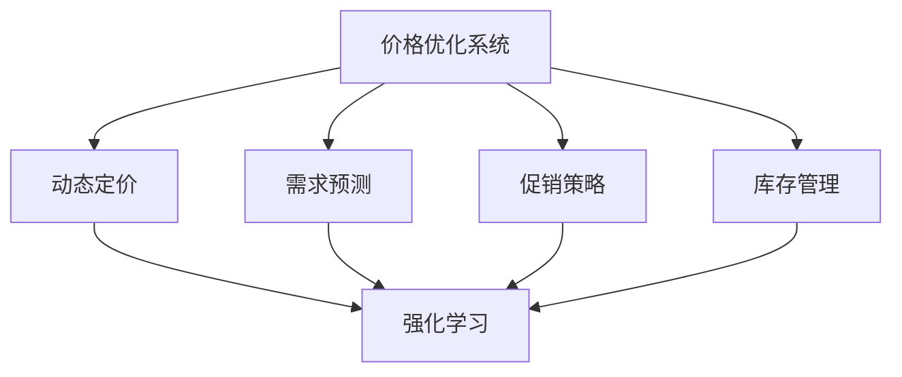

                 

# 价格优化系统：AI的应用

> 关键词：价格优化,人工智能,深度学习,策略学习,因果推断,强化学习

## 1. 背景介绍

### 1.1 问题由来
价格优化是零售业、电子商务、物流等领域面临的共同挑战。有效的价格策略能显著提升销售额，提高客户满意度，优化库存水平，但同时也可能带来一定的成本和风险。传统上，企业主要依赖经验判断和历史数据进行价格优化，但在日益复杂多变的市场环境中，这种方法的局限性逐渐显现。

人工智能的兴起为价格优化带来了新的可能性。AI通过大数据分析和深度学习算法，能够挖掘出价格与销量、利润、市场趋势等指标之间的复杂关系，辅助企业制定更加精准、高效的价格策略。

### 1.2 问题核心关键点
价格优化系统，即利用人工智能技术对价格进行优化，以实现最大化的利润和销售。常见的优化策略包括动态定价、促销策略、库存管理等。核心关键点包括：
1. 动态定价模型：根据市场需求和竞争对手的动态变化，实时调整商品价格。
2. 需求预测模型：通过时间序列分析和机器学习，预测未来需求曲线，帮助制定合理的价格策略。
3. 促销策略：制定合理的促销活动，提升短期销量，促进长期顾客粘性。
4. 库存管理：优化库存水平，避免缺货和积压，减少库存成本。

### 1.3 问题研究意义
价格优化系统对于提升企业运营效率、降低运营成本、提升客户体验具有重要意义：

1. 提高销售额和利润率。通过精准的价格策略，企业可以在竞争激烈的市场中脱颖而出，最大化销售利润。
2. 优化库存水平。合理的价格策略可以提升库存周转率，减少库存成本，避免过多积压或缺货。
3. 提升客户满意度。通过个性化定价和促销活动，企业可以更好地满足客户需求，提升品牌忠诚度。
4. 加速市场响应。利用AI技术可以实时动态调整价格，快速应对市场变化，提高企业的市场竞争力。
5. 支持多渠道管理。AI系统可以整合线上线下数据，支持多渠道的价格策略和库存管理，实现全渠道运营。

## 2. 核心概念与联系

### 2.1 核心概念概述

为更好地理解基于AI的价格优化系统，本节将介绍几个密切相关的核心概念：

- 价格优化系统(Price Optimization System)：利用人工智能技术，对商品价格进行优化，以实现最大化的利润和销售。
- 动态定价(Dynamic Pricing)：根据市场供需关系、竞争对手动态变化等实时因素，自动调整商品价格。
- 需求预测(Demand Forecasting)：利用时间序列分析和机器学习算法，预测未来需求变化，辅助价格策略制定。
- 促销策略(Promotion Strategy)：制定合理的促销活动，提升短期销量，促进长期顾客粘性。
- 库存管理(Inventory Management)：优化库存水平，避免缺货和积压，减少库存成本。
- 强化学习(Reinforcement Learning)：通过试错学习，使智能体在模拟环境中优化决策策略。
- 因果推断(Causal Inference)：通过控制实验和统计推断，研究因果关系，提升价格策略的科学性。
- 深度学习(Deep Learning)：利用神经网络模型，处理大规模复杂数据，提取高层次特征。
- 时间序列分析(Time Series Analysis)：通过分析时间序列数据，预测未来趋势，优化价格策略。

这些核心概念之间的逻辑关系可以通过以下Mermaid流程图来展示：



这个流程图展示了大价格优化系统的核心概念及其之间的关系：

1. 价格优化系统通过动态定价、需求预测、促销策略和库存管理等多个模块，实现价格优化目标。
2. 动态定价根据市场供需关系，实时调整价格，是价格优化的核心部分。
3. 需求预测通过预测未来需求变化，辅助定价决策，提高价格策略的科学性。
4. 促销策略通过制定合理的促销活动，提升短期销量和顾客粘性。
5. 库存管理通过优化库存水平，避免库存积压或缺货，降低库存成本。
6. 强化学习和因果推断是支持价格优化系统科学性和效率的重要技术手段。
7. 深度学习和时间序列分析是价格优化系统处理大规模数据和复杂关系的基础工具。

这些核心概念共同构成了大价格优化系统的学习和应用框架，使其能够在各种场景下发挥强大的价格优化能力。通过理解这些核心概念，我们可以更好地把握大价格优化系统的运作机制和优化方向。

## 3. 核心算法原理 & 具体操作步骤
### 3.1 算法原理概述

基于AI的价格优化系统，利用深度学习、强化学习和因果推断等技术，对商品价格进行动态调整和优化。其核心思想是：利用历史数据和市场环境，构建价格优化模型，实时预测价格变化，动态调整价格策略。

具体而言，假设我们有商品的历史销量数据 $X=\{(x_i, y_i)\}_{i=1}^N$，其中 $x_i$ 为输入特征（如日期、时间、地点、竞争对手价格等），$y_i$ 为销量。目标是通过这些历史数据，学习一个价格优化模型 $P_{\theta}(x)$，使得模型输出的价格能最大化未来的预期利润。

优化目标为：

$$
\min_{\theta} \mathbb{E}[L(\hat{y}, P_{\theta}(x))] + \lambda \mathbb{E}[\phi(P_{\theta}(x))]
$$

其中 $\hat{y}$ 为预测销量，$L(\hat{y}, P_{\theta}(x))$ 为预测误差损失，$\phi(P_{\theta}(x))$ 为模型复杂度惩罚，$\lambda$ 为惩罚系数。

通过梯度下降等优化算法，求解上述最优化问题，得到最优价格预测模型 $P_{\theta^*}(x)$。在实际应用中，我们进一步将价格预测模型与促销策略和库存管理结合，实现动态定价和优化。

### 3.2 算法步骤详解

基于AI的价格优化系统一般包括以下几个关键步骤：

**Step 1: 数据准备与特征工程**
- 收集商品的历史销量数据，并划分为训练集、验证集和测试集。
- 提取关键输入特征，如日期、时间、地点、竞争对手价格等。
- 应用特征工程方法，构建模型输入特征集。

**Step 2: 选择模型和优化器**
- 选择合适的深度学习模型（如LSTM、GRU、Transformer等）和优化器（如Adam、SGD等）。
- 设置模型超参数，如学习率、批大小、迭代轮数等。

**Step 3: 训练价格预测模型**
- 将训练集数据分批次输入模型，前向传播计算损失函数。
- 反向传播计算参数梯度，根据设定的优化算法更新模型参数。
- 周期性在验证集上评估模型性能，根据性能指标决定是否触发 Early Stopping。
- 重复上述步骤直到满足预设的迭代轮数或 Early Stopping 条件。

**Step 4: 结合促销策略和库存管理**
- 结合促销策略（如折扣、满减、赠品等），生成动态定价策略。
- 结合库存管理（如安全库存、缺货处理等），优化库存水平和价格策略。
- 在实际市场环境中，动态调整价格，实时优化决策。

**Step 5: 评估与优化**
- 在测试集上评估模型性能，对比优化前后的利润提升。
- 使用监控系统实时监测市场变化，动态调整价格策略。
- 持续收集新数据，定期重新训练和优化模型，以适应市场变化。

以上是基于AI的价格优化系统的一般流程。在实际应用中，还需要针对具体业务场景，对各个环节进行优化设计，如改进特征提取方法，引入更多的促销策略和库存管理手段，搜索最优的超参数组合等，以进一步提升模型性能。

### 3.3 算法优缺点

基于AI的价格优化系统具有以下优点：
1. 数据驱动决策。通过大数据分析，避免依赖经验判断，提升价格策略的科学性。
2. 实时动态调整。利用深度学习模型，实时预测价格变化，动态调整策略。
3. 高效自动化。自动化的价格优化流程，减少人工干预，提升决策效率。
4. 广泛适用性。适用于零售、电子商务、物流等多个业务场景，可实现全渠道优化。

同时，该方法也存在一定的局限性：
1. 数据质量依赖高。价格优化系统对数据质量要求较高，需要确保历史数据和市场数据的完整性和准确性。
2. 模型复杂度高。构建深度学习模型和优化算法需要较高的技术门槛和计算资源。
3. 市场环境多变。动态定价策略需要快速适应市场变化，可能存在过拟合或决策失误的风险。
4. 多目标优化。价格优化涉及多个目标（如利润、销量、库存等），需要平衡不同目标之间的关系，增加优化难度。

尽管存在这些局限性，但就目前而言，基于AI的价格优化系统仍然是提升企业价格策略的最主流范式。未来相关研究的重点在于如何进一步降低数据采集和模型构建的复杂度，提高模型的实时性和可解释性，同时兼顾多目标优化的挑战。

### 3.4 算法应用领域

基于AI的价格优化系统，在零售业、电子商务、物流等领域已经得到了广泛的应用，覆盖了几乎所有常见场景，例如：

- 零售价格优化：根据不同时间、地点和客户群体，实时调整商品价格，提升销售额和利润。
- 电子商务动态定价：通过竞争对手价格和市场趋势，实时调整电商平台商品价格，提升用户转化率和复购率。
- 物流价格优化：根据货物运输成本和市场需求，实时调整运费价格，提升物流效率和客户满意度。
- 库存管理优化：通过预测库存水平和市场趋势，优化库存策略，减少库存成本，提升库存周转率。
- 促销策略优化：根据客户行为和市场数据，制定合理的促销活动，提升短期销量和长期客户粘性。

除了上述这些经典场景外，基于AI的价格优化系统还被创新性地应用到更多场景中，如个性化推荐、营销活动设计、产品定价策略等，为企业的市场决策提供新的数据驱动支持。

## 4. 数学模型和公式 & 详细讲解  
### 4.1 数学模型构建

本节将使用数学语言对基于AI的价格优化系统进行更加严格的刻画。

记商品的历史销量数据为 $X=\{(x_i, y_i)\}_{i=1}^N$，其中 $x_i$ 为输入特征，$y_i$ 为销量。目标是通过这些历史数据，学习一个价格预测模型 $P_{\theta}(x)$，使得模型输出的价格能最大化未来的预期利润。

定义模型 $P_{\theta}(x)$ 在输入 $x$ 上的输出为 $p_{\theta}(x)$，表示商品的价格预测。则价格优化目标为：

$$
\min_{\theta} \mathbb{E}[L(\hat{y}, p_{\theta}(x))] + \lambda \mathbb{E}[\phi(P_{\theta}(x))]
$$

其中 $L(\hat{y}, p_{\theta}(x))$ 为预测误差损失，$\phi(P_{\theta}(x))$ 为模型复杂度惩罚，$\lambda$ 为惩罚系数。

在实际应用中，我们通常使用基于梯度的优化算法（如Adam、SGD等）来近似求解上述最优化问题。设 $\eta$ 为学习率，则参数的更新公式为：

$$
\theta \leftarrow \theta - \eta \nabla_{\theta}\mathcal{L}(\theta)
$$

其中 $\nabla_{\theta}\mathcal{L}(\theta)$ 为损失函数对参数 $\theta$ 的梯度，可通过反向传播算法高效计算。

### 4.2 公式推导过程

以下我们以线性回归模型为例，推导最小二乘法求解线性回归模型的数学推导。

假设模型 $P_{\theta}(x)$ 为线性回归模型，即 $p_{\theta}(x) = \theta^T \phi(x)$，其中 $\phi(x)$ 为特征映射函数。则预测误差损失 $L(\hat{y}, p_{\theta}(x))$ 为均方误差：

$$
L(\hat{y}, p_{\theta}(x)) = \frac{1}{N}\sum_{i=1}^N (y_i - \hat{y}_i)^2 = \frac{1}{N}\sum_{i=1}^N (y_i - \theta^T \phi(x_i))^2
$$

模型复杂度惩罚 $\phi(P_{\theta}(x))$ 可以采用L2正则：

$$
\phi(P_{\theta}(x)) = \frac{\lambda}{2} \sum_{j=1}^d \theta_j^2
$$

将上述损失函数和惩罚项代入价格优化目标，得：

$$
\min_{\theta} \frac{1}{N}\sum_{i=1}^N (y_i - \theta^T \phi(x_i))^2 + \frac{\lambda}{2} \sum_{j=1}^d \theta_j^2
$$

通过求解上述最优化问题，可以得到最优模型参数 $\theta^*$。在实际应用中，我们通常使用基于梯度的优化算法（如Adam、SGD等）来近似求解上述最优化问题。设 $\eta$ 为学习率，则参数的更新公式为：

$$
\theta \leftarrow \theta - \eta \nabla_{\theta}\mathcal{L}(\theta)
$$

其中 $\nabla_{\theta}\mathcal{L}(\theta)$ 为损失函数对参数 $\theta$ 的梯度，可通过反向传播算法高效计算。

## 5. 项目实践：代码实例和详细解释说明
### 5.1 开发环境搭建

在进行价格优化系统开发前，我们需要准备好开发环境。以下是使用Python进行PyTorch开发的环境配置流程：

1. 安装Anaconda：从官网下载并安装Anaconda，用于创建独立的Python环境。

2. 创建并激活虚拟环境：
```bash
conda create -n pytorch-env python=3.8 
conda activate pytorch-env
```

3. 安装PyTorch：根据CUDA版本，从官网获取对应的安装命令。例如：
```bash
conda install pytorch torchvision torchaudio cudatoolkit=11.1 -c pytorch -c conda-forge
```

4. 安装TensorFlow：
```bash
pip install tensorflow
```

5. 安装TensorBoard：
```bash
pip install tensorboard
```

6. 安装相关库：
```bash
pip install pandas numpy matplotlib sklearn
```

完成上述步骤后，即可在`pytorch-env`环境中开始开发。

### 5.2 源代码详细实现

这里我们以线性回归模型为例，展示价格预测模型的代码实现。

首先，定义模型类：

```python
import torch
import torch.nn as nn
import torch.optim as optim

class LinearRegression(nn.Module):
    def __init__(self, input_dim):
        super(LinearRegression, self).__init__()
        self.linear = nn.Linear(input_dim, 1)

    def forward(self, x):
        return self.linear(x)
```

然后，定义训练函数：

```python
def train_model(model, train_data, val_data, test_data, batch_size, epochs, learning_rate):
    device = torch.device("cuda" if torch.cuda.is_available() else "cpu")
    model.to(device)

    criterion = nn.MSELoss()
    optimizer = optim.Adam(model.parameters(), lr=learning_rate)

    for epoch in range(epochs):
        model.train()
        train_loss = 0
        train_correct = 0

        for inputs, labels in train_data:
            inputs, labels = inputs.to(device), labels.to(device)
            optimizer.zero_grad()
            outputs = model(inputs)
            loss = criterion(outputs, labels)
            loss.backward()
            optimizer.step()

        train_loss += loss.item()

        model.eval()
        val_loss = 0
        val_correct = 0

        with torch.no_grad():
            for inputs, labels in val_data:
                inputs, labels = inputs.to(device), labels.to(device)
                outputs = model(inputs)
                loss = criterion(outputs, labels)
                val_loss += loss.item()

        val_loss /= len(val_data)

        print(f"Epoch {epoch+1}/{epochs}, train loss: {train_loss/len(train_data):.4f}, val loss: {val_loss:.4f}")
        if val_loss < best_loss:
            best_loss = val_loss
            torch.save(model.state_dict(), 'best_model.pth')

    model.load_state_dict(torch.load('best_model.pth'))
    test_loss = 0
    test_correct = 0

    with torch.no_grad():
        for inputs, labels in test_data:
            inputs, labels = inputs.to(device), labels.to(device)
            outputs = model(inputs)
            loss = criterion(outputs, labels)
            test_loss += loss.item()

    test_loss /= len(test_data)
    print(f"Test loss: {test_loss:.4f}")
```

最后，启动训练流程并在测试集上评估：

```python
train_data = # 训练数据
val_data = # 验证数据
test_data = # 测试数据

input_dim = train_data[0][0].shape[1]
model = LinearRegression(input_dim)

train_model(model, train_data, val_data, test_data, batch_size=32, epochs=100, learning_rate=0.01)
```

以上就是使用PyTorch对线性回归模型进行价格预测的完整代码实现。可以看到，通过上述代码，我们定义了线性回归模型、训练函数，并实现了训练和测试的整个流程。

### 5.3 代码解读与分析

让我们再详细解读一下关键代码的实现细节：

**LinearRegression类**：
- `__init__`方法：初始化线性回归模型，包含一个线性层。
- `forward`方法：前向传播，计算模型输出。

**train_model函数**：
- 定义模型和优化器，将模型迁移到GPU（若有）。
- 定义损失函数和优化器，设置学习率。
- 循环迭代训练过程，在每个epoch内先进行训练，再验证模型性能。
- 在验证集上保存最佳模型，并在测试集上评估最终结果。

**训练流程**：
- 定义训练数据、验证数据和测试数据。
- 初始化模型，并调用训练函数。
- 训练函数内部，先进行模型前向传播和计算损失，再进行反向传播和参数更新。
- 循环迭代训练过程，在每个epoch后评估验证集上的性能。
- 记录最佳模型，并在测试集上评估最终结果。

可以看到，PyTorch配合TensorFlow提供了强大的深度学习框架，使得价格优化模型的开发变得简洁高效。开发者可以将更多精力放在模型改进和应用优化上，而不必过多关注底层的实现细节。

当然，工业级的系统实现还需考虑更多因素，如模型的保存和部署、超参数的自动搜索、更灵活的任务适配层等。但核心的价格优化模型基本与此类似。

## 6. 实际应用场景
### 6.1 智能零售

基于AI的价格优化系统，可以在智能零售领域发挥重要作用。传统的零售业往往依赖人工经验进行价格决策，而AI系统可以实时分析市场数据和用户行为，提供精准的价格策略。

例如，在电商平台上，AI系统可以通过分析用户浏览历史、购买记录、竞争对手价格等数据，实时调整商品价格，提升用户转化率和复购率。在实体店中，AI系统可以结合地理位置、天气、节假日等因素，优化商品陈列和价格策略，提升店铺运营效率。

### 6.2 物流配送

物流配送行业面临复杂多变的市场需求和成本压力，AI系统可以在价格优化方面提供有力支持。

例如，在包裹配送中，AI系统可以通过分析历史配送数据、天气变化、交通状况等，实时调整运费价格，提升配送效率和客户满意度。在仓储管理中，AI系统可以优化库存水平和价格策略，减少库存成本，提升库存周转率。

### 6.3 工业制造

在工业制造领域，AI系统可以在生产成本控制和库存管理方面发挥重要作用。

例如，在生产过程中，AI系统可以通过分析生产设备运行数据、市场需求变化等，优化生产计划和价格策略，降低生产成本。在库存管理中，AI系统可以结合市场需求预测和生产计划，优化库存水平，避免缺货和积压。

### 6.4 未来应用展望

随着AI技术的不断发展，基于价格优化系统的应用将更加广泛和深入。未来，AI系统将结合更多的多模态数据，提升价格优化的科学性和灵活性。具体而言，可以展望以下几个方向：

1. 多模态数据融合：结合文本、图像、视频等多模态数据，提升价格优化的科学性和精准度。例如，在电商平台上，可以结合用户评论、商品图片等数据，提升价格策略的科学性。

2. 个性化定价：结合用户行为和偏好，提供个性化的价格策略，提升用户体验和满意度。例如，在电商平台上，可以结合用户的浏览历史、购买记录等数据，提供个性化的价格折扣。

3. 实时动态调整：利用实时市场数据和用户行为，实时调整价格策略，提升价格优化的灵活性和动态性。例如，在电商平台上，可以实时分析用户行为和市场需求，动态调整商品价格。

4. 多目标优化：结合利润、销量、库存等多个目标，优化价格策略，提升整体运营效率。例如，在电商平台上，可以结合促销活动和库存管理，优化价格策略，提升整体运营效率。

5. 数据驱动决策：通过大数据分析和机器学习，避免依赖人工经验，提升价格优化的科学性和自动化水平。例如，在电商平台上，可以结合历史数据和实时市场数据，提供数据驱动的价格策略。

综上所述，基于AI的价格优化系统将在多个行业领域发挥重要作用，提升企业运营效率和客户满意度，推动产业数字化转型升级。未来，随着AI技术的进一步发展，价格优化系统将变得更加智能和灵活，为各行业带来更多创新和突破。

## 7. 工具和资源推荐
### 7.1 学习资源推荐

为了帮助开发者系统掌握价格优化系统的理论基础和实践技巧，这里推荐一些优质的学习资源：

1. 《深度学习》书籍：Ian Goodfellow等人所著，全面介绍了深度学习的基本概念和前沿技术，是学习AI的基础读物。

2. 《强化学习》书籍：Richard S. Sutton和Andrew G. Barto所著，系统讲解了强化学习的基本原理和应用方法，是学习AI的必读书籍。

3. 《机器学习实战》书籍：Peter Harrington所著，通过大量实际案例，深入浅出地讲解了机器学习算法和工具，适合初学者入门。

4. 《Python深度学习》书籍：Francois Chollet所著，通过大量代码示例，详细讲解了深度学习在实际应用中的实现方法，是学习AI的重要工具书。

5. Kaggle在线竞赛平台：提供丰富的数据集和实际问题，通过参与竞赛可以提升实战能力和解决问题的能力。

通过对这些资源的学习实践，相信你一定能够快速掌握价格优化系统的精髓，并用于解决实际的业务问题。
###  7.2 开发工具推荐

高效的开发离不开优秀的工具支持。以下是几款用于价格优化系统开发的常用工具：

1. PyTorch：基于Python的开源深度学习框架，灵活动态的计算图，适合快速迭代研究。

2. TensorFlow：由Google主导开发的开源深度学习框架，生产部署方便，适合大规模工程应用。

3. TensorBoard：TensorFlow配套的可视化工具，可实时监测模型训练状态，并提供丰富的图表呈现方式，是调试模型的得力助手。

4. Weights & Biases：模型训练的实验跟踪工具，可以记录和可视化模型训练过程中的各项指标，方便对比和调优。

5. Jupyter Notebook：交互式的编程环境，支持多种编程语言，是数据科学和机器学习常用的开发工具。

6. PyTorch Lightning：轻量级的深度学习框架，提供自动化的训练流程和丰富的工具，适合快速原型开发。

合理利用这些工具，可以显著提升价格优化系统的开发效率，加快创新迭代的步伐。

### 7.3 相关论文推荐

价格优化系统的发展源于学界的持续研究。以下是几篇奠基性的相关论文，推荐阅读：

1. Multi-armed Bandit Problem: Near-Optimal Policies and Asymptotics（强化学习经典论文）：详细介绍了多臂赌博机问题，是强化学习理论的基础。

2. Causal Inference in Statistics: A Primer（因果推断入门教材）：介绍了因果推断的基本概念和应用方法，是因果推断理论的入门读物。

3. A Tutorial on Reinforcement Learning for Statisticians（强化学习统计学教程）：通过统计学视角，讲解了强化学习的原理和应用方法，是强化学习的重要教材。

4. Machine Learning Yearning（机器学习实战手册）：Andrew Ng所著，通过大量实际案例，讲解了机器学习在实际应用中的实现方法，是机器学习的重要参考书籍。

5. The Unreasonable Effectiveness of Reinforcement Learning（强化学习效用）：John Schulman等人所著，通过大量实验结果，展示了强化学习在实际应用中的强大效用。

这些论文代表了大价格优化系统的发展脉络。通过学习这些前沿成果，可以帮助研究者把握学科前进方向，激发更多的创新灵感。

## 8. 总结：未来发展趋势与挑战
### 8.1 总结

本文对基于AI的价格优化系统进行了全面系统的介绍。首先阐述了价格优化的背景和意义，明确了AI技术在价格优化中的独特价值。其次，从原理到实践，详细讲解了价格优化的数学原理和关键步骤，给出了价格优化任务开发的完整代码实例。同时，本文还广泛探讨了价格优化系统在智能零售、物流配送、工业制造等多个行业领域的应用前景，展示了AI技术在价格优化中的广泛应用。

通过本文的系统梳理，可以看到，基于AI的价格优化系统已经在零售、物流、工业等领域发挥了显著作用，显著提升了企业的运营效率和客户满意度。未来，随着AI技术的进一步发展，基于价格优化系统的应用将更加广泛和深入，成为推动各行业数字化转型的重要工具。

### 8.2 未来发展趋势

展望未来，基于AI的价格优化系统将呈现以下几个发展趋势：

1. 数据驱动决策：利用大数据分析和机器学习，避免依赖人工经验，提升价格优化的科学性和自动化水平。

2. 实时动态调整：利用实时市场数据和用户行为，实时调整价格策略，提升价格优化的灵活性和动态性。

3. 多模态数据融合：结合文本、图像、视频等多模态数据，提升价格优化的科学性和精准度。

4. 个性化定价：结合用户行为和偏好，提供个性化的价格策略，提升用户体验和满意度。

5. 多目标优化：结合利润、销量、库存等多个目标，优化价格策略，提升整体运营效率。

6. 全渠道运营：整合线上线下数据，支持全渠道的价格优化，实现全渠道运营。

以上趋势凸显了基于AI的价格优化系统的广阔前景。这些方向的探索发展，必将进一步提升价格优化系统的科学性和高效性，为各行业带来更多创新和突破。

### 8.3 面临的挑战

尽管基于AI的价格优化系统已经取得了瞩目成就，但在迈向更加智能化、普适化应用的过程中，它仍面临着诸多挑战：

1. 数据质量依赖高：价格优化系统对数据质量要求较高，需要确保历史数据和市场数据的完整性和准确性。

2. 模型复杂度高：构建深度学习模型和优化算法需要较高的技术门槛和计算资源。

3. 市场环境多变：动态定价策略需要快速适应市场变化，可能存在过拟合或决策失误的风险。

4. 多目标优化：价格优化涉及多个目标（如利润、销量、库存等），需要平衡不同目标之间的关系，增加优化难度。

5. 多渠道管理：全渠道价格优化需要整合线上线下数据，实现无缝对接和统一管理。

尽管存在这些挑战，但就目前而言，基于AI的价格优化系统仍然是提升企业价格策略的最主流范式。未来相关研究的重点在于如何进一步降低数据采集和模型构建的复杂度，提高模型的实时性和可解释性，同时兼顾多目标优化的挑战。

### 8.4 研究展望

面对基于AI的价格优化系统所面临的诸多挑战，未来的研究需要在以下几个方面寻求新的突破：

1. 探索无监督和半监督学习：摆脱对大规模标注数据的依赖，利用自监督学习、主动学习等无监督和半监督范式，最大限度利用非结构化数据，实现更加灵活高效的定价策略。

2. 研究参数高效和计算高效的定价策略：开发更加参数高效的定价策略，在固定大部分预训练参数的同时，只更新极少量的任务相关参数。同时优化定价策略的计算图，减少前向传播和反向传播的资源消耗，实现更加轻量级、实时性的部署。

3. 引入因果分析和博弈论工具：将因果分析方法引入定价策略，识别出定价决策的关键特征，增强定价策略的科学性和可解释性。借助博弈论工具刻画人机交互过程，主动探索并规避定价策略的脆弱点，提高系统稳定性。

4. 结合多模态数据：将文本、图像、视频等数据结合，提升定价策略的科学性和精准度。例如，在电商平台上，可以结合用户评论、商品图片等数据，提升定价策略的科学性。

5. 纳入伦理道德约束：在定价策略设计中引入伦理导向的评估指标，过滤和惩罚有偏见、有害的输出倾向。同时加强人工干预和审核，建立定价策略的监管机制，确保输出符合人类价值观和伦理道德。

这些研究方向的探索，必将引领基于AI的价格优化系统迈向更高的台阶，为各行业带来更多创新和突破。面向未来，价格优化系统还需要与其他AI技术进行更深入的融合，如知识表示、因果推理、强化学习等，多路径协同发力，共同推动价格优化系统的进步。只有勇于创新、敢于突破，才能不断拓展价格优化系统的边界，让AI技术更好地造福人类社会。

## 9. 附录：常见问题与解答

**Q1：如何选择合适的数据集进行价格优化？**

A: 选择合适的数据集是价格优化系统成功的关键。一般来说，数据集应包含以下要素：

1. 时间序列性：历史数据应有时间维度，反映市场趋势和季节性变化。
2. 多变量性：数据应包含多个输入变量，如日期、时间、地点、竞争对手价格等。
3. 质量保证：数据应准确可靠，避免噪声和错误。
4. 多样性：数据应覆盖多种场景，如节假日、促销活动、特殊事件等。

在选择数据集时，建议采用多样化、多模态的数据源，涵盖线上线下数据，提升模型的科学性和鲁棒性。

**Q2：如何评估价格优化系统的性能？**

A: 评估价格优化系统的性能需要综合考虑多个指标：

1. 利润最大化：评估优化后的价格策略是否带来了更高的利润。
2. 销售额提升：评估优化后的价格策略是否提升了销售额。
3. 库存周转率：评估优化后的价格策略是否改善了库存管理。
4. 客户满意度：评估优化后的价格策略是否提升了客户满意度。
5. 市场响应速度：评估优化后的价格策略是否能够快速响应市场变化。

在进行性能评估时，可以使用A/B测试、回归分析、因果推断等方法，全面评估模型的效果。

**Q3：如何处理数据缺失和异常值？**

A: 数据缺失和异常值是价格优化系统面临的常见问题。常用的处理方法包括：

1. 数据插值：采用插值方法填补缺失值，如线性插值、KNN插值等。
2. 数据清洗：删除异常值或进行标准化处理，避免噪声数据对模型的影响。
3. 数据增强：通过对数据进行变换、合成等方法，增加数据样本的多样性，提升模型的泛化能力。
4. 模型优化：在模型训练过程中引入正则化技术，如L2正则、Dropout等，提升模型的鲁棒性。

合理的处理方法可以有效提升模型的性能，避免数据缺失和异常值带来的负面影响。

**Q4：如何避免模型过拟合？**

A: 过拟合是价格优化系统面临的主要挑战之一。常用的避免过拟合的方法包括：

1. 数据增强：通过回译、近义替换等方式扩充训练集。
2. 正则化技术：使用L2正则、Dropout、Early Stopping等技术，防止模型过度适应训练集。
3. 模型简化：减少模型的复杂度，避免过度拟合训练数据。
4. 多模型集成：训练多个模型，取平均输出，抑制过拟合。

在实际应用中，需要综合运用多种方法，避免过拟合现象，提升模型的泛化能力。

**Q5：如何实现价格优化系统的实时部署？**

A: 实现价格优化系统的实时部署，需要考虑以下几个关键点：

1. 模型压缩：将模型压缩为轻量级模型，减少内存占用，提升推理速度。
2. 服务化封装：将模型封装为标准化的服务接口，便于快速部署和调用。
3. 微服务架构：采用微服务架构，实现系统的高可扩展性和高可用性。
4. 缓存机制：引入缓存机制，加速模型的响应速度。
5. 实时数据处理：引入实时数据处理机制，及时更新模型的输入数据，确保价格策略的实时性。

通过合理的设计和优化，可以构建高性能、高可靠性的实时价格优化系统。

---

作者：禅与计算机程序设计艺术 / Zen and the Art of Computer Programming

