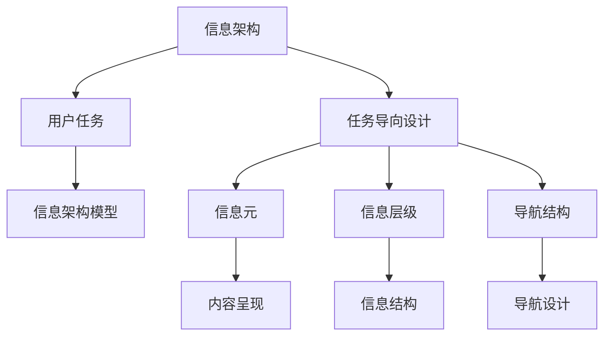
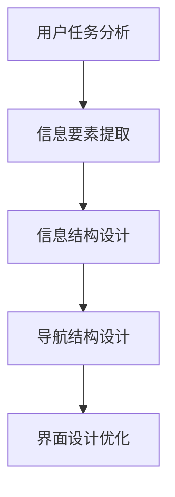

                 

# 任务导向设计对信息架构的影响

## 1. 背景介绍

### 1.1 问题由来

在现代信息社会，数据和信息的爆炸式增长对人们的信息检索和处理能力提出了更高要求。面对海量且多样化的数据，如何在有限的时间内快速找到有用信息，成为了信息架构（IA）领域的一个核心问题。信息架构旨在通过合理设计，使信息更加可访问、可理解、可导航，从而提高信息检索效率和用户体验。

任务导向设计（Task-Oriented Design, TOD）是一种以用户需求为中心的设计方法，强调通过理解用户的具体任务和目标，来指导信息的组织和呈现方式。TOD方法自20世纪90年代提出以来，已被广泛应用于软件工程、用户体验设计和信息架构等领域，证明其能有效提高用户任务完成效率和满意度。

### 1.2 问题核心关键点

任务导向设计对信息架构的影响主要体现在以下几个方面：

- **用户需求驱动**：TOD方法强调从用户角度出发，通过任务分析来确定信息架构的设计目标和策略，使信息呈现更贴合用户需求。
- **信息整合与优化**：TOD方法通过用户任务路径的分析，优化信息的整合和呈现，提升信息检索效率和准确性。
- **界面设计优化**：TOD方法结合任务与界面，设计直观、简洁、高效的信息检索界面，提升用户体验。

## 2. 核心概念与联系

### 2.1 核心概念概述

为更好地理解TOD方法对信息架构的影响，本节将介绍几个关键概念：

- **信息架构（IA）**：通过规划、组织和标记信息元素，使其具有结构性、可访问性和可理解性。IA是信息检索和呈现的基础，涉及信息内容、信息结构、信息呈现等层面。
- **任务导向设计（TOD）**：以用户任务为中心的设计方法，强调通过任务分析来指导信息架构的设计，提升用户任务完成效率和满意度。
- **用户任务（User Task）**：用户在特定情境下需要完成的具体目标和行动序列，是信息架构设计的主要依据。
- **信息架构模型（IA Model）**：用于描述信息结构的模型，包括信息元（Content Element）、信息层级（Content Hierarchy）、导航结构（Navigation Structure）等元素。

这些概念之间的逻辑关系可以通过以下Mermaid流程图来展示：



这个流程图展示信息架构、任务导向设计、用户任务和信息架构模型之间的联系：

1. 信息架构基于用户任务和信息架构模型设计。
2. 任务导向设计通过分析用户任务来指导信息架构的设计。
3. 信息架构模型描述信息元、信息层级和导航结构。
4. 信息元和信息层级共同构成信息结构，导航结构则指导信息检索和呈现。

## 3. 核心算法原理 & 具体操作步骤

### 3.1 算法原理概述

任务导向设计的核心原理是通过任务分析，确定用户完成特定任务所需的信息要素，并将其组织为高效、直观的信息架构。这一过程可以概括为以下几个步骤：

1. **用户任务分析**：识别用户任务，分析任务过程和信息需求。
2. **信息要素提取**：提取用户完成任务所需的关键信息要素。
3. **信息结构设计**：根据信息要素的重要性和相关性，设计信息层级和信息结构。
4. **导航结构设计**：设计直观的导航结构，指导用户高效检索和浏览信息。
5. **界面设计优化**：结合任务与界面，设计简洁、直观的信息检索界面。

这些步骤可以形成如下的高层次算法框架：



### 3.2 算法步骤详解

下面将详细介绍任务导向设计的各个操作步骤，并结合实例进行讲解。

#### 3.2.1 用户任务分析

用户任务分析是任务导向设计的第一步，目的是深入理解用户完成特定任务的过程和需求。这一步骤通常包括以下几个关键动作：

1. **任务识别**：通过访谈、问卷调查等方式，识别用户在不同情境下需要完成的具体任务。
2. **任务分解**：将复杂任务分解为可执行的子任务，以便于分析信息需求。
3. **任务路径分析**：通过追踪用户完成任务的路径，了解任务执行过程中的信息交互和需求。

例如，对于图书检索任务，用户需要完成如下步骤：

1. 搜索图书：输入图书名称、作者、ISBN等关键词。
2. 浏览图书详细信息：阅读图书简介、封面、作者介绍等。
3. 选择图书并下单：根据需求选择图书，填写收货信息，进行支付。

通过对用户任务的深入分析，可以明确用户在不同任务阶段所需的信息要素，为其设计合理的检索界面和导航结构。

#### 3.2.2 信息要素提取

信息要素提取是任务导向设计的核心环节，旨在识别和提取用户完成任务所需的关键信息。这一步骤通常包括：

1. **信息识别**：根据任务分析结果，识别用户完成任务所需的信息要素，如图书名称、作者、封面、简介等。
2. **信息分类**：将信息要素按照类别进行分类，如文本信息、图片信息、多媒体信息等。
3. **信息关联**：分析信息要素之间的关联性，确定哪些信息要素是独立存在的，哪些是相互关联的。

以图书检索任务为例，所需的信息要素包括：

- 图书名称
- 作者
- ISBN
- 封面
- 简介
- 价格
- 出版社

这些信息要素将指导信息架构的设计，并影响信息的呈现方式。

#### 3.2.3 信息结构设计

信息结构设计是任务导向设计的关键步骤，旨在通过合理的层级和关联设计，使用户能够高效检索所需信息。这一步骤通常包括以下几个关键动作：

1. **信息层级设计**：根据信息的重要性，设计信息层级结构，将相关性高的信息置于同一层级，形成树状结构。
2. **信息关联设计**：分析信息要素之间的关联性，设计信息关联方式，如父子关系、并列关系等。
3. **信息命名设计**：为信息层级和关联关系设计清晰的命名，使其易于理解和导航。

以图书检索任务为例，可以设计如下的信息结构：

```
图书检索系统
├── 图书浏览
│   ├── 图书分类
│   ├── 热门图书
│   ├── 最近上架
│   └── 热门作者
├── 图书搜索
│   ├── 图书名称搜索
│   ├── 作者搜索
│   ├── ISBN搜索
│   └── 高级搜索
├── 图书详情
│   ├── 图书封面
│   ├── 图书简介
│   ├── 作者介绍
│   ├── 图书目录
│   └── 图书评价
└── 购物车
    ├── 商品列表
    ├── 购物车管理
    └── 结算支付
```

#### 3.2.4 导航结构设计

导航结构设计是任务导向设计的最后一个重要步骤，旨在设计直观、简洁的导航方式，使用户能够快速找到所需信息。这一步骤通常包括以下几个关键动作：

1. **导航方式设计**：设计直观的导航方式，如菜单、标签、搜索框等。
2. **导航布局设计**：设计导航布局，将其合理放置在界面关键位置。
3. **导航路径设计**：分析用户任务路径，设计导航路径，确保用户能够便捷地导航到目标信息。

以图书检索任务为例，可以设计如下的导航结构：

```
图书检索系统
├── 图书浏览
│   ├── 图书分类
│   ├── 热门图书
│   ├── 最近上架
│   ├── 热门作者
│   └── 搜索
├── 图书搜索
│   ├── 图书名称搜索
│   ├── 作者搜索
│   ├── ISBN搜索
│   └── 高级搜索
├── 图书详情
│   ├── 图书封面
│   ├── 图书简介
│   ├── 作者介绍
│   ├── 图书目录
│   └── 图书评价
└── 购物车
    ├── 商品列表
    ├── 购物车管理
    └── 结算支付
```

#### 3.2.5 界面设计优化

界面设计优化是任务导向设计的最后一步，旨在结合任务与界面，设计简洁、直观的信息检索界面。这一步骤通常包括以下几个关键动作：

1. **界面布局设计**：设计简洁、直观的界面布局，使用户能够快速定位信息。
2. **界面元素设计**：设计直观的界面元素，如搜索框、导航栏、信息列表等。
3. **界面交互设计**：设计用户与界面之间的交互方式，使用户能够高效完成检索任务。

以图书检索任务为例，可以设计如下的界面元素：

```
图书检索系统
├── 搜索框
├── 导航栏
│   ├── 图书分类
│   ├── 热门图书
│   ├── 最近上架
│   ├── 热门作者
│   └── 高级搜索
├── 图书详情
│   ├── 图书封面
│   ├── 图书简介
│   ├── 作者介绍
│   ├── 图书目录
│   └── 图书评价
└── 购物车
    ├── 商品列表
    ├── 购物车管理
    └── 结算支付
```

### 3.3 算法优缺点

任务导向设计对信息架构的影响主要体现在以下几个方面：

#### 3.3.1 优点

1. **用户需求驱动**：TOD方法以用户任务为中心，通过任务分析明确信息需求，使信息架构更贴合用户需求。
2. **信息整合优化**：TOD方法通过任务路径分析，优化信息的整合和呈现，提升信息检索效率。
3. **界面设计优化**：TOD方法结合任务与界面，设计直观、简洁、高效的信息检索界面，提升用户体验。

#### 3.3.2 缺点

1. **任务分析复杂**：TOD方法需要对用户任务进行深入分析，过程较为复杂，需要较多的时间和精力。
2. **信息需求多样**：不同类型的任务可能需要设计不同的信息架构，增加了设计和维护的复杂度。
3. **模型抽象困难**：TOD方法需要构建用户任务模型，对模型的抽象和定义要求较高。

## 4. 数学模型和公式 & 详细讲解 & 举例说明

### 4.1 数学模型构建

本节将使用数学语言对任务导向设计的各个步骤进行更加严格的刻画。

记用户任务为 $T$，信息要素为 $I$，信息结构为 $S$，导航结构为 $N$，界面布局为 $L$。任务导向设计的目标是通过对 $T$、$I$、$S$、$N$、$L$ 的设计，最大化用户任务完成效率 $E$。

$$
\max_{T,I,S,N,L} E(T,I,S,N,L)
$$

其中 $E$ 为用户任务完成效率的度量函数，通常可以表示为：

$$
E(T,I,S,N,L) = \sum_{i=1}^{|I|} \alpha_i \cdot f_i(I_i,S,N,L) + \sum_{j=1}^{|T|} \beta_j \cdot g_j(T_j,N,L)
$$

其中 $\alpha_i$ 和 $\beta_j$ 为任务要素和任务权重，$f_i$ 和 $g_j$ 为信息要素和任务过程的评估函数。

### 4.2 公式推导过程

以下我们将以图书检索任务为例，推导信息结构设计的数学模型。

假设图书检索任务 $T$ 包含多个子任务，每个子任务 $t_k$ 需要检索的信息要素 $i_{tk}$ 在信息结构 $S$ 中处于第 $n_{tk}$ 层级。设 $f_{tk}$ 为 $t_k$ 任务的完成效率函数，可以表示为：

$$
f_{tk} = \alpha_{tk} \cdot \prod_{i_{tk} \in S_{n_{tk}}} f_{tk}(i_{tk})
$$

其中 $\alpha_{tk}$ 为任务权重，$f_{tk}(i_{tk})$ 为信息要素 $i_{tk}$ 对任务完成效率的贡献。

根据信息结构设计，可以建立如下的优化模型：

$$
\max_{S} \sum_{t_k \in T} \alpha_{tk} \cdot \prod_{i_{tk} \in S_{n_{tk}}} f_{tk}(i_{tk})
$$

通过求解上述优化模型，可以确定最优的信息层级和关联关系，使信息结构最贴合用户任务需求。

### 4.3 案例分析与讲解

以图书检索任务为例，分析任务导向设计对信息架构的影响。

#### 4.3.1 用户任务分析

图书检索任务 $T$ 包含多个子任务，如图书名称搜索、作者搜索、ISBN搜索等。通过用户访谈，识别用户在不同情境下需要完成的具体任务。

#### 4.3.2 信息要素提取

图书检索任务所需的信息要素包括图书名称、作者、ISBN、封面、简介、价格、出版社等。通过分析任务路径，提取用户完成任务所需的关键信息。

#### 4.3.3 信息结构设计

设计信息层级和关联关系，确保用户能够高效检索所需信息。例如，将图书分类和热门图书置于同一层级，热门作者和最近上架置于同一层级。

#### 4.3.4 导航结构设计

设计直观的导航方式，使用户能够快速找到所需信息。例如，在导航栏设计图书分类、热门图书、最近上架等，搜索框设计图书名称、作者、ISBN等关键词。

#### 4.3.5 界面设计优化

设计简洁、直观的界面布局，使用户能够快速定位信息。例如，在搜索结果页面设计图书封面、图书简介、作者介绍等关键信息。

## 5. 项目实践：代码实例和详细解释说明

### 5.1 开发环境搭建

在进行信息架构设计实践前，我们需要准备好开发环境。以下是使用Python进行信息架构设计的开发环境配置流程：

1. 安装Anaconda：从官网下载并安装Anaconda，用于创建独立的Python环境。

2. 创建并激活虚拟环境：
```bash
conda create -n ia-env python=3.8 
conda activate ia-env
```

3. 安装相关库：
```bash
pip install matplotlib pandas numpy
```

4. 配置开发工具：
```bash
jupyter notebook
```

完成上述步骤后，即可在`ia-env`环境中开始信息架构设计实践。

### 5.2 源代码详细实现

下面我们以图书检索系统为例，给出信息架构设计的Python代码实现。

首先，定义信息要素、信息层级和信息关联的类：

```python
class ContentElement:
    def __init__(self, name, parent=None):
        self.name = name
        self.parent = parent
        self.children = []

    def add_child(self, child):
        self.children.append(child)
        child.parent = self

class InformationStructure:
    def __init__(self):
        self.root = None

    def add_element(self, element):
        if not self.root:
            self.root = element
        else:
            self.root.add_child(element)

    def display(self):
        self._display(self.root, 0)

    def _display(self, node, depth):
        print('\t' * depth + node.name)
        if node.children:
            for child in node.children:
                self._display(child, depth + 1)
```

然后，定义用户任务、任务权重和信息要素评估函数：

```python
class UserTask:
    def __init__(self, name):
        self.name = name
        self.weight = 1.0

class TaskEvaluation:
    def __init__(self, element, task, layer):
        self.element = element
        self.task = task
        self.layer = layer

    def evaluate(self):
        # 这里给出评估函数的具体实现
        pass

class Task:
    def __init__(self, name, weight):
        self.name = name
        self.weight = weight
        self.elements = []

    def add_element(self, element):
        self.elements.append(element)

class InformationElement:
    def __init__(self, name, weight, task=None):
        self.name = name
        self.weight = weight
        self.task = task

    def evaluate(self):
        # 这里给出评估函数的具体实现
        pass

def build_information_structure():
    # 构建信息结构
    pass

def build_navigation_structure():
    # 构建导航结构
    pass

def build_interface_layout():
    # 构建界面布局
    pass
```

最后，启动信息架构设计流程：

```python
def main():
    # 定义用户任务
    user_tasks = [UserTask('图书名称搜索'), UserTask('作者搜索'), UserTask('ISBN搜索')]

    # 定义任务权重
    task_weights = [0.3, 0.2, 0.5]

    # 定义信息要素评估函数
    element_evaluate = lambda element, task, layer: element.weight * task.weight

    # 构建信息结构
    information_structure = InformationStructure()
    build_information_structure(information_structure)

    # 构建导航结构
    navigation_structure = build_navigation_structure()

    # 构建界面布局
    interface_layout = build_interface_layout()

    # 输出信息架构设计结果
    information_structure.display()

if __name__ == "__main__":
    main()
```

以上就是使用Python进行信息架构设计的完整代码实现。可以看到，通过定义类和函数，可以简洁地实现信息架构设计的各个步骤。

### 5.3 代码解读与分析

让我们再详细解读一下关键代码的实现细节：

**ContentElement类**：
- `__init__`方法：初始化信息要素名称和父级信息。
- `add_child`方法：添加子级信息。

**InformationStructure类**：
- `__init__`方法：初始化信息结构根节点。
- `add_element`方法：添加信息要素到信息结构。
- `display`方法：遍历并输出信息结构。

**UserTask类**：
- `__init__`方法：初始化用户任务名称和权重。

**Task类**：
- `__init__`方法：初始化任务名称和权重。
- `add_element`方法：添加信息要素到任务。

**InformationElement类**：
- `__init__`方法：初始化信息要素名称、权重和任务。
- `evaluate`方法：定义信息要素评估函数。

**TaskEvaluation类**：
- `__init__`方法：初始化信息要素、任务和层级。
- `evaluate`方法：定义信息要素评估函数。

**build_information_structure函数**：
- 通过用户任务、任务权重和信息要素评估函数，构建信息结构。

**build_navigation_structure函数**：
- 通过信息结构，构建导航结构。

**build_interface_layout函数**：
- 通过信息结构，构建界面布局。

可以看到，通过合理设计类和方法，可以将信息架构设计的复杂过程简单化，使代码实现更加清晰和易于维护。

## 6. 实际应用场景

### 6.1 智慧图书馆系统

智慧图书馆系统是信息架构设计的重要应用场景之一。传统的图书馆系统信息架构较为简单，无法满足用户复杂的信息检索需求。通过任务导向设计，可以设计更加智能、高效的信息架构，提升用户的检索效率和满意度。

在智慧图书馆系统中，可以设计如下的信息架构：

```
图书检索系统
├── 图书浏览
│   ├── 图书分类
│   ├── 热门图书
│   ├── 最近上架
│   ├── 热门作者
│   └── 搜索
├── 图书搜索
│   ├── 图书名称搜索
│   ├── 作者搜索
│   ├── ISBN搜索
│   └── 高级搜索
├── 图书详情
│   ├── 图书封面
│   ├── 图书简介
│   ├── 作者介绍
│   ├── 图书目录
│   └── 图书评价
└── 购物车
    ├── 商品列表
    ├── 购物车管理
    └── 结算支付
```

### 6.2 电子商务网站

电子商务网站是信息架构设计的另一个重要应用场景。传统的电商网站信息架构较为单一，难以满足用户复杂的购物需求。通过任务导向设计，可以设计更加智能、高效的信息架构，提升用户的购物体验。

在电子商务网站中，可以设计如下的信息架构：

```
购物系统
├── 商品浏览
│   ├── 商品分类
│   ├── 热门商品
│   ├── 最近上架
│   └── 搜索
├── 商品搜索
│   ├── 商品名称搜索
│   ├── 商品类别搜索
│   ├── 品牌搜索
│   └── 高级搜索
├── 商品详情
│   ├── 商品图片
│   ├── 商品描述
│   ├── 用户评价
│   └── 优惠信息
└── 购物车
    ├── 商品列表
    ├── 购物车管理
    └── 结算支付
```

### 6.3 医疗信息平台

医疗信息平台是信息架构设计在特定领域的应用场景。传统的医疗信息平台信息架构较为单一，难以满足医生和患者复杂的信息检索需求。通过任务导向设计，可以设计更加智能、高效的信息架构，提升医疗信息检索和处理的效率。

在医疗信息平台中，可以设计如下的信息架构：

```
医疗信息平台
├── 医生信息
│   ├── 医生分类
│   ├── 热门医生
│   └── 搜索
├── 病人信息
│   ├── 病人分类
│   ├── 最近就诊
│   └── 搜索
├── 医疗记录
│   ├── 病人记录
│   ├── 医生记录
│   └── 搜索
└── 健康咨询
    ├── 常见问题
    ├── 专家咨询
    └── 在线问诊
```

## 7. 工具和资源推荐

### 7.1 学习资源推荐

为了帮助开发者系统掌握信息架构设计的理论基础和实践技巧，这里推荐一些优质的学习资源：

1. 《信息架构：通往用户中心设计之路》：一本介绍信息架构设计原理和实践的经典书籍，是学习信息架构设计的重要参考资料。

2. 《用户体验设计全案》：一本全面介绍用户体验设计原理和实践的书籍，涵盖了信息架构、交互设计、原型设计等多个方面。

3. 《用户任务分析：设计更好的信息架构》：一本介绍用户任务分析方法和实践的书籍，是信息架构设计的核心工具书。

4. 《信息架构设计：规划与组织数字信息》：一本系统介绍信息架构设计原理和实践的书籍，是信息架构设计的权威指南。

5. Nielsen Norman Group：信息架构设计领域的知名研究机构，提供大量有关信息架构设计的理论研究和实践案例。

通过对这些资源的学习实践，相信你一定能够快速掌握信息架构设计的精髓，并用于解决实际的问题。

### 7.2 开发工具推荐

高效的信息架构设计开发离不开优秀的工具支持。以下是几款常用的信息架构设计工具：

1. Axure RP：一款流行的信息架构设计工具，支持可视化设计和交互原型制作，适合快速迭代设计信息架构。

2. Sketch：一款强大的矢量绘图工具，支持信息架构设计、原型设计和可视化设计，适合设计师和开发者共同使用。

3. Figma：一款云端协作设计工具，支持信息架构设计、原型设计和交互设计，适合多人协作开发信息架构。

4. InVision Studio：一款高效的信息架构设计工具，支持可视化设计和交互原型制作，适合设计师和开发者共同使用。

5. Balsamiq：一款轻量级的信息架构设计工具，适合快速迭代设计信息架构，适合初学者和中级开发者使用。

合理利用这些工具，可以显著提升信息架构设计的效率和质量，加快创新迭代的步伐。

### 7.3 相关论文推荐

信息架构设计的发展离不开学界的持续研究。以下是几篇奠基性的相关论文，推荐阅读：

1. 《信息架构：组织信息以提高可用性和信息检索》：介绍信息架构设计的核心原则和实践方法，是信息架构设计领域的经典之作。

2. 《用户任务分析：设计更好的信息架构》：介绍用户任务分析方法，通过任务分析指导信息架构设计，提升用户体验。

3. 《信息架构设计模式》：介绍信息架构设计的常见模式和最佳实践，是信息架构设计的重要参考资料。

4. 《信息架构设计的未来》：展望信息架构设计的未来趋势，探讨信息架构设计的未来方向。

这些论文代表了大规模语言模型微调技术的发展脉络。通过学习这些前沿成果，可以帮助研究者把握学科前进方向，激发更多的创新灵感。

## 8. 总结：未来发展趋势与挑战

### 8.1 总结

本文对信息架构设计进行了全面系统的介绍。首先阐述了信息架构设计的背景和意义，明确了任务导向设计在信息架构设计中的核心地位。其次，从原理到实践，详细讲解了信息架构设计的数学模型和操作步骤，给出了信息架构设计开发的完整代码实例。同时，本文还广泛探讨了信息架构设计在智慧图书馆、电子商务、医疗信息平台等多个行业领域的应用前景，展示了任务导向设计范式的巨大潜力。此外，本文精选了信息架构设计的各类学习资源，力求为读者提供全方位的技术指引。

通过本文的系统梳理，可以看到，任务导向设计在信息架构设计中的重要作用。任务导向设计通过用户任务分析，明确信息需求，设计合理的信息结构、导航结构和界面布局，使得信息架构更加贴合用户需求，提升了信息检索效率和用户体验。任务导向设计是信息架构设计的重要工具，能够有效指导信息架构的设计和优化。

### 8.2 未来发展趋势

展望未来，信息架构设计将呈现以下几个发展趋势：

1. **数据驱动设计**：随着大数据技术的发展，信息架构设计将更加依赖数据驱动，通过数据分析优化信息结构和导航结构。

2. **智能化设计**：信息架构设计将与人工智能技术结合，通过智能推荐、自动分类等方式提升信息检索效率。

3. **个性化设计**：信息架构设计将更加注重个性化，通过用户行为数据和偏好信息，设计个性化的信息结构、导航结构和界面布局。

4. **跨平台设计**：信息架构设计将突破平台限制，实现多平台、多设备的信息架构设计，提升用户体验一致性。

5. **社区化设计**：信息架构设计将更加注重社区化，通过用户反馈和社区协作，优化信息架构设计。

6. **生态化设计**：信息架构设计将与其他技术结合，如自然语言处理、机器学习等，形成更加完善的信息架构生态系统。

这些趋势凸显了信息架构设计的前景和价值，将推动信息检索技术迈向新的高度。伴随技术的发展，信息架构设计也将迎来更多创新和突破。

### 8.3 面临的挑战

尽管信息架构设计已经取得了不小的进展，但在迈向更加智能化、普适化应用的过程中，仍面临诸多挑战：

1. **用户需求多样**：不同类型的用户有不同的信息需求，信息架构设计需要兼顾多样性。

2. **信息结构复杂**：信息架构设计需要处理复杂的信息结构和导航结构，增加了设计和维护的复杂度。

3. **界面设计复杂**：信息架构设计需要考虑界面设计的简洁性和易用性，增加了设计的难度。

4. **数据处理复杂**：信息架构设计需要处理海量数据，增加了数据处理的复杂度。

5. **用户体验提升**：信息架构设计需要不断提升用户体验，增加了设计的难度。

6. **技术融合复杂**：信息架构设计需要与其他技术融合，增加了设计的难度。

这些挑战凸显了信息架构设计的复杂性和重要性，需要更多的研究和实践积累。只有不断优化设计方法和工具，才能更好地应对这些挑战，推动信息架构设计的进步。

### 8.4 研究展望

未来的信息架构设计需要从以下几个方面进行深入研究：

1. **多模态信息整合**：信息架构设计需要突破单一模态的限制，整合视觉、听觉、触觉等多模态信息，提升用户体验。

2. **情感计算融合**：信息架构设计需要引入情感计算技术，通过情感分析优化信息结构、导航结构和界面布局。

3. **人机协同设计**：信息架构设计需要引入人机协同技术，通过用户反馈和机器学习优化信息架构设计。

4. **动态设计优化**：信息架构设计需要引入动态设计技术，通过实时调整信息结构、导航结构和界面布局，提升用户体验。

5. **跨文化设计**：信息架构设计需要突破文化限制，设计跨文化的普适性信息架构，提升全球用户体验。

6. **伦理和安全设计**：信息架构设计需要引入伦理和安全技术，确保信息架构设计的公正性和安全性。

这些研究方向将推动信息架构设计向更加智能化、普适化、人性化、安全化方向发展，为信息检索技术带来更多创新和突破。

## 9. 附录：常见问题与解答

**Q1：信息架构设计的核心原则是什么？**

A: 信息架构设计的核心原则包括以下几点：

1. **以用户为中心**：信息架构设计需要从用户需求出发，设计直观、易用、高效的信息结构。
2. **组织清晰**：信息架构设计需要设计清晰的信息结构和导航结构，确保信息检索的准确性和效率。
3. **一致性**：信息架构设计需要确保信息架构在不同设备和平台的一致性，提升用户体验。
4. **可用性**：信息架构设计需要确保信息的可访问性和易用性，提升用户体验。
5. **灵活性**：信息架构设计需要具有灵活性，能够适应信息内容的动态变化。

**Q2：信息架构设计需要考虑哪些因素？**

A: 信息架构设计需要考虑以下因素：

1. **信息内容**：需要分析信息内容的类型、数量、关联性，设计合理的信息结构。
2. **用户需求**：需要分析用户需求和行为，设计直观、易用的导航结构和界面布局。
3. **技术平台**：需要考虑信息架构设计的技术平台，确保其适应性和一致性。
4. **信息安全**：需要考虑信息的安全性，确保信息架构设计的安全性。

**Q3：信息架构设计的主要工具有哪些？**

A: 信息架构设计的主要工具包括：

1. Axure RP：一款流行的信息架构设计工具，支持可视化设计和交互原型制作。
2. Sketch：一款强大的矢量绘图工具，支持信息架构设计、原型设计和可视化设计。
3. Figma：一款云端协作设计工具，支持信息架构设计、原型设计和交互设计。
4. InVision Studio：一款高效的信息架构设计工具，支持可视化设计和交互原型制作。
5. Balsamiq：一款轻量级的信息架构设计工具，适合快速迭代设计信息架构。

通过合理利用这些工具，可以显著提升信息架构设计的效率和质量，加快创新迭代的步伐。

---

作者：禅与计算机程序设计艺术 / Zen and the Art of Computer Programming

