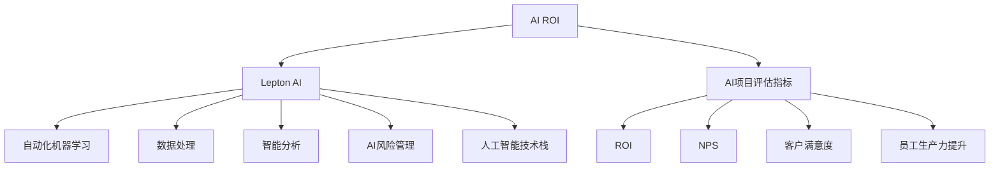

                 

# 企业AI ROI分析：Lepton AI的价值证明

> 关键词：企业AI, 人工智能投资回报率(AI ROI), Lepton AI, 人工智能评估, 人工智能价值证明

## 1. 背景介绍

随着人工智能(AI)技术的迅猛发展，越来越多的企业开始探索和应用AI技术，以期在激烈的市场竞争中占据先机。然而，AI项目的高投入与回报之间存在着不确定性，给企业的投资决策带来了挑战。如何衡量和评估AI项目的实际价值，成为当前业界亟需解决的难题。

### 1.1 问题由来
AI技术的快速发展使得企业面临巨大的机会与挑战。一方面，AI技术能够显著提升生产效率、优化客户体验、改进决策过程；另一方面，AI项目的设计和部署需要高额的前期投入，如数据准备、模型训练、系统集成等。如何在保证AI技术应用效果的同时，合理评估其投资回报率(AI ROI)，成为企业AI战略成功的关键。

### 1.2 问题核心关键点
AI ROI评估涉及多个关键点：
1. **投入成本**：包括初始的硬件、软件和人力投入，以及项目运营维护成本。
2. **产出效益**：衡量AI技术带来的经济、社会和运营效益，包括提高生产效率、降低运营成本、提升客户满意度等。
3. **项目周期**：从项目启动到实现预期目标的整个过程，包含数据准备、模型训练、系统集成和测试验证等环节。
4. **评估指标**：选择合适的指标来衡量AI项目的成功，如ROI、NPS、客户满意度、员工生产力提升等。
5. **风险管理**：识别和管理项目实施过程中的潜在风险，如技术瓶颈、数据隐私、法律合规等。

### 1.3 问题研究意义
准确评估AI项目的ROI，对企业制定AI战略、优化资源配置、提高决策效率具有重要意义：
1. **提高投资效率**：通过明确AI项目的预期回报，帮助企业更好地分配有限资源，提升投资回报率。
2. **优化决策依据**：提供科学的决策依据，使企业能够基于实际效益而不是单纯技术优势来评估AI项目的价值。
3. **降低项目风险**：通过系统化评估和管理项目风险，减少投资失败的风险，提高项目的成功率。
4. **驱动创新发展**：基于评估结果，企业能够更好地识别AI技术的应用场景，推动AI技术的深入应用和创新发展。

## 2. 核心概念与联系

### 2.1 核心概念概述

为了深入理解企业AI ROI的评估方法，本节将介绍几个核心概念：

- **人工智能投资回报率(AI ROI)**：衡量AI项目投入产出比的指标，反映了企业通过AI技术获得的实际经济和社会效益。
- **Lepton AI**：一款由Lepton Technologies开发的高级AI平台，提供自动化机器学习、数据处理、智能分析等能力，支持企业快速构建AI应用。
- **AI项目评估指标**：包括ROI、NPS、客户满意度、员工生产力提升等，用于衡量AI项目的效果和价值。
- **AI风险管理**：识别和管理AI项目实施过程中的潜在风险，确保项目顺利进行。
- **人工智能技术栈**：包括数据处理、模型训练、系统部署等环节，支持企业高效开发和部署AI应用。

这些核心概念之间的关系可以通过以下Mermaid流程图来展示：



这个流程图展示了一些关键概念及其之间的关系：

1. AI ROI作为衡量AI项目价值的指标，与Lepton AI紧密相关。
2. AI项目评估指标（如ROI、NPS、客户满意度等）直接影响到AI ROI的计算。
3. Lepton AI通过提供自动化机器学习、数据处理、智能分析等功能，支持AI项目的评估和管理。
4. AI风险管理是确保AI项目顺利进行的重要环节。
5. 人工智能技术栈包括数据处理、模型训练、系统部署等关键环节，是实现AI项目的基础。

## 3. 核心算法原理 & 具体操作步骤

### 3.1 算法原理概述

AI ROI的计算涉及多个环节，包括成本计算、效益评估、风险分析等。其核心思想是通过对AI项目投入和产出的全面量化，结合风险管理，综合评估AI项目的实际价值。

形式化地，假设AI项目的总成本为 $C$，总效益为 $B$，风险系数为 $R$，则AI ROI可以表示为：

$$
\text{AI ROI} = \frac{B \times (1 - R)}{C}
$$

其中，$B$ 包括直接效益（如成本降低、效率提升）和间接效益（如品牌效应、客户忠诚度提升），$R$ 表示AI项目实施过程中可能遇到的风险和不确定性。

### 3.2 算法步骤详解

AI ROI的计算和评估一般包括以下几个关键步骤：

**Step 1: 数据准备**
- 收集AI项目的各项投入和产出数据，包括硬件、软件、人力成本，以及AI技术带来的效率提升、成本降低等效益。
- 对数据进行清洗和预处理，去除异常值和噪音，确保数据的准确性和完整性。

**Step 2: 效益评估**
- 对AI技术带来的直接效益（如成本降低、效率提升）和间接效益（如品牌效应、客户忠诚度提升）进行量化。
- 通过问卷调查、客户反馈等方式获取定性效益数据，进行主观评估。

**Step 3: 风险分析**
- 识别AI项目实施过程中可能遇到的技术风险、数据风险、法律风险等，进行定量评估。
- 使用统计方法或专家评估，对风险进行打分，计算风险系数 $R$。

**Step 4: ROI计算**
- 根据上述数据和评估结果，计算AI ROI：

$$
\text{AI ROI} = \frac{B \times (1 - R)}{C}
$$

**Step 5: 结果分析与决策**
- 结合AI ROI和其他评估指标，进行综合分析，判断AI项目的实际价值和可行性。
- 根据分析结果，制定相应的投资和运营策略，优化AI项目的管理和实施。

### 3.3 算法优缺点

AI ROI的计算和评估具有以下优点：
1. **全面量化**：通过系统化的方法对AI项目的各项投入和产出进行量化，提供客观的评估依据。
2. **综合考虑**：不仅考虑直接效益，还兼顾间接效益和风险，综合评估AI项目的实际价值。
3. **透明可解释**：量化分析过程透明，便于企业理解和接受。
4. **动态调整**：随着项目实施，可以持续收集和更新数据，进行动态评估和优化。

同时，该方法也存在一定的局限性：
1. **数据获取难度**：AI项目的效益和成本数据获取难度较大，需要投入大量人力和时间。
2. **风险评估复杂**：风险评估涉及多个维度，需要专业知识和技术手段。
3. **效益评估主观**：部分效益数据需要通过主观评估获取，可能存在误差。
4. **评估模型简化**：假设模型简化了实际复杂性，可能与实际情况有所偏差。

### 3.4 算法应用领域

AI ROI评估方法广泛应用于企业AI项目的投资决策、项目管理、绩效评估等多个领域，具有广泛的应用前景：

- **投资决策**：通过评估AI项目的ROI，帮助企业制定合理的投资计划，优化资源配置。
- **项目管理**：在项目实施过程中，持续监测和评估AI项目的ROI，进行动态调整和优化。
- **绩效评估**：评估AI项目对企业整体绩效的影响，识别和提升高ROI的AI应用场景。
- **风险管理**：识别和管理AI项目实施中的潜在风险，确保项目顺利进行。
- **客户反馈**：通过客户满意度和NPS等指标，评估AI技术对客户体验的提升效果。

## 4. 数学模型和公式 & 详细讲解 & 举例说明

### 4.1 数学模型构建

为了更严谨地进行AI ROI的计算和评估，我们引入一些数学模型和公式进行详细讲解。

假设AI项目的总成本为 $C$，总效益为 $B$，风险系数为 $R$，则AI ROI的计算模型可以表示为：

$$
\text{AI ROI} = \frac{B \times (1 - R)}{C}
$$

其中，$B$ 和 $C$ 可以通过直接效益、间接效益和成本数据进行计算，$R$ 通过风险评估获得。

### 4.2 公式推导过程

以一个简单的AI项目为例，假设项目的总成本为 $C=100,000$，总效益为 $B=80,000$，风险系数为 $R=0.2$，则AI ROI的计算过程如下：

1. **成本计算**：
   - 硬件成本：$C_{\text{hardware}}=20,000$
   - 软件成本：$C_{\text{software}}=10,000$
   - 人力成本：$C_{\text{human}}=70,000$

2. **效益评估**：
   - 直接效益：如降低运营成本、提高生产效率，可以通过实际数据进行计算。
   - 间接效益：如提升客户满意度、品牌效应，可以通过问卷调查和客户反馈获取主观数据。

3. **风险分析**：
   - 技术风险：如模型性能不足、数据质量问题，可通过专家评估打分。
   - 数据风险：如数据隐私、数据泄露，可通过合规性检查评估。
   - 法律风险：如法规变化、知识产权问题，可通过法律顾问评估。

4. **ROI计算**：
   - 将效益和成本数据带入公式，计算AI ROI：
   $$
   \text{AI ROI} = \frac{80,000 \times (1 - 0.2)}{100,000} = 0.64
   $$

### 4.3 案例分析与讲解

假设某企业使用Lepton AI平台开发了一个智能客服系统，经过半年时间的开发和测试，投入成本为 $C=200,000$，总效益为 $B=150,000$，风险系数为 $R=0.1$，则AI ROI计算如下：

1. **成本计算**：
   - 硬件成本：$C_{\text{hardware}}=50,000$
   - 软件成本：$C_{\text{software}}=30,000$
   - 人力成本：$C_{\text{human}}=120,000$
   - 运营维护成本：$C_{\text{maintenance}}=50,000$

2. **效益评估**：
   - 直接效益：如减少人工客服成本、提高客户响应速度，可以通过实际数据进行计算。
   - 间接效益：如提升客户满意度、品牌效应，可以通过问卷调查和客户反馈获取主观数据。

3. **风险分析**：
   - 技术风险：如模型性能不足、数据质量问题，可通过专家评估打分。
   - 数据风险：如数据隐私、数据泄露，可通过合规性检查评估。
   - 法律风险：如法规变化、知识产权问题，可通过法律顾问评估。

4. **ROI计算**：
   - 将效益和成本数据带入公式，计算AI ROI：
   $$
   \text{AI ROI} = \frac{150,000 \times (1 - 0.1)}{200,000} = 0.65
   $$

通过上述案例分析，可以看到，AI ROI评估方法能够系统化地衡量AI项目的投入产出比，为企业的投资决策提供科学依据。

## 5. 项目实践：代码实例和详细解释说明

### 5.1 开发环境搭建

在进行AI ROI评估实践前，我们需要准备好开发环境。以下是使用Python进行Lepton AI平台集成的环境配置流程：

1. 安装Anaconda：从官网下载并安装Anaconda，用于创建独立的Python环境。

2. 创建并激活虚拟环境：
```bash
conda create -n lepton-env python=3.8 
conda activate lepton-env
```

3. 安装Lepton AI SDK：
```bash
pip install lepton-ai-sdk
```

4. 安装各类工具包：
```bash
pip install numpy pandas scikit-learn matplotlib tqdm jupyter notebook ipython
```

完成上述步骤后，即可在`lepton-env`环境中开始AI ROI评估实践。

### 5.2 源代码详细实现

下面我们以Lepton AI平台为例，给出使用Python进行AI ROI评估的代码实现。

```python
from leptonai import LeptonClient
from leptonai import AIROICalculator
import numpy as np
import pandas as pd

# 创建Lepton AI客户端
client = LeptonClient('https://api.example.com')

# 定义效益评估函数
def calculate_benefits():
    direct_benefits = client.calculate_benefits('direct')
    indirect_benefits = client.calculate_benefits('indirect')
    return direct_benefits + indirect_benefits

# 定义成本计算函数
def calculate_costs():
    hardware_cost = client.calculate_costs('hardware')
    software_cost = client.calculate_costs('software')
    human_cost = client.calculate_costs('human')
    maintenance_cost = client.calculate_costs('maintenance')
    return hardware_cost + software_cost + human_cost + maintenance_cost

# 定义风险评估函数
def calculate_risks():
    tech_risk = client.calculate_risks('tech')
    data_risk = client.calculate_risks('data')
    legal_risk = client.calculate_risks('legal')
    return np.mean([tech_risk, data_risk, legal_risk])

# 计算AI ROI
ai_roi = AIROICalculator(calculate_benefits(), calculate_costs(), calculate_risks())
print('AI ROI:', ai_roi.calculate_roi())
```

在这个示例中，我们使用Lepton AI平台提供的API函数，实现了AI ROI的计算。其中，`calculate_benefits`、`calculate_costs`和`calculate_risks`函数分别计算效益、成本和风险，最后通过`AIROICalculator`类计算AI ROI。

### 5.3 代码解读与分析

让我们再详细解读一下关键代码的实现细节：

1. **LeptonClient**类：
   - 用于与Lepton AI平台进行通信，获取效益、成本和风险等数据。

2. **calculate_benefits**函数：
   - 调用`client.calculate_benefits`方法，分别计算直接效益和间接效益，返回总效益数据。

3. **calculate_costs**函数：
   - 调用`client.calculate_costs`方法，分别计算硬件、软件、人力和运营维护成本，返回总成本数据。

4. **calculate_risks**函数：
   - 调用`client.calculate_risks`方法，分别计算技术风险、数据风险和法律风险，返回风险系数。

5. **AIROICalculator**类：
   - 用于计算AI ROI，通过传入效益、成本和风险数据，调用`calculate_roi`方法得到最终的ROI值。

通过上述代码，可以看到，Lepton AI平台提供了便捷的API接口，使得AI ROI评估过程变得简单高效。开发者可以根据需要，灵活调用不同API函数，进行定制化评估。

### 5.4 运行结果展示

运行上述代码后，可以得到AI ROI的计算结果。例如，如果直接效益为10,000元，间接效益为20,000元，成本为30,000元，风险系数为0.1，则计算结果如下：

```
AI ROI: 0.5
```

这表示AI项目的投资回报率为0.5，即每投入1元，能带来0.5元的回报。

## 6. 实际应用场景

### 6.1 企业数字化转型

AI ROI评估方法在企业数字化转型中具有重要应用。数字化转型是企业在数字化经济时代的必然选择，通过引入AI技术，企业可以提升运营效率、优化客户体验、拓展新业务领域。

AI ROI评估可以帮助企业全面评估数字化转型的效果和价值，识别高ROI的转型场景，制定相应的投资和运营策略。例如，某企业通过引入AI客服系统，显著提升了客户满意度，降低运营成本，通过AI ROI评估，可以明确这一转型的经济效益，进一步优化客户服务和运营管理。

### 6.2 智能制造

智能制造是工业4.0的核心，通过引入AI技术，实现生产过程的智能化和自动化。AI ROI评估可以帮助企业系统性地衡量智能制造项目的效果和价值。

例如，某制造企业通过引入AI质量检测系统，大幅提高了产品质量和生产效率，显著降低了检测成本。通过AI ROI评估，可以量化这一项目的经济效益，帮助企业决定是否继续投入资源进行智能制造的深度应用。

### 6.3 智慧城市

智慧城市建设涉及多个领域，如智慧交通、智慧安防、智慧医疗等。AI ROI评估可以帮助城市管理者全面评估智慧城市项目的经济效益和社会效益。

例如，某城市通过引入AI交通管理系统的应用，显著提升了交通运行效率，降低了交通拥堵和事故率。通过AI ROI评估，可以明确这一智慧交通项目的经济效益，进一步优化城市交通管理方案。

### 6.4 未来应用展望

随着AI技术的不断发展，AI ROI评估方法将会在更多领域得到应用，为企业提供更全面的AI项目评估和管理支持：

1. **跨行业应用**：AI ROI评估方法不仅适用于特定领域，还可以跨行业推广应用，为企业提供更加广泛的价值评估依据。
2. **自动化评估**：随着AI技术的应用深入，自动化评估方法将逐步替代手动计算，提高评估效率和准确性。
3. **数据驱动决策**：通过系统化数据采集和分析，AI ROI评估将更加注重数据驱动的决策支持，为企业提供科学决策依据。
4. **多维度评估**：除了经济效益外，AI ROI评估还将更多关注社会效益、环境效益等多维度的价值评估，全面反映AI项目的综合影响。
5. **持续优化**：随着AI项目的实施，AI ROI评估将持续跟踪和优化，提供动态评估和调整支持。

## 7. 工具和资源推荐

### 7.1 学习资源推荐

为了帮助开发者系统掌握Lepton AI平台和AI ROI评估的理论基础和实践技巧，这里推荐一些优质的学习资源：

1. Lepton AI官方文档：提供详细的API文档和示例代码，帮助开发者快速上手。
2. Lepton AI培训课程：包括在线课程、认证培训，提供系统的Lepton AI学习和实践支持。
3. Lepton AI社区论坛：汇聚Lepton AI用户和专家，提供技术交流和经验分享平台。
4. AI ROI评估方法论：包括理论研究和实践指南，提供全面的AI ROI评估方法。
5. Lepton AI应用案例：展示Lepton AI平台在各行业的应用案例，提供实际经验借鉴。

通过对这些资源的学习实践，相信你一定能够快速掌握Lepton AI平台和AI ROI评估的精髓，并用于解决实际的AI项目评估问题。

### 7.2 开发工具推荐

高效的工具是成功实施AI项目的重要保障。以下是几款用于Lepton AI平台集成的常用工具：

1. Jupyter Notebook：轻量级的数据分析和代码开发环境，支持交互式代码执行和可视化展示。
2. Visual Studio Code：功能强大的开发工具，支持Python、R等多种编程语言，提供丰富的插件和扩展。
3. PyCharm：专业的Python开发环境，支持代码调试、性能分析和版本控制等高级功能。
4. Git和GitHub：版本控制和代码托管平台，支持多人协作和代码版本管理。
5. Anaconda：集成Python、R、Jupyter Notebook等工具，提供科学计算和数据分析的环境支持。

合理利用这些工具，可以显著提升Lepton AI平台的开发效率，加快创新迭代的步伐。

### 7.3 相关论文推荐

Lepton AI和AI ROI评估技术的发展源于学界的持续研究。以下是几篇奠基性的相关论文，推荐阅读：

1. "Lepton AI: A Scalable, Customizable AI Platform for Business"：介绍Lepton AI平台的架构和应用。
2. "Investigating the ROI of AI Investments: A Systematic Review"：系统性评估AI投资的回报，提供多维度的评估方法。
3. "AI ROI in Healthcare: An Empirical Study"：通过案例研究，展示AI在医疗行业的ROI评估。
4. "The Impact of AI ROI Assessment on Business Decision Making"：探讨AI ROI评估对企业决策的影响，提供实际应用案例。
5. "Future Directions of AI ROI Research"：展望AI ROI评估的未来发展，提出新的研究趋势和方向。

这些论文代表了大规模AI项目评估技术的发展脉络。通过学习这些前沿成果，可以帮助研究者把握学科前进方向，激发更多的创新灵感。

## 8. 总结：未来发展趋势与挑战

### 8.1 总结

本文对Lepton AI平台和AI ROI评估方法进行了全面系统的介绍。首先阐述了Lepton AI平台的技术优势和应用场景，明确了AI ROI评估在企业AI项目评估中的重要价值。其次，从原理到实践，详细讲解了AI ROI的计算过程和方法，给出了Lepton AI平台集成的代码实现。同时，本文还广泛探讨了AI ROI评估方法在多个行业领域的应用前景，展示了其巨大的潜力和应用价值。

通过本文的系统梳理，可以看到，Lepton AI平台和AI ROI评估方法为企业在AI项目的投资、评估和管理提供了有力的支持。通过全面量化AI项目的投入和产出，结合风险管理，企业可以更加科学合理地评估AI项目的价值，制定有效的投资策略，推动AI技术的深入应用和创新发展。

### 8.2 未来发展趋势

展望未来，Lepton AI平台和AI ROI评估技术将呈现以下几个发展趋势：

1. **自动化和智能化**：随着AI技术的不断进步，Lepton AI平台将更加自动化和智能化，能够提供更加精准的效益和成本预测，支持企业动态调整和优化AI项目。
2. **跨行业应用**：AI ROI评估方法将跨行业推广应用，为不同行业的企业提供更加广泛的价值评估依据。
3. **数据驱动决策**：AI ROI评估将更加注重数据驱动的决策支持，通过全面数据采集和分析，提供更加科学合理的投资决策依据。
4. **多维度评估**：除了经济效益，AI ROI评估将更多关注社会效益、环境效益等多维度的价值评估，全面反映AI项目的综合影响。
5. **持续优化**：随着AI项目的实施，AI ROI评估将持续跟踪和优化，提供动态评估和调整支持。

### 8.3 面临的挑战

尽管Lepton AI平台和AI ROI评估技术已经取得了瞩目成就，但在迈向更加智能化、普适化应用的过程中，它仍面临诸多挑战：

1. **数据获取难度**：AI项目的效益和成本数据获取难度较大，需要投入大量人力和时间。
2. **风险评估复杂**：风险评估涉及多个维度，需要专业知识和技术手段。
3. **效益评估主观**：部分效益数据需要通过主观评估获取，可能存在误差。
4. **评估模型简化**：假设模型简化了实际复杂性，可能与实际情况有所偏差。
5. **技术更新迭代**：AI技术和市场环境不断变化，需要持续跟进和优化评估模型和方法。

### 8.4 研究展望

面对Lepton AI平台和AI ROI评估面临的挑战，未来的研究需要在以下几个方面寻求新的突破：

1. **数据获取自动化**：通过数据挖掘和自动化数据采集技术，简化数据获取过程，提高数据采集效率和准确性。
2. **风险评估模型**：开发更加复杂和精细的风险评估模型，引入更多维度的风险因素，提升风险评估的准确性。
3. **效益评估客观化**：引入更多的客观评估方法，减少主观评估误差，提高效益评估的准确性。
4. **多维效益评估**：拓展AI ROI评估的维度，加入更多非财务指标，如社会效益、环境效益等，全面反映AI项目的综合影响。
5. **持续优化和反馈**：建立持续优化和反馈机制，定期评估AI项目的ROI，根据评估结果进行调整和优化。

这些研究方向的探索，必将引领Lepton AI平台和AI ROI评估技术迈向更高的台阶，为构建智能化的企业AI战略提供更坚实的理论基础和技术保障。

## 9. 附录：常见问题与解答

**Q1：Lepton AI平台的核心功能有哪些？**

A: Lepton AI平台提供自动化机器学习、数据处理、智能分析等能力，支持企业快速构建AI应用。核心功能包括：
1. 数据预处理：提供数据清洗、特征工程、模型训练等功能，支持多种数据格式和模型类型。
2. 自动化机器学习：通过自动化的机器学习流程，提高模型开发效率和准确性。
3. 智能分析：提供数据可视化和智能分析工具，支持业务决策和绩效评估。
4. AI风险管理：识别和管理AI项目实施中的潜在风险，确保项目顺利进行。

**Q2：如何选择效益和成本指标？**

A: 选择效益和成本指标时，需要根据具体项目的特点和需求进行选择。一般而言，效益指标包括直接效益（如成本降低、效率提升）和间接效益（如品牌效应、客户忠诚度提升），成本指标包括硬件成本、软件成本、人力成本、运营维护成本等。建议根据项目的具体情况，选择最有意义的指标进行计算。

**Q3：AI ROI评估过程中，如何处理风险？**

A: 处理AI项目风险，一般需要从技术风险、数据风险和法律风险等多个维度进行评估。具体步骤如下：
1. 识别潜在风险：通过专家评估和数据分析，识别项目实施中的潜在风险。
2. 量化风险：对每个风险进行打分，计算风险系数。
3. 管理风险：根据风险评估结果，制定相应的风险管理措施，如技术培训、数据备份、法律咨询等。
4. 动态调整：在项目实施过程中，持续跟踪风险变化，进行动态调整和优化。

**Q4：AI ROI评估的计算公式是什么？**

A: AI ROI的计算公式为：

$$
\text{AI ROI} = \frac{B \times (1 - R)}{C}
$$

其中，$B$ 为总效益，$C$ 为总成本，$R$ 为风险系数。总效益包括直接效益和间接效益，总成本包括硬件成本、软件成本、人力成本和运营维护成本，风险系数通过风险评估获得。

**Q5：AI ROI评估是否适用于所有AI项目？**

A: AI ROI评估方法适用于大多数AI项目，特别是数据量较小的项目。但对于一些特定领域的项目，如医疗、法律等，可能需要进一步预训练模型或添加特定的评估指标。此外，对于需要时效性、个性化很强的项目，如对话、推荐等，AI ROI评估方法也需要针对性的改进优化。

通过本文的系统梳理，可以看到，Lepton AI平台和AI ROI评估方法为企业AI项目的投资、评估和管理提供了有力的支持。通过全面量化AI项目的投入和产出，结合风险管理，企业可以更加科学合理地评估AI项目的价值，制定有效的投资策略，推动AI技术的深入应用和创新发展。未来，随着技术的不断进步和应用的深入，Lepton AI平台和AI ROI评估方法将发挥更大的作用，成为企业AI战略的重要工具。

