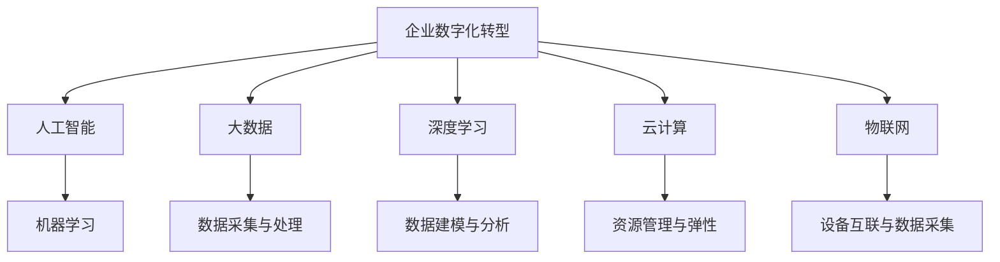

                 

# 企业数字化转型中的AI应用技术

> 关键词：企业数字化转型,人工智能,大数据,机器学习,深度学习,云计算,物联网

## 1. 背景介绍

### 1.1 问题由来
企业数字化转型是当前各行各业发展的重要趋势。在数字化浪潮的推动下，企业通过信息技术与业务流程的深度融合，实现数据驱动的决策和运营，提升企业竞争力和市场响应速度。人工智能(AI)作为数字化转型的核心技术之一，通过深度学习、机器学习、自然语言处理等前沿技术，为企业数字化转型提供了强大的技术支撑。

当前，AI在企业数字化转型中的应用已经广泛渗透到产品研发、市场营销、供应链管理、客户服务等多个环节，助力企业实现智能化升级。然而，AI技术的深入应用也面临着诸多挑战，如数据隐私与安全、算法偏见与透明性、技术复杂度与成本控制等问题。如何有效整合AI技术，并结合企业实际业务需求，实现精准化、高效化的企业数字化转型，是当前亟需解决的现实问题。

### 1.2 问题核心关键点
企业在数字化转型中应用AI技术，主要需要关注以下几个核心关键点：

- 数据的获取与处理：AI应用的基础是数据，需要企业具备高效的数据采集与处理能力，确保数据的时效性、准确性和安全性。
- 算法的选用与优化：选择适合的AI算法，并根据业务需求进行优化调整，确保算法模型的性能和可靠性。
- 模型的部署与应用：将训练好的模型集成到实际业务场景中，确保模型在真实环境中的表现。
- 业务与技术的协同：将AI技术深度融合到企业核心业务流程中，实现业务与技术的协同发展。
- 技术与安全的平衡：在推动业务创新的同时，确保数据安全与合规，防范AI应用的潜在风险。

这些关键点共同构成了企业数字化转型中AI应用的全流程，需要企业在技术、业务和管理等层面进行全面的协同配合。

### 1.3 问题研究意义
深入研究企业数字化转型中的AI应用技术，对于推动企业数字化转型具有重要意义：

1. 提升运营效率：AI技术可以自动化处理大量繁琐的数据分析任务，提升企业运营效率，减少人工成本。
2. 增强决策支持：通过AI模型对海量数据进行深入分析，帮助企业做出更加精准的决策，优化业务策略。
3. 创新业务模式：AI技术可以与企业现有业务进行深度融合，创新业务模式，提升企业市场竞争力。
4. 改善用户体验：通过AI技术实现智能推荐、智能客服等功能，提升用户满意度和品牌忠诚度。
5. 加速创新迭代：AI技术能够加速新产品开发和迭代，帮助企业快速响应市场变化，保持竞争优势。

## 2. 核心概念与联系

### 2.1 核心概念概述

为更好地理解企业数字化转型中的AI应用技术，本节将介绍几个密切相关的核心概念：

- 企业数字化转型：通过信息技术与业务流程的深度融合，实现企业数字化运营，提升企业效率和市场响应速度的过程。
- 人工智能：利用计算机和数学算法模拟人类智能的技术，涵盖机器学习、深度学习、自然语言处理等多个子领域。
- 大数据：指规模庞大、复杂多样、快速增长的数据集合，通常用于企业决策分析、客户行为预测等。
- 深度学习：一种基于人工神经网络的机器学习技术，通过多层神经网络的抽象学习，实现对复杂数据和模式的建模。
- 云计算：一种基于互联网的计算模式，通过共享计算资源、存储资源和应用软件，实现按需计算与资源弹性。
- 物联网(IoT)：将各种物理设备、传感器、通信技术等互联互通，实现设备间的信息交互和智能化管理。

这些核心概念之间的逻辑关系可以通过以下Mermaid流程图来展示：



这个流程图展示了大数据、深度学习、人工智能、云计算、物联网等技术如何共同支持企业数字化转型：

1. 企业数字化转型需要依赖人工智能，通过AI技术进行业务流程的智能化优化。
2. 人工智能在深度学习、机器学习等技术支撑下，实现对大数据的高效建模与分析。
3. 大数据为企业数字化转型提供数据支撑，实现数据驱动的决策和运营。
4. 云计算为AI技术提供计算资源和存储资源，支持大模型的训练和应用。
5. 物联网实现物理设备的互联互通，实时采集数据，提升企业运营效率。

这些核心概念共同构成了企业数字化转型中AI应用的技术框架，为企业数字化转型提供了技术支持和战略指引。

## 3. 核心算法原理 & 具体操作步骤
### 3.1 算法原理概述

企业数字化转型中应用AI技术，主要涉及以下几个关键算法：

- 机器学习算法：包括监督学习、非监督学习、半监督学习等，用于从数据中学习模型，实现对未知数据的预测和分类。
- 深度学习算法：包括卷积神经网络(CNN)、循环神经网络(RNN)、变分自编码器(VAE)等，用于处理图像、序列、文本等复杂结构化数据。
- 自然语言处理(NLP)算法：包括词嵌入、语言模型、文本分类、机器翻译等，用于理解和生成自然语言。
- 强化学习算法：用于解决优化问题，通过与环境的交互，不断调整策略，实现最优决策。

这些算法通过不同的模型结构和训练策略，实现对企业数据的智能化分析和处理，为业务决策提供支持。

### 3.2 算法步骤详解

企业数字化转型中应用AI技术，一般包括以下几个关键步骤：

**Step 1: 数据采集与处理**
- 通过传感器、数据库、互联网等渠道采集企业内外的数据。
- 对采集到的数据进行清洗、去重、归一化等预处理，确保数据的准确性和完整性。
- 采用大数据技术进行数据存储和分布式处理，提升数据处理效率。

**Step 2: 算法模型选择与训练**
- 根据业务需求选择合适的AI算法和模型架构。
- 使用训练数据集对模型进行训练，调整模型参数，提升模型性能。
- 使用验证数据集对训练好的模型进行评估，选择最优模型。

**Step 3: 模型集成与部署**
- 将训练好的模型集成到实际业务应用中。
- 通过API、SDK等接口，将模型提供给其他系统或业务模块调用。
- 使用云计算平台进行模型的部署和监控，确保模型在实际环境中的稳定性和可扩展性。

**Step 4: 业务应用与优化**
- 在业务流程中引入AI技术，实现智能决策和自动化处理。
- 根据业务反馈，不断优化AI模型，提升模型效果。
- 引入用户反馈和行为数据，对AI模型进行在线学习，实现动态优化。

### 3.3 算法优缺点

AI在企业数字化转型中的应用具有以下优点：

1. 提升效率与准确性：AI技术能够自动化处理大量数据，提升业务运营效率，降低人工成本。同时，通过机器学习等算法，提高决策的准确性和科学性。
2. 增强业务洞察：AI技术能够从海量数据中挖掘出有价值的信息和模式，为企业提供深层次的业务洞察，优化业务策略。
3. 创新业务模式：AI技术可以与现有业务进行深度融合，创新业务模式，提升企业市场竞争力。
4. 改善用户体验：通过AI技术实现智能推荐、智能客服等功能，提升用户满意度和品牌忠诚度。
5. 加速创新迭代：AI技术能够加速新产品开发和迭代，帮助企业快速响应市场变化，保持竞争优势。

同时，AI技术在企业数字化转型中也存在以下缺点：

1. 数据隐私与安全：AI应用需要大量的数据支持，涉及数据隐私和安全问题，需要企业建立完善的数据保护机制。
2. 算法偏见与透明性：AI模型可能会存在算法偏见，需要企业进行模型透明性和可解释性分析，确保模型公平公正。
3. 技术复杂度与成本控制：AI技术开发和部署复杂，需要企业具备相应的技术能力和资源投入，控制成本。
4. 业务与技术的协同：AI技术与业务深度融合需要企业具备技术、业务和管理等多方面的协同能力。
5. 技术与安全的平衡：在推动业务创新的同时，需要确保数据安全与合规，防范AI应用的潜在风险。

### 3.4 算法应用领域

AI在企业数字化转型中的应用领域广泛，包括但不限于以下几个方面：

- **产品研发**：通过AI技术进行产品需求分析、设计优化、性能测试等，提升产品研发效率和质量。
- **市场营销**：利用AI技术进行用户画像分析、市场趋势预测、广告投放优化等，提升市场营销效果。
- **供应链管理**：通过AI技术实现库存优化、物流规划、需求预测等，提升供应链效率和响应速度。
- **客户服务**：引入AI技术实现智能客服、客户行为分析、情感分析等，提升客户满意度和忠诚度。
- **智能制造**：应用AI技术实现生产自动化、质量检测、设备维护等，提升制造效率和产品质量。
- **财务管理**：利用AI技术进行财务数据分析、风险管理、欺诈检测等，提升财务管理和运营效率。

## 4. 数学模型和公式 & 详细讲解 & 举例说明
### 4.1 数学模型构建

在企业数字化转型中，AI技术的应用往往依赖于数学模型的构建。以机器学习为例，其数学模型可以表示为：

$$
y = f(x; \theta)
$$

其中，$y$ 为预测值，$x$ 为输入特征，$f$ 为模型函数，$\theta$ 为模型参数。在企业数字化转型中，常见的数学模型包括线性回归、逻辑回归、决策树、随机森林、神经网络等。

以线性回归为例，其数学模型可以表示为：

$$
y = \beta_0 + \beta_1 x_1 + \beta_2 x_2 + ... + \beta_n x_n
$$

其中，$\beta_0$ 为截距，$\beta_1, \beta_2, ..., \beta_n$ 为系数。线性回归模型的目标是最小化预测值与真实值之间的误差，常用的损失函数为均方误差：

$$
L(y, \hat{y}) = \frac{1}{2} \sum_{i=1}^n (y_i - \hat{y}_i)^2
$$

### 4.2 公式推导过程

以下以线性回归模型为例，推导其优化过程：

1. 构建损失函数：

$$
L(y, \hat{y}) = \frac{1}{2} \sum_{i=1}^n (y_i - \hat{y}_i)^2
$$

2. 对模型参数求导：

$$
\frac{\partial L}{\partial \beta_j} = - \sum_{i=1}^n (y_i - \hat{y}_i) x_{ij}
$$

3. 将求导结果带入优化方程：

$$
\frac{\partial L}{\partial \beta_j} = - \sum_{i=1}^n (y_i - \hat{y}_i) x_{ij} = 0
$$

4. 求解优化方程：

$$
\beta_j = \frac{\sum_{i=1}^n (y_i - \hat{y}_i) x_{ij}}{\sum_{i=1}^n x_{ij}^2}
$$

通过上述推导过程，可以构建一个线性回归模型的优化方程，从而在企业数字化转型中进行数据建模和预测。

### 4.3 案例分析与讲解

假设某电商平台希望通过AI技术预测用户购买行为，可以采用线性回归模型进行数据建模。具体步骤如下：

1. 数据采集：收集用户历史购买记录、浏览记录、评价记录等数据，提取用户特征和购买标签。
2. 数据预处理：对数据进行清洗、去重、归一化等预处理，确保数据的质量和准确性。
3. 模型构建：构建线性回归模型，设定截距和系数，表示用户行为与购买标签之间的关系。
4. 模型训练：使用历史数据对模型进行训练，调整模型参数，提升模型预测准确性。
5. 模型评估：使用验证数据集对训练好的模型进行评估，选择最优模型。
6. 业务应用：将训练好的模型集成到电商推荐系统中，根据用户特征预测其购买行为，实现个性化推荐。

## 5. 项目实践：代码实例和详细解释说明
### 5.1 开发环境搭建

在进行AI项目实践前，我们需要准备好开发环境。以下是使用Python进行机器学习开发的环境配置流程：

1. 安装Anaconda：从官网下载并安装Anaconda，用于创建独立的Python环境。

2. 创建并激活虚拟环境：
```bash
conda create -n ml-env python=3.8 
conda activate ml-env
```

3. 安装必要的Python库：
```bash
conda install numpy pandas matplotlib scikit-learn scikit-optimize jupyter notebook
```

4. 安装机器学习库：
```bash
pip install torch torchvision torchaudio
```

5. 安装深度学习库：
```bash
pip install tensorflow tensorflow-gpu
```

完成上述步骤后，即可在`ml-env`环境中开始AI项目实践。

### 5.2 源代码详细实现

下面我们以线性回归模型为例，给出使用Python进行机器学习项目开发的代码实现。

```python
import numpy as np
from sklearn.linear_model import LinearRegression
from sklearn.metrics import mean_squared_error
from sklearn.model_selection import train_test_split
from sklearn.datasets import make_regression

# 生成随机数据
X, y = make_regression(n_samples=1000, n_features=5, noise=0.1)

# 数据划分
X_train, X_test, y_train, y_test = train_test_split(X, y, test_size=0.2, random_state=42)

# 训练模型
model = LinearRegression()
model.fit(X_train, y_train)

# 模型评估
y_pred = model.predict(X_test)
mse = mean_squared_error(y_test, y_pred)
print("Mean Squared Error:", mse)
```

在上述代码中，我们首先使用`make_regression`函数生成了1000个样本的随机数据，其中包含5个特征和1个目标变量。然后通过`train_test_split`函数将数据划分为训练集和测试集，使用`LinearRegression`类训练模型，并使用`mean_squared_error`函数评估模型预测误差。

### 5.3 代码解读与分析

让我们再详细解读一下关键代码的实现细节：

**make_regression函数**：
- 用于生成模拟数据，常用于机器学习模型的评估和调参。

**train_test_split函数**：
- 用于将数据集划分为训练集和测试集，便于模型训练和评估。

**LinearRegression类**：
- 实现线性回归模型的训练和预测。

**mean_squared_error函数**：
- 用于计算预测值与真实值之间的均方误差，衡量模型预测的准确性。

**代码运行结果**：
- 运行上述代码，输出结果为模型在测试集上的均方误差，反映了模型预测的准确性。

## 6. 实际应用场景
### 6.1 智能客服系统

智能客服系统是企业数字化转型中AI应用的重要场景。传统客服系统依赖大量人力，响应速度慢且质量不稳定。通过引入AI技术，可以实现24小时在线客服，提升客户满意度和服务效率。

在实际应用中，智能客服系统可以集成自然语言处理(NLP)技术，通过对话理解和生成算法，实现自然语言交互。同时，利用机器学习算法对历史客服数据进行分析，实现意图识别和智能应答，提供更加精准和个性化的服务体验。

### 6.2 供应链管理

供应链管理是企业数字化转型的核心环节。通过AI技术，可以实现库存优化、物流规划、需求预测等，提升供应链效率和响应速度。

在实际应用中，可以使用机器学习算法对历史销售数据、库存数据、市场数据等进行分析，预测未来的销售趋势和需求量，实现库存优化和物流规划。同时，利用深度学习技术进行图像识别和语音识别，实现智能质检和仓储管理。

### 6.3 智能制造

智能制造是工业4.0的核心技术之一。通过AI技术，可以实现生产自动化、质量检测、设备维护等，提升制造效率和产品质量。

在实际应用中，可以使用机器学习算法对生产数据进行分析，预测设备故障和维护需求，实现设备维护和保养的自动化管理。同时，利用深度学习技术进行图像识别和异常检测，实现产品质量的实时监控和反馈。

### 6.4 未来应用展望

随着AI技术的不断发展，未来企业在数字化转型中的应用场景将更加广泛。以下是几个未来可能的发展方向：

1. **智慧医疗**：AI技术可以应用于医疗影像分析、疾病预测、药物研发等，提升医疗服务的智能化水平，辅助医生诊疗，加速新药开发进程。

2. **智能教育**：AI技术可以应用于学生画像分析、学习行为预测、智能推荐等，因材施教，促进教育公平，提高教学质量。

3. **智慧城市**：AI技术可以应用于城市事件监测、舆情分析、应急指挥等环节，提高城市管理的自动化和智能化水平，构建更安全、高效的未来城市。

4. **金融科技**：AI技术可以应用于金融舆情监测、信用评估、风险管理等，提升金融服务的智能化水平，防范金融风险。

5. **智能制造**：AI技术可以应用于生产自动化、质量检测、设备维护等，提升制造效率和产品质量，实现智能制造。

以上未来应用方向将进一步推动AI技术的普及和应用，为企业数字化转型提供更加智能化、高效化的解决方案。

## 7. 工具和资源推荐
### 7.1 学习资源推荐

为了帮助开发者系统掌握AI技术，这里推荐一些优质的学习资源：

1. 《Python机器学习基础教程》：一本经典的Python机器学习入门书籍，介绍了机器学习的基本概念和常见算法。

2. 《深度学习》（Goodfellow等著）：深度学习领域的经典教材，详细介绍了深度神经网络的原理和应用。

3. 《自然语言处理综论》（Jurafsky等著）：自然语言处理领域的经典教材，涵盖了NLP的主要技术和应用。

4. 《TensorFlow实战》（张博研等著）：TensorFlow的实战教程，详细介绍了TensorFlow的搭建和应用。

5. 《机器学习实战》（Peter Harrington著）：Python机器学习实战教程，提供了大量机器学习算法的代码实现。

6. 《Scikit-Learn实战》（Erich Chang等著）：Scikit-Learn的实战教程，介绍了机器学习算法的应用和调参技巧。

通过对这些资源的学习实践，相信你一定能够系统掌握AI技术，并应用于企业数字化转型的各个环节。

### 7.2 开发工具推荐

高效的开发离不开优秀的工具支持。以下是几款用于AI开发常用的工具：

1. PyTorch：基于Python的开源深度学习框架，灵活动态的计算图，适合快速迭代研究。

2. TensorFlow：由Google主导开发的开源深度学习框架，生产部署方便，适合大规模工程应用。

3. Scikit-Learn：Python机器学习库，提供了丰富的机器学习算法和工具函数，适合快速原型开发。

4. Jupyter Notebook：开源的交互式笔记本工具，适合进行数据探索和模型验证。

5. Anaconda：开源的Python发行版本，包含大量科学计算和数据处理库，适合快速搭建开发环境。

合理利用这些工具，可以显著提升AI项目的开发效率，加快创新迭代的步伐。

### 7.3 相关论文推荐

AI技术的发展源于学界的持续研究。以下是几篇奠基性的相关论文，推荐阅读：

1. Deep Learning（Goodfellow等著）：深度学习领域的经典教材，详细介绍了深度神经网络的原理和应用。

2. Reinforcement Learning: An Introduction（Sutton和Barto著）：强化学习领域的经典教材，介绍了强化学习的原理和算法。

3. Advances in Neural Information Processing Systems（NIPS会议论文）：自然语言处理、计算机视觉、深度学习等领域的顶级会议论文集，涵盖了最新研究成果和技术进展。

4. International Conference on Machine Learning（ICML会议论文）：机器学习领域的顶级会议论文集，涵盖了最新研究成果和技术进展。

这些论文代表了大数据、深度学习、自然语言处理等领域的最新进展，对于了解AI技术的发展趋势具有重要参考价值。

## 8. 总结：未来发展趋势与挑战
### 8.1 研究成果总结

本文对企业数字化转型中的AI应用技术进行了全面系统的介绍。首先阐述了企业数字化转型和AI技术的应用背景，明确了AI技术在企业数字化转型中的核心作用。其次，从原理到实践，详细讲解了AI技术在企业数字化转型中的应用过程，给出了AI项目开发的完整代码实例。同时，本文还广泛探讨了AI技术在智能客服、供应链管理、智能制造等多个行业领域的应用前景，展示了AI技术的发展潜力。此外，本文精选了AI技术的各类学习资源，力求为读者提供全方位的技术指引。

通过本文的系统梳理，可以看到，AI技术在企业数字化转型中的应用前景广阔，通过智能化、高效化的技术手段，可以帮助企业实现数字化升级，提升市场竞争力。AI技术作为企业数字化转型的核心技术，将引领企业进入智能化时代，推动企业不断创新和发展。

### 8.2 未来发展趋势

展望未来，AI技术在企业数字化转型中的应用将呈现以下几个发展趋势：

1. **智能化升级**：AI技术将深度融入企业核心业务流程中，实现业务流程的智能化优化，提升运营效率和市场响应速度。
2. **个性化服务**：通过AI技术实现个性化推荐、智能客服等功能，提升用户满意度和品牌忠诚度。
3. **跨领域融合**：AI技术将与其他技术如物联网、区块链、5G等进行深度融合，推动各领域的技术创新和应用升级。
4. **数据驱动决策**：AI技术将通过大数据分析，提供深层次的业务洞察，优化业务策略，提升决策科学性。
5. **自动化管理**：AI技术将实现生产自动化、供应链优化、设备维护等自动化管理，提升制造效率和产品质量。
6. **智能化创新**：AI技术将加速新产品开发和迭代，帮助企业快速响应市场变化，保持竞争优势。

以上趋势凸显了AI技术在企业数字化转型中的重要地位，未来的发展方向将进一步推动企业进入智能化时代，提升企业运营效率和市场竞争力。

### 8.3 面临的挑战

尽管AI技术在企业数字化转型中已经取得了瞩目成就，但在迈向更加智能化、高效化的应用过程中，仍面临诸多挑战：

1. **数据隐私与安全**：AI应用需要大量的数据支持，涉及数据隐私和安全问题，需要企业建立完善的数据保护机制。
2. **算法偏见与透明性**：AI模型可能会存在算法偏见，需要企业进行模型透明性和可解释性分析，确保模型公平公正。
3. **技术复杂度与成本控制**：AI技术开发和部署复杂，需要企业具备相应的技术能力和资源投入，控制成本。
4. **业务与技术的协同**：AI技术与业务深度融合需要企业具备技术、业务和管理等多方面的协同能力。
5. **技术与安全的平衡**：在推动业务创新的同时，需要确保数据安全与合规，防范AI应用的潜在风险。

这些挑战需要企业在技术、业务和管理等层面进行全面的协同配合，才能充分利用AI技术的优势，推动企业数字化转型的顺利实施。

### 8.4 研究展望

面对AI技术在企业数字化转型中面临的挑战，未来的研究需要在以下几个方面寻求新的突破：

1. **探索无监督和半监督学习**：摆脱对大规模标注数据的依赖，利用自监督学习、主动学习等无监督和半监督范式，最大限度利用非结构化数据，实现更加灵活高效的AI应用。
2. **研究参数高效和计算高效的模型**：开发更加参数高效的模型，在固定大部分预训练参数的同时，只更新极少量的任务相关参数。同时优化模型的计算图，减少前向传播和反向传播的资源消耗，实现更加轻量级、实时性的部署。
3. **引入更多先验知识**：将符号化的先验知识，如知识图谱、逻辑规则等，与神经网络模型进行巧妙融合，引导AI模型学习更准确、合理的语言模型。同时加强不同模态数据的整合，实现视觉、语音等多模态信息与文本信息的协同建模。
4. **结合因果分析和博弈论工具**：将因果分析方法引入AI模型，识别出模型决策的关键特征，增强输出解释的因果性和逻辑性。借助博弈论工具刻画人机交互过程，主动探索并规避模型的脆弱点，提高系统稳定性。
5. **纳入伦理道德约束**：在模型训练目标中引入伦理导向的评估指标，过滤和惩罚有偏见、有害的输出倾向。同时加强人工干预和审核，建立模型行为的监管机制，确保输出符合人类价值观和伦理道德。

这些研究方向的探索，将引领AI技术在企业数字化转型中的不断创新和发展，推动企业数字化转型的顺利实施。

## 9. 附录：常见问题与解答

**Q1: 企业数字化转型中的AI应用有什么关键步骤？**

A: 企业数字化转型中的AI应用主要包括以下关键步骤：
1. 数据采集与处理：通过传感器、数据库、互联网等渠道采集企业内外的数据，并进行清洗、去重、归一化等预处理。
2. 算法模型选择与训练：根据业务需求选择合适的AI算法和模型架构，使用训练数据集对模型进行训练，调整模型参数，提升模型性能。
3. 模型集成与部署：将训练好的模型集成到实际业务应用中，通过API、SDK等接口，将模型提供给其他系统或业务模块调用。
4. 业务应用与优化：在业务流程中引入AI技术，实现智能决策和自动化处理，根据业务反馈，不断优化AI模型，提升模型效果。

**Q2: AI在企业数字化转型中有什么优缺点？**

A: AI在企业数字化转型中的应用具有以下优点：
1. 提升效率与准确性：AI技术能够自动化处理大量数据，提升业务运营效率，降低人工成本。同时，通过机器学习等算法，提高决策的准确性和科学性。
2. 增强业务洞察：AI技术能够从海量数据中挖掘出有价值的信息和模式，为企业提供深层次的业务洞察，优化业务策略。
3. 创新业务模式：AI技术可以与现有业务进行深度融合，创新业务模式，提升企业市场竞争力。
4. 改善用户体验：通过AI技术实现智能推荐、智能客服等功能，提升用户满意度和品牌忠诚度。
5. 加速创新迭代：AI技术能够加速新产品开发和迭代，帮助企业快速响应市场变化，保持竞争优势。

同时，AI技术在企业数字化转型中也存在以下缺点：
1. 数据隐私与安全：AI应用需要大量的数据支持，涉及数据隐私和安全问题，需要企业建立完善的数据保护机制。
2. 算法偏见与透明性：AI模型可能会存在算法偏见，需要企业进行模型透明性和可解释性分析，确保模型公平公正。
3. 技术复杂度与成本控制：AI技术开发和部署复杂，需要企业具备相应的技术能力和资源投入，控制成本。
4. 业务与技术的协同：AI技术与业务深度融合需要企业具备技术、业务和管理等多方面的协同能力。
5. 技术与安全的平衡：在推动业务创新的同时，需要确保数据安全与合规，防范AI应用的潜在风险。

**Q3: AI技术在企业数字化转型中如何实现智能化升级？**

A: AI技术可以通过以下方式实现企业智能化升级：
1. 引入智能决策系统：通过机器学习算法对海量数据进行分析，实现智能决策支持，优化业务策略。
2. 实现自动化处理：利用AI技术进行自动化处理，如自动推荐、自动化客服等，提升运营效率，降低人工成本。
3. 实现个性化服务：通过AI技术实现个性化推荐、智能客服等功能，提升用户满意度和品牌忠诚度。
4. 实现智能制造：应用AI技术进行生产自动化、质量检测、设备维护等，提升制造效率和产品质量。
5. 实现智能运营：利用AI技术进行智能运营优化，如库存优化、物流规划、需求预测等，提升运营效率和市场响应速度。

**Q4: AI技术在企业数字化转型中如何实现数据驱动决策？**

A: AI技术可以通过以下方式实现数据驱动决策：
1. 数据采集与处理：通过传感器、数据库、互联网等渠道采集企业内外的数据，并进行清洗、去重、归一化等预处理。
2. 数据建模与分析：使用机器学习、深度学习等算法，对采集到的数据进行建模和分析，提取有价值的信息和模式。
3. 智能决策支持：将建模和分析结果应用于智能决策系统，支持企业进行精准决策。
4. 实时监测与优化：利用AI技术进行实时监测和优化，及时调整业务策略，提升决策效率和科学性。

以上是企业数字化转型中AI应用的关键步骤和优缺点，通过系统掌握这些知识，相信你一定能够充分利用AI技术，推动企业数字化转型的顺利实施。

