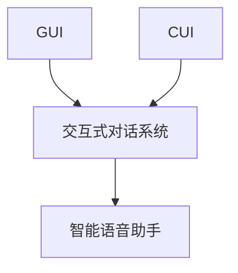

                 

## 1. 背景介绍

随着数字化时代的来临，界面作为人与计算机之间的交互桥梁，对于用户的使用体验、应用效率和系统的易用性具有至关重要的影响。长期以来，图形用户界面（GUI）以其直观、易用、符合人类认知习惯的特性，成为计算机应用中的主要交互方式。而随着智能设备和移动设备的普及，传统的GUI逐渐受到智能语音和自然语言处理（NLP）技术的挑战。

本文将对比传统的图形用户界面和新兴的计算机用户界面（CUI），分析两种界面各自的优缺点、发展历史、应用场景以及未来趋势，以期为未来的用户界面设计提供参考。

## 2. 核心概念与联系

### 2.1 核心概念概述

- **图形用户界面（GUI）**：一种基于图形化元素（如按钮、菜单、窗口等）的界面，用户通过鼠标、触摸屏等硬件操作进行交互。
- **计算机用户界面（CUI）**：利用计算机自然语言理解和生成能力，通过自然语言和智能语音与计算机系统进行交互的界面。
- **交互式对话系统**：一类基于自然语言理解和生成技术的交互系统，能够理解用户意图并执行相应任务。
- **智能语音助手**：一种特定类型的计算机用户界面，以语音为输入输出方式，如Apple的Siri、Amazon的Alexa、Google Assistant等。

### 2.2 核心概念原理和架构的 Mermaid 流程图



该图展示了GUI、CUI、交互式对话系统、智能语音助手之间的关系。GUI和CUI通过交互式对话系统（CUI）与智能语音助手（D）相连接，这些系统共同构成现代计算机用户界面的生态。

## 3. 核心算法原理 & 具体操作步骤

### 3.1 算法原理概述

#### 3.1.1 GUI原理

GUI界面的核心是图形化元素（按钮、菜单、窗口等），通过用户鼠标或触摸屏的点击、拖动等操作触发事件，实现信息获取和指令执行。其工作原理主要包括：

1. **事件驱动**：用户操作触发事件，系统响应相应的事件处理函数。
2. **图形渲染**：通过图形渲染库（如Qt、WPF等）将界面元素绘制到屏幕上。
3. **数据绑定**：通过模型-视图-控制器（MVC）等架构，实现界面元素和数据模型的绑定。

#### 3.1.2 CUI原理

CUI界面的核心是自然语言理解和生成技术，通过智能语音或文本输入，系统自动分析用户意图，执行相应任务。其工作原理主要包括：

1. **自然语言处理**：利用语言模型、命名实体识别、意图分类等技术，理解和分析用户输入的自然语言。
2. **对话管理**：维护对话状态，管理对话流程，确定下一步的响应。
3. **自然语言生成**：生成符合语法规则、语义准确的自然语言响应，输出到用户界面。

### 3.2 算法步骤详解

#### 3.2.1 GUI步骤详解

1. **设计界面**：确定界面元素、布局、交互逻辑等。
2. **实现事件处理**：为每个界面元素编写事件处理函数。
3. **进行图形渲染**：通过图形渲染库绘制界面元素。
4. **数据绑定**：将界面元素与数据模型进行绑定。
5. **用户交互**：用户通过鼠标、触摸屏等硬件进行操作。
6. **事件响应**：系统响应用户操作，执行相应事件处理函数。

#### 3.2.2 CUI步骤详解

1. **收集用户输入**：通过智能语音或文本输入设备，收集用户输入。
2. **自然语言理解**：利用NLP技术解析用户输入，提取关键信息。
3. **意图分类**：分析用户意图，确定用户希望执行的任务。
4. **对话管理**：维护对话状态，记录历史对话信息。
5. **生成自然语言响应**：根据用户意图生成自然语言回应。
6. **输出响应**：将响应输出到用户界面，并通过语音或文本形式呈现。

### 3.3 算法优缺点

#### 3.3.1 GUI优缺点

**优点**：

1. **直观易用**：通过图形元素直观展示信息，符合人类认知习惯。
2. **交互灵活**：支持多种输入输出方式，如鼠标、触摸屏、键盘等。
3. **标准化高**：有丰富的第三方组件和库，易于开发和维护。

**缺点**：

1. **学习成本高**：需要用户掌握特定操作系统和界面操作技巧。
2. **易受硬件限制**：依赖于硬件设备（如触摸屏、鼠标等），移动设备使用不便。
3. **交互效率低**：频繁的点击和拖拽操作影响效率。

#### 3.3.2 CUI优缺点

**优点**：

1. **无界面限制**：支持任意输入输出方式，不受硬件设备限制。
2. **高效便捷**：通过自然语言交互，快速完成复杂任务。
3. **技术门槛低**：降低了用户的交互复杂度。

**缺点**：

1. **交互精度差**：自然语言理解精度受限，可能产生误操作。
2. **技术门槛高**：依赖先进的NLP和对话管理技术，实现难度大。
3. **交互体验差**：响应时间较长，交互体验有待优化。

### 3.4 算法应用领域

#### 3.4.1 GUI应用领域

1. **桌面应用**：如办公软件、媒体播放器、浏览器等。
2. **移动应用**：如社交媒体、游戏、导航软件等。
3. **嵌入式设备**：如智能家居设备、工业控制设备等。

#### 3.4.2 CUI应用领域

1. **智能家居**：如智能音箱、智能灯光等。
2. **健康医疗**：如智能问诊、健康管理等。
3. **智能客服**：如在线客服、语音助手等。
4. **教育培训**：如智能教学、在线培训等。

## 4. 数学模型和公式 & 详细讲解 & 举例说明

### 4.1 数学模型构建

#### 4.1.1 GUI数学模型

GUI界面的设计通常基于MVC（模型-视图-控制器）架构，可以简化为以下数学模型：

$$
\begin{aligned}
& \text{视图} = \text{界面元素} \\
& \text{模型} = \text{数据状态} \\
& \text{控制器} = \text{事件处理函数} \\
\end{aligned}
$$

#### 4.1.2 CUI数学模型

CUI界面的设计基于自然语言处理和对话管理，可以简化为以下数学模型：

$$
\begin{aligned}
& \text{输入} = \text{自然语言文本} \\
& \text{理解} = \text{语言模型} \\
& \text{意图} = \text{意图分类器} \\
& \text{响应} = \text{自然语言生成器} \\
\end{aligned}
$$

### 4.2 公式推导过程

#### 4.2.1 GUI公式推导

假设用户点击了界面上的按钮A，触发事件处理函数$f_A$，则GUI事件处理的推导过程为：

$$
\text{用户点击按钮A} \rightarrow \text{事件处理函数}f_A \rightarrow \text{执行事件处理函数}
$$

#### 4.2.2 CUI公式推导

假设用户输入了自然语言“今天天气怎么样？”，系统通过语言模型和意图分类器解析出意图“查询天气”，生成自然语言响应“今天天气晴朗，气温28度”，则CUI响应的推导过程为：

$$
\text{用户输入自然语言} \rightarrow \text{语言模型} \rightarrow \text{意图分类器} \rightarrow \text{自然语言生成器} \rightarrow \text{自然语言响应}
$$

### 4.3 案例分析与讲解

#### 4.3.1 GUI案例分析

**例子**：设计一个简单的GUI应用，用于查看天气预报。

**步骤**：
1. 设计界面：包含日期选择、查询按钮和天气显示区。
2. 实现事件处理：点击查询按钮时，发送网络请求获取天气数据。
3. 进行图形渲染：将天气数据显示在界面上。
4. 数据绑定：界面日期选择和天气显示区绑定到数据模型。
5. 用户交互：用户选择日期并点击查询按钮。
6. 事件响应：系统发送网络请求，并在界面上显示天气数据。

#### 4.3.2 CUI案例分析

**例子**：设计一个智能语音助手，用于查询股票信息。

**步骤**：
1. 收集用户输入：用户说“查询AAPL股票价格”。
2. 自然语言理解：系统解析出意图“查询股票价格”，提取实体“AAPL”。
3. 意图分类：系统判断意图为“查询股票价格”。
4. 对话管理：系统记录历史对话，维护对话状态。
5. 生成自然语言响应：系统生成“AAPL股票价格为$150.00”。
6. 输出响应：系统输出语音或文本响应。

## 5. 项目实践：代码实例和详细解释说明

### 5.1 开发环境搭建

#### 5.1.1 GUI开发环境搭建

1. **安装IDE**：如Eclipse、Visual Studio等。
2. **安装图形渲染库**：如Qt、WPF等。
3. **安装第三方组件**：如数据库连接器、网络库等。

#### 5.1.2 CUI开发环境搭建

1. **安装Python环境**：如Anaconda、Miniconda等。
2. **安装NLP库**：如NLTK、spaCy等。
3. **安装对话管理库**：如Rasa、Botpress等。

### 5.2 源代码详细实现

#### 5.2.1 GUI源代码实现

以下是一个简单的GUI天气查询应用的Python代码实现，使用了PyQt5库：

```python
from PyQt5.QtWidgets import QApplication, QWidget, QPushButton, QLabel
import requests

class WeatherApp(QWidget):
    def __init__(self):
        super().__init__()
        self.initUI()
        
    def initUI(self):
        self.setWindowTitle('Weather App')
        self.label = QLabel('请选择日期:', self)
        self.label.move(10, 10)
        self.dateSelector = QDateEdit(self)
        self.dateSelector.setGeometry(120, 10, 200, 30)
        self.button = QPushButton('查询天气', self)
        self.button.move(240, 10)
        self.button.clicked.connect(self.displayWeather)
        
        self.show()
        
    def displayWeather(self):
        date = self.dateSelector.date()
        url = f'https://api.openweathermap.org/data/2.5/weather?q={date.toString("yyyy-MM-dd")}&appid=YOUR_API_KEY'
        response = requests.get(url)
        if response.status_code == 200:
            data = response.json()
            temperature = data['main']['temp']
            description = data['weather'][0]['description']
            self.label.setText(f'{date.toString("yyyy-MM-dd")}: {temperature}度 - {description}')
        else:
            self.label.setText('查询失败')
```

#### 5.2.2 CUI源代码实现

以下是一个简单的CUI语音助手查询股票信息的Python代码实现，使用了Google的Speech-to-Text API和Rasa对话管理框架：

```python
import speech_recognition as sr
from rasa.nlu.model import Interpreter
import requests

def get_stock_price(stock_symbol):
    url = f'https://api.iextrading.com/1.0/stock/{stock_symbol}/quote'
    response = requests.get(url)
    if response.status_code == 200:
        data = response.json()
        return data['latestPrice']
    else:
        return '查询失败'

def main():
    r = sr.Recognizer()
    with sr.Microphone() as source:
        print('请说话：')
        audio = r.listen(source)
        try:
            text = r.recognize_google(audio)
            if '查询' in text:
                stock_symbol = text.split('查询')[1].strip()
                price = get_stock_price(stock_symbol)
                if price:
                    print(f'{stock_symbol}股票价格为{price}')
                else:
                    print('查询失败')
        except sr.UnknownValueError:
            print('无法识别语音')
        except sr.RequestError as e:
            print(f'请求失败: {e}')
```

### 5.3 代码解读与分析

#### 5.3.1 GUI代码解读

**代码段1**：
```python
class WeatherApp(QWidget):
    def __init__(self):
        super().__init__()
        self.initUI()
        
    def initUI(self):
        # 界面初始化
        self.setWindowTitle('Weather App')
        self.label = QLabel('请选择日期:', self)
        self.label.move(10, 10)
        self.dateSelector = QDateEdit(self)
        self.dateSelector.setGeometry(120, 10, 200, 30)
        self.button = QPushButton('查询天气', self)
        self.button.move(240, 10)
        self.button.clicked.connect(self.displayWeather)
        
        self.show()
```
**解读**：
1. 继承QWidget类，创建一个名为WeatherApp的GUI应用程序。
2. 实现initUI方法，初始化界面元素。
3. 使用setWindowTitle设置窗口标题。
4. 创建标签、日期选择器和查询按钮，并设置位置。
5. 将查询按钮的clicked事件连接到displayWeather方法。
6. 显示窗口。

**代码段2**：
```python
    def displayWeather(self):
        date = self.dateSelector.date()
        url = f'https://api.openweathermap.org/data/2.5/weather?q={date.toString("yyyy-MM-dd")}&appid=YOUR_API_KEY'
        response = requests.get(url)
        if response.status_code == 200:
            data = response.json()
            temperature = data['main']['temp']
            description = data['weather'][0]['description']
            self.label.setText(f'{date.toString("yyyy-MM-dd")}: {temperature}度 - {description}')
        else:
            self.label.setText('查询失败')
```
**解读**：
1. 获取用户选择的日期。
2. 构造API请求URL，发送网络请求。
3. 解析响应数据，获取温度和天气描述。
4. 更新标签内容，显示天气信息。

#### 5.3.2 CUI代码解读

**代码段1**：
```python
import speech_recognition as sr
from rasa.nlu.model import Interpreter
import requests

def get_stock_price(stock_symbol):
    url = f'https://api.iextrading.com/1.0/stock/{stock_symbol}/quote'
    response = requests.get(url)
    if response.status_code == 200:
        data = response.json()
        return data['latestPrice']
    else:
        return '查询失败'

def main():
    r = sr.Recognizer()
    with sr.Microphone() as source:
        print('请说话：')
        audio = r.listen(source)
        try:
            text = r.recognize_google(audio)
            if '查询' in text:
                stock_symbol = text.split('查询')[1].strip()
                price = get_stock_price(stock_symbol)
                if price:
                    print(f'{stock_symbol}股票价格为{price}')
                else:
                    print('查询失败')
        except sr.UnknownValueError:
            print('无法识别语音')
        except sr.RequestError as e:
            print(f'请求失败: {e}')
```
**解读**：
1. 导入所需库，包括SpeechRecognition和Rasa。
2. 定义get_stock_price函数，查询股票价格。
3. 在main函数中，使用SpeechRecognition库捕获用户语音输入。
4. 解析语音文本，提取查询股票的操作。
5. 调用get_stock_price函数，获取股票价格。
6. 输出股票价格信息。

## 6. 实际应用场景

### 6.1 GUI应用场景

1. **桌面应用**：如办公软件、浏览器、音乐播放器等。
2. **移动应用**：如社交媒体、游戏、导航软件等。
3. **嵌入式设备**：如智能家居设备、工业控制设备等。

### 6.2 CUI应用场景

1. **智能家居**：如智能音箱、智能灯光等。
2. **健康医疗**：如智能问诊、健康管理等。
3. **智能客服**：如在线客服、语音助手等。
4. **教育培训**：如智能教学、在线培训等。

## 7. 工具和资源推荐

### 7.1 学习资源推荐

1. **《深入理解GUI编程》**：介绍GUI编程的基础和高级技术，适合初学者和进阶开发者。
2. **《Python自然语言处理》**：介绍Python在自然语言处理中的应用，包含大量案例和实战项目。
3. **《Dialogflow实战》**：讲解如何使用Dialogflow进行智能对话系统的开发，适合对话系统开发人员。
4. **《TensorFlow官方文档》**：详细介绍了TensorFlow框架的使用和应用，包含大量NLP和对话系统的案例。

### 7.2 开发工具推荐

1. **PyQt5**：用于GUI开发的Python图形界面库，支持跨平台。
2. **TensorFlow**：用于构建和训练机器学习模型的开源框架，支持NLP和对话系统的开发。
3. **Rasa**：用于构建和训练对话管理系统的开源框架，支持自然语言处理和对话管理。
4. **SpeechRecognition**：用于语音识别的开源库，支持多种语音识别引擎。

### 7.3 相关论文推荐

1. **《GUI的过去、现在和未来》**：回顾GUI技术的发展历程，展望未来方向。
2. **《CUI的发展和应用》**：介绍CUI技术的进展和应用领域，展望未来发展。
3. **《自然语言处理与对话系统》**：介绍自然语言处理和对话系统的基础和应用，适合研究人员和开发者。

## 8. 总结：未来发展趋势与挑战

### 8.1 研究成果总结

本文对比了传统GUI与新兴CUI的交互方式，分析了两种界面各自的优缺点和应用场景。GUI界面以其直观易用、交互灵活和标准化高等特性，在大多数应用场景中仍然占据主导地位。而CUI界面以其无界面限制、高效便捷和技术门槛低等特性，在特定领域和场景中逐渐崭露头角。未来，两者将更多地融合，形成人机交互的协同工作模式。

### 8.2 未来发展趋势

1. **融合发展**：GUI和CUI将更多地融合，形成更高效、更灵活的人机交互模式。
2. **自然语言交互**：自然语言交互将成为主要的用户输入方式，CUI界面将进一步普及。
3. **AI驱动的个性化**：基于AI技术的个性化交互将成为主流，CUI界面将更加智能化和人性化。
4. **多模态交互**：支持语音、文本、图像等多种输入输出方式的交互方式将得到广泛应用。
5. **实时交互**：实时交互技术将进一步提升用户体验，CUI界面将更加动态和互动。

### 8.3 面临的挑战

1. **用户体验**：如何设计高效、易用、一致的用户界面，提高用户满意度。
2. **技术壁垒**：CUI界面开发需要掌握先进的自然语言处理和对话管理技术，技术门槛较高。
3. **隐私和安全**：语音和自然语言数据涉及隐私和安全问题，如何保护用户数据成为挑战。
4. **跨平台兼容性**：不同的操作系统和设备可能支持不同的GUI和CUI界面，如何实现跨平台兼容。
5. **模型鲁棒性**：如何提高自然语言处理的鲁棒性，避免误操作和误解。

### 8.4 研究展望

1. **融合设计**：研究和设计融合GUI和CUI的交互方式，形成协同工作模式。
2. **实时交互**：开发实时交互技术，提升用户体验。
3. **个性化交互**：利用AI技术进行个性化交互，提升系统智能性。
4. **跨平台兼容**：实现跨平台兼容，提供一致的用户体验。
5. **模型鲁棒性**：提高自然语言处理模型的鲁棒性，确保系统稳定可靠。

## 9. 附录：常见问题与解答

**Q1: 什么是GUI和CUI？**

A: GUI（图形用户界面）和CUI（计算机用户界面）分别是基于图形元素和自然语言处理技术的界面设计方式。GUI通过点击、拖拽等图形操作进行交互，而CUI通过语音和自然语言进行交互。

**Q2: 如何选择合适的用户界面？**

A: 在选择用户界面时，需要考虑应用场景、用户习惯、技术可行性等因素。GUI界面适用于需要大量可视化和交互操作的场景，如桌面应用、移动应用等。而CUI界面适用于需要高效、便捷交互的场景，如智能家居、智能客服等。

**Q3: 如何设计高效的CUI界面？**

A: 设计高效的CUI界面需要掌握自然语言处理和对话管理技术，确保系统能够准确理解用户意图，并提供准确、及时的响应。此外，还需要关注系统的稳定性和鲁棒性，避免误操作和误解。

**Q4: 如何优化GUI界面的用户体验？**

A: 优化GUI界面的用户体验需要关注界面的直观性、易用性和一致性。可以通过设计良好的界面布局、合理的交互逻辑和一致的反馈机制，提升用户体验。

**Q5: 如何将GUI和CUI结合？**

A: 将GUI和CUI结合可以实现两种界面的优势互补，形成协同工作模式。例如，在智能家居应用中，用户可以通过语音指令控制设备，但也可以查看设备的状态和配置，通过GUI界面进行详细操作。

综上所述，GUI和CUI各有优缺点，适合不同的应用场景。未来，两者将更多地融合，形成更加高效、智能的人机交互方式，为用户的数字化生活带来更多便利。

