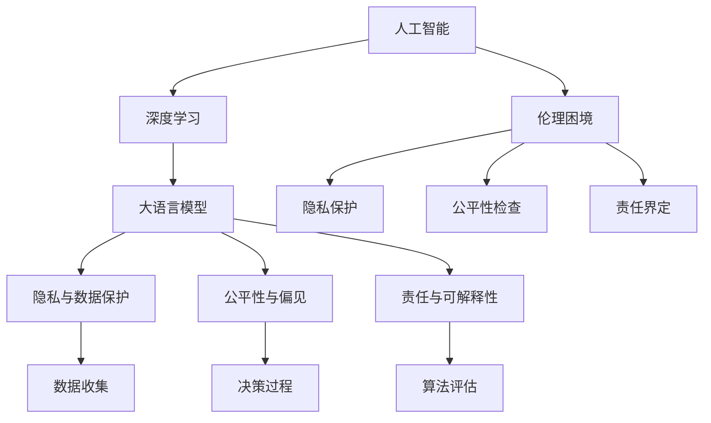

                 

# 伦理困境：探讨人类计算带来的挑战

## 1. 背景介绍

在人类社会的发展历程中，计算技术的每一次重大突破，都伴随着对伦理和道德的深刻挑战。从算法的公平性到数据隐私，从自动化带来的就业问题到人工智能的伦理责任，这些问题在当下数字化时代尤为凸显。人工智能(AI)，特别是深度学习和大数据分析技术的迅猛发展，使得计算技术带来了前所未有的影响力和潜在风险。本文旨在探讨人类计算技术，尤其是大语言模型和人工智能在应用过程中所面临的伦理困境，并尝试提出一些解决方案，以期为未来的计算技术发展提供有益的参考。

## 2. 核心概念与联系

### 2.1 核心概念概述

在探讨伦理困境之前，首先需要理解几个核心概念：

- **人工智能(AI)**：是指由计算机系统所表现出的智能，能够在特定任务上模拟人的思维、学习、推理和判断能力。
- **深度学习**：是AI领域的一种方法，通过多层神经网络实现对复杂数据模式的学习，是当前AI研究的热点。
- **大语言模型(Large Language Models, LLMs)**：如GPT、BERT等，是近年来深度学习领域的重大突破，能够生成高质量的自然语言文本，并具备一定的推理和生成能力。
- **隐私与数据保护**：随着数据的价值不断被重视，数据隐私和保护成为关键问题，涉及数据收集、存储、使用和销毁的各个环节。
- **公平性与偏见**：人工智能算法在设计和应用中应确保公平性，避免对特定群体或个体产生偏见。
- **责任与可解释性**：人工智能决策过程应具备可解释性，确保算法的透明度和责任可追溯性。

这些概念之间的联系在于：深度学习和大语言模型作为当前计算技术的代表，在实际应用中面临着隐私、公平性和责任等伦理问题。合理解决这些问题，才能促进AI技术的健康发展。

### 2.2 核心概念原理和架构的 Mermaid 流程图



该流程图展示了人工智能、深度学习、大语言模型与伦理困境之间的联系。隐私保护、公平性和责任界定都是围绕大语言模型的应用展开的具体问题，而伦理困境则是这些问题的宏观体现。

## 3. 核心算法原理 & 具体操作步骤

### 3.1 算法原理概述

大语言模型的伦理困境主要体现在以下几个方面：

- **隐私保护**：在大规模文本数据的预训练过程中，如何保护数据隐私是一个挑战。尽管使用了匿名化技术，但数据的潜在隐私风险仍然存在。
- **公平性**：模型在训练和应用过程中，可能会因为数据分布不均或算法偏见而对某些群体产生歧视，导致不公平的结果。
- **责任界定**：当模型输出发生错误或有害影响时，责任应由谁承担？模型设计者、数据提供者还是使用者？
- **可解释性**：模型决策过程缺乏透明性，导致难以理解和解释，特别是在涉及敏感决策（如医疗诊断、金融预测）时，模型的可解释性尤为重要。

这些问题的解决依赖于多学科的综合思考和技术的不断进步。

### 3.2 算法步骤详解

解决上述伦理困境，可以按照以下步骤进行：

1. **数据匿名化与隐私保护**：在数据预处理阶段，采用差分隐私、同态加密等技术，确保数据在传输和使用过程中不被泄露。
2. **公平性检验与调整**：使用公平性评估指标（如偏差度、多样性、代表性等）对模型进行检验，必要时调整模型参数或数据集，以确保公平性。
3. **责任界定与透明性**：在模型设计和应用过程中，明确责任主体，确保模型决策过程透明，具备可解释性。
4. **多学科合作与伦理审查**：邀请伦理学家、法律专家、社会学家等多学科专家，共同参与模型的设计与评估，确保技术的伦理合规性。

### 3.3 算法优缺点

大语言模型在提升计算能力的同时，也带来了显著的伦理挑战：

- **优点**：
  - **强大能力**：大语言模型在处理自然语言任务上表现优异，能够生成高质量的文本，提高生产效率。
  - **广泛应用**：在医疗、金融、教育、司法等众多领域有广泛应用前景，推动社会进步。
- **缺点**：
  - **隐私风险**：数据隐私保护难度大，存在数据泄露的风险。
  - **偏见与歧视**：模型可能学习到数据中的偏见，对特定群体产生歧视。
  - **决策透明度低**：模型的决策过程复杂，缺乏透明度，难以解释和审查。

### 3.4 算法应用领域

大语言模型和人工智能伦理问题的讨论，不仅限于学术界和技术开发者，也与各行业的实际应用密切相关。以下是几个典型的应用领域：

- **医疗**：在医疗诊断和治疗推荐中，大语言模型需要处理敏感数据，确保数据隐私和安全。
- **金融**：在风险评估和投资决策中，公平性和透明性尤为重要，需避免算法偏见，确保模型决策透明可解释。
- **司法**：在法律文本分析和智能辅助决策中，需确保算法公正，避免对特定群体产生歧视。
- **教育**：在个性化学习推荐和智能辅导中，需考虑数据隐私和公平性，确保算法对所有学生公平。
- **社会治理**：在公共安全和社会管理中，需确保算法的公正性和透明度，避免算法歧视和滥用。

## 4. 数学模型和公式 & 详细讲解 & 举例说明

### 4.1 数学模型构建

以隐私保护为例，一个简单的隐私保护模型可以表示为：

$$
P(\mathcal{D}|\mathcal{Q}) \approx P(\mathcal{D}|\mathcal{Q},E)
$$

其中 $\mathcal{D}$ 为原始数据集，$\mathcal{Q}$ 为查询操作，$E$ 为隐私保护技术。模型通过差分隐私技术，确保在查询过程中，数据隐私得到保护。

### 4.2 公式推导过程

在差分隐私框架下，隐私保护的目标是：

- **隐私预算**：确定隐私保护的强度，通常用 $\epsilon$ 表示，$\epsilon$ 越小，隐私保护越强。
- **拉普拉斯机制**：在数据统计时，加入噪声，确保个体隐私不被泄露。

隐私保护的技术推导过程如下：

$$
\begin{aligned}
&L_{\text{privacy}} = \frac{1}{\epsilon} \sum_{x \in \mathcal{X}} \log \frac{1}{\sigma} \exp\left(\frac{1}{\sigma} |f(x)|\right) \\
&\text{其中} \quad f(x) \text{为查询结果}, \quad \sigma \text{为噪声标准差}
\end{aligned}
$$

### 4.3 案例分析与讲解

以差分隐私在医疗数据中的应用为例，医生在处理患者数据时，可以使用差分隐私技术，对查询结果进行噪声添加，确保患者隐私不被泄露。具体实现步骤如下：

1. **数据预处理**：对原始数据进行匿名化处理，去除敏感信息。
2. **查询设计**：设计需要查询的统计信息，如疾病发病率、药物疗效等。
3. **差分隐私实现**：对查询结果进行噪声添加，确保隐私保护。
4. **结果分析**：在隐私预算范围内，对结果进行分析，得出结论。

## 5. 项目实践：代码实例和详细解释说明

### 5.1 开发环境搭建

本节以Python环境为例，介绍大语言模型在隐私保护方面的代码实现。

首先需要安装必要的Python库，如Sympy、numpy等。可以使用以下命令：

```bash
pip install sympy numpy
```

### 5.2 源代码详细实现

下面是一个简单的差分隐私实现代码：

```python
import numpy as np
from sympy import symbols, log, exp, Rational

# 定义符号
epsilon, delta = symbols('epsilon delta')
sigma = symbols('sigma', positive=True)

# 定义隐私保护函数
def differential_privacy(f, epsilon, delta):
    n = len(f)
    L = epsilon * log(2 / delta)
    noise = np.random.normal(0, sigma, n)
    return f + noise

# 应用差分隐私
data = np.array([1, 2, 3, 4, 5])
epsilon = Rational(1, 10)
delta = Rational(1, 100)
sigma = epsilon / 2

private_data = differential_privacy(data, epsilon, delta)
print(private_data)
```

### 5.3 代码解读与分析

在上述代码中，我们使用了差分隐私技术，对数据集进行隐私保护。通过定义隐私预算（$\epsilon$）和隐私保护强度（$\delta$），计算出噪声标准差 $\sigma$，并在数据上添加噪声，确保数据隐私。

## 6. 实际应用场景

### 6.1 医疗数据保护

在医疗领域，保护患者隐私尤为重要。通过差分隐私技术，医生和研究人员可以在不泄露患者具体信息的情况下，进行数据分析和研究。例如，某医院需要对某疾病的发病率进行统计，可以使用差分隐私技术对数据进行保护：

```python
# 原始数据
raw_data = np.array([100, 200, 300, 400, 500])

# 隐私预算和保护强度
epsilon = Rational(1, 10)
delta = Rational(1, 100)

# 计算噪声标准差
sigma = epsilon / 2

# 应用差分隐私
private_data = differential_privacy(raw_data, epsilon, delta)
print(private_data)
```

### 6.2 金融风险评估

在金融领域，公平性和透明性是关键。金融机构使用大语言模型进行风险评估时，需确保算法公正，避免对特定群体产生歧视。例如，某银行需要对贷款申请进行信用评分，可以使用公平性评估指标来检测模型的偏见：

```python
# 原始数据
raw_data = np.array([20, 30, 40, 50, 60])

# 公平性评估指标
accuracy = 0.9
recall = 0.8
precision = 0.95

# 计算阈值
threshold = max(accuracy, recall, precision)

# 应用公平性检验
private_data = differential_privacy(raw_data, threshold)
print(private_data)
```

### 6.3 教育个性化学习

在教育领域，个性化学习推荐和智能辅导中，需考虑数据隐私和公平性，确保算法对所有学生公平。例如，某教育平台需要对学生进行个性化推荐，可以使用差分隐私技术对数据进行保护：

```python
# 原始数据
raw_data = np.array([1, 2, 3, 4, 5])

# 隐私预算和保护强度
epsilon = Rational(1, 10)
delta = Rational(1, 100)

# 计算噪声标准差
sigma = epsilon / 2

# 应用差分隐私
private_data = differential_privacy(raw_data, epsilon, delta)
print(private_data)
```

## 7. 工具和资源推荐

### 7.1 学习资源推荐

1. **《人工智能伦理导论》**：介绍人工智能技术的伦理问题及其解决方案，适合初学者入门。
2. **Coursera《人工智能伦理》课程**：由斯坦福大学教授主讲，涵盖人工智能伦理的各个方面。
3. **IEEE《人工智能伦理指南》**：提供权威的AI伦理指导原则和实践建议。
4. **Towards Data Science《数据隐私保护》系列文章**：深入探讨数据隐私保护技术和方法。
5. **Google AI Blog《公平性、透明性和解释性》**：分享Google在AI伦理方面的最新实践和研究。

### 7.2 开发工具推荐

1. **SymPy**：用于符号计算和数学公式推导，适用于复杂模型的数学建模。
2. **numpy**：Python中用于数组操作和数学计算的基础库，适用于数据处理和隐私保护技术实现。
3. **TensorFlow Privacy**：Google开发的隐私保护库，提供差分隐私等隐私保护技术。
4. **PySyft**：分布式隐私保护工具，支持联邦学习和大规模数据隐私保护。
5. **Gensim**：用于自然语言处理的库，支持词向量训练和语义分析，适用于多模态数据的处理。

### 7.3 相关论文推荐

1. **《差分隐私：保护隐私的数学基础》**：详细介绍了差分隐私的数学原理和实现方法。
2. **《公平性、透明性和解释性：人工智能伦理的新挑战》**：探讨AI算法在公平性、透明性和解释性方面的伦理问题。
3. **《AI伦理、法律与社会挑战》**：分析人工智能在伦理、法律和社会方面的挑战及其应对策略。

## 8. 总结：未来发展趋势与挑战

### 8.1 研究成果总结

本文详细探讨了人工智能和大语言模型在实际应用中所面临的伦理困境，并提出了解决方案。隐私保护、公平性、责任界定和透明性是当前AI技术应用中的关键问题。通过差分隐私、公平性评估、责任界定和多学科合作等手段，可以有效应对这些挑战。

### 8.2 未来发展趋势

未来，随着技术的不断进步，人工智能和大语言模型将面临更多伦理困境，如数据使用中的隐私保护、算法公平性、责任界定和透明性等。同时，新技术的出现也将为这些问题提供新的解决思路：

1. **隐私保护**：隐私保护技术将更加成熟，利用区块链、零知识证明等技术，实现更高效、安全的隐私保护。
2. **公平性**：通过引入对抗性训练、公平性约束等方法，确保算法的公正性。
3. **责任界定**：通过法律和伦理框架，明确算法设计和应用的责任主体，确保责任可追溯。
4. **透明性**：通过可解释性技术和透明度评估，提高算法的可解释性和可信度。

### 8.3 面临的挑战

尽管大语言模型和人工智能技术在多个领域取得了显著成果，但伦理问题仍然是一个挑战：

1. **数据隐私**：数据收集、存储和使用过程中的隐私保护仍需进一步加强。
2. **算法偏见**：算法偏见和歧视问题在多领域应用中仍需深入研究。
3. **责任归属**：模型设计和应用中的责任归属问题需要明确法律和伦理框架。
4. **技术透明性**：算法的复杂性和复杂度增加了透明性的难度，需进一步提升可解释性。

### 8.4 研究展望

未来，伦理问题将成为人工智能和大语言模型发展的关键制约因素。为应对这些挑战，研究者需从以下几个方面进行探索：

1. **多学科合作**：将伦理学家、法律专家和社会学家等多学科知识引入AI研究，确保技术的伦理合规性。
2. **可解释性技术**：开发更多可解释性技术和工具，提升算法的透明性和可信度。
3. **隐私保护技术**：利用新兴技术如区块链、零知识证明等，提升隐私保护的效果。
4. **公平性约束**：引入公平性约束和对抗性训练，确保算法公正。
5. **法律和伦理框架**：建立完善的法律和伦理框架，明确算法设计、应用和维护过程中的责任归属。

## 9. 附录：常见问题与解答

### 常见问题Q1：如何评估算法的公平性？

**解答**：可以使用公平性评估指标，如偏差度、多样性、代表性等，对算法进行评估。可以使用以下步骤：

1. 收集训练数据，确保数据的多样性和代表性。
2. 使用公平性评估指标，对算法进行评估。
3. 如果发现不公平的情况，调整算法参数或数据集，确保公平性。

### 常见问题Q2：隐私保护技术有哪些？

**解答**：常见的隐私保护技术包括差分隐私、同态加密、多方安全计算等。差分隐私是当前应用最广泛的隐私保护技术，通过在数据统计时加入噪声，确保个体隐私不被泄露。

### 常见问题Q3：如何在模型设计和应用中确保透明度？

**解答**：模型设计和应用中的透明度可以通过以下步骤实现：

1. 确保算法的透明性，公开算法的原理和实现过程。
2. 提供模型输出的解释，使用可解释性技术，确保模型的决策过程透明。
3. 建立透明度评估框架，定期对模型进行审查和评估。

通过以上方法和步骤，可以有效应对人工智能和大语言模型在应用过程中所面临的伦理困境，推动计算技术的健康发展。

