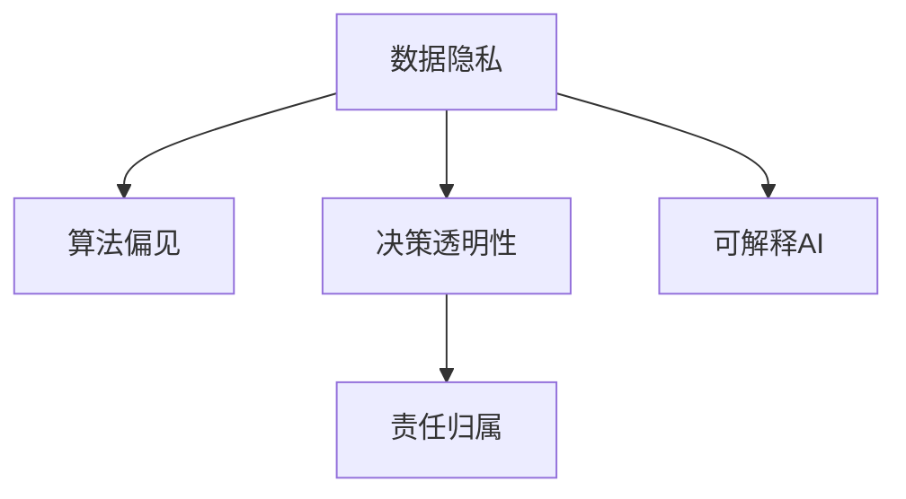

                 

# 伦理挑战：探讨人类计算带来的道德困境

在数字化快速发展的今天，人工智能（AI）技术日益渗透到各个领域，极大地改变了我们的生产生活方式。然而，随着AI技术的深入应用，道德伦理问题也随之而来，如何平衡技术进步与社会道德责任，成为一个亟待解决的难题。本文将围绕人类计算带来的道德困境，探讨AI伦理在计算技术中的应用，并提出相应的解决方案。

## 1. 背景介绍

### 1.1 人工智能与道德伦理

人工智能的发展为人类带来了前所未有的便利和效率，但也伴随着一系列伦理道德问题。这些问题主要体现在数据隐私、算法偏见、决策透明性、责任归属等方面。AI技术的强大功能和广泛应用，使得其道德伦理问题愈发受到社会各界的关注。

### 1.2 计算技术的伦理困境

计算技术，尤其是人工智能和大数据技术，在带来便利的同时，也引发了诸多伦理道德挑战。这些问题包括但不限于：

- **数据隐私**：如何保护个人隐私数据不被滥用？
- **算法偏见**：如何避免AI模型学习到并放大社会偏见？
- **决策透明性**：AI决策是否透明，可解释性强？
- **责任归属**：在AI系统中，当出现错误或事故时，责任应由谁承担？

## 2. 核心概念与联系

### 2.1 核心概念概述

为更好地理解AI伦理问题，本节将介绍几个关键概念：

- **数据隐私**：指个人信息在收集、存储、使用和传播过程中受到的保护程度。数据隐私问题涉及数据收集者的责任和义务，以及数据主体的知情权和控制权。

- **算法偏见**：指AI模型在训练过程中，由于数据集中存在的偏见或模型设计的不合理性，导致模型输出具有歧视性或偏见性的问题。算法偏见可能会加剧社会不公，影响公平正义。

- **决策透明性**：指AI系统在做出决策时，能否清晰地解释其逻辑和依据。透明性对于维护公平、公正和可信赖的系统至关重要。

- **责任归属**：指在AI系统中，当出现错误或事故时，确定责任的法律和道德标准。责任归属问题涉及开发者、用户、监管机构等多个主体的权利和义务。

- **可解释AI**：指AI模型能够提供清晰、易懂的解释，使得决策过程透明可控。可解释AI有助于增强系统的可信度和接受度。

这些核心概念之间的逻辑关系可以通过以下Mermaid流程图来展示：



这个流程图展示了几大核心概念之间的相互关系：数据隐私是基础，算法偏见是在数据隐私基础上的进一步挑战，决策透明性和责任归属是确保AI系统公平、公正的关键，可解释AI则是为了提升系统的可信度和接受度。

## 3. 核心算法原理 & 具体操作步骤

### 3.1 算法原理概述

AI伦理问题涉及多个层面，包括数据处理、模型训练、系统部署等。本文将重点探讨如何在计算技术中应对这些伦理挑战，并提出相应的解决方案。

### 3.2 算法步骤详解

AI伦理问题的解决需要多方面的综合考虑，以下是处理这些问题的具体操作步骤：

1. **数据隐私保护**：
   - **数据匿名化**：通过去除个人身份信息、添加噪声等方式，使得数据无法直接追溯到个人，保护数据隐私。
   - **差分隐私**：在数据处理和分析过程中，通过加入随机噪声，使得个体数据泄露的风险极低。

2. **算法偏见检测与修正**：
   - **偏见检测**：通过分析数据分布、模型输出等，检测模型中可能存在的偏见。
   - **偏见修正**：采用公平性约束、对抗性训练等技术，修正模型中的偏见。

3. **提高决策透明性**：
   - **可解释AI模型**：开发可解释性强的模型，如决策树、规则集等，使得模型的决策过程透明可控。
   - **模型可视化**：利用可视化技术，直观展示模型的决策路径和依据。

4. **明确责任归属**：
   - **责任模型**：设计责任模型，明确各主体在AI系统中的责任和义务。
   - **法律规范**：建立健全法律法规，明确AI系统的责任归属和行为规范。

### 3.3 算法优缺点

**优点**：
- **数据隐私保护**：通过技术手段，可以有效保护个人隐私，减少数据滥用的风险。
- **算法偏见检测与修正**：可以提高模型的公平性和公正性，减少社会不公现象。
- **提高决策透明性**：使得AI系统更透明、可信，增强用户的接受度和信任。
- **明确责任归属**：有助于理清各主体的责任和义务，确保AI系统的合法合规。

**缺点**：
- **技术复杂性**：隐私保护、偏见检测、透明性提升等技术难度较大，需要较高的技术水平和资源投入。
- **法律与伦理规范**：不同国家和地区的法律与伦理规范差异较大，难以统一执行。
- **系统复杂性**：在引入隐私保护、偏见检测等技术时，可能会增加系统的复杂性和开发成本。

### 3.4 算法应用领域

AI伦理问题在多个领域都有应用，以下是一些典型应用场景：

- **医疗领域**：保护患者隐私，避免医疗数据滥用；确保医疗决策的公平性、透明性；明确医疗事故的责任归属。
- **金融领域**：保护客户隐私，避免数据泄露；确保金融决策的公正性、透明性；明确金融风险的责任归属。
- **教育领域**：保护学生隐私，避免数据滥用；确保教育资源的公平分配；明确教育决策的责任归属。
- **司法领域**：保护嫌疑人隐私，避免不当信息泄露；确保司法决策的公正性、透明性；明确司法行为的责任归属。

## 4. 数学模型和公式 & 详细讲解 & 举例说明

### 4.1 数学模型构建

本节将使用数学语言对AI伦理问题进行更加严格的刻画。

设训练数据集为 $\mathcal{D}=\{(x_i, y_i)\}_{i=1}^N$，其中 $x_i$ 为输入，$y_i$ 为标签。

**数据隐私保护**：
- **数据匿名化**：将数据 $x_i$ 转化为 $x_i'$，使得 $x_i'$ 无法直接追溯到 $x_i$。
- **差分隐私**：在模型训练过程中，通过加入噪声 $\epsilon$，使得个体数据泄露的风险极低。

**算法偏见检测**：
- **偏见度量**：定义偏见度量函数 $P(\mathcal{D})$，衡量数据集中存在的偏见程度。
- **偏差修正**：通过引入公平性约束、对抗性训练等技术，修正模型中的偏见。

**决策透明性**：
- **可解释性模型**：设计可解释性强的模型，如决策树、规则集等，使得模型的决策过程透明可控。
- **模型可视化**：利用可视化技术，直观展示模型的决策路径和依据。

**责任归属**：
- **责任模型**：设计责任模型，明确各主体在AI系统中的责任和义务。
- **法律规范**：建立健全法律法规，明确AI系统的责任归属和行为规范。

### 4.2 公式推导过程

以下是一些关键公式的推导：

**数据匿名化**：
$$
x_i' = \text{Anonymize}(x_i)
$$

**差分隐私**：
$$
\hat{y} = f(x_i, \epsilon)
$$

其中 $f$ 为模型训练函数，$\epsilon$ 为噪声参数。

**偏见度量**：
$$
P(\mathcal{D}) = \sum_{i=1}^N \text{Bias}(x_i, y_i)
$$

**偏差修正**：
$$
\hat{y} = \text{Bias-Correct}(f(x_i))
$$

**可解释性模型**：
$$
\hat{y} = \text{ExplainableModel}(x_i)
$$

**模型可视化**：
$$
V(\hat{y}) = \text{Visualize}(\hat{y})
$$

**责任模型**：
$$
R(\mathcal{D}) = \text{Responsibility}(\mathcal{D})
$$

**法律规范**：
$$
\text{Law} = \text{Compliance}(R(\mathcal{D}))
$$

这些公式展示了在AI伦理问题中的数学表达，通过具体模型和算法实现上述目标。

### 4.3 案例分析与讲解

**案例分析**：
- **数据隐私保护**：以医疗数据为例，医院在数据处理过程中，通过脱敏和匿名化技术，保护患者隐私。
- **算法偏见检测与修正**：以贷款审批系统为例，检测模型中可能存在的性别、种族等偏见，通过公平性约束等技术进行修正。
- **提高决策透明性**：以司法判决系统为例，设计可解释的决策树模型，使司法判决过程透明可控。
- **明确责任归属**：以自动驾驶系统为例，设计责任模型，明确车辆制造商、软件开发者、车主等各主体的责任。

## 5. 项目实践：代码实例和详细解释说明

### 5.1 开发环境搭建

在进行AI伦理实践前，我们需要准备好开发环境。以下是使用Python进行Scikit-learn开发的环境配置流程：

1. 安装Anaconda：从官网下载并安装Anaconda，用于创建独立的Python环境。

2. 创建并激活虚拟环境：
```bash
conda create -n ethical-ml python=3.8 
conda activate ethical-ml
```

3. 安装Scikit-learn：
```bash
conda install scikit-learn
```

4. 安装各类工具包：
```bash
pip install numpy pandas scikit-learn matplotlib tqdm jupyter notebook ipython
```

完成上述步骤后，即可在`ethical-ml`环境中开始伦理实践。

### 5.2 源代码详细实现

这里我们以算法偏见检测为例，给出使用Scikit-learn进行偏见的检测和修正的Python代码实现。

```python
from sklearn.model_selection import train_test_split
from sklearn.linear_model import LogisticRegression
from sklearn.metrics import roc_auc_score
from sklearn.preprocessing import StandardScaler
from sklearn.utils import shuffle
import numpy as np

# 加载数据集
X = np.loadtxt('data.csv', delimiter=',')
y = np.loadtxt('labels.csv', delimiter=',', dtype=int)

# 数据预处理
X = StandardScaler().fit_transform(X)
X_train, X_test, y_train, y_test = train_test_split(X, y, test_size=0.2, random_state=42)

# 模型训练
clf = LogisticRegression(random_state=42)
clf.fit(X_train, y_train)

# 偏见检测
def bias_detector(X, y):
    clf = LogisticRegression(random_state=42)
    clf.fit(X, y)
    return roc_auc_score(y, clf.predict_proba(X)[:, 1])

# 偏见修正
def bias_correction(X, y):
    clf = LogisticRegression(random_state=42)
    clf.fit(X, y)
    return clf.coef_

# 应用到实际数据集
X_train = shuffle(X_train)
y_train = shuffle(y_train)
X_test = shuffle(X_test)
y_test = shuffle(y_test)

bias = bias_detector(X_train, y_train)
print(f"Bias score: {bias:.4f}")

bias_correction = bias_correction(X_train, y_train)
print(f"Bias correction: {bias_correction}")
```

### 5.3 代码解读与分析

让我们再详细解读一下关键代码的实现细节：

**bias_detector函数**：
- 该函数接收训练数据集X和标签y，使用Logistic回归模型训练偏见检测模型。
- 模型训练完成后，计算模型在测试集上的ROC-AUC得分，作为偏见程度的量化指标。

**bias_correction函数**：
- 该函数接收训练数据集X和标签y，使用Logistic回归模型训练偏见修正模型。
- 模型训练完成后，输出模型的系数，作为偏见修正后的权重。

**应用到实际数据集**：
- 通过随机打乱数据集，减少数据集中的样本顺序相关性。
- 在应用到实际数据集时，先随机打乱数据集，再计算偏见得分和修正系数。

## 6. 实际应用场景

### 6.1 数据隐私保护

数据隐私保护在AI系统中具有重要地位。随着大数据技术的发展，数据隐私问题日益突出，特别是在医疗、金融、教育等敏感领域。

**应用场景**：
- **医疗领域**：医院在处理患者数据时，通过数据匿名化和差分隐私技术，保护患者隐私。
- **金融领域**：银行在处理客户数据时，通过加密和差分隐私技术，保护客户隐私。
- **教育领域**：学校在处理学生数据时，通过匿名化和加密技术，保护学生隐私。

**技术手段**：
- **数据匿名化**：通过去除个人身份信息、添加噪声等方式，使得数据无法直接追溯到个人，保护数据隐私。
- **差分隐私**：在数据处理和分析过程中，通过加入随机噪声，使得个体数据泄露的风险极低。

### 6.2 算法偏见检测与修正

算法偏见是AI系统常见的伦理问题。特别是在招聘、贷款审批等涉及决策的领域，偏见问题可能会加剧社会不公。

**应用场景**：
- **招聘系统**：招聘系统在评估候选人时，可能存在性别、年龄、种族等偏见。
- **贷款审批系统**：贷款审批系统在评估借款人时，可能存在性别、收入等偏见。
- **司法判决系统**：司法判决系统在判决案件时，可能存在种族、性别等偏见。

**技术手段**：
- **偏见检测**：通过分析数据分布、模型输出等，检测模型中可能存在的偏见。
- **偏见修正**：采用公平性约束、对抗性训练等技术，修正模型中的偏见。

### 6.3 提高决策透明性

决策透明性对于维护公平、公正和可信赖的AI系统至关重要。特别是在司法、金融等涉及人命关天的领域，透明性尤为重要。

**应用场景**：
- **司法判决系统**：司法判决系统需要保证判决过程透明、可解释，以增强公众信任。
- **金融风险评估**：金融风险评估系统需要透明、可解释，以确保公平、公正。
- **医疗诊断系统**：医疗诊断系统需要透明、可解释，以提高医生和患者的信任。

**技术手段**：
- **可解释性模型**：设计可解释性强的模型，如决策树、规则集等，使得模型的决策过程透明可控。
- **模型可视化**：利用可视化技术，直观展示模型的决策路径和依据。

### 6.4 未来应用展望

随着AI技术的深入应用，AI伦理问题将愈发突出。未来，AI伦理将涵盖更多领域，涉及更多方面。以下是未来的一些应用展望：

- **医疗领域**：AI在医疗领域的应用将越来越多，涉及隐私保护、公平性、透明性等多个方面。
- **金融领域**：AI在金融领域的应用将越来越广泛，涉及数据隐私、公平性、透明性等多个方面。
- **教育领域**：AI在教育领域的应用将越来越多，涉及隐私保护、公平性、透明性等多个方面。
- **司法领域**：AI在司法领域的应用将越来越多，涉及隐私保护、公平性、透明性等多个方面。

## 7. 工具和资源推荐

### 7.1 学习资源推荐

为了帮助开发者系统掌握AI伦理问题，这里推荐一些优质的学习资源：

1. **《机器学习伦理》系列博文**：由伦理学家撰写，深入浅出地介绍了机器学习中的伦理问题，包括数据隐私、算法偏见、决策透明性等。

2. **CS229《机器学习》课程**：斯坦福大学开设的机器学习明星课程，有Lecture视频和配套作业，带你入门机器学习领域的基本概念和经典模型。

3. **《机器学习与数据科学伦理》书籍**：介绍机器学习中的伦理问题，涵盖数据隐私、算法偏见、决策透明性等主题。

4. **AI伦理联盟**：全球性组织，致力于推动AI技术的伦理发展，提供丰富的学习资源和实践指南。

5. **伦理审计工具**：如EthicalML、FairML等，帮助开发者进行AI系统的伦理审计，识别和修复潜在问题。

通过对这些资源的学习实践，相信你一定能够系统掌握AI伦理问题的处理方式，并用于解决实际的伦理问题。

### 7.2 开发工具推荐

高效的开发离不开优秀的工具支持。以下是几款用于AI伦理实践开发的常用工具：

1. **Python**：流行的编程语言，适合快速迭代研究。
2. **Scikit-learn**：开源机器学习库，提供了丰富的模型和算法，适合快速实现各种任务。
3. **TensorFlow**：由Google主导开发的开源深度学习框架，生产部署方便，适合大规模工程应用。
4. **Weights & Biases**：模型训练的实验跟踪工具，可以记录和可视化模型训练过程中的各项指标，方便对比和调优。
5. **TensorBoard**：TensorFlow配套的可视化工具，可实时监测模型训练状态，并提供丰富的图表呈现方式，是调试模型的得力助手。

合理利用这些工具，可以显著提升AI伦理问题的开发效率，加快创新迭代的步伐。

### 7.3 相关论文推荐

AI伦理问题在学界和产业界引起了广泛关注，以下是几篇奠基性的相关论文，推荐阅读：

1. **《人工智能伦理》**：关于AI伦理问题的经典书籍，涵盖数据隐私、算法偏见、决策透明性等多个方面。
2. **《公平性、透明性和可解释性在机器学习中的应用》**：介绍了如何通过公平性、透明性和可解释性提升机器学习的伦理水平。
3. **《AI伦理：原则与实践》**：从理论和实践两个方面，探讨AI伦理问题，提出相应的解决方案。
4. **《可解释AI：提高机器学习模型的透明度》**：介绍了如何通过可解释性提升机器学习模型的可信度和接受度。

这些论文代表了大数据和AI伦理问题的研究脉络。通过学习这些前沿成果，可以帮助研究者把握学科前进方向，激发更多的创新灵感。

## 8. 总结：未来发展趋势与挑战

### 8.1 研究成果总结

本文对AI伦理问题进行了全面系统的介绍。首先，介绍了AI技术带来的伦理困境，明确了数据隐私、算法偏见、决策透明性、责任归属等关键概念。其次，从原理到实践，详细讲解了隐私保护、偏见检测与修正、提高透明性、明确责任归属等核心技术。最后，通过项目实践和案例分析，展示了AI伦理问题的具体应用。

通过本文的系统梳理，可以看到，AI伦理问题在多个领域都有应用，涉及数据隐私、算法偏见、决策透明性等多个方面。这些问题的解决需要跨学科的合作，共同努力，才能在技术进步的同时，保障社会的公平、公正和可信。

### 8.2 未来发展趋势

展望未来，AI伦理问题将呈现以下几个发展趋势：

1. **技术进步与伦理发展并重**：随着AI技术的发展，伦理问题将愈发突出，如何在技术进步的同时，确保伦理道德的底线，成为重要的研究方向。
2. **跨学科合作**：AI伦理问题涉及数据科学、伦理学、法律等多个学科，跨学科合作将是解决伦理问题的关键。
3. **伦理规范与法律法规完善**：健全的伦理规范和法律法规是确保AI系统公平、公正和可信的基础。
4. **伦理技术的开发与应用**：开发更多伦理技术，如隐私保护、偏见检测、透明性提升等，为AI系统的伦理应用提供技术支撑。

### 8.3 面临的挑战

尽管AI伦理问题在不断进步，但在迈向更加智能化、普适化应用的过程中，仍然面临诸多挑战：

1. **技术复杂性**：隐私保护、偏见检测、透明性提升等技术难度较大，需要较高的技术水平和资源投入。
2. **法律与伦理规范**：不同国家和地区的法律与伦理规范差异较大，难以统一执行。
3. **系统复杂性**：在引入隐私保护、偏见检测等技术时，可能会增加系统的复杂性和开发成本。
4. **伦理审查与监管**：AI系统在应用过程中，需要进行严格的伦理审查和监管，确保系统的合法合规。

### 8.4 研究展望

面对AI伦理问题所面临的挑战，未来的研究需要在以下几个方面寻求新的突破：

1. **伦理技术创新**：开发更多创新的伦理技术，提升AI系统的公平性、公正性和透明性。
2. **伦理教育与普及**：加强对AI伦理问题的普及教育，提高公众对AI伦理问题的认知和重视。
3. **伦理规范与法律法规**：建立健全的伦理规范和法律法规，确保AI系统的合法合规。
4. **伦理监管与治理**：加强对AI系统的伦理监管，建立完善的伦理治理机制，确保系统的公平、公正和可信。

这些研究方向的探索，必将引领AI伦理问题迈向更高的台阶，为构建安全、可靠、可解释、可控的智能系统铺平道路。面向未来，AI伦理问题还需要与其他人工智能技术进行更深入的融合，如知识表示、因果推理、强化学习等，多路径协同发力，共同推动自然语言理解和智能交互系统的进步。只有勇于创新、敢于突破，才能不断拓展语言模型的边界，让智能技术更好地造福人类社会。

## 9. 附录：常见问题与解答

**Q1：AI伦理问题是否适用于所有AI应用？**

A: AI伦理问题在所有AI应用中都有适用性。无论是在医疗、金融、教育等领域，还是在智能客服、自动驾驶、智能家居等新兴领域，都可能涉及数据隐私、算法偏见、决策透明性、责任归属等伦理问题。

**Q2：如何平衡技术进步与伦理道德？**

A: 在追求技术进步的同时，必须重视伦理道德的底线。通过跨学科合作、伦理技术创新、伦理教育普及等措施，确保AI系统的公平、公正和可信。

**Q3：如何在AI系统中进行伦理审计？**

A: 在AI系统开发过程中，可以使用EthicalML、FairML等工具进行伦理审计，识别和修复潜在问题。同时，建立伦理审计标准和流程，确保系统的合法合规。

**Q4：如何避免AI系统中的偏见？**

A: 在数据收集和模型训练过程中，采用公平性约束、对抗性训练等技术，检测和修正模型中的偏见。同时，确保数据集的多样性和代表性，避免数据集中存在的偏见。

**Q5：如何增强AI系统的透明度？**

A: 设计可解释性强的模型，如决策树、规则集等，使得模型的决策过程透明可控。利用可视化技术，直观展示模型的决策路径和依据，增强系统的透明性。

---

作者：禅与计算机程序设计艺术 / Zen and the Art of Computer Programming

