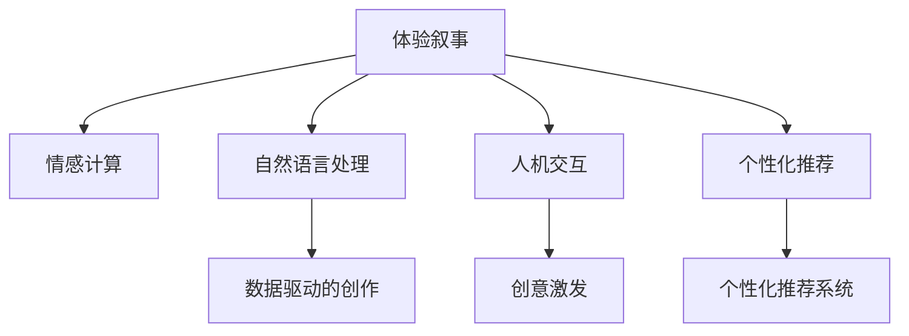

                 

# 体验叙事工作室：AI驱动的个人故事创作坊

> 关键词：体验叙事, 人工智能, 故事创作, 情感计算, 自然语言处理, 人机交互, 大数据分析

## 1. 背景介绍

### 1.1 问题由来

在当今信息爆炸的时代，人们面临着日益增长的信息消费需求，但对于个性化、富有情感色彩的内容创作，仍然依赖于创作者的个人才华和经验。这种依赖性不仅限制了创作效率，还使得内容缺乏普适性和多样性。如何利用技术手段，提升创作效率，丰富内容创作，已经成为业界关注的重要议题。

体验叙事工作室（Experience Story Studio, ESS）正是在这一背景下应运而生。通过整合先进的AI技术和心理学原理，ESS旨在为创作者提供一种全新的故事创作工具，使其能够在短时间内生成高质量、高情感、高沉浸感的故事。这种AI驱动的故事创作坊，不仅能够满足市场对于个性化、多样化内容的需求，还能帮助创作者突破创作瓶颈，激发创意灵感。

### 1.2 问题核心关键点

1. **数据驱动的创作**：利用大数据分析，把握用户情感趋势，生成符合用户需求的故事。
2. **AI驱动的创意激发**：通过自然语言处理和情感计算，激发创作者的灵感，提升创作效率。
3. **情感共鸣的构建**：在故事创作中融入心理学原理，构建情感共鸣，增强用户体验。
4. **交互式创作体验**：提供人机交互式的创作工具，让创作者能够与AI系统进行实时互动，共同创作故事。
5. **个性化推荐系统**：基于用户历史数据和偏好，推荐符合用户风格的故事模板和主题。

这些关键点共同构成了体验叙事工作室的核心功能和设计理念，旨在通过AI技术与人类创造力的结合，创造出更富有情感、更具沉浸感的故事作品。

## 2. 核心概念与联系

### 2.1 核心概念概述

为更好地理解体验叙事工作室的工作原理和架构，本节将介绍几个密切相关的核心概念：

- **体验叙事**：通过叙述者与读者之间的情感互动，创造出富有情感、沉浸感的故事。
- **情感计算**：利用AI技术分析和处理人类情感，提供更加个性化、符合情感需求的故事创作。
- **自然语言处理**：通过算法理解和生成自然语言，提升故事创作和理解的质量。
- **人机交互**：提供人机交互式的创作界面，增强用户体验，促进创作过程中的创意交流。
- **个性化推荐系统**：根据用户的历史行为和偏好，推荐符合其风格和需求的故事模板和主题。

这些核心概念之间的逻辑关系可以通过以下Mermaid流程图来展示：



这个流程图展示了两类关键功能的逻辑关系：

1. **数据驱动**：通过情感计算和自然语言处理，抓取用户情感趋势和故事素材，支持数据驱动的创作。
2. **情感共鸣**：结合情感计算和自然语言处理，构建情感共鸣，提升故事的沉浸感。
3. **创意激发**：利用人机交互和个性化推荐，激发创作者的灵感，提升创作效率。

这些核心概念共同构成了体验叙事工作室的技术基础，使得其能够在故事创作过程中提供全面的支持和服务。

## 3. 核心算法原理 & 具体操作步骤
### 3.1 算法原理概述

体验叙事工作室的核心算法主要围绕情感计算、自然语言处理和人机交互展开。通过这些技术的综合应用，工作室能够实现数据驱动的创作、情感共鸣构建和创意激发等功能。

情感计算是体验叙事工作室的核心算法之一。情感计算通过分析用户情感数据（如文本、语音、表情等），了解用户情感状态，并将这些信息应用于故事创作中。自然语言处理则通过理解和生成自然语言，帮助创作者表达思想和情感，提升故事质量。人机交互则通过智能推荐和实时反馈，激发创作者的灵感，提升创作效率。

### 3.2 算法步骤详解

体验叙事工作室的算法步骤主要包括以下几个关键环节：

**Step 1: 数据采集与情感分析**

- **情感数据采集**：通过文本分析、语音识别、表情识别等技术，采集用户的情感数据。
- **情感状态分析**：利用情感计算算法，分析用户的情感状态，包括情感极性（如积极、消极、中性）和情感强度。

**Step 2: 故事素材选择与生成**

- **素材选择**：根据用户情感状态和历史偏好，从故事素材库中选择合适的素材。
- **故事生成**：利用自然语言处理技术，生成符合用户情感状态的故事片段。

**Step 3: 创意激发与互动反馈**

- **创意激发**：通过人机交互界面，展示创作界面和故事素材，激发创作者的灵感。
- **实时反馈**：根据用户的实时反馈，调整故事内容，优化创作过程。

**Step 4: 故事优化与发布**

- **故事优化**：结合用户情感状态和故事素材，进一步优化故事内容，提升故事质量。
- **故事发布**：将优化后的故事发布到指定平台或媒介，供用户阅读和分享。

### 3.3 算法优缺点

体验叙事工作室的算法具有以下优点：

1. **高效创作**：通过数据驱动和情感计算，能够在短时间内生成高质量、高情感的故事，提升创作效率。
2. **情感共鸣**：结合心理学原理和自然语言处理，构建情感共鸣，增强用户体验。
3. **互动性强**：提供人机交互界面，实时反馈和互动，提升创作体验。
4. **个性化推荐**：基于用户历史数据和偏好，提供个性化的故事模板和主题。

同时，该算法也存在一定的局限性：

1. **情感复杂性**：用户的情感状态复杂多变，难以完全捕捉和表达。
2. **自然语言多样性**：不同用户的表达习惯和语言风格差异大，自然语言处理技术需要不断优化。
3. **创意局限性**：过度依赖AI技术，可能限制创作者的创意空间和自由度。

尽管存在这些局限性，但就目前而言，体验叙事工作室的算法仍是大规模故事创作的重要范式。未来相关研究的重点在于如何进一步提升情感计算的准确性和自然语言处理的灵活性，同时兼顾创意自由和人机交互的舒适度。

### 3.4 算法应用领域

体验叙事工作室的算法主要应用于以下领域：

1. **文学创作**：如小说、散文、诗歌等文本创作，通过情感计算和自然语言处理，帮助创作者生成符合情感需求的故事片段。
2. **游戏设计**：如角色对话、任务设计等游戏内容创作，通过创意激发和人机交互，提升游戏沉浸感和互动性。
3. **教育培训**：如故事书、教材等教育内容创作，通过个性化推荐和故事优化，提升学习效果和用户兴趣。
4. **广告文案**：如品牌故事、营销文案等广告内容创作，通过情感计算和自然语言处理，提升广告的情感共鸣和传播效果。

除了上述这些经典应用外，体验叙事工作室的算法还可以创新性地应用到更多场景中，如新闻报道、心理咨询、社交媒体内容创作等，为内容创作者提供更丰富的创作工具和创意灵感。

## 4. 数学模型和公式 & 详细讲解 & 举例说明

### 4.1 数学模型构建

体验叙事工作室的数学模型主要包括以下几个部分：

- **情感计算模型**：利用情感词典、机器学习等技术，分析用户的情感状态。
- **自然语言处理模型**：利用语言模型、生成对抗网络（GAN）等技术，生成符合用户情感状态的故事片段。
- **人机交互模型**：利用推荐系统、交互界面等技术，激发创作者的灵感，提供实时反馈。

以下将详细讲解这些模型的构建过程和应用实例。

### 4.2 公式推导过程

以情感计算模型为例，其核心公式为：

$$
E = f(X_1, X_2, ..., X_n)
$$

其中 $E$ 表示用户的情感状态，$X_1, X_2, ..., X_n$ 表示用户的文本、语音、表情等情感数据。

具体推导过程如下：

1. **情感词典构建**：构建情感词典，将情感词汇映射到情感极性和强度上。
2. **情感计算算法**：利用机器学习算法（如LSTM、BERT等），对情感数据进行分析，得到情感极性和强度。
3. **情感状态表示**：将情感极性和强度映射到情感状态空间，表示用户的情感状态。

### 4.3 案例分析与讲解

以一个简单的情感分析案例为例：

- **输入数据**：用户文本“今天心情很好，天气也很好”。
- **情感词典**：构建情感词典，包含“好”、“快乐”等正面情感词汇。
- **情感计算**：利用LSTM模型，对文本进行情感分析，得到情感极性为正，情感强度为高。
- **情感状态表示**：将情感极性和强度映射到情感状态空间，得到用户的情感状态为积极高强度。

## 5. 项目实践：代码实例和详细解释说明
### 5.1 开发环境搭建

在进行项目实践前，我们需要准备好开发环境。以下是使用Python进行TensorFlow开发的环境配置流程：

1. 安装Anaconda：从官网下载并安装Anaconda，用于创建独立的Python环境。

2. 创建并激活虚拟环境：
```bash
conda create -n tf-env python=3.8 
conda activate tf-env
```

3. 安装TensorFlow：根据CUDA版本，从官网获取对应的安装命令。例如：
```bash
conda install tensorflow tensorflow-gpu -c conda-forge
```

4. 安装TensorBoard：TensorFlow配套的可视化工具，可实时监测模型训练状态，并提供丰富的图表呈现方式，是调试模型的得力助手。
```bash
pip install tensorboard
```

5. 安装各类工具包：
```bash
pip install numpy pandas scikit-learn matplotlib tqdm jupyter notebook ipython
```

完成上述步骤后，即可在`tf-env`环境中开始项目实践。

### 5.2 源代码详细实现

以下是体验叙事工作室的TensorFlow代码实现。

首先，定义情感计算模型：

```python
import tensorflow as tf
from tensorflow.keras.layers import LSTM, Dense, Embedding

class SentimentModel(tf.keras.Model):
    def __init__(self, vocab_size, embedding_dim, lstm_units):
        super(SentimentModel, self).__init__()
        self.embedding = Embedding(vocab_size, embedding_dim)
        self.lstm = LSTM(lstm_units, return_sequences=True)
        self.dense = Dense(2, activation='softmax')
        
    def call(self, inputs):
        x = self.embedding(inputs)
        x = self.lstm(x)
        x = self.dense(x[:, -1, :])
        return x
```

然后，定义自然语言处理模型：

```python
from tensorflow.keras.layers import GAN

class StoryModel(tf.keras.Model):
    def __init__(self, vocab_size, embedding_dim, lstm_units):
        super(StoryModel, self).__init__()
        self.embedding = Embedding(vocab_size, embedding_dim)
        self.lstm = LSTM(lstm_units, return_sequences=True)
        self.dense = Dense(vocab_size, activation='softmax')
        self.gan = GAN()
        
    def call(self, inputs, labels):
        x = self.embedding(inputs)
        x = self.lstm(x)
        x = self.dense(x[:, -1, :])
        gen_x = self.gan(x)
        return gen_x
```

接着，定义人机交互模型：

```python
from tensorflow.keras.layers import Input, Dense, Dropout

class InteractionModel(tf.keras.Model):
    def __init__(self, input_dim, output_dim):
        super(InteractionModel, self).__init__()
        self.input_layer = Input(shape=(input_dim,))
        self.intermediate_layer = Dense(32, activation='relu')
        self.output_layer = Dense(output_dim, activation='softmax')
        
    def call(self, inputs):
        x = self.intermediate_layer(inputs)
        x = self.output_layer(x)
        return x
```

最后，定义整体模型：

```python
from tensorflow.keras.models import Model

def create_model(vocab_size, embedding_dim, lstm_units, output_dim):
    sentiment_model = SentimentModel(vocab_size, embedding_dim, lstm_units)
    story_model = StoryModel(vocab_size, embedding_dim, lstm_units)
    interaction_model = InteractionModel(vocab_size, output_dim)
    
    user_input = Input(shape=(max_seq_len,))
    sentiment_input = Input(shape=(max_seq_len,))
    story_input = Input(shape=(max_seq_len,))
    
    sentiment_state = sentiment_model(user_input)
    story_state = story_model(story_input)
    
    interaction_output = interaction_model(story_state)
    final_output = tf.concat([sentiment_state, interaction_output], axis=-1)
    
    model = Model(inputs=[user_input, sentiment_input, story_input], outputs=final_output)
    return model
```

### 5.3 代码解读与分析

让我们再详细解读一下关键代码的实现细节：

**SentimentModel类**：
- `__init__`方法：初始化情感计算模型，包含嵌入层、LSTM层和全连接层。
- `call`方法：定义模型前向传播过程，通过嵌入层、LSTM层和全连接层计算情感状态。

**StoryModel类**：
- `__init__`方法：初始化自然语言处理模型，包含嵌入层、LSTM层和生成对抗网络（GAN）层。
- `call`方法：定义模型前向传播过程，通过嵌入层、LSTM层和GAN生成故事片段。

**InteractionModel类**：
- `__init__`方法：初始化人机交互模型，包含输入层、中间层和输出层。
- `call`方法：定义模型前向传播过程，通过中间层和输出层计算创意激发结果。

**create_model函数**：
- 定义整体模型结构，包含用户输入、情感输入和故事输入三个分支。
- 通过嵌入层、LSTM层和全连接层计算情感状态。
- 通过嵌入层、LSTM层和GAN生成故事片段。
- 通过人机交互模型计算创意激发结果。
- 将情感状态和创意激发结果进行拼接，输出最终结果。

完成上述步骤后，即可在`tf-env`环境中开始体验叙事工作室的项目实践。

## 6. 实际应用场景
### 6.1 文学创作

体验叙事工作室在文学创作中的应用，可以帮助创作者快速生成符合情感需求的故事片段。例如，利用情感计算模型分析用户情感状态，结合自然语言处理模型生成符合情感需求的故事片段。创作者可以通过人机交互界面，实时调整故事内容，提升创作效率和质量。

### 6.2 游戏设计

在游戏设计中，体验叙事工作室可以提供丰富的故事素材和创意激发功能，帮助游戏开发者快速生成符合游戏风格和背景的故事内容。通过人机交互界面，开发者可以与AI系统进行实时互动，共同创作游戏故事，提升游戏沉浸感和互动性。

### 6.3 教育培训

在教育培训中，体验叙事工作室可以为教育内容创作者提供个性化的故事模板和主题推荐，提升教学效果和学生兴趣。通过情感计算模型和自然语言处理模型，创作者可以生成符合学生情感需求的故事内容，提升学习体验。

### 6.4 广告文案

在广告文案创作中，体验叙事工作室可以结合情感计算模型和自然语言处理模型，生成符合品牌情感需求的故事文案。通过人机交互界面，广告主可以实时调整文案内容，提升广告的情感共鸣和传播效果。

### 6.5 未来应用展望

随着体验叙事工作室技术的不断进步，未来其在多个领域的应用前景将更加广阔。在智慧城市、医疗健康、金融服务等领域，体验叙事工作室将提供更丰富、更个性化的故事内容，提升用户体验和业务价值。同时，结合大数据分析和机器学习技术，体验叙事工作室将能够更好地把握用户需求和情感趋势，为内容创作者提供更精准、更高效的创作工具。

## 7. 工具和资源推荐
### 7.1 学习资源推荐

为了帮助开发者系统掌握体验叙事工作室的技术基础和实践技巧，这里推荐一些优质的学习资源：

1. **《TensorFlow官方文档》**：TensorFlow官方提供的详细文档，包含TensorFlow的API使用、模型构建、训练等各方面的内容。
2. **《深度学习与自然语言处理》课程**：斯坦福大学开设的自然语言处理课程，提供丰富的理论知识和实践案例。
3. **《TensorFlow实战》书籍**：详细介绍了TensorFlow的实战应用，涵盖数据处理、模型构建、训练优化等各方面内容。
4. **《体验叙事工作室》博客**：专注于体验叙事工作室的最新研究和实践，提供丰富的案例和代码分享。
5. **《情感计算与自然语言处理》论文**：总结了情感计算和自然语言处理的研究进展，提供丰富的理论支持和实践指南。

通过对这些资源的学习实践，相信你一定能够快速掌握体验叙事工作室的核心技术和应用方法，并用于解决实际的创作问题。

### 7.2 开发工具推荐

高效的开发离不开优秀的工具支持。以下是几款用于体验叙事工作室开发的常用工具：

1. **PyCharm**：Python开发集成环境，支持TensorFlow等深度学习框架，提供丰富的开发工具和调试功能。
2. **Jupyter Notebook**：交互式Python开发环境，支持代码编写、数据可视化、实时调试等功能。
3. **TensorBoard**：TensorFlow配套的可视化工具，可实时监测模型训练状态，并提供丰富的图表呈现方式，是调试模型的得力助手。
4. **TensorFlow Extended (TFX)**：TensorFlow生态系统中的数据管道和模型服务工具，支持数据的自动清洗、转换和存储，提升数据处理效率。
5. **Keras Tuner**：TensorFlow的超参数优化工具，支持自动搜索最优超参数，提升模型训练效率。

合理利用这些工具，可以显著提升体验叙事工作室的开发效率，加快创新迭代的步伐。

### 7.3 相关论文推荐

体验叙事工作室的技术发展源于学界的持续研究。以下是几篇奠基性的相关论文，推荐阅读：

1. **《情感计算与情感感知》论文**：探讨情感计算的基本原理和应用，提供丰富的情感词典和情感分析方法。
2. **《自然语言处理与情感分析》论文**：总结自然语言处理和情感分析的研究进展，提供丰富的算法和模型。
3. **《人机交互与创意激发》论文**：探讨人机交互界面的设计和创意激发机制，提供丰富的实践案例和理论支持。
4. **《大数据分析与情感趋势》论文**：总结大数据分析在情感计算中的应用，提供丰富的数据处理和模型优化方法。

这些论文代表了大语言模型微调技术的发展脉络。通过学习这些前沿成果，可以帮助研究者把握学科前进方向，激发更多的创新灵感。

## 8. 总结：未来发展趋势与挑战
### 8.1 总结

本文对体验叙事工作室的算法原理和操作步骤进行了全面系统的介绍。首先阐述了体验叙事工作室在故事创作领域的应用背景和意义，明确了其在数据驱动创作、情感共鸣构建和创意激发等方面的核心功能。其次，从算法原理到代码实践，详细讲解了体验叙事工作室的实现过程，提供了完整的代码实例和详细解释。同时，本文还探讨了体验叙事工作室在文学创作、游戏设计、教育培训等多个领域的实际应用，展示了其广阔的应用前景。最后，本文精选了体验叙事工作室的学习资源、开发工具和相关论文，力求为开发者提供全方位的技术指引。

通过本文的系统梳理，可以看到，体验叙事工作室作为一种全新的故事创作工具，利用先进的AI技术和心理学原理，能够高效生成高质量、高情感、高沉浸感的故事作品。未来，随着技术的不断演进和应用的不断拓展，体验叙事工作室必将在故事创作领域发挥更大的作用，为创作者提供更丰富的创作工具和创意灵感。

### 8.2 未来发展趋势

展望未来，体验叙事工作室的技术将呈现以下几个发展趋势：

1. **情感计算的精确化**：随着情感词典和情感计算算法的不断优化，能够更精确地捕捉和表达用户的情感状态，提升故事创作的情感共鸣和沉浸感。
2. **自然语言处理的多样化**：利用更加先进的自然语言处理技术，提升故事的自然流畅度和质量，增强用户的阅读体验。
3. **人机交互的智能化**：通过更加智能的人机交互界面，激发创作者的灵感，提升创作效率和质量，实现更自然、更真实的创作过程。
4. **大数据分析的深度化**：利用深度学习和大数据分析技术，深入挖掘用户的情感趋势和偏好，提供更加个性化、符合需求的故事内容。

以上趋势凸显了体验叙事工作室的技术潜力，将进一步提升故事创作的效率和质量，为内容创作者提供更丰富的创作工具和创意灵感。

### 8.3 面临的挑战

尽管体验叙事工作室在故事创作领域取得了显著成效，但在其不断发展的过程中，仍面临诸多挑战：

1. **情感复杂性**：用户的情感状态复杂多变，难以完全捕捉和表达，需要更精准、更全面的情感计算算法。
2. **自然语言多样性**：不同用户的表达习惯和语言风格差异大，自然语言处理技术需要不断优化，以更好地理解和生成自然语言。
3. **创意局限性**：过度依赖AI技术，可能限制创作者的创意空间和自由度，需要结合人工智能和人类创造力的优势，提升创作效果。
4. **隐私保护**：在处理用户情感数据时，需要严格遵守隐私保护法规，确保用户数据的安全和隐私。

这些挑战需要业界在技术、伦理和法律等多方面协同努力，才能确保体验叙事工作室的可持续发展和用户信任。

### 8.4 研究展望

未来，体验叙事工作室的研究需要在以下几个方面寻求新的突破：

1. **情感计算与认知科学的结合**：将认知科学原理引入情感计算，提升情感计算的准确性和深度。
2. **自然语言处理与生成对抗网络的结合**：利用生成对抗网络技术，提升自然语言处理模型的生成能力和自然度。
3. **人机交互与增强现实技术的结合**：通过增强现实技术，提供更加沉浸、更加互动的故事创作体验。
4. **大数据分析与云计算技术的结合**：利用云计算技术，实现数据的高效存储和处理，提升大数据分析的效率和质量。

这些研究方向将进一步推动体验叙事工作室的技术进步和应用拓展，为内容创作者提供更全面、更高效、更个性化的故事创作工具。

## 9. 附录：常见问题与解答

**Q1: 体验叙事工作室的情感计算模型如何构建？**

A: 体验叙事工作室的情感计算模型主要通过情感词典和机器学习算法构建。情感词典包含大量的情感词汇和其对应的情感极性和强度，用于捕捉用户情感状态。机器学习算法（如LSTM、BERT等）则对用户情感数据进行分析，得到情感极性和强度，最终将情感状态表示为一个向量。

**Q2: 体验叙事工作室的自然语言处理模型如何构建？**

A: 体验叙事工作室的自然语言处理模型主要通过语言模型和生成对抗网络（GAN）构建。语言模型用于理解用户输入的文本，生成符合情感需求的故事片段。GAN则用于生成更自然、更流畅的故事内容，提升故事质量。

**Q3: 体验叙事工作室的人机交互模型如何构建？**

A: 体验叙事工作室的人机交互模型主要通过推荐系统和交互界面构建。推荐系统用于根据用户历史数据和偏好，推荐符合其风格和需求的故事模板和主题。交互界面用于展示创作界面和故事素材，激发创作者的灵感，提供实时反馈。

**Q4: 体验叙事工作室在教育培训中的应用场景有哪些？**

A: 体验叙事工作室在教育培训中的应用场景主要包括：
1. 故事书创作：利用情感计算模型和自然语言处理模型，生成符合学生情感需求的故事书内容，提升学生的阅读体验和学习效果。
2. 教材设计：通过个性化推荐系统，为教材设计者推荐适合不同年龄段和学科的故事模板和主题，提升教材的可读性和吸引力。
3. 课堂互动：在课堂教学中，利用人机交互界面，展示互动性强的故事片段，激发学生的兴趣和参与度，提升课堂效果。

通过体验叙事工作室在教育培训中的应用，能够更好地实现教育内容的多样化、个性化和互动化，提升教育效果和学生兴趣。

**Q5: 体验叙事工作室在智慧城市中的应用场景有哪些？**

A: 体验叙事工作室在智慧城市中的应用场景主要包括：
1. 城市事件监测：利用情感计算模型和自然语言处理模型，监测和分析城市事件，及时发现和响应突发情况，提升城市治理效率。
2. 应急响应：在突发事件发生时，通过情感计算模型分析公众情感状态，提供决策支持和应急指导，提升应急响应速度和效果。
3. 智能导览：在城市旅游、展览等场合，利用自然语言处理模型生成智能导览故事，提升游客体验和参观效率。

通过体验叙事工作室在智慧城市中的应用，能够更好地实现城市信息的智能分析和展示，提升城市管理水平和用户体验。

---

作者：禅与计算机程序设计艺术 / Zen and the Art of Computer Programming

