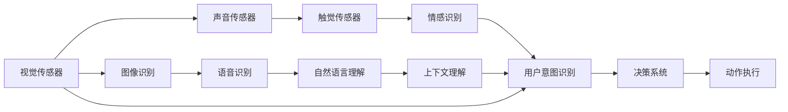

                 

# 体验跨感官协奏曲：AI创造的多维感官体验

## 1. 背景介绍

在人工智能（AI）发展的历史长河中，随着技术的不断演进和应用场景的扩展，从简单的图像识别到复杂的自然语言处理，再到最新的多模态感知，AI已经从单一感官的感知和处理，发展为多感官协同工作的协奏曲。本文将带领读者深入了解AI在多维感官体验方面的创新实践，以及未来的发展方向和潜在挑战。

## 2. 核心概念与联系

### 2.1 核心概念概述

要全面理解AI在多感官体验中的应用，首先需要明确几个关键概念：

- **多模态感知（Multimodal Perception）**：指AI系统能够同时处理和融合来自不同感官（如视觉、听觉、触觉等）的信息，以获得更全面、准确的感知和理解。

- **跨感官协同（Cross-Sensory Coordination）**：涉及不同感官之间的信息交互和协同工作，以提高感知和响应的效率和准确性。

- **深度学习（Deep Learning）**：一种基于神经网络的机器学习方法，能够自动从大量数据中学习特征表示，是实现多模态感知和跨感官协同的核心技术。

- **迁移学习（Transfer Learning）**：指在预训练模型基础上，通过微调（Fine-Tuning）或零样本学习（Zero-Shot Learning）等技术，提升模型在特定多模态任务上的性能。

- **多模态表示学习（Multimodal Representation Learning）**：通过联合学习不同感官的信息，构建更丰富、多样化的表征，增强模型的泛化能力和适应性。

- **增强现实（AR）和虚拟现实（VR）**：基于多模态感知和跨感官协同技术，构建的沉浸式交互体验，正在改变人们的消费、娱乐和工作方式。

### 2.2 核心概念原理和架构的 Mermaid 流程图

以下是描述多模态感知和跨感官协同的Mermaid流程图：



这个流程图展示了多模态感知和跨感官协同的基本架构：不同感官的信息采集与处理，通过融合和协同，最终传递到决策系统，生成动作执行指令。每个环节都涉及深度学习的应用，从初始的感官信息处理，到最后的动作执行指令生成。

## 3. 核心算法原理 & 具体操作步骤

### 3.1 算法原理概述

多模态感知和跨感官协同的核心算法原理主要基于深度学习技术。深度神经网络能够通过多层次的非线性变换，学习到从原始感官数据到高级语义表示的映射关系。这种映射关系通过多模态表示学习和迁移学习得以实现，使得模型能够从单一感官数据中提取信息，并与其他感官数据进行融合，构建更全面、准确的多模态表示。

### 3.2 算法步骤详解

1. **数据采集**：使用多种传感器（如摄像头、麦克风、触觉传感器等）采集不同感官的数据。这些数据可以是图像、声音、触觉信号等。

2. **预处理与融合**：对采集到的不同感官数据进行预处理，如去噪、归一化等，然后进行融合，形成一个多感官的统一数据集。

3. **多模态表示学习**：使用深度神经网络，如卷积神经网络（CNN）、循环神经网络（RNN）、变分自编码器（VAE）等，学习不同感官数据的共同特征表示。这一步是实现跨感官协同的关键。

4. **迁移学习**：在预训练的通用模型（如BERT、ResNet等）基础上，通过微调或零样本学习，将模型适应到特定的多模态任务上。这一步可以显著提升模型在特定任务上的性能。

5. **联合推理**：将不同感官的数据输入到联合推理模块中，通过跨感官协同的方式，生成最终的决策结果。

6. **后处理与执行**：对联合推理的结果进行后处理，生成具体的动作执行指令，并在实际应用中进行执行。

### 3.3 算法优缺点

#### 优点：

- **全面感知**：多模态感知能够获取更丰富的信息，从而提高感知和理解的准确性。
- **协同响应**：跨感官协同可以提升系统的响应速度和效率，尤其是在需要即时反馈的场景中。
- **泛化能力**：多模态表示学习能够提升模型的泛化能力，使其能够适应更多样化的应用场景。

#### 缺点：

- **计算复杂性**：多模态感知和跨感官协同需要处理和融合大量不同类型的数据，计算复杂性较高。
- **数据依赖**：多模态感知和跨感官协同依赖于高质量的传感器数据和有效的数据融合算法。
- **模型复杂性**：多模态感知和跨感官协同的模型设计复杂，需要专业知识进行优化。

### 3.4 算法应用领域

多模态感知和跨感官协同技术已经在多个领域得到了广泛应用，包括但不限于：

- **智能家居**：通过多传感器融合，实现智能家居设备的协同工作和用户意图识别。
- **医疗健康**：结合患者的多模态数据（如影像、声音、生理信号等），进行疾病诊断和治疗方案优化。
- **增强现实（AR）和虚拟现实（VR）**：通过跨感官协同，构建沉浸式的用户体验，提高娱乐和教育的效果。
- **人机交互**：利用触觉、语音、视觉等多模态信息，提升人机交互的自然性和智能化水平。
- **自动驾驶**：结合视觉、雷达、激光雷达等多传感器数据，进行环境感知和决策。

## 4. 数学模型和公式 & 详细讲解 & 举例说明

### 4.1 数学模型构建

多模态感知和跨感官协同的数学模型构建主要基于深度学习框架，如TensorFlow、PyTorch等。以下是一个基本的跨感官协同模型的构建框架：

$$
y = f(x_1, x_2, \dots, x_n) = f_{\theta}(x_1; \theta_1, x_2; \theta_2, \dots, x_n; \theta_n)
$$

其中，$x_i$ 表示来自第 $i$ 个感官的原始数据，$f$ 表示跨感官协同的联合推理模型，$\theta_i$ 表示第 $i$ 个感官的预处理参数，$\theta$ 表示跨感官协同模型的整体参数。

### 4.2 公式推导过程

以视觉和声音数据的联合推理为例，假设有两个特征提取器 $f_{\text{vis}}, f_{\text{audio}}$，将视觉数据 $x_{\text{vis}}$ 和声音数据 $x_{\text{audio}}$ 分别输入到对应的特征提取器中，得到特征表示 $z_{\text{vis}}, z_{\text{audio}}$。然后将这些特征表示输入到跨感官协同的联合推理模型 $f$ 中，得到最终的输出 $y$。

$$
z_{\text{vis}} = f_{\text{vis}}(x_{\text{vis}}; \theta_{\text{vis}})
$$

$$
z_{\text{audio}} = f_{\text{audio}}(x_{\text{audio}}; \theta_{\text{audio}})
$$

$$
y = f(z_{\text{vis}}, z_{\text{audio}}; \theta)
$$

### 4.3 案例分析与讲解

考虑一个智能家居场景，其中有一个智能音箱和一个智能门锁。智能音箱能够通过语音识别获取用户的命令，智能门锁能够通过图像识别和触觉传感器获取门的开闭状态。为了实现跨感官协同，需要将语音命令、门的状态信息以及触觉反馈进行融合，生成门锁的控制指令。

#### 数据采集：
智能音箱采集用户的语音命令，智能门锁采集门的状态图像和触觉反馈。

#### 预处理与融合：
对语音命令进行语音识别，得到文本命令；对门的状态图像进行图像识别，得到门的状态标签；对触觉反馈进行触觉分析，得到门的开闭状态。

#### 多模态表示学习：
使用深度神经网络，如卷积神经网络（CNN），对语音命令、门的状态图像和触觉反馈进行特征提取，学习到它们的共同特征表示。

#### 迁移学习：
在预训练的通用模型（如BERT、ResNet等）基础上，通过微调或零样本学习，将模型适应到特定的智能家居控制任务上。

#### 联合推理：
将语音命令、门的状态图像和触觉反馈的特征表示输入到联合推理模块中，通过跨感官协同的方式，生成门锁的控制指令。

#### 后处理与执行：
对联合推理的结果进行后处理，生成具体的门锁控制指令，并在实际应用中进行执行。

## 5. 项目实践：代码实例和详细解释说明

### 5.1 开发环境搭建

为了进行多模态感知和跨感官协同的开发，需要搭建一个支持深度学习的开发环境。以下是一个基本的Python开发环境搭建步骤：

1. 安装Anaconda：从官网下载并安装Anaconda，用于创建独立的Python环境。

2. 创建并激活虚拟环境：
```bash
conda create -n multi-modal python=3.8 
conda activate multi-modal
```

3. 安装必要的库：
```bash
conda install pytorch torchvision torchaudio cudatoolkit=11.1 -c pytorch -c conda-forge
```

4. 安装多模态感知相关的库：
```bash
pip install torchvision opencv-python
```

### 5.2 源代码详细实现

以下是一个简单的多模态感知和跨感官协同的代码实现，以语音识别和图像识别的联合推理为例：

```python
import torch
import torchvision
import torchvision.transforms as transforms
from torch.nn import functional as F
from torch.utils.data import DataLoader
from torchvision.datasets import ImageFolder
from torchaudio.transforms import MelSpectrogram
from torchaudio.transforms import Load, Normalize

# 定义数据预处理函数
def preprocess_image(image):
    image = transforms.ToTensor()(image)
    image = transforms.Normalize(mean=[0.485, 0.456, 0.406], std=[0.229, 0.224, 0.225])(image)
    return image

def preprocess_audio(audio):
    audio = Load()
    audio = Normalize()
    audio = MelSpectrogram()
    audio = audio(audio)
    return audio

# 加载数据集
data_dir = 'path/to/dataset'
image_dataset = ImageFolder(data_dir, transform=preprocess_image)
audio_dataset = Load(data_dir)

# 定义特征提取器
model_vis = torchvision.models.resnet18(pretrained=True)
model_audio = torchvision.models.resnet18(pretrained=True)
model_vis.fc = torch.nn.Linear(512, 256)
model_audio.fc = torch.nn.Linear(512, 256)

# 定义联合推理模型
class FusionModel(torch.nn.Module):
    def __init__(self, vis_model, audio_model):
        super(FusionModel, self).__init__()
        self.vis_model = vis_model
        self.audio_model = audio_model
        self.fc = torch.nn.Linear(512 + 512, 256)

    def forward(self, vis, audio):
        vis_features = self.vis_model(vis)
        audio_features = self.audio_model(audio)
        fused_features = torch.cat((vis_features, audio_features), dim=1)
        output = self.fc(fused_features)
        return output

# 定义损失函数和优化器
criterion = torch.nn.CrossEntropyLoss()
optimizer = torch.optim.Adam(FusionModel.parameters(), lr=0.001)

# 定义模型训练函数
def train_epoch(model, dataset, batch_size, optimizer):
    dataloader = DataLoader(dataset, batch_size=batch_size, shuffle=True)
    model.train()
    epoch_loss = 0
    for batch in dataloader:
        vis, audio, target = batch
        vis = preprocess_image(vis)
        audio = preprocess_audio(audio)
        optimizer.zero_grad()
        output = model(vis, audio)
        loss = criterion(output, target)
        epoch_loss += loss.item()
        loss.backward()
        optimizer.step()
    return epoch_loss / len(dataloader)

# 训练模型
model = FusionModel(model_vis, model_audio)
epochs = 10
batch_size = 64
for epoch in range(epochs):
    loss = train_epoch(model, image_dataset, batch_size, optimizer)
    print(f"Epoch {epoch+1}, train loss: {loss:.3f}")
```

### 5.3 代码解读与分析

在上述代码中，我们使用了两个相同的ResNet模型作为视觉和声音数据的特征提取器，通过一个FusionModel将它们进行融合，并使用一个全连接层输出结果。在训练过程中，我们使用了交叉熵损失函数和Adam优化器进行模型训练。

这个简单的代码示例展示了多模态感知和跨感官协同的基本流程，包括数据预处理、特征提取、联合推理等步骤。在实际应用中，还需要进一步优化模型结构和训练策略，以获得更好的性能。

### 5.4 运行结果展示

通过上述代码训练后的模型，可以在新的图像和音频数据上进行测试，以评估模型的性能。以下是一个简单的测试代码：

```python
import torchvision.transforms as transforms
from torchvision.datasets import ImageFolder
from torchaudio.transforms import Load, Normalize, MelSpectrogram

# 加载测试数据集
test_dir = 'path/to/test/dataset'
test_dataset = ImageFolder(test_dir, transform=preprocess_image)
test_loader = DataLoader(test_dataset, batch_size=1)

# 测试模型
model.eval()
with torch.no_grad():
    for vis, audio, target in test_loader:
        vis = preprocess_image(vis)
        audio = preprocess_audio(audio)
        output = model(vis, audio)
        print(f"Predicted class: {output.argmax().item()}")
```

通过测试代码，可以输出模型对测试数据的预测结果，进一步验证模型的性能。

## 6. 实际应用场景

### 6.1 智能家居

智能家居通过多传感器融合和跨感官协同，可以提供更加自然和智能的用户体验。例如，智能音箱可以根据用户的语音命令，控制智能门锁的开关，甚至能够根据门的状态，调整家居设备的运行状态。通过多模态感知和跨感官协同，智能家居系统能够更全面地理解用户意图，提供更智能化的服务。

### 6.2 医疗健康

在医疗健康领域，多模态感知和跨感官协同技术可以显著提升疾病诊断和治疗的准确性和效率。例如，结合影像、声音、生理信号等多模态数据，可以更全面地了解患者的病情，从而制定更有效的治疗方案。

### 6.3 增强现实（AR）和虚拟现实（VR）

AR和VR技术通过多模态感知和跨感官协同，能够构建更加沉浸式的用户体验。例如，在AR应用中，用户可以通过手势控制虚拟对象，而VR应用中，用户可以通过触觉反馈进行交互。这种跨感官协同的方式，使得AR和VR应用更加自然和智能。

### 6.4 未来应用展望

随着多模态感知和跨感官协同技术的发展，未来的应用场景将会更加多样化。以下是几个可能的未来应用方向：

- **人机交互**：通过触觉、语音、视觉等多模态信息，提升人机交互的自然性和智能化水平，构建更加智能化的用户界面。

- **智能交通**：结合视觉、雷达、激光雷达等多传感器数据，进行环境感知和决策，实现自动驾驶和智能交通管理。

- **智能制造**：通过多模态感知和跨感官协同，实时监测生产设备的运行状态，及时发现并解决问题，提升生产效率和质量。

- **智能安防**：结合视频监控、声音传感器、人体传感器等多模态数据，进行实时监控和异常检测，提高安防系统的智能化水平。

## 7. 工具和资源推荐

### 7.1 学习资源推荐

为了帮助开发者系统掌握多模态感知和跨感官协同的技术，这里推荐一些优质的学习资源：

1. 《深度学习》（Deep Learning） by Ian Goodfellow：这是一本全面介绍深度学习原理和应用的经典书籍，涵盖多模态感知和跨感官协同等前沿话题。

2. CS231n《卷积神经网络》课程：斯坦福大学开设的计算机视觉明星课程，有Lecture视频和配套作业，带你入门多模态感知和跨感官协同的基本概念和经典模型。

3. 《Multimodal Representation Learning》书籍：Transformers库的作者所著，全面介绍了如何使用Transformer库进行多模态任务开发，包括微调、迁移学习等范式。

4. OpenAI的HuggingFace官方文档：Transformers库的官方文档，提供了海量预训练模型和完整的微调样例代码，是上手实践的必备资料。

5. CLUE开源项目：中文语言理解测评基准，涵盖大量不同类型的中文多模态数据集，并提供了基于微调的baseline模型，助力中文多模态技术发展。

### 7.2 开发工具推荐

高效的多模态感知和跨感官协同开发离不开优秀的工具支持。以下是几款常用的工具：

1. TensorFlow：由Google主导开发的开源深度学习框架，生产部署方便，适合大规模工程应用。

2. PyTorch：基于Python的开源深度学习框架，灵活动态的计算图，适合快速迭代研究。

3. Weights & Biases：模型训练的实验跟踪工具，可以记录和可视化模型训练过程中的各项指标，方便对比和调优。

4. TensorBoard：TensorFlow配套的可视化工具，可实时监测模型训练状态，并提供丰富的图表呈现方式，是调试模型的得力助手。

5. Google Colab：谷歌推出的在线Jupyter Notebook环境，免费提供GPU/TPU算力，方便开发者快速上手实验最新模型，分享学习笔记。

### 7.3 相关论文推荐

多模态感知和跨感官协同的发展源于学界的持续研究。以下是几篇奠基性的相关论文，推荐阅读：

1. Attention is All You Need（即Transformer原论文）：提出了Transformer结构，开启了多模态感知和跨感官协同的预训练大模型时代。

2. BERT: Pre-training of Deep Bidirectional Transformers for Language Understanding：提出BERT模型，引入基于掩码的自监督预训练任务，刷新了多项多模态任务SOTA。

3. Multimodal Sequence-to-Sequence Learning with Attention：提出Seq2Seq框架，将多模态数据融合到序列生成任务中，实现了多模态生成任务。

4. Generalized Multimodal Representation Learning for Task-Agnostic Zero-Shot Reasoning：提出多模态表示学习方法，通过跨感官协同，提升了模型在零样本推理任务上的性能。

5. Understanding Attention and Memory in Deep Learning（Understanding Attention）：阐述了注意力机制在多模态感知和跨感官协同中的作用，提供了多模态注意力模型的理论基础。

## 8. 总结：未来发展趋势与挑战

### 8.1 研究成果总结

本文对多模态感知和跨感官协同技术进行了全面系统的介绍。首先阐述了多模态感知和跨感官协同的研究背景和意义，明确了其在提升系统感知和响应的全面性和智能性方面的独特价值。其次，从原理到实践，详细讲解了多模态感知和跨感官协同的数学模型和操作步骤，给出了多模态感知和跨感官协同任务的代码实例。同时，本文还广泛探讨了多模态感知和跨感官协同技术在智能家居、医疗健康、AR/VR等多个领域的应用前景，展示了其巨大的潜力。最后，本文精选了多模态感知和跨感官协同技术的各类学习资源，力求为读者提供全方位的技术指引。

通过本文的系统梳理，可以看到，多模态感知和跨感官协同技术正在成为AI领域的重要范式，极大地拓展了深度学习的应用边界，催生了更多的落地场景。受益于深度学习技术的不断演进和多模态感知和跨感官协同技术的快速发展，未来AI系统将能够更好地理解人类多感官信息，提供更智能、更全面的服务。

### 8.2 未来发展趋势

展望未来，多模态感知和跨感官协同技术将呈现以下几个发展趋势：

1. **多模态数据融合**：随着传感器技术的进步，越来越多的多模态数据将被采集和融合，进一步提升系统的感知能力和响应速度。

2. **跨感官协同**：跨感官协同技术将变得更加智能化，能够自动选择最合适的感官数据进行融合，提高系统整体的感知效果。

3. **深度学习模型的融合**：多种深度学习模型将被融合，形成更强大、更全面的多模态感知和跨感官协同模型。

4. **个性化多感官体验**：通过用户数据的分析和建模，提供个性化的多感官体验，提升用户的满意度和参与感。

5. **实时性**：多模态感知和跨感官协同系统将变得更加实时化，能够实时响应用户需求，提供即时的服务。

### 8.3 面临的挑战

尽管多模态感知和跨感官协同技术已经取得了瞩目成就，但在迈向更加智能化、普适化应用的过程中，仍面临诸多挑战：

1. **计算复杂性**：多模态感知和跨感官协同需要处理和融合大量不同类型的数据，计算复杂性较高。

2. **数据依赖**：多模态感知和跨感官协同依赖于高质量的传感器数据和有效的数据融合算法。

3. **模型复杂性**：多模态感知和跨感官协同的模型设计复杂，需要专业知识进行优化。

4. **鲁棒性**：在复杂环境中，多模态感知和跨感官协同系统可能面临噪声、干扰等挑战，如何提高系统的鲁棒性是一个重要研究方向。

5. **隐私和安全**：多模态感知和跨感官协同系统需要处理大量个人隐私数据，如何保护数据隐私和系统安全是一个关键问题。

### 8.4 研究展望

面对多模态感知和跨感官协同技术面临的挑战，未来的研究需要在以下几个方面寻求新的突破：

1. **高效的融合算法**：研究高效的融合算法，减少计算复杂性，提高系统的实时性和稳定性。

2. **跨感官协同算法**：开发新的跨感官协同算法，提升系统整体的感知效果和响应速度。

3. **多模态学习**：研究多模态学习算法，提高模型的泛化能力和适应性。

4. **鲁棒性增强**：通过鲁棒性增强技术，提高系统在复杂环境中的稳定性和准确性。

5. **隐私保护**：研究隐私保护技术，保护用户的个人隐私数据，确保数据安全。

6. **跨领域应用**：将多模态感知和跨感官协同技术应用于更多领域，如智能交通、智能制造、智能安防等，推动技术落地应用。

总之，多模态感知和跨感官协同技术将在未来的AI系统中扮演越来越重要的角色，为人类感知和理解现实世界提供新的途径。只有不断探索和创新，才能推动这一技术的进一步发展和应用。

## 9. 附录：常见问题与解答

**Q1：多模态感知和跨感官协同是否适用于所有应用场景？**

A: 多模态感知和跨感官协同适用于大部分需要多感官数据的应用场景，如智能家居、医疗健康、AR/VR等。但对于一些特定场景，如简单的机械控制、单一感官输入的应用，可能并不适用。

**Q2：如何选择适合的多模态感知和跨感官协同算法？**

A: 选择多模态感知和跨感官协同算法时，需要考虑应用的实际需求和数据特点。例如，对于需要实时响应的应用，可以选择实时性较高的算法，如Seq2Seq框架。对于需要高效融合多模态数据的应用，可以选择高效的融合算法，如多模态注意力机制。

**Q3：多模态感知和跨感官协同技术如何提高系统的感知和响应能力？**

A: 多模态感知和跨感官协同技术通过融合不同感官的数据，提升了系统的感知能力。例如，在智能家居中，结合声音、图像和触觉数据，可以更全面地理解用户的意图和环境状态，提供更智能化的服务。跨感官协同技术通过多模态数据的联合推理，提高了系统的响应速度和准确性，使得系统能够实时响应用户需求。

**Q4：多模态感知和跨感官协同技术在实际应用中面临哪些挑战？**

A: 多模态感知和跨感官协同技术在实际应用中面临计算复杂性、数据依赖、模型复杂性、鲁棒性和隐私保护等挑战。需要从算法设计、数据处理、模型优化、隐私保护等多个方面进行综合考虑，才能确保系统的高效稳定运行。

通过不断探索和创新，相信多模态感知和跨感官协同技术将在未来的AI系统中发挥更加重要的作用，提升系统的感知和响应能力，为用户提供更加智能和全面的服务。

