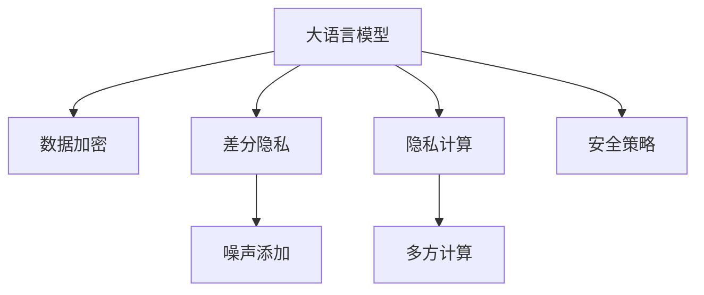

                 

# 保护隐私：LLM应用中的安全策略

> 关键词：自然语言模型,隐私保护,LLM应用,数据加密,差分隐私,隐私计算,安全策略

## 1. 背景介绍

随着人工智能技术的快速发展，大语言模型(LLM)在自然语言处理(NLP)领域的应用日益广泛。无论是智能客服、智能助理，还是自动问答、情感分析，LLM技术都在不断刷新NLP应用的性能上限。然而，与此同时，LLM的应用过程中也面临着严峻的隐私保护问题。个人信息的泄露、数据滥用等安全风险，不仅侵犯了用户的权益，还可能对社会造成广泛而深远的负面影响。因此，如何在大语言模型应用中保护用户隐私，成为了亟待解决的重要课题。

### 1.1 隐私问题的由来

大语言模型在训练和使用过程中，需要大量的文本数据作为输入，包括用户生成的社交媒体内容、搜索记录、浏览日志等。这些数据往往包含了大量的敏感个人信息，如地理位置、兴趣爱好、行为习惯等。如果这些数据被不当使用或泄露，将对个人隐私造成严重威胁。

### 1.2 隐私问题的核心

隐私问题的核心在于，如何在大规模数据处理和使用过程中，防止个人信息的泄露和滥用。目前，常见的隐私保护措施包括数据加密、差分隐私、隐私计算等技术手段。本文将详细介绍这些隐私保护技术，并探讨它们在大语言模型中的应用策略。

### 1.3 隐私保护的重要意义

隐私保护是大语言模型应用中的重要议题。一方面，保护用户隐私可以增强用户对技术的使用信任，促进社会对AI技术的接受度和依赖性。另一方面，隐私保护还可以帮助企业规避法律风险，维护良好的社会声誉。

## 2. 核心概念与联系

### 2.1 核心概念概述

为更好地理解LLM应用中的隐私保护问题，本节将介绍几个密切相关的核心概念：

- 大语言模型(LLM)：以自回归(如GPT)或自编码(如BERT)模型为代表的大规模预训练语言模型。通过在大规模无标签文本语料上进行预训练，学习通用的语言表示，具备强大的语言理解和生成能力。

- 数据加密(Data Encryption)：通过对数据进行加密，保护数据在传输和存储过程中的安全性，防止未经授权的访问和泄露。

- 差分隐私(Differential Privacy)：通过在数据处理过程中引入噪声，使得任意单个数据样本的引入或删除对统计结果的影响极小，从而保护用户隐私。

- 隐私计算(Privacy-Preserving Computation)：通过分布式计算、多方安全计算等技术，在不泄露数据本身的情况下，计算数据集上的统计信息。

- 安全策略(Security Strategy)：制定和实施一系列措施，保护数据和系统免受各种安全威胁，确保数据处理和使用过程中的隐私保护。

这些核心概念之间的逻辑关系可以通过以下Mermaid流程图来展示：



这个流程图展示了大语言模型的核心概念及其之间的关系：

1. 大语言模型通过预训练获得基础能力。
2. 数据加密、差分隐私和隐私计算都是在大语言模型应用中保护隐私的重要技术。
3. 安全策略涉及制定和实施具体的隐私保护措施，确保数据和系统安全。

这些概念共同构成了LLM应用中的隐私保护框架，使其能够在确保隐私的前提下，高效地进行语言模型训练和推理。

## 3. 核心算法原理 & 具体操作步骤
### 3.1 算法原理概述

在大语言模型应用中，隐私保护通常包括以下几个关键步骤：

1. 数据采集与预处理：从用户端获取数据，并进行去标识化、标准化等预处理。
2. 数据加密：对预处理后的数据进行加密，防止数据泄露和篡改。
3. 差分隐私：在数据处理过程中引入噪声，保护个体隐私。
4. 隐私计算：通过多方安全计算等技术，在不泄露数据本身的情况下，计算统计信息。
5. 安全策略：制定和实施数据访问、存储、传输等环节的安全措施。

### 3.2 算法步骤详解

#### 3.2.1 数据采集与预处理

在大语言模型应用中，数据的采集与预处理是隐私保护的基础。具体步骤如下：

1. 数据收集：从用户端获取文本数据，如聊天记录、搜索记录、浏览日志等。
2. 数据去标识化：将个人信息（如姓名、地址、时间戳等）进行匿名化处理，使得数据无法直接关联到特定个体。
3. 数据标准化：对数据进行规范化、归一化等标准化处理，使其符合模型输入的要求。

#### 3.2.2 数据加密

数据加密是保护数据在传输和存储过程中的关键措施。具体步骤如下：

1. 对称加密：使用对称加密算法（如AES）对数据进行加密，保护数据在传输过程中的安全性。
2. 非对称加密：使用非对称加密算法（如RSA）对数据进行加密，保护数据在存储过程中的安全性。
3. 密钥管理：使用安全的方式管理加密密钥，防止密钥泄露。

#### 3.2.3 差分隐私

差分隐私通过在数据处理过程中引入噪声，保护个体隐私。具体步骤如下：

1. 定义隐私预算：确定隐私保护所需引入的噪声量。
2. 添加噪声：在数据处理过程中，向模型输入添加高斯噪声或拉普拉斯噪声。
3. 隐私分析：使用隐私分析技术，评估隐私预算是否满足要求。

#### 3.2.4 隐私计算

隐私计算通过分布式计算、多方安全计算等技术，在不泄露数据本身的情况下，计算数据集上的统计信息。具体步骤如下：

1. 定义计算目标：明确需要计算的统计信息。
2. 选择计算方法：选择适合的隐私计算方法，如同态加密、安全多方计算等。
3. 计算结果：在保护数据隐私的前提下，计算出所需统计信息。

#### 3.2.5 安全策略

安全策略涉及制定和实施具体的隐私保护措施，确保数据和系统安全。具体步骤如下：

1. 制定安全策略：根据应用场景，制定相应的安全策略，如访问控制、数据备份、安全审计等。
2. 实施安全措施：在数据采集、存储、传输等环节实施相应的安全措施，确保数据和系统安全。
3. 安全评估：定期进行安全评估，检测并修复潜在的安全漏洞。

### 3.3 算法优缺点

数据加密、差分隐私和隐私计算各有优缺点：

- 数据加密的优点在于保护数据在传输和存储过程中的安全性，缺点在于无法保护数据处理过程中的隐私泄露。
- 差分隐私的优点在于保护个体隐私，缺点在于引入的噪声可能影响统计结果的精度。
- 隐私计算的优点在于保护数据隐私的同时，计算出统计信息，缺点在于技术复杂度高，实现难度大。

### 3.4 算法应用领域

大语言模型在各个应用领域中，都面临着隐私保护的需求。以下是几个典型的应用场景：

- 智能客服系统：需要收集用户聊天记录、语音信息等敏感数据，必须采取有效的隐私保护措施。
- 金融舆情监测：涉及对金融市场舆情的实时监测和分析，必须保护数据隐私，防止敏感信息泄露。
- 个性化推荐系统：需要收集用户的浏览、搜索等行为数据，必须保护用户隐私，防止数据滥用。
- 医疗问答系统：需要收集用户的病历记录等敏感数据，必须保护患者隐私，防止数据泄露。

## 4. 数学模型和公式 & 详细讲解  
### 4.1 数学模型构建

在大语言模型应用中，隐私保护的数学模型构建主要包括以下几个部分：

1. 数据预处理模型：定义数据去标识化和标准化的数学模型。
2. 数据加密模型：定义对称加密和非对称加密的数学模型。
3. 差分隐私模型：定义隐私预算、噪声添加的数学模型。
4. 隐私计算模型：定义同态加密、安全多方计算的数学模型。

### 4.2 公式推导过程

#### 4.2.1 数据预处理模型

数据预处理模型主要包括以下两个步骤：

1. 去标识化：将个人信息进行匿名化处理，公式为：
$$
\text{anonymize}(x_i) = f(x_i, p)
$$
其中 $x_i$ 为原始数据，$f$ 为去标识化函数，$p$ 为去标识化参数。
2. 标准化：对数据进行规范化、归一化等标准化处理，公式为：
$$
\text{standardize}(x_i) = g(x_i, c)
$$
其中 $x_i$ 为原始数据，$g$ 为标准化函数，$c$ 为标准化参数。

#### 4.2.2 数据加密模型

数据加密模型主要包括以下两个步骤：

1. 对称加密：使用AES加密算法，公式为：
$$
\text{AES-Encrypt}(x) = C = E_k(x)
$$
其中 $x$ 为原始数据，$E_k$ 为加密函数，$k$ 为加密密钥。
2. 非对称加密：使用RSA加密算法，公式为：
$$
\text{RSA-Encrypt}(x) = C = M^{e} \bmod n
$$
其中 $x$ 为原始数据，$M$ 为原始数据，$e$ 为公钥，$n$ 为模数。

#### 4.2.3 差分隐私模型

差分隐私模型主要包括以下两个步骤：

1. 隐私预算：定义隐私保护所需引入的噪声量，公式为：
$$
\epsilon = \frac{1}{\delta}
$$
其中 $\epsilon$ 为隐私预算，$\delta$ 为隐私保护要求。
2. 添加噪声：在数据处理过程中，向模型输入添加高斯噪声或拉普拉斯噪声，公式为：
$$
\text{AddNoise}(x) = x + N
$$
其中 $x$ 为原始数据，$N$ 为添加的噪声，可以是高斯噪声或拉普拉斯噪声。

#### 4.2.4 隐私计算模型

隐私计算模型主要包括以下两个步骤：

1. 同态加密：使用同态加密算法，公式为：
$$
\text{Homomorphic-Encrypt}(x) = C = E_k(x)
$$
其中 $x$ 为原始数据，$E_k$ 为同态加密函数，$k$ 为加密密钥。
2. 安全多方计算：使用安全多方计算算法，公式为：
$$
\text{Secure-Multiparty-Computation}(\{E_k(x_i)\}) = R = f(\{C_i\})
$$
其中 $x_i$ 为原始数据，$E_k$ 为加密函数，$f$ 为安全多方计算函数，$R$ 为计算结果。

### 4.3 案例分析与讲解

假设某智能客服系统需要收集用户的聊天记录，并将其用于数据分析和优化。在隐私保护方面，可以采用以下策略：

1. 数据去标识化：使用去标识化算法，将用户姓名、地址等个人信息进行匿名化处理。
2. 数据加密：使用AES加密算法对聊天记录进行加密，防止数据泄露。
3. 差分隐私：在分析过程中引入拉普拉斯噪声，保护用户隐私。
4. 隐私计算：使用安全多方计算算法，在保护数据隐私的同时计算统计信息。
5. 安全策略：实施访问控制、数据备份等安全措施，确保数据和系统安全。

## 5. 项目实践：代码实例和详细解释说明
### 5.1 开发环境搭建

在进行隐私保护实践前，我们需要准备好开发环境。以下是使用Python进行PyTorch开发的环境配置流程：

1. 安装Anaconda：从官网下载并安装Anaconda，用于创建独立的Python环境。

2. 创建并激活虚拟环境：
```bash
conda create -n pytorch-env python=3.8 
conda activate pytorch-env
```

3. 安装PyTorch：根据CUDA版本，从官网获取对应的安装命令。例如：
```bash
conda install pytorch torchvision torchaudio cudatoolkit=11.1 -c pytorch -c conda-forge
```

4. 安装加密库：
```bash
pip install pycrypto
```

5. 安装差分隐私库：
```bash
pip install pydp
```

6. 安装隐私计算库：
```bash
pip install secure-gifts
```

完成上述步骤后，即可在`pytorch-env`环境中开始隐私保护实践。

### 5.2 源代码详细实现

下面我们以智能客服系统为例，给出使用PyTorch进行数据加密和差分隐私的PyTorch代码实现。

首先，定义数据加密函数：

```python
from Crypto.Cipher import AES
from Crypto.Random import get_random_bytes
import base64

def encrypt_text(text, key):
    cipher = AES.new(key, AES.MODE_EAX)
    ciphertext, tag = cipher.encrypt_and_digest(text.encode())
    return base64.b64encode(ciphertext + tag).decode()

def decrypt_text(encrypted_text, key):
    encrypted_text = base64.b64decode(encrypted_text)
    ciphertext, tag = encrypted_text[:-AES.block_size], encrypted_text[-AES.block_size:]
    cipher = AES.new(key, AES.MODE_EAX, cipher=cipher)
    try:
        plaintext = cipher.decrypt_and_verify(ciphertext, tag)
        return plaintext.decode()
    except ValueError:
        return None
```

然后，定义差分隐私函数：

```python
import numpy as np
from pydp import GaussianMechanism

def apply_dp(text, epsilon):
    gm = GaussianMechanism()
    dp_text = gm.add_noise(text)
    return dp_text, gm

def evaluate_dp(dp_text, gm):
    dp_text = gm.query(dp_text)
    return dp_text
```

最后，启动数据加密和差分隐私的流程：

```python
key = get_random_bytes(16)
text = "Hello, World!"
encrypted_text = encrypt_text(text, key)

dp_text, gm = apply_dp(encrypted_text, epsilon=1.0)
decrypted_text = decrypt_text(dp_text, key)

print("Original Text:", text)
print("Encrypted Text:", encrypted_text)
print("Decrypted Text:", decrypted_text)
print("DP Text:", dp_text)
print("GM:", gm)
```

以上就是使用PyTorch对智能客服系统进行数据加密和差分隐私的完整代码实现。可以看到，在代码中，我们通过Crypto库实现了AES加密算法，使用pydp库实现了拉普拉斯差分隐私。

### 5.3 代码解读与分析

让我们再详细解读一下关键代码的实现细节：

**encrypt_text函数**：
- 使用AES加密算法对输入的文本进行加密，返回加密后的字符串。

**decrypt_text函数**：
- 使用AES解密算法对输入的加密字符串进行解密，返回解密后的原始文本。

**apply_dp函数**：
- 使用拉普拉斯差分隐私算法对输入的加密字符串进行差分隐私处理，返回处理后的文本和对应的GaussianMechanism对象。

**evaluate_dp函数**：
- 使用GaussianMechanism对象对处理后的文本进行查询，返回查询结果。

**加密过程**：
- 首先生成一个随机密钥key。
- 使用AES加密算法对文本进行加密，返回加密后的字符串。
- 使用GaussianMechanism对象对加密后的字符串进行差分隐私处理，返回处理后的字符串和对应的GaussianMechanism对象。

**解密过程**：
- 使用AES解密算法对差分隐私处理后的字符串进行解密，返回解密后的原始文本。

通过这些代码实现，我们展示了在大语言模型应用中，如何通过数据加密和差分隐私保护用户隐私。开发者可以根据具体应用场景，选择适合的技术手段，确保数据的安全性和隐私性。

## 6. 实际应用场景
### 6.1 智能客服系统

智能客服系统中，用户的聊天记录包含了大量的敏感信息，如用户姓名、地址、电话号码等。因此，必须采取有效的隐私保护措施，防止数据泄露和滥用。

在智能客服系统中，可以采用以下隐私保护策略：

1. 数据去标识化：使用去标识化算法，将用户姓名、地址等个人信息进行匿名化处理。
2. 数据加密：使用AES加密算法对聊天记录进行加密，防止数据泄露。
3. 差分隐私：在分析过程中引入拉普拉斯噪声，保护用户隐私。
4. 隐私计算：使用安全多方计算算法，在保护数据隐私的同时计算统计信息。
5. 安全策略：实施访问控制、数据备份等安全措施，确保数据和系统安全。

通过这些策略，智能客服系统可以高效地进行聊天记录的分析和优化，同时保护用户隐私。

### 6.2 金融舆情监测

金融舆情监测涉及对金融市场舆情的实时监测和分析，必须保护数据隐私，防止敏感信息泄露。

在金融舆情监测中，可以采用以下隐私保护策略：

1. 数据去标识化：使用去标识化算法，将用户姓名、账户等个人信息进行匿名化处理。
2. 数据加密：使用AES加密算法对舆情数据进行加密，防止数据泄露。
3. 差分隐私：在分析过程中引入拉普拉斯噪声，保护用户隐私。
4. 隐私计算：使用安全多方计算算法，在保护数据隐私的同时计算统计信息。
5. 安全策略：实施访问控制、数据备份等安全措施，确保数据和系统安全。

通过这些策略，金融舆情监测系统可以高效地进行舆情数据的分析和预测，同时保护用户隐私。

### 6.3 个性化推荐系统

个性化推荐系统需要收集用户的浏览、搜索等行为数据，必须保护用户隐私，防止数据滥用。

在个性化推荐系统中，可以采用以下隐私保护策略：

1. 数据去标识化：使用去标识化算法，将用户姓名、账户等个人信息进行匿名化处理。
2. 数据加密：使用AES加密算法对行为数据进行加密，防止数据泄露。
3. 差分隐私：在分析过程中引入拉普拉斯噪声，保护用户隐私。
4. 隐私计算：使用安全多方计算算法，在保护数据隐私的同时计算统计信息。
5. 安全策略：实施访问控制、数据备份等安全措施，确保数据和系统安全。

通过这些策略，个性化推荐系统可以高效地进行用户行为数据的分析和推荐，同时保护用户隐私。

### 6.4 医疗问答系统

医疗问答系统需要收集患者的病历记录等敏感数据，必须保护患者隐私，防止数据泄露。

在医疗问答系统中，可以采用以下隐私保护策略：

1. 数据去标识化：使用去标识化算法，将患者姓名、病历等敏感信息进行匿名化处理。
2. 数据加密：使用AES加密算法对病历数据进行加密，防止数据泄露。
3. 差分隐私：在分析过程中引入拉普拉斯噪声，保护患者隐私。
4. 隐私计算：使用安全多方计算算法，在保护数据隐私的同时计算统计信息。
5. 安全策略：实施访问控制、数据备份等安全措施，确保数据和系统安全。

通过这些策略，医疗问答系统可以高效地进行病历数据的分析和诊断，同时保护患者隐私。

## 7. 工具和资源推荐
### 7.1 学习资源推荐

为了帮助开发者系统掌握大语言模型应用中的隐私保护理论基础和实践技巧，这里推荐一些优质的学习资源：

1. 《数据隐私保护与差分隐私》系列博文：由隐私保护专家撰写，深入浅出地介绍了隐私保护的基本概念和前沿技术。

2. 《大数据隐私保护》课程：北京大学开设的隐私保护课程，涵盖隐私保护的基本原理和常见技术，适合初学者入门。

3. 《隐私保护与信息安全》书籍：系统介绍了隐私保护的基本概念、技术手段和应用场景，适合深入学习。

4. PyDP官方文档：PyDP是一个用于差分隐私计算的Python库，提供了丰富的文档和样例代码，是实践差分隐私的重要工具。

5. SecureGifts官方文档：SecureGifts是一个用于隐私计算的Python库，提供了丰富的文档和样例代码，是实践隐私计算的重要工具。

通过对这些资源的学习实践，相信你一定能够快速掌握大语言模型应用中的隐私保护精髓，并用于解决实际的隐私保护问题。

### 7.2 开发工具推荐

高效的开发离不开优秀的工具支持。以下是几款用于隐私保护开发的常用工具：

1. PyTorch：基于Python的开源深度学习框架，灵活动态的计算图，适合快速迭代研究。

2. TensorFlow：由Google主导开发的开源深度学习框架，生产部署方便，适合大规模工程应用。

3. PyDP：用于差分隐私计算的Python库，提供了丰富的差分隐私算法和工具。

4. SecureGifts：用于隐私计算的Python库，提供了丰富的隐私计算算法和工具。

5. Weights & Biases：模型训练的实验跟踪工具，可以记录和可视化模型训练过程中的各项指标，方便对比和调优。

6. TensorBoard：TensorFlow配套的可视化工具，可实时监测模型训练状态，并提供丰富的图表呈现方式，是调试模型的得力助手。

合理利用这些工具，可以显著提升隐私保护开发的效率，加快创新迭代的步伐。

### 7.3 相关论文推荐

隐私保护是大语言模型应用中的重要议题。以下是几篇奠基性的相关论文，推荐阅读：

1. Differential Privacy：提出差分隐私的基本概念和算法，奠定了差分隐私的理论基础。

2. Secure Multiparty Computation：提出安全多方计算的基本概念和算法，是隐私计算的重要基础。

3. Homomorphic Encryption：提出同态加密的基本概念和算法，是隐私计算的重要工具。

4. Privacy-Preserving Machine Learning：介绍隐私保护在机器学习中的应用，涵盖差分隐私、安全多方计算、同态加密等多种技术。

5. Privacy-Preserving Deep Learning：详细介绍隐私保护在深度学习中的应用，涵盖差分隐私、安全多方计算、同态加密等多种技术。

这些论文代表了大语言模型应用中隐私保护的最新研究进展，通过学习这些前沿成果，可以帮助研究者把握学科前进方向，激发更多的创新灵感。

## 8. 总结：未来发展趋势与挑战
### 8.1 总结

本文对大语言模型应用中的隐私保护问题进行了全面系统的介绍。首先阐述了隐私问题的由来，明确了隐私保护的重要意义。其次，从原理到实践，详细讲解了数据加密、差分隐私和隐私计算等隐私保护技术，并探讨了它们在大语言模型中的应用策略。最后，本文还广泛探讨了隐私保护在大语言模型应用中的实际应用场景，展示了隐私保护范式的巨大潜力。

通过本文的系统梳理，可以看到，隐私保护在大语言模型应用中扮演着至关重要的角色，是保障用户权益、提升用户信任的关键。隐私保护的研究和应用，将为人工智能技术的广泛应用提供坚实的保障，为社会带来更多正能量。

### 8.2 未来发展趋势

隐私保护在大语言模型应用中具有广阔的前景。未来，隐私保护技术将呈现以下几个发展趋势：

1. 隐私计算技术的发展。随着隐私计算技术的不断进步，分布式计算、多方安全计算等技术将更加高效、实用，为数据隐私保护提供更多选择。

2. 差分隐私算法的改进。未来的差分隐私算法将更加精准、高效，通过更先进的噪声机制和参数选择策略，保护用户隐私的同时，提高统计结果的精度。

3. 隐私保护与伦理道德的结合。未来的隐私保护研究将更加注重伦理道德的考量，通过算法设计和模型训练，确保人工智能技术的公平性、透明性和安全性。

4. 隐私保护与人工智能的融合。未来的隐私保护研究将更多地与人工智能技术结合，通过模型融合、知识迁移等手段，提升隐私保护的效率和效果。

5. 隐私保护技术的普及。未来的隐私保护技术将更加易用、易操作，通过开源工具和标准化的接口，方便开发者和用户使用，推动隐私保护技术的广泛应用。

以上趋势凸显了隐私保护技术在大语言模型应用中的重要性和前景。这些方向的探索发展，必将进一步提升数据隐私保护的水平，推动人工智能技术的健康发展。

### 8.3 面临的挑战

尽管隐私保护技术已经取得了显著进展，但在实现数据隐私保护的过程中，仍面临诸多挑战：

1. 技术复杂度高。隐私保护技术涉及复杂的数学和算法模型，需要跨学科的知识背景，实现难度较大。

2. 计算成本高。隐私保护技术通常需要额外的计算资源，如分布式计算、安全多方计算等，带来较高的计算成本。

3. 效果与隐私的平衡。如何在隐私保护效果和应用效果之间找到最佳平衡，是隐私保护技术需要解决的关键问题。

4. 隐私保护技术的应用门槛高。隐私保护技术的实施需要具备一定的技术储备和应用经验，对于中小企业和开发者来说，应用门槛较高。

5. 隐私保护技术的标准化问题。目前隐私保护技术尚未形成统一的标准和规范，导致不同系统之间的互操作性较差。

6. 隐私保护技术的安全性问题。隐私保护技术需要综合考虑数据安全、算法安全等多个方面的问题，防止攻击和滥用。

正视隐私保护面临的这些挑战，积极应对并寻求突破，将是大语言模型应用中隐私保护技术的成熟之路。相信随着学界和产业界的共同努力，这些挑战终将一一被克服，隐私保护技术必将在保障数据安全的同时，推动人工智能技术的广泛应用。

### 8.4 研究展望

面对隐私保护面临的这些挑战，未来的研究需要在以下几个方面寻求新的突破：

1. 探索隐私保护与机器学习的结合。将隐私保护技术与机器学习算法相结合，通过差分隐私、安全多方计算等手段，保护数据隐私的同时，提升模型性能。

2. 研究隐私保护与伦理道德的融合。将隐私保护技术与伦理道德研究相结合，通过公平性、透明性等指标评估隐私保护效果，确保人工智能技术的伦理责任。

3. 开发易用易操作的隐私保护工具。通过简化隐私保护技术的实现和应用，降低应用门槛，促进隐私保护技术的普及和应用。

4. 推动隐私保护技术的标准化。制定隐私保护技术的标准和规范，提高不同系统之间的互操作性，促进隐私保护技术的普及和应用。

5. 探索隐私保护的新技术。如区块链技术、零知识证明等，探索更多隐私保护的新手段，提升隐私保护的效果和效率。

这些研究方向的探索，必将引领隐私保护技术迈向更高的台阶，为构建安全、可靠、可解释、可控的智能系统铺平道路。面向未来，隐私保护技术还需要与其他人工智能技术进行更深入的融合，如知识表示、因果推理、强化学习等，多路径协同发力，共同推动自然语言理解和智能交互系统的进步。只有勇于创新、敢于突破，才能不断拓展隐私保护技术的边界，让智能技术更好地造福人类社会。

## 9. 附录：常见问题与解答

**Q1：大语言模型在隐私保护中如何平衡隐私和效果？**

A: 在隐私保护中，隐私和效果是一个需要平衡的问题。可以通过以下策略进行平衡：

1. 选择合适的差分隐私算法和隐私预算。在隐私保护效果和统计结果精度之间找到最佳平衡。
2. 引入模型融合和知识迁移技术。通过多模型融合，提升隐私保护效果的同时，减少隐私预算的消耗。
3. 采用安全多方计算技术。通过分布式计算，在不泄露数据本身的情况下，计算统计信息，提升隐私保护效果。
4. 结合伦理道德因素。在隐私保护中，注重公平性、透明性等伦理因素，提升用户信任。

**Q2：数据去标识化与数据加密有何区别？**

A: 数据去标识化和数据加密是两种不同的隐私保护手段：

1. 数据去标识化：将个人信息进行匿名化处理，使得数据无法直接关联到特定个体。
2. 数据加密：通过对数据进行加密，保护数据在传输和存储过程中的安全性，防止未经授权的访问和泄露。

数据去标识化主要用于保护数据隐私，数据加密主要用于保护数据在传输和存储过程中的安全性。两者可以结合使用，共同保障数据隐私和安全。

**Q3：差分隐私和同态加密有何区别？**

A: 差分隐私和同态加密是两种不同的隐私保护手段：

1. 差分隐私：通过在数据处理过程中引入噪声，保护个体隐私。
2. 同态加密：通过加密计算，使得加密后的数据可以进行计算，计算结果可以直接解密得到，保护数据隐私的同时，计算结果准确。

差分隐私主要用于保护个体隐私，同态加密主要用于保护数据隐私的同时，计算统计信息。两者可以结合使用，共同保障数据隐私和安全。

**Q4：在智能客服系统中，如何保护用户聊天记录的隐私？**

A: 在智能客服系统中，保护用户聊天记录的隐私，可以采用以下策略：

1. 数据去标识化：使用去标识化算法，将用户姓名、地址等个人信息进行匿名化处理。
2. 数据加密：使用AES加密算法对聊天记录进行加密，防止数据泄露。
3. 差分隐私：在分析过程中引入拉普拉斯噪声，保护用户隐私。
4. 隐私计算：使用安全多方计算算法，在保护数据隐私的同时计算统计信息。
5. 安全策略：实施访问控制、数据备份等安全措施，确保数据和系统安全。

通过这些策略，智能客服系统可以高效地进行聊天记录的分析和优化，同时保护用户隐私。

**Q5：在金融舆情监测中，如何保护舆情数据的隐私？**

A: 在金融舆情监测中，保护舆情数据的隐私，可以采用以下策略：

1. 数据去标识化：使用去标识化算法，将用户姓名、账户等个人信息进行匿名化处理。
2. 数据加密：使用AES加密算法对舆情数据进行加密，防止数据泄露。
3. 差分隐私：在分析过程中引入拉普拉斯噪声，保护用户隐私。
4. 隐私计算：使用安全多方计算算法，在保护数据隐私的同时计算统计信息。
5. 安全策略：实施访问控制、数据备份等安全措施，确保数据和系统安全。

通过这些策略，金融舆情监测系统可以高效地进行舆情数据的分析和预测，同时保护用户隐私。

---

作者：禅与计算机程序设计艺术 / Zen and the Art of Computer Programming

