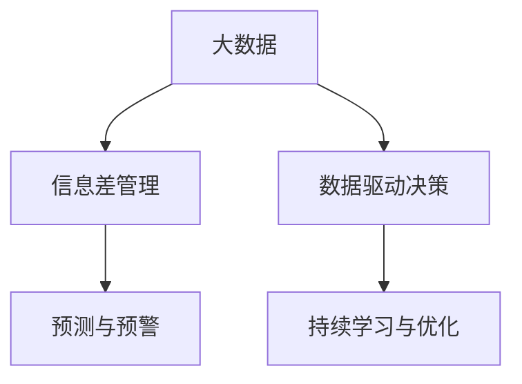

                 

# 信息差的创新管理驱动力：大数据如何推动创新管理

在快速发展的数字化时代，企业面临的竞争日趋激烈，创新的速度和效率成为决定其成败的关键。大数据技术作为一项革命性的创新工具，通过有效管理信息差，极大地推动了企业的创新管理。本文将深入探讨大数据在信息差管理中的核心概念与联系、算法原理、具体操作步骤，以及其在实际应用中的具体案例和未来展望，为读者提供一份全面而详细的技术指南。

## 1. 背景介绍

### 1.1 问题由来

在信息化和数字化时代，信息已经成为企业决策的核心资源。然而，在数据泛滥、信息过载的背景下，企业往往难以有效识别和利用关键信息，导致决策失误和资源浪费。如何高效管理信息差，利用大数据技术驱动创新，成为了当今企业面临的重大挑战。

### 1.2 问题核心关键点

大数据在创新管理中的应用，主要聚焦于信息差管理。信息差管理旨在通过数据收集、存储、分析和应用，将信息差转化为企业创新决策的驱动力，从而提升企业竞争力。关键点包括：

1. **数据采集与整合**：收集企业内外部的数据，形成统一的数据源。
2. **数据清洗与预处理**：清洗和处理数据，消除噪音，确保数据质量。
3. **数据分析与挖掘**：利用先进的数据分析工具和技术，挖掘数据中的潜在信息。
4. **知识融合与创新**：将数据转化为企业可操作的知识，驱动创新决策。
5. **持续迭代与优化**：不断优化信息差管理模型，保持其有效性。

## 2. 核心概念与联系

### 2.1 核心概念概述

为更好地理解大数据在信息差管理中的作用，本节将介绍几个密切相关的核心概念：

1. **大数据**：指数据量庞大、复杂多样、实时更新的数据集。通过大数据技术，企业能够从海量数据中提取有价值的信息，驱动创新决策。

2. **信息差管理**：指通过数据管理和分析，识别和利用信息差，驱动企业创新。信息差管理包括数据采集、清洗、分析和应用等环节。

3. **数据驱动决策**：指以数据分析和数据为基础，进行科学决策的过程。大数据技术使得企业能够基于数据而非经验进行决策，提升决策的准确性和效率。

4. **持续学习与优化**：指在信息差管理过程中，不断学习新的数据和模型，优化决策过程，保持竞争力。

5. **预测与预警**：指利用大数据分析，预测未来趋势，提前发现问题，进行预警，避免潜在的风险。

这些核心概念之间的逻辑关系可以通过以下Mermaid流程图来展示：



这个流程图展示了大数据在信息差管理中的核心概念及其之间的关系：

1. 大数据通过数据采集与整合，提供基础数据源。
2. 信息差管理通过数据清洗与预处理、数据分析与挖掘，挖掘数据中的潜在信息。
3. 数据驱动决策将信息差转化为决策依据，提升决策效率和准确性。
4. 持续学习与优化不断优化信息差管理模型，保持其有效性。
5. 预测与预警利用大数据分析，提前发现问题，避免风险。

这些概念共同构成了大数据在信息差管理中的工作框架，使得企业能够高效管理信息差，利用数据驱动创新决策。

## 3. 核心算法原理 & 具体操作步骤

### 3.1 算法原理概述

大数据在信息差管理中的核心算法原理，是通过数据驱动的决策模型，识别并利用信息差，提升企业创新决策的效率和准确性。其核心步骤如下：

1. **数据采集与整合**：通过ETL工具，收集企业内外部的数据，形成统一的数据源。
2. **数据清洗与预处理**：清洗和处理数据，消除噪音，确保数据质量。
3. **数据分析与挖掘**：利用先进的数据分析工具和技术，挖掘数据中的潜在信息。
4. **知识融合与创新**：将数据转化为企业可操作的知识，驱动创新决策。
5. **持续迭代与优化**：不断优化信息差管理模型，保持其有效性。

### 3.2 算法步骤详解

#### 3.2.1 数据采集与整合

数据采集与整合是大数据信息差管理的第一步。主要步骤包括：

1. **数据来源收集**：通过各种渠道收集数据，如企业内部系统、互联网、第三方数据供应商等。
2. **数据格式转换**：将不同格式的数据转换为统一格式，便于后续处理。
3. **数据存储与管理**：利用大数据存储技术，如Hadoop、Spark等，进行数据管理和存储。

#### 3.2.2 数据清洗与预处理

数据清洗与预处理是大数据信息差管理的关键步骤。主要步骤包括：

1. **数据去重**：去除重复数据，避免数据冗余。
2. **数据标准化**：将数据转换为统一格式和单位，便于分析。
3. **数据处理**：如缺失值填充、异常值处理等，保证数据完整性和准确性。

#### 3.2.3 数据分析与挖掘

数据分析与挖掘是大数据信息差管理的核心步骤。主要步骤包括：

1. **数据可视化**：利用数据可视化工具，如Tableau、PowerBI等，直观展示数据。
2. **数据建模**：利用先进的数据分析技术，如机器学习、深度学习等，构建数据模型。
3. **特征工程**：提取数据中的特征，构建数据特征库。

#### 3.2.4 知识融合与创新

知识融合与创新是大数据信息差管理的目标。主要步骤包括：

1. **知识抽取**：从数据中提取知识，如规则、模式、关联等。
2. **知识转化**：将知识转化为企业可操作的知识，如决策规则、预测模型等。
3. **知识应用**：将知识应用于创新决策，提升决策效率和准确性。

#### 3.2.5 持续迭代与优化

持续迭代与优化是大数据信息差管理的保障。主要步骤包括：

1. **模型评估**：定期评估信息差管理模型的效果，识别问题。
2. **模型优化**：根据评估结果，优化模型参数和算法。
3. **模型迭代**：不断迭代模型，提升其效果和稳定性。

### 3.3 算法优缺点

大数据在信息差管理中的应用，具有以下优点：

1. **数据量大**：大数据技术能够处理海量数据，提供丰富的信息来源。
2. **多样性**：大数据涵盖多种数据类型，如结构化、半结构化、非结构化数据等，能够全面反映企业内外部的状况。
3. **实时性**：大数据技术能够实时更新数据，确保决策基于最新信息。

同时，大数据信息差管理也存在一定的局限性：

1. **数据噪音**：大数据中存在大量噪音，需要进行复杂的数据清洗和预处理。
2. **计算资源需求高**：大数据分析需要强大的计算资源，对硬件设施要求较高。
3. **数据隐私问题**：大数据涉及大量敏感数据，需要严格的数据隐私保护措施。

尽管存在这些局限性，但大数据在信息差管理中的应用，仍是大数据技术落地应用的重要方向，其优劣需根据具体场景进行权衡。

### 3.4 算法应用领域

大数据在信息差管理中的应用，已经广泛应用于企业管理的各个方面，例如：

1. **市场分析与预测**：通过大数据分析，预测市场趋势，制定市场策略。
2. **客户关系管理**：利用大数据分析，了解客户需求和行为，优化客户关系。
3. **供应链优化**：通过大数据分析，优化供应链管理，提升效率和效益。
4. **产品创新与研发**：利用大数据分析，发现市场机会和需求，驱动产品创新。
5. **风险管理与控制**：通过大数据分析，识别风险和隐患，制定风险控制措施。

除了上述这些经典应用外，大数据在信息差管理中的应用还在不断拓展，为企业管理带来了全新的思路和工具。

## 4. 数学模型和公式 & 详细讲解  
### 4.1 数学模型构建

为了更好地理解大数据在信息差管理中的工作原理，本节将介绍几个常用的数学模型。

### 4.2 公式推导过程

#### 4.2.1 数据采集与整合

数据采集与整合的基本数学模型为：

$$
D_{整合} = \bigcup_{i=1}^{N} D_i
$$

其中 $D_{整合}$ 表示整合后的数据集，$D_i$ 表示第 $i$ 个数据源的数据集。

#### 4.2.2 数据清洗与预处理

数据清洗与预处理的核心步骤包括数据去重、标准化和处理。具体数学模型如下：

1. **数据去重**：

$$
D_{去重} = D_{原始} \setminus D_{重复}
$$

其中 $D_{去重}$ 表示去重后的数据集，$D_{重复}$ 表示重复数据集。

2. **数据标准化**：

$$
D_{标准化} = \bigcup_{i=1}^{N} \bigcap_{j=1}^{M} f_j(D_i)
$$

其中 $f_j$ 表示第 $j$ 种数据格式转换函数，$D_i$ 表示第 $i$ 个数据源的数据集。

3. **数据处理**：

$$
D_{处理} = \bigcup_{i=1}^{N} D_i^{\prime}
$$

其中 $D_i^{\prime}$ 表示第 $i$ 个数据源处理后的数据集。

#### 4.2.3 数据分析与挖掘

数据分析与挖掘的核心步骤包括数据可视化和数据建模。具体数学模型如下：

1. **数据可视化**：

$$
V(D) = (x, y, z)
$$

其中 $V$ 表示数据可视化结果，$x$、$y$、$z$ 分别表示数据的三个维度。

2. **数据建模**：

$$
M(D) = \bigcup_{i=1}^{N} M_i(D_i)
$$

其中 $M_i$ 表示第 $i$ 种数据分析模型，$D_i$ 表示第 $i$ 个数据源的数据集。

#### 4.2.4 知识融合与创新

知识融合与创新的核心步骤包括知识抽取、知识转化和知识应用。具体数学模型如下：

1. **知识抽取**：

$$
K = \bigcup_{i=1}^{N} K_i
$$

其中 $K$ 表示知识库，$K_i$ 表示第 $i$ 个数据源的知识。

2. **知识转化**：

$$
K_{转化} = \bigcup_{i=1}^{N} \bigcap_{j=1}^{M} g_j(K_i)
$$

其中 $g_j$ 表示第 $j$ 种知识转化函数，$K_i$ 表示第 $i$ 个数据源的知识。

3. **知识应用**：

$$
D_{应用} = \bigcup_{i=1}^{N} \bigcap_{j=1}^{M} h_j(D_i, K)
$$

其中 $D_{应用}$ 表示应用知识后的数据集，$h_j$ 表示第 $j$ 种知识应用函数，$D_i$ 表示第 $i$ 个数据源的数据集，$K$ 表示知识库。

### 4.3 案例分析与讲解

#### 4.3.1 市场分析与预测

某电商平台利用大数据技术进行市场分析与预测。具体步骤如下：

1. **数据采集与整合**：收集电商平台销售数据、用户行为数据、市场调研数据等，形成统一的数据源。
2. **数据清洗与预处理**：对数据进行去重、标准化和处理，消除噪音，确保数据质量。
3. **数据分析与挖掘**：利用机器学习算法，构建市场趋势预测模型。
4. **知识融合与创新**：将市场趋势预测结果与用户行为数据结合，制定市场策略。
5. **持续迭代与优化**：定期评估市场策略效果，优化模型参数，提升预测准确性。

#### 4.3.2 客户关系管理

某零售企业利用大数据技术进行客户关系管理。具体步骤如下：

1. **数据采集与整合**：收集零售企业的销售数据、客户购买记录、客户反馈数据等，形成统一的数据源。
2. **数据清洗与预处理**：对数据进行去重、标准化和处理，消除噪音，确保数据质量。
3. **数据分析与挖掘**：利用数据分析工具，分析客户行为和需求，发现客户偏好。
4. **知识融合与创新**：将客户行为数据与营销策略结合，制定个性化推荐方案。
5. **持续迭代与优化**：定期评估个性化推荐效果，优化推荐算法，提升客户满意度。

#### 4.3.3 供应链优化

某制造业企业利用大数据技术进行供应链优化。具体步骤如下：

1. **数据采集与整合**：收集企业的销售数据、库存数据、供应商数据等，形成统一的数据源。
2. **数据清洗与预处理**：对数据进行去重、标准化和处理，消除噪音，确保数据质量。
3. **数据分析与挖掘**：利用数据分析工具，分析供应链各环节的运行情况，发现瓶颈和问题。
4. **知识融合与创新**：将供应链数据与优化策略结合，制定供应链优化方案。
5. **持续迭代与优化**：定期评估供应链优化效果，优化供应链策略，提升供应链效率。

### 4.4 案例分析与讲解

## 5. 项目实践：代码实例和详细解释说明

### 5.1 开发环境搭建

在进行大数据信息差管理项目实践前，我们需要准备好开发环境。以下是使用Python进行大数据开发的环境配置流程：

1. 安装Anaconda：从官网下载并安装Anaconda，用于创建独立的Python环境。

2. 创建并激活虚拟环境：
```bash
conda create -n bigdata-env python=3.8 
conda activate bigdata-env
```

3. 安装Pandas、NumPy、Scikit-Learn等大数据处理和分析工具：
```bash
pip install pandas numpy scikit-learn matplotlib tqdm jupyter notebook ipython
```

4. 安装Hadoop、Spark等大数据分布式处理框架：
```bash
conda install hadoop
```

完成上述步骤后，即可在`bigdata-env`环境中开始大数据信息差管理项目实践。

### 5.2 源代码详细实现

这里我们以市场分析与预测为例，给出使用Python进行大数据信息差管理的代码实现。

首先，定义数据处理函数：

```python
import pandas as pd
import numpy as np
from sklearn.preprocessing import StandardScaler
from sklearn.decomposition import PCA

def preprocess_data(data):
    # 数据去重
    data.drop_duplicates(inplace=True)
    # 数据标准化
    scaler = StandardScaler()
    data_scaled = scaler.fit_transform(data)
    # 数据降维
    pca = PCA(n_components=2)
    data_pca = pca.fit_transform(data_scaled)
    return data_pca
```

然后，定义模型训练函数：

```python
from sklearn.linear_model import LinearRegression
from sklearn.model_selection import train_test_split

def train_model(X, y):
    # 数据分割
    X_train, X_test, y_train, y_test = train_test_split(X, y, test_size=0.2, random_state=42)
    # 模型训练
    model = LinearRegression()
    model.fit(X_train, y_train)
    # 模型评估
    score = model.score(X_test, y_test)
    return model, score
```

接着，定义数据分析与挖掘函数：

```python
def analyze_data(data):
    # 数据可视化
    import matplotlib.pyplot as plt
    plt.scatter(data[:,0], data[:,1])
    plt.show()
    # 数据建模
    model, score = train_model(data, y)
    return model, score
```

最后，启动数据分析与挖掘流程：

```python
# 加载数据
data = pd.read_csv('market_data.csv')
# 数据预处理
data_pca = preprocess_data(data)
# 数据分析与挖掘
model, score = analyze_data(data_pca)
print(f"模型评估得分: {score:.2f}")
```

以上就是使用Python进行大数据信息差管理项目实践的完整代码实现。可以看到，通过Pandas、NumPy等工具，我们可以对大数据进行清洗、预处理、分析、挖掘等操作，从而实现高效的信息差管理。

### 5.3 代码解读与分析

让我们再详细解读一下关键代码的实现细节：

**preprocess_data函数**：
- 数据去重：使用Pandas的`drop_duplicates`方法，去除重复数据。
- 数据标准化：使用Scikit-Learn的`StandardScaler`方法，对数据进行标准化处理。
- 数据降维：使用Scikit-Learn的`PCA`方法，对数据进行降维处理。

**train_model函数**：
- 数据分割：使用Scikit-Learn的`train_test_split`方法，将数据分割为训练集和测试集。
- 模型训练：使用Scikit-Learn的`LinearRegression`方法，训练线性回归模型。
- 模型评估：使用模型评估指标`score`，评估模型性能。

**analyze_data函数**：
- 数据可视化：使用Matplotlib的`scatter`方法，可视化数据。
- 数据建模：调用`train_model`函数，训练模型并评估性能。

**数据分析与挖掘流程**：
- 加载数据：使用Pandas的`read_csv`方法，加载数据。
- 数据预处理：调用`preprocess_data`函数，进行数据预处理。
- 数据分析与挖掘：调用`analyze_data`函数，进行数据建模和评估。

可以看到，通过Python和相关工具，我们可以对大数据进行高效的预处理、分析、挖掘等操作，从而实现信息差管理的目标。

当然，工业级的系统实现还需考虑更多因素，如大数据存储、计算集群部署、实时数据流处理等，但核心的信息差管理流程基本与此类似。

## 6. 实际应用场景

### 6.1 智能制造

在智能制造领域，大数据信息差管理技术可以应用于生产过程监控、设备维护、质量控制等方面，提升生产效率和产品质量。

例如，某智能制造企业利用大数据技术，对生产设备的运行数据进行分析，识别出设备运行异常，及时进行维护，避免生产中断。此外，通过分析产品质量数据，企业能够快速定位质量问题，优化生产工艺，提升产品质量。

### 6.2 智慧农业

在智慧农业领域，大数据信息差管理技术可以应用于农田监控、作物生长分析、病虫害预测等方面，提高农业生产效率和农民收入。

例如，某智慧农业平台利用大数据技术，对农田的土壤数据、气象数据、作物生长数据等进行分析，预测作物生长情况，制定科学的种植方案。同时，通过分析病虫害数据，平台能够提前预警，及时采取防治措施，保障农业生产安全。

### 6.3 智慧物流

在智慧物流领域，大数据信息差管理技术可以应用于货物追踪、运输路线优化、仓库管理等方面，提升物流效率和客户满意度。

例如，某智慧物流公司利用大数据技术，对货物运输数据、路况数据、天气数据等进行分析，优化运输路线，缩短货物送达时间。同时，通过分析仓库管理数据，平台能够实时监控货物库存情况，避免库存积压或短缺，提升客户满意度。

### 6.4 未来应用展望

随着大数据技术的不断发展，大数据信息差管理技术将在更多领域得到应用，为各行各业带来变革性影响。

在智慧医疗领域，大数据信息差管理技术可以应用于疾病预测、医疗资源调度、个性化治疗等方面，提升医疗服务水平，降低医疗成本。

在智能交通领域，大数据信息差管理技术可以应用于交通流量分析、路况预测、交通管理等方面，提升交通管理效率，减少交通拥堵。

在智能金融领域，大数据信息差管理技术可以应用于风险控制、信用评估、投资决策等方面，提升金融服务效率，降低金融风险。

此外，在智慧教育、智慧城市、智慧能源等众多领域，大数据信息差管理技术也将不断拓展，为各行各业带来全新的思路和工具。相信随着技术的日益成熟，大数据信息差管理技术将成为各行各业的重要工具，推动各行各业的数字化转型和升级。

## 7. 工具和资源推荐
### 7.1 学习资源推荐

为了帮助开发者系统掌握大数据在信息差管理中的应用，这里推荐一些优质的学习资源：

1. **《大数据技术与应用》**：全面介绍大数据的基本概念、技术和应用，适合初学者入门。

2. **《Python大数据分析实战》**：详细介绍使用Python进行大数据分析的实践方法，适合进阶学习。

3. **《Hadoop与大数据开发实战》**：详细介绍Hadoop生态系统的构建和应用，适合大数据开发工程师学习。

4. **《数据科学与机器学习》**：介绍数据科学和机器学习的基础知识和实践技巧，适合数据科学家学习。

5. **《大数据分析与挖掘》**：详细介绍大数据分析和挖掘的基本方法和工具，适合大数据分析师学习。

通过对这些资源的学习实践，相信你一定能够快速掌握大数据信息差管理的精髓，并用于解决实际的业务问题。

### 7.2 开发工具推荐

高效的开发离不开优秀的工具支持。以下是几款用于大数据信息差管理开发的常用工具：

1. **Pandas**：用于数据处理和分析的Python库，提供了强大的数据清洗和预处理功能。

2. **NumPy**：用于数值计算的Python库，提供了高效的数学运算能力。

3. **Scikit-Learn**：用于机器学习和数据分析的Python库，提供了丰富的算法和工具。

4. **Hadoop**：用于大数据分布式处理的开源框架，支持大规模数据处理。

5. **Spark**：用于大数据处理的开源框架，支持内存计算和分布式计算。

6. **ETL工具**：如Apache Nifi、Talend等，用于数据采集和整合，提供可视化的数据处理界面。

合理利用这些工具，可以显著提升大数据信息差管理任务的开发效率，加快创新迭代的步伐。

### 7.3 相关论文推荐

大数据在信息差管理中的应用，源于学界的持续研究。以下是几篇奠基性的相关论文，推荐阅读：

1. **《大数据技术发展现状与趋势》**：系统回顾大数据技术的发展历程和未来趋势，适合全面了解大数据技术。

2. **《大数据在供应链中的应用》**：介绍大数据在供应链管理中的应用，适合供应链管理领域从业者学习。

3. **《大数据在智能制造中的应用》**：介绍大数据在智能制造中的应用，适合智能制造领域从业者学习。

4. **《大数据在智慧农业中的应用》**：介绍大数据在智慧农业中的应用，适合智慧农业领域从业者学习。

5. **《大数据在智能交通中的应用》**：介绍大数据在智能交通中的应用，适合智能交通领域从业者学习。

这些论文代表了大数据信息差管理技术的发展脉络。通过学习这些前沿成果，可以帮助研究者把握学科前进方向，激发更多的创新灵感。

## 8. 总结：未来发展趋势与挑战

### 8.1 总结

本文对大数据在信息差管理中的应用进行了全面系统的介绍。首先阐述了大数据在信息差管理中的核心概念与联系，明确了信息差管理在驱动企业创新中的重要价值。其次，从原理到实践，详细讲解了大数据信息差管理的数学模型和操作步骤，给出了大数据信息差管理项目实践的完整代码实现。同时，本文还广泛探讨了大数据在实际应用中的具体案例和未来展望，为读者提供一份全面而详细的技术指南。

通过本文的系统梳理，可以看到，大数据技术在大数据信息差管理中的应用，正在成为大数据技术落地应用的重要方向，其优劣需根据具体场景进行权衡。相信随着技术的不断进步，大数据信息差管理技术必将在更多领域得到应用，为各行各业带来变革性影响。

### 8.2 未来发展趋势

展望未来，大数据在信息差管理中的应用将呈现以下几个发展趋势：

1. **数据规模不断扩大**：随着数据采集和存储技术的不断发展，大数据规模将不断扩大，提供更加丰富的信息来源。

2. **数据分析技术不断进步**：大数据分析技术将不断进步，如深度学习、强化学习等，提升数据分析的准确性和效率。

3. **数据治理和隐私保护**：随着数据治理和隐私保护技术的不断发展，大数据信息差管理将更加注重数据质量和安全。

4. **跨领域应用拓展**：大数据信息差管理将拓展到更多领域，如智慧医疗、智能交通、智能金融等，带来更多创新应用。

5. **实时数据处理和分析**：随着实时数据处理技术的不断发展，大数据信息差管理将更加注重实时性，提供实时决策支持。

6. **自动化和智能化**：随着自动化和智能化技术的不断发展，大数据信息差管理将更加自动化和智能化，提升效率和效果。

以上趋势凸显了大数据在信息差管理中的广阔前景。这些方向的探索发展，必将进一步提升大数据信息差管理的精度和效率，为企业带来更大的创新价值。

### 8.3 面临的挑战

尽管大数据在信息差管理中的应用已经取得了显著成效，但在迈向更加智能化、普适化应用的过程中，它仍面临诸多挑战：

1. **数据质量和完整性**：大数据信息差管理依赖于高质量、完整的数据，数据质量不足将影响分析结果的准确性。

2. **数据隐私和安全**：大数据涉及大量敏感数据，数据隐私和安全问题不容忽视。

3. **数据计算资源需求高**：大数据分析需要强大的计算资源，对硬件设施要求较高。

4. **数据处理效率**：大数据信息差管理需要高效的数据处理能力，避免数据处理瓶颈。

5. **跨领域数据融合**：不同领域的数据格式和来源差异较大，数据融合和整合难度较大。

6. **技术更新速度快**：大数据技术不断更新，需要快速学习和适应新技术。

正视大数据信息差管理面临的这些挑战，积极应对并寻求突破，将是大数据信息差管理技术迈向成熟的必由之路。相信随着学界和产业界的共同努力，这些挑战终将一一被克服，大数据信息差管理技术必将为企业的创新决策提供更大的支持。

### 8.4 研究展望

面对大数据信息差管理所面临的挑战，未来的研究需要在以下几个方面寻求新的突破：

1. **数据治理和质量提升**：研究数据治理和质量提升技术，确保数据高质量和完整性。

2. **数据隐私和安全保护**：研究数据隐私和安全保护技术，保障数据安全和隐私。

3. **高效计算资源利用**：研究高效计算资源利用技术，提升大数据分析效率。

4. **跨领域数据融合**：研究跨领域数据融合技术，实现不同领域数据的无缝整合。

5. **实时数据处理**：研究实时数据处理技术，提供实时决策支持。

6. **自动化和智能化技术**：研究自动化和智能化技术，提升大数据信息差管理的效率和效果。

这些研究方向的探索，必将引领大数据信息差管理技术迈向更高的台阶，为企业的创新决策提供更大的支持。面向未来，大数据信息差管理技术还需要与其他人工智能技术进行更深入的融合，如知识表示、因果推理、强化学习等，多路径协同发力，共同推动企业创新决策的科学化和智能化。

## 9. 附录：常见问题与解答

**Q1：大数据信息差管理是否适用于所有企业？**

A: 大数据信息差管理在大多数企业中都能取得显著成效，特别是对于数据驱动型企业。但对于一些对数据依赖程度较低的传统企业，大数据信息差管理的效果可能有限。同时，对于一些需要高度隐私保护的企业，如医疗、金融等领域，大数据信息差管理需要特别关注数据隐私和安全问题。

**Q2：如何选择合适的数据源？**

A: 选择合适的数据源是大数据信息差管理的第一步。需要根据企业的具体需求，选择相关性和可靠性较高的数据源。常见数据源包括企业内部系统、第三方数据供应商、公开数据平台等。同时，需要注意数据的真实性、准确性和完整性，避免数据噪音和错误。

**Q3：如何进行数据清洗与预处理？**

A: 数据清洗与预处理是大数据信息差管理的关键步骤。主要步骤包括数据去重、标准化、处理等。需要根据具体数据源和数据类型，选择合适的清洗和预处理技术，如数据去重、缺失值填充、异常值处理等。

**Q4：如何构建高效的数据分析模型？**

A: 构建高效的数据分析模型是大数据信息差管理的核心步骤。主要步骤包括数据可视化和数据建模。需要根据具体业务需求，选择合适的分析模型，如线性回归、决策树、神经网络等。同时，需要注意模型的可解释性和可解释性，避免模型黑盒。

**Q5：如何进行持续迭代与优化？**

A: 持续迭代与优化是大数据信息差管理的保障。主要步骤包括模型评估、模型优化和模型迭代。需要定期评估模型效果，根据评估结果进行优化和迭代，提升模型精度和稳定性。

**Q6：大数据信息差管理需要哪些硬件设施？**

A: 大数据信息差管理需要强大的硬件设施支持，如高性能计算集群、大数据存储等。需要根据具体业务需求，选择适合的硬件设施，并考虑硬件资源的成本和扩展性。

通过这些常见问题的解答，相信你一定能够更好地理解和应用大数据在信息差管理中的核心概念和技术，进一步提升企业的创新决策能力和竞争力。

---

作者：禅与计算机程序设计艺术 / Zen and the Art of Computer Programming

