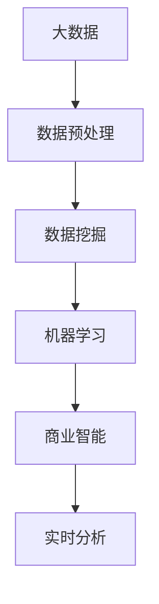

                 

# 信息差的商业优化：大数据如何优化商业运营

## 1. 背景介绍

### 1.1 问题由来
在现代商业运营中，信息差（Information Gap）的存在已经成为影响企业决策和运营效率的重要因素。信息差指的是在市场供需双方信息不对称的情况下，一方拥有更多或更准确的信息，而另一方则缺乏或错误理解这些信息。信息差的存在导致资源错配、市场定价不合理、用户体验差等问题，影响企业盈利和竞争能力。

为了解决信息差问题，企业通常采用传统的调研、问卷调查等方法，但这些方法成本高、响应时间长、数据覆盖面有限，难以全面、及时地反映市场动态。大数据技术的兴起，为信息差的商业优化提供了新的解决方案。

### 1.2 问题核心关键点
大数据通过收集和分析大量、多源的业务数据，能够快速准确地发现信息差，并为企业决策提供依据。通过大数据分析，企业可以及时调整运营策略，优化资源配置，提升用户体验和市场竞争力。

大数据在信息差优化中的应用核心在于：

1. **数据收集与整合**：从多渠道收集数据，并将数据整合到一个统一的平台上，为分析提供数据基础。
2. **数据预处理**：清洗、去重、归一化等操作，保证数据的准确性和一致性。
3. **数据分析与建模**：利用机器学习、数据挖掘等技术，发现数据中的规律和模式。
4. **业务决策支持**：将分析结果转化为具体的业务决策，优化运营流程。

## 2. 核心概念与联系

### 2.1 核心概念概述

为更好地理解大数据在信息差优化中的应用，本节将介绍几个密切相关的核心概念：

- **大数据（Big Data）**：指规模庞大、类型多样、速度快速的数据集。包括结构化数据（如关系型数据库中的数据）、半结构化数据（如JSON、XML等）和非结构化数据（如文本、图片、视频等）。

- **数据预处理（Data Preprocessing）**：指对原始数据进行清洗、转换、归一化等操作，以保证数据的质量和一致性，为后续分析提供良好的基础。

- **数据挖掘（Data Mining）**：从大数据集中发现有价值的信息和知识，包括聚类分析、分类、关联规则挖掘等方法。

- **机器学习（Machine Learning）**：利用数据训练模型，使模型能够自动地从数据中学习规律，用于预测、分类、聚类等任务。

- **商业智能（Business Intelligence）**：通过分析业务数据，支持企业决策和运营，提升企业竞争力和市场响应速度。

- **实时分析（Real-time Analysis）**：在大数据流中实时分析数据，快速响应市场变化，支持动态业务决策。

这些核心概念之间的逻辑关系可以通过以下Mermaid流程图来展示：



这个流程图展示了大数据在信息差优化中的核心概念及其之间的关系：

1. 大数据提供原始数据来源，是整个信息差优化的基础。
2. 数据预处理保证数据的准确性和一致性，为分析提供高质量的数据输入。
3. 数据挖掘从大数据中发现有价值的信息和知识。
4. 机器学习训练模型，用于预测、分类等任务，优化运营决策。
5. 商业智能将分析结果转化为具体的业务决策，提升企业运营效率。
6. 实时分析在数据流中实时分析数据，快速响应市场变化。

## 3. 核心算法原理 & 具体操作步骤
### 3.1 算法原理概述

大数据在信息差优化中的应用，本质上是利用数据分析和机器学习技术，从多源数据中提取有价值的信息，辅助企业做出更准确的业务决策。核心算法原理包括：

- **数据预处理**：清洗、去重、归一化等操作，保证数据的质量和一致性。
- **特征提取**：从原始数据中提取关键特征，用于训练机器学习模型。
- **机器学习**：利用数据训练模型，使模型能够自动地从数据中学习规律，用于预测、分类等任务。
- **商业智能**：将分析结果转化为具体的业务决策，优化运营流程。

### 3.2 算法步骤详解

大数据在信息差优化中的具体操作步骤如下：

**Step 1: 数据收集与整合**
- 从不同的业务系统和渠道（如CRM系统、社交媒体、电商平台等）收集数据。
- 将收集到的数据整合到一个统一的数据平台，如数据湖、数据仓库等。

**Step 2: 数据预处理**
- 清洗数据，去除重复、错误、无关的信息。
- 归一化数据，保证不同来源的数据格式一致。
- 处理缺失值，填补或删除缺失数据。

**Step 3: 特征提取**
- 根据业务需求，从原始数据中提取关键特征。
- 如用户行为特征、商品销售特征、市场环境特征等。

**Step 4: 机器学习建模**
- 利用提取的特征，训练机器学习模型。
- 常用的模型包括线性回归、逻辑回归、决策树、随机森林、神经网络等。

**Step 5: 商业智能分析**
- 将机器学习模型的预测结果转化为具体的业务决策。
- 如调整价格、优化库存、改进产品设计等。

**Step 6: 实时分析**
- 实时监测数据流，发现异常和趋势。
- 根据实时数据调整业务策略，快速响应市场变化。

### 3.3 算法优缺点

大数据在信息差优化中的应用具有以下优点：

- **实时性强**：通过实时分析，企业可以及时发现市场变化，快速调整运营策略。
- **数据量大**：大数据覆盖面广，包含的信息丰富，可以更全面地反映市场动态。
- **精度高**：机器学习模型可以从数据中自动学习规律，提供高精度的预测和分类结果。
- **可扩展性强**：大数据技术支持大规模数据的处理和分析，具有较好的可扩展性。

同时，大数据应用也存在一定的局限性：

- **数据质量要求高**：数据预处理和清洗工作量大，需要较高的数据质量保证。
- **技术门槛高**：大数据分析和机器学习技术复杂，需要专业的技术和人才支持。
- **隐私和合规问题**：大数据应用涉及大量个人隐私数据，需要严格遵守数据隐私法规。

尽管存在这些局限性，但大数据在信息差优化中的应用前景广阔，是现代商业运营的重要工具。未来相关研究的重点在于如何进一步提高大数据分析的效率和精度，降低技术门槛，保障数据隐私和合规。

### 3.4 算法应用领域

大数据在信息差优化中的应用覆盖了众多领域，例如：

- 市场营销：通过分析用户行为和偏好，优化广告投放和营销策略。
- 客户服务：利用客户反馈数据，改进产品和服务质量。
- 供应链管理：通过分析供应链数据，优化库存管理和物流调度。
- 金融风控：利用用户行为和交易数据，评估信用风险和欺诈行为。
- 智能制造：通过生产数据和设备数据，优化生产流程和设备维护。
- 医疗健康：利用患者数据和医疗记录，提升诊断和治疗效果。
- 智慧城市：通过城市数据，优化城市管理和居民服务。

除了上述这些经典应用外，大数据技术在更多场景中的应用还在不断拓展，为各行各业带来了新的业务模式和运营方式。

## 4. 数学模型和公式 & 详细讲解 & 举例说明

### 4.1 数学模型构建

本节将使用数学语言对大数据在信息差优化中的应用进行更加严格的刻画。

记大数据集为 $D=\{(x_i,y_i)\}_{i=1}^N$，其中 $x_i$ 为输入特征向量，$y_i$ 为输出标签（如销量、价格等）。定义模型的损失函数为 $\ell(\theta)$，其中 $\theta$ 为模型参数。在信息差优化中，目标是最小化经验风险：

$$
\mathcal{L}(\theta) = \frac{1}{N}\sum_{i=1}^N \ell(\theta,x_i,y_i)
$$

通过梯度下降等优化算法，不断更新模型参数 $\theta$，最小化损失函数 $\mathcal{L}(\theta)$，从而优化信息差。

### 4.2 公式推导过程

以线性回归模型为例，推导信息差优化的数学公式。

设数据集为 $D=\{(x_i,y_i)\}_{i=1}^N$，其中 $x_i \in \mathbb{R}^d$ 为特征向量，$y_i \in \mathbb{R}$ 为标签。假设模型为线性回归模型：

$$
y_i = \theta_0 + \theta_1 x_{i1} + \theta_2 x_{i2} + \cdots + \theta_d x_{id} + \epsilon_i
$$

其中 $\epsilon_i \sim N(0,\sigma^2)$ 为误差项。

目标是最小化损失函数：

$$
\mathcal{L}(\theta) = \frac{1}{2N}\sum_{i=1}^N (y_i - \hat{y}_i)^2
$$

其中 $\hat{y}_i = \theta_0 + \theta_1 x_{i1} + \theta_2 x_{i2} + \cdots + \theta_d x_{id}$。

对损失函数求导，得：

$$
\frac{\partial \mathcal{L}(\theta)}{\partial \theta_k} = \frac{1}{N}\sum_{i=1}^N (y_i - \hat{y}_i) x_{ik}
$$

利用梯度下降算法，更新模型参数：

$$
\theta_k \leftarrow \theta_k - \eta \frac{\partial \mathcal{L}(\theta)}{\partial \theta_k}
$$

其中 $\eta$ 为学习率。

通过不断迭代，模型参数 $\theta$ 不断更新，最小化损失函数，优化信息差。

### 4.3 案例分析与讲解

以下是一个简单的案例，说明如何使用线性回归模型进行信息差优化。

假设某电商公司的目标是通过预测用户购买行为，优化库存管理和定价策略。

**Step 1: 数据收集与整合**

从电商平台收集用户的购买记录、浏览记录、评价信息等，整合到一个统一的数据平台。

**Step 2: 数据预处理**

清洗数据，去除重复、错误、无关的信息，如重复购买、无效评价等。
归一化数据，保证不同来源的数据格式一致。处理缺失值，填补或删除缺失数据。

**Step 3: 特征提取**

提取用户行为特征，如购买次数、浏览时长、评价评分等。
提取商品销售特征，如销量、平均价格、库存量等。

**Step 4: 机器学习建模**

利用提取的特征，训练线性回归模型。
设定损失函数为均方误差损失：

$$
\mathcal{L}(\theta) = \frac{1}{N}\sum_{i=1}^N (y_i - \hat{y}_i)^2
$$

通过梯度下降算法，不断更新模型参数。

**Step 5: 商业智能分析**

将模型的预测结果转化为具体的业务决策。
如调整库存量，优化商品定价，改进产品设计等。

**Step 6: 实时分析**

实时监测数据流，发现异常和趋势。
根据实时数据调整业务策略，快速响应市场变化。

## 5. 项目实践：代码实例和详细解释说明
### 5.1 开发环境搭建

在进行大数据在信息差优化中的应用实践前，我们需要准备好开发环境。以下是使用Python进行Pandas、NumPy、Scikit-learn等工具库的安装和配置流程：

1. 安装Anaconda：从官网下载并安装Anaconda，用于创建独立的Python环境。

2. 创建并激活虚拟环境：
```bash
conda create -n bigdata-env python=3.8 
conda activate bigdata-env
```

3. 安装Pandas：
```bash
conda install pandas
```

4. 安装NumPy：
```bash
conda install numpy
```

5. 安装Scikit-learn：
```bash
conda install scikit-learn
```

6. 安装TensorFlow：
```bash
conda install tensorflow
```

完成上述步骤后，即可在`bigdata-env`环境中开始大数据在信息差优化中的应用实践。

### 5.2 源代码详细实现

下面我们以线性回归模型为例，给出使用Scikit-learn库进行信息差优化的Python代码实现。

首先，导入必要的库和数据：

```python
import pandas as pd
import numpy as np
from sklearn.linear_model import LinearRegression
from sklearn.model_selection import train_test_split

# 读取数据集
data = pd.read_csv('sales_data.csv')
```

然后，进行数据预处理：

```python
# 清洗数据
data = data.dropna().drop_duplicates()
data = data.drop(columns=['id'])  # 删除无关列

# 数据归一化
from sklearn.preprocessing import StandardScaler
scaler = StandardScaler()
data = scaler.fit_transform(data)
```

接着，进行特征提取和模型训练：

```python
# 特征提取
X = data[:, :-1]
y = data[:, -1]

# 分割数据集
X_train, X_test, y_train, y_test = train_test_split(X, y, test_size=0.2, random_state=42)

# 训练模型
model = LinearRegression()
model.fit(X_train, y_train)
```

最后，进行模型评估和应用：

```python
# 模型评估
y_pred = model.predict(X_test)
print('R^2:', np.corrcoef(y_test, y_pred)[0, 1]**2)

# 商业智能分析
from sklearn.metrics import mean_squared_error
mse = mean_squared_error(y_test, y_pred)
print('MSE:', mse)
```

以上就是使用Scikit-learn库进行线性回归模型训练的完整代码实现。可以看到，Scikit-learn库使得大数据在信息差优化中的模型训练过程变得简洁高效。

### 5.3 代码解读与分析

让我们再详细解读一下关键代码的实现细节：

**数据预处理函数**：
- `dropna`：删除缺失值
- `drop_duplicates`：删除重复行
- `drop`：删除无关列
- `StandardScaler`：数据归一化

**特征提取**：
- `X[:, :-1]`：提取特征列
- `y[:, -1]`：提取标签列

**模型训练**：
- `LinearRegression`：线性回归模型
- `fit`：模型训练

**模型评估**：
- `predict`：模型预测
- `np.corrcoef`：计算相关系数
- `mean_squared_error`：计算均方误差

**商业智能分析**：
- `print`：打印结果
- 利用均方误差评估模型预测准确性

可以看到，Scikit-learn库提供了丰富的工具函数，方便进行大数据在信息差优化中的模型训练和评估。

## 6. 实际应用场景
### 6.1 智能推荐系统

大数据在信息差优化中的应用之一是智能推荐系统。传统的推荐系统往往基于用户的浏览和购买历史进行推荐，难以捕捉用户的隐式偏好。利用大数据分析，推荐系统可以更全面地了解用户的行为特征和兴趣，提供更加个性化和准确的推荐结果。

在实践中，可以利用用户行为数据和商品属性数据，训练推荐模型。通过分析用户的购买记录、浏览记录、评分数据等，提取关键特征，如用户兴趣、商品属性、时间特征等。利用这些特征训练推荐模型，如协同过滤、矩阵分解、深度学习等。将推荐结果与用户行为数据进行对比，不断调整模型参数，优化推荐效果。

### 6.2 智能物流管理

大数据在信息差优化中的应用还包括智能物流管理。传统的物流管理依赖人工调度和经验决策，难以应对动态变化的物流需求。通过大数据分析，可以实时监测物流数据，优化物流路径和调度，提升物流效率和成本控制。

在实践中，可以利用GPS数据、天气数据、运输数据等，训练物流路径优化模型。通过分析运输时间、运输成本、运输距离等关键指标，提取物流特征。利用这些特征训练路径优化模型，如基于深度学习的路径规划算法。将优化后的路径与历史数据进行对比，不断调整模型参数，优化物流路径。

### 6.3 实时营销分析

大数据在信息差优化中的应用还涉及实时营销分析。传统的营销分析依赖定期数据报告和人工分析，难以实时响应市场变化。通过大数据分析，可以实时监测市场数据，优化营销策略，提升营销效果。

在实践中，可以利用社交媒体数据、搜索引擎数据、网站流量数据等，训练市场分析模型。通过分析用户行为数据、广告投放效果、销售数据等，提取市场特征。利用这些特征训练市场分析模型，如基于时间序列分析的市场趋势预测模型。将预测结果与实时数据进行对比，不断调整模型参数，优化营销策略。

### 6.4 未来应用展望

随着大数据技术的发展，未来信息差优化应用将更加广泛和深入。以下是对未来应用的一些展望：

- **实时决策支持**：利用实时数据分析，为企业提供动态决策支持，快速响应市场变化。
- **个性化定制服务**：利用用户行为数据和偏好信息，提供更加个性化的产品和服务。
- **智能城市管理**：利用城市数据，优化城市管理和居民服务，提升城市智能化水平。
- **精准农业管理**：利用农业数据，优化农业生产流程，提高农作物产量和质量。
- **金融风险管理**：利用金融数据，评估信用风险和欺诈行为，提升金融风险控制能力。
- **智能健康管理**：利用医疗数据，提升疾病预测和诊断效果，改善患者健康管理。

## 7. 工具和资源推荐
### 7.1 学习资源推荐

为了帮助开发者系统掌握大数据在信息差优化中的应用，这里推荐一些优质的学习资源：

1. **《Python大数据分析基础》**：通过实例讲解大数据分析的原理和技巧，适合初学者入门。

2. **《大数据分析实战》**：结合实际案例，详细讲解大数据分析的方法和工具，适合有一定基础的开发者。

3. **Kaggle**：数据科学竞赛平台，提供丰富的数据集和算法挑战，适合实战练习。

4. **Coursera**：在线教育平台，提供大数据分析和机器学习的课程，适合系统学习。

5. **Google Cloud BigQuery**：谷歌云的大数据分析工具，支持实时数据处理，适合学习实战。

通过这些学习资源，相信你一定能够快速掌握大数据在信息差优化中的精髓，并用于解决实际的商业问题。

### 7.2 开发工具推荐

高效的开发离不开优秀的工具支持。以下是几款用于大数据在信息差优化中应用开发的常用工具：

1. **Pandas**：Python的数据分析库，支持数据清洗、转换、分析等操作，是数据预处理的利器。

2. **NumPy**：Python的科学计算库，支持高效的数据处理和计算，适合大数据分析任务。

3. **Scikit-learn**：Python的机器学习库，支持多种机器学习算法，适合模型训练和评估。

4. **TensorFlow**：谷歌的开源机器学习库，支持深度学习和大规模数据分析，适合复杂模型训练。

5. **Spark**：Apache开源的分布式计算框架，支持大规模数据处理和分析，适合大数据应用开发。

6. **Kafka**：Apache开源的消息队列系统，支持实时数据流处理，适合实时数据分析。

7. **Hadoop**：Apache开源的大数据处理框架，支持大规模数据存储和计算，适合大数据应用开发。

合理利用这些工具，可以显著提升大数据在信息差优化中的应用开发效率，加快创新迭代的步伐。

### 7.3 相关论文推荐

大数据在信息差优化中的应用源于学界的持续研究。以下是几篇奠基性的相关论文，推荐阅读：

1. **《大数据驱动下的商业智能分析》**：研究大数据在商业智能中的应用，探讨如何利用大数据提升企业决策效率。

2. **《机器学习在信息差优化中的应用》**：总结机器学习在信息差优化中的方法和技巧，探讨如何利用机器学习提高信息差优化的效果。

3. **《大数据在市场营销中的应用》**：探讨大数据在市场营销中的具体应用，如用户行为分析、个性化推荐等。

4. **《实时数据分析在供应链管理中的应用》**：研究实时数据分析在供应链管理中的应用，探讨如何利用实时数据分析优化供应链运营。

5. **《智能推荐系统中的大数据分析》**：探讨智能推荐系统中的大数据分析方法和技术，研究如何利用大数据提高推荐效果。

这些论文代表了大数据在信息差优化中的应用发展脉络，通过学习这些前沿成果，可以帮助研究者把握学科前进方向，激发更多的创新灵感。

## 8. 总结：未来发展趋势与挑战

### 8.1 总结

本文对大数据在信息差优化中的应用进行了全面系统的介绍。首先阐述了大数据在信息差优化中的研究背景和意义，明确了信息差优化的重要性，并详细讲解了信息差优化的核心算法原理和操作步骤。

通过本文的系统梳理，可以看到，大数据在信息差优化中的应用前景广阔，是现代商业运营的重要工具。未来，随着大数据技术的不断演进，信息差优化的应用将更加广泛和深入，带来更多的商业价值。

### 8.2 未来发展趋势

展望未来，大数据在信息差优化中的应用将呈现以下几个发展趋势：

- **数据源多样化**：大数据应用将从单一数据源向多源数据融合转变，提升数据覆盖面和质量。
- **数据处理自动化**：利用自动化的数据清洗和处理技术，提升数据预处理效率和精度。
- **模型训练智能化**：利用机器学习和深度学习技术，优化模型训练过程，提升模型精度和泛化能力。
- **实时分析实时化**：利用实时数据分析技术，支持实时决策和动态调整。
- **模型部署云化**：利用云计算平台，实现模型的快速部署和高效运行。
- **应用场景多元化**：大数据在信息差优化中的应用将从单一行业向更多行业拓展，提升整体应用水平。

以上趋势凸显了大数据在信息差优化中的广阔前景。这些方向的探索发展，必将进一步提升大数据在信息差优化中的效果，为现代商业运营带来更多创新和突破。

### 8.3 面临的挑战

尽管大数据在信息差优化中的应用前景广阔，但在实现过程中仍面临诸多挑战：

- **数据隐私与安全**：大数据应用涉及大量个人隐私数据，如何保护数据隐私和安全性，避免数据泄露和滥用，是需要重点关注的问题。
- **技术门槛高**：大数据和机器学习技术复杂，需要专业的技术和人才支持，如何降低技术门槛，提升应用普及率，是未来需要解决的问题。
- **数据质量要求高**：大数据分析对数据质量要求较高，如何提高数据质量，减少数据噪音，是未来需要优化的方向。
- **数据存储与计算资源限制**：大数据应用需要存储和计算资源的支撑，如何高效利用这些资源，降低成本，是未来需要探索的方向。
- **实时分析的延迟问题**：实时分析需要快速响应，如何提高分析效率，减少延迟，是未来需要优化的问题。

正视这些挑战，积极应对并寻求突破，是大数据在信息差优化中走向成熟的重要条件。

### 8.4 研究展望

面向未来，大数据在信息差优化中的研究需要在以下几个方面寻求新的突破：

- **多源数据融合技术**：研究如何从多源数据中高效提取关键信息，提升数据融合效率和效果。
- **自动化数据清洗技术**：研究如何利用自动化技术，提升数据预处理效率和精度，降低人工干预。
- **智能模型训练技术**：研究如何利用智能算法，优化模型训练过程，提升模型精度和泛化能力。
- **实时分析优化技术**：研究如何优化实时数据分析算法，提高分析效率和精度，减少延迟。
- **云化部署技术**：研究如何利用云计算平台，实现模型的快速部署和高效运行，降低成本。
- **数据隐私保护技术**：研究如何保护数据隐私和安全性，避免数据泄露和滥用，提升数据应用的安全性。

这些研究方向的探索，必将引领大数据在信息差优化中的不断创新和进步，为现代商业运营带来更多的创新和突破。

## 9. 附录：常见问题与解答

**Q1：大数据在信息差优化中是否适用于所有企业？**

A: 大数据在信息差优化中的应用非常广泛，适用于大多数企业。对于数据量较小或数据复杂度较高的企业，可能需要结合其他技术手段，如数据生成、数据合成等，才能有效利用大数据技术。

**Q2：如何提高大数据在信息差优化中的效果？**

A: 提高大数据在信息差优化中的效果，可以从以下几个方面入手：

- **数据质量**：确保数据准确、完整、一致，减少数据噪音。
- **算法选择**：选择适合任务的算法和模型，如协同过滤、深度学习等。
- **特征提取**：提取关键特征，提高模型训练效果。
- **实时分析**：利用实时数据分析，快速响应市场变化，提升决策效率。
- **模型优化**：不断优化模型参数，提高模型精度和泛化能力。
- **多模态融合**：利用多源数据融合技术，提升数据覆盖面和质量。

**Q3：大数据在信息差优化中需要注意哪些问题？**

A: 大数据在信息差优化中需要注意以下问题：

- **数据隐私与安全**：保护用户隐私和数据安全，避免数据泄露和滥用。
- **技术门槛**：提高大数据和机器学习技术的应用普及率，降低技术门槛。
- **数据存储与计算资源**：合理利用存储和计算资源，降低成本。
- **实时分析的延迟**：提高数据分析效率，减少延迟。
- **数据质量要求**：提高数据质量，减少数据噪音。

正视这些问题，积极应对并寻求突破，才能充分发挥大数据在信息差优化中的作用。

---

作者：禅与计算机程序设计艺术 / Zen and the Art of Computer Programming

