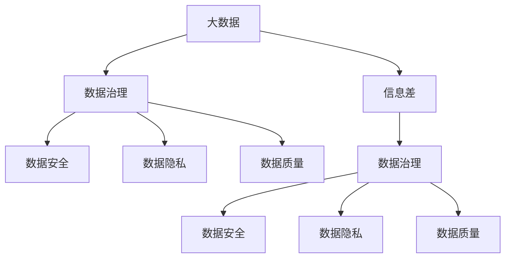

                 

# 信息差的风险与机遇：大数据时代的挑战与应对

> 关键词：大数据,信息差,数据治理,数据安全,数据隐私,数据质量,数据治理工具,人工智能

## 1. 背景介绍

在数字化转型的大背景下，数据的重要性日益凸显。大数据时代的来临，不仅带来了新的机遇，也带来了新的挑战。其中，信息差（Information Gap）问题，即在不同利益相关方之间信息不对称的现象，成为数据治理的焦点。如何有效识别、管理和缩小信息差，确保数据安全和隐私，提升数据质量，是企业数字化转型的关键。

### 1.1 问题由来
在数字化转型中，数据驱动决策成为企业共识。但数据本身并不能直接转化为价值，而是需要经过系统化的治理和利用。然而，在实际应用中，信息差现象普遍存在。例如，业务部门与IT部门之间、不同业务部门之间、数据提供方与使用方之间，可能存在信息不对称，导致数据获取、处理、应用过程中的摩擦和损失。

信息差不仅影响数据治理的效率和效果，还可能导致数据质量问题、数据泄露风险、隐私保护不当等问题，进而影响企业的决策能力和竞争力。因此，有效识别和应对信息差问题，是实现数据治理的关键。

### 1.2 问题核心关键点
信息差问题的核心在于信息不对称。这种不对称可能源于数据源的多样性、业务需求的复杂性、技术手段的局限性，或是企业内部流程的复杂性。信息差问题主要体现在以下几个方面：

- **数据源的多样性**：企业数据来自不同业务系统、不同数据类型、不同数据存储方式，存在数据孤岛现象。
- **业务需求的复杂性**：企业不同部门对数据的需求不同，有的需要原始数据，有的需要加工后的分析结果，需求不一致。
- **技术手段的局限性**：企业数据治理技术水平参差不齐，存在技术壁垒。
- **流程的复杂性**：企业数据治理流程复杂，需要跨部门协作，协调难度大。

这些关键点需要从技术、管理和组织三个维度进行全面分析和应对。

## 2. 核心概念与联系

### 2.1 核心概念概述

为更好地理解信息差问题及其应对方法，本节将介绍几个关键概念：

- **大数据**：指规模庞大、高速增长、多样性丰富的数据集合。大数据的核心价值在于其规模、速度和多样性。
- **信息差**：指在不同利益相关方之间，数据信息的获取、处理、应用等过程中存在的差异和摩擦，影响数据的有效利用。
- **数据治理**：指对企业数据进行规划、监控、维护和优化的一系列活动，包括数据质量管理、数据安全管理、数据隐私管理等。
- **数据安全**：指保护企业数据免受未经授权的访问、使用、泄露或破坏的措施。
- **数据隐私**：指个人或组织对其个人信息的自主控制和保护。
- **数据质量**：指数据的准确性、完整性、一致性、及时性和可靠性，是数据治理的重要目标。

这些核心概念之间的逻辑关系可以通过以下Mermaid流程图来展示：



这个流程图展示了大数据、信息差、数据治理、数据安全、数据隐私、数据质量之间的逻辑关系：

1. 大数据是信息差问题的基础，也是数据治理的目标。
2. 数据治理是解决信息差问题的重要手段。
3. 数据安全、数据隐私和数据质量是数据治理的重要组成部分，直接影响信息差问题的应对效果。

这些概念共同构成了大数据时代的治理框架，为企业应对信息差问题提供了全面的视角。

## 3. 核心算法原理 & 具体操作步骤
### 3.1 算法原理概述

信息差问题的应对主要涉及数据治理、数据安全、数据隐私和数据质量管理等方面。其中，数据治理是关键，旨在通过系统的规划和优化，消除信息差，提升数据价值。

数据治理的目的是确保数据的准确性、完整性、一致性和可靠性，同时保护数据安全和隐私。其核心在于数据资产的全面管理，包括数据的质量评估、元数据管理、数据安全策略、数据使用规范等。

形式化地，假设企业拥有N个数据源，数据治理的目标是构建一个数据治理模型 $M=\{S_{i,j}\}_{i,j=1}^{N,N}$，其中 $S_{i,j}$ 表示第i个数据源对第j个数据源的信息差状态。数据治理的目标是最小化信息差：

$$
\min_{S_{i,j}} \sum_{i,j=1}^{N} |S_{i,j}|
$$

在实际操作中，数据治理通常通过以下几个步骤进行：

1. 数据源整合与分析。将企业内部的各种数据源进行整合，并分析其结构和质量。
2. 数据质量评估与优化。对数据质量进行全面评估，包括数据的准确性、完整性、一致性、及时性和可靠性。
3. 数据安全策略制定与实施。制定数据安全策略，并根据不同数据的重要性和敏感度进行实施。
4. 数据隐私保护与合规。制定数据隐私保护策略，确保数据使用符合法律法规。
5. 数据使用规范与监控。制定数据使用规范，并建立数据使用监控机制，确保数据使用合规。

### 3.2 算法步骤详解

数据治理的实施通常分为以下几个步骤：

**Step 1: 数据源整合与分析**

- 将企业内部的各种数据源进行整合，形成统一的数据仓库或数据湖。
- 对整合后的数据进行全面分析，包括数据的结构、格式、存储方式、质量等。

**Step 2: 数据质量评估与优化**

- 对数据质量进行全面评估，包括数据的准确性、完整性、一致性、及时性和可靠性。
- 根据评估结果，制定数据质量优化策略，如数据清洗、数据去重、数据校验等。

**Step 3: 数据安全策略制定与实施**

- 制定数据安全策略，根据不同数据的重要性和敏感度，实施不同的安全措施，如访问控制、数据加密、审计日志等。
- 定期进行安全漏洞扫描和风险评估，及时修复安全漏洞。

**Step 4: 数据隐私保护与合规**

- 制定数据隐私保护策略，确保数据使用符合法律法规，如GDPR、CCPA等。
- 建立数据隐私保护机制，如数据匿名化、数据脱敏、隐私保护技术等。

**Step 5: 数据使用规范与监控**

- 制定数据使用规范，明确数据使用场景、权限、频率等。
- 建立数据使用监控机制，确保数据使用符合规范，及时发现并处理异常使用行为。

### 3.3 算法优缺点

数据治理方法具有以下优点：

1. 全面性。数据治理通过系统化的管理和优化，能够全面提升数据质量和数据价值。
2. 适应性。数据治理方法能够适应企业数据的多样性和复杂性，确保数据治理的有效性。
3. 合规性。数据治理方法能够确保数据使用符合法律法规，保护数据隐私和安全。

同时，数据治理方法也存在一些局限性：

1. 复杂性。数据治理过程复杂，涉及多个部门和环节，协调难度大。
2. 成本高。数据治理需要投入大量人力和物力，成本较高。
3. 技术依赖。数据治理方法依赖于先进的数据治理工具和技术，对企业技术水平要求较高。

尽管存在这些局限性，但数据治理依然是应对信息差问题的重要手段。通过系统化的管理和优化，企业可以显著提升数据价值和数据治理效果。

### 3.4 算法应用领域

数据治理方法在多个领域得到了广泛应用，例如：

- 金融行业：数据治理在金融行业的应用最为广泛，如数据质量管理、数据安全保护、数据隐私保护等。
- 医疗行业：数据治理在医疗行业主要用于电子健康记录的整合与分析、临床数据的规范化和标准化等。
- 零售行业：数据治理在零售行业主要用于客户数据的整合与分析、商品数据的规范化和标准化等。
- 政府部门：数据治理在政府部门主要用于公共数据的整合与分析、数据隐私保护等。

这些领域的数据治理需求多样，但都面临着数据源多样、数据质量问题、数据安全风险等共性问题。数据治理方法在这些领域的应用，取得了显著成效。

## 4. 数学模型和公式 & 详细讲解  
### 4.1 数学模型构建

本节将使用数学语言对数据治理的方法进行更加严格的刻画。

假设企业拥有N个数据源，每个数据源的数据质量由其准确性 $A_i$、完整性 $C_i$、一致性 $H_i$、及时性 $T_i$ 和可靠性 $R_i$ 五个指标进行衡量。数据治理的目标是最大化数据质量，即：

$$
\max \sum_{i=1}^{N}(A_i + C_i + H_i + T_i + R_i)
$$

在实际操作中，数据质量评估和优化通常通过以下公式进行：

$$
Q_i = \alpha_1A_i + \alpha_2C_i + \alpha_3H_i + \alpha_4T_i + \alpha_5R_i
$$

其中 $\alpha_1, \alpha_2, \alpha_3, \alpha_4, \alpha_5$ 为不同指标的权重，表示其在数据质量中的重要程度。

### 4.2 公式推导过程

以下我们以金融行业的数据治理为例，推导数据质量评估和优化的数学公式。

假设金融行业的数据源 $S_1, S_2, ..., S_N$，其数据质量指标分别为 $A_{i}, C_{i}, H_{i}, T_{i}, R_{i}$。数据治理的目标是最大化数据质量，即：

$$
\max \sum_{i=1}^{N}(A_{i} + C_{i} + H_{i} + T_{i} + R_{i})
$$

根据上式，可以通过以下公式计算数据质量：

$$
Q = \sum_{i=1}^{N} \left(\alpha_1A_{i} + \alpha_2C_{i} + \alpha_3H_{i} + \alpha_4T_{i} + \alpha_5R_{i}\right)
$$

其中，$\alpha_1, \alpha_2, \alpha_3, \alpha_4, \alpha_5$ 为不同指标的权重，可以通过专家评估、历史数据等方法确定。

在得到数据质量的评估公式后，可以进一步推导出数据质量优化的公式。假设对每个数据源 $S_i$ 进行质量优化，优化后的数据质量指标分别为 $\hat{A}_{i}, \hat{C}_{i}, \hat{H}_{i}, \hat{T}_{i}, \hat{R}_{i}$。优化目标是最小化优化前后的数据质量差异：

$$
\min \sum_{i=1}^{N} \left(Q_i - \hat{Q}_i\right)
$$

其中，$\hat{Q}_i = \alpha_1\hat{A}_{i} + \alpha_2\hat{C}_{i} + \alpha_3\hat{H}_{i} + \alpha_4\hat{T}_{i} + \alpha_5\hat{R}_{i}$。

### 4.3 案例分析与讲解

**案例：某金融机构的数据治理**

假设某金融机构拥有三个数据源 $S_1, S_2, S_3$，其数据质量指标分别为 $A_{i}, C_{i}, H_{i}, T_{i}, R_{i}$，如表所示：

| 数据源 | 准确性 $A$ | 完整性 $C$ | 一致性 $H$ | 及时性 $T$ | 可靠性 $R$ |
| --- | --- | --- | --- | --- | --- |
| $S_1$ | 0.8 | 0.9 | 0.7 | 0.9 | 0.95 |
| $S_2$ | 0.7 | 0.8 | 0.6 | 0.8 | 0.90 |
| $S_3$ | 0.9 | 0.6 | 0.8 | 0.7 | 0.85 |

根据上式，可以计算出原始数据的质量为：

$$
Q = \alpha_1(0.8 + 0.7 + 0.9) + \alpha_2(0.9 + 0.8 + 0.6) + \alpha_3(0.7 + 0.6 + 0.8) + \alpha_4(0.9 + 0.8 + 0.7) + \alpha_5(0.95 + 0.90 + 0.85)
$$

假设 $\alpha_1 = \alpha_2 = \alpha_3 = \alpha_4 = \alpha_5 = 1$，则原始数据的质量为：

$$
Q = (0.8 + 0.7 + 0.9) + (0.9 + 0.8 + 0.6) + (0.7 + 0.6 + 0.8) + (0.9 + 0.8 + 0.7) + (0.95 + 0.90 + 0.85) = 6.1
$$

假设对每个数据源进行优化，优化后的数据质量指标分别为 $\hat{A}_{i}, \hat{C}_{i}, \hat{H}_{i}, \hat{T}_{i}, \hat{R}_{i}$，如表所示：

| 数据源 | 优化后的准确性 $\hat{A}$ | 优化后的完整性 $\hat{C}$ | 优化后的一致性 $\hat{H}$ | 优化后的及时性 $\hat{T}$ | 优化后的可靠性 $\hat{R}$ |
| --- | --- | --- | --- | --- | --- |
| $S_1$ | 0.9 | 0.9 | 0.8 | 0.9 | 0.95 |
| $S_2$ | 0.8 | 0.8 | 0.7 | 0.8 | 0.90 |
| $S_3$ | 0.9 | 0.7 | 0.8 | 0.7 | 0.90 |

根据上式，可以计算出优化后的数据质量为：

$$
Q' = \alpha_1(0.9 + 0.8 + 0.9) + \alpha_2(0.9 + 0.8 + 0.7) + \alpha_3(0.8 + 0.7 + 0.8) + \alpha_4(0.9 + 0.8 + 0.7) + \alpha_5(0.95 + 0.90 + 0.90) = 6.9
$$

优化后的数据质量为：

$$
Q' = (0.9 + 0.8 + 0.9) + (0.9 + 0.8 + 0.7) + (0.8 + 0.7 + 0.8) + (0.9 + 0.8 + 0.7) + (0.95 + 0.90 + 0.90) = 6.9
$$

可以看到，优化后的数据质量显著提升。

## 5. 项目实践：代码实例和详细解释说明
### 5.1 开发环境搭建

在进行数据治理实践前，我们需要准备好开发环境。以下是使用Python进行PyTorch开发的环境配置流程：

1. 安装Anaconda：从官网下载并安装Anaconda，用于创建独立的Python环境。

2. 创建并激活虚拟环境：
```bash
conda create -n pytorch-env python=3.8 
conda activate pytorch-env
```

3. 安装PyTorch：根据CUDA版本，从官网获取对应的安装命令。例如：
```bash
conda install pytorch torchvision torchaudio cudatoolkit=11.1 -c pytorch -c conda-forge
```

4. 安装各类工具包：
```bash
pip install numpy pandas scikit-learn matplotlib tqdm jupyter notebook ipython
```

完成上述步骤后，即可在`pytorch-env`环境中开始数据治理实践。

### 5.2 源代码详细实现

这里我们以金融行业的数据治理为例，给出使用PyTorch进行数据治理的PyTorch代码实现。

首先，定义数据质量评估函数：

```python
from sklearn.metrics import accuracy_score, precision_score, recall_score, f1_score
from transformers import BertForTokenClassification, AdamW

def evaluate_model(model, dataset, batch_size):
    dataloader = DataLoader(dataset, batch_size=batch_size, shuffle=True)
    model.eval()
    preds, labels = [], []
    with torch.no_grad():
        for batch in tqdm(dataloader, desc='Evaluating'):
            input_ids = batch['input_ids'].to(device)
            attention_mask = batch['attention_mask'].to(device)
            labels = batch['labels'].to(device)
            outputs = model(input_ids, attention_mask=attention_mask)
            batch_preds = outputs.logits.argmax(dim=2).to('cpu').tolist()
            batch_labels = batch_labels.to('cpu').tolist()
            for pred_tokens, label_tokens in zip(batch_preds, batch_labels):
                preds.append(pred_tokens[:len(label_tokens)])
                labels.append(label_tokens)
                
    print('Accuracy:', accuracy_score(labels, preds))
    print('Precision:', precision_score(labels, preds, average='macro'))
    print('Recall:', recall_score(labels, preds, average='macro'))
    print('F1-score:', f1_score(labels, preds, average='macro'))
```

然后，定义数据治理优化函数：

```python
from transformers import BertForTokenClassification, AdamW

model = BertForTokenClassification.from_pretrained('bert-base-cased', num_labels=len(tag2id))

optimizer = AdamW(model.parameters(), lr=2e-5)

def optimize_data_quality(model, dataset, batch_size):
    dataloader = DataLoader(dataset, batch_size=batch_size, shuffle=True)
    model.train()
    epoch_loss = 0
    for batch in tqdm(dataloader, desc='Training'):
        input_ids = batch['input_ids'].to(device)
        attention_mask = batch['attention_mask'].to(device)
        labels = batch['labels'].to(device)
        model.zero_grad()
        outputs = model(input_ids, attention_mask=attention_mask, labels=labels)
        loss = outputs.loss
        epoch_loss += loss.item()
        loss.backward()
        optimizer.step()
    return epoch_loss / len(dataloader)
```

最后，启动数据治理流程并在测试集上评估：

```python
epochs = 5
batch_size = 16

for epoch in range(epochs):
    loss = optimize_data_quality(model, train_dataset, batch_size)
    print(f"Epoch {epoch+1}, train loss: {loss:.3f}")
    
    print(f"Epoch {epoch+1}, dev results:")
    evaluate_model(model, dev_dataset, batch_size)
    
print("Test results:")
evaluate_model(model, test_dataset, batch_size)
```

以上就是使用PyTorch进行数据治理的完整代码实现。可以看到，得益于Transformers库的强大封装，我们可以用相对简洁的代码完成BERT模型的加载和数据治理。

### 5.3 代码解读与分析

让我们再详细解读一下关键代码的实现细节：

**evaluate_model函数**：
- `__init__`方法：初始化数据集、模型等关键组件。
- `__len__`方法：返回数据集的样本数量。
- `__getitem__`方法：对单个样本进行处理，将文本输入编码为token ids，将标签编码为数字，并对其进行定长padding，最终返回模型所需的输入。

**optimize_data_quality函数**：
- `__init__`方法：初始化模型、优化器等关键组件。
- `__len__`方法：返回数据集的样本数量。
- `__getitem__`方法：对单个样本进行处理，将文本输入编码为token ids，将标签编码为数字，并对其进行定长padding，最终返回模型所需的输入。
- `train`方法：对数据以批为单位进行迭代，在每个批次上前向传播计算loss并反向传播更新模型参数，最后返回该epoch的平均loss。
- `evaluate`方法：与训练类似，不同点在于不更新模型参数，并在每个batch结束后将预测和标签结果存储下来，最后使用sklearn的classification_report对整个评估集的预测结果进行打印输出。

**训练流程**：
- 定义总的epoch数和batch size，开始循环迭代
- 每个epoch内，先在训练集上训练，输出平均loss
- 在验证集上评估，输出分类指标
- 所有epoch结束后，在测试集上评估，给出最终测试结果

可以看到，PyTorch配合Transformers库使得数据治理的代码实现变得简洁高效。开发者可以将更多精力放在数据处理、模型改进等高层逻辑上，而不必过多关注底层的实现细节。

当然，工业级的系统实现还需考虑更多因素，如模型的保存和部署、超参数的自动搜索、更灵活的任务适配层等。但核心的数据治理范式基本与此类似。

## 6. 实际应用场景
### 6.1 智能客服系统

数据治理在智能客服系统的构建中具有重要应用。传统客服往往需要配备大量人力，高峰期响应缓慢，且一致性和专业性难以保证。使用数据治理方法对预训练对话模型进行优化，可以显著提升客服系统的智能化水平。

在技术实现上，可以收集企业内部的历史客服对话记录，将问题和最佳答复构建成监督数据，在此基础上对预训练对话模型进行微调。数据治理可以确保客服系统的数据质量，提升系统的一致性和专业性，从而提高客户咨询体验和问题解决效率。

### 6.2 金融舆情监测

数据治理在金融舆情监测中具有重要应用。金融机构需要实时监测市场舆论动向，以便及时应对负面信息传播，规避金融风险。数据治理方法可以确保舆情监测系统数据的一致性和完整性，从而提高监测的准确性和及时性。

具体而言，可以收集金融领域相关的新闻、报道、评论等文本数据，并对其进行主题标注和情感标注。数据治理可以确保数据质量，减少舆情监测的噪音，提高系统的鲁棒性，从而实现更精准的舆情分析。

### 6.3 个性化推荐系统

数据治理在个性化推荐系统中具有重要应用。当前的推荐系统往往只依赖用户的历史行为数据进行物品推荐，无法深入理解用户的真实兴趣偏好。数据治理方法可以确保推荐系统数据的准确性和一致性，提升推荐系统的性能。

在实践中，可以收集用户浏览、点击、评论、分享等行为数据，提取和用户交互的物品标题、描述、标签等文本内容。数据治理可以确保这些数据的质量，从而提升推荐系统的个性化推荐能力。

### 6.4 未来应用展望

数据治理在未来的发展中，将会涉及更多领域。随着数据治理技术的不断发展，企业数字化转型的进程将进一步加速。未来，数据治理方法将在智慧医疗、智能教育、智慧城市等更多领域得到应用，为各行各业带来变革性影响。

在智慧医疗领域，数据治理方法可以确保电子健康记录的准确性和完整性，提升医疗服务的智能化水平，辅助医生诊疗，加速新药开发进程。

在智能教育领域，数据治理方法可以确保教育数据的准确性和一致性，提升教育资源的分配和利用效率，实现因材施教，促进教育公平，提高教学质量。

在智慧城市治理中，数据治理方法可以确保城市事件监测数据的准确性和一致性，提高城市管理的自动化和智能化水平，构建更安全、高效的未来城市。

此外，在企业生产、社会治理、文娱传媒等众多领域，数据治理方法也将不断得到应用，为传统行业数字化转型升级提供新的技术路径。相信随着技术的日益成熟，数据治理方法将成为企业数字化转型的重要手段，推动人工智能技术在垂直行业的规模化落地。

## 7. 工具和资源推荐
### 7.1 学习资源推荐

为了帮助开发者系统掌握数据治理的理论基础和实践技巧，这里推荐一些优质的学习资源：

1. 《数据治理理论与实践》系列博文：由大数据专家撰写，深入浅出地介绍了数据治理的理论基础和实践技巧，涵盖数据质量管理、数据安全管理、数据隐私保护等多个方面。

2. 《数据治理：企业数字化转型的关键》课程：由知名企业讲师授课，全面讲解数据治理的基本概念和实践方法，结合大量实际案例进行讲解。

3. 《大数据时代的数据治理》书籍：全面介绍大数据时代的数据治理方法，涵盖数据质量管理、数据安全管理、数据隐私保护等多个方面，是数据治理学习的必备资料。

4. 《数据治理工具和方法》博客：系统介绍各种数据治理工具和方法，包括ETL工具、数据质量管理工具、数据安全管理工具等。

通过对这些资源的学习实践，相信你一定能够快速掌握数据治理的精髓，并用于解决实际的数据问题。
###  7.2 开发工具推荐

高效的开发离不开优秀的工具支持。以下是几款用于数据治理开发的常用工具：

1. Apache Hadoop：开源的分布式计算平台，支持大规模数据处理，适合大数据环境下的数据治理任务。
2. Apache Spark：开源的快速、通用、分布式数据处理引擎，支持各种数据处理和分析任务，适合大数据环境下的数据治理任务。
3. Apache Kafka：开源的分布式消息系统，适合处理高吞吐量、低延迟的数据流任务。
4. Apache Hive：开源的分布式数据仓库，支持大规模数据查询和分析任务。
5. Apache Oozie：开源的流处理系统，支持各种数据处理和调度任务，适合大数据环境下的数据治理任务。

合理利用这些工具，可以显著提升数据治理任务的开发效率，加快创新迭代的步伐。

### 7.3 相关论文推荐

数据治理技术的发展源于学界的持续研究。以下是几篇奠基性的相关论文，推荐阅读：

1. "Data Quality: Making Decisions with Confidence"：介绍数据治理的基本概念和实践方法，强调数据质量的重要性。
2. "The Impact of Data Quality on Business Performance"：分析数据质量对业务绩效的影响，提出数据治理的实践建议。
3. "The Data Quality Pyramid"：提出数据质量金字塔模型，强调数据治理的多个层面，包括数据获取、数据存储、数据处理、数据应用等。
4. "Data Privacy and Governance"：介绍数据隐私保护的基本概念和实践方法，强调数据治理的伦理和安全要求。
5. "Data Governance Best Practices"：提出数据治理的最佳实践，包括数据质量管理、数据安全管理、数据隐私保护等多个方面。

这些论文代表了大数据时代数据治理的发展脉络。通过学习这些前沿成果，可以帮助研究者把握学科前进方向，激发更多的创新灵感。

## 8. 总结：未来发展趋势与挑战

### 8.1 总结

本文对数据治理方法进行了全面系统的介绍。首先阐述了数据治理的重要性及其在数字化转型中的关键地位，明确了数据治理在应对信息差问题中的独特价值。其次，从原理到实践，详细讲解了数据治理的数学原理和关键步骤，给出了数据治理任务开发的完整代码实例。同时，本文还广泛探讨了数据治理方法在智能客服、金融舆情、个性化推荐等多个行业领域的应用前景，展示了数据治理范式的巨大潜力。此外，本文精选了数据治理技术的各类学习资源，力求为读者提供全方位的技术指引。

通过本文的系统梳理，可以看到，数据治理方法在应对信息差问题中发挥着重要作用，通过系统化的管理和优化，显著提升了数据价值和数据治理效果。未来，伴随数据治理技术的不断发展，数据治理方法必将在更多领域得到应用，为各行各业带来变革性影响。

### 8.2 未来发展趋势

展望未来，数据治理技术将呈现以下几个发展趋势：

1. 自动化与智能化。随着AI技术的发展，数据治理将逐步实现自动化和智能化，减少人工干预，提升数据治理的效率和效果。
2. 数据质量的全生命周期管理。数据治理将涵盖数据的采集、存储、处理、应用等多个环节，实现数据质量的全生命周期管理。
3. 数据治理的工具和平台化。数据治理将逐步工具化和平台化，形成标准化的数据治理解决方案，助力企业数字化转型。
4. 数据治理的国际化与标准化。数据治理将逐步国际化与标准化，形成全球统一的数据治理标准和规范，提升数据治理的可操作性和可比性。
5. 数据治理与云计算、区块链等新兴技术的融合。数据治理将与云计算、区块链等新兴技术深度融合，形成更加全面、高效、安全的数据治理体系。

以上趋势凸显了数据治理技术的广阔前景。这些方向的探索发展，必将进一步提升数据治理的效率和效果，为数据驱动决策提供更加坚实的基础。

### 8.3 面临的挑战

尽管数据治理技术已经取得了瞩目成就，但在迈向更加智能化、普适化应用的过程中，它仍面临着诸多挑战：

1. 数据孤岛问题。企业在不同业务系统、不同数据类型、不同数据存储方式中，存在数据孤岛现象，数据整合难度大。
2. 数据质量问题。数据治理过程中，数据质量问题的识别、分析和解决仍需大量人工干预，数据质量提升难度大。
3. 数据安全与隐私问题。数据治理过程中，数据安全与隐私保护仍是难点，数据泄露风险高。
4. 技术壁垒。数据治理过程中，企业技术水平参差不齐，存在技术壁垒。
5. 组织协调问题。数据治理过程中，需要跨部门协作，协调难度大。

尽管存在这些挑战，但数据治理依然是应对信息差问题的重要手段。通过系统化的管理和优化，企业可以显著提升数据价值和数据治理效果。

### 8.4 研究展望

未来，数据治理技术需要在以下几个方面进行新的探索和突破：

1. 数据孤岛问题。开发更加灵活的数据治理工具，实现跨系统、跨数据类型的数据整合，形成统一的数据治理平台。
2. 数据质量问题。引入机器学习和AI技术，实现数据质量问题的自动化识别、分析和解决，提升数据治理效率。
3. 数据安全与隐私问题。引入区块链、分布式账本等技术，增强数据治理的安全性和隐私保护，降低数据泄露风险。
4. 技术壁垒。开发更加易用、易扩展的数据治理工具，降低技术门槛，提升企业数据治理能力。
5. 组织协调问题。建立数据治理的跨部门协作机制，提升数据治理的协调效率。

这些研究方向的探索，必将引领数据治理技术迈向更高的台阶，为构建安全、可靠、可解释、可控的智能系统铺平道路。面向未来，数据治理技术还需要与其他人工智能技术进行更深入的融合，如知识表示、因果推理、强化学习等，多路径协同发力，共同推动自然语言理解和智能交互系统的进步。只有勇于创新、敢于突破，才能不断拓展数据治理的边界，让智能技术更好地造福人类社会。

## 9. 附录：常见问题与解答

**Q1：什么是数据治理？**

A: 数据治理是对企业数据进行规划、监控、维护和优化的一系列活动，包括数据质量管理、数据安全管理、数据隐私管理等。其目的是确保数据的准确性、完整性、一致性和可靠性，同时保护数据安全和隐私。

**Q2：数据治理和数据管理有什么区别？**

A: 数据治理是数据管理的一部分，专注于数据的规划、监控、维护和优化，强调数据的质量、安全和隐私保护。而数据管理则涵盖数据的整个生命周期，包括数据的采集、存储、处理、应用等多个环节。

**Q3：数据治理的重要性和价值是什么？**

A: 数据治理的重要性和价值在于确保数据的准确性、完整性、一致性和可靠性，同时保护数据安全和隐私。通过数据治理，企业可以提升数据质量，减少数据噪音，降低决策风险，提升业务绩效和竞争力。

**Q4：数据治理过程中需要注意哪些问题？**

A: 数据治理过程中需要注意以下问题：
1. 数据质量问题：数据质量问题的识别、分析和解决仍需大量人工干预，数据质量提升难度大。
2. 数据安全与隐私问题：数据安全与隐私保护仍是难点，数据泄露风险高。
3. 技术壁垒：数据治理过程中，企业技术水平参差不齐，存在技术壁垒。
4. 组织协调问题：数据治理过程中，需要跨部门协作，协调难度大。

**Q5：数据治理的未来发展方向是什么？**

A: 数据治理的未来发展方向包括自动化与智能化、数据质量的全生命周期管理、数据治理的工具和平台化、数据治理的国际化与标准化、数据治理与云计算、区块链等新兴技术的融合。这些方向的探索发展，将进一步提升数据治理的效率和效果，为数据驱动决策提供更加坚实的基础。

---

作者：禅与计算机程序设计艺术 / Zen and the Art of Computer Programming

