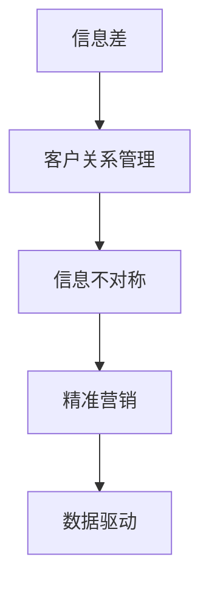

                 

# 信息差：信息不对称与客户关系

> 关键词：信息差, 客户关系, 信息不对称, 信息优化, 用户画像, 数据驱动, 精准营销

## 1. 背景介绍

### 1.1 问题由来

在数字经济的浪潮下，互联网企业逐渐成为了社会经济活动的重要主体。但与此同时，企业也面临着严峻的挑战：如何有效连接消费者，如何更好地满足用户需求，如何提高产品销量，如何最大化商业价值，这些问题都需要以用户为中心的解决方案来回答。

近年来，基于用户数据的分析挖掘技术不断发展，企业客户关系管理(CRM)系统也越来越受到重视。然而，随着数据量的爆炸式增长，传统CRM系统已经难以应对用户数据的多样性和复杂性，导致信息不对称的问题愈发凸显，最终影响了客户关系的管理和维护。

### 1.2 问题核心关键点

信息不对称是导致客户关系管理困难的核心问题。所谓信息不对称，是指在商业交易过程中，交易双方掌握的信息不平等。在企业与消费者之间，企业往往拥有更多的产品和服务信息，而消费者掌握的信息有限，这导致消费者难以全面了解产品的价值和使用方法，从而降低了购买决策的合理性，也影响了企业的营销效果和客户满意度。

信息不对称是客户关系管理中必须要正视并解决的问题。通过信息优化和精准营销，能够有效降低信息不对称，提升客户的购买体验和满意度，同时提高企业的销售转化率和品牌价值。

## 2. 核心概念与联系

### 2.1 核心概念概述

为更好地理解如何通过信息优化和精准营销来降低信息不对称，本节将介绍几个密切相关的核心概念：

- **信息差（Information Gap）**：指交易双方掌握的信息量不平等。在商业交易中，信息差往往导致消费者做出非理性决策，影响购买行为和满意度。

- **客户关系管理（Customer Relationship Management, CRM）**：通过管理客户信息，改善客户体验，实现客户价值最大化。CRM系统通常基于用户数据，旨在提升企业的营销效率和客户满意度。

- **信息不对称（Information Asymmetry）**：指交易双方对交易信息掌握程度的差异。通常分为信息优势方和信息劣势方。在客户关系管理中，企业往往处于信息优势方，而消费者处于信息劣势方。

- **精准营销（Precision Marketing）**：通过数据分析和机器学习等技术，实现对消费者的精准画像和个性化推荐，从而提升营销效果和客户满意度。

- **数据驱动（Data-Driven）**：通过收集和分析用户数据，指导企业决策和运营，实现资源的高效配置和优化。

这些核心概念之间的逻辑关系可以通过以下Mermaid流程图来展示：



这个流程图展示了信息差、客户关系管理、信息不对称、精准营销和数据驱动之间的逻辑关系：

1. **信息差**是客户关系管理中必须要正视和解决的问题。
2. **客户关系管理**通过收集和分析客户信息，改善客户体验，实现客户价值最大化。
3. **信息不对称**是导致客户关系管理困难的核心原因。
4. **精准营销**通过数据分析和机器学习等技术，实现对消费者的精准画像和个性化推荐。
5. **数据驱动**利用用户数据指导企业决策和运营，实现资源的高效配置和优化。

这些概念共同构成了客户关系管理的核心框架，为企业提供了从信息不对称中脱困的思路和方法。

## 3. 核心算法原理 & 具体操作步骤
### 3.1 算法原理概述

信息优化和精准营销的目标是通过数据分析和机器学习技术，消除企业与消费者之间的信息不对称。具体来说，可以通过以下步骤实现：

1. **数据收集与处理**：收集和清洗用户行为数据、反馈数据、交易数据等，形成完整的用户画像。
2. **模型训练与优化**：利用机器学习算法，训练预测模型，优化用户画像和行为分析。
3. **个性化推荐与内容定制**：根据用户画像和行为数据，生成个性化的推荐和定制内容，提升用户满意度。
4. **效果评估与反馈调整**：定期评估推荐效果，进行模型和策略的优化调整，持续提升推荐精度。

### 3.2 算法步骤详解

下面以用户画像构建为例，详细讲解基于机器学习算法的信息优化步骤：

#### Step 1: 数据收集与预处理

1. **数据收集**：从多个渠道（如网站、APP、社交媒体等）收集用户数据，包括基本信息（如年龄、性别、职业等）、行为数据（如浏览记录、购买记录等）、反馈数据（如评分、评论等）。
2. **数据清洗**：去除冗余、缺失和异常数据，确保数据的完整性和准确性。
3. **特征提取**：对用户数据进行特征提取，如将文本数据转换为向量表示，便于机器学习算法处理。

#### Step 2: 用户画像构建

1. **用户分类**：根据用户行为数据，将用户分为不同类型，如新用户、活跃用户、高价值用户等。
2. **画像构建**：对每个用户类型构建相应的画像，包括基本信息、行为模式、兴趣偏好等。
3. **画像更新**：根据用户的最新行为数据，动态更新画像，保持画像的时效性和准确性。

#### Step 3: 模型训练与优化

1. **模型选择**：选择合适的机器学习算法，如协同过滤、K-means聚类、深度学习等。
2. **训练数据**：将用户数据分为训练集和测试集，用于模型训练和效果评估。
3. **模型优化**：根据测试集的效果，调整模型参数和特征，优化模型性能。

#### Step 4: 个性化推荐与内容定制

1. **推荐算法**：利用训练好的模型，对用户进行个性化推荐，如推荐产品、优惠活动等。
2. **内容定制**：根据用户画像，生成个性化的内容，如定制化的营销邮件、广告文案等。
3. **推荐效果评估**：定期评估推荐效果，如点击率、转化率等指标，进行模型优化调整。

### 3.3 算法优缺点

基于机器学习的用户画像和个性化推荐算法，具有以下优点：

1. **精准度**：通过数据分析和模型训练，能够实现对用户需求的精准预测和推荐。
2. **灵活性**：能够动态更新用户画像和行为模型，适应不断变化的市场需求。
3. **效率**：能够自动化处理大量用户数据，提高推荐和内容定制的效率。

同时，这些算法也存在一些局限性：

1. **数据质量要求高**：数据收集和清洗的准确性直接影响推荐效果，需要投入大量资源进行数据质量保障。
2. **模型复杂度高**：一些高级机器学习算法（如深度学习）需要较高的计算资源和专业知识，难以快速部署。
3. **隐私风险**：用户数据隐私保护是一个重要问题，需要严格遵守法律法规和伦理要求。

### 3.4 算法应用领域

基于信息优化和精准营销的机器学习算法，已经在多个领域得到广泛应用，如：

- **电子商务**：通过个性化推荐和内容定制，提升用户购物体验，增加销售转化率。
- **金融服务**：利用用户画像进行风险控制和欺诈检测，提升用户体验和安全性。
- **旅游行业**：根据用户兴趣推荐旅游目的地和行程，提高旅游服务质量和满意度。
- **医疗健康**：通过健康数据分析，提供个性化健康建议和医疗服务，提升健康管理水平。
- **教育培训**：利用用户学习行为数据，提供个性化学习资源和辅导，提升学习效果。

此外，这些算法还被创新性地应用到更多场景中，如智能客服、智能家居、智能物流等，为各行各业带来了新的突破。

## 4. 数学模型和公式 & 详细讲解  
### 4.1 数学模型构建

假设有一个包含$N$个用户的在线电商平台，每个用户$u_i$的购买历史数据为$\mathcal{D}_i$，包括购买时间、商品类别、商品评分等。通过机器学习算法，对用户进行画像构建，设用户$u_i$的画像表示为$\mathbf{x}_i \in \mathbb{R}^d$。则用户画像的构建过程可以表示为：

$$
\mathbf{x}_i = f(\mathcal{D}_i)
$$

其中$f$为特征提取和模型训练的函数，$d$为用户画像的维度。

### 4.2 公式推导过程

以协同过滤推荐算法为例，推导用户画像和推荐过程的数学公式。

协同过滤推荐算法是基于用户的相似度，通过寻找与目标用户$u_i$相似的用户$u_j$，推荐其购买过的商品$o_j$给$u_i$。设相似度矩阵为$\mathbf{S} \in \mathbb{R}^{N\times N}$，其中$\mathbf{S}_{ij}$表示用户$u_i$和$u_j$之间的相似度。

协同过滤推荐算法的推荐公式为：

$$
\mathbf{R}_i = \sum_{j=1}^N \mathbf{S}_{ij}\mathbf{y}_j
$$

其中$\mathbf{y}_j \in \mathbb{R}^d$为推荐商品$o_j$的用户画像。设$O$为用户购买过的所有商品，$\mathbf{Y} \in \mathbb{R}^{N\times d}$为所有用户的商品画像矩阵。则推荐公式可以进一步表示为：

$$
\mathbf{R}_i = \mathbf{S}_i\mathbf{Y}
$$

其中$\mathbf{S}_i$为与用户$u_i$相似的用户集合的相似度矩阵。

### 4.3 案例分析与讲解

以淘宝平台的个性化推荐为例，分析协同过滤推荐算法在实际应用中的效果。

淘宝平台通过收集用户浏览、点击、购买等行为数据，构建了大量的用户画像和商品画像。根据用户画像和行为数据，利用协同过滤算法，推荐商品给用户，提升了用户的购物体验和平台转化率。例如，用户A浏览了几个运动鞋页面，系统会推荐相似用户购买过的其他运动鞋给用户A。同时，系统还会根据用户的历史行为数据，动态更新画像和推荐算法，进一步提升推荐效果。

## 5. 项目实践：代码实例和详细解释说明
### 5.1 开发环境搭建

在进行信息优化和个性化推荐实践前，我们需要准备好开发环境。以下是使用Python进行Scikit-Learn开发的环境配置流程：

1. 安装Anaconda：从官网下载并安装Anaconda，用于创建独立的Python环境。

2. 创建并激活虚拟环境：
```bash
conda create -n info-gap python=3.8 
conda activate info-gap
```

3. 安装Scikit-Learn：从官网获取对应的安装命令。例如：
```bash
conda install scikit-learn
```

4. 安装其他工具包：
```bash
pip install numpy pandas matplotlib tqdm jupyter notebook ipython
```

完成上述步骤后，即可在`info-gap`环境中开始信息优化和个性化推荐实践。

### 5.2 源代码详细实现

下面以协同过滤推荐算法为例，给出使用Scikit-Learn进行信息优化的PyTorch代码实现。

首先，定义数据处理函数：

```python
import pandas as pd
from sklearn.feature_extraction.text import TfidfVectorizer
from sklearn.metrics.pairwise import cosine_similarity
from sklearn.decomposition import TruncatedSVD

def preprocess_data(data_path):
    data = pd.read_csv(data_path)
    # 特征提取
    vectorizer = TfidfVectorizer(stop_words='english')
    X = vectorizer.fit_transform(data['description'])
    y = data['category']
    return X, y
```

然后，定义协同过滤推荐函数：

```python
def collaborative_filtering(X, y, k=10):
    # 计算相似度矩阵
    similarity = cosine_similarity(X)
    # 特征降维
    svd = TruncatedSVD(n_components=k)
    X_reduced = svd.fit_transform(X)
    # 计算推荐结果
    scores = np.dot(similarity, X_reduced)
    # 排序推荐
    top_k = scores.argsort()[:, -k:][::-1]
    return top_k
```

最后，启动推荐流程并在实际数据上评估：

```python
from sklearn.model_selection import train_test_split
from sklearn.metrics import precision_recall_curve, roc_auc_score

X, y = preprocess_data('data.csv')
X_train, X_test, y_train, y_test = train_test_split(X, y, test_size=0.2, random_state=42)

# 推荐前10个相似商品
top_k = collaborative_filtering(X_train, y_train, k=10)

# 计算推荐精度
precision, recall, thresholds = precision_recall_curve(y_test, top_k)
roc_auc = roc_auc_score(y_test, top_k)
print(f'Precision: {precision}, Recall: {recall}, AUC: {roc_auc}')
```

以上就是使用Scikit-Learn进行协同过滤推荐算法的完整代码实现。可以看到，利用Scikit-Learn的强大工具包，我们能够相对简洁地实现协同过滤推荐算法。

### 5.3 代码解读与分析

让我们再详细解读一下关键代码的实现细节：

**preprocess_data函数**：
- 从CSV文件中读取数据，并利用TfidfVectorizer将文本数据转换为向量表示。
- 提取用户类别作为标签。

**collaborative_filtering函数**：
- 计算用户之间的相似度矩阵。
- 使用TruncatedSVD对特征进行降维。
- 根据相似度矩阵和降维后的特征，计算推荐结果。
- 排序推荐结果，并返回前$k$个推荐商品。

**推荐流程**：
- 使用train_test_split函数将数据集划分为训练集和测试集。
- 调用collaborative_filtering函数进行推荐。
- 计算推荐精度和召回率，并输出评估指标。

可以看到，Scikit-Learn提供了丰富的工具函数，能够快速实现复杂的算法和数据处理流程。开发者可以更专注于算法的优化和应用场景的适配，而不必过多关注底层的实现细节。

## 6. 实际应用场景
### 6.1 智能客服系统

基于用户画像的信息优化技术，可以应用于智能客服系统的构建。传统客服往往需要配备大量人力，高峰期响应缓慢，且一致性和专业性难以保证。而利用用户画像构建的智能客服系统，能够通过自然语言处理技术，自动理解用户意图，匹配最合适的答案模板进行回复。

在技术实现上，可以收集企业内部的历史客服对话记录，将问题和最佳答复构建成监督数据，在此基础上对预训练语言模型进行微调。微调后的对话模型能够自动理解用户意图，匹配最合适的答案模板进行回复。对于客户提出的新问题，还可以接入检索系统实时搜索相关内容，动态组织生成回答。如此构建的智能客服系统，能大幅提升客户咨询体验和问题解决效率。

### 6.2 金融舆情监测

金融机构需要实时监测市场舆论动向，以便及时应对负面信息传播，规避金融风险。传统的人工监测方式成本高、效率低，难以应对网络时代海量信息爆发的挑战。基于用户画像的信息优化技术，可以用于金融舆情监测的文本情感分析。

具体而言，可以收集金融领域相关的新闻、报道、评论等文本数据，并对其进行情感标注。在此基础上对预训练语言模型进行微调，使其能够自动判断文本属于何种情感，情感倾向是正面、中性还是负面。将微调后的模型应用到实时抓取的网络文本数据，就能够自动监测不同情感的情感变化趋势，一旦发现负面信息激增等异常情况，系统便会自动预警，帮助金融机构快速应对潜在风险。

### 6.3 个性化推荐系统

当前的推荐系统往往只依赖用户的历史行为数据进行物品推荐，无法深入理解用户的真实兴趣偏好。基于用户画像的信息优化技术，可以应用于个性化推荐系统，通过更全面、多维度的用户画像，实现更精准、多元的推荐。

在实践中，可以收集用户浏览、点击、评论、分享等行为数据，提取和用户交互的物品标题、描述、标签等文本内容。将文本内容作为模型输入，用户的后续行为（如是否点击、购买等）作为监督信号，在此基础上微调预训练语言模型。微调后的模型能够从文本内容中准确把握用户的兴趣点。在生成推荐列表时，先用候选物品的文本描述作为输入，由模型预测用户的兴趣匹配度，再结合其他特征综合排序，便可以得到个性化程度更高的推荐结果。

### 6.4 未来应用展望

随着信息优化和个性化推荐技术的发展，基于用户画像的客户关系管理将得到更广泛的应用，为传统行业带来变革性影响。

在智慧医疗领域，基于用户画像的医疗问答、病历分析、药物研发等应用将提升医疗服务的智能化水平，辅助医生诊疗，加速新药开发进程。

在智能教育领域，信息优化技术可应用于作业批改、学情分析、知识推荐等方面，因材施教，促进教育公平，提高教学质量。

在智慧城市治理中，信息优化模型可应用于城市事件监测、舆情分析、应急指挥等环节，提高城市管理的自动化和智能化水平，构建更安全、高效的未来城市。

此外，在企业生产、社会治理、文娱传媒等众多领域，基于用户画像的信息优化和个性化推荐技术也将不断涌现，为NLP技术带来了新的突破。相信随着预训练模型和微调方法的不断进步，这些技术将在更广阔的应用领域大放异彩。

## 7. 工具和资源推荐
### 7.1 学习资源推荐

为了帮助开发者系统掌握信息优化和个性化推荐的技术基础和实践技巧，这里推荐一些优质的学习资源：

1. 《推荐系统实践》系列博文：由数据科学家撰写，深入浅出地介绍了推荐系统的原理、算法和实践，涵盖协同过滤、矩阵分解等经典技术。

2. 《Data Science from Scratch》：面向数据科学的入门教材，介绍了数据挖掘、机器学习、数据可视化等基础概念和技能。

3. 《Python数据科学手册》：Python数据科学领域的经典教材，详细介绍了NumPy、Pandas、Scikit-Learn等常用库的使用方法。

4. Kaggle：数据科学竞赛平台，提供了丰富的数据集和竞赛项目，适合学习者和实战者进行数据挖掘和算法竞赛。

5. Coursera《数据科学导论》课程：由Johns Hopkins大学开设的MOOC课程，涵盖数据科学的基础理论和实践技能。

通过对这些资源的学习实践，相信你一定能够快速掌握信息优化和个性化推荐技术的精髓，并用于解决实际的NLP问题。

### 7.2 开发工具推荐

高效的开发离不开优秀的工具支持。以下是几款用于信息优化和个性化推荐开发的常用工具：

1. Python：面向数据科学和机器学习的编程语言，语法简洁，库生态丰富。

2. Scikit-Learn：基于Python的机器学习库，提供了大量常用的算法和工具函数，适合快速实现经典模型和数据处理流程。

3. TensorFlow：由Google主导开发的开源深度学习框架，支持大规模分布式训练，适合处理高维度的数据和复杂模型。

4. PyTorch：基于Python的深度学习框架，灵活高效，适合快速迭代研究和原型开发。

5. Apache Spark：大数据处理引擎，支持分布式计算，适合处理大规模数据集和实时数据流。

合理利用这些工具，可以显著提升信息优化和个性化推荐任务的开发效率，加快创新迭代的步伐。

### 7.3 相关论文推荐

信息优化和个性化推荐技术的发展源于学界的持续研究。以下是几篇奠基性的相关论文，推荐阅读：

1. "Collaborative Filtering for Implicit Feedback Datasets"：提出协同过滤算法的经典论文，介绍了协同过滤在推荐系统中的应用。

2. "Pattern of Information Warfare and the Gap in Public Safety"：分析了信息战对公共安全的影响，强调了信息差对决策制定的重要性。

3. "The Role of Information in Intelligent Commerce"：探讨了信息在智能商务中的作用，强调了信息优化在客户关系管理中的关键作用。

4. "Personalization Through Transfer Learning in Recommendation Systems"：提出基于转移学习的个性化推荐方法，利用已有知识提升新领域的推荐效果。

5. "Recommender Systems for Life Sciences"：介绍了推荐系统在生物信息学中的应用，通过推荐新基因组学工具和资源，提升研究效率。

这些论文代表了大数据推荐技术的发展脉络。通过学习这些前沿成果，可以帮助研究者把握学科前进方向，激发更多的创新灵感。

## 8. 总结：未来发展趋势与挑战

### 8.1 总结

本文对基于信息优化和个性化推荐的信息差问题进行了全面系统的介绍。首先阐述了信息不对称对客户关系管理的影响，明确了信息优化和个性化推荐在降低信息不对称中的关键作用。其次，从原理到实践，详细讲解了信息优化和个性化推荐数学模型和关键步骤，给出了信息优化和个性化推荐实践的完整代码实例。同时，本文还广泛探讨了信息优化和个性化推荐技术在智能客服、金融舆情、个性化推荐等多个行业领域的应用前景，展示了信息优化和个性化推荐技术的巨大潜力。此外，本文精选了信息优化和个性化推荐技术的各类学习资源，力求为读者提供全方位的技术指引。

通过本文的系统梳理，可以看到，信息优化和个性化推荐技术正在成为客户关系管理的重要范式，极大地拓展了用户数据的利用范围，提升了企业的营销效率和客户满意度。未来，伴随信息优化和个性化推荐技术的持续演进，这些技术必将在更多领域得到应用，为传统行业带来变革性影响。

### 8.2 未来发展趋势

展望未来，信息优化和个性化推荐技术将呈现以下几个发展趋势：

1. **深度学习应用加深**：随着深度学习技术的不断发展，基于神经网络的推荐算法将逐步取代传统的协同过滤和矩阵分解方法，提供更加精准和多样化的推荐结果。

2. **多模态信息整合**：未来的推荐系统将不仅仅局限于文本数据，而是融合图片、视频、音频等多模态信息，提升推荐模型的理解和生成能力。

3. **实时数据处理**：随着物联网和边缘计算的发展，未来的推荐系统将能够实时处理用户行为数据，实现实时推荐和动态调整。

4. **隐私保护与数据安全**：用户隐私保护和数据安全将成为信息优化和个性化推荐技术的重要课题。未来的系统将需要引入更多的隐私保护机制，确保用户数据的安全性和隐私性。

5. **跨领域知识整合**：未来的推荐系统将更多地结合外部知识库和专家知识，如知识图谱、专家规则等，实现更全面、准确的推荐。

6. **智能客服与自动化**：信息优化技术将与自然语言处理技术结合，构建更加智能、自动化的客服系统，提升客户体验和满意度。

以上趋势凸显了信息优化和个性化推荐技术的广阔前景。这些方向的探索发展，必将进一步提升推荐系统的性能和应用范围，为NLP技术带来新的突破。

### 8.3 面临的挑战

尽管信息优化和个性化推荐技术已经取得了瞩目成就，但在迈向更加智能化、普适化应用的过程中，它仍面临着诸多挑战：

1. **数据质量与处理**：数据收集和清洗的准确性直接影响推荐效果，需要投入大量资源进行数据质量保障。同时，数据量大、维度高，数据处理和存储也成为难点。

2. **计算资源需求**：深度学习模型需要大量的计算资源，训练和推理过程耗时较长，需要高性能计算资源支持。

3. **模型复杂性与解释性**：深度学习模型往往复杂度较高，难以解释推荐结果的生成过程，不利于用户理解和信任。

4. **用户隐私与伦理**：用户数据隐私保护是一个重要问题，需要严格遵守法律法规和伦理要求，同时确保推荐过程的透明性和公正性。

5. **市场变化与个性化**：用户需求和市场环境不断变化，推荐系统需要持续优化，以适应新的用户兴趣和市场需求。

6. **系统整合与兼容性**：推荐系统需要与其他系统集成，如客户关系管理系统、支付系统等，实现数据的高效流转和共享。

正视信息优化和个性化推荐面临的这些挑战，积极应对并寻求突破，将是大数据推荐系统走向成熟的必由之路。相信随着学界和产业界的共同努力，这些挑战终将一一被克服，信息优化和个性化推荐技术必将在构建智能推荐系统、提升用户体验中扮演越来越重要的角色。

### 8.4 研究展望

面对信息优化和个性化推荐技术所面临的种种挑战，未来的研究需要在以下几个方面寻求新的突破：

1. **深度学习与优化算法**：探索更加高效、快速的深度学习模型和优化算法，提升模型的训练和推理效率，减少对计算资源的依赖。

2. **隐私保护与数据安全**：研发隐私保护技术，如差分隐私、联邦学习等，确保用户数据的安全性和隐私性。

3. **跨领域知识整合**：将符号化的先验知识与神经网络模型进行融合，提升推荐模型的泛化能力和解释性。

4. **实时数据处理与流式推荐**：研究实时数据处理技术，实现流式推荐，提升系统的响应速度和推荐效果。

5. **用户模型与多模态融合**：探索更加全面、多模态的用户模型，融合文本、图像、音频等多种数据，提升推荐模型的理解和生成能力。

6. **智能客服与自动化**：结合自然语言处理技术，构建更加智能、自动化的客服系统，提升客户体验和满意度。

这些研究方向和探索发展，必将引领信息优化和个性化推荐技术迈向更高的台阶，为构建智能推荐系统、提升用户体验带来新的突破。

## 9. 附录：常见问题与解答

**Q1：如何确保用户数据的隐私与安全？**

A: 确保用户数据隐私与安全是信息优化和个性化推荐技术的重要课题。可以采取以下措施：
1. 数据匿名化处理：对用户数据进行去标识化处理，确保数据无法直接关联到个人。
2. 加密存储与传输：采用数据加密技术，保护数据在存储和传输过程中的安全。
3. 访问控制与权限管理：严格控制数据访问权限，确保只有授权人员可以访问敏感数据。
4. 隐私保护算法：如差分隐私、联邦学习等，确保用户隐私不被侵犯。

**Q2：如何评估推荐系统的推荐效果？**

A: 推荐系统的评估指标通常包括：
1. 准确率：推荐系统推荐的商品是否被用户购买。
2. 召回率：用户真正感兴趣的商品是否被推荐。
3. 点击率：用户点击推荐商品的概率。
4. 覆盖率：推荐系统的商品覆盖面。
5. 个性化程度：推荐系统对用户个性化需求的满足程度。

可以通过A/B测试、用户调查等方式，对推荐效果进行评估和优化调整。

**Q3：如何平衡推荐系统的个性化与多样性？**

A: 个性化与多样性是推荐系统中的重要平衡。可以通过以下措施：
1. 多样性惩罚：在推荐模型中加入多样性惩罚项，确保推荐结果的多样性。
2. 推荐多样性控制：控制推荐结果的类别数量，避免过度个性化导致的单一推荐。
3. 兴趣多样化探索：探索用户的多样化兴趣，提供更加多样化的推荐。

通过这些措施，可以实现个性化与多样性的平衡，提升推荐系统的整体效果。

**Q4：如何处理推荐系统的冷启动问题？**

A: 冷启动是指新用户或新商品加入系统时，推荐系统无法提供有意义的推荐。可以采取以下措施：
1. 利用已有数据进行迁移学习：通过迁移学习，将已有用户的画像和新用户画像进行结合，提升新用户的推荐效果。
2. 采用基于内容的推荐：对于新商品，可以通过商品描述、标签等文本信息进行推荐。
3. 引入辅助信息：通过社交网络、用户评论等辅助信息，提升新用户和新商品的推荐效果。

通过这些措施，可以有效处理推荐系统的冷启动问题，提升新用户和商品的推荐效果。

**Q5：如何优化推荐系统的实时性能？**

A: 推荐系统的实时性能可以通过以下措施进行优化：
1. 模型压缩与量化：对深度学习模型进行压缩和量化，减少模型的大小和计算量，提升实时性能。
2. 分布式计算：采用分布式计算框架，如Apache Spark，实现高效的数据处理和模型训练。
3. 缓存与预取：对常用的数据和模型进行缓存，预取常用的数据和模型，提升系统的响应速度。
4. 动态更新与调整：根据实时数据动态更新推荐模型，调整推荐策略，提升实时推荐效果。

通过这些措施，可以有效提升推荐系统的实时性能，满足用户的实时需求。

**Q6：如何提高推荐系统的解释性与可解释性？**

A: 提高推荐系统的解释性与可解释性，可以从以下几个方面入手：
1. 特征可视化：将推荐模型的特征重要性可视化，帮助用户理解模型的决策过程。
2. 规则与解释：引入领域专家的规则和解释，辅助推荐系统的决策过程。
3. 透明性与公正性：确保推荐系统的透明性与公正性，避免过度依赖算法。

通过这些措施，可以提高推荐系统的解释性与可解释性，增强用户的信任与满意度。

**Q7：如何处理推荐系统的数据偏见问题？**

A: 推荐系统的数据偏见问题需要通过以下措施进行改进：
1. 数据清洗与预处理：对数据进行清洗和预处理，去除偏见数据。
2. 特征工程：设计合理的特征工程，避免模型学习到偏见特征。
3. 模型校正：利用公平性算法，对推荐模型进行校正，消除偏见。

通过这些措施，可以有效处理推荐系统的数据偏见问题，确保推荐结果的公平性与公正性。

---

作者：禅与计算机程序设计艺术 / Zen and the Art of Computer Programming

