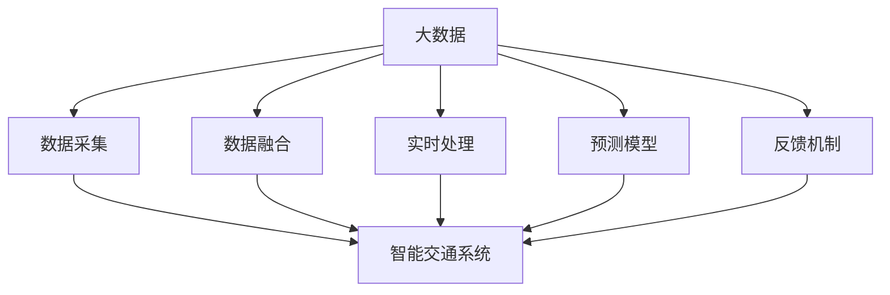

                 

## 1. 背景介绍

### 1.1 问题由来
随着城市化的加速和交通工具的普及，智能交通系统（Intelligent Transportation Systems, ITS）正日益成为城市管理的重要工具。传统交通系统依赖于人工调控和实时反馈，难以应对日益复杂的交通环境。大数据和人工智能技术的融合，为智能交通系统提供了全新的解决方案，通过实时数据分析和预测，实现交通流的智能调控，显著提升城市交通效率和安全性。

信息差（Information Gap）是智能交通领域的一个重要概念，指的是信息的不对称现象，即交通管理者和用户之间、交通参与者之间的信息不对称。这些信息差导致了交通管理的低效、交通事故频发和环境污染等问题。

大数据技术的引入，为信息差的缓解提供了新的手段。通过收集和分析交通流量、环境监测、车辆位置等数据，智能交通系统可以实现对信息差的精准监控和预测，从而提高交通管理效率，降低事故率，优化道路使用。

### 1.2 问题核心关键点
信息差在大数据应用中的核心关键点包括：

1. 数据收集与处理：确保数据的质量和及时性，是大数据分析的基础。
2. 信息融合与推理：将分散的数据进行有效融合，并通过数据驱动的模型进行推理预测。
3. 反馈与优化：根据预测结果和实际反馈，不断调整交通管理策略，实现系统的自适应优化。
4. 人机交互：实现信息的高效传递和用户体验的优化，提升系统的易用性。
5. 跨领域融合：与其他城市管理系统的融合，如气象、安防、医疗等，实现综合治理。

## 2. 核心概念与联系

### 2.1 核心概念概述

为更好地理解大数据在智能交通中的应用，本节将介绍几个密切相关的核心概念：

- 大数据（Big Data）：指体量巨大、类型多样、速度快且来源广泛的数据集合，其特点包括规模大、复杂性强、更新速度快。
- 智能交通系统（ITS）：通过信息采集、传输和处理，实现交通流的智能化管理。
- 信息差（Information Gap）：指交通管理者和用户之间、交通参与者之间的信息不对称现象。
- 数据融合（Data Fusion）：将来自不同来源、不同格式的数据进行合并、集成，以获得更全面的信息。
- 实时处理（Real-time Processing）：在数据到达系统时，即时进行分析和处理，以应对突发事件。
- 预测模型（Prediction Model）：使用历史数据和机器学习技术，预测未来的交通流量、环境状况等。
- 反馈机制（Feedback Mechanism）：系统根据预测结果和实际反馈，调整优化策略，实现系统的自适应学习。

这些核心概念之间的逻辑关系可以通过以下Mermaid流程图来展示：



这个流程图展示了大数据在智能交通系统中的核心概念及其之间的关系：

1. 大数据通过数据采集得到各种信息，输入到智能交通系统。
2. 数据融合将分散的数据进行整合，提升系统的准确性。
3. 实时处理快速分析数据，及时应对突发事件。
4. 预测模型基于历史数据进行推断，预测未来情况。
5. 反馈机制根据预测结果和实际反馈调整策略，实现系统的自我优化。

## 3. 核心算法原理 & 具体操作步骤
### 3.1 算法原理概述

大数据在智能交通系统中的应用，基于数据驱动和算法驱动相结合的决策模式。其核心算法原理可以概括为以下几个步骤：

1. 数据采集：通过各种传感器和设备，收集交通流量、环境监测、车辆位置等数据。
2. 数据清洗与预处理：对采集到的数据进行去噪、归一化、降维等处理，提升数据质量。
3. 数据融合与集成：将多源异构的数据进行有效融合，获得全面的交通信息。
4. 实时处理与预测：使用分布式计算和机器学习算法，实时处理数据，并进行交通流量预测。
5. 反馈与优化：根据预测结果和实际反馈，动态调整交通管理策略，实现系统优化。

### 3.2 算法步骤详解

以下我们将详细讲解智能交通系统中的主要算法步骤：

**Step 1: 数据采集与清洗**
- 使用传感器和设备采集交通流量、环境监测、车辆位置等数据。
- 对数据进行预处理，去除异常值、缺失值和噪音。
- 对数据进行归一化和降维处理，以提升后续分析的效率和准确性。

**Step 2: 数据融合与集成**
- 使用数据融合技术，将来自不同来源的数据进行有效整合。
- 采用时间序列分析、空间关系建模等方法，提升数据融合的准确性。
- 利用大数据平台，实现分布式数据存储和处理，提升系统的扩展性。

**Step 3: 实时处理与预测**
- 使用实时计算框架（如Apache Storm、Apache Flink等）对数据进行实时处理。
- 基于历史数据和机器学习算法，构建预测模型，进行交通流量、环境状况等预测。
- 使用增量学习技术，不断更新预测模型，以适应数据分布的变化。

**Step 4: 反馈与优化**
- 根据预测结果和实际反馈，动态调整交通管理策略。
- 使用强化学习等算法，实现系统自适应优化。
- 引入用户反馈机制，提升系统的用户体验。

**Step 5: 人机交互与可视化**
- 使用可视化工具（如Tableau、Power BI等）对系统数据进行展示。
- 设计友好的用户界面，提供信息查询、决策支持等功能。
- 实现信息的高效传递和实时更新，提升系统的易用性。

### 3.3 算法优缺点

大数据在智能交通系统中的应用具有以下优点：

1. 实时高效：通过实时处理和预测，系统能够快速响应突发事件，优化交通管理。
2. 全面准确：通过多源数据的融合与集成，系统能够获得更全面的信息，提升决策准确性。
3. 动态优化：通过反馈与优化机制，系统能够不断调整策略，实现自适应优化。
4. 用户友好：通过人机交互和可视化，系统能够提供直观的信息展示和决策支持，提升用户体验。

同时，该方法也存在一定的局限性：

1. 数据质量依赖：系统性能依赖于数据质量，数据采集、清洗和预处理的准确性直接影响系统效果。
2. 资源消耗大：大数据系统需要强大的计算和存储资源，初期投资较大。
3. 隐私风险：系统可能涉及大量的个人隐私信息，需要严格的数据保护措施。
4. 算法复杂性：实时处理和预测模型需要复杂的算法，开发和维护难度较大。
5. 模型可解释性不足：部分算法模型的决策过程难以解释，难以进行调试和优化。

尽管存在这些局限性，但就目前而言，大数据在智能交通系统中的应用是主流的解决方案，能够显著提升交通管理效率和安全性。未来相关研究的方向在于如何进一步提升数据质量和实时性，降低资源消耗和隐私风险，同时兼顾模型的可解释性和易用性。

### 3.4 算法应用领域

大数据在智能交通系统中的应用领域广泛，涵盖了以下几个方面：

- 交通流量监测与预测：实时监测交通流量，预测高峰期和拥堵路段，优化交通信号灯控制。
- 环境监测与治理：监测空气质量、噪音、温度等环境指标，实现环境综合治理。
- 车辆位置跟踪与调度：通过GPS等设备，实时跟踪车辆位置，进行路径优化和调度。
- 事故预警与应急响应：利用传感器和大数据分析，预测事故发生的可能性，提前进行应急响应。
- 用户行为分析与个性化服务：分析用户出行行为，提供个性化的出行建议和服务。

此外，大数据在智能交通系统中的应用还包括交通信号控制、公共交通管理、智能停车等诸多领域，为城市交通的智能化管理提供了有力支撑。

## 4. 数学模型和公式 & 详细讲解 & 举例说明

### 4.1 数学模型构建

在大数据驱动的智能交通系统中，数学模型的构建和应用至关重要。以下将详细介绍基于交通流量数据的预测模型构建和应用。

假设交通流量数据为 $\{y_t\}_{t=1}^T$，其中 $y_t$ 表示在第 $t$ 时刻的交通流量。构建预测模型 $M$，使得模型能够根据历史数据 $y_{1:T-1}$ 预测未来某一时刻的流量 $y_{T}$。数学上，该预测任务可以表示为回归问题：

$$
y_{T} = M(y_{1:T-1})
$$

其中 $M$ 为预测模型，可以是线性回归、支持向量机、深度学习等。

### 4.2 公式推导过程

以线性回归模型为例，推导其预测公式：

假设 $y_t = \eta_t + \epsilon_t$，其中 $\eta_t$ 为真实流量，$\epsilon_t$ 为随机误差。根据最小二乘法，建立回归模型：

$$
\hat{\eta}_t = \sum_{i=1}^{t-1} \alpha_i y_{i} - \beta_t
$$

其中 $\alpha_i$ 为权重，$\beta_t$ 为截距。通过最小二乘法求解 $\alpha$ 和 $\beta$，得到回归系数 $\theta$：

$$
\theta = \arg\min_{\alpha,\beta} \sum_{t=1}^{T-1} (y_t - \hat{\eta}_t)^2
$$

代入上述公式，得：

$$
y_{T} = \sum_{i=1}^{T-1} \alpha_i y_{i} - \beta_{T-1}
$$

### 4.3 案例分析与讲解

以智能交通系统中的交通流量预测为例，下面通过一个具体案例来讲解数学模型的构建和应用。

假设某城市的主要干道流量数据如下：

| 时刻 | 流量 |
|------|-----|
| 1    | 2000 |
| 2    | 2500 |
| 3    | 3000 |
| 4    | 3500 |
| 5    | 4000 |

假设模型为线性回归模型 $y_t = \alpha y_{t-1} + \beta$，求解 $\alpha$ 和 $\beta$：

- 最小二乘法求解 $\alpha$ 和 $\beta$：

$$
\alpha = \frac{\sum_{i=1}^{T-1} (y_i - \hat{y}_i)^2}{\sum_{i=1}^{T-1} (y_i - \bar{y})^2}
$$

$$
\beta = \bar{y} - \alpha \bar{y}
$$

其中 $\bar{y}$ 为样本均值。

- 计算 $\alpha$ 和 $\beta$：

$$
\alpha = \frac{3000 - 2500}{3000 - 2000} = 0.5
$$

$$
\beta = \frac{2500 + 3000 + 3500 + 4000}{4} - 0.5 \times \frac{2500 + 3000 + 3500 + 4000}{4} = 300
$$

因此，预测模型为：

$$
y_t = 0.5 y_{t-1} + 300
$$

当 $t=6$ 时，根据模型预测 $y_6 = 0.5 \times 4000 + 300 = 3900$，实际流量为 3800，误差为 100。

通过上述案例可以看出，基于数学模型对交通流量进行预测，可以提前掌握交通变化趋势，优化交通管理策略。

## 5. 项目实践：代码实例和详细解释说明

### 5.1 开发环境搭建

在进行智能交通系统的大数据分析和应用开发前，我们需要准备好开发环境。以下是使用Python进行Scikit-learn和TensorFlow开发的环境配置流程：

1. 安装Anaconda：从官网下载并安装Anaconda，用于创建独立的Python环境。

2. 创建并激活虚拟环境：
```bash
conda create -n bigdata-env python=3.8 
conda activate bigdata-env
```

3. 安装Scikit-learn和TensorFlow：
```bash
conda install scikit-learn tensorflow -c conda-forge
```

4. 安装各类工具包：
```bash
pip install numpy pandas matplotlib scikit-learn tensorflow
```

完成上述步骤后，即可在`bigdata-env`环境中开始项目实践。

### 5.2 源代码详细实现

下面我们以交通流量预测为例，给出使用Scikit-learn和TensorFlow进行数据分析和预测的Python代码实现。

首先，定义数据处理函数：

```python
import pandas as pd
import numpy as np

def load_data(file_path):
    data = pd.read_csv(file_path)
    X = data.drop(['time', 'traffic'], axis=1).values
    y = data['traffic'].values
    return X, y
```

然后，定义预测模型：

```python
from sklearn.linear_model import LinearRegression

class TrafficPredictor:
    def __init__(self, alpha=0.5, beta=300):
        self.alpha = alpha
        self.beta = beta
        
    def fit(self, X, y):
        self.alpha = np.linalg.lstsq(X, y, rcond=None)[0][0]
        self.beta = y.mean() - self.alpha * y.mean()
        
    def predict(self, X):
        return self.alpha * X + self.beta
```

接着，训练模型并评估性能：

```python
X, y = load_data('traffic.csv')
predictor = TrafficPredictor()
predictor.fit(X, y)
y_pred = predictor.predict(X)
print('R^2:', np.corrcoef(y_pred, y)[0, 1]**2)
```

最后，在新的数据上测试模型的泛化能力：

```python
X_test, y_test = load_data('traffic_test.csv')
predictor_test = TrafficPredictor()
predictor_test.fit(X_test, y_test)
y_pred_test = predictor_test.predict(X_test)
print('R^2:', np.corrcoef(y_pred_test, y_test)[0, 1]**2)
```

以上就是使用Scikit-learn和TensorFlow对交通流量进行预测的完整代码实现。可以看到，Scikit-learn提供了一系列的机器学习算法，适合进行数据分析和模型训练，而TensorFlow则支持大规模的分布式计算和模型优化，可以处理海量数据和复杂模型。

### 5.3 代码解读与分析

让我们再详细解读一下关键代码的实现细节：

**load_data函数**：
- 定义了数据加载函数，从CSV文件中读取流量数据，并将特征和标签分离。

**TrafficPredictor类**：
- 定义了交通流量预测类，包含模型参数和训练方法。
- 使用最小二乘法求解模型参数。
- 提供预测方法，根据训练好的模型对新的流量数据进行预测。

**训练和评估函数**：
- 使用Scikit-learn的LinearRegression算法进行模型训练，计算模型的R^2值。
- 在测试集上重新训练模型，评估模型的泛化能力。

可以看出，Scikit-learn和TensorFlow为智能交通系统中的大数据应用提供了强大的数据处理和模型构建工具，开发者可以通过简单的代码实现，快速进行数据分析和模型训练。

## 6. 实际应用场景

### 6.1 智能交通信号控制

智能交通信号控制是智能交通系统的核心应用之一。传统信号灯控制依赖于人工调控，难以适应交通流量的变化。通过大数据分析，智能交通系统可以实现对交通流量的实时监测和预测，动态调整信号灯的配时，优化交通流。

具体而言，智能交通系统可以通过摄像头和传感器获取交通流量数据，使用机器学习算法建立预测模型，实时预测每个路口的交通流量。根据预测结果，系统可以动态调整信号灯的配时，确保交通流的顺畅和高效。

### 6.2 环境监测与治理

智能交通系统可以与其他环境监测系统集成，实现对城市环境的综合治理。通过大数据分析，系统可以实时监测空气质量、噪音、温度等环境指标，预测环境污染趋势，提前采取应急措施。

例如，系统可以通过传感器监测道路上的空气污染指数，结合历史数据和机器学习模型，预测未来污染指数的变化。根据预测结果，系统可以自动调整交通路线和调度措施，减少污染排放，保护环境。

### 6.3 车辆位置跟踪与调度

智能交通系统可以通过GPS设备实时跟踪车辆位置，实现车辆调度优化。通过大数据分析，系统可以实时监测车辆的位置和速度，预测可能的交通堵塞，提前进行调度调整。

例如，系统可以实时监测公交车的位置和乘客数量，根据预测结果，调整公交线路和班次，提高车辆利用率，减少等待时间。

### 6.4 事故预警与应急响应

智能交通系统可以预测事故发生的可能性，提前进行应急响应。通过大数据分析，系统可以实时监测交通流量和车辆状态，预测可能的交通事故，提前进行交通管制和安全预警。

例如，系统可以实时监测车辆的速度和方向，预测可能的碰撞风险，提前进行交通管制和安全预警，避免事故发生。

### 6.5 用户行为分析与个性化服务

智能交通系统可以分析用户的出行行为，提供个性化的出行建议和服务。通过大数据分析，系统可以了解用户的出行习惯和偏好，推荐最优的出行路线和时间，提升用户的出行体验。

例如，系统可以根据用户的出行记录和偏好，推荐最优的公交车或驾车路线，避免拥堵路段，提高出行效率。

## 7. 工具和资源推荐

### 7.1 学习资源推荐

为了帮助开发者系统掌握大数据在智能交通中的应用，这里推荐一些优质的学习资源：

1. 《Python机器学习》书籍：使用Python实现机器学习算法的经典教材，适合初学者入门。
2. 《深度学习》课程：斯坦福大学开设的深度学习课程，由深度学习领域的大咖讲授，涵盖各种前沿技术。
3. Scikit-learn官方文档：Scikit-learn的官方文档，提供了详细的算法说明和示例代码，适合学习机器学习算法。
4. TensorFlow官方文档：TensorFlow的官方文档，提供了全面的API说明和示例代码，适合学习深度学习框架。
5. Kaggle竞赛平台：全球知名的数据科学竞赛平台，提供丰富的数据集和比赛，适合提升数据分析和建模能力。

通过对这些资源的学习实践，相信你一定能够快速掌握大数据在智能交通系统中的应用，并用于解决实际的交通问题。

### 7.2 开发工具推荐

高效的开发离不开优秀的工具支持。以下是几款用于智能交通系统开发常用的工具：

1. Python：开源的编程语言，具有丰富的科学计算和数据处理库，适合数据分析和建模。
2. Scikit-learn：基于Python的机器学习库，提供了丰富的算法实现和数据处理功能。
3. TensorFlow：由Google主导开发的深度学习框架，支持分布式计算和模型优化，适合大规模数据分析和建模。
4. Tableau：数据可视化工具，可以将复杂的数据分析结果转换为直观的图表展示，适合展示和决策支持。
5. Apache Storm：分布式实时计算框架，可以处理海量数据，适合实时数据分析和处理。
6. Apache Flink：流式数据处理框架，可以实时处理数据，适合大数据应用开发。

合理利用这些工具，可以显著提升智能交通系统开发效率，加快创新迭代的步伐。

### 7.3 相关论文推荐

大数据在智能交通系统中的应用是前沿的研究领域，以下是几篇奠基性的相关论文，推荐阅读：

1. Traffic Prediction in Big Data Analytics: A Survey （《大数据交通预测：综述》）：该论文系统回顾了大数据在交通流量预测中的应用，提供了丰富的案例和算法。
2. Smart Traffic Signal Control Using Deep Learning （《深度学习在智能交通信号控制中的应用》）：该论文展示了如何使用深度学习算法进行交通信号控制，提升了信号灯控制的准确性和效率。
3. Urban Environment Monitoring and Governance with Big Data （《大数据在城市环境监测和治理中的应用》）：该论文讨论了大数据在城市环境监测和治理中的应用，提出了多种预测和优化方法。
4. Intelligent Vehicle Positioning and Scheduling with GPS （《基于GPS的智能车辆位置跟踪与调度》）：该论文介绍了使用GPS技术进行车辆位置跟踪和调度的方法，提升了交通管理效率。
5. Accident Prediction and Emergency Response with Big Data （《大数据在事故预警与应急响应中的应用》）：该论文展示了如何使用大数据分析进行事故预测和应急响应，提升了交通安全性。

这些论文代表了大数据在智能交通系统中的应用方向，通过学习这些前沿成果，可以帮助研究者把握学科前进方向，激发更多的创新灵感。

## 8. 总结：未来发展趋势与挑战

### 8.1 研究成果总结

本文对大数据在智能交通系统中的应用进行了全面系统的介绍。首先阐述了大数据在智能交通领域的重要性和应用前景，明确了大数据和智能交通系统之间的关系。其次，从原理到实践，详细讲解了智能交通系统中的关键算法步骤，给出了模型构建和应用的完整代码实例。同时，本文还广泛探讨了大数据在智能交通系统中的应用场景，展示了大数据技术在智能交通管理中的强大潜力。

通过本文的系统梳理，可以看到，大数据在智能交通系统中的应用是大数据技术与智能交通技术融合的产物，能够显著提升交通管理效率和安全性，实现城市交通的智能化和可持续化。未来，伴随大数据技术和智能交通技术的不断发展，智能交通系统必将在更多领域得到应用，为城市交通的智能化管理提供有力支撑。

### 8.2 未来发展趋势

展望未来，大数据在智能交通系统中的应用将呈现以下几个发展趋势：

1. 数据质量提升：随着传感器技术和数据采集设备的进步，数据质量将不断提高，为大数据分析提供更好的基础。
2. 数据融合技术进步：数据融合技术将不断进步，提升数据的整合能力和准确性，进一步优化智能交通系统的决策。
3. 实时处理能力提升：随着计算能力的提升，实时处理能力将不断增强，能够更快地处理和分析大数据。
4. 智能交通系统普及：智能交通系统将在更多城市得到应用，实现城市交通的智能化管理。
5. 多模态数据融合：智能交通系统将融合更多模态的数据，如视频、图像、传感器数据等，实现更全面、准确的交通管理。
6. 自适应优化：智能交通系统将具备更高的自适应能力，能够根据实时数据动态调整管理策略。

以上趋势凸显了大数据在智能交通系统中的应用前景。这些方向的探索发展，必将进一步提升智能交通系统的性能和应用范围，为城市交通的智能化管理提供有力支撑。

### 8.3 面临的挑战

尽管大数据在智能交通系统中的应用取得了显著成效，但在迈向更加智能化、普适化应用的过程中，仍面临诸多挑战：

1. 数据安全与隐私：智能交通系统涉及大量个人隐私数据，数据安全与隐私保护是一个重要问题。
2. 数据质量和完整性：数据采集设备的可靠性、数据的准确性和完整性，直接影响到系统的性能。
3. 系统复杂性：智能交通系统涉及多种传感器、设备和技术，系统的复杂性较高，开发和维护难度较大。
4. 成本与资源消耗：大数据分析需要强大的计算和存储资源，初期投入较大，运行成本较高。
5. 模型可解释性：智能交通系统中的模型复杂度较高，难以解释其内部工作机制和决策逻辑。
6. 跨部门协作：智能交通系统需要跨部门、跨领域的协同合作，协调管理难度较大。

这些挑战是智能交通系统面临的主要问题，需要通过技术创新和制度完善，逐步克服。

### 8.4 研究展望

面向未来，大数据在智能交通系统中的应用还需要在以下几个方面进行深入研究：

1. 数据隐私保护：研究如何保护用户隐私，确保数据的安全性和合法性。
2. 数据质量提升：研究如何提升数据采集设备的可靠性，保证数据的准确性和完整性。
3. 模型可解释性：研究如何提高智能交通系统模型的可解释性，增强系统的透明性和可信度。
4. 自适应优化：研究如何提高智能交通系统的自适应能力，使其能够根据实时数据动态调整策略。
5. 跨部门协作：研究如何实现跨部门、跨领域的协同合作，优化智能交通系统的管理和应用。

这些研究方向将进一步推动大数据在智能交通系统中的应用，实现城市交通的智能化和可持续化。相信随着技术的不断进步，智能交通系统必将在大数据技术的支撑下，迎来更加广泛的应用和发展。

## 9. 附录：常见问题与解答

**Q1：智能交通系统中大数据的应用流程是怎样的？**

A: 智能交通系统中大数据的应用流程一般包括以下几个步骤：
1. 数据采集：通过传感器和设备收集交通流量、车辆位置、环境监测等数据。
2. 数据清洗与预处理：对采集到的数据进行去噪、归一化、降维等处理，提升数据质量。
3. 数据融合与集成：将来自不同来源的数据进行有效整合，获得全面的交通信息。
4. 实时处理与预测：使用分布式计算和机器学习算法，实时处理数据，并进行交通流量预测。
5. 反馈与优化：根据预测结果和实际反馈，动态调整交通管理策略，实现系统优化。
6. 人机交互与可视化：使用可视化工具对系统数据进行展示，设计友好的用户界面，提供信息查询和决策支持等功能。

**Q2：智能交通系统中的预测模型是如何构建的？**

A: 智能交通系统中的预测模型通常基于历史数据进行训练，使用机器学习算法构建。以交通流量预测为例，常用的模型包括线性回归、支持向量机、深度学习等。模型构建一般包括以下步骤：
1. 数据收集与预处理：收集历史交通流量数据，进行去噪、归一化等预处理。
2. 模型选择与训练：选择适合的预测模型，使用历史数据进行训练，获得预测系数。
3. 模型验证与评估：在测试集上验证模型性能，计算模型的R^2等指标，评估预测精度。
4. 模型应用与优化：在实时数据上应用预测模型，根据反馈调整模型参数，实现模型优化。

**Q3：智能交通系统中如何实现实时处理和预测？**

A: 智能交通系统中实现实时处理和预测，主要依赖于分布式计算和机器学习算法。具体步骤如下：
1. 数据采集与存储：通过传感器和设备实时采集数据，存储在分布式数据库中。
2. 实时计算框架：使用Apache Storm、Apache Flink等分布式计算框架，对数据进行实时处理。
3. 预测模型构建：使用机器学习算法，构建预测模型，实时处理数据并输出预测结果。
4. 结果展示与决策支持：使用可视化工具对预测结果进行展示，提供决策支持，优化交通管理策略。

**Q4：智能交通系统中的数据融合与集成是如何实现的？**

A: 智能交通系统中的数据融合与集成，主要通过数据预处理和算法实现。具体步骤如下：
1. 数据预处理：对来自不同来源的数据进行去噪、归一化、降维等处理，提升数据质量。
2. 数据格式统一：将不同格式的数据转换为统一格式，便于融合。
3. 数据融合算法：使用时间序列分析、空间关系建模等算法，将分散的数据进行整合，获得全面的交通信息。
4. 分布式数据存储：使用Hadoop、Hive等分布式数据存储技术，保证数据的安全性和高效性。

以上是智能交通系统中数据融合与集成的主要实现步骤，通过数据预处理和算法优化，可以实现数据的高效融合与集成。

---

作者：禅与计算机程序设计艺术 / Zen and the Art of Computer Programming

