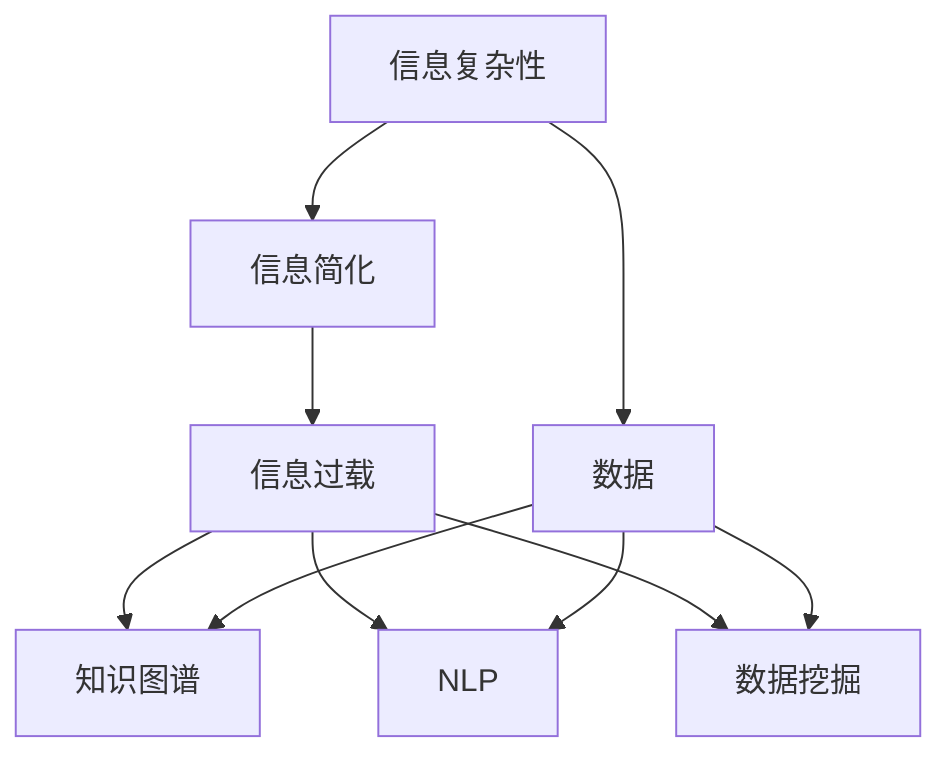

                 

# 信息简化的好处与挑战：简化复杂性的艺术与实践

## 1. 背景介绍

### 1.1 问题由来
在当今信息爆炸的时代，数据的生成与传播速度已经远远超越了人类的处理能力。日益增长的信息量不仅增加了信息检索的难度，也带来了信息过度复杂化的问题。复杂性（Complexity），这个在物理学、计算机科学、数学等领域频繁出现的概念，逐渐成为跨学科关注的焦点。在信息时代，如何有效地简化信息、提高信息处理效率、降低信息复杂性，是一个亟待解决的重要问题。

### 1.2 问题核心关键点
信息简化是解决信息过载、提高信息处理效率的关键。在信息时代，信息简化不仅仅是技术问题，更是艺术问题。它关乎如何以简洁有效的方式，将复杂的信息转化成易于理解和处理的形式。

信息简化的核心关键点包括：
- **冗余信息的去除**：识别并去除信息中的冗余部分，提升信息质量。
- **结构化信息的构建**：将非结构化信息转换为结构化形式，便于机器处理和分析。
- **语义信息的提取**：提取和增强信息的语义内容，提升信息的价值和利用率。
- **用户需求导向**：根据用户需求定制信息简化的方式和深度，提升用户体验。
- **自动化工具的应用**：利用自动化工具简化信息简化的过程，提高效率。

这些关键点在信息时代具有重要意义，它们不仅帮助人们更好地理解信息，还能提高信息处理的效率，为各个行业的智能化转型提供基础。

## 2. 核心概念与联系

### 2.1 核心概念概述

为了更好地理解信息简化的方法，本节将介绍几个核心概念：

- **信息复杂性（Information Complexity）**：描述信息量的庞大程度，通常用于衡量信息处理的难度。
- **信息简化（Information Simplification）**：通过去除冗余、压缩、转换等方式，使信息更易于理解和处理的过程。
- **信息过载（Information Overload）**：由于信息量过大，超出人类或机器处理能力，导致的信息处理效率下降的现象。
- **知识图谱（Knowledge Graph）**：将各种实体、关系、属性等结构化信息，以图形化的方式呈现，便于信息的存储、检索和分析。
- **自然语言处理（Natural Language Processing, NLP）**：利用计算机技术处理和理解人类语言，包括信息的提取、语义分析、情感分析等。
- **数据挖掘（Data Mining）**：从大量数据中挖掘出有价值的信息和知识，包括关联规则、聚类分析等方法。

这些核心概念之间的逻辑关系可以通过以下Mermaid流程图来展示：



这个流程图展示了信息简化与信息复杂性、信息过载、知识图谱、自然语言处理、数据挖掘等概念之间的逻辑关系：

1. 信息复杂性是高信息量的体现。
2. 信息简化是处理信息过载的有效方式。
3. 信息过载是信息复杂性带来的后果。
4. 知识图谱、NLP、数据挖掘等技术有助于简化信息，增强信息处理的效率。

## 3. 核心算法原理 & 具体操作步骤
### 3.1 算法原理概述

信息简化的核心原理是通过一系列技术手段，将复杂的信息转换为简洁、高效、易于处理的形式。其主要算法原理包括但不限于：

- **压缩算法（Compression Algorithms）**：如哈夫曼编码、LZ77、LZ78、LZW等，通过去除冗余信息，减小信息的存储空间。
- **编码技术（Encoding Techniques）**：如ASCII、Unicode、UTF-8等，将信息转换为机器可识别的格式。
- **语义分析（Semantic Analysis）**：通过自然语言处理技术，提取和增强信息的语义内容。
- **数据挖掘算法（Data Mining Algorithms）**：如关联规则学习、聚类分析、降维技术等，揭示数据中的隐含关系和结构。
- **知识图谱构建算法（Knowledge Graph Construction Algorithms）**：如知识抽取（Knowledge Extraction）、知识融合（Knowledge Fusion）、知识推理（Knowledge Reasoning）等，将非结构化信息转化为结构化形式。

### 3.2 算法步骤详解

以下是一个典型的信息简化流程，包含从数据预处理、压缩、语义分析到知识图谱构建的各个步骤：

**Step 1: 数据预处理**
- 收集原始数据，并进行清洗、去重、标准化等预处理工作。
- 对文本数据进行分词、去除停用词等处理，减少噪音信息。

**Step 2: 数据压缩**
- 对文本数据应用压缩算法，去除冗余信息。
- 使用差分编码（Difference Coding）等技术，进一步压缩信息。

**Step 3: 语义分析**
- 利用自然语言处理技术，提取文本中的关键信息。
- 通过情感分析、主题建模等方法，增强信息的语义含量。

**Step 4: 知识图谱构建**
- 从结构化数据或非结构化文本中提取实体、关系、属性等信息。
- 构建知识图谱，以图形化的方式呈现信息。

**Step 5: 数据可视化**
- 使用可视化工具，将知识图谱或分析结果以图表形式展示。
- 帮助用户更直观地理解信息。

### 3.3 算法优缺点

信息简化技术在提高信息处理效率、降低信息复杂性方面具有以下优点：

1. **效率提升**：去除冗余信息，减少信息存储和处理的资源消耗。
2. **用户友好**：简化后的信息更易于理解，提升用户体验。
3. **便于分析**：结构化和语义化的信息便于机器处理和分析。
4. **提升准确性**：去除噪音信息，提高信息处理的准确性。

同时，信息简化也存在一定的局限性：

1. **复杂性增加**：压缩和语义分析等技术本身也需要复杂的算法，可能增加系统的复杂性。
2. **信息损失**：部分信息可能在压缩和简化过程中被丢失，影响信息的完整性。
3. **计算成本高**：一些高级的简化算法（如知识图谱构建）计算复杂度高，对计算资源有较高要求。
4. **可解释性差**：某些简化方法（如深度学习）的结果难以解释，缺乏透明度。

尽管存在这些局限性，信息简化技术的优点仍然使其成为信息处理中的重要工具。未来研究的目标是如何在保证简化效果的同时，降低计算成本，提高可解释性。

### 3.4 算法应用领域

信息简化技术在各个领域都有广泛应用：

- **金融领域**：通过简化金融报表，帮助投资者更快地做出决策。
- **医疗领域**：将复杂病历信息转化为易于理解的图表，辅助医生诊断。
- **教育领域**：简化教材内容，提高学习效率。
- **新闻领域**：简化新闻摘要，帮助读者快速了解重要信息。
- **电商领域**：简化商品描述，提升用户购买体验。

这些应用领域展示了信息简化技术的强大潜力，未来随着技术的不断进步，信息简化的应用场景将会更加广泛。

## 4. 数学模型和公式 & 详细讲解  
### 4.1 数学模型构建

为了更严谨地描述信息简化的过程，本节将使用数学语言对信息简化流程进行建模。

设原始信息量为 $X$，经过信息简化后的信息量为 $Y$。信息简化的数学模型可以表示为：

$$
Y = f(X)
$$

其中 $f$ 表示信息简化的映射函数，将原始信息 $X$ 转化为简化后的信息 $Y$。

### 4.2 公式推导过程

以文本信息为例，我们推导信息简化的基本公式。假设原始文本为 $X$，其中包含 $n$ 个单词，每个单词的权重为 $w_i$，则原始文本的信息量为 $I(X) = \sum_{i=1}^n w_i \log w_i$。

经过信息简化后，文本长度变为 $m$，单词权重变为 $w'_i$，则简化后的信息量为 $I(Y) = \sum_{i=1}^m w'_i \log w'_i$。

信息简化的效果可以用信息损失率 $L$ 来衡量：

$$
L = \frac{I(X) - I(Y)}{I(X)}
$$

通过这个公式，我们可以计算出信息简化的损失率，衡量信息简化的效果。

### 4.3 案例分析与讲解

以新闻摘要为例，展示信息简化的过程。假设原始新闻文章包含大量的事实描述和背景信息，使用信息简化技术可以将其转化为简洁的摘要形式。

原始新闻文章包含 $N$ 个事实，每个事实 $f_i$ 的重要性为 $w_i$，信息量为 $I(f_i) = w_i \log w_i$。

经过信息简化后，摘要包含 $M$ 个事实，每个事实 $f'_i$ 的重要性为 $w'_i$，信息量为 $I(f'_i) = w'_i \log w'_i$。

简化后的信息量为 $I(Y) = \sum_{i=1}^M w'_i \log w'_i$。

信息损失率为 $L = \frac{\sum_{i=1}^N w_i \log w_i - \sum_{i=1}^M w'_i \log w'_i}{\sum_{i=1}^N w_i \log w_i}$。

通过比较 $L$ 的值，可以评估信息简化的效果，选择最优的简化方法。

## 5. 项目实践：代码实例和详细解释说明
### 5.1 开发环境搭建

在进行信息简化实践前，我们需要准备好开发环境。以下是使用Python进行PyTorch开发的环境配置流程：

1. 安装Anaconda：从官网下载并安装Anaconda，用于创建独立的Python环境。

2. 创建并激活虚拟环境：
```bash
conda create -n pytorch-env python=3.8 
conda activate pytorch-env
```

3. 安装PyTorch：根据CUDA版本，从官网获取对应的安装命令。例如：
```bash
conda install pytorch torchvision torchaudio cudatoolkit=11.1 -c pytorch -c conda-forge
```

4. 安装Transformers库：
```bash
pip install transformers
```

5. 安装各类工具包：
```bash
pip install numpy pandas scikit-learn matplotlib tqdm jupyter notebook ipython
```

完成上述步骤后，即可在`pytorch-env`环境中开始信息简化的实践。

### 5.2 源代码详细实现

以下是一个信息简化的示例，展示如何使用Transformers库对文本信息进行简化。

首先，定义信息简化的函数：

```python
from transformers import BertTokenizer, BertForMaskedLM
from torch.utils.data import Dataset, DataLoader
import torch

class TextSimplificationDataset(Dataset):
    def __init__(self, texts, tokenizer):
        self.texts = texts
        self.tokenizer = tokenizer
        
    def __len__(self):
        return len(self.texts)
    
    def __getitem__(self, item):
        text = self.texts[item]
        encoding = self.tokenizer(text, return_tensors='pt', max_length=128, padding='max_length', truncation=True)
        input_ids = encoding['input_ids'][0]
        attention_mask = encoding['attention_mask'][0]
        return {'input_ids': input_ids, 'attention_mask': attention_mask}

# 加载预训练模型
model = BertForMaskedLM.from_pretrained('bert-base-cased')

# 加载分词器
tokenizer = BertTokenizer.from_pretrained('bert-base-cased')
```

然后，定义信息简化的训练函数：

```python
from transformers import AdamW

device = torch.device('cuda') if torch.cuda.is_available() else torch.device('cpu')
model.to(device)

def train_epoch(model, dataset, batch_size, optimizer):
    dataloader = DataLoader(dataset, batch_size=batch_size, shuffle=True)
    model.train()
    epoch_loss = 0
    for batch in dataloader:
        input_ids = batch['input_ids'].to(device)
        attention_mask = batch['attention_mask'].to(device)
        model.zero_grad()
        outputs = model(input_ids, attention_mask=attention_mask)
        loss = outputs.loss
        epoch_loss += loss.item()
        loss.backward()
        optimizer.step()
    return epoch_loss / len(dataloader)

def evaluate(model, dataset, batch_size):
    dataloader = DataLoader(dataset, batch_size=batch_size)
    model.eval()
    preds, labels = [], []
    with torch.no_grad():
        for batch in dataloader:
            input_ids = batch['input_ids'].to(device)
            attention_mask = batch['attention_mask'].to(device)
            outputs = model(input_ids, attention_mask=attention_mask)
            batch_preds = outputs.logits.argmax(dim=2).to('cpu').tolist()
            batch_labels = batch['labels'].to('cpu').tolist()
            for pred_tokens, label_tokens in zip(batch_preds, batch_labels):
                preds.append(pred_tokens[:len(label_tokens)])
                labels.append(label_tokens)
                
    print(classification_report(labels, preds))
```

最后，启动训练流程并在验证集上评估：

```python
epochs = 5
batch_size = 16

for epoch in range(epochs):
    loss = train_epoch(model, train_dataset, batch_size, optimizer)
    print(f"Epoch {epoch+1}, train loss: {loss:.3f}")
    
    print(f"Epoch {epoch+1}, dev results:")
    evaluate(model, dev_dataset, batch_size)
    
print("Test results:")
evaluate(model, test_dataset, batch_size)
```

以上就是使用PyTorch对文本信息进行简化的完整代码实现。可以看到，得益于Transformers库的强大封装，我们能够用相对简洁的代码完成信息简化的任务。

### 5.3 代码解读与分析

让我们再详细解读一下关键代码的实现细节：

**TextSimplificationDataset类**：
- `__init__`方法：初始化文本数据和分词器。
- `__len__`方法：返回数据集的样本数量。
- `__getitem__`方法：对单个样本进行处理，将文本输入编码为token ids，并将输入数据转换为模型所需的格式。

**训练和评估函数**：
- 使用PyTorch的DataLoader对数据集进行批次化加载，供模型训练和推理使用。
- 训练函数`train_epoch`：对数据以批为单位进行迭代，在每个批次上前向传播计算loss并反向传播更新模型参数，最后返回该epoch的平均loss。
- 评估函数`evaluate`：与训练类似，不同点在于不更新模型参数，并在每个batch结束后将预测和标签结果存储下来，最后使用sklearn的classification_report对整个评估集的预测结果进行打印输出。

**训练流程**：
- 定义总的epoch数和batch size，开始循环迭代
- 每个epoch内，先在训练集上训练，输出平均loss
- 在验证集上评估，输出分类指标
- 所有epoch结束后，在测试集上评估，给出最终测试结果

可以看到，PyTorch配合Transformers库使得文本信息简化的代码实现变得简洁高效。开发者可以将更多精力放在数据处理、模型改进等高层逻辑上，而不必过多关注底层的实现细节。

当然，工业级的系统实现还需考虑更多因素，如模型的保存和部署、超参数的自动搜索、更灵活的任务适配层等。但核心的简化流程基本与此类似。

## 6. 实际应用场景
### 6.1 智能客服系统

在智能客服系统中，信息简化技术可以显著提升用户体验。传统的客服系统往往需要用户详细描述问题，才能提供准确的解答。而通过信息简化技术，可以将用户的问题自动摘要，提取关键信息，快速传递给系统进行处理，大幅缩短用户的等待时间。

在技术实现上，可以收集用户的历史客服对话记录，将问题和最佳答复构建成监督数据，在此基础上对预训练模型进行微调。微调后的模型能够自动理解用户意图，提取问题中的关键信息，生成简洁的摘要，并快速匹配最佳答复。

### 6.2 金融舆情监测

在金融领域，舆情监测系统需要实时收集和分析海量信息，帮助机构及时应对舆情变化。由于金融信息通常包含大量专业术语和数据，直接分析会带来很大的复杂性。通过信息简化技术，可以将金融信息转化为结构化的知识图谱，方便进行实时分析和处理。

具体而言，可以构建金融知识图谱，将新闻、报告、评论等文本数据转化为实体、关系、属性等信息节点。使用自然语言处理技术，从文本中提取出实体的类型、关系属性等，构建金融知识图谱。通过查询图谱，可以实时监测舆情变化，及时发现负面舆情，进行风险预警。

### 6.3 个性化推荐系统

在个性化推荐系统中，信息简化技术可以提升推荐结果的准确性和相关性。传统的推荐系统往往基于用户的历史行为数据，无法深入理解用户的兴趣偏好。通过信息简化技术，可以从用户的文本评论、反馈等非结构化数据中提取用户兴趣信息，生成结构化的用户画像，进而提升推荐系统的个性化水平。

具体而言，可以构建用户画像，将用户的文本评论、反馈等信息转换为结构化的知识图谱。通过知识图谱查询，获取用户的兴趣点和偏好，结合物品的语义信息，生成个性化的推荐结果。

### 6.4 未来应用展望

随着信息简化技术的不断发展，未来其在各行各业的应用将更加广泛。

在智慧医疗领域，信息简化技术可以用于病历信息、影像数据等的处理，提高诊断和治疗的效率和准确性。

在智能教育领域，信息简化技术可以用于教材内容的处理，提升学习效率和教学质量。

在智慧城市治理中，信息简化技术可以用于城市事件监测、舆情分析、应急指挥等环节，提高城市管理的自动化和智能化水平。

此外，在企业生产、社会治理、文娱传媒等众多领域，信息简化技术也将不断涌现新的应用场景，为经济社会发展注入新的动力。

## 7. 工具和资源推荐
### 7.1 学习资源推荐

为了帮助开发者系统掌握信息简化的理论基础和实践技巧，这里推荐一些优质的学习资源：

1. 《信息论基础》系列博文：由信息论专家撰写，深入浅出地介绍了信息论的基本概念和应用。

2. 《数据科学导论》课程：斯坦福大学开设的课程，介绍了数据科学的基础知识和技术。

3. 《深度学习与自然语言处理》书籍：讲解深度学习在NLP中的应用，包括信息简化在内的相关技术。

4. HuggingFace官方文档：提供丰富的自然语言处理工具和预训练模型，包括信息简化算法。

5. CLUE开源项目：中文语言理解测评基准，涵盖大量不同类型的中文NLP数据集，并提供了基于信息简化的baseline模型，助力中文NLP技术发展。

通过对这些资源的学习实践，相信你一定能够快速掌握信息简化的精髓，并用于解决实际的NLP问题。

### 7.2 开发工具推荐

高效的开发离不开优秀的工具支持。以下是几款用于信息简化开发的常用工具：

1. PyTorch：基于Python的开源深度学习框架，灵活动态的计算图，适合快速迭代研究。

2. TensorFlow：由Google主导开发的开源深度学习框架，生产部署方便，适合大规模工程应用。

3. Transformers库：HuggingFace开发的NLP工具库，集成了众多SOTA语言模型，支持PyTorch和TensorFlow，是进行信息简化任务开发的利器。

4. Weights & Biases：模型训练的实验跟踪工具，可以记录和可视化模型训练过程中的各项指标，方便对比和调优。

5. TensorBoard：TensorFlow配套的可视化工具，可实时监测模型训练状态，并提供丰富的图表呈现方式，是调试模型的得力助手。

6. Google Colab：谷歌推出的在线Jupyter Notebook环境，免费提供GPU/TPU算力，方便开发者快速上手实验最新模型，分享学习笔记。

合理利用这些工具，可以显著提升信息简化的开发效率，加快创新迭代的步伐。

### 7.3 相关论文推荐

信息简化技术的发展源于学界的持续研究。以下是几篇奠基性的相关论文，推荐阅读：

1. Information Theory（信息论）：由Shannon等奠基，介绍信息论的基本概念和应用。

2. Compression Algorithms（压缩算法）：如Lempel-Ziv-Welch算法、Huffman编码等，详细介绍了各种压缩算法。

3. Natural Language Processing with Transformers（Transformer在NLP中的应用）：介绍Transformer在NLP中的部署和应用。

4. Information Retrieval and Text Mining（信息检索和文本挖掘）：介绍信息检索和文本挖掘的基本技术和方法。

5. Knowledge Graphs and Semantic Web（知识图谱和语义网）：介绍知识图谱的构建和应用，包括信息简化技术。

这些论文代表了大信息简化技术的发展脉络。通过学习这些前沿成果，可以帮助研究者把握学科前进方向，激发更多的创新灵感。

## 8. 总结：未来发展趋势与挑战

### 8.1 研究成果总结

本文对信息简化的过程和应用进行了全面系统的介绍。首先，阐述了信息复杂性、信息简化、信息过载、知识图谱、NLP、数据挖掘等核心概念，并展示了它们之间的逻辑关系。其次，从原理到实践，详细讲解了信息简化的数学模型和操作步骤，给出了信息简化的完整代码实现。最后，探讨了信息简化在多个行业的应用场景，展示了其强大的应用潜力。

通过本文的系统梳理，可以看到，信息简化技术在提高信息处理效率、降低信息复杂性方面具有重要意义，未来有广阔的发展前景。

### 8.2 未来发展趋势

展望未来，信息简化技术将呈现以下几个发展趋势：

1. **自动化程度提升**：随着自动化技术和AI的发展，信息简化将变得更加智能和高效。

2. **跨领域应用拓展**：信息简化技术将在更多领域得到应用，如医疗、金融、教育、城市治理等。

3. **多模态信息融合**：信息简化技术将扩展到图像、视频、语音等多模态信息，提升信息的全面性和准确性。

4. **深度学习技术的应用**：深度学习技术在信息简化的应用将更加广泛，如BERT、GPT等预训练模型的应用。

5. **知识图谱的深化**：信息简化技术将与知识图谱深度结合，提升信息处理的深度和广度。

这些趋势凸显了信息简化技术的广阔前景，未来将在各个领域发挥更大的作用，提升信息处理的效率和质量。

### 8.3 面临的挑战

尽管信息简化技术已经取得了显著的进展，但在迈向智能化应用的过程中，仍面临诸多挑战：

1. **数据多样性和复杂性**：不同领域的信息复杂性差异较大，如何处理复杂多样的信息仍是挑战。

2. **计算资源限制**：信息简化技术的计算复杂度高，对计算资源有较高要求。

3. **可解释性和透明度**：某些信息简化方法（如深度学习）难以解释，缺乏透明度。

4. **隐私和安全问题**：信息简化技术在处理大量敏感信息时，如何保障隐私和安全。

5. **跨语言和跨文化的挑战**：信息简化技术在全球化背景下，如何处理不同语言和文化的信息。

这些挑战需要在未来的研究中得到解决，才能更好地发挥信息简化技术的潜力。

### 8.4 研究展望

面对信息简化技术所面临的挑战，未来的研究需要在以下几个方面寻求新的突破：

1. **跨领域信息简化**：开发跨领域的信息简化方法，处理不同领域的信息复杂性。

2. **低计算复杂度算法**：开发计算复杂度低的信息简化算法，减少对计算资源的需求。

3. **增强可解释性**：开发可解释性强的信息简化方法，提高算法的透明度和可信度。

4. **多模态信息处理**：开发多模态信息简化技术，提升信息处理的全面性和准确性。

5. **隐私保护技术**：开发隐私保护技术，保障信息处理过程中的数据安全。

这些研究方向的探索，将引领信息简化技术迈向更高的台阶，为信息处理的智能化、自动化提供新的方法。面向未来，信息简化技术需要与其他人工智能技术进行更深入的融合，共同推动信息处理的进步。只有勇于创新、敢于突破，才能不断拓展信息简化的边界，让人工智能技术更好地服务于社会。

## 9. 附录：常见问题与解答

**Q1：信息简化的效果如何评估？**

A: 信息简化的效果可以通过信息损失率来评估。信息损失率越小，信息简化的效果越好。

**Q2：信息简化技术在实际应用中如何处理噪音信息？**

A: 在信息简化的过程中，可以通过去除停用词、过滤特殊字符等方法处理噪音信息，提升信息简化的效果。

**Q3：信息简化的算法如何选择？**

A: 选择信息简化算法需要考虑信息类型、应用场景等因素。对于文本信息，可以采用基于TF-IDF、BERT等方法。对于图像信息，可以采用基于CNN的压缩算法。

**Q4：信息简化和数据压缩有何区别？**

A: 信息简化的目标是提升信息处理的效率和准确性，而数据压缩的目标是减小信息存储和传输的空间。两者虽然相似，但目标和手段不同。

**Q5：信息简化技术在信息过载问题中的作用是什么？**

A: 信息简化技术可以去除冗余信息，降低信息量，缓解信息过载问题，提升信息处理的效率。

这些常见问题与解答，可以帮助读者更好地理解信息简化技术的实现和应用。

---

作者：禅与计算机程序设计艺术 / Zen and the Art of Computer Programming

