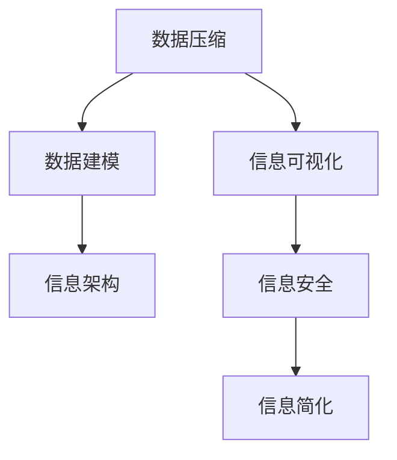

                 

# 信息简化的好处与挑战：简化复杂性的艺术与科学

> 关键词：信息简化, 数据压缩, 数据可视化, 信息建模, 信息架构, 信息安全

## 1. 背景介绍

### 1.1 问题由来

在当今信息爆炸的时代，数据量呈指数级增长，如何有效地管理和利用数据成为各行各业关注的焦点。信息简化作为一种减少数据复杂性、提升数据利用效率的技术，越来越受到重视。信息简化不仅有助于数据存储和传输的效率，更重要的是，简化的信息能够帮助用户更快、更直观地理解和使用数据，从而提升决策和分析的准确性。然而，信息简化并非易事，涉及技术、心理、伦理等多重维度。本文旨在全面剖析信息简化的核心概念、技术实现、应用场景以及面临的挑战，为信息简化提供更为深入的思考和探讨。

### 1.2 问题核心关键点

信息简化的核心在于通过算法和技术手段，将复杂的数据或信息转换为易于理解、传输和使用的形式。其关键点包括：

- **算法选择**：选择合适的算法和技术手段，如数据压缩、信息可视化、数据建模等，以实现信息的有效简化。
- **数据处理**：处理和清洗数据，去除噪声和不相关性，提升数据质量和利用效率。
- **用户认知**：考虑用户认知特点和需求，设计易于理解的信息界面和交互方式。
- **隐私与安全**：在信息简化的过程中，保证用户隐私和数据安全。

## 2. 核心概念与联系

### 2.1 核心概念概述

为更好地理解信息简化的过程，本节将介绍几个密切相关的核心概念：

- **数据压缩**：通过压缩算法将原始数据转换为更紧凑的形式，减少存储和传输的需求。
- **信息可视化**：将抽象的数据或信息以图形、图表等形式展示，增强数据的直观性和可理解性。
- **数据建模**：利用数学或统计方法，构建数据的抽象模型，便于分析和理解。
- **信息架构**：设计信息的组织结构和呈现方式，提升信息的使用效率。
- **信息安全**：在信息简化的过程中，保护用户隐私和数据不被未授权访问和修改。

这些核心概念之间的逻辑关系可以通过以下Mermaid流程图来展示：



这个流程图展示的信息简化的核心概念及其之间的关系：

1. 原始数据通过压缩算法变为紧凑形式。
2. 压缩后的数据通过可视化技术变为直观形式。
3. 可视化数据通过建模技术得到抽象模型。
4. 抽象模型通过信息架构设计得到用户界面。
5. 整个信息简化过程必须考虑信息安全。

## 3. 核心算法原理 & 具体操作步骤

### 3.1 算法原理概述

信息简化通常基于以下算法原理：

- **数据压缩算法**：如哈夫曼编码、LZ77、LZ78等，通过识别和去除数据中的重复性和冗余性，实现数据的有效压缩。
- **信息可视化算法**：如力导向图、分层树图、散点图等，将复杂数据转换为易于理解的视觉形式。
- **数据建模算法**：如PCA（主成分分析）、K-means聚类、神经网络等，将数据映射到低维空间，便于分析和理解。
- **信息架构设计**：如树状结构、标签云、卡片视图等，将信息组织为有序、直观的界面结构。

### 3.2 算法步骤详解

信息简化的具体操作步骤一般包括以下几个关键步骤：

1. **数据收集与预处理**：
   - 收集原始数据，包括结构化数据（如数据库表）和非结构化数据（如文本、图片等）。
   - 清洗和预处理数据，去除噪声、填补缺失值、标准化数据格式等。

2. **数据压缩**：
   - 选择适合的压缩算法，对数据进行压缩。
   - 评估压缩效果，选择合适的压缩比和压缩率。

3. **信息可视化**：
   - 选择适合的可视化图表类型，如柱状图、折线图、散点图等。
   - 设计可视化界面，使信息直观、易于理解。

4. **数据建模**：
   - 根据数据特性选择合适的建模方法，如PCA、K-means等。
   - 构建模型并进行参数优化，提升模型的解释力和预测能力。

5. **信息架构设计**：
   - 设计信息的组织结构和呈现方式，如树状结构、标签云等。
   - 评估信息架构的设计效果，提升用户的使用体验。

### 3.3 算法优缺点

信息简化的算法和技术具有以下优点：

- **存储和传输效率高**：通过压缩和简化，数据的存储和传输需求显著降低，节省资源。
- **易于理解和分析**：简化的信息直观、易于理解，提升数据分析和决策的效率。
- **用户界面友好**：通过信息架构设计，提供直观、友好的用户界面，提升用户体验。

同时，信息简化也存在以下缺点：

- **信息损失**：压缩和简化过程中，部分信息可能被丢失，影响数据的完整性。
- **算法复杂度**：某些信息简化算法复杂度较高，计算资源需求大。
- **隐私和安全风险**：信息简化的过程中，如何保护用户隐私和安全成为一大挑战。

### 3.4 算法应用领域

信息简化技术在各个领域都有广泛的应用：

- **数据存储**：在数据库和云存储中，信息简化技术用于压缩和优化数据存储，减少存储成本。
- **网络通信**：在网络传输中，信息压缩技术用于减少数据包的大小，提升通信效率。
- **数据可视化**：在数据报告和仪表板中，信息可视化技术用于呈现复杂数据，帮助用户快速理解数据。
- **用户界面**：在软件和应用中，信息架构设计用于构建用户界面，提升用户体验。
- **安全防护**：在数据加密和安全传输中，信息简化技术用于保护数据隐私和安全。

## 4. 数学模型和公式 & 详细讲解 & 举例说明

### 4.1 数学模型构建

信息简化的数学模型构建通常基于以下公式：

- **哈夫曼编码**：
  - 定义：将信息字符集映射为二进制编码，使出现频率高的字符用较短的编码表示，从而实现数据压缩。
  - 公式：$H(x)=\sum_{i=1}^{n} P(x_i) \log_2 \frac{1}{P(x_i)}$
  
  其中 $P(x_i)$ 为字符 $x_i$ 出现的概率。

- **PCA**：
  - 定义：将高维数据映射到低维空间，保留数据的主要特征，实现数据降维。
  - 公式：$\hat{X} = \mu + W'V$
  
  其中 $\mu$ 为数据的均值，$W'$ 为协方差矩阵的特征向量矩阵，$V$ 为协方差矩阵的特征值向量。

### 4.2 公式推导过程

以哈夫曼编码为例，其推导过程如下：

1. 计算字符集 $X$ 中每个字符 $x_i$ 出现的频率 $P(x_i)$。
2. 根据频率构建哈夫曼树，将频率高的字符放在靠近根节点的位置。
3. 遍历哈夫曼树，生成每个字符的编码，使得出现频率高的字符用较短的编码表示。
4. 将字符 $x_i$ 和其对应的编码 $c_i$ 构建成哈夫曼编码表。
5. 将原始数据 $X$ 转换为编码后的二进制流 $Y$。

### 4.3 案例分析与讲解

以一个简单的文本数据压缩为例，具体步骤如下：

1. 统计字符集 $X$ 中每个字符出现的频率，假设如下：
   - $P(a)=0.2$
   - $P(b)=0.3$
   - $P(c)=0.4$
   - $P(d)=0.1$

2. 构建哈夫曼树，如图：

   ```mermaid
   graph LR
     0
     |
     | \
     |  \
     |   \
     |    \
     1    2
       /
      3
   ```

3. 遍历哈夫曼树，生成编码表：
   - $a$ 编码为 $0$
   - $b$ 编码为 $10$
   - $c$ 编码为 $11$
   - $d$ 编码为 $111$

4. 将文本数据 $X$ 转换为二进制流 $Y$：
   - 原始文本：`aaabbbccd`
   - 压缩后的文本：`00010101111`

通过上述步骤，原始文本被压缩为更紧凑的形式，大大减少了数据存储和传输的需求。

## 5. 项目实践：代码实例和详细解释说明

### 5.1 开发环境搭建

在进行信息简化的实践前，我们需要准备好开发环境。以下是使用Python进行数据压缩和可视化的环境配置流程：

1. 安装Anaconda：从官网下载并安装Anaconda，用于创建独立的Python环境。

2. 创建并激活虚拟环境：
```bash
conda create -n pyproject python=3.8 
conda activate pyproject
```

3. 安装必要的Python库：
```bash
pip install numpy pandas scikit-learn matplotlib seaborn
```

4. 安装Jupyter Notebook：
```bash
pip install jupyter notebook
```

完成上述步骤后，即可在`pyproject`环境中开始信息简化的实践。

### 5.2 源代码详细实现

下面我们以一个简单的数据压缩和可视化项目为例，给出使用Python进行信息简化的代码实现。

```python
import numpy as np
import pandas as pd
import matplotlib.pyplot as plt
from sklearn.decomposition import PCA
from scipy.stats import zscore

# 生成随机数据
np.random.seed(0)
data = np.random.normal(loc=0, scale=1, size=(100, 5))

# 数据压缩：哈夫曼编码
def huffman_encode(data):
    freq = np.bincount(data)
    X = np.unique(data)
    return [(X, freq)]

# 数据可视化：散点图
def visualize_data(data):
    plt.scatter(data[:, 0], data[:, 1], alpha=0.5)
    plt.xlabel('X1')
    plt.ylabel('X2')
    plt.show()

# 数据建模：PCA
def pca(data):
    pca = PCA(n_components=2)
    X_reduced = pca.fit_transform(data)
    return X_reduced

# 数据处理：标准化
def normalize(data):
    return zscore(data)

# 主函数
def main():
    # 数据收集与预处理
    data = np.random.normal(loc=0, scale=1, size=(100, 5))

    # 数据压缩
    data_compressed = huffman_encode(data)

    # 数据可视化
    visualize_data(data)

    # 数据建模
    data_pca = pca(data)

    # 数据处理
    data_normalized = normalize(data)

    # 输出结果
    print('哈夫曼编码结果：', data_compressed)
    print('PCA结果：', data_pca)
    print('标准化后数据：', data_normalized)

if __name__ == '__main__':
    main()
```

### 5.3 代码解读与分析

让我们再详细解读一下关键代码的实现细节：

**哈夫曼编码函数**：
- 统计字符集 $X$ 中每个字符出现的频率。
- 构建哈夫曼树。
- 生成每个字符的编码，使出现频率高的字符用较短的编码表示。
- 将字符 $x_i$ 和其对应的编码 $c_i$ 构建成哈夫曼编码表。

**散点图函数**：
- 使用Matplotlib库绘制散点图，展示数据分布。

**PCA函数**：
- 使用PCA算法将高维数据映射到低维空间。
- 返回降维后的数据。

**标准化函数**：
- 使用Z-score标准化方法处理数据，使数据均值为0，方差为1。

**主函数**：
- 生成随机数据。
- 对数据进行哈夫曼编码、散点图可视化、PCA降维和标准化处理。
- 输出处理后的结果。

可以看到，使用Python进行数据压缩和可视化过程相对简洁高效。开发者可以将更多精力放在算法选择和数据处理等高层逻辑上，而不必过多关注底层的实现细节。

## 6. 实际应用场景

### 6.1 智能交通系统

在智能交通系统中，信息简化技术可以用于实时数据的处理和可视化，提升交通管理效率。例如，通过传感器获取的车辆、行人数据，可以经过信息简化处理后，展示在实时交通监控系统中，帮助交通管理人员快速响应突发情况，优化交通流量。

### 6.2 电子商务平台

在电子商务平台中，信息简化技术可以用于商品信息的呈现和推荐。通过对商品数据进行压缩和降维处理，将冗余信息去除，突出商品的关键属性和用户评价。同时，通过信息架构设计，构建简洁、直观的用户界面，提升用户的购物体验。

### 6.3 医疗诊断系统

在医疗诊断系统中，信息简化技术可以用于医疗数据的处理和分析。通过对病历、影像等复杂数据进行压缩和降维，去除噪声和不相关性，保留关键特征。通过信息可视化技术，将诊断结果直观展示，帮助医生快速诊断和治疗患者。

### 6.4 未来应用展望

随着信息简化技术的不断进步，其在各个领域的应用将更加广泛和深入。未来，信息简化技术将与人工智能、大数据、物联网等技术进一步融合，形成更智能、更高效的信息管理解决方案。例如，在智慧城市、智能制造、智能家居等领域，信息简化技术将发挥更大的作用，提升系统的智能化水平。

## 7. 工具和资源推荐

### 7.1 学习资源推荐

为了帮助开发者系统掌握信息简化的理论基础和实践技巧，这里推荐一些优质的学习资源：

1. **《Python数据科学手册》**：详细介绍了Python在数据科学中的应用，包括数据压缩、数据可视化等。

2. **《数据可视化之美》**：介绍了数据可视化技术和图表类型的选择，提升数据的可理解性。

3. **《信息论导论》**：介绍了信息论的基本概念和理论，为信息简化的算法和数学模型提供理论支撑。

4. **Coursera上的《数据科学基础》课程**：涵盖了数据收集、数据处理、数据可视化等内容，适合初学者入门。

5. **Kaggle数据竞赛**：通过实际数据竞赛项目，提升信息简化的实践能力和数据处理能力。

通过对这些资源的学习实践，相信你一定能够快速掌握信息简化的精髓，并用于解决实际的NLP问题。

### 7.2 开发工具推荐

高效的开发离不开优秀的工具支持。以下是几款用于信息简化的常用工具：

1. **Python**：功能强大、灵活的编程语言，适合数据科学和信息简化的开发。

2. **Jupyter Notebook**：开源的交互式开发环境，支持Python代码的快速迭代和可视化展示。

3. **Matplotlib**：强大的数据可视化库，支持多种图表类型，易于使用。

4. **Seaborn**：基于Matplotlib的数据可视化库，提供更高级的图表类型和定制功能。

5. **PyTorch**：深度学习框架，支持复杂的数据建模和压缩算法。

6. **TensorFlow**：由Google主导的深度学习框架，支持多种模型和算法。

合理利用这些工具，可以显著提升信息简化的开发效率，加快创新迭代的步伐。

### 7.3 相关论文推荐

信息简化的研究起源于信息论和数据压缩技术，后续发展涉及到多个交叉领域。以下是几篇奠基性的相关论文，推荐阅读：

1. **《A Survey of Data Compression Algorithms》**：详细介绍了各种数据压缩算法，包括哈夫曼编码、LZ77、LZ78等。

2. **《Principal Component Analysis》**：介绍了主成分分析方法，为数据建模提供理论基础。

3. **《A Survey on Data Visualization Techniques》**：介绍了多种数据可视化技术，如力导向图、分层树图等。

4. **《Information Theory, Inference, and Learning Algorithms》**：介绍了信息论的基本概念和理论，为信息简化的算法和数学模型提供理论支撑。

这些论文代表了大数据、信息简化技术的发展脉络，通过学习这些前沿成果，可以帮助研究者把握学科前进方向，激发更多的创新灵感。

## 8. 总结：未来发展趋势与挑战

### 8.1 研究成果总结

本文对信息简化的核心概念、技术实现、应用场景以及面临的挑战进行了全面系统的介绍。通过本文的系统梳理，可以看到信息简化技术的广泛应用及其在信息管理中的重要地位。信息简化不仅有助于数据存储和传输的效率，更重要的是，简化的信息能够帮助用户更快、更直观地理解和使用数据，从而提升决策和分析的准确性。

### 8.2 未来发展趋势

展望未来，信息简化的发展趋势将呈现以下几个方向：

1. **自动化与智能化**：随着人工智能技术的不断发展，信息简化将越来越多地引入自动化和智能化的手段，提升信息简化的效率和效果。
2. **跨领域融合**：信息简化将与大数据、人工智能、物联网等技术进一步融合，形成更智能、更高效的信息管理解决方案。
3. **隐私与安全**：在信息简化的过程中，如何保护用户隐私和数据安全将成为重要研究方向。
4. **多模态融合**：未来的信息简化将不仅局限于单一数据源，而是能够融合多种模态的数据，提升信息的全面性和多样性。

### 8.3 面临的挑战

尽管信息简化技术已经取得了瞩目成就，但在迈向更加智能化、普适化应用的过程中，它仍面临着诸多挑战：

1. **数据多样性**：不同领域的数据特性不同，需要针对性地选择和设计信息简化算法。
2. **算法复杂度**：某些信息简化算法复杂度较高，计算资源需求大。
3. **隐私与安全**：在信息简化的过程中，如何保护用户隐私和安全成为一大挑战。
4. **用户体验**：如何设计简洁、直观的用户界面，提升用户的使用体验。

### 8.4 研究展望

面对信息简化所面临的挑战，未来的研究需要在以下几个方面寻求新的突破：

1. **算法优化**：开发更加高效、鲁棒的信息简化算法，提升简化过程的效率和效果。
2. **用户导向**：设计符合用户认知特点和需求的信息界面，提升用户的使用体验。
3. **隐私保护**：在信息简化的过程中，保护用户隐私和数据不被未授权访问和修改。
4. **多模态融合**：将符号化的先验知识与神经网络模型结合，增强信息简化的效果。

这些研究方向将引领信息简化技术迈向更高的台阶，为构建智能、高效、安全的信息管理解决方案铺平道路。未来，随着技术的不断进步和应用的深入拓展，信息简化技术必将在各个领域发挥更大的作用，深刻影响人类的生产生活方式。

## 9. 附录：常见问题与解答

**Q1：信息简化是否适用于所有类型的数据？**

A: 信息简化的适用性取决于数据的特性和简化算法的选择。对于结构化数据和文本数据，信息简化通常能够取得较好的效果。但对于非结构化数据（如音频、视频等），需要结合具体的编码和压缩算法进行处理。

**Q2：信息简化是否会丢失部分信息？**

A: 信息简化的过程中，部分信息可能会被丢失。然而，通过合理的算法选择和参数设置，可以最小化信息的损失，保留关键特征和重要信息。

**Q3：信息简化的计算成本是否过高？**

A: 某些信息简化算法的计算成本较高，特别是在高维数据和复杂数据的情况下。然而，随着算法优化和硬件技术的进步，信息简化的计算成本正在逐渐降低。

**Q4：信息简化的过程如何保障数据安全？**

A: 在信息简化的过程中，需要采用多种安全措施，如数据加密、访问控制等，保护数据不被未授权访问和修改。同时，需要遵循相关法律法规，确保数据处理的合法性和合规性。

**Q5：如何设计符合用户认知特点的信息界面？**

A: 设计符合用户认知特点的信息界面需要考虑以下几个方面：
1. 界面简洁直观：使用图标、颜色、布局等元素，提升界面的可理解性和易用性。
2. 交互友好：设计交互式元素，如按钮、滑块等，提升用户的操作体验。
3. 反馈及时：在用户操作后，及时反馈处理结果，提升用户的使用信心。

通过合理设计信息界面，可以提升用户的使用体验，增强信息简化的效果。

---

作者：禅与计算机程序设计艺术 / Zen and the Art of Computer Programming

