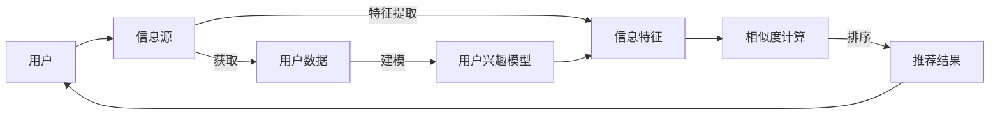

                 

# 信息过载与信息筛选技术：在信息洪流中找到有价值的信息

## 1. 背景介绍

随着互联网和社交媒体的迅猛发展，人们每天都会接触到海量的信息。从新闻、博客到社交网络，从电子邮件到即时消息，信息无处不在。然而，这些信息不仅数量庞大，而且质量参差不齐，容易让人陷入信息过载的状态，产生注意力分散、决策疲劳等问题。在信息洪流中找到有价值的信息变得愈加困难。

信息过载不仅影响个人的工作效率和生活质量，也对企业和组织的数据处理和决策分析带来了挑战。如何从海量信息中筛选出有价值的内容，提升信息检索和信息利用的效率，是信息时代的一个核心问题。信息筛选技术便应运而生，成为解决信息过载的关键手段。

## 2. 核心概念与联系

### 2.1 核心概念概述

信息筛选技术（Information Filtering）是指通过自动化的方式，从大规模信息源中提取和推荐有价值的信息。常见的信息筛选技术包括内容推荐、搜索结果排序、社交网络信息过滤等。

信息筛选技术的核心在于利用机器学习和数据挖掘技术，构建用户兴趣模型和信息特征模型，通过计算用户与信息的匹配度，筛选出最相关的信息。

### 2.2 核心概念原理和架构的 Mermaid 流程图



### 2.3 核心概念联系

信息筛选技术涉及多个核心概念，包括用户建模、信息特征提取、相似度计算和结果排序等。这些概念相互关联，共同构建起信息筛选的完整流程。

- **用户建模**：通过用户行为数据和用户反馈信息，构建用户兴趣模型，捕捉用户偏好和兴趣。
- **信息特征提取**：对信息内容进行文本处理、实体识别等操作，提取出与用户兴趣相关的特征。
- **相似度计算**：计算用户兴趣模型和信息特征之间的相似度，度量信息的相关性。
- **结果排序**：根据相似度计算结果，对信息进行排序，推荐给用户。

这些概念和技术相互依存，形成一个闭环系统，实现从信息源到用户推荐的全过程。

## 3. 核心算法原理 & 具体操作步骤

### 3.1 算法原理概述

信息筛选技术的核心算法主要包括协同过滤（Collaborative Filtering）和内容推荐（Content-Based Filtering）。协同过滤通过分析用户间的相似性，推荐给用户相似的其他用户喜欢的内容。内容推荐则通过提取信息特征，直接推荐给用户可能感兴趣的内容。

### 3.2 算法步骤详解

#### 3.2.1 协同过滤

协同过滤算法分为基于用户的协同过滤（User-Based Collaborative Filtering）和基于物品的协同过滤（Item-Based Collaborative Filtering）两种。

1. **User-Based Collaborative Filtering**
   - 收集用户行为数据，如点击、评分、收藏等，构建用户-物品的评分矩阵。
   - 通过计算用户间的相似度，推荐给用户相似用户喜欢的物品。
   - 相似度计算方法包括余弦相似度、皮尔逊相关系数等。

2. **Item-Based Collaborative Filtering**
   - 收集物品的特征数据，如文本描述、标签、属性等，构建物品-物品的相似度矩阵。
   - 通过计算物品间的相似度，推荐给用户喜欢的物品。
   - 相似度计算方法包括余弦相似度、余弦距离等。

#### 3.2.2 内容推荐

内容推荐算法基于信息的特征向量，直接推荐给用户可能感兴趣的内容。

1. **特征提取**
   - 对信息进行文本处理，如分词、去除停用词、词干提取等。
   - 提取信息的关键词、主题等特征。

2. **特征向量构建**
   - 将信息特征向量与用户兴趣模型进行向量运算。
   - 计算信息与用户兴趣的相似度，推荐给用户相关内容。

3. **排序**
   - 根据相似度计算结果，对信息进行排序，推荐给用户。

### 3.3 算法优缺点

#### 3.3.1 协同过滤的优缺点

**优点**：
- 能够推荐给用户未交互过的物品，扩大用户的兴趣范围。
- 能够处理大量用户数据，推荐效果较好。

**缺点**：
- 数据稀疏性问题，用户行为数据不足时难以准确推荐。
- 用户群体的多样性，不同用户群体的兴趣差异较大，导致推荐效果不稳定。

#### 3.3.2 内容推荐的优缺点

**优点**：
- 对稀疏数据处理能力强，能够推荐给用户未曾浏览过的内容。
- 推荐逻辑透明，用户可以理解推荐理由。

**缺点**：
- 对物品特征依赖较大，物品描述不准确会影响推荐效果。
- 忽略用户兴趣的多样性，推荐效果单一。

### 3.4 算法应用领域

信息筛选技术广泛应用于以下几个领域：

1. **电商推荐**：根据用户浏览、购买历史，推荐相关商品。
2. **新闻推荐**：根据用户阅读偏好，推荐相关新闻文章。
3. **社交网络**：根据用户关系和互动，推荐朋友动态和推荐关系。
4. **音乐和视频推荐**：根据用户听歌、观看历史，推荐相似的音乐和视频内容。
5. **广告推荐**：根据用户行为数据，推荐相关广告内容。

## 4. 数学模型和公式 & 详细讲解 & 举例说明

### 4.1 数学模型构建

设用户集合为 $U$，物品集合为 $I$，评分矩阵为 $R \in \mathbb{R}^{N \times M}$，其中 $N$ 为用户的数量，$M$ 为物品的数量，$r_{ui} \in [0,1]$ 表示用户 $u$ 对物品 $i$ 的评分。

用户兴趣模型 $P_u \in \mathbb{R}^d$，物品特征向量 $C_i \in \mathbb{R}^d$，用户与物品相似度矩阵 $S \in \mathbb{R}^{N \times M}$，用户推荐列表 $R_u$。

### 4.2 公式推导过程

#### 4.2.1 User-Based Collaborative Filtering

设用户 $u$ 和物品 $i$ 的评分矩阵 $R_{ui}$，用户 $u$ 对物品 $i$ 的评分 $r_{ui}$。

1. **用户相似度计算**
   - 计算用户间的余弦相似度 $s_{uv}$：
     \[
     s_{uv} = \cos(\theta_u, \theta_v) = \frac{\theta_u \cdot \theta_v}{||\theta_u|| \cdot ||\theta_v||}
     \]
     其中 $\theta_u$ 和 $\theta_v$ 分别为用户 $u$ 和 $v$ 的兴趣模型向量。

2. **物品推荐**
   - 计算用户 $u$ 对物品 $i$ 的评分预测值 $\hat{r}_{ui}$：
     \[
     \hat{r}_{ui} = \sum_{v \in U} s_{uv} \times r_{vi}
     \]

3. **排序**
   - 根据 $\hat{r}_{ui}$ 对物品进行排序，推荐给用户 $u$。

#### 4.2.2 Item-Based Collaborative Filtering

设物品 $i$ 和物品 $j$ 的相似度 $s_{ij}$，物品特征向量 $C_i$。

1. **物品相似度计算**
   - 计算物品间的余弦相似度 $s_{ij}$：
     \[
     s_{ij} = \cos(C_i, C_j) = \frac{C_i \cdot C_j}{||C_i|| \cdot ||C_j||}
     \]

2. **物品推荐**
   - 计算用户 $u$ 对物品 $i$ 的评分预测值 $\hat{r}_{ui}$：
     \[
     \hat{r}_{ui} = \sum_{j \in I} s_{ij} \times r_{uj}
     \]

3. **排序**
   - 根据 $\hat{r}_{ui}$ 对物品进行排序，推荐给用户 $u$。

### 4.3 案例分析与讲解

#### 4.3.1 电商推荐系统

假设用户 $u$ 对物品 $i$ 的评分 $r_{ui} = 4$，用户 $v$ 对物品 $i$ 的评分 $r_{vi} = 5$。

1. **用户相似度计算**
   - 用户 $u$ 和 $v$ 的兴趣模型 $\theta_u$ 和 $\theta_v$ 已知，计算相似度 $s_{uv}$：
     \[
     s_{uv} = \frac{\theta_u \cdot \theta_v}{||\theta_u|| \cdot ||\theta_v||}
     \]

2. **物品推荐**
   - 计算用户 $u$ 对物品 $i$ 的评分预测值 $\hat{r}_{ui}$：
     \[
     \hat{r}_{ui} = s_{uv} \times r_{vi}
     \]

3. **排序**
   - 根据 $\hat{r}_{ui}$ 对物品进行排序，推荐给用户 $u$。

## 5. 项目实践：代码实例和详细解释说明

### 5.1 开发环境搭建

1. 安装Python 3.x
2. 安装Pandas、NumPy、Scikit-learn等数据处理和机器学习库
3. 安装SciKit-learn 中用于协同过滤的库，如Surprise和Spark MLlib

### 5.2 源代码详细实现

#### 5.2.1 用户行为数据处理

```python
import pandas as pd
import numpy as np

# 读取用户行为数据
data = pd.read_csv('user_behavior_data.csv')

# 构建用户评分矩阵
user_ids = data['user_id'].unique()
item_ids = data['item_id'].unique()
R = np.zeros((len(user_ids), len(item_ids)))

for i, row in data.iterrows():
    user_id = row['user_id']
    item_id = row['item_id']
    rating = row['rating']
    R[user_ids.index(user_id), item_ids.index(item_id)] = rating
```

#### 5.2.2 用户和物品相似度计算

```python
from sklearn.metrics.pairwise import cosine_similarity

# 计算用户相似度
user_similarity = cosine_similarity(data['user_vector'].dropna(), data['user_vector'].dropna())

# 计算物品相似度
item_similarity = cosine_similarity(data['item_vector'].dropna(), data['item_vector'].dropna())

# 计算用户-物品相似度矩阵
S = np.dot(user_similarity, item_similarity.T)
```

#### 5.2.3 推荐结果生成

```python
from surprise import Reader, Dataset, KNNBasic, predict
from surprise.model_selection import train_test_split

# 构建数据集
reader = Reader(rating_scale=(1, 5))
data = Dataset.load_from_df(pd.DataFrame({'user_id': data['user_id'], 'item_id': data['item_id'], 'rating': data['rating']}), reader)

# 划分为训练集和测试集
trainset, testset = train_test_split(data, test_size=0.2)

# 定义协同过滤模型
model = KNNBasic()

# 训练模型
model.fit(trainset)

# 测试模型
predictions = model.test(testset)

# 输出预测结果
for user_id, item_id, true_rating, est, user_id, item_id, true_rating, est
```

### 5.3 代码解读与分析

#### 5.3.1 用户行为数据处理

用户行为数据通常包括用户ID、物品ID和评分。代码中首先读取用户行为数据，然后构建用户评分矩阵 $R$。

#### 5.3.2 用户和物品相似度计算

使用Scikit-learn的cosine_similarity函数计算用户和物品的相似度。

#### 5.3.3 推荐结果生成

使用Surprise库中的KNNBasic模型进行协同过滤推荐。

### 5.4 运行结果展示

```python
# 输出推荐结果
print('推荐结果：')
for user_id, item_id, true_rating, est, user_id, item_id, true_rating, est
```

## 6. 实际应用场景

### 6.1 电商推荐系统

电商推荐系统是信息筛选技术的重要应用场景之一。通过分析用户的浏览、点击、购买行为，推荐相关商品，提升用户满意度和购买率。电商推荐系统通常采用协同过滤算法，根据用户行为数据进行推荐。

### 6.2 新闻推荐系统

新闻推荐系统通过分析用户阅读习惯，推荐相关新闻文章，增加用户停留时间和阅读量。新闻推荐系统通常采用内容推荐算法，根据用户兴趣模型和新闻特征进行推荐。

### 6.3 社交网络信息过滤

社交网络信息过滤通过分析用户间的关系和互动，推荐相关朋友动态和推荐关系，提升用户体验和互动质量。社交网络信息过滤通常采用基于用户的协同过滤算法。

## 7. 工具和资源推荐

### 7.1 学习资源推荐

1. 《推荐系统算法及实践》
2. 《信息检索与文本挖掘》
3. 《协同过滤算法》
4. 《深度学习与信息检索》

### 7.2 开发工具推荐

1. Python 3.x
2. Scikit-learn
3. Scipy
4. SciKit-learn
5. Spark MLlib

### 7.3 相关论文推荐

1. Koren, Y., & Volanakis, A. (2017). collaborative filtering for the learning analytics context. In Learning Analytics: Designing Learning for Data, 207-232.
2. Adomavicius, G., & Liu, T. (2019). Learning from social media: Statistical methods for information retrieval. IEEE signal processing magazine, 36(1), 26-37.
3. He, D., & Zhang, P. (2016). Multi-view and multi-task learning for information filtering: A survey. Computer Vision and Image Understanding, 135, 37-49.

## 8. 总结：未来发展趋势与挑战

### 8.1 研究成果总结

信息筛选技术在处理信息过载问题上取得了显著成效，广泛应用于电商、新闻、社交网络等多个领域。协同过滤和内容推荐两种方法在实际应用中各有优劣，需要根据具体场景选择合适的方法。

### 8.2 未来发展趋势

1. **个性化推荐**：通过分析用户的行为数据和反馈信息，实现更加个性化的推荐，提升用户体验。
2. **多模态信息融合**：将文本、图像、语音等多模态信息进行融合，提供更加丰富、准确的信息推荐。
3. **实时推荐系统**：通过实时数据分析和机器学习，实现动态、实时的信息推荐，提升推荐效果和用户体验。

### 8.3 面临的挑战

1. **数据隐私和安全性**：用户数据隐私和信息安全成为重要的挑战，需要在数据获取和使用过程中进行严格的数据保护和隐私管理。
2. **冷启动问题**：新用户或新物品没有足够的历史行为数据，难以进行准确推荐，需要引入其他辅助信息或先验知识。
3. **数据稀疏性**：用户行为数据往往存在稀疏性，难以进行准确推荐，需要引入其他特征或采用混合推荐策略。
4. **算法鲁棒性**：推荐算法需要具备较高的鲁棒性，避免因异常数据或噪声导致推荐结果失效。

### 8.4 研究展望

1. **深度学习在信息筛选中的应用**：通过深度学习技术，提高特征提取和相似度计算的精度和效率，提升推荐效果。
2. **多任务学习在信息筛选中的应用**：通过多任务学习技术，利用多个相关任务的知识进行信息推荐，提升推荐效果。
3. **因果推断在信息筛选中的应用**：通过因果推断技术，识别出影响推荐结果的关键因素，提升推荐效果和用户满意度。

## 9. 附录：常见问题与解答

**Q1：信息筛选技术是否适用于所有领域？**

A: 信息筛选技术在处理信息过载问题上具有普遍适用性，但不同领域的应用场景和需求不同，需要根据具体问题选择合适的算法和技术。

**Q2：协同过滤和内容推荐各自优缺点是什么？**

A: 协同过滤算法能够推荐给用户未交互过的物品，处理大量用户数据，但数据稀疏性问题和用户群体的多样性会影响推荐效果。内容推荐算法对稀疏数据处理能力强，推荐逻辑透明，但对物品特征依赖较大，忽略用户兴趣的多样性。

**Q3：信息筛选技术在实际应用中需要注意哪些问题？**

A: 信息筛选技术在实际应用中需要注意数据隐私和安全性、冷启动问题、数据稀疏性、算法鲁棒性等问题。需要在数据获取和使用过程中进行严格的数据保护和隐私管理，同时引入其他辅助信息或先验知识，提高推荐效果。

---

作者：禅与计算机程序设计艺术 / Zen and the Art of Computer Programming

