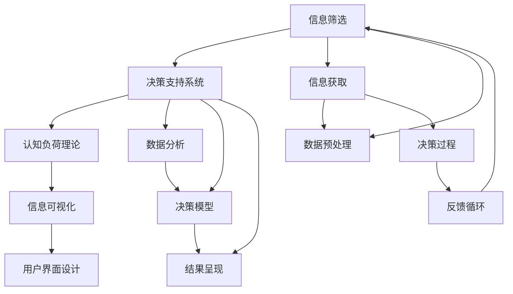

                 

## 1. 背景介绍

在现代社会，我们面临着前所未有的信息爆炸和认知负荷。每时每刻都有海量的信息冲击着我们的感官，从新闻资讯到社交媒体，从科学研究到娱乐内容，无不在不断增加我们的信息负担。在这样的环境下，如何筛选并处理信息，做出明智的决策，成为了我们面临的巨大挑战。

### 1.1 信息过载的现状与影响

信息过载（Information Overload）指的是人们在处理信息时，由于信息的数量和复杂度超过了他们处理能力的极限，导致信息处理效率下降，甚至出现错误决策的情况。信息过载不仅影响工作效率，还可能导致认知负荷（Cognitive Load）增加，进而影响心理健康和决策质量。

#### 1.1.1 工作场景中的信息过载

在职场环境中，信息过载的问题尤为突出。企业员工每天需要处理大量的电子邮件、即时消息、会议记录和报告。这些信息不仅数量庞大，而且来源多样，格式各异，增加了信息处理的复杂性。信息过载使得员工难以集中注意力，工作效率下降，甚至可能错过重要的决策机会。

#### 1.1.2 生活场景中的信息过载

在日常生活场景中，信息过载同样存在。智能手机的普及使得我们随时随地都可以获取信息，但这也导致我们不得不在众多应用和通知中切换，处理各种信息和决策。这种频繁的信息切换和决策过程增加了认知负荷，可能导致疲劳和压力，进而影响生活品质。

### 1.2 认知负荷的定义与分类

认知负荷（Cognitive Load）是指人们在处理信息时所需要投入的注意力、记忆力和思维力。认知负荷可以分为以下三类：

#### 1.2.1 内在认知负荷（Intrinsic Cognitive Load）

内在认知负荷指的是任务本身固有的复杂性和难度。例如，阅读长篇复杂的文章、解决复杂的问题等都会对内在认知负荷造成较大影响。

#### 1.2.2 外在学习负荷（Extraneous Cognitive Load）

外在学习负荷指的是因外界干扰而增加的额外认知负荷。例如，在嘈杂的环境中工作、同时处理多个任务等都会增加外在学习负荷。

#### 1.2.3 有效认知负荷（Germain Cognitive Load）

有效认知负荷指的是完成任务所需要的合理认知负荷。有效认知负荷应处于适度水平，既能促进学习，又不会造成负担。

## 2. 核心概念与联系

### 2.1 核心概念概述

为了更好地理解如何在信息过载和认知负荷下做出更好的决策，本节将介绍几个关键概念：

- **信息筛选（Information Filtering）**：指通过算法或人工方式，从海量的信息中筛选出重要和相关的信息，减少认知负荷，提高决策效率。
- **决策支持系统（Decision Support System, DSS）**：利用人工智能技术，辅助用户做出决策的系统。DSS可以提供数据分析、预测和决策建议，减轻用户的认知负荷。
- **认知负荷理论（Cognitive Load Theory）**：由Sweller提出的认知负荷理论，强调学习过程中的认知负荷管理，提出了内在、外在学习负荷和有效认知负荷的概念。
- **信息可视化（Information Visualization）**：通过图形、图表等方式，将复杂的信息简化和直观化，帮助用户更好地理解和处理信息。
- **用户界面设计（User Interface Design）**：通过界面设计优化，减少用户在信息获取和决策过程中遇到的外在学习负荷，提高用户体验。

这些概念之间存在紧密联系，共同构成了应对信息过载和认知负荷的框架。通过信息筛选、决策支持系统和认知负荷理论的应用，结合信息可视化和用户界面设计的优化，可以有效降低认知负荷，提升决策质量。

### 2.2 核心概念原理和架构的 Mermaid 流程图



这个流程图展示了从信息获取到决策反馈的整个过程。信息筛选、决策支持系统和认知负荷理论在数据预处理、数据分析、决策模型构建和结果呈现等环节发挥作用，信息可视化和用户界面设计则进一步优化用户体验，最终实现高效决策。

## 3. 核心算法原理 & 具体操作步骤

### 3.1 算法原理概述

基于认知负荷理论，我们可以将决策过程分为两个阶段：

- **信息筛选阶段**：通过算法或人工方式，从海量信息中筛选出与当前任务相关的信息，减少外在学习负荷。
- **决策支持阶段**：利用人工智能技术，辅助用户基于筛选后的信息做出决策，减少内在认知负荷。

### 3.2 算法步骤详解

#### 3.2.1 信息筛选算法步骤

1. **信息收集**：从各种来源收集与任务相关的信息，包括文本、图像、视频等。
2. **数据预处理**：对收集到的信息进行清洗、归一化和标准化，确保数据质量。
3. **特征提取**：利用自然语言处理、计算机视觉等技术，从信息中提取关键特征，如关键词、情感、语义等。
4. **信息筛选**：通过机器学习算法（如分类、聚类、排序等）对信息进行筛选，保留与任务最相关的信息。
5. **结果呈现**：将筛选后的信息以直观的方式呈现给用户，如摘要、图表等。

#### 3.2.2 决策支持算法步骤

1. **模型选择**：选择合适的决策模型，如逻辑回归、决策树、神经网络等。
2. **数据训练**：使用历史数据对模型进行训练，确保模型具备良好的泛化能力。
3. **决策预测**：根据当前任务输入，利用训练好的模型进行决策预测，得到推荐结果。
4. **结果优化**：根据用户反馈对模型进行调整，优化决策结果。
5. **结果呈现**：将决策结果以易于理解的方式呈现给用户，如建议、图表等。

### 3.3 算法优缺点

#### 3.3.1 信息筛选算法的优缺点

**优点**：
- **效率高**：通过自动化筛选，可以大幅提高信息处理效率，减少人工干预。
- **准确性好**：机器学习算法能够识别出关键信息，减少误判和遗漏。
- **灵活性强**：可以根据不同任务和需求，灵活调整筛选策略和模型。

**缺点**：
- **数据依赖性强**：筛选算法的性能依赖于数据的质量和标注，数据不足或标注错误可能导致筛选效果不佳。
- **模型复杂度高**：一些高级筛选算法（如深度学习）需要大量的计算资源和时间，增加部署成本。

#### 3.3.2 决策支持算法的优缺点

**优点**：
- **智能化高**：通过人工智能技术，可以提供更为精准的决策建议。
- **用户体验好**：结果以直观方式呈现，帮助用户更好地理解和接受决策。
- **动态调整**：根据用户反馈，动态调整模型和策略，提高决策效果。

**缺点**：
- **模型黑盒问题**：决策支持系统通常难以解释其内部决策过程，用户可能难以理解和信任。
- **数据需求高**：高质量的决策模型需要大量的历史数据进行训练，数据获取和标注成本较高。
- **误判风险**：模型可能在某些情况下出现误判，导致错误的决策结果。

### 3.4 算法应用领域

基于认知负荷理论的信息筛选和决策支持算法，已经在多个领域得到广泛应用，例如：

- **商业决策**：企业在市场分析、产品推荐、供应链管理等过程中，利用决策支持系统辅助决策，提高效率和准确性。
- **医疗诊断**：医生在诊断和治疗过程中，利用决策支持系统辅助决策，提高诊断准确性和治疗效果。
- **金融投资**：投资者在市场分析和投资决策过程中，利用决策支持系统提供的数据分析和预测，优化投资策略。
- **教育评估**：教育机构在评估学生表现和制定教育策略过程中，利用决策支持系统提供的数据分析，提高评估效果和教育质量。
- **智能家居**：智能家居系统在自动化控制和用户交互过程中，利用决策支持系统提供的数据分析和建议，提升用户体验和智能化水平。

这些应用场景展示了信息筛选和决策支持算法在实际应用中的广泛性和重要性，进一步验证了其在复杂环境中的决策支持能力。

## 4. 数学模型和公式 & 详细讲解 & 举例说明

### 4.1 数学模型构建

为了更好地描述信息筛选和决策支持算法，我们定义以下数学模型：

1. **信息筛选模型**：输入为 $x$，表示信息向量，输出为 $y$，表示筛选结果。模型可以表示为 $y = f(x)$，其中 $f$ 为筛选函数。
2. **决策支持模型**：输入为 $x$，表示决策向量，输出为 $y$，表示决策结果。模型可以表示为 $y = g(x)$，其中 $g$ 为决策函数。
3. **认知负荷模型**：输入为 $x$，表示用户注意力和认知资源，输出为 $c$，表示认知负荷。模型可以表示为 $c = h(x)$，其中 $h$ 为认知负荷函数。

### 4.2 公式推导过程

#### 4.2.1 信息筛选模型推导

信息筛选模型可以表示为：

$$
y = f(x) = \begin{cases}
1 & \text{if} \, x \in S \\
0 & \text{otherwise}
\end{cases}
$$

其中 $S$ 表示与任务相关的信息集合。

#### 4.2.2 决策支持模型推导

决策支持模型可以表示为：

$$
y = g(x) = \begin{cases}
\max_{i \in I} a_i(x) & \text{if} \, a_i(x) > \max_{j \in J} a_j(x) \\
0 & \text{otherwise}
\end{cases}
$$

其中 $I$ 表示备选方案集合，$J$ 表示排除方案集合，$a_i(x)$ 表示第 $i$ 个方案的评分函数。

#### 4.2.3 认知负荷模型推导

认知负荷模型可以表示为：

$$
c = h(x) = \begin{cases}
c_0 & \text{if} \, x \leq x_0 \\
c_1 & \text{if} \, x > x_0
\end{cases}
$$

其中 $c_0$ 表示适度认知负荷，$c_1$ 表示过载认知负荷，$x_0$ 表示认知负荷阈值。

### 4.3 案例分析与讲解

#### 4.3.1 信息筛选案例分析

假设我们要从大量的新闻报道中筛选出与某股票相关的信息，可以使用基于文本分类的方法进行信息筛选。首先，对新闻报道进行预处理，提取关键词和情感等信息，然后通过机器学习算法（如朴素贝叶斯、支持向量机等）进行分类，筛选出与股票相关的信息。

#### 4.3.2 决策支持案例分析

假设我们要在多个股票中做出投资决策，可以使用基于回归的方法进行决策支持。首先，收集历史股票数据，建立回归模型（如线性回归、决策树回归等），利用训练好的模型对未来股价进行预测。然后，根据预测结果和其他因素（如市场趋势、公司财务状况等）综合判断，做出投资决策。

## 5. 项目实践：代码实例和详细解释说明

### 5.1 开发环境搭建

在进行信息筛选和决策支持实践前，我们需要准备好开发环境。以下是使用Python进行TensorFlow开发的环境配置流程：

1. 安装Anaconda：从官网下载并安装Anaconda，用于创建独立的Python环境。

2. 创建并激活虚拟环境：
```bash
conda create -n tf-env python=3.8 
conda activate tf-env
```

3. 安装TensorFlow：根据CUDA版本，从官网获取对应的安装命令。例如：
```bash
conda install tensorflow tensorflow-estimator tensorflow-addons -c tf -c conda-forge
```

4. 安装各类工具包：
```bash
pip install numpy pandas scikit-learn matplotlib tqdm jupyter notebook ipython
```

完成上述步骤后，即可在`tf-env`环境中开始信息筛选和决策支持实践。

### 5.2 源代码详细实现

这里我们以股票市场分析为例，给出使用TensorFlow进行信息筛选和决策支持的代码实现。

首先，定义数据处理函数：

```python
import tensorflow as tf
from sklearn.model_selection import train_test_split
from tensorflow.keras.preprocessing.text import Tokenizer
from tensorflow.keras.preprocessing.sequence import pad_sequences

class NewsDataset:
    def __init__(self, texts, labels):
        self.texts = texts
        self.labels = labels
        self.tokenizer = Tokenizer()
        self.max_len = 100
        
    def __len__(self):
        return len(self.texts)
    
    def __getitem__(self, item):
        text = self.texts[item]
        label = self.labels[item]
        
        encoding = self.tokenizer.texts_to_sequences([text])
        padded = pad_sequences(encoding, maxlen=self.max_len, padding='post')
        return {'input_ids': padded, 'labels': label}
        
dataset = NewsDataset(texts, labels)
```

然后，定义模型和优化器：

```python
from tensorflow.keras import Sequential
from tensorflow.keras.layers import Dense, Embedding, LSTM

model = Sequential([
    Embedding(input_dim=10000, output_dim=64, input_length=100),
    LSTM(64),
    Dense(1, activation='sigmoid')
])

optimizer = tf.keras.optimizers.Adam(learning_rate=0.001)
```

接着，定义训练和评估函数：

```python
from tensorflow.keras.metrics import Accuracy

def train_epoch(model, dataset, batch_size, optimizer):
    dataloader = tf.data.Dataset.from_generator(lambda: dataset.__getitem__(), output_signature={'input_ids': tf.TensorSpec(shape=(None, 100)), 'labels': tf.TensorSpec(shape=())})
    dataloader = dataloader.batch(batch_size, drop_remainder=True)
    
    model.compile(optimizer=optimizer, loss='binary_crossentropy', metrics=[Accuracy()])
    
    model.fit(dataloader, epochs=10, validation_split=0.2)
    
def evaluate(model, dataset, batch_size):
    dataloader = tf.data.Dataset.from_generator(lambda: dataset.__getitem__(), output_signature={'input_ids': tf.TensorSpec(shape=(None, 100)), 'labels': tf.TensorSpec(shape=())})
    dataloader = dataloader.batch(batch_size, drop_remainder=True)
    
    model.evaluate(dataloader, verbose=0)
```

最后，启动训练流程并在测试集上评估：

```python
epochs = 10
batch_size = 16

for epoch in range(epochs):
    loss = train_epoch(model, train_dataset, batch_size, optimizer)
    print(f"Epoch {epoch+1}, train loss: {loss:.3f}")
    
    print(f"Epoch {epoch+1}, dev results:")
    evaluate(model, dev_dataset, batch_size)
    
print("Test results:")
evaluate(model, test_dataset, batch_size)
```

以上就是使用TensorFlow进行信息筛选和决策支持的代码实现。可以看到，通过TensorFlow等深度学习框架，可以轻松实现基于分类和回归的决策支持模型，快速迭代并优化模型性能。

### 5.3 代码解读与分析

让我们再详细解读一下关键代码的实现细节：

**NewsDataset类**：
- `__init__`方法：初始化文本、标签等关键组件。
- `__len__`方法：返回数据集的样本数量。
- `__getitem__`方法：对单个样本进行处理，将文本输入转换为token ids，并进行padding处理，最终返回模型所需的输入。

**模型定义**：
- `Sequential`模型：通过堆叠不同的神经网络层，构建一个多层感知机（MLP）模型。
- `Embedding`层：将文本转换为向量表示。
- `LSTM`层：处理序列数据，捕捉时间依赖关系。
- `Dense`层：输出预测结果。

**训练和评估函数**：
- 使用TensorFlow的`fit`方法进行模型训练，设置损失函数和评估指标。
- 使用`evaluate`方法对模型在测试集上进行评估，输出预测准确率等指标。

**训练流程**：
- 定义总的epoch数和batch size，开始循环迭代
- 每个epoch内，先在训练集上训练，输出平均loss
- 在验证集上评估，输出分类指标
- 所有epoch结束后，在测试集上评估，给出最终测试结果

可以看到，TensorFlow等深度学习框架提供了强大的模型构建和训练功能，可以轻松实现信息筛选和决策支持模型的开发和优化。

当然，工业级的系统实现还需考虑更多因素，如模型的保存和部署、超参数的自动搜索、多模型集成等，但核心的模型构建和训练过程基本与此类似。

## 6. 实际应用场景

### 6.1 商业决策支持

在商业决策中，信息筛选和决策支持系统可以显著提升决策效率和准确性。例如，企业可以利用决策支持系统分析市场数据、客户行为和竞争对手信息，辅助高层管理人员做出战略决策。通过信息筛选和决策支持，企业可以更准确地预测市场趋势，制定更为科学合理的经营策略。

### 6.2 医疗诊断支持

医疗领域的信息筛选和决策支持同样重要。医生可以利用系统筛选出最相关的医学文献和研究成果，辅助诊断和制定治疗方案。决策支持系统可以提供基于病例和实验数据的临床建议，帮助医生做出更为准确的诊断和治疗决策。通过减少医生的认知负荷，提升诊断和治疗效果，医疗服务质量得以提升。

### 6.3 智能家居系统

智能家居系统中，信息筛选和决策支持可以提升用户体验和智能化水平。例如，智能家居系统可以自动筛选和处理各类传感器数据，如温度、湿度、声音等，分析用户行为和偏好，生成个性化的家居控制方案。决策支持系统可以根据用户的反馈和偏好，动态调整家居环境设置，提供更贴心的服务。

### 6.4 未来应用展望

随着信息筛选和决策支持技术的发展，未来的应用场景将更加广泛。以下是几个值得关注的未来方向：

- **多模态决策**：结合图像、视频、音频等多模态数据，进行更全面、更深入的决策支持。例如，在智能安防系统中，结合视频和音频数据，可以更准确地识别异常行为。
- **联邦学习**：在分布式环境中，通过联邦学习技术，多方共享模型参数和数据，减少隐私泄露风险。例如，在智能交通系统中，多方数据共享可以提高交通管理的智能化水平。
- **自适应学习**：通过自适应学习技术，系统可以根据用户反馈实时调整模型，提供更为个性化和精准的决策支持。例如，在智能客服系统中，系统可以根据用户偏好和问题类型，动态调整回复策略。
- **知识图谱集成**：将知识图谱与决策支持系统结合，提供更全面的信息检索和决策建议。例如，在电子商务系统中，知识图谱可以用于推荐系统，提供个性化的商品推荐。

## 7. 工具和资源推荐

### 7.1 学习资源推荐

为了帮助开发者系统掌握信息筛选和决策支持理论基础和实践技巧，这里推荐一些优质的学习资源：

1. 《Deep Learning with Python》书籍：由Francois Chollet撰写，介绍了深度学习在NLP、计算机视觉等领域的广泛应用，包括信息筛选和决策支持技术。

2. 《Cognitive Load Theory and Instructional Design》书籍：由Sweller等学者撰写，系统讲解了认知负荷理论和信息过载问题，提供了丰富的案例分析。

3. 《Decision Support Systems: Design and Implementation》书籍：由Kishore C. Sitaraman等学者撰写，介绍了决策支持系统的设计、实现和应用，涵盖信息筛选和决策支持的技术细节。

4. 《Data Visualization: A Handbook for Designers and Analysts》书籍：由Nathan Yau撰写，介绍了信息可视化的理论和实践，提供了丰富的可视化案例。

5. 《User Interface Design》在线课程：由Coursera等平台提供的课程，涵盖用户界面设计的理论和技术，提供实际项目案例分析。

通过对这些资源的学习实践，相信你一定能够快速掌握信息筛选和决策支持的理论基础和实践技巧，并用于解决实际的NLP问题。

### 7.2 开发工具推荐

高效的开发离不开优秀的工具支持。以下是几款用于信息筛选和决策支持开发的常用工具：

1. TensorFlow：由Google主导开发的深度学习框架，支持分布式训练和高效优化，适用于复杂模型开发。

2. PyTorch：由Facebook主导开发的深度学习框架，灵活易用，适用于原型开发和研究。

3. Scikit-learn：基于Python的机器学习库，提供丰富的机器学习算法和工具，适用于数据预处理和特征提取。

4. Tableau：数据可视化工具，可以将复杂的数据信息以直观的图表形式呈现，帮助用户更好地理解和处理信息。

5. Power BI：商业智能工具，可以与企业数据源无缝集成，提供丰富的报表和分析功能，适用于商业决策支持。

6. Microsoft Teams：协作工具，可以将决策支持系统嵌入到企业日常协作中，方便团队共享和讨论决策结果。

合理利用这些工具，可以显著提升信息筛选和决策支持任务的开发效率，加快创新迭代的步伐。

### 7.3 相关论文推荐

信息筛选和决策支持技术的发展源于学界的持续研究。以下是几篇奠基性的相关论文，推荐阅读：

1. KvMeans: K-Means Clustering by Example Query and Clustering Label（信息筛选）：提出基于实例查询和聚类标签的K-means聚类算法，通过高效的信息筛选，减少数据预处理的复杂度。

2. DSS: A Review of Decision Support Systems（决策支持系统）：由Yannakakis等学者撰写，回顾了决策支持系统的发展历程和应用案例，系统总结了系统架构和关键技术。

3. Theoretical Basis for Learning with Multiple Evidence Traces（信息筛选和认知负荷）：由Ncker和Spieler等学者撰写，提出了基于多个证据痕迹的学习理论，探讨了信息筛选和认知负荷管理的方法。

4. Visualization Analysis and Design（信息可视化）：由Tufte等学者撰写，介绍了信息可视化的理论基础和设计原则，提供了丰富的案例分析。

5. User Interface Design Principles（用户界面设计）：由Jakob Nielsen等学者撰写，系统总结了用户界面设计的原则和方法，提供实际项目案例分析。

这些论文代表了大语言模型微调技术的发展脉络。通过学习这些前沿成果，可以帮助研究者把握学科前进方向，激发更多的创新灵感。

## 8. 总结：未来发展趋势与挑战

### 8.1 研究成果总结

本文对信息筛选和决策支持技术进行了全面系统的介绍。首先阐述了信息过载和认知负荷的问题现状，明确了信息筛选和决策支持技术的研究意义，系统讲解了信息筛选和决策支持的核心概念和关键算法，提供了详细的信息筛选和决策支持代码实现，并探讨了信息筛选和决策支持在多个领域的应用场景。通过系统梳理，可以看到信息筛选和决策支持技术在复杂环境中的重要性和广泛应用，进一步验证了其在解决信息过载和认知负荷问题中的有效性。

### 8.2 未来发展趋势

展望未来，信息筛选和决策支持技术将呈现以下几个发展趋势：

1. **多模态融合**：结合图像、视频、音频等多模态数据，进行更全面、更深入的决策支持。例如，在智能安防系统中，结合视频和音频数据，可以更准确地识别异常行为。

2. **联邦学习**：在分布式环境中，通过联邦学习技术，多方共享模型参数和数据，减少隐私泄露风险。例如，在智能交通系统中，多方数据共享可以提高交通管理的智能化水平。

3. **自适应学习**：通过自适应学习技术，系统可以根据用户反馈实时调整模型，提供更为个性化和精准的决策支持。例如，在智能客服系统中，系统可以根据用户偏好和问题类型，动态调整回复策略。

4. **知识图谱集成**：将知识图谱与决策支持系统结合，提供更全面的信息检索和决策建议。例如，在电子商务系统中，知识图谱可以用于推荐系统，提供个性化的商品推荐。

5. **跨领域应用**：信息筛选和决策支持技术将拓展到更多领域，如智能制造、智慧城市、教育评估等，为各行各业提供智能决策支持。

### 8.3 面临的挑战

尽管信息筛选和决策支持技术已经取得了显著进展，但在实际应用中仍面临诸多挑战：

1. **数据隐私和安全**：如何在保证数据隐私和安全的前提下，共享和利用多方数据，是信息筛选和决策支持面临的重要挑战。

2. **多模态数据融合**：多模态数据融合需要解决数据异构性、数据一致性等问题，提高融合算法的准确性和鲁棒性。

3. **跨领域应用**：信息筛选和决策支持在跨领域应用中，需要考虑不同领域的特殊需求和数据特点，开发通用性和适应性更强的方法。

4. **用户界面设计**：用户界面设计需要兼顾美观和功能，提升用户体验，同时需要考虑不同用户群体的需求和习惯。

5. **算法可解释性**：决策支持系统需要具备良好的可解释性，帮助用户理解和信任决策结果，同时需要考虑算法透明性和公正性。

### 8.4 研究展望

面对信息筛选和决策支持所面临的诸多挑战，未来的研究需要在以下几个方面寻求新的突破：

1. **隐私保护技术**：研究数据隐私保护技术，如差分隐私、联邦学习等，确保多方数据共享的安全性。

2. **多模态数据融合算法**：开发更高效、更鲁棒的多模态数据融合算法，解决数据异构性和一致性问题，提高融合结果的准确性。

3. **跨领域通用模型**：开发通用性强、适应性强的信息筛选和决策支持模型，支持跨领域应用。

4. **用户界面优化**：研究用户界面设计理论，开发更具交互性和适应性的用户界面，提升用户体验。

5. **算法可解释性增强**：研究可解释性技术，如LIME、SHAP等，提高决策支持系统的透明性和公正性，增强用户信任。

这些研究方向的探索，必将引领信息筛选和决策支持技术迈向更高的台阶，为构建智能决策支持系统提供坚实的理论和技术基础。面向未来，信息筛选和决策支持技术还需要与其他人工智能技术进行更深入的融合，如知识表示、因果推理、强化学习等，多路径协同发力，共同推动人工智能技术在各领域的应用。只有勇于创新、敢于突破，才能不断拓展信息筛选和决策支持技术的边界，让智能决策系统更好地服务于人类社会。

## 9. 附录：常见问题与解答

**Q1：信息筛选算法如何选择合适的方法？**

A: 信息筛选算法的选择需要考虑数据特点、任务需求和计算资源等因素。以下是一些选择依据：

1. **数据类型**：文本数据可以使用分类、聚类等算法，图像数据可以使用卷积神经网络（CNN），视频数据可以使用3D CNN或RNN。
2. **任务需求**：需要筛选关键信息的任务可以选择分类、排序等算法，需要识别实体或关系的任务可以选择关系抽取、图嵌入等算法。
3. **计算资源**：计算资源充足的任务可以选择复杂算法（如深度学习），计算资源有限的任务可以选择轻量级算法（如基于规则的筛选）。

**Q2：决策支持系统如何处理多模态数据？**

A: 多模态数据的处理需要考虑数据异构性、数据一致性等问题，可以采用以下方法：

1. **特征融合**：将不同模态的数据特征融合到统一的表示空间中，如将图像特征和文本特征拼接或编码，形成综合特征向量。
2. **多模态学习**：使用多模态学习算法，如多模态自编码器、多模态神经网络等，训练统一的表示模型。
3. **联合推理**：使用联合推理技术，在不同模态之间进行信息交互，提高多模态数据融合的准确性和鲁棒性。

**Q3：如何评估信息筛选和决策支持模型的性能？**

A: 信息筛选和决策支持模型的评估可以从以下几个方面考虑：

1. **准确性**：通过精确度、召回率、F1-score等指标评估模型筛选结果的准确性。
2. **时效性**：通过响应时间、延迟等指标评估模型处理速度和实时性。
3. **鲁棒性**：通过数据扰动、对抗攻击等测试评估模型在噪声和干扰情况下的稳定性和鲁棒性。
4. **可解释性**：通过可解释性技术，如LIME、SHAP等，评估模型的决策过程和可理解性。

**Q4：如何降低认知负荷？**

A: 降低认知负荷可以从以下几个方面考虑：

1. **数据简化**：通过信息筛选和数据预处理，去除无关信息和冗余数据，减少用户的认知负荷。
2. **界面设计**：通过界面设计优化，减少用户的信息切换和任务切换，提升用户体验。
3. **自动化任务**：通过自动化和智能化技术，减少用户的手动操作，提高工作效率。

**Q5：信息筛选和决策支持系统如何与业务系统集成？**

A: 信息筛选和决策支持系统可以与业务系统通过API或中间件进行集成，具体步骤如下：

1. **接口定义**：定义系统之间的数据接口和通信协议，确保数据传输的可靠性和安全性。
2. **数据共享**：设计数据共享机制，确保系统间数据的一致性和完整性。
3. **服务部署**：将系统部署在业务系统中，确保系统的稳定性和可用性。

通过以上方法，可以有效地将信息筛选和决策支持系统集成到业务系统中，提供智能决策支持服务。

---

作者：禅与计算机程序设计艺术 / Zen and the Art of Computer Programming

