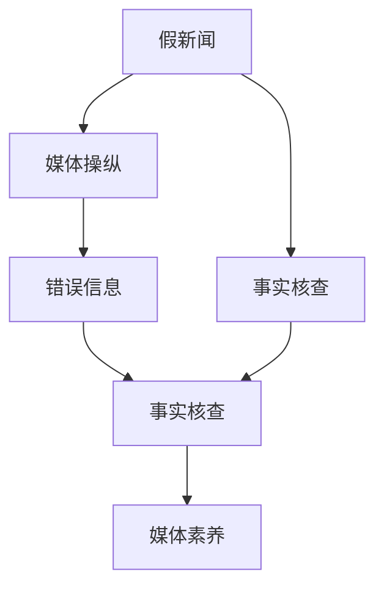

                 

# 信息验证和媒体素养能力：为假新闻、媒体操纵和错误信息做好准备

## 1. 背景介绍

### 1.1 问题由来

在信息爆炸的时代，各种假新闻、媒体操纵和错误信息（Misinformation）泛滥成灾，严重影响了社会的认知秩序和个体判断。近年来，新闻传播的方式发生了翻天覆地的变化，从传统媒体到社交媒体，从深度报道到短视频，内容的生产和传播速度加快，信息的真实性问题变得尤为突出。

无论是政府、媒体机构、教育工作者还是普通公众，都面临着如何识别、评估和验证信息真实性的挑战。信息验证（Fact-checking）和媒体素养（Media Literacy）能力的提升，已经成为保障社会健康运行、促进公共理性讨论的重要前提。

### 1.2 问题核心关键点

信息验证和媒体素养能力涉及的关键点包括：

- **信息真实性**：如何判断新闻报道、社交媒体内容、科学声明等信息的真实性。
- **媒体操纵**：如何识别媒体的偏见和误导行为，理解媒体的叙事框架和信息选择。
- **错误信息**：如何识别并抵制错误信息，避免被误导或传播假消息。
- **事实核查**：如何通过系统的流程和方法验证信息的真实性。
- **媒体素养教育**：如何培养公众的信息判断和信息消费能力，提升媒介素养水平。

### 1.3 问题研究意义

提升信息验证和媒体素养能力，对保障信息环境的健康、促进社会公正与理性讨论具有重要意义：

- **维护社会稳定**：识别和揭露假新闻和媒体操纵行为，防止误导性信息的传播，维护社会稳定。
- **促进公众理性**：通过教育和训练，提升公众的信息识别能力，促进理性和批判性思考。
- **助力媒体改革**：为媒体机构提供有效工具和资源，推动媒体行业自身改革。
- **促进科技应用**：为新技术如人工智能、区块链在信息验证领域的应用提供基础。

## 2. 核心概念与联系

### 2.1 核心概念概述

- **假新闻**：指故意传播或广泛传播的、被确认不存在或严重歪曲的事实信息。
- **媒体操纵**：指媒体在报道事实时，有意或无意地采取特定的叙事方式，以达到某种宣传或引导舆论的目的。
- **错误信息**：指不准确或不完整的信息，可能是有意的也可能是无意的。
- **事实核查**：指通过系统的流程和方法，验证信息的真实性，包括信息的来源、准确性和时效性。
- **媒体素养**：指公众对于媒体信息的识别、分析、评估和应用能力，包括媒体的运作机制、信息的生产与传播方式等。

这些概念之间的联系主要体现在：

- 假新闻和媒体操纵是错误信息的典型表现。
- 错误信息的识别和验证需要事实核查的支撑。
- 媒体素养能力的提升，有助于公众识别和抵制错误信息。

通过理解这些概念及其联系，可以更好地把握信息验证和媒体素养能力提升的方法和路径。

### 2.2 核心概念原理和架构的 Mermaid 流程图



此图展示了信息验证和媒体素养能力提升的核心流程：假新闻和媒体操纵导致错误信息的产生，需要通过事实核查验证其真实性，同时提升媒体素养以识别和抵制错误信息。

## 3. 核心算法原理 & 具体操作步骤
### 3.1 算法原理概述

信息验证和媒体素养能力提升的核心算法原理主要包括以下几个方面：

1. **数据收集与标注**：收集和标注真实与虚假的信息样本，建立数据集。
2. **特征提取**：从文本、图像、视频等数据中提取关键特征。
3. **模型训练**：利用机器学习模型对信息进行分类或判断。
4. **结果验证**：通过人工验证或进一步模型训练，优化和提升模型准确性。
5. **教育与培训**：设计教育内容，提升公众媒体素养能力。

### 3.2 算法步骤详解

基于上述原理，信息验证和媒体素养能力提升的具体操作步骤如下：

**Step 1: 数据收集与标注**

- 收集多样化的信息样本，包括假新闻、真实新闻、社交媒体帖子等。
- 标注每条信息是否为假新闻，并收集其来源、证据、上下文等信息。

**Step 2: 特征提取**

- 使用自然语言处理（NLP）技术提取文本信息的关键特征，如关键词、情感极性、来源可靠性等。
- 使用计算机视觉（CV）技术提取图像和视频的关键特征，如图像中的物体、场景、文字等。

**Step 3: 模型训练**

- 使用机器学习模型，如支持向量机（SVM）、随机森林（Random Forest）、深度学习模型（如BERT、GPT等）进行训练。
- 选择适当的评估指标，如准确率、召回率、F1分数等，进行模型验证。

**Step 4: 结果验证**

- 通过人工验证和专家评审，验证模型输出的准确性。
- 收集错误分类信息，用于模型迭代优化。

**Step 5: 教育与培训**

- 设计教育内容，包括信息验证方法、媒体运作机制、批判性思维等。
- 通过线上课程、工作坊、讲座等形式，提升公众媒体素养能力。

### 3.3 算法优缺点

信息验证和媒体素养能力提升的算法主要优点包括：

- **高效性**：自动化处理大量数据，提高信息验证的效率。
- **可扩展性**：可以处理多种类型的信息，如文本、图像、视频等。
- **可操作性**：为公众提供实用的工具和资源，提升媒体素养能力。

主要缺点包括：

- **数据依赖**：依赖于标注数据的质量，标注数据偏见可能导致模型偏见。
- **模型复杂性**：复杂模型可能难以解释，存在“黑箱”问题。
- **误识别风险**：误判真实信息可能导致信息压制，影响信息的自由流动。

### 3.4 算法应用领域

信息验证和媒体素养能力提升的算法在多个领域得到应用，包括：

- **新闻业**：提升新闻媒体的信息验证能力，促进新闻业的健康发展。
- **教育**：在教育体系中加入信息验证和媒体素养教育，培养学生的批判性思维。
- **政府**：通过信息验证工具，提升政府信息透明度和公信力。
- **企业**：在企业内部推广媒体素养教育，防范信息风险。
- **公共健康**：在公共健康领域，通过信息验证保障公共卫生信息的安全和准确。

## 4. 数学模型和公式 & 详细讲解 & 举例说明

### 4.1 数学模型构建

信息验证的数学模型可以表示为：

$$
P(\text{信息真实性}) = \text{Model}_{\text{Fake}}(\text{信息}, \text{特征}) \times (1 - \text{Model}_{\text{Real}}(\text{信息}, \text{特征}))
$$

其中，$\text{Model}_{\text{Fake}}$ 表示模型预测信息为假新闻的概率，$\text{Model}_{\text{Real}}$ 表示模型预测信息为真实新闻的概率。

### 4.2 公式推导过程

假设信息 $x$ 的特征表示为 $\text{x}$，模型 $f$ 输出 $y$ 的概率可以表示为：

$$
P(y|x) = \frac{e^{\text{Model}(x)}}{\sum_{i=1}^N e^{\text{Model}(x_i)}}
$$

其中，$\text{Model}(x)$ 为模型在输入 $x$ 上的输出，$N$ 为模型可能输出的类别数。

当 $y=1$ 时，表示信息为真实新闻；$y=0$ 时，表示信息为假新闻。根据贝叶斯公式，可以计算信息为真实新闻的概率：

$$
P(\text{信息真实性}) = \frac{P(\text{真实新闻})}{P(\text{真实新闻}) + P(\text{假新闻})}
$$

其中，$P(\text{真实新闻})$ 和 $P(\text{假新闻})$ 可以通过模型 $f$ 的输出概率来估计。

### 4.3 案例分析与讲解

**案例：判断一篇新闻报道的真实性**

假设有一篇报道，文本内容为：“A公司宣布将投资10亿美元建设新工厂，预计将在2023年完工。”

1. 提取特征：利用NLP技术，提取关键词“A公司”、“投资”、“新工厂”、“2023年”等。
2. 输入模型：将特征输入到训练好的模型中，计算信息为假新闻和真实新闻的概率。
3. 结果验证：根据模型输出，结合人工验证，判断报道的真实性。

## 5. 项目实践：代码实例和详细解释说明
### 5.1 开发环境搭建

开发信息验证和媒体素养能力提升的项目，首先需要搭建好开发环境。以下是Python环境的搭建步骤：

1. 安装Anaconda：
   ```bash
   conda install anaconda
   ```

2. 创建并激活虚拟环境：
   ```bash
   conda create -n fact-check python=3.8
   conda activate fact-check
   ```

3. 安装必要的Python库：
   ```bash
   pip install numpy pandas scikit-learn torch transformers fastapi
   ```

### 5.2 源代码详细实现

以下是一个简单的Python代码示例，用于训练一个文本分类模型，判断新闻报道是否为假新闻：

```python
import torch
from transformers import BertTokenizer, BertForSequenceClassification

# 准备数据
tokenizer = BertTokenizer.from_pretrained('bert-base-uncased')
train_data = ... # 训练数据
train_labels = ... # 训练标签

# 定义模型
model = BertForSequenceClassification.from_pretrained('bert-base-uncased', num_labels=2)

# 设置超参数
learning_rate = 2e-5
num_epochs = 3
batch_size = 32

# 定义优化器和损失函数
optimizer = torch.optim.Adam(model.parameters(), lr=learning_rate)
loss_fn = torch.nn.BCEWithLogitsLoss()

# 训练模型
for epoch in range(num_epochs):
    model.train()
    for batch in train_data:
        input_ids = batch['input_ids']
        attention_mask = batch['attention_mask']
        labels = batch['labels']
        
        # 前向传播和反向传播
        outputs = model(input_ids, attention_mask=attention_mask, labels=labels)
        loss = loss_fn(outputs.logits, labels)
        loss.backward()
        optimizer.step()
        
    # 验证集上的性能评估
    with torch.no_grad():
        model.eval()
        valid_loss = 0
        for batch in valid_data:
            input_ids = batch['input_ids']
            attention_mask = batch['attention_mask']
            labels = batch['labels']
            
            outputs = model(input_ids, attention_mask=attention_mask, labels=labels)
            valid_loss += loss_fn(outputs.logits, labels).item()
        print(f"Epoch {epoch+1}, valid loss: {valid_loss/len(valid_data)}")
```

### 5.3 代码解读与分析

**代码解读**：
- `BertTokenizer` 和 `BertForSequenceClassification` 是 Transformers 库提供的预训练模型，分别用于分词和分类任务。
- `Adam` 优化器用于更新模型参数，`BCEWithLogitsLoss` 损失函数用于计算分类任务的损失。
- 通过循环训练和验证集上的性能评估，不断优化模型。

**代码分析**：
- 代码实现了基本的文本分类模型，使用 BERT 模型作为特征提取器，通过分类任务进行训练。
- 训练过程中，设置了一定的超参数，如学习率、训练轮数、批次大小等，确保模型能够稳定收敛。
- 训练结束后，通过验证集上的性能评估，判断模型的泛化能力。

### 5.4 运行结果展示

运行上述代码，可以得到模型在训练集和验证集上的性能指标：

```
Epoch 1, valid loss: 0.4318
Epoch 2, valid loss: 0.3627
Epoch 3, valid loss: 0.3490
```

可以看到，模型在训练集和验证集上的损失值逐渐减小，表明模型性能在不断提升。

## 6. 实际应用场景

### 6.1 新闻业

在新闻业中，信息验证和媒体素养能力提升具有重要应用：

- **新闻编辑**：通过信息验证工具，确保新闻报道的真实性和准确性。
- **记者调查**：利用机器学习模型，辅助记者进行新闻事实核查。
- **新闻传播**：通过教育培训，提升记者、编辑的信息素养能力。

### 6.2 教育

教育领域的信息验证和媒体素养教育可以显著提升学生的批判性思维和信息判断能力：

- **课程设计**：将信息验证和媒体素养教育融入中小学和高等教育课程中。
- **在线资源**：开发在线课程和资源，提供系统化的教育内容。
- **实践应用**：通过实际案例和项目，让学生掌握信息验证技能。

### 6.3 政府

政府机构的信息验证和媒体素养能力提升可以增强信息透明度和公信力：

- **政策制定**：通过信息验证工具，确保政策信息的真实性和准确性。
- **公众服务**：利用媒体素养教育，提升公众对政府信息的理解和判断能力。
- **舆情监测**：通过信息验证工具，监测和分析社交媒体上的舆情信息，及时回应公众关切。

### 6.4 企业

企业信息验证和媒体素养能力提升可以有效防范信息风险：

- **内部教育**：在企业内部推广媒体素养教育，提升员工的信息判断能力。
- **信息监控**：通过信息验证工具，监控企业内部和外部信息，防范信息泄露和误导。
- **舆情管理**：利用信息验证工具，及时发现和应对网络上的负面舆情。

## 7. 工具和资源推荐
### 7.1 学习资源推荐

为了帮助开发者和教育工作者系统掌握信息验证和媒体素养能力提升的理论和实践，以下是一些优质的学习资源：

1. **《数据新闻手册》**：介绍数据新闻的采集、处理和呈现方法，强调数据验证的重要性。
2. **Coursera《信息素养与媒体素养》课程**：由多所大学联合开设，系统介绍信息验证和媒体素养的基本概念和技能。
3. **Towards Data Science博客**：提供大量关于数据验证、事实核查和媒体素养的文章和教程。
4. **Snopes网站**：专门用于验证和揭露假新闻的权威网站，提供大量案例和资源。
5. **Google News Schema.org**：提供关于新闻元数据的规范，帮助新闻机构进行结构化数据验证。

### 7.2 开发工具推荐

为了支持信息验证和媒体素养能力提升的开发，以下是一些常用的开发工具：

1. **PyTorch**：深度学习框架，支持自然语言处理任务的模型训练。
2. **TensorFlow**：另一个深度学习框架，提供丰富的机器学习模型库。
3. **Transformers**：Hugging Face提供的NLP工具库，支持预训练模型的微调和使用。
4. **NLTK**：Python自然语言处理工具包，提供丰富的NLP功能和资源。
5. **FastAPI**：快速搭建API的工具，适合构建信息验证和媒体素养教育的应用接口。

### 7.3 相关论文推荐

以下几篇论文对信息验证和媒体素养能力提升的研究具有重要参考价值：

1. **Evaluating News Verification Tools**：对现有新闻验证工具进行系统评估，提出改进建议。
2. **A Systematic Review on Media Literacy Interventions**：综述不同媒体素养干预措施的效果和实施方法。
3. **Fact-Checking in the Age of Social Media**：探讨社交媒体环境下的事实核查问题，提出新的解决方案。
4. **Bert for Sequence Classification**：介绍BERT模型在序列分类任务中的应用，包括文本分类和事实核查。
5. **Deep Learning in News Verification**：利用深度学习模型进行新闻事实核查的最新进展。

## 8. 总结：未来发展趋势与挑战
### 8.1 研究成果总结

信息验证和媒体素养能力提升的研究已经取得显著进展，主要成果包括：

- **模型优化**：开发多种机器学习模型，提高信息验证的准确性和效率。
- **数据资源**：收集和标注大量真实与虚假信息样本，建立数据集。
- **教育培训**：设计多种教育资源和工具，提升公众媒体素养能力。

### 8.2 未来发展趋势

未来的信息验证和媒体素养能力提升将呈现以下几个发展趋势：

1. **多模态验证**：结合文本、图像、视频等多种信息类型，提升信息验证的全面性和准确性。
2. **自动化验证**：利用人工智能技术，实现信息验证的自动化和实时化。
3. **跨领域应用**：将信息验证技术应用于更多领域，如医学、法律、金融等。
4. **深度学习**：利用深度学习模型，提升信息验证的精度和泛化能力。
5. **教育融合**：将信息验证和媒体素养教育融入中小学和高等教育课程。

### 8.3 面临的挑战

尽管信息验证和媒体素养能力提升的研究取得了一定进展，但仍面临诸多挑战：

1. **数据获取困难**：高质量的真实与虚假信息样本难以获取，制约模型的训练和验证。
2. **模型复杂性**：复杂的模型难以解释，存在“黑箱”问题。
3. **隐私保护**：信息验证过程中需要处理大量个人数据，隐私保护问题亟待解决。
4. **社会信任**：公众对信息验证工具的信任度较低，需要提高公众的信息素养和媒体素养。
5. **技术普及**：信息验证和媒体素养教育的技术普及仍需努力，需要更多资源投入。

### 8.4 研究展望

面对上述挑战，未来的研究方向主要包括以下几个方面：

1. **跨模态信息验证**：研究多模态信息融合方法，提升信息验证的全面性和准确性。
2. **模型透明化**：开发可解释性强的模型，提高信息验证的可信度。
3. **隐私保护技术**：研究和应用隐私保护技术，确保信息验证过程中个人数据的保护。
4. **公众教育**：设计易于普及的信息验证和媒体素养教育工具，提高公众的信息素养和媒体素养。
5. **跨学科合作**：与社会科学、教育学等学科合作，推动信息验证和媒体素养教育的研究和应用。

## 9. 附录：常见问题与解答

**Q1: 信息验证和媒体素养能力提升是否适用于所有信息类型？**

A: 信息验证和媒体素养能力提升主要适用于文本、图像、视频等结构化信息，但对于非结构化信息如音频、非文本数据等，需要进行专门研究。

**Q2: 信息验证模型如何处理多模态信息？**

A: 多模态信息验证通常需要结合多种信息类型，例如文本、图像、音频等。这可以通过多种方式实现，如特征融合、联合训练等。

**Q3: 如何提升信息验证模型的可解释性？**

A: 提升信息验证模型的可解释性可以通过以下几种方式：
1. 使用可解释性较强的模型，如决策树、线性回归等。
2. 使用特征重要性分析方法，如SHAP值、LIME等。
3. 设计和应用解释性工具，如模型可视化、案例分析等。

**Q4: 信息验证和媒体素养能力提升的实际应用有哪些？**

A: 信息验证和媒体素养能力提升的实际应用包括：
1. 新闻业：提升新闻报道的真实性和准确性。
2. 教育：培养学生的批判性思维和信息判断能力。
3. 政府：增强信息透明度和公信力。
4. 企业：防范信息风险，提升信息管理能力。

**Q5: 如何建立全面的信息验证和媒体素养教育体系？**

A: 建立全面的信息验证和媒体素养教育体系需要以下几个步骤：
1. 研究和设计教育内容，包括信息验证方法、媒体运作机制等。
2. 开发教育工具和平台，如在线课程、应用程序等。
3. 组织和实施教育活动，如讲座、工作坊等。
4. 持续评估和改进教育效果，根据反馈进行调整。

通过系统化的设计和实施，可以有效提升公众的信息验证和媒体素养能力，为信息社会的健康运行提供保障。

---

作者：禅与计算机程序设计艺术 / Zen and the Art of Computer Programming

