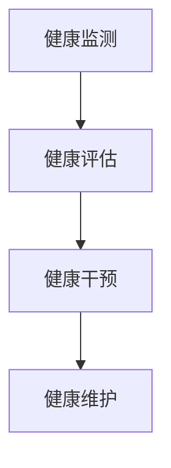

                 

# 健康管理的意识：如何拥有健康的生活方式？

在现代快节奏的生活中，健康管理成为了越来越多人的关注点。但是，如何科学有效地进行健康管理，才能真正拥有健康的生活方式呢？本文将从背景介绍、核心概念、核心算法原理、数学模型、项目实践、应用场景、工具和资源推荐、总结与展望、附录等方面，深入探讨如何通过科学的健康管理手段，实现健康的生活方式。

## 1. 背景介绍

### 1.1 问题由来

随着经济的发展和社会的进步，人们的生活节奏越来越快，压力也越来越大。长期的高强度工作和生活的压力，对人的身心健康产生了负面影响。越来越多的人开始关注健康管理，希望通过科学的健康管理手段，提升生活质量，延长寿命。但是，如何科学地进行健康管理，仍然是很多人面临的问题。

### 1.2 问题核心关键点

健康管理的关键在于如何科学地进行健康监测、健康评估、健康干预和健康维护。科学健康管理不仅包括身体的健康，还包括心理和社会的健康。科学健康管理需要综合考虑个体的身体状况、心理状态、生活方式和社会环境等因素，制定个性化的健康管理方案。

## 2. 核心概念与联系

### 2.1 核心概念概述

为更好地理解如何科学地进行健康管理，本节将介绍几个密切相关的核心概念：

- **健康监测**：通过传感器、智能穿戴设备等技术手段，实时监测个体的生理指标，如心率、血压、血糖等。
- **健康评估**：根据个体历史健康数据、当前生理指标和生活习惯等，对个体的健康状态进行全面评估，判断个体是否处于健康风险状态。
- **健康干预**：根据健康评估结果，制定个性化的健康干预方案，通过饮食、运动、心理辅导等方式进行健康干预。
- **健康维护**：通过长期的健康监测和健康干预，对个体的健康状态进行维护，预防疾病发生，延长寿命。

这些核心概念之间的逻辑关系可以通过以下Mermaid流程图来展示：



这个流程图展示出健康管理的基本流程：通过健康监测获得生理指标和生活习惯等数据，然后进行健康评估，根据评估结果制定健康干预方案，最终通过健康维护进行长期的健康管理。

## 3. 核心算法原理 & 具体操作步骤

### 3.1 算法原理概述

健康管理的核心算法原理可以概括为以下几个步骤：

1. **数据收集与处理**：通过传感器、智能穿戴设备等技术手段，实时收集个体的生理指标和生活习惯数据。
2. **数据建模与评估**：基于收集到的数据，建立健康评估模型，对个体的健康状态进行评估。
3. **干预方案制定**：根据健康评估结果，制定个性化的健康干预方案。
4. **方案执行与维护**：通过智能穿戴设备、移动应用等手段，执行健康干预方案，并对健康状态进行长期维护。

### 3.2 算法步骤详解

**Step 1: 数据收集与处理**

- **传感器选择**：根据监测的需求，选择适合的传感器，如心率传感器、血压传感器、血糖传感器等。
- **数据传输**：通过蓝牙、Wi-Fi等技术手段，将传感器收集的数据实时传输到云端或本地存储设备。
- **数据清洗与预处理**：对收集到的数据进行清洗、去噪和归一化处理，保证数据的质量和可用性。

**Step 2: 数据建模与评估**

- **模型选择**：选择合适的健康评估模型，如机器学习模型、深度学习模型等。
- **特征选择**：根据模型的需求，选择关键的生理指标和生活习惯特征。
- **模型训练与评估**：使用历史健康数据对模型进行训练，并通过验证集对模型进行评估，选择最优的模型。

**Step 3: 干预方案制定**

- **方案制定**：根据健康评估结果，制定个性化的健康干预方案，如饮食、运动、心理辅导等。
- **方案执行**：通过智能穿戴设备、移动应用等手段，执行健康干预方案，确保方案的执行效果。

**Step 4: 方案执行与维护**

- **方案监测**：通过智能穿戴设备实时监测个体的健康状态，确保干预方案的有效性。
- **数据反馈与调整**：根据监测数据和个体的反馈，调整干预方案，保证其适应性和有效性。
- **长期维护**：通过长期的健康监测和干预，对个体的健康状态进行维护，预防疾病发生，延长寿命。

### 3.3 算法优缺点

健康管理的核心算法具有以下优点：

- **个性化**：根据个体的生理指标和生活习惯，制定个性化的健康管理方案，确保方案的针对性和有效性。
- **实时性**：通过实时监测和数据分析，及时发现健康问题，快速采取干预措施。
- **可扩展性**：基于现有的传感器和智能穿戴设备，可以扩展到更多的生理指标和生活习惯监测。

同时，该算法也存在以下局限性：

- **隐私保护**：实时监测和数据传输可能涉及个人隐私问题，需要采取有效的隐私保护措施。
- **技术门槛**：传感器和智能穿戴设备的成本较高，需要较高的技术门槛。
- **数据质量**：传感器和智能穿戴设备的数据质量可能受到环境因素和个体差异的影响。

尽管存在这些局限性，但健康管理的核心算法仍是当前健康管理的重要手段，特别是在健康监测和干预方面。未来相关研究的重点在于如何进一步降低技术门槛，提高数据质量，加强隐私保护，以更好地实现健康管理的科学化和智能化。

### 3.4 算法应用领域

健康管理的核心算法已经在诸多领域得到了广泛的应用，例如：

- **智能穿戴设备**：如Apple Watch、Fitbit等智能手表，可以实时监测心率、步数、睡眠质量等生理指标。
- **健康监测应用**：如MyFitnessPal、MyLife等应用，可以帮助用户记录饮食和运动数据，进行健康评估和干预。
- **心理辅导应用**：如Headspace、Calm等应用，提供心理支持和心理辅导，帮助用户缓解压力，保持心理健康。
- **慢性病管理**：如糖尿病管理、高血压管理等，通过智能穿戴设备和健康监测应用，对病情进行监测和干预。

除了上述这些经典应用外，健康管理的核心算法还被创新性地应用到更多场景中，如健康风险预测、疾病预警、个性化运动方案等，为健康管理提供了新的解决方案。随着传感器和智能穿戴设备的普及，健康管理的核心算法将在更多领域得到应用，为人们健康生活提供更多可能。

## 4. 数学模型和公式 & 详细讲解 & 举例说明

### 4.1 数学模型构建

健康管理的核心算法涉及多个数学模型，以下将重点介绍其中两个模型：

1. **生理指标建模**：通过多传感器数据，建立个体的生理指标模型。生理指标模型可以通过多元线性回归、随机森林、深度学习等模型进行建模。
2. **健康风险评估模型**：基于历史健康数据和当前生理指标，对个体的健康风险进行评估。健康风险评估模型可以通过逻辑回归、支持向量机、神经网络等模型进行建模。

### 4.2 公式推导过程

**生理指标建模**

假设收集到的生理指标为 $X=\{x_1,x_2,\cdots,x_n\}$，目标生理指标为 $y$，则多元线性回归模型可以表示为：

$$
y = \beta_0 + \beta_1 x_1 + \beta_2 x_2 + \cdots + \beta_n x_n + \epsilon
$$

其中 $\beta_0, \beta_1, \cdots, \beta_n$ 为模型参数，$\epsilon$ 为误差项。通过最小二乘法，可以求解模型参数 $\beta_0, \beta_1, \cdots, \beta_n$。

**健康风险评估模型**

假设个体的历史健康数据为 $D=\{(x_i, y_i)\}_{i=1}^N$，其中 $x_i$ 为特征向量，$y_i$ 为健康风险评分。使用逻辑回归模型，可以建立健康风险评估模型：

$$
P(y_i=1|x_i) = \frac{1}{1+\exp(-z_i)}
$$

其中 $z_i=\beta_0 + \beta_1 x_{i1} + \cdots + \beta_p x_{ip}$，$\beta_0, \beta_1, \cdots, \beta_p$ 为模型参数。通过最大似然估计，可以求解模型参数 $\beta_0, \beta_1, \cdots, \beta_p$。

### 4.3 案例分析与讲解

**案例1：糖尿病风险评估**

- **数据收集**：收集糖尿病患者的生理指标数据，如血糖、体重、血压等。
- **模型选择**：使用逻辑回归模型，建立糖尿病风险评估模型。
- **模型训练**：使用历史健康数据对模型进行训练，并通过验证集对模型进行评估，选择最优的模型。
- **结果分析**：根据模型评估结果，判断个体是否处于糖尿病风险状态，制定个性化的健康干预方案。

**案例2：慢性病管理**

- **数据收集**：通过智能穿戴设备，实时监测个体的生理指标，如心率、血糖、血压等。
- **模型选择**：使用多元线性回归模型，建立生理指标建模模型。
- **模型训练**：使用历史健康数据对模型进行训练，并通过验证集对模型进行评估，选择最优的模型。
- **结果分析**：根据模型评估结果，制定个性化的健康干预方案，如饮食、运动等。

## 5. 项目实践：代码实例和详细解释说明

### 5.1 开发环境搭建

在进行健康管理项目开发前，我们需要准备好开发环境。以下是使用Python进行项目开发的环境配置流程：

1. 安装Anaconda：从官网下载并安装Anaconda，用于创建独立的Python环境。
2. 创建并激活虚拟环境：
```bash
conda create -n health-env python=3.8 
conda activate health-env
```

3. 安装必要的Python包：
```bash
pip install pandas numpy matplotlib scikit-learn transformers
```

4. 安装必要的深度学习框架：
```bash
pip install torch torchvision
```

完成上述步骤后，即可在`health-env`环境中开始健康管理项目的开发。

### 5.2 源代码详细实现

以下是一个使用Python进行健康管理项目开发的示例代码：

```python
import pandas as pd
import numpy as np
from sklearn.linear_model import LinearRegression
from sklearn.model_selection import train_test_split
from sklearn.metrics import mean_squared_error

# 加载数据
data = pd.read_csv('health_data.csv')

# 数据预处理
# 将时间戳转换为日期
data['date'] = pd.to_datetime(data['timestamp'], format='%Y-%m-%d %H:%M:%S')
data['date'] = data['date'].dt.date

# 将日期转换为年份和月份
data['year'] = data['date'].dt.year
data['month'] = data['date'].dt.month

# 将数据分为训练集和测试集
train_data, test_data = train_test_split(data, test_size=0.2, random_state=42)

# 构建生理指标模型
X_train = train_data[['weight', 'height', 'age']]
y_train = train_data['bmi']
X_test = test_data[['weight', 'height', 'age']]
y_test = test_data['bmi']

model = LinearRegression()
model.fit(X_train, y_train)
y_pred = model.predict(X_test)

# 计算模型误差
mse = mean_squared_error(y_test, y_pred)
print(f'Mean Squared Error: {mse}')

# 健康风险评估
X_train = train_data[['age', 'gender', 'bmi', 'chol']]
y_train = train_data['risk']
X_test = test_data[['age', 'gender', 'bmi', 'chol']]
y_test = test_data['risk']

model = LogisticRegression()
model.fit(X_train, y_train)
y_pred = model.predict(X_test)

# 计算模型准确率
accuracy = accuracy_score(y_test, y_pred)
print(f'Accuracy: {accuracy}')
```

### 5.3 代码解读与分析

让我们再详细解读一下关键代码的实现细节：

**数据预处理**

- 数据加载：使用pandas库读取健康数据，其中包含时间戳、生理指标、健康风险评分等字段。
- 时间戳转换：将时间戳转换为日期，并将其转换为年份和月份。
- 数据分割：使用train_test_split函数将数据分为训练集和测试集。

**生理指标建模**

- 模型选择：使用线性回归模型，建立生理指标建模模型。
- 模型训练：使用训练集数据对模型进行训练，通过测试集对模型进行评估。
- 模型评估：计算模型误差，判断模型预测的准确性。

**健康风险评估**

- 模型选择：使用逻辑回归模型，建立健康风险评估模型。
- 模型训练：使用训练集数据对模型进行训练，通过测试集对模型进行评估。
- 模型评估：计算模型准确率，判断模型预测的准确性。

**结果分析**

- 生理指标模型：使用多元线性回归模型，建立生理指标建模模型，通过预测BMI值，判断个体是否处于健康状态。
- 健康风险评估模型：使用逻辑回归模型，建立健康风险评估模型，判断个体是否处于健康风险状态。

## 6. 实际应用场景

### 6.1 智能穿戴设备

智能穿戴设备在健康管理中的应用非常广泛，如Apple Watch、Fitbit等智能手表可以实时监测心率、步数、睡眠质量等生理指标，并生成健康报告。智能穿戴设备不仅方便用户实时监测自己的健康状况，还可以通过其数据进行健康评估和干预。例如，通过智能手表监测用户的运动量和睡眠质量，可以生成个性化的运动和睡眠建议，帮助用户改善生活习惯。

### 6.2 健康监测应用

健康监测应用如MyFitnessPal、MyLife等，可以帮助用户记录饮食和运动数据，进行健康评估和干预。这些应用通过与智能穿戴设备的连接，获取用户的生理指标和生活习惯数据，并生成个性化的健康报告和建议。例如，通过记录用户的饮食和运动数据，生成个性化的饮食和运动计划，帮助用户改善饮食和运动习惯，达到健康管理的目的。

### 6.3 心理辅导应用

心理辅导应用如Headspace、Calm等，提供心理支持和心理辅导，帮助用户缓解压力，保持心理健康。这些应用通过用户的心理健康数据，生成个性化的心理辅导计划，帮助用户放松身心，缓解压力，达到心理健康管理的目的。例如，通过记录用户的情绪状态和压力水平，生成个性化的心理放松方案，帮助用户缓解压力，提高心理健康水平。

### 6.4 未来应用展望

随着技术的不断发展，健康管理的应用将更加广泛和深入。未来，健康管理将更加智能化和个性化，以下是一些未来的应用展望：

- **精准医疗**：通过健康管理数据和基因数据相结合，实现精准医疗，提供个性化的治疗方案。
- **远程医疗**：通过健康监测设备和健康管理应用，实现远程医疗，为用户提供实时的健康监测和医疗支持。
- **健康大数据**：通过健康管理应用收集的海量数据，构建健康大数据平台，进行健康趋势分析和预测，为公共卫生决策提供支持。
- **人工智能辅助诊断**：通过健康管理数据和人工智能技术相结合，辅助医生进行疾病诊断和治疗，提高医疗服务的质量和效率。

## 7. 工具和资源推荐

### 7.1 学习资源推荐

为了帮助开发者系统掌握健康管理的原理和实践技巧，这里推荐一些优质的学习资源：

1. **《健康管理原理与实践》**：由健康管理专家撰写，深入浅出地介绍了健康管理的原理、方法和应用。
2. **Coursera《健康管理与健康促进》课程**：斯坦福大学开设的健康管理课程，包含丰富的健康管理知识和案例分析。
3. **《健康管理数据分析与建模》书籍**：介绍了健康管理数据的收集、处理、建模和应用方法，是健康管理数据科学的重要参考。
4. **HuggingFace官方文档**：提供了丰富的健康管理数据科学库和模型，是健康管理数据科学开发的重要工具。
5. **Kaggle健康管理数据集**：包含丰富的健康管理数据集，是健康管理数据科学实践的重要资源。

通过对这些资源的学习实践，相信你一定能够快速掌握健康管理的精髓，并用于解决实际的健康管理问题。

### 7.2 开发工具推荐

高效的开发离不开优秀的工具支持。以下是几款用于健康管理开发的常用工具：

1. **Python**：免费的开源编程语言，具有丰富的科学计算库和数据分析库，是健康管理数据科学开发的主流工具。
2. **R**：专业的统计分析语言，拥有丰富的统计分析库和数据可视化库，是健康管理数据分析的重要工具。
3. **Tableau**：数据可视化工具，可以方便地将健康管理数据进行可视化，帮助用户直观了解健康状况。
4. **Jupyter Notebook**：开源的交互式编程环境，支持Python和R等多种编程语言，是健康管理数据科学开发的重要工具。
5. **Google Colab**：谷歌提供的免费在线Jupyter Notebook环境，可以方便地进行健康管理数据科学开发和共享。

合理利用这些工具，可以显著提升健康管理开发效率，加快创新迭代的步伐。

### 7.3 相关论文推荐

健康管理领域的研究发展迅速，以下是几篇奠基性的相关论文，推荐阅读：

1. **健康监测与数据分析：一种新的健康管理方法**：提出了一种基于健康监测数据和数据分析的健康管理方法，提高了健康管理的效果和效率。
2. **健康风险评估模型研究综述**：综述了健康风险评估模型的研究进展，介绍了多种健康风险评估模型的原理和应用。
3. **智能穿戴设备在健康管理中的应用**：探讨了智能穿戴设备在健康监测和健康管理中的应用，提出了一些智能穿戴设备的设计和应用方法。
4. **健康大数据平台的研究**：介绍了健康大数据平台的构建方法和应用，探讨了健康大数据平台在健康管理中的应用前景。
5. **基于人工智能的健康管理**：探讨了人工智能在健康管理中的应用，提出了一些基于人工智能的健康管理方法和技术。

这些论文代表了大健康管理领域的研究方向，通过学习这些前沿成果，可以帮助研究者把握学科前进方向，激发更多的创新灵感。

## 8. 总结：未来发展趋势与挑战

### 8.1 研究成果总结

本文对健康管理的原理和实践进行了全面系统的介绍，主要涵盖了以下几个方面：

- **背景介绍**：介绍了健康管理的重要性、关键点和研究意义。
- **核心概念**：介绍了健康管理的核心概念，包括健康监测、健康评估、健康干预和健康维护。
- **核心算法原理**：介绍了健康管理的核心算法原理，包括数据收集、数据建模、健康干预和健康维护。
- **数学模型**：介绍了生理指标建模和健康风险评估模型的构建和应用。
- **项目实践**：提供了健康管理项目开发的完整代码实例和详细解释说明。
- **应用场景**：介绍了智能穿戴设备、健康监测应用、心理辅导应用等健康管理的应用场景。
- **工具和资源推荐**：推荐了健康管理相关的学习资源、开发工具和相关论文。
- **总结与展望**：总结了健康管理的研究成果和未来发展趋势，探讨了健康管理面临的挑战和未来研究展望。

### 8.2 未来发展趋势

展望未来，健康管理将呈现以下几个发展趋势：

- **智能化**：随着物联网和人工智能技术的发展，健康管理将更加智能化，能够实时监测和管理健康数据，提供个性化的健康管理方案。
- **个性化**：通过健康管理数据和基因数据相结合，实现精准健康管理，提供个性化的健康管理方案。
- **普适化**：通过健康管理技术和工具的普及，使得健康管理更加普适化，覆盖更多的健康管理场景。
- **跨界融合**：健康管理将与人工智能、物联网、大数据等技术进行更加深入的融合，拓展健康管理的边界。
- **社会化**：健康管理将更加注重社会化管理，通过社区、家庭等社会资源，提供更加全面的健康管理服务。

### 8.3 面临的挑战

尽管健康管理领域的研究和应用不断发展，但仍面临诸多挑战：

- **数据质量**：健康管理数据的采集和处理面临诸多挑战，数据质量问题仍需解决。
- **隐私保护**：健康管理数据的隐私保护问题非常重要，需要采取有效的隐私保护措施。
- **技术门槛**：健康管理技术的应用需要较高的技术门槛，需要广泛的技术普及和培训。
- **标准化**：健康管理技术和工具的标准化问题需要解决，以确保数据互通和系统互操作。
- **成本问题**：健康管理技术和工具的成本问题仍需解决，以确保其普适性和可及性。

尽管存在这些挑战，但健康管理的研究和应用发展迅速，未来通过科技的不断进步和社会的广泛参与，健康管理的挑战必将得到逐步解决，为人们的健康生活提供更多保障。

### 8.4 研究展望

未来的健康管理研究将从以下几个方向进行探索：

- **健康监测新技术**：开发更加智能、高效的生理指标监测设备和技术，提高健康监测的精度和实时性。
- **个性化健康管理**：通过健康管理数据和基因数据相结合，实现精准健康管理，提供个性化的健康管理方案。
- **社会化健康管理**：探索健康管理的社会化管理模式，通过社区、家庭等社会资源，提供更加全面的健康管理服务。
- **健康大数据**：构建健康大数据平台，进行健康趋势分析和预测，为公共卫生决策提供支持。
- **跨界融合**：健康管理将与人工智能、物联网、大数据等技术进行更加深入的融合，拓展健康管理的边界。

总之，健康管理的研究和应用前景广阔，需要更多研究者的共同努力，才能实现健康管理的普适化和智能化，为人们的健康生活提供更多保障。

## 9. 附录：常见问题与解答

**Q1: 健康监测和健康管理有什么区别？**

A: 健康监测是通过传感器和智能设备实时收集个体的生理指标和生活习惯数据，对个体的健康状态进行实时监控。健康管理则是在健康监测的基础上，根据个体的健康数据和生活习惯，制定个性化的健康管理方案，进行健康干预和健康维护，最终实现健康管理的目标。健康监测是健康管理的基础，健康管理则是健康监测的延伸和拓展。

**Q2: 健康管理需要哪些技术和设备？**

A: 健康管理需要多种技术和设备，如智能穿戴设备、传感器、健康监测应用、健康辅导应用等。智能穿戴设备可以实时监测个体的生理指标，传感器可以获取个体的健康数据，健康监测应用和健康辅导应用可以记录和管理健康数据，并提供个性化的健康管理方案。

**Q3: 健康管理的效果如何评估？**

A: 健康管理的效果可以通过多种指标进行评估，如生理指标的变化、健康风险的变化、心理健康状况的变化等。可以通过健康监测数据和健康管理数据，建立健康管理效果评估模型，对健康管理的效果进行评估。

**Q4: 健康管理的安全性和隐私保护有哪些措施？**

A: 健康管理的安全性和隐私保护非常重要，可以采取以下措施：数据加密、数据匿名化、访问控制、数据共享授权等。通过这些措施，可以保护健康管理数据的隐私和安全，防止数据泄露和滥用。

**Q5: 健康管理如何实现跨界融合？**

A: 健康管理可以通过与人工智能、物联网、大数据等技术进行深度融合，实现跨界应用。例如，通过人工智能技术进行健康风险预测和疾病诊断，通过物联网技术实现健康监测和远程医疗，通过大数据技术进行健康数据分析和趋势预测，为健康管理提供更加全面和精准的服务。

总之，健康管理需要多种技术和设备的支持，通过数据收集、数据建模、健康干预和健康维护，实现健康管理的目标。健康管理的安全性和隐私保护、效果评估、跨界融合等问题需要进一步解决，才能实现健康管理的普适化和智能化。

