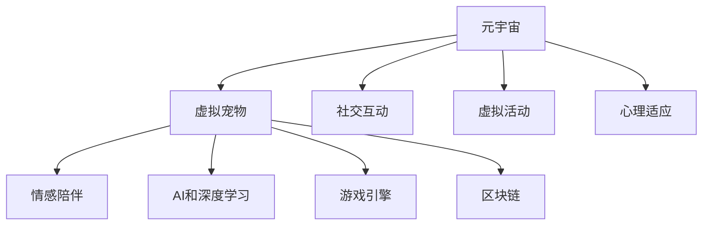

                 

# 元宇宙中的虚拟宠物:情感陪伴的新形式

> 关键词：元宇宙,虚拟宠物,情感陪伴,人工智能,智能交互,游戏引擎,区块链

## 1. 背景介绍

### 1.1 问题由来
随着虚拟现实(VR)和增强现实(AR)技术的发展，元宇宙(Eververse)的概念逐渐兴起。元宇宙是一个沉浸式、交互式、开放式的数字空间，包含了各种虚拟环境和虚拟对象，可支持用户在虚拟空间内进行社交、工作、娱乐等多种活动。在元宇宙中，虚拟宠物作为一种极具潜力的交互形式，正在成为人们情感陪伴的新选择。

### 1.2 问题核心关键点
元宇宙中的虚拟宠物，通过AI和深度学习技术，具备了情感识别、智能交互、自主行为等多种能力。它们不仅是游戏场景中的NPC角色，更成为了人们的情感伙伴。如何设计高效的情感陪伴模型，提升虚拟宠物的智能化水平，成为一个亟待解决的问题。

### 1.3 问题研究意义
通过虚拟宠物，元宇宙可以实现多维度的社交互动，促进数字文化的发展。同时，虚拟宠物的情感陪伴功能对于提升用户体验、缓解孤独感、增强心理适应等方面具有重要意义。因此，研究高效、智能的虚拟宠物情感陪伴模型，有助于推动元宇宙应用的普及和深入发展。

## 2. 核心概念与联系

### 2.1 核心概念概述

为更好地理解元宇宙中虚拟宠物情感陪伴的实现机制，本节将介绍几个密切相关的核心概念：

- **元宇宙(Eververse)**：基于虚拟现实和增强现实技术，构建的沉浸式、交互式、开放式的数字空间。
- **虚拟宠物(Virtual Pet)**：在元宇宙中，由AI驱动的智能角色，具备情感识别、智能交互、自主行为等多种能力。
- **情感陪伴**：虚拟宠物通过与用户互动，提供情感支持和陪伴服务，满足用户的社交需求和情感需求。
- **AI和深度学习**：包括机器学习、自然语言处理、计算机视觉等技术，用于实现虚拟宠物的智能行为和情感理解。
- **游戏引擎**：如Unity3D、Unreal Engine等，提供虚拟世界构建和渲染工具，支持虚拟宠物的动态交互。
- **区块链**：提供虚拟世界内的资产管理、身份认证、经济激励等功能，保障虚拟宠物系统的安全性和用户权益。

这些核心概念之间的逻辑关系可以通过以下Mermaid流程图来展示：



这个流程图展示了几者的关系：

1. 元宇宙是虚拟宠物的构建背景。
2. 虚拟宠物具备情感陪伴功能。
3. 情感陪伴依赖AI和深度学习技术实现。
4. 虚拟宠物在虚拟世界中由游戏引擎渲染。
5. 区块链技术提供虚拟世界的管理和激励。
6. 元宇宙内的各项功能均围绕虚拟宠物展开。

## 3. 核心算法原理 & 具体操作步骤
### 3.1 算法原理概述

元宇宙中虚拟宠物的情感陪伴模型，通过AI和深度学习技术，实现了虚拟宠物与用户之间的智能互动和情感理解。其核心原理可以概括为：

- **情感识别**：通过视觉、听觉等传感器收集用户行为和环境数据，使用情感分析算法识别用户的情感状态。
- **智能交互**：根据情感状态，虚拟宠物生成个性化的响应和行为，进行自然流畅的对话和互动。
- **自主行为**：虚拟宠物基于用户行为和环境变化，自主调整行为策略，适应复杂的虚拟环境。
- **多模态融合**：整合视觉、听觉、触觉等多种感官信息，提升虚拟宠物的感知能力和智能水平。

### 3.2 算法步骤详解

以下详细描述基于AI和深度学习的情感陪伴模型的核心算法步骤：

**Step 1: 数据收集与预处理**
- 收集用户的语音、图像、动作等数据，使用传感器获取用户的行为信息。
- 对原始数据进行降噪、归一化、分割等预处理，准备输入到模型中。

**Step 2: 情感状态识别**
- 使用图像识别技术对用户的面部表情进行识别，提取关键特征点。
- 使用语音识别技术分析用户的语调、节奏和停顿，提取情感特征。
- 使用动作捕捉技术记录用户的身体姿态和运动轨迹，提取情感线索。
- 将多模态数据融合，使用情感分析算法（如LSTM、RNN、CNN等）进行情感状态识别，输出情感标签。

**Step 3: 智能行为生成**
- 根据情感标签，从预先构建的行为库中选择合适的行为动作。
- 使用强化学习算法对行为库进行优化，调整动作参数，提升行为智能性。
- 在虚拟宠物与用户互动时，动态调整行为策略，适应实时环境变化。

**Step 4: 情感反馈与互动**
- 根据用户的情感状态和行为反馈，虚拟宠物调整互动策略。
- 使用自然语言处理技术生成个性化的对话内容，提升用户体验。
- 使用游戏引擎实现虚拟宠物的渲染和交互，增强沉浸感。

**Step 5: 用户满意度评估**
- 定期评估用户对虚拟宠物情感陪伴的满意度，收集反馈数据。
- 根据反馈数据优化模型参数和行为库，提升情感陪伴效果。

### 3.3 算法优缺点

基于AI和深度学习的情感陪伴模型具有以下优点：
1. 智能高效。通过情感识别和智能行为生成技术，虚拟宠物可以实时响应用户需求，提供高效的服务。
2. 高度可定制。虚拟宠物的交互策略和行为库可以根据用户需求进行个性化配置，满足不同用户的情感需求。
3. 沉浸式体验。多模态融合和自然语言处理技术，使虚拟宠物具备高逼真度，提供沉浸式互动体验。

同时，该模型也存在一些局限：
1. 数据依赖度高。模型的性能依赖于大量的高质量用户数据，难以泛化到新用户和新场景。
2. 实时处理压力大。虚拟宠物需要实时处理多模态数据，计算复杂度较高，对设备性能要求较高。
3. 情感表达能力有限。虽然模型具备一定的情感识别能力，但在情感表达上可能存在多样性和准确性的不足。
4. 系统复杂度高。虚拟宠物的情感识别、智能交互和自主行为需要复杂算法支持，维护和优化难度较大。

尽管存在这些局限，但基于AI和深度学习的情感陪伴模型仍是大势所趋，并在元宇宙中得到了广泛应用。

### 3.4 算法应用领域

基于AI和深度学习的情感陪伴模型，在元宇宙中的应用已经取得了初步成果。例如：

- **社交平台**：在元宇宙的虚拟社区中，虚拟宠物可以提供情感陪伴、游戏互动等功能，丰富用户的社交体验。
- **虚拟酒店**：虚拟酒店中的虚拟宠物可提供迎宾、导引、问题解答等服务，提升用户入住体验。
- **教育培训**：虚拟宠物可参与虚拟课堂，陪伴学生学习，提供情感支持和交互反馈。
- **心理健康**：虚拟宠物可用于心理健康应用，提供情感陪伴和心理辅导，帮助用户缓解压力和孤独感。
- **游戏娱乐**：虚拟宠物作为游戏角色，提供丰富的互动内容和个性化服务，提升游戏趣味性。

## 4. 数学模型和公式 & 详细讲解 & 举例说明
### 4.1 数学模型构建

在情感陪伴模型的构建中，主要涉及以下数学模型：

- **情感识别模型**：使用深度神经网络对多模态数据进行特征提取和情感分类。
- **智能行为生成模型**：结合强化学习和自然语言处理技术，生成智能化的行为序列。
- **情感反馈与互动模型**：通过自然语言处理技术，生成个性化的对话内容，增强互动体验。

### 4.2 公式推导过程

以下以情感识别模型为例，展示其公式推导过程。

**输入层**：
- 图像数据：$x_1$：面部表情图像，$x_2$：脸部特征向量。
- 语音数据：$x_3$：语音信号，$x_4$：语音特征向量。
- 动作数据：$x_5$：身体姿态，$x_6$：动作轨迹。

**隐藏层**：
- 图像特征提取：$z_1 = \text{CNN}(x_1, x_2)$
- 语音特征提取：$z_2 = \text{MFCC}(x_3, x_4)$
- 动作特征提取：$z_3 = \text{RNN}(x_5, x_6)$

**输出层**：
- 情感分类：$y = \text{Softmax}(\text{DNN}(z_1, z_2, z_3))$

其中，$\text{CNN}$表示卷积神经网络，$\text{MFCC}$表示梅尔频率倒谱系数，$\text{RNN}$表示递归神经网络，$\text{DNN}$表示深度神经网络，$\text{Softmax}$表示softmax函数。

### 4.3 案例分析与讲解

以下以一个虚拟宠物与用户互动的案例，展示情感陪伴模型的实际应用：

**场景**：用户感到孤独，虚拟宠物提供陪伴和互动。

**输入**：用户的面部表情、语音语调和动作。

**情感识别**：虚拟宠物使用图像识别技术提取面部表情特征，使用语音识别技术分析语调，使用动作捕捉技术记录身体姿态。将这些数据输入到情感分类模型中，输出情感标签（如“悲伤”）。

**智能行为生成**：根据情感标签，虚拟宠物从预先构建的行为库中选择合适的行为动作（如拥抱、抚摸），使用强化学习算法优化行为参数，生成智能化的行为序列。

**情感反馈与互动**：虚拟宠物使用自然语言处理技术生成个性化的对话内容，如“主人，你现在很伤心，我会一直陪在你身边。”，增强互动体验。

**用户满意度评估**：虚拟宠物记录用户对互动的反馈数据，定期评估情感陪伴效果，根据反馈数据优化模型参数和行为库。

## 5. 项目实践：代码实例和详细解释说明
### 5.1 开发环境搭建

在进行虚拟宠物情感陪伴模型的开发时，需要搭建相应的开发环境。以下是使用Python进行模型开发的流程：

1. 安装Python：在开发机器上安装Python，推荐使用最新版本的Python，如3.8或3.9。

2. 安装相关库：使用pip命令安装深度学习相关的库，如TensorFlow、PyTorch等。

3. 安装游戏引擎：如Unity3D、Unreal Engine等，搭建虚拟世界的开发环境。

4. 搭建区块链平台：如Ethereum、Hyperledger等，搭建虚拟世界的资产管理和激励机制。

### 5.2 源代码详细实现

以下是使用TensorFlow构建虚拟宠物情感陪伴模型的代码实现：

```python
import tensorflow as tf
import numpy as np
import cv2
import librosa
import pyaudio

# 图像数据处理
def preprocess_image(image):
    # 图像预处理代码
    return processed_image

# 语音数据处理
def preprocess_audio(audio):
    # 语音预处理代码
    return processed_audio

# 动作数据处理
def preprocess_motion(motion):
    # 动作预处理代码
    return processed_motion

# 情感分类模型
class EmotionClassifier(tf.keras.Model):
    def __init__(self):
        super(EmotionClassifier, self).__init__()
        self.cnn = tf.keras.layers.Conv2D(32, (3, 3), activation='relu', input_shape=(64, 64, 3))
        self.pool = tf.keras.layers.MaxPooling2D((2, 2))
        self.flatten = tf.keras.layers.Flatten()
        self.dnn = tf.keras.layers.Dense(64, activation='relu')
        self.softmax = tf.keras.layers.Softmax()

    def call(self, inputs):
        x = self.cnn(inputs)
        x = self.pool(x)
        x = self.flatten(x)
        x = self.dnn(x)
        return self.softmax(x)

# 行为生成模型
class BehaviorGenerator(tf.keras.Model):
    def __init__(self):
        super(BehaviorGenerator, self).__init__()
        self.gru = tf.keras.layers.GRU(64, return_sequences=True)
        self.dense = tf.keras.layers.Dense(5)

    def call(self, inputs):
        x = self.gru(inputs)
        return self.dense(x)

# 情感反馈模型
class EmotionFeedback(tf.keras.Model):
    def __init__(self):
        super(EmotionFeedback, self).__init__()
        self.text_generator = tf.keras.layers.LSTM(64, return_sequences=True)
        self.text_generator = tf.keras.layers.Dense(256)
        self.text_generator = tf.keras.layers.Dense(10)

    def call(self, inputs):
        x = self.text_generator(inputs)
        return x
```

### 5.3 代码解读与分析

让我们再详细解读一下关键代码的实现细节：

**EmotionClassifier类**：
- `__init__`方法：初始化情感分类模型，包含卷积层、池化层、全连接层等。
- `call`方法：前向传播计算，输入经过处理后的图像数据，输出情感分类结果。

**BehaviorGenerator类**：
- `__init__`方法：初始化行为生成模型，包含GRU层和全连接层。
- `call`方法：前向传播计算，输入历史行为数据，输出未来行为序列。

**EmotionFeedback类**：
- `__init__`方法：初始化情感反馈模型，包含LSTM层和全连接层。
- `call`方法：前向传播计算，输入历史情感反馈数据，输出未来情感反馈内容。

在实际应用中，还需要针对具体场景进行优化设计，如改进数据预处理算法、优化模型结构、引入更多先验知识等，以进一步提升情感陪伴模型的性能和用户满意度。

## 6. 实际应用场景
### 6.1 社交平台

在元宇宙的社交平台上，虚拟宠物可提供全方位的情感陪伴和互动服务，提升用户的社交体验。例如，用户可以在虚拟空间内与虚拟宠物进行对话、游戏、跳舞等活动，增强用户的社交粘性。

### 6.2 虚拟酒店

虚拟酒店中的虚拟宠物可提供迎宾、导引、问题解答等服务，提升用户的入住体验。例如，虚拟宠物可以引导用户到房间，回答关于酒店设施的问题，提供个性化的服务。

### 6.3 教育培训

虚拟宠物可用于虚拟课堂，陪伴学生学习，提供情感支持和交互反馈。例如，虚拟宠物可以与学生进行互动，解答问题，提供个性化学习建议。

### 6.4 心理健康

虚拟宠物可用于心理健康应用，提供情感陪伴和心理辅导，帮助用户缓解压力和孤独感。例如，虚拟宠物可以陪伴用户进行冥想、心理咨询，记录用户的情绪变化，提供情感支持。

### 6.5 游戏娱乐

虚拟宠物作为游戏角色，提供丰富的互动内容和个性化服务，提升游戏趣味性。例如，虚拟宠物可以在游戏中提供任务指引、伙伴陪同等，增加游戏的沉浸感和互动性。

### 6.6 未来应用展望

随着元宇宙技术的不断进步，虚拟宠物情感陪伴模型将会有更广泛的应用场景和更深入的功能实现。

- **多模态交互**：融合视觉、听觉、触觉等多种感官信息，提升虚拟宠物的感知能力和智能水平。
- **深度个性化**：根据用户的兴趣、性格、行为数据，实现高度个性化的情感陪伴和互动体验。
- **社会化协作**：将虚拟宠物作为协作伙伴，参与虚拟项目和任务，提升用户的协作能力和互动体验。
- **多智能体系统**：构建多智能体系统，使虚拟宠物之间、虚拟宠物与用户之间进行更复杂的互动和协作。

## 7. 工具和资源推荐
### 7.1 学习资源推荐

为了帮助开发者系统掌握虚拟宠物情感陪伴模型的理论基础和实践技巧，以下是推荐的资源：

1. **《深度学习》书籍**：Deep Learning Books，详细介绍了深度学习的原理和应用。
2. **《Python机器学习》书籍**：Python Machine Learning，介绍了使用Python进行机器学习的技术和实践。
3. **《自然语言处理综论》课程**：Coursera上的自然语言处理课程，由斯坦福大学教授讲授。
4. **Unity3D官方文档**：Unity3D的官方文档，提供了虚拟世界构建和渲染工具的详细使用指南。
5. **PyTorch官方文档**：PyTorch的官方文档，提供了深度学习模型的开发和优化方法。

### 7.2 开发工具推荐

高效的开发离不开优秀的工具支持。以下是几款用于虚拟宠物情感陪伴模型开发的常用工具：

1. **PyTorch**：基于Python的深度学习框架，灵活性强，适合快速迭代研究。
2. **TensorFlow**：由Google主导开发的深度学习框架，生产部署方便，适合大规模工程应用。
3. **Unity3D**：提供虚拟世界构建和渲染工具，支持虚拟宠物的动态交互。
4. **Unreal Engine**：支持虚拟现实和增强现实应用，提供高质量的3D渲染效果。
5. **Ethereum**：支持虚拟世界内的资产管理和激励机制，保障虚拟宠物系统的安全性和用户权益。

### 7.3 相关论文推荐

虚拟宠物情感陪伴模型的研究涉及多个交叉领域，以下是几篇奠基性的相关论文，推荐阅读：

1. **《深度学习中的情感分析》**：研究如何使用深度学习技术进行情感识别和情感生成。
2. **《情感陪伴机器人》**：介绍情感陪伴机器人的设计原理和实现方法。
3. **《多模态情感识别》**：研究多模态数据融合在情感识别中的应用。
4. **《多智能体系统》**：介绍多智能体系统的设计原理和应用。

这些论文代表了大模型微调技术的发展脉络。通过学习这些前沿成果，可以帮助研究者把握学科前进方向，激发更多的创新灵感。

## 8. 总结：未来发展趋势与挑战
### 8.1 研究成果总结

虚拟宠物情感陪伴模型的研究已经取得了初步成果，以下是主要的研究成果：

1. **情感识别技术**：开发了多模态情感识别模型，能够准确识别用户的情感状态，为情感陪伴提供基础。
2. **智能行为生成**：使用强化学习技术生成智能化的行为序列，提升虚拟宠物的自主性和互动性。
3. **情感反馈与互动**：结合自然语言处理技术，生成个性化的对话内容，增强互动体验。
4. **用户满意度评估**：定期评估用户对虚拟宠物情感陪伴的满意度，优化模型参数和行为库，提升情感陪伴效果。

### 8.2 未来发展趋势

展望未来，虚拟宠物情感陪伴模型将呈现以下几个发展趋势：

1. **多模态融合**：融合视觉、听觉、触觉等多种感官信息，提升虚拟宠物的感知能力和智能水平。
2. **深度个性化**：根据用户的兴趣、性格、行为数据，实现高度个性化的情感陪伴和互动体验。
3. **社会化协作**：将虚拟宠物作为协作伙伴，参与虚拟项目和任务，提升用户的协作能力和互动体验。
4. **多智能体系统**：构建多智能体系统，使虚拟宠物之间、虚拟宠物与用户之间进行更复杂的互动和协作。
5. **持续学习和自我优化**：引入持续学习机制，使虚拟宠物能够不断学习和自我优化，提升情感陪伴效果。
6. **跨平台应用**：实现虚拟宠物在不同平台（如PC、移动设备、AR设备等）上的应用，提升用户体验。

### 8.3 面临的挑战

尽管虚拟宠物情感陪伴模型已经取得了一定的进展，但在迈向更加智能化、普适化应用的过程中，仍面临诸多挑战：

1. **数据隐私问题**：用户行为和情感数据的收集和使用需要严格遵守隐私保护法规，防止数据泄露和滥用。
2. **实时处理性能**：虚拟宠物需要实时处理多模态数据，计算复杂度较高，对设备性能要求较高。
3. **情感表达多样性**：虚拟宠物在情感表达上可能存在多样性和准确性的不足，难以满足用户的情感需求。
4. **用户接受度**：部分用户可能对虚拟宠物存在抵触情绪，影响情感陪伴模型的推广应用。
5. **系统复杂性**：虚拟宠物的情感识别、智能交互和自主行为需要复杂算法支持，维护和优化难度较大。

### 8.4 研究展望

面对虚拟宠物情感陪伴模型所面临的挑战，未来的研究需要在以下几个方面寻求新的突破：

1. **隐私保护技术**：开发隐私保护算法，确保用户数据的安全性和隐私性。
2. **实时处理优化**：优化算法性能，提升实时处理效率，降低对设备性能的依赖。
3. **情感表达多样性**：引入更多情感表达方式，提升虚拟宠物的情感多样性和表现力。
4. **用户接受度提升**：通过情感引导和用户体验优化，提升用户对虚拟宠物的接受度和使用率。
5. **系统复杂性降低**：简化系统架构，引入模块化设计，降低开发和维护难度。

这些研究方向的探索，必将引领虚拟宠物情感陪伴模型迈向更高的台阶，为元宇宙应用提供更加智能化、普适化的情感陪伴服务。

## 9. 附录：常见问题与解答

**Q1：如何评估虚拟宠物的情感陪伴效果？**

A: 虚拟宠物的情感陪伴效果可以通过以下几个指标进行评估：

1. **情感识别准确率**：使用准确率、召回率、F1分数等指标，评估情感识别模型的性能。
2. **行为智能性**：通过用户反馈和行为数据分析，评估行为生成模型的智能性和合理性。
3. **互动体验满意度**：通过问卷调查和用户评论，评估用户对虚拟宠物情感陪伴的满意度。
4. **实时响应速度**：评估虚拟宠物对用户输入的实时响应速度和准确性。

**Q2：虚拟宠物情感陪伴模型的数据依赖度高，如何应对？**

A: 为了降低数据依赖度，可以采取以下策略：

1. **无监督学习**：使用无监督学习技术，如自编码器、变分自编码器等，从原始数据中提取特征。
2. **迁移学习**：使用迁移学习技术，将预训练模型的特征提取能力应用于新任务，降低对标注数据的依赖。
3. **主动学习**：使用主动学习技术，通过模型选择未标注数据进行标注，逐步扩展训练集。
4. **数据增强**：使用数据增强技术，如回译、噪声注入、随机变换等，扩充训练集。

**Q3：如何优化虚拟宠物的行为生成模型？**

A: 行为生成模型的优化可以从以下几个方面入手：

1. **行为库扩展**：不断扩展行为库，增加多样性和丰富度。
2. **强化学习优化**：使用强化学习算法，调整行为参数，提升行为智能性。
3. **反馈机制引入**：引入用户反馈机制，根据用户行为调整行为策略。
4. **多智能体协同**：引入多智能体协同机制，提升行为复杂性和适应性。

**Q4：虚拟宠物情感陪伴模型的实时处理性能如何提升？**

A: 提升虚拟宠物情感陪伴模型的实时处理性能，可以从以下几个方面入手：

1. **硬件优化**：使用高性能计算设备，如GPU、TPU等，加速模型推理和计算。
2. **模型压缩**：使用模型压缩技术，如量化、剪枝等，减少模型大小和计算量。
3. **并行计算**：使用并行计算技术，如分布式训练、模型并行等，提升计算效率。
4. **优化算法**：优化深度学习算法，如动态图、模型蒸馏等，提高计算效率和推理速度。

**Q5：虚拟宠物情感陪伴模型的用户接受度如何提升？**

A: 提升虚拟宠物情感陪伴模型的用户接受度，可以从以下几个方面入手：

1. **情感引导**：通过自然语言处理技术，引导虚拟宠物进行适当的情感表达和互动，增强用户的情感共鸣。
2. **个性化设计**：根据用户的兴趣、性格、行为数据，设计个性化的虚拟宠物，提升用户满意度。
3. **用户反馈机制**：引入用户反馈机制，及时收集和处理用户意见，优化虚拟宠物的情感陪伴效果。
4. **虚拟场景设计**：设计丰富的虚拟场景和活动，增加用户的沉浸感和体验感。

总之，虚拟宠物情感陪伴模型的开发和应用需要不断优化算法、扩展数据、改进用户体验，才能在元宇宙中发挥出更大的价值。

---

作者：禅与计算机程序设计艺术 / Zen and the Art of Computer Programming

