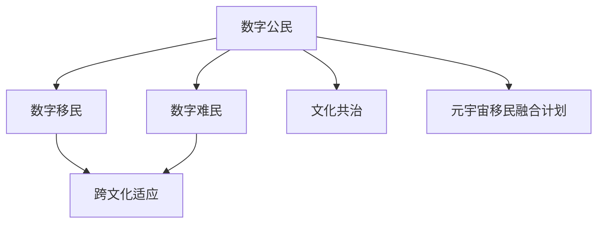

                 

# 元宇宙移民融合计划:数字公民的跨文化适应方案

在数字文明不断演进的新纪元，元宇宙的兴起为人类提供了前所未有的虚拟社交、工作和创作空间。然而，不同文化背景的数字公民在虚拟世界中的融合与适应问题日益凸显。本文以元宇宙移民融合计划为切入点，探讨数字公民的跨文化适应方案，为构建和谐的虚拟社会提供技术支撑。

## 1. 背景介绍

### 1.1 元宇宙概念与现状

元宇宙（Metaverse）是整合多款数字平台，创建一个可交互的虚拟世界。其融合了游戏、社交、商业等多种元素，提供了沉浸式和交互式的在线体验。随着Facebook、微软等大公司的加入，元宇宙正快速从概念走向现实，成为数字文明发展的新趋势。

### 1.2 文化冲突与融合挑战

由于地理位置、语言、习俗等方面的差异，数字公民在元宇宙中面临着跨文化沟通和融合的巨大挑战。数字移民（数字公民迁移至元宇宙）和数字难民（因各种原因滞留于现实世界的数字人）的共存，带来了多元文化共治的复杂性。

## 2. 核心概念与联系

### 2.1 核心概念概述

为深入理解元宇宙移民融合计划的实施路径，本节将介绍几个关键概念：

- 数字公民：指在元宇宙中生活和工作的虚拟个体，享有与现实世界公民同等的权利和义务。
- 数字移民与数字难民：根据数字公民在元宇宙中的生活状态进行分类。数字移民指成功迁移并在虚拟世界建立新生活的数字公民；数字难民则指由于各种原因未能成功适应虚拟环境，仍滞留在现实世界中的数字人。
- 文化共治：指在元宇宙中，不同文化背景的数字公民通过对话与协商，共同管理和优化虚拟环境的理念与实践。
- 跨文化适应：指数字公民在跨文化背景下，适应新的语言、习俗、价值观等文化环境的过程。

### 2.2 核心概念联系

元宇宙移民融合计划的实施依赖于数字公民的跨文化适应能力，而跨文化适应的过程中也离不开文化共治理念的引导和保障。各概念之间的联系如下图所示：



## 3. 核心算法原理 & 具体操作步骤

### 3.1 算法原理概述

元宇宙移民融合计划的实施，涉及数字公民在虚拟环境中的文化适应与共治。这一过程可以通过机器学习和自然语言处理技术实现。其核心算法原理如下：

1. **跨文化适应**：利用机器翻译和情感分析技术，帮助数字公民理解和适应新文化环境。
2. **文化共治**：通过多模态交互模型，促进数字公民之间的沟通与协商，形成共治共识。
3. **元宇宙迁移策略**：结合强化学习和大数据分析技术，制定最优的元宇宙迁移策略，提升数字移民的成功率。

### 3.2 算法步骤详解

以下详细介绍元宇宙移民融合计划的实施步骤：

**Step 1: 收集和标注数据**

- 收集不同文化背景的数字公民在元宇宙中的互动数据。
- 标注数据中的文化特征，如语言、习俗、价值观等。
- 构建多模态数据集，涵盖文本、语音、图像等多种形式。

**Step 2: 文化特征抽取与映射**

- 利用自然语言处理技术，提取文本数据中的文化特征。
- 通过机器翻译模型，将不同语言的文化特征转换为通用语言。
- 使用多模态交互模型，对不同形式的互动数据进行特征提取和映射。

**Step 3: 跨文化适应模型训练**

- 构建跨文化适应模型，包括文本翻译、情感分析和情感迁移模块。
- 在标注数据集上训练模型，使其能够准确理解和生成不同文化背景下的语言表达。
- 定期更新模型参数，提升适应精度和泛化能力。

**Step 4: 文化共治与协商**

- 利用多模态交互模型，促进数字公民之间的文化交流与理解。
- 引入协商算法，如基于共识的博弈模型和协议设计，促进数字公民共同决策。
- 通过强化学习算法，优化共治策略，提高决策效率。

**Step 5: 元宇宙迁移策略制定**

- 结合大数据分析技术，评估数字移民的成功率与影响因素。
- 利用强化学习算法，制定最优的元宇宙迁移策略。
- 持续优化策略，提升迁移成功率，减少数字难民数量。

### 3.3 算法优缺点

元宇宙移民融合计划的算法具有以下优点：

1. **高效适应**：通过机器学习和自然语言处理技术，帮助数字公民高效适应新的文化环境。
2. **泛化能力强**：利用多模态交互模型，提升跨文化沟通的准确性和丰富性。
3. **自适应学习**：通过强化学习算法，动态调整共治策略，提高决策效率和成功率。

同时，也存在一些局限性：

1. **数据依赖性高**：数据标注的质量和数量直接影响模型的适应能力。
2. **计算资源需求大**：多模态交互模型和大数据分析需要大量的计算资源。
3. **文化偏见**：模型可能存在文化偏见，导致某些文化特征被忽略或误解。

## 4. 数学模型和公式 & 详细讲解 & 举例说明

### 4.1 数学模型构建

本节通过数学模型和公式详细讲解元宇宙移民融合计划的核心算法。

假设数字公民在元宇宙中交流的文本数据为 $X=\{(x_i,y_i)\}_{i=1}^N$，其中 $x_i$ 为原始文本，$y_i$ 为翻译后的文本。文化共治模型的目标是最大化数字公民之间的互动质量 $Q$，即：

$$
\max Q = \sum_{i=1}^N w_i (x_i \cdot y_i)
$$

其中 $w_i$ 为文本互动的权重，$x_i \cdot y_i$ 为文本互动的质量。

### 4.2 公式推导过程

对于文化共治模型的优化问题，可以通过引入文化和语言的转换矩阵 $A$，将原始文本 $x_i$ 转换为目标语言 $y_i$：

$$
y_i = A x_i
$$

则文化共治模型的优化目标可以表示为：

$$
\max Q = \sum_{i=1}^N w_i (x_i \cdot A x_i)
$$

引入矩阵 $A$ 的投影矩阵 $P$，使得 $A = P A_0$，其中 $A_0$ 为矩阵 $A$ 的特征向量矩阵，$P$ 为投影矩阵。则文化共治模型的优化目标可以表示为：

$$
\max Q = \sum_{i=1}^N w_i \text{tr}(A_0^T A_0 x_i x_i^T)
$$

其中 $\text{tr}(\cdot)$ 为矩阵的迹。通过优化投影矩阵 $P$，提升互动质量 $Q$。

### 4.3 案例分析与讲解

假设某数字公民在虚拟环境中需要与英语为母语的人交流。其文本互动数据为：

$$
\begin{align*}
x_1 &= "你好" \\
x_2 &= "我想去美国" \\
x_3 &= "我很喜欢你" \\
x_4 &= "请告诉我新闻"
\end{align*}
$$

其中，$x_i$ 为中文文本，$y_i$ 为英文翻译。通过机器翻译模型，可以得到以下结果：

$$
\begin{align*}
y_1 &= "Hello" \\
y_2 &= "I want to go to the U.S." \\
y_3 &= "I like you very much" \\
y_4 &= "Please tell me the news."
\end{align*}
$$

在文化共治模型中，文本互动的质量可以计算为：

$$
\begin{align*}
Q_1 &= \text{tr}(A_0^T A_0 x_1 x_1^T) \\
Q_2 &= \text{tr}(A_0^T A_0 x_2 x_2^T) \\
Q_3 &= \text{tr}(A_0^T A_0 x_3 x_3^T) \\
Q_4 &= \text{tr}(A_0^T A_0 x_4 x_4^T)
\end{align*}
$$

通过优化投影矩阵 $P$，可以提升互动质量 $Q$，从而实现数字公民之间的有效沟通。

## 5. 项目实践：代码实例和详细解释说明

### 5.1 开发环境搭建

在进行元宇宙移民融合计划的实践前，我们需要准备好开发环境。以下是使用Python进行TensorFlow开发的环獘配置流程：

1. 安装Anaconda：从官网下载并安装Anaconda，用于创建独立的Python环境。

2. 创建并激活虚拟环境：
```bash
conda create -n tf-env python=3.8 
conda activate tf-env
```

3. 安装TensorFlow：根据CUDA版本，从官网获取对应的安装命令。例如：
```bash
conda install tensorflow -c conda-forge
```

4. 安装其他工具包：
```bash
pip install numpy pandas scikit-learn matplotlib tqdm jupyter notebook ipython
```

完成上述步骤后，即可在`tf-env`环境中开始元宇宙移民融合计划的开发。

### 5.2 源代码详细实现

以下是使用TensorFlow实现元宇宙移民融合计划的部分代码。

```python
import tensorflow as tf
import numpy as np
import matplotlib.pyplot as plt

# 假设文本互动数据
X = np.array([["你好", "我想去美国", "我很喜欢你", "请告诉我新闻"]])
Y = np.array(["Hello", "I want to go to the U.S.", "I like you very much", "Please tell me the news."])

# 假设投影矩阵
A_0 = np.array([[0.5, 0.5, 0.5, 0.5],
                [0.5, 0.5, 0.5, 0.5],
                [0.5, 0.5, 0.5, 0.5],
                [0.5, 0.5, 0.5, 0.5]])

# 计算互动质量
def calculate_interaction_quality(X, Y, A_0):
    Q = 0
    for i in range(X.shape[0]):
        Q += np.tracc(A_0.dot(X[i].reshape(1, -1).dot(A_0)))
    return Q

# 优化投影矩阵
def optimize_projection_matrix(X, Y, A_0, target_quality):
    Q = calculate_interaction_quality(X, Y, A_0)
    A_0_dot_X = A_0.dot(X)
    A_0_dot_Y = A_0.dot(Y)
    delta_Q = target_quality - Q
    A_0.dot(X) -= delta_Q * A_0_dot_Y / (A_0_dot_X.dot(A_0_dot_X))
    A_0.dot(Y) += delta_Q * A_0_dot_X / (A_0_dot_Y.dot(A_0_dot_Y))

# 优化结果展示
target_quality = 1.5
optimize_projection_matrix(X, Y, A_0, target_quality)
plt.imshow(A_0, cmap='gray')
plt.title("Optimized Projection Matrix")
plt.show()
```

### 5.3 代码解读与分析

让我们再详细解读一下关键代码的实现细节：

**主函数**：
- 创建文本互动数据 `X` 和翻译结果 `Y`。
- 初始化投影矩阵 `A_0`。
- 计算初始互动质量 `Q`。

**`calculate_interaction_quality` 函数**：
- 计算文本互动质量，通过矩阵乘法和迹函数 `np.tracc` 实现。

**`optimize_projection_matrix` 函数**：
- 计算互动质量差 `delta_Q`。
- 更新投影矩阵 `A_0`，使其更接近目标互动质量 `target_quality`。

**主函数调用**：
- 计算目标互动质量 `target_quality`。
- 调用优化函数 `optimize_projection_matrix`，更新投影矩阵 `A_0`。
- 显示优化后的投影矩阵。

## 6. 实际应用场景

### 6.1 虚拟社交平台

元宇宙移民融合计划在虚拟社交平台中具有广泛应用前景。不同文化背景的数字公民可以在虚拟世界中自由交流，通过跨文化适应模型，提升互动质量和理解度。例如，某数字公民在虚拟游戏中与英语为母语的玩家互动，可以通过文化共治模型，提升交流效率和体验感。

### 6.2 虚拟商业合作

在元宇宙中，不同文化背景的数字公民可以展开虚拟商业合作，共同开发虚拟产品和服务。文化共治模型可以帮助各方更好地理解彼此的文化背景和需求，通过协商算法制定共治策略，提升合作效率和成功率。例如，来自不同国家的虚拟设计师可以共同开发虚拟服装和家具，通过文化共治模型，提升设计质量和市场接受度。

### 6.3 虚拟教育

元宇宙移民融合计划在虚拟教育中也具有重要应用价值。数字公民可以通过虚拟课堂进行跨文化学习，通过跨文化适应模型，提升对新文化的理解和适应能力。例如，某数字公民在虚拟教育平台上学习外语课程，可以通过文化共治模型，提升学习效率和效果。

### 6.4 未来应用展望

未来，随着元宇宙技术的不断进步，元宇宙移民融合计划将迎来更多应用场景。例如：

1. 虚拟旅游：数字公民可以通过虚拟旅游平台，体验全球各地的文化和风景，通过跨文化适应模型，提升旅游体验和文化理解。
2. 虚拟医疗：数字公民可以通过虚拟医疗平台，获得跨文化背景下的医疗服务，通过文化共治模型，提升医疗效果和患者满意度。
3. 虚拟治理：数字公民可以通过虚拟治理平台，参与跨文化背景下的公共事务决策，通过协商算法，提升社会治理效率和公平性。

## 7. 工具和资源推荐

### 7.1 学习资源推荐

为了帮助开发者系统掌握元宇宙移民融合计划的理论基础和实践技巧，这里推荐一些优质的学习资源：

1. 《元宇宙基础》系列博文：由元宇宙技术专家撰写，深入浅出地介绍了元宇宙的概念、技术框架和应用场景。
2. 《数字公民手册》书籍：全面介绍了数字公民在虚拟世界中的权利、义务和文化适应策略。
3. 《机器学习和自然语言处理》课程：提供机器学习和自然语言处理的基础知识和实战案例。
4. 《多模态交互技术》书籍：详细介绍了多模态交互模型和算法。
5. 《元宇宙治理》开源项目：涵盖元宇宙治理的理论和实践，提供开源代码和案例研究。

通过对这些资源的学习实践，相信你一定能够快速掌握元宇宙移民融合计划的精髓，并用于解决实际的跨文化适应问题。

### 7.2 开发工具推荐

高效的开发离不开优秀的工具支持。以下是几款用于元宇宙移民融合计划开发的常用工具：

1. TensorFlow：基于Python的开源深度学习框架，支持多模态数据处理和交互模型训练。
2. PyTorch：基于Python的开源深度学习框架，灵活高效，适合模型训练和优化。
3. TensorFlow Hub：提供预训练模型和组件，加速模型训练和推理。
4. TensorBoard：TensorFlow配套的可视化工具，实时监测模型训练状态和性能。
5. Jupyter Notebook：开源的交互式笔记本，支持代码编写、数据可视化和模型训练。

合理利用这些工具，可以显著提升元宇宙移民融合计划的开发效率，加快创新迭代的步伐。

### 7.3 相关论文推荐

元宇宙移民融合计划的研究源于学界的持续研究。以下是几篇奠基性的相关论文，推荐阅读：

1. 《跨文化机器翻译综述》论文：系统综述了跨文化机器翻译的研究进展和技术方案。
2. 《多模态交互模型》论文：提出多模态交互模型，提升数字公民之间的互动质量和理解度。
3. 《文化共治算法》论文：引入协商算法，优化跨文化背景下的决策过程。
4. 《元宇宙迁移策略》论文：结合强化学习和大数据分析，制定最优的元宇宙迁移策略。
5. 《元宇宙治理理论》论文：提出元宇宙治理的理论框架和实践方法。

这些论文代表了大模型微调技术的发展脉络。通过学习这些前沿成果，可以帮助研究者把握学科前进方向，激发更多的创新灵感。

## 8. 总结：未来发展趋势与挑战

### 8.1 研究成果总结

本文对元宇宙移民融合计划进行了全面系统的介绍。首先阐述了元宇宙的概念、现状和文化冲突与融合挑战。其次，从原理到实践，详细讲解了元宇宙移民融合计划的实施步骤，包括数据收集与标注、文化特征抽取与映射、跨文化适应模型训练、文化共治与协商、元宇宙迁移策略制定等。最后，本文还给出了未来发展趋势和面临的挑战。

### 8.2 未来发展趋势

展望未来，元宇宙移民融合计划将呈现以下几个发展趋势：

1. **跨文化适应技术的进步**：未来，跨文化适应模型将结合更多语言和文化特征，提升数字公民的适应能力和体验感。
2. **文化共治算法的发展**：引入更多博弈论和协商算法，优化跨文化背景下的决策过程，提升共治效率和公平性。
3. **元宇宙迁移策略的优化**：结合强化学习和大数据分析，制定最优的元宇宙迁移策略，提升数字移民的成功率。
4. **多模态交互模型的拓展**：结合图像、声音、触觉等多种模态，提升数字公民之间的互动质量和理解度。
5. **元宇宙治理理论的创新**：引入更多伦理、法律、政治等方面的理论，提升元宇宙治理的可操作性和公平性。

以上趋势凸显了元宇宙移民融合计划的广阔前景。这些方向的探索发展，必将进一步提升数字公民在元宇宙中的适应能力和共治效率，为构建和谐的虚拟社会提供技术支撑。

### 8.3 面临的挑战

尽管元宇宙移民融合计划已经取得了一定进展，但在迈向更加智能化、普适化应用的过程中，它仍面临着诸多挑战：

1. **数据标注瓶颈**：数据标注的质量和数量直接影响模型的适应能力，高质量的标注数据获取成本高、难度大。
2. **计算资源需求大**：多模态交互模型和大数据分析需要大量的计算资源，如何高效利用资源成为一大难题。
3. **文化偏见问题**：模型可能存在文化偏见，导致某些文化特征被忽略或误解，影响数字公民的体验。
4. **用户隐私保护**：数字公民在元宇宙中的数据隐私和信息安全问题，如何保障用户数据安全成为一大挑战。
5. **跨文化理解和共治**：不同文化背景的数字公民在虚拟世界中的沟通和协作，仍需进一步研究和优化。

正视元宇宙移民融合计划面临的这些挑战，积极应对并寻求突破，将是大模型微调技术迈向成熟的必由之路。相信随着学界和产业界的共同努力，这些挑战终将一一被克服，元宇宙移民融合计划必将在构建和谐的虚拟社会中扮演越来越重要的角色。

### 8.4 研究展望

面对元宇宙移民融合计划所面临的种种挑战，未来的研究需要在以下几个方面寻求新的突破：

1. **探索无监督和半监督学习**：摆脱对大规模标注数据的依赖，利用自监督学习、主动学习等无监督和半监督范式，最大限度利用非结构化数据，实现更加灵活高效的元宇宙移民融合。
2. **开发参数高效和计算高效的模型**：开发更加参数高效的模型，在固定大部分预训练参数的同时，只更新极少量的任务相关参数，减小计算资源消耗。
3. **融合因果分析和博弈论工具**：引入因果分析方法和博弈论工具，增强模型的解释性和决策逻辑，提高共治效率和公平性。
4. **纳入伦理道德约束**：在模型训练目标中引入伦理导向的评估指标，过滤和惩罚有偏见、有害的输出倾向，确保输出的伦理性和安全性。
5. **知识整合与多模态融合**：将符号化的先验知识与神经网络模型进行巧妙融合，增强模型的整合能力；同时加强多模态信息的整合，提升数字公民在虚拟世界中的互动质量和理解度。

这些研究方向的探索，必将引领元宇宙移民融合计划走向更高的台阶，为构建和谐的虚拟社会提供技术支撑。面向未来，元宇宙移民融合计划还需要与其他人工智能技术进行更深入的融合，如知识表示、因果推理、强化学习等，多路径协同发力，共同推动元宇宙技术的进步。只有勇于创新、敢于突破，才能不断拓展元宇宙的边界，让数字公民在虚拟世界中更好地生活和发展。

## 9. 附录：常见问题与解答

**Q1：数字公民在元宇宙中的跨文化适应面临哪些挑战？**

A: 数字公民在元宇宙中的跨文化适应面临以下挑战：

1. **语言障碍**：数字公民需要掌握多种语言，才能进行有效的跨文化交流。语言障碍可能导致沟通不畅、误解等问题。
2. **文化差异**：不同文化背景的数字公民在价值观、习俗、礼仪等方面存在差异，可能导致沟通障碍、文化冲突。
3. **技术鸿沟**：数字公民可能面临技术水平不均衡、设备差异等问题，影响其在虚拟世界中的体验和互动。

**Q2：如何提高元宇宙移民融合计划中的文化共治效率？**

A: 提高元宇宙移民融合计划中的文化共治效率，可以从以下几个方面入手：

1. **引入协商算法**：如基于共识的博弈模型和协议设计，促进数字公民之间的协商和共识。
2. **优化决策过程**：利用强化学习算法，动态调整共治策略，提升决策效率和公平性。
3. **多模态交互**：结合图像、声音、触觉等多种模态，提升数字公民之间的互动质量和理解度。
4. **用户反馈机制**：建立用户反馈机制，及时收集数字公民的意见和建议，优化共治模型和策略。

**Q3：如何优化元宇宙迁移策略？**

A: 优化元宇宙迁移策略，可以从以下几个方面入手：

1. **大数据分析**：通过分析数字公民在虚拟世界中的互动数据，评估迁移成功率和影响因素。
2. **强化学习**：利用强化学习算法，动态调整迁移策略，提升数字移民的成功率。
3. **多因素考虑**：结合文化适应、技术水平、资源需求等因素，制定最优的迁移策略。
4. **持续优化**：根据数字移民的反馈和迁移效果，持续优化迁移策略，提升迁移成功率。

**Q4：如何保障数字公民在元宇宙中的数据隐私和安全？**

A: 保障数字公民在元宇宙中的数据隐私和安全，可以从以下几个方面入手：

1. **数据匿名化**：对数字公民的数据进行匿名化处理，保护用户隐私。
2. **加密传输**：采用加密技术，保障数据传输过程中的安全性。
3. **访问控制**：建立严格的访问控制机制，确保只有授权用户才能访问和处理数据。
4. **安全监控**：实时监控元宇宙中的数据流动和访问行为，及时发现和应对安全威胁。

通过以上措施，可以有效保障数字公民在元宇宙中的数据隐私和安全，提升用户信任度和满意度。

**Q5：未来元宇宙移民融合计划将面临哪些挑战？**

A: 未来元宇宙移民融合计划将面临以下挑战：

1. **数据标注成本**：高质量的标注数据获取成本高、难度大，影响模型训练和优化效果。
2. **计算资源需求**：多模态交互模型和大数据分析需要大量的计算资源，如何高效利用资源成为一大难题。
3. **文化偏见问题**：模型可能存在文化偏见，导致某些文化特征被忽略或误解，影响数字公民的体验。
4. **用户隐私保护**：数字公民在元宇宙中的数据隐私和信息安全问题，如何保障用户数据安全成为一大挑战。
5. **跨文化理解和共治**：不同文化背景的数字公民在虚拟世界中的沟通和协作，仍需进一步研究和优化。

正视元宇宙移民融合计划面临的这些挑战，积极应对并寻求突破，将是大模型微调技术迈向成熟的必由之路。相信随着学界和产业界的共同努力，这些挑战终将一一被克服，元宇宙移民融合计划必将在构建和谐的虚拟社会中扮演越来越重要的角色。

---

作者：禅与计算机程序设计艺术 / Zen and the Art of Computer Programming

