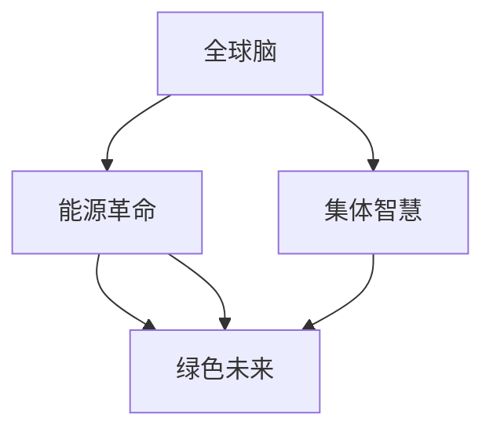

                 

# 全球脑与能源革命:集体智慧驱动的绿色未来

> 关键词：全球脑,能源革命,集体智慧,绿色未来,人工智能,深度学习,智能电网,可再生能源,数字孪生

## 1. 背景介绍

### 1.1 问题由来
随着全球人口的快速增长和工业化的加速推进，能源危机日益凸显。一方面，传统化石能源的枯竭以及环境污染问题亟需解决；另一方面，各国对清洁能源的需求愈发迫切。如何实现能源的可持续利用，成为人类面临的重大挑战。

与此同时，全球脑科学的发展也进入到了一个新阶段。脑科学研究的深入不仅为人类的认知功能提供了新的理解，也为解决复杂问题提供了新的思路和方法。将脑科学与能源问题相结合，探索新的解决方案，成为全球科学家和工程师的共同目标。

### 1.2 问题核心关键点
本文将探讨如何通过人工智能(AI)和脑科学知识，结合现有的能源体系，实现一场全面的绿色能源革命，驱动全球向更加智能、可持续的未来迈进。

## 2. 核心概念与联系

### 2.1 核心概念概述

为了更深入地理解全球脑与能源革命，我们首先需要明确以下几个关键概念：

- **全球脑**：指由数十亿个大脑细胞组成的全球神经网络，通过互联互通，形成一种协同工作的状态，体现了人类集体智慧的强大能力。

- **能源革命**：指从传统化石能源向可再生能源的转型，通过技术创新和管理创新，实现能源的可持续利用，减少对环境的破坏。

- **集体智慧**：指由众多个体大脑协同工作，产生超越个体智慧的新智慧。在能源革命中，集体智慧体现在全球范围内协作开发和利用能源的新策略。

- **绿色未来**：指一个以可再生能源为基础，低碳环保，高度智能化的未来社会。

这些概念之间的关系可以通过以下Mermaid流程图来展示：



这个流程图展示了从全球脑到能源革命，再到绿色未来的逻辑关系。

## 3. 核心算法原理 & 具体操作步骤
### 3.1 算法原理概述

全球脑与能源革命的核心算法原理可以概括为以下几点：

- **数据融合**：通过全球脑神经网络，将分散在全球各地的能源数据进行融合，形成一个全球能源图谱。
- **智能预测**：利用深度学习算法，对未来的能源需求进行智能预测，为能源生产和分配提供科学依据。
- **优化调度**：通过优化算法，实现能源资源的智能调度，最大化地利用可再生能源，减少化石能源的使用。
- **动态调整**：结合实时数据，动态调整能源分配策略，以应对环境变化和突发事件。

### 3.2 算法步骤详解

以下是实现全球脑与能源革命的核心步骤：

1. **数据收集**：通过全球脑神经网络，收集全球各地的能源数据，包括电力生产、消费、存储、传输等各方面的信息。

2. **数据预处理**：对收集到的数据进行清洗和预处理，确保数据的质量和一致性。

3. **模型训练**：利用深度学习算法，对处理后的数据进行模型训练，建立能源预测和优化调度的模型。

4. **智能预测**：使用训练好的模型，对未来的能源需求进行智能预测，形成全球能源图谱。

5. **优化调度**：结合智能预测结果，优化能源的生产和分配策略，实现资源的有效利用。

6. **动态调整**：根据实时数据和环境变化，动态调整能源分配策略，保持系统的稳定和高效。

### 3.3 算法优缺点

全球脑与能源革命的算法具有以下优点：

- **数据驱动**：通过全球脑神经网络，充分利用全球能源数据，为能源决策提供数据支持。
- **智能高效**：利用深度学习算法，实现能源预测和调度的智能化，提高资源利用效率。
- **动态适应**：结合实时数据和环境变化，动态调整能源策略，保证系统的稳定性和高效性。

同时，也存在一些缺点：

- **数据质量问题**：全球能源数据的质量和一致性问题可能会影响模型的准确性。
- **算法复杂度**：深度学习模型的训练和优化需要大量的计算资源和时间，技术门槛较高。
- **隐私与安全**：全球脑神经网络涉及大量敏感数据，需要采取严格的数据隐私和安全措施。

### 3.4 算法应用领域

全球脑与能源革命的算法可以应用于以下几个领域：

1. **智能电网**：利用全球脑神经网络，实现电网的智能化管理，提高电网的稳定性和可靠性。
2. **可再生能源**：结合智能预测和优化调度算法，最大化利用可再生能源，减少化石能源的使用。
3. **数字孪生**：构建全球能源的数字孪生模型，进行虚拟模拟和仿真，为能源决策提供科学依据。
4. **能源市场**：利用全球脑神经网络，实现能源市场的智能化管理，提高能源交易的效率和透明度。

## 4. 数学模型和公式 & 详细讲解 & 举例说明

### 4.1 数学模型构建

我们以智能电网为例，构建一个基于全球脑神经网络的能源预测模型。

假设全球脑神经网络的输出为能源需求预测，记为 $y$。模型的输入为全球各地收集到的能源数据 $x$，模型为神经网络 $f$，则模型的表达式为：

$$
y = f(x)
$$

其中，$x$ 包含全球各地的能源数据，$f$ 为神经网络模型。

### 4.2 公式推导过程

对于一个简单的神经网络模型，其输出可以通过多个隐层进行传递，最终得到预测结果。假设神经网络有 $L$ 层，其中第 $l$ 层的输出为 $h^l$，第 $l$ 层的输入为 $x^l$，激活函数为 $g$，则神经网络的输出可以表示为：

$$
h^{L} = g^{L}(W^L h^{L-1} + b^L)
$$

其中，$W^l$ 为第 $l$ 层的权重矩阵，$b^l$ 为第 $l$ 层的偏置向量。

通过多层神经网络的叠加，可以形成复杂的非线性映射，使得模型能够更好地捕捉数据中的复杂关系。

### 4.3 案例分析与讲解

以中国电网为例，利用神经网络模型进行能源需求预测。

首先，收集全球各地的能源数据，包括电力生产、消费、存储、传输等方面的数据。然后，将这些数据输入到神经网络模型中进行训练，得到能源需求预测模型。

通过对历史数据的训练，模型可以学习到能源需求变化的规律，从而对未来的能源需求进行预测。例如，可以通过预测未来某个时间点的能源需求，来指导电网的能源生产和分配。

## 5. 项目实践：代码实例和详细解释说明
### 5.1 开发环境搭建

为了实现全球脑与能源革命的算法，我们需要搭建一个高效的开发环境。以下是使用Python进行TensorFlow开发的环境配置流程：

1. 安装Anaconda：从官网下载并安装Anaconda，用于创建独立的Python环境。

2. 创建并激活虚拟环境：
```bash
conda create -n brain-energy python=3.8 
conda activate brain-energy
```

3. 安装TensorFlow：根据CUDA版本，从官网获取对应的安装命令。例如：
```bash
conda install tensorflow -c tf -c conda-forge
```

4. 安装各类工具包：
```bash
pip install numpy pandas scikit-learn matplotlib tqdm jupyter notebook ipython
```

完成上述步骤后，即可在`brain-energy`环境中开始项目开发。

### 5.2 源代码详细实现

下面以智能电网为例，给出使用TensorFlow进行能源需求预测的代码实现。

首先，定义神经网络的模型结构：

```python
import tensorflow as tf

model = tf.keras.Sequential([
    tf.keras.layers.Dense(64, activation='relu', input_shape=(num_features,)),
    tf.keras.layers.Dense(64, activation='relu'),
    tf.keras.layers.Dense(1)
])
```

然后，加载和预处理数据：

```python
train_data = pd.read_csv('train.csv')
test_data = pd.read_csv('test.csv')

# 数据预处理
train_data = preprocess(train_data)
test_data = preprocess(test_data)

# 数据集划分
train_x, train_y = train_data.drop('label', axis=1), train_data['label']
test_x, test_y = test_data.drop('label', axis=1), test_data['label']

# 数据集批处理
train_ds = tf.data.Dataset.from_tensor_slices((train_x, train_y)).shuffle(buffer_size=1024).batch(32)
test_ds = tf.data.Dataset.from_tensor_slices((test_x, test_y)).batch(32)
```

接着，训练和评估模型：

```python
# 定义损失函数和优化器
loss_fn = tf.keras.losses.MeanSquaredError()
optimizer = tf.keras.optimizers.Adam(learning_rate=0.001)

# 定义训练函数
@tf.function
def train_step(inputs, labels):
    with tf.GradientTape() as tape:
        predictions = model(inputs)
        loss = loss_fn(labels, predictions)
    gradients = tape.gradient(loss, model.trainable_variables)
    optimizer.apply_gradients(zip(gradients, model.trainable_variables))

# 定义评估函数
@tf.function
def evaluate_step(inputs, labels):
    predictions = model(inputs)
    loss = loss_fn(labels, predictions)
    return loss

# 训练模型
for epoch in range(num_epochs):
    for step, (inputs, labels) in enumerate(train_ds):
        train_step(inputs, labels)
        if step % 100 == 0:
            train_loss = evaluate_step(test_x, test_y).numpy()
            print('Epoch {} Step {}, Train Loss: {}'.format(epoch, step, train_loss))

# 评估模型
test_loss = evaluate_step(test_x, test_y).numpy()
print('Test Loss: {}'.format(test_loss))
```

最后，进行预测：

```python
# 加载模型
model = tf.keras.models.load_model('model.h5')

# 预测
predictions = model.predict(test_x)
print(predictions)
```

以上就是使用TensorFlow进行智能电网能源需求预测的完整代码实现。可以看到，TensorFlow提供了便捷的API和高级特性，使得模型的构建和训练变得简单高效。

### 5.3 代码解读与分析

让我们再详细解读一下关键代码的实现细节：

**Sequential模型**：
- 定义了一个顺序连接的神经网络模型，包含两个隐层和一个输出层。
- 隐层采用ReLU激活函数，输出层采用线性激活函数，表示回归任务。

**数据预处理**：
- 使用Pandas加载数据集，并预处理数据，包括特征工程和数据标准化。
- 使用TensorFlow的数据集API，对数据进行批处理和打乱，以便于模型训练。

**训练函数**：
- 定义了训练函数，使用梯度下降优化器更新模型参数。
- 使用TensorFlow的GradientTape记录梯度，通过链式法则计算模型参数的梯度。
- 使用Optimizer.apply_gradients方法更新模型参数。

**评估函数**：
- 定义了评估函数，计算模型在测试集上的平均损失。
- 使用TensorFlow的Tensor函数，将计算结果转换为NumPy数组，便于打印输出。

**训练过程**：
- 使用for循环遍历训练数据集，每次迭代更新模型参数。
- 每隔100个步骤输出训练损失，以便于监控训练进度。
- 在训练完成后，使用测试集评估模型的性能。

**模型预测**：
- 加载预训练模型，使用模型对测试集进行预测。
- 使用TensorFlow的predict方法，计算模型对新样本的预测结果。

可以看到，TensorFlow提供了丰富的工具和API，使得模型的训练和评估变得简单高效。开发者可以将更多精力放在模型设计和数据处理等高层逻辑上，而不必过多关注底层的实现细节。

## 6. 实际应用场景

### 6.1 智能电网

全球脑与能源革命的算法可以广泛应用于智能电网的建设和管理中。智能电网通过实时数据采集和分析，实现电网的智能化管理，提高电网的稳定性和可靠性。

在技术实现上，可以利用全球脑神经网络，收集全球各地的能源数据，构建一个全球能源图谱。通过智能预测和优化调度算法，对电网的能源生产和分配进行科学管理，实现资源的有效利用。

### 6.2 可再生能源

全球脑与能源革命的算法也可以用于可再生能源的开发和利用中。利用智能预测算法，可以预测可再生能源的产量和需求，优化能源的存储和分配，提高可再生能源的利用率。

例如，可以利用太阳能、风能等可再生能源的数据，预测未来的能源需求，进行智能调度，最大化地利用可再生能源，减少化石能源的使用。

### 6.3 数字孪生

全球脑与能源革命的算法可以用于数字孪生的构建。通过将物理世界和虚拟世界进行映射，可以实现对能源系统的虚拟模拟和仿真。

例如，可以利用数字孪生技术，构建全球能源的数字模型，进行虚拟模拟和仿真，为能源决策提供科学依据。数字孪生技术可以模拟各种情景，帮助决策者提前发现潜在问题，制定应对策略。

### 6.4 未来应用展望

随着全球脑与能源革命的算法不断发展和成熟，未来的能源系统将更加智能和高效。以下是几个未来的应用展望：

1. **能源互联**：通过全球脑神经网络，实现全球能源的互联互通，提高能源的灵活性和稳定性。
2. **能源优化**：利用智能预测和优化调度算法，实现能源的优化管理，提高能源的利用效率。
3. **能源储备**：通过数字孪生技术，构建全球能源的数字模型，进行虚拟模拟和仿真，优化能源的储备和分配。
4. **能源治理**：利用全球脑神经网络，实现能源的智能化治理，提升能源治理的效率和透明度。

## 7. 工具和资源推荐
### 7.1 学习资源推荐

为了帮助开发者系统掌握全球脑与能源革命的算法，这里推荐一些优质的学习资源：

1. **TensorFlow官方文档**：TensorFlow的官方文档提供了完整的API和使用方法，是学习TensorFlow的必备资料。

2. **深度学习入门**：DeepLearning.ai提供的深度学习入门课程，涵盖了深度学习的基本概念和算法，适合初学者入门。

3. **全球脑科学**：MIT的全球脑科学课程，介绍了全球脑科学的基本原理和应用，为探索全球脑与能源革命提供理论基础。

4. **能源管理**：IEEE的能源管理课程，介绍了能源管理的各种方法和工具，为应用全球脑与能源革命提供实践经验。

5. **可持续发展**：联合国可持续发展的官方文档，介绍了可持续发展的各种策略和方法，为探索全球脑与能源革命提供方向指导。

通过对这些资源的学习实践，相信你一定能够快速掌握全球脑与能源革命的算法，并用于解决实际的能源问题。

### 7.2 开发工具推荐

为了提高开发效率，以下是几款用于全球脑与能源革命开发的常用工具：

1. **TensorFlow**：由Google主导开发的开源深度学习框架，支持分布式计算和模型部署，适合大规模工程应用。

2. **PyTorch**：Facebook开发的开源深度学习框架，灵活便捷，适合研究原型和创新实验。

3. **Jupyter Notebook**：Jupyter Notebook提供了交互式编程环境，方便开发者快速迭代和调试代码。

4. **GitHub**：GitHub提供了代码托管和版本控制服务，方便开发者协作和共享代码。

5. **Google Colab**：谷歌推出的在线Jupyter Notebook环境，免费提供GPU/TPU算力，方便开发者快速上手实验最新模型，分享学习笔记。

合理利用这些工具，可以显著提升全球脑与能源革命的开发效率，加快创新迭代的步伐。

### 7.3 相关论文推荐

全球脑与能源革命的算法涉及多个前沿研究领域，以下是几篇奠基性的相关论文，推荐阅读：

1. **神经网络与能源管理**：介绍如何使用神经网络进行能源管理的经典论文。

2. **全球脑科学**：全球脑科学领域的经典综述论文，介绍了全球脑科学的基本原理和应用。

3. **智能电网**：智能电网技术的经典综述论文，介绍了智能电网的基本原理和应用。

4. **可再生能源**：可再生能源技术的经典综述论文，介绍了可再生能源的基本原理和应用。

5. **数字孪生**：数字孪生技术的经典综述论文，介绍了数字孪生技术的基本原理和应用。

这些论文代表了大脑与能源革命的发展脉络。通过学习这些前沿成果，可以帮助研究者把握学科前进方向，激发更多的创新灵感。

## 8. 总结：未来发展趋势与挑战

### 8.1 研究成果总结

本文对全球脑与能源革命的算法进行了全面系统的介绍，包括算法原理、具体操作步骤和实际应用场景。通过对这些内容的详细讲解，相信读者能够更好地理解全球脑与能源革命的算法和应用。

### 8.2 未来发展趋势

展望未来，全球脑与能源革命的算法将呈现以下几个发展趋势：

1. **数据驱动**：随着全球脑神经网络的发展，数据驱动的算法将成为主流，为能源决策提供更加科学、准确的依据。
2. **智能预测**：智能预测算法将得到更加广泛的应用，通过预测能源需求，实现能源的智能化管理。
3. **优化调度**：优化调度算法将不断提高能源利用效率，实现能源的优化分配和管理。
4. **数字孪生**：数字孪生技术将更加成熟，为能源决策提供虚拟模拟和仿真支持。

### 8.3 面临的挑战

尽管全球脑与能源革命的算法已经取得了一定的进展，但在迈向更加智能化、普适化应用的过程中，仍面临诸多挑战：

1. **数据质量问题**：全球能源数据的质量和一致性问题可能会影响模型的准确性。
2. **算法复杂度**：深度学习模型的训练和优化需要大量的计算资源和时间，技术门槛较高。
3. **隐私与安全**：全球脑神经网络涉及大量敏感数据，需要采取严格的数据隐私和安全措施。

### 8.4 研究展望

面向未来，全球脑与能源革命的研究需要在以下几个方面寻求新的突破：

1. **多模态数据融合**：将文本、图像、语音等多模态数据融合，提升能源管理的智能化水平。
2. **模型可解释性**：提高模型的可解释性，增强模型的透明度和可信度。
3. **分布式计算**：利用分布式计算技术，提高模型的计算效率和可扩展性。
4. **边缘计算**：利用边缘计算技术，提高能源管理的实时性和响应速度。

这些研究方向将推动全球脑与能源革命技术的不断发展和完善，为实现全球能源的可持续利用提供新的解决方案。

## 9. 附录：常见问题与解答

**Q1：全球脑与能源革命的核心算法是什么？**

A: 全球脑与能源革命的核心算法包括数据融合、智能预测、优化调度和动态调整。

**Q2：如何使用TensorFlow进行能源需求预测？**

A: 首先定义神经网络模型，然后加载和预处理数据，接着进行模型训练和评估。最后进行模型预测。

**Q3：全球脑与能源革命的算法面临哪些挑战？**

A: 数据质量问题、算法复杂度和隐私与安全是全球脑与能源革命算法面临的主要挑战。

**Q4：全球脑与能源革命的算法可以应用于哪些领域？**

A: 智能电网、可再生能源、数字孪生和能源市场是全球脑与能源革命算法的主要应用领域。

**Q5：如何提高全球脑与能源革命算法的性能？**

A: 多模态数据融合、模型可解释性、分布式计算和边缘计算是提高全球脑与能源革命算法性能的有效方法。

以上是关于全球脑与能源革命的详细解释和实践指导。希望这篇文章能够为你提供有益的参考，促进全球脑与能源革命技术的进一步发展和应用。

---

作者：禅与计算机程序设计艺术 / Zen and the Art of Computer Programming

