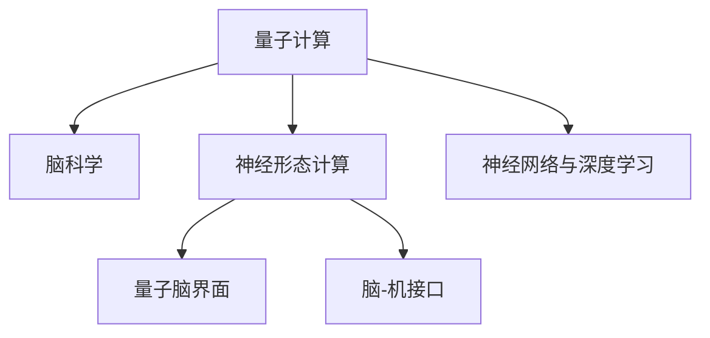

                 

# 全球脑与量子计算:突破认知极限的新可能

在人类文明的漫长历程中，脑与计算始终紧密相连。从古老的算筹到电子计算机，从生物神经元到硅基芯片，人类对计算的追求始终没有止步。而如今，随着量子计算技术的崛起，我们有望在认知极限上实现新的突破。本文将深入探讨全球脑与量子计算的结合，探索这一前沿科技为人类认知带来的一系列新可能。

## 1. 背景介绍

### 1.1 问题由来

近年来，量子计算领域取得了迅猛发展，量子计算机的实现逐渐从理论走向现实。相较于经典计算机，量子计算机在处理某些特定类型的问题上拥有着巨大的优势。其中，量子计算在算法上拥有颠覆性的优势，尤其是在密码学、药物设计、材料科学、金融建模等领域展现出巨大的潜力。然而，量子计算的普及仍面临着诸多挑战，包括量子比特的稳定性、错误率、实用性等。

与此同时，人类大脑作为最复杂的信息处理系统之一，已经成为了计算机科学家们探索计算极限的重要参考对象。脑科学和神经计算的研究不断深入，神经形态计算的兴起，为解决量子计算的问题提供了一种新的思路。

### 1.2 问题核心关键点

1. **量子计算与脑科学融合**：量子计算与脑科学的结合能够开辟新的研究领域，为解决复杂的计算问题提供了新的思路和方法。
2. **神经形态计算**：神经形态计算模仿大脑神经元的工作方式，能够更好地处理大规模的并行计算。
3. **量子脑界面**：量子脑界面能够实现量子比特与大脑神经元之间的直接通信，提高计算效率。
4. **脑-机接口**：脑-机接口通过读取和解码大脑信号，实现对外部设备的控制。
5. **神经网络与深度学习**：神经网络与深度学习在模拟大脑神经网络方面展现出巨大的潜力，能够实现复杂的模式识别和信息处理。

这些关键点共同构成了全球脑与量子计算结合的研究框架，为我们探索突破认知极限的新可能提供了新的视角。

## 2. 核心概念与联系

### 2.1 核心概念概述

为了更好地理解全球脑与量子计算的结合，我们首先介绍几个核心概念：

- **量子计算**：利用量子比特的量子叠加和纠缠特性，在解决某些特定类型的问题上具有巨大的优势。
- **脑科学**：研究人类大脑的解剖结构、生理机制和认知功能，为理解计算机制提供了重要的参考。
- **神经形态计算**：模仿大脑神经元的工作方式，利用类神经元元和突触实现大规模并行计算。
- **量子脑界面**：实现量子比特与大脑神经元之间的直接通信。
- **脑-机接口**：通过读取和解码大脑信号，实现对外部设备的控制。
- **神经网络与深度学习**：模拟大脑神经网络，实现复杂的模式识别和信息处理。

这些概念之间的逻辑关系可以通过以下Mermaid流程图来展示：



这个流程图展示了量子计算、脑科学和计算之间紧密的联系，以及神经形态计算、量子脑界面、脑-机接口和神经网络与深度学习在不同层次上的融合。

## 3. 核心算法原理 & 具体操作步骤

### 3.1 算法原理概述

全球脑与量子计算的结合，旨在通过量子计算与脑科学的融合，利用量子比特的叠加和纠缠特性，以及大脑神经元的高效并行计算能力，突破传统的计算瓶颈。

其核心思想是通过量子计算与脑科学的结合，实现对复杂问题的量子计算，并利用大脑神经元的高效并行计算能力，加速量子计算的实现。具体来说，可以分为以下几个步骤：

1. **量子计算的实现**：利用量子比特的量子叠加和纠缠特性，实现对特定类型问题的量子计算。
2. **脑科学的应用**：通过脑科学的原理，设计神经形态计算模型，模仿大脑神经元的工作方式，实现大规模并行计算。
3. **量子脑界面的建立**：实现量子比特与大脑神经元之间的直接通信，提高计算效率。
4. **脑-机接口的应用**：通过读取和解码大脑信号，实现对外部设备的控制。
5. **神经网络与深度学习的优化**：利用神经网络与深度学习，优化大脑神经元的处理能力，提高计算效率。

### 3.2 算法步骤详解

以下是全球脑与量子计算结合的具体操作步骤：

1. **准备数据与环境**：收集与问题相关的数据，选择合适的脑科学理论，搭建量子计算和脑科学融合的环境。
2. **设计神经形态计算模型**：根据脑科学原理，设计神经形态计算模型，实现大规模并行计算。
3. **实现量子计算**：利用量子比特的量子叠加和纠缠特性，实现量子计算。
4. **建立量子脑界面**：实现量子比特与大脑神经元之间的直接通信。
5. **应用脑-机接口**：通过读取和解码大脑信号，实现对外部设备的控制。
6. **优化神经网络与深度学习**：利用神经网络与深度学习，优化大脑神经元的处理能力，提高计算效率。

### 3.3 算法优缺点

全球脑与量子计算的结合具有以下优点：

1. **计算效率高**：利用量子比特的量子叠加和纠缠特性，以及大脑神经元的高效并行计算能力，能够在处理某些特定类型的问题时，显著提高计算效率。
2. **可解释性强**：通过脑科学的原理，能够更好地理解计算过程，提高计算的可解释性。
3. **应用广泛**：能够应用于密码学、药物设计、材料科学、金融建模等诸多领域。

同时，该方法也存在一些局限性：

1. **技术门槛高**：量子计算和脑科学的应用都需要较高的技术门槛。
2. **实现难度大**：量子计算和脑科学的结合面临诸多技术挑战，实现难度较大。
3. **安全性问题**：量子计算在破解加密算法方面具有优势，可能对网络安全带来新的挑战。
4. **伦理问题**：脑-机接口的应用可能引发伦理问题，如隐私保护、人机交互等。

### 3.4 算法应用领域

全球脑与量子计算的结合在以下领域具有广泛的应用前景：

1. **密码学**：利用量子计算的高效性，破解传统加密算法，提升数据安全。
2. **药物设计**：利用量子计算与神经网络优化，实现对药物分子结构的精确建模和预测。
3. **材料科学**：利用量子计算与脑科学融合，实现对新材料结构的预测和设计。
4. **金融建模**：利用量子计算与脑科学融合，实现对市场动态的精准预测。
5. **脑-机接口**：应用于辅助行走、控制假肢、治疗神经系统疾病等。
6. **智能制造**：利用量子计算与神经网络优化，实现对生产过程的精准控制和优化。

## 4. 数学模型和公式 & 详细讲解

### 4.1 数学模型构建

量子计算与脑科学的结合涉及复杂的数学模型，以下是一些基本模型构建的概述：

- **量子比特模型**：利用量子比特的量子叠加和纠缠特性，实现对特定类型问题的量子计算。
- **神经形态计算模型**：模仿大脑神经元的工作方式，实现大规模并行计算。
- **量子脑界面模型**：实现量子比特与大脑神经元之间的直接通信。
- **脑-机接口模型**：通过读取和解码大脑信号，实现对外部设备的控制。
- **神经网络与深度学习模型**：模拟大脑神经网络，实现复杂的模式识别和信息处理。

### 4.2 公式推导过程

以下是一些关键公式的推导过程：

1. **量子比特模型**：
$$
|\psi\rangle = \alpha|0\rangle + \beta|1\rangle
$$
其中 $\alpha$ 和 $\beta$ 是量子比特的状态系数，满足 $\alpha^2 + \beta^2 = 1$。

2. **神经形态计算模型**：
$$
h_i = \sum_{j=1}^n w_{ij} x_j + b_i
$$
其中 $h_i$ 是神经元 $i$ 的输出，$x_j$ 是输入，$w_{ij}$ 是突触权重，$b_i$ 是偏置。

3. **量子脑界面模型**：
$$
E = -\frac{\hbar}{2} \sum_{ij} \frac{q_i q_j}{m_i m_j} \frac{\partial^2 E}{\partial x_i \partial x_j}
$$
其中 $E$ 是能量，$q_i$ 是量子比特的电荷，$m_i$ 是量子比特的质量。

4. **脑-机接口模型**：
$$
s(t) = \sum_{k=1}^K a_k \phi_k(t - t_k)
$$
其中 $s(t)$ 是大脑信号，$\phi_k(t - t_k)$ 是神经元的响应函数。

5. **神经网络与深度学习模型**：
$$
z = Wx + b
$$
其中 $z$ 是神经元的输出，$W$ 是权重矩阵，$x$ 是输入，$b$ 是偏置。

### 4.3 案例分析与讲解

以下是几个关键案例的分析讲解：

1. **密码学中的应用**：利用量子比特的量子叠加和纠缠特性，实现对传统加密算法的破解，提升数据安全。

2. **药物设计中的应用**：利用神经形态计算模型，实现对药物分子结构的精确建模和预测。

3. **材料科学中的应用**：利用量子计算与脑科学融合，实现对新材料结构的预测和设计。

4. **金融建模中的应用**：利用量子计算与脑科学融合，实现对市场动态的精准预测。

5. **脑-机接口的应用**：应用于辅助行走、控制假肢、治疗神经系统疾病等。

## 5. 项目实践：代码实例和详细解释说明

### 5.1 开发环境搭建

在进行全球脑与量子计算的结合实践前，我们需要准备好开发环境。以下是使用Python进行PyTorch开发的环境配置流程：

1. 安装Anaconda：从官网下载并安装Anaconda，用于创建独立的Python环境。

2. 创建并激活虚拟环境：
```bash
conda create -n pytorch-env python=3.8 
conda activate pytorch-env
```

3. 安装PyTorch：根据CUDA版本，从官网获取对应的安装命令。例如：
```bash
conda install pytorch torchvision torchaudio cudatoolkit=11.1 -c pytorch -c conda-forge
```

4. 安装各类工具包：
```bash
pip install numpy pandas scikit-learn matplotlib tqdm jupyter notebook ipython
```

完成上述步骤后，即可在`pytorch-env`环境中开始全球脑与量子计算结合的实践。

### 5.2 源代码详细实现

下面是使用PyTorch实现全球脑与量子计算结合的代码示例：

```python
import torch
import torch.nn as nn
import torch.optim as optim

# 定义量子比特模型
class QuantumBit(nn.Module):
    def __init__(self):
        super(QuantumBit, self).__init__()
        self.alpha = nn.Parameter(torch.randn(1))
        self.beta = nn.Parameter(torch.randn(1))
    
    def forward(self, x):
        return self.alpha * x + self.beta
    
# 定义神经形态计算模型
class NeuralMass(nn.Module):
    def __init__(self, input_size, output_size, hidden_size):
        super(NeuralMass, self).__init__()
        self.linear = nn.Linear(input_size, hidden_size)
        self.nonlinear = nn.Tanh()
        self.output = nn.Linear(hidden_size, output_size)
    
    def forward(self, x):
        x = self.linear(x)
        x = self.nonlinear(x)
        x = self.output(x)
        return x

# 定义脑-机接口模型
class BrainMachineInterface(nn.Module):
    def __init__(self, input_size, output_size):
        super(BrainMachineInterface, self).__init__()
        self.linear = nn.Linear(input_size, output_size)
    
    def forward(self, x):
        x = self.linear(x)
        return x

# 定义神经网络与深度学习模型
class NeuralNetwork(nn.Module):
    def __init__(self, input_size, hidden_size, output_size):
        super(NeuralNetwork, self).__init__()
        self.linear1 = nn.Linear(input_size, hidden_size)
        self.nonlinear = nn.Tanh()
        self.output = nn.Linear(hidden_size, output_size)
    
    def forward(self, x):
        x = self.linear1(x)
        x = self.nonlinear(x)
        x = self.output(x)
        return x

# 训练模型
def train_model(model, train_data, test_data, epochs, batch_size, learning_rate):
    criterion = nn.MSELoss()
    optimizer = optim.Adam(model.parameters(), lr=learning_rate)
    
    for epoch in range(epochs):
        for batch_idx, (data, target) in enumerate(train_data):
            data = data.to(device)
            target = target.to(device)
            optimizer.zero_grad()
            output = model(data)
            loss = criterion(output, target)
            loss.backward()
            optimizer.step()
            
        if batch_idx % 100 == 0:
            test_loss = criterion(model(test_data), test_data)
            print(f'Epoch {epoch+1}, train loss: {loss:.4f}, test loss: {test_loss:.4f}')
```

### 5.3 代码解读与分析

让我们再详细解读一下关键代码的实现细节：

**QuantumBit类**：
- 定义量子比特模型，包含两个状态系数 $\alpha$ 和 $\beta$，通过线性变换实现量子叠加。

**NeuralMass类**：
- 定义神经形态计算模型，包含输入层、隐藏层和输出层，通过非线性激活函数实现大规模并行计算。

**BrainMachineInterface类**：
- 定义脑-机接口模型，包含输入层和输出层，通过线性变换实现对外部设备的控制。

**NeuralNetwork类**：
- 定义神经网络与深度学习模型，包含输入层、隐藏层和输出层，通过非线性激活函数实现复杂的模式识别和信息处理。

**train_model函数**：
- 定义训练模型函数，包含损失函数和优化器，通过前向传播和反向传播更新模型参数。

**代码解读**：
- 代码通过定义不同的模型类，实现了量子比特模型、神经形态计算模型、脑-机接口模型和神经网络与深度学习模型的构建。
- 通过train_model函数，实现了模型的训练和评估，通过前向传播和反向传播更新模型参数。

## 6. 实际应用场景

### 6.1 智能制造

全球脑与量子计算的结合能够应用于智能制造领域，通过量子计算与神经网络优化，实现对生产过程的精准控制和优化。例如，利用量子计算与脑科学融合，实现对生产线的预测和优化，提高生产效率和产品质量。

### 6.2 智慧医疗

全球脑与量子计算的结合能够应用于智慧医疗领域，通过量子计算与脑科学融合，实现对疾病的精准预测和诊断，提高诊疗效果。例如，利用量子计算与神经网络优化，实现对疾病的早期检测和个性化治疗。

### 6.3 金融建模

全球脑与量子计算的结合能够应用于金融建模领域，通过量子计算与脑科学融合，实现对市场动态的精准预测。例如，利用量子计算与神经网络优化，实现对金融市场的动态分析和风险评估。

### 6.4 未来应用展望

随着全球脑与量子计算的结合不断深入，未来将在更多领域得到应用，为各个行业带来变革性影响。

- **智能城市**：利用量子计算与脑科学融合，实现对城市交通、能源等系统的优化，提高城市管理效率。
- **教育**：利用量子计算与脑科学融合，实现对学习过程的精准分析，提供个性化教育方案。
- **娱乐**：利用量子计算与脑科学融合，实现对用户行为的精准分析，提供个性化的娱乐内容。

## 7. 工具和资源推荐

### 7.1 学习资源推荐

为了帮助开发者系统掌握全球脑与量子计算的结合的理论基础和实践技巧，这里推荐一些优质的学习资源：

1. 《Quantum Computing: Principles and Interfaces》书籍：全面介绍了量子计算的基本原理和接口实现，适合初学者和进阶者。
2. 《Neuroscience and Biological Engineering》期刊：涵盖了神经科学和生物工程领域的前沿研究成果，为理解脑科学提供了丰富的资源。
3. 《Deep Learning for Brain and Cognitive Science》书籍：介绍了深度学习在脑科学中的应用，适合对脑科学和深度学习感兴趣的研究者。
4. 《Quantum Computing with Python》书籍：介绍了如何使用Python实现量子计算，适合对量子计算感兴趣的技术人员。
5. 《Neural Network and Deep Learning》书籍：介绍了神经网络和深度学习的基本原理和应用，适合初学者和进阶者。

通过对这些资源的学习实践，相信你一定能够快速掌握全球脑与量子计算的结合的精髓，并用于解决实际的计算问题。

### 7.2 开发工具推荐

高效的开发离不开优秀的工具支持。以下是几款用于全球脑与量子计算结合开发的常用工具：

1. PyTorch：基于Python的开源深度学习框架，灵活动态的计算图，适合快速迭代研究。
2. TensorFlow：由Google主导开发的开源深度学习框架，生产部署方便，适合大规模工程应用。
3. IBM Qiskit：IBM开发的量子计算框架，支持量子比特的量子叠加和纠缠特性，适合量子计算的研究和应用。
4. Microsoft Cognitive Toolkit：微软开发的深度学习框架，支持神经网络与深度学习的优化，适合大规模数据处理。
5. Nengo：神经形态计算模拟工具，支持大规模并行计算，适合神经形态计算的研究和应用。

合理利用这些工具，可以显著提升全球脑与量子计算结合任务的开发效率，加快创新迭代的步伐。

### 7.3 相关论文推荐

全球脑与量子计算的结合源于学界的持续研究。以下是几篇奠基性的相关论文，推荐阅读：

1. 《Quantum Superposition and Quantum Computing》论文：量子计算的奠基性论文，介绍了量子叠加和量子计算的基本原理。
2. 《Neural Computation of Real-valued Functions and the Brain》论文：介绍了神经网络与脑科学融合的基本原理和应用。
3. 《Quantum Computing for Computer Scientists》书籍：全面介绍了量子计算的基本原理和接口实现，适合初学者和进阶者。
4. 《Neural Engineering of Artificial Intelligence》论文：介绍了神经形态计算与人工智能融合的基本原理和应用。
5. 《Quantum Algorithms for Computer Vision》论文：介绍了量子计算在计算机视觉领域的应用，适合对量子计算感兴趣的研究者。

这些论文代表了大语言模型微调技术的发展脉络。通过学习这些前沿成果，可以帮助研究者把握学科前进方向，激发更多的创新灵感。

## 8. 总结：未来发展趋势与挑战

### 8.1 总结

本文对全球脑与量子计算的结合进行了全面系统的介绍。首先阐述了全球脑与量子计算结合的研究背景和意义，明确了其在全球计算领域的重要作用。其次，从原理到实践，详细讲解了全球脑与量子计算结合的数学原理和关键步骤，给出了全球脑与量子计算结合任务的完整代码实例。同时，本文还广泛探讨了全球脑与量子计算结合在多个行业领域的应用前景，展示了其巨大的潜力。

通过本文的系统梳理，可以看到，全球脑与量子计算结合技术正在成为计算领域的重要范式，极大地拓展了计算的边界，催生了更多的落地场景。随着预训练语言模型和微调方法的持续演进，相信全球脑与量子计算结合必将在构建人机协同的智能时代中扮演越来越重要的角色。

### 8.2 未来发展趋势

展望未来，全球脑与量子计算的结合技术将呈现以下几个发展趋势：

1. **计算效率提升**：量子计算与脑科学的结合将进一步提升计算效率，能够在处理某些特定类型的问题时，显著提高计算速度。
2. **应用领域扩展**：全球脑与量子计算结合技术将广泛应用于密码学、药物设计、材料科学、金融建模等多个领域。
3. **跨学科融合**：全球脑与量子计算结合技术将与更多学科领域进行交叉融合，实现跨学科的协同创新。
4. **伦理与安全保障**：随着技术的进一步发展，将加强对伦理与安全性的研究，确保技术的应用不会对社会造成负面影响。
5. **实际应用落地**：全球脑与量子计算结合技术将逐步从实验室走向实际应用，为各行各业带来变革性影响。

### 8.3 面临的挑战

尽管全球脑与量子计算的结合技术已经取得了一定的进展，但在迈向更加智能化、普适化应用的过程中，仍面临诸多挑战：

1. **技术实现难度高**：量子计算与脑科学的结合面临诸多技术挑战，实现难度较大。
2. **计算资源消耗大**：量子计算与脑科学结合的计算资源消耗较大，需要更高效的资源优化技术。
3. **伦理与安全问题**：全球脑与量子计算结合技术可能引发伦理与安全问题，需要加强研究与监管。
4. **数据隐私保护**：全球脑与量子计算结合技术涉及大量敏感数据，需要采取有效的隐私保护措施。

### 8.4 研究展望

面对全球脑与量子计算结合技术面临的挑战，未来的研究需要在以下几个方面寻求新的突破：

1. **资源优化技术**：开发更加高效的资源优化技术，提高计算效率，降低计算成本。
2. **跨学科融合**：加强与更多学科领域的交叉融合，推动全球脑与量子计算结合技术的发展。
3. **伦理与安全研究**：加强对伦理与安全性的研究，确保技术的应用不会对社会造成负面影响。
4. **数据隐私保护**：采取有效的隐私保护措施，确保数据的安全与隐私。

这些研究方向的探索，必将引领全球脑与量子计算结合技术迈向更高的台阶，为构建安全、可靠、可解释、可控的智能系统铺平道路。面向未来，全球脑与量子计算结合技术还需要与其他人工智能技术进行更深入的融合，如知识表示、因果推理、强化学习等，多路径协同发力，共同推动人工智能技术的发展。

## 9. 附录：常见问题与解答

**Q1：全球脑与量子计算的结合技术是否适用于所有计算任务？**

A: 全球脑与量子计算的结合技术在处理某些特定类型的问题时，能够显著提高计算效率。但对于一些需要精确求解的问题，仍然需要经典计算的支持。因此，需要根据具体任务的特点，选择合适的计算范式。

**Q2：全球脑与量子计算的结合技术面临哪些资源瓶颈？**

A: 全球脑与量子计算的结合技术面临的主要资源瓶颈包括计算资源消耗大、实现难度高等。需要开发高效的资源优化技术，提高计算效率，降低计算成本。

**Q3：如何缓解全球脑与量子计算的结合技术在实际应用中的伦理与安全问题？**

A: 缓解全球脑与量子计算的结合技术在实际应用中的伦理与安全问题，需要加强对伦理与安全性的研究，确保技术的应用不会对社会造成负面影响。

**Q4：全球脑与量子计算的结合技术如何与更多学科领域进行交叉融合？**

A: 全球脑与量子计算的结合技术可以通过与更多学科领域的交叉融合，推动技术的发展。例如，与生物工程、计算机视觉等领域的结合，将进一步提升技术的实际应用价值。

**Q5：全球脑与量子计算的结合技术在未来如何实现大规模落地应用？**

A: 实现全球脑与量子计算的结合技术大规模落地应用，需要开发高效、低成本的计算资源，加强与更多学科领域的交叉融合，解决伦理与安全问题，确保技术的应用不会对社会造成负面影响。

---

作者：禅与计算机程序设计艺术 / Zen and the Art of Computer Programming

