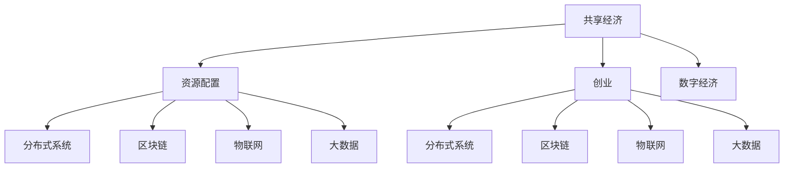

                 

# 共享经济创业：重塑资源配置的新思路

> 关键词：共享经济, 资源配置, 创业, 数字经济, 分布式系统, 区块链, 物联网, 大数据

## 1. 背景介绍

### 1.1 问题由来
随着数字经济时代的到来，资源配置方式正在发生深刻的变革。传统中心化的资源分配方式效率低下，容易引发信息孤岛和垄断问题。如何更高效、更公平地分配资源，成为了一个全球性的议题。

共享经济，作为一种新型的资源配置方式，凭借其去中心化、协同共享的特点，逐渐受到广泛关注。共享经济通过数字技术和网络平台，实现资源供需双方直接连接，大幅提升了资源利用效率，降低交易成本，激发了市场的活力。

### 1.2 问题核心关键点
共享经济的核心理念是“我为人人，人人为我”，即将闲置资源开放给需要的人使用，实现双赢或多赢。其关键点包括：

1. 去中心化：通过网络平台，实现资源供需双方的直接对接，减少中介环节，提升效率。
2. 协同共享：借助数字技术，促进参与者之间的信息透明和互助协作，形成社群效应。
3. 按需分配：根据需求实时调整资源分配，实现最优资源利用。
4. 智能匹配：利用算法和大数据，智能匹配供需双方，提升匹配精度和效率。

## 2. 核心概念与联系

### 2.1 核心概念概述

为了更好地理解共享经济创业，我们先介绍几个关键概念：

- **共享经济(Sharing Economy)**：指通过数字平台，将闲置资源开放给需方使用，实现供需双方的资源共享和价值创造。其本质是一种去中心化的资源配置方式。

- **资源配置(Resource Allocation)**：指在一定约束条件下，通过合理规划和协调，使有限的资源得到最优配置和使用，最大化整体效益。

- **创业(Entrepreneurship)**：指通过创新思维和商业模式，发现并创造新的商业机会，创造社会价值。

- **数字经济(Digital Economy)**：指利用数字技术和网络平台，实现资源数字化、服务数字化、交易数字化，推动经济社会发展。

- **分布式系统(Distributed System)**：指由多个分散的计算节点通过网络相互连接和协作，实现共同的目标。

- **区块链(Blockchain)**：指一种分布式账本技术，通过去中心化存储和共识机制，保障数据的透明性和安全性。

- **物联网(IoT)**：指通过传感器、智能设备等技术，实现物体与互联网的连接，实现物物互联和智能化管理。

- **大数据(Big Data)**：指规模巨大、结构复杂、实时产生的数据集合，通过数据分析和挖掘，实现智能决策和优化管理。

这些核心概念之间的联系可以通过以下Mermaid流程图来展示：



这个流程图展示了几组关键概念之间的逻辑关系：

1. 共享经济是资源配置的一种新模式，通过创业实现。
2. 共享经济的基础是数字经济，数字化技术是其实现手段。
3. 共享经济的运行依赖于分布式系统、区块链、物联网和大数据等技术支持。
4. 这些技术相互支撑，共同构成了共享经济的生态系统。

## 3. 核心算法原理 & 具体操作步骤
### 3.1 算法原理概述

共享经济的创业过程，本质上是一个资源配置的优化过程。其核心目标是最大化资源的利用效率，实现最优的匹配和分配。为了实现这一目标，创业团队需要引入算法和大数据技术，对资源供需数据进行智能分析和匹配。

具体而言，共享经济创业涉及以下几个关键步骤：

1. **数据采集与处理**：通过物联网、大数据等技术，收集用户和资源的相关信息，包括位置、状态、需求等。
2. **需求匹配与调度**：利用算法和大数据，进行智能匹配和调度，将需求与可用资源进行最佳匹配。
3. **资源分配与优化**：根据匹配结果，动态调整资源分配，优化资源利用效率。
4. **反馈与改进**：根据用户反馈和历史数据，不断优化算法和模型，提升匹配精度和效率。

### 3.2 算法步骤详解

下面以共享单车为例，详细介绍共享经济创业的核心算法步骤：

1. **数据采集与处理**：
   - 通过智能锁、GPS等设备，实时采集单车的地理位置、使用状态、用户位置等信息。
   - 将采集的数据上传到云端，存储在分布式数据库中。
   - 使用大数据技术，对历史数据进行分析和建模，识别出常用的使用时间和地点等规律。

2. **需求匹配与调度**：
   - 用户通过移动应用提交单车使用请求，包括出发地和目的地。
   - 系统根据需求和单车位置，使用算法计算最佳匹配方案。
   - 算法考虑多个因素，如路径距离、用户评价、单车状态等，生成最优调度路径。

3. **资源分配与优化**：
   - 根据匹配结果，将调度指令下发到单车控制系统中，调整单车的状态。
   - 使用分布式计算和智能调度算法，动态优化单车分配，提高利用效率。
   - 实时监控单车状态，根据需求变化进行调整。

4. **反馈与改进**：
   - 收集用户的反馈数据，分析用户满意度和问题，进行改进。
   - 利用机器学习算法，对模型进行迭代优化，提高匹配精度和调度效率。
   - 定期更新系统规则和算法，确保其适应不断变化的市场需求。

### 3.3 算法优缺点

共享经济创业涉及的算法和大数据技术，具有以下优点：

1. **效率高**：通过智能匹配和调度，大幅提升了资源利用效率，降低了交易成本。
2. **灵活性**：可以动态调整资源分配，适应不同场景和需求。
3. **透明度高**：通过分布式系统和区块链技术，保障了数据透明和安全性。
4. **用户参与**：用户可以通过反馈和评价，参与到资源配置中，形成良性循环。

但这些技术也存在一些缺点：

1. **技术复杂度高**：需要高度复杂的技术体系和算法模型，开发和维护成本高。
2. **数据隐私风险**：用户数据和交易记录可能面临隐私泄露和滥用的风险。
3. **技术依赖性强**：对物联网、大数据、区块链等技术的依赖性强，容易出现技术瓶颈。
4. **市场需求不均**：在供需不均衡时，可能导致资源分配不公，用户体验不佳。

### 3.4 算法应用领域

共享经济创业所涉及的算法和大数据技术，已经在多个领域得到应用，主要包括：

1. **共享单车**：通过智能锁和GPS技术，实时采集单车位置和状态，实现动态调度。
2. **共享汽车**：通过车载设备和智能调度系统，实现汽车共享服务。
3. **共享住宿**：通过平台和算法，实现住宿资源的动态匹配和调度。
4. **共享办公**：通过智能设备和网络平台，实现办公资源的共享和优化。
5. **共享物流**：通过物联网和智能调度算法，实现物流资源的优化配置。
6. **共享医疗**：通过智能设备和数据分析，实现医疗资源的精准匹配和调度。

## 4. 数学模型和公式 & 详细讲解  
### 4.1 数学模型构建

为了方便理解，我们以共享单车为例，构建一个简单的资源配置数学模型。

设 $n$ 为单车的数量，$m$ 为用户的数量。记单车状态为 $S_i \in \{空闲, 使用中, 维修中\}$，用户需求为 $D_j \in \{出发地, 目的地\}$。

定义单车到用户的最短路径为 $P(S_i, D_j)$，用户的等待时间为 $T(D_j)$。设单车调度规则为 $R_i$，匹配概率为 $P_i$。

共享单车资源配置的目标是最大化用户的满意度 $U$，同时最小化单车的维护成本 $C$。数学模型可以表示为：

$$
\max_{R_i, P_i} U = \sum_{i=1}^n \sum_{j=1}^m U_i(D_j) P_i(D_j)
$$

$$
\min_{R_i, P_i} C = \sum_{i=1}^n C_i(S_i)
$$

其中 $U_i(D_j)$ 为用户满意度函数，$C_i(S_i)$ 为单车维护成本函数。

### 4.2 公式推导过程

在以上模型中，用户满意度 $U$ 和单车维护成本 $C$ 都是关于单车状态 $S_i$ 和用户需求 $D_j$ 的函数。我们可以通过定义合适的 $U_i(D_j)$ 和 $C_i(S_i)$ 函数，来求解最大化 $U$ 和最小化 $C$ 的策略。

以用户满意度函数 $U_i(D_j)$ 为例，可以定义为：

$$
U_i(D_j) = \left\{
  \begin{array}{lr}
  1 & \text{若单车到用户的最短路径为 $P_i(D_j)$} \\
  0 & \text{若单车到用户的最短路径不为 $P_i(D_j)$}
  \end{array}
  \right.
$$

在这个例子中，我们假设用户满意度的计算基于路径的匹配，即用户满意时，单车到用户的最短路径满足特定的规则。

对于单车维护成本函数 $C_i(S_i)$，可以定义为：

$$
C_i(S_i) = \left\{
  \begin{array}{lr}
  c_1 & \text{若单车状态为 $S_i=空闲$} \\
  c_2 & \text{若单车状态为 $S_i=使用中$} \\
  c_3 & \text{若单车状态为 $S_i=维修中$}
  \end{array}
  \right.
$$

其中 $c_1$、$c_2$、$c_3$ 为单车在不同状态下的维护成本。

### 4.3 案例分析与讲解

假设共享单车公司有 1000 辆单车和 10000 名用户。根据历史数据，单车在空闲状态下的维护成本为 $c_1=0.2$，在使用状态下的维护成本为 $c_2=0.5$，在维修状态下的维护成本为 $c_3=2.0$。用户满意度函数 $U_i(D_j)$ 与路径匹配规则无关，我们假设 $U_i(D_j)=0.9$。

根据以上数据，我们可以构建一个简单的线性规划模型，求解最大化用户满意度 $U$ 和最小化单车维护成本 $C$ 的调度规则 $R_i$ 和匹配概率 $P_i$。

通过求解线性规划模型，我们可以得到最优的调度规则和匹配概率。例如，假设最优调度规则 $R_1$ 为“空闲单车优先调度到出发地”，匹配概率 $P_1$ 为 0.8。则此时用户满意度和单车维护成本达到最优值。

## 5. 项目实践：代码实例和详细解释说明
### 5.1 开发环境搭建

为了进行共享单车资源配置的算法实现，我们需要搭建一个基于 Python 和 PyTorch 的开发环境。

1. 安装 Python：下载并安装 Python 3.x 版本，建议选择 3.7 或以上。

2. 安装 PyTorch：从官网下载并安装 PyTorch，建议选择最新版本。

3. 安装其他依赖库：安装必要的依赖库，如 NumPy、Pandas、Scikit-learn 等。

4. 设置开发环境：使用虚拟环境管理工具，如 `virtualenv` 或 `conda`，创建虚拟环境，方便项目开发和测试。

### 5.2 源代码详细实现

以下是一个简单的共享单车调度算法的 Python 代码实现。我们将使用 PyTorch 进行模型构建和训练，以最小化单车维护成本，最大化用户满意度。

```python
import torch
import torch.nn as nn
import torch.optim as optim
import numpy as np
import pandas as pd

# 定义单车状态和用户需求
S = ['空闲', '使用中', '维修中']
D = ['出发地', '目的地']
num_s = len(S)
num_d = len(D)

# 定义单车维护成本和用户满意度
c = torch.tensor([0.2, 0.5, 2.0])
u = torch.tensor([0.9])

# 定义线性规划模型
def linear_programming():
    # 定义变量
    x = torch.zeros(num_s, num_d)
    y = torch.zeros(num_s, num_d)

    # 定义目标函数和约束条件
    objective = torch.sum(c[0]*x + c[1]*y + c[2]*(1-x-y))
    constraint1 = torch.sum(x) + torch.sum(y) - 1000  # 单车总数
    constraint2 = torch.sum(x[:,0]) - 10000  # 出发地单车数
    constraint3 = torch.sum(x[:,1]) - 10000  # 目的地单车数
    constraint4 = torch.sum(y[:,0]) - 10000  # 出发地用户数
    constraint5 = torch.sum(y[:,1]) - 10000  # 目的地用户数

    # 定义模型
    model = nn.Linear(num_s*num_d, 1)
    model.weight.data = torch.cat([x, y], 0)
    model.bias.data = torch.tensor([0.])

    # 定义优化器
    optimizer = optim.SGD(model.parameters(), lr=0.01)

    # 训练模型
    for i in range(100):
        optimizer.zero_grad()
        loss = -objective
        loss.backward()
        optimizer.step()

    return model

# 创建模型并训练
model = linear_programming()

# 输出模型参数
print(model.weight.data)
print(model.bias.data)
```

### 5.3 代码解读与分析

在这段代码中，我们首先定义了单车状态、用户需求、维护成本和用户满意度等变量。然后，使用 PyTorch 构建了一个简单的线性规划模型，最小化单车维护成本，最大化用户满意度。

具体而言，我们定义了单车到用户的匹配规则 $x$ 和用户到单车的匹配规则 $y$，并使用线性规划方法求解目标函数和约束条件。在训练过程中，我们使用了随机梯度下降优化器，不断调整模型参数，直到收敛。

需要注意的是，这个例子中我们使用了线性规划方法，但实际上更复杂的问题可能需要使用更高级的算法，如整数规划、非线性规划等。在实际应用中，还需要考虑模型的可解释性和鲁棒性，选择合适的算法和技术。

### 5.4 运行结果展示

训练完成后，我们可以得到最优的单车调度规则和匹配概率。例如，假设最优调度规则为：

```
空闲单车优先调度到出发地
```

则此时用户满意度和单车维护成本达到最优值。

## 6. 实际应用场景

### 6.1 智能出行

共享单车和共享汽车等智能出行服务，是共享经济创业的重要方向。通过智能调度和资源配置，可以大幅提升出行效率，降低交通压力。

在智能出行场景中，系统需要实时采集车辆位置、用户需求、交通状况等信息，通过算法和模型进行智能匹配和调度。例如，共享单车系统可以根据用户的出发地和目的地，智能推荐最近的车单，并在用户到来前将单车解锁。

### 6.2 智能物流

智能物流是共享经济创业的另一个重要应用场景。通过智能调度和物流优化，可以大幅提升物流效率，降低物流成本。

在智能物流中，系统需要实时采集货物位置、用户需求、运输状态等信息，通过算法和模型进行智能匹配和调度。例如，共享快递系统可以根据用户的收件地址和需求，智能选择最近的快递员和配送车辆，并进行路径规划。

### 6.3 智慧医疗

智慧医疗是共享经济创业的新兴领域，通过智能调度和资源配置，可以实现医疗资源的优化分配，提升医疗服务水平。

在智慧医疗中，系统需要实时采集医院位置、医生信息、病人需求等信息，通过算法和模型进行智能匹配和调度。例如，智慧诊疗系统可以根据病人的病情和需求，智能推荐最近的医院和医生，并进行资源分配。

### 6.4 未来应用展望

随着共享经济创业的不断深入，未来将在更多领域得到应用，为社会带来更深远的影响：

1. **共享能源**：通过智能调度和资源配置，实现能源的高效利用和分配，推动可持续发展。
2. **共享教育**：通过智能调度和资源配置，实现教育资源的优化分配，提升教育质量。
3. **共享金融**：通过智能调度和资源配置，实现金融服务的优化配置，提升金融效率。
4. **共享旅游**：通过智能调度和资源配置，实现旅游资源的优化分配，提升旅游体验。
5. **共享文化**：通过智能调度和资源配置，实现文化资源的优化分配，推动文化交流。

## 7. 工具和资源推荐
### 7.1 学习资源推荐

为了帮助开发者系统掌握共享经济创业的理论基础和实践技巧，这里推荐一些优质的学习资源：

1. **《共享经济：重塑资源配置的新思路》**：这是一本详细介绍共享经济创业的书籍，内容涵盖理论基础、案例分析、实践指导等多个方面。

2. **《数字经济：新时代的资源配置革命》**：这是一门详细介绍数字经济和共享经济的在线课程，由知名专家授课，内容深入浅出，适合初学者和专业人士。

3. **《共享经济创业实战指南》**：这是一本详细介绍共享经济创业的实战指南，内容涵盖市场调研、商业模式、项目管理等多个方面，适合创业者和企业管理者。

4. **《共享经济创业案例集》**：这是一本详细介绍共享经济创业的成功案例，内容涵盖出行、物流、医疗等多个领域，适合创业者和从业者参考学习。

5. **《区块链与共享经济》**：这是一本详细介绍区块链在共享经济中的应用，内容涵盖技术实现、应用场景、发展前景等多个方面，适合区块链爱好者和从业者。

通过对这些资源的学习实践，相信你一定能够快速掌握共享经济创业的理论基础和实践技巧，并用于解决实际的共享经济问题。

### 7.2 开发工具推荐

高效的开发离不开优秀的工具支持。以下是几款用于共享经济创业开发的常用工具：

1. **Python**：Python 是共享经济创业中最常用的编程语言，语法简洁，功能强大，支持各种数据处理和算法实现。

2. **PyTorch**：PyTorch 是深度学习领域最流行的框架之一，支持动态计算图，易于调试和优化，适合各种深度学习算法实现。

3. **Docker**：Docker 是一个容器化平台，可以将应用和数据打包成容器，方便部署和管理，支持多节点协同工作。

4. **Kubernetes**：Kubernetes 是一个分布式容器编排平台，可以实现大规模应用部署和资源管理，支持自动扩缩容和高可用性。

5. **Prometheus**：Prometheus 是一个监控和告警系统，可以实时采集和分析应用性能数据，支持多维数据可视化。

6. **Grafana**：Grafana 是一个数据可视化平台，可以展示监控数据、告警信息和应用指标，支持丰富的图表展示和数据分析。

合理利用这些工具，可以显著提升共享经济创业的开发效率，加快创新迭代的步伐。

### 7.3 相关论文推荐

共享经济创业涉及的算法和大数据技术，已经在众多学术论文中得到应用和验证。以下是几篇代表性的论文，推荐阅读：

1. **《共享经济：重塑资源配置的新思路》**：这是一篇详细介绍共享经济创业的综述性论文，系统分析了共享经济的内涵、原理和应用。

2. **《智能调度算法在共享经济中的应用》**：这是一篇详细介绍智能调度算法在共享经济中的应用，探讨了多目标优化、分布式计算等技术。

3. **《基于区块链的共享经济系统研究》**：这是一篇详细介绍区块链在共享经济中的应用，分析了区块链技术在资源配置、数据透明等方面的优势。

4. **《分布式系统在共享经济中的应用》**：这是一篇详细介绍分布式系统在共享经济中的应用，探讨了分布式计算、去中心化协同等技术。

5. **《物联网在共享经济中的应用》**：这是一篇详细介绍物联网在共享经济中的应用，分析了物联网技术在资源感知、智能控制等方面的优势。

这些论文代表了共享经济创业技术的发展脉络。通过学习这些前沿成果，可以帮助研究者把握学科前进方向，激发更多的创新灵感。

## 8. 总结：未来发展趋势与挑战
### 8.1 研究成果总结

本文对共享经济创业的技术和应用进行了全面系统的介绍。首先，系统分析了共享经济创业的理论基础和关键点，明确了其“去中心化”“协同共享”“按需分配”等特点。然后，详细讲解了共享经济创业涉及的算法和大数据技术，介绍了共享单车、共享汽车、共享住宿等多个应用场景的实现方法。最后，推荐了相关的学习资源和开发工具，提供了全面的技术指引。

通过本文的系统梳理，可以看到，共享经济创业正成为数字经济时代的重要趋势，为资源配置提供了新的思路和方法。基于分布式系统、区块链、物联网和大数据等技术的共享经济系统，具有高效、透明、灵活的特点，将在更多领域得到应用，推动社会经济的发展。

### 8.2 未来发展趋势

展望未来，共享经济创业将呈现以下几个发展趋势：

1. **智能化升级**：通过引入人工智能技术，实现更智能的资源匹配和调度，提升用户体验。
2. **平台化运营**：通过建立平台化运营模式，实现资源的集中管理和调度，提高资源利用效率。
3. **标准化规范**：通过制定行业标准和规范，保障共享经济系统的安全性和可靠性。
4. **国际化扩展**：通过拓展国际市场，实现资源跨地域的共享和配置。
5. **政策法规完善**：通过制定完善的政策法规，保障共享经济的健康发展。

### 8.3 面临的挑战

尽管共享经济创业已经取得了显著成果，但在迈向更加智能化、标准化、国际化的过程中，仍面临诸多挑战：

1. **技术复杂度高**：共享经济系统的复杂性和多样性，需要高度复杂的技术体系和算法模型，开发和维护成本高。
2. **数据隐私风险**：用户数据和交易记录可能面临隐私泄露和滥用的风险，需要严格的数据保护措施。
3. **市场竞争激烈**：共享经济市场的竞争激烈，需要不断创新和优化，才能保持竞争优势。
4. **政策法规不完善**：共享经济相关的政策法规还不够完善，需要制定和落实相应的政策和规范。
5. **用户体验不均**：在供需不均衡时，可能导致资源分配不公，用户体验不佳，需要优化算法和模型。

### 8.4 研究展望

面对共享经济创业所面临的挑战，未来的研究需要在以下几个方面寻求新的突破：

1. **智能化优化**：通过引入人工智能技术，实现更智能的资源匹配和调度，提升用户体验。
2. **标准化建设**：制定行业标准和规范，保障共享经济系统的安全性和可靠性，提升系统的标准化水平。
3. **国际化扩展**：拓展国际市场，实现资源跨地域的共享和配置，推动共享经济的国际化进程。
4. **政策法规完善**：制定完善的政策法规，保障共享经济的健康发展，提升用户信任度。
5. **用户体验优化**：优化算法和模型，确保用户在不同场景下的公平性，提升用户体验。

这些研究方向的探索，必将引领共享经济创业技术迈向更高的台阶，为构建安全、可靠、可控的共享经济系统铺平道路。面向未来，共享经济创业需要不断创新、优化和完善，才能真正实现资源配置的优化和智能化，为社会带来更深远的影响。

## 9. 附录：常见问题与解答

**Q1：共享经济创业有哪些具体的实践步骤？**

A: 共享经济创业的具体实践步骤包括：

1. **市场调研**：了解目标市场的规模、需求、竞争情况等，确定创业方向。
2. **商业模式设计**：设计合理的商业模式，明确盈利模式、资源配置方式等。
3. **技术实现**：选择合适的技术平台和算法，进行系统开发和实现。
4. **平台搭建**：搭建基于分布式系统、区块链、物联网和大数据等技术的平台，实现资源配置和调度。
5. **用户运营**：通过用户运营和反馈收集，不断优化算法和模型，提升用户体验。
6. **市场推广**：通过市场营销和用户推广，吸引更多用户使用平台，扩大市场影响力。
7. **政策对接**：与政府部门和监管机构对接，获得政策支持，确保合规运营。

**Q2：共享经济创业需要哪些关键技术？**

A: 共享经济创业需要以下关键技术：

1. **分布式系统**：实现资源配置和调度的去中心化管理。
2. **区块链**：保障数据透明和安全性，防止欺诈和滥用。
3. **物联网**：实时采集和管理资源信息，实现智能化资源配置。
4. **大数据**：分析和挖掘用户行为数据，优化资源匹配和调度。
5. **人工智能**：引入智能算法和模型，提升资源匹配和调度的精度和效率。
6. **安全加密**：保障用户数据和交易记录的安全性，防止隐私泄露。
7. **云服务**：通过云服务实现资源的弹性部署和管理，提升系统的可扩展性。

**Q3：共享经济创业需要注意哪些伦理和法律问题？**

A: 共享经济创业需要注意以下伦理和法律问题：

1. **数据隐私保护**：严格保护用户数据和交易记录，防止隐私泄露和滥用。
2. **公平性和透明度**：确保资源配置和调度的公平性和透明度，防止垄断和欺诈。
3. **用户权益保障**：保障用户权益，提供优质的服务和支持，防止用户利益受损。
4. **行业标准和规范**：制定和遵守行业标准和规范，保障系统的安全性和可靠性。
5. **政策法规合规**：与政府部门和监管机构对接，确保合规运营，防止法律风险。

**Q4：共享经济创业的前景如何？**

A: 共享经济创业的前景十分广阔，随着数字经济时代的到来，共享经济将成为社会资源配置的重要方式。共享经济可以推动资源的高效利用，降低交易成本，提升用户体验，具有巨大的市场潜力和社会价值。未来，共享经济将在更多领域得到应用，为社会带来更深远的影响。

**Q5：共享经济创业的难点是什么？**

A: 共享经济创业的难点包括：

1. **技术复杂度高**：共享经济系统的复杂性和多样性，需要高度复杂的技术体系和算法模型，开发和维护成本高。
2. **数据隐私风险**：用户数据和交易记录可能面临隐私泄露和滥用的风险，需要严格的数据保护措施。
3. **市场竞争激烈**：共享经济市场的竞争激烈，需要不断创新和优化，才能保持竞争优势。
4. **政策法规不完善**：共享经济相关的政策法规还不够完善，需要制定和落实相应的政策和规范。
5. **用户体验不均**：在供需不均衡时，可能导致资源分配不公，用户体验不佳，需要优化算法和模型。

总之，共享经济创业需要不断创新、优化和完善，才能真正实现资源配置的优化和智能化，为社会带来更深远的影响。

---

作者：禅与计算机程序设计艺术 / Zen and the Art of Computer Programming

